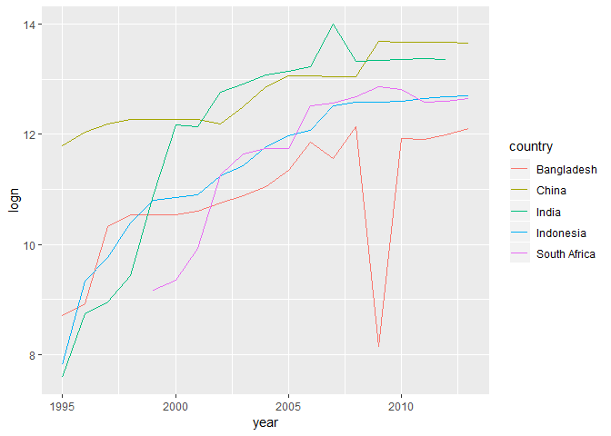

chapter 12
================
Bryan Shalloway
Last updated: 2018-08-10

*Make sure the following packages are installed:*

# ch. 12: Tidy data

  - `spread`: pivot, e.g. `spread(iris, Species)`
  - `gather`: unpivot, e.g. `gather(mpg, drv, class, key =
    "drive_or_class", value = "value")`
  - `separate`: one column into many, e.g. `separate(table3, rate, into
    = c("cases", "population"), sep = "/")`
      - default uses non-alphanumeric character as `sep`, can also use
        number to separate by width
  - `extract` similar to separate but specify what to pull-out rather
    than what to split by
  - `unite` inverse of separate

<!-- end list -->

``` r
# example distinguishing separate, extract, unite
tibble(x = c("a,b,c", "d,e,f", "h,i,j", "k,l,m")) %>% 
  separate(x, c("one", "two", "three"), sep = ",", remove = FALSE) %>% 
  unite(one, two, three, col = "x2", sep = ",", remove = FALSE) %>% 
  extract(x2, into = c("a", "b", "c"), regex = "([a-z]+),([a-z]+),([a-z]+)", remove = FALSE)
```

    ## # A tibble: 4 x 8
    ##   x     x2    a     b     c     one   two   three
    ##   <chr> <chr> <chr> <chr> <chr> <chr> <chr> <chr>
    ## 1 a,b,c a,b,c a     b     c     a     b     c    
    ## 2 d,e,f d,e,f d     e     f     d     e     f    
    ## 3 h,i,j h,i,j h     i     j     h     i     j    
    ## 4 k,l,m k,l,m k     l     m     k     l     m

  - `complete()` takes a set of columns, and finds all unique
    combinations. It then ensures the original dataset contains all
    those values, filling in explicit NAs where necessary.
  - `fill()` takes a set of columns where you want missing values to be
    replaced by the most recent non-missing value (sometimes called last
    observation carried forward).

<!-- end list -->

``` r
# examples of complete and fill
treatment <- tribble(
  ~ person,           ~ treatment, ~response,
  "Derrick Whitmore", 1,           7,
  NA,                 2,           10,
  NA,                 3,           9,
  "Katherine Burke",  1,           4
)

treatment %>% 
  fill(person)
```

    ## # A tibble: 4 x 3
    ##   person           treatment response
    ##   <chr>                <dbl>    <dbl>
    ## 1 Derrick Whitmore         1        7
    ## 2 Derrick Whitmore         2       10
    ## 3 Derrick Whitmore         3        9
    ## 4 Katherine Burke          1        4

``` r
treatment %>% 
  fill(person) %>% 
  complete(person, treatment)
```

    ## # A tibble: 6 x 3
    ##   person           treatment response
    ##   <chr>                <dbl>    <dbl>
    ## 1 Derrick Whitmore         1        7
    ## 2 Derrick Whitmore         2       10
    ## 3 Derrick Whitmore         3        9
    ## 4 Katherine Burke          1        4
    ## 5 Katherine Burke          2       NA
    ## 6 Katherine Burke          3       NA

## 12.2: Tidy data

### 12.2.1.

*1. Using prose, describe how the variables and observations are
organised in each of the sample tables.*

*2. Compute the rate for table2, and table4a + table4b. You will need to
perform four operations:*

1.  Extract the number of TB cases per country per year.  
2.  Extract the matching population per country per year.  
3.  Divide cases by population, and multiply by 10000.  
4.  Store back in the appropriate place.  
5.  Which representation is easiest to work with? Which is hardest? Why?

*3. Recreate the plot showing change in cases over time using table2
instead of table1. What do you need to do first?*

## 12.3: Spreading and gathering

### 12.3.3.

*1. Why are gather() and spread() not perfectly symmetrical?*  
Carefully consider the following example:

``` r
stocks <- tibble(
  year   = c(2015, 2015, 2016, 2016),
  half  = c(   1,    2,     1,    2),
  return = c(1.88, 0.59, 0.92, 0.17)
)

stocks %>% 
  spread(year, return) %>% 
  gather("year", "return", `2015`:`2016`)
```

    ## # A tibble: 4 x 3
    ##    half year  return
    ##   <dbl> <chr>  <dbl>
    ## 1     1 2015    1.88
    ## 2     2 2015    0.59
    ## 3     1 2016    0.92
    ## 4     2 2016    0.17

(Hint: look at the variable types and think about column names.)

  - are not perfectly symmetrical, because type for key = changes to
    character when using `gather` – column type information is not
    transferred.  

  - position of columns change as well

  - Both spread() and gather() have a convert argument. What does it
    do?\*

Use this to automatically change `key` column type, otherwise will
default in `gather` for example to become a character type.

*2. Why does this code fail?*

``` r
table4a %>% 
  gather(1999, 2000, key = "year", value = "cases")
```

    ## Error in inds_combine(.vars, ind_list): Position must be between 0 and n

Need backticks on year column names

``` r
table4a %>% 
  gather(`1999`, `2000`, key = "year", value = "cases")
```

    ## # A tibble: 6 x 3
    ##   country     year   cases
    ##   <chr>       <chr>  <int>
    ## 1 Afghanistan 1999     745
    ## 2 Brazil      1999   37737
    ## 3 China       1999  212258
    ## 4 Afghanistan 2000    2666
    ## 5 Brazil      2000   80488
    ## 6 China       2000  213766

*3. Why does spreading this tibble fail? How could you add a new column
to fix the problem?*

``` r
people <- tribble(
  ~name,             ~key,    ~value,
  #-----------------|--------|------
  "Phillip Woods",   "age",       45,
  "Phillip Woods",   "height",   186,
  "Phillip Woods",   "age",       50,
  "Jessica Cordero", "age",       37,
  "Jessica Cordero", "height",   156
)

people %>% 
  spread(key = "key", value = "value")
```

    ## Error: Duplicate identifiers for rows (1, 3)

Fails because you have more than one age for philip woods, could add a
unique ID column and it will work.

``` r
people %>% 
  mutate(id = 1:n()) %>% 
  spread(key = "key", value = "value")
```

    ## # A tibble: 5 x 4
    ##   name               id   age height
    ##   <chr>           <int> <dbl>  <dbl>
    ## 1 Jessica Cordero     4    37     NA
    ## 2 Jessica Cordero     5    NA    156
    ## 3 Phillip Woods       1    45     NA
    ## 4 Phillip Woods       2    NA    186
    ## 5 Phillip Woods       3    50     NA

*4. Tidy the simple tibble below. Do you need to spread or gather it?
What are the variables?*

``` r
preg <- tribble(
  ~pregnant, ~male, ~female,
  "yes",     NA,    10,
  "no",      20,    12
)
```

Need to gather `gender`

``` r
preg %>% 
  gather(male, female, key="gender", value="Number")
```

    ## # A tibble: 4 x 3
    ##   pregnant gender Number
    ##   <chr>    <chr>   <dbl>
    ## 1 yes      male       NA
    ## 2 no       male       20
    ## 3 yes      female     10
    ## 4 no       female     12

## 12.4: Separating and uniting

### 12.4.3.

*1. What do the extra and fill arguments do in separate()? Experiment
with the various options for the following two toy datasets.*

``` r
tibble(x = c("a,b,c", "d,e,f,g", "h,i,j")) %>% 
  separate(x, c("one", "two", "three"))
```

    ## Warning: Expected 3 pieces. Additional pieces discarded in 1 rows [2].

    ## # A tibble: 3 x 3
    ##   one   two   three
    ##   <chr> <chr> <chr>
    ## 1 a     b     c    
    ## 2 d     e     f    
    ## 3 h     i     j

``` r
tibble(x = c("a,b,c", "d,e", "f,g,i")) %>% 
  separate(x, c("one", "two", "three"))
```

    ## Warning: Expected 3 pieces. Missing pieces filled with `NA` in 1 rows [2].

    ## # A tibble: 3 x 3
    ##   one   two   three
    ##   <chr> <chr> <chr>
    ## 1 a     b     c    
    ## 2 d     e     <NA> 
    ## 3 f     g     i

`fill` determines what to do when there are too few arguments, default
is to fill right arguments with `NA` can change this though.

``` r
tribble(~a,~b,
        "so it goes","hello,you,are") %>% 
  separate(b, into=c("e","f","g", "h"), sep=",", fill = "left")
```

    ## # A tibble: 1 x 5
    ##   a          e     f     g     h    
    ##   <chr>      <chr> <chr> <chr> <chr>
    ## 1 so it goes <NA>  hello you   are

`extra` determines what to do when you have more splits than you do
`into` spaces. Default is to drop extra  
Can change to limit num of splits to length of `into` with value “merge”

``` r
tribble(~a,~b,
        "so it goes","hello,you,are") %>% 
  separate(b, into=c("e","f"), sep=",", extra="merge")
```

    ## # A tibble: 1 x 3
    ##   a          e     f      
    ##   <chr>      <chr> <chr>  
    ## 1 so it goes hello you,are

*2. Both unite() and separate() have a remove argument. What does it do?
Why would you set it to FALSE?*

`remove = FALSE` allows you to specify to keep the input column(s)

``` r
tibble(x = c("a,b,c", "d,e,f", "h,i,j", "k,l,m")) %>% 
  separate(x, c("one", "two", "three"), remove = FALSE) %>% 
  unite(one, two, three, col = "x2", sep = ",", remove = FALSE)
```

    ## # A tibble: 4 x 5
    ##   x     x2    one   two   three
    ##   <chr> <chr> <chr> <chr> <chr>
    ## 1 a,b,c a,b,c a     b     c    
    ## 2 d,e,f d,e,f d     e     f    
    ## 3 h,i,j h,i,j h     i     j    
    ## 4 k,l,m k,l,m k     l     m

*3. Compare and contrast separate() and extract(). Why are there three
variations of separation (by position, by separator, and with groups),
but only one unite?*

`extract` is like `separate` but provide what to capture rather than
what to split by as in `regex` instead of `sep`.

``` r
df <- data.frame(x = c("a-b", "a-d", "b-c", "d&e", NA), y = 1)

df %>% 
  extract(col = x, into = c("1st", "2nd"), regex = "([A-z]).([A-z])")
```

    ##    1st  2nd y
    ## 1    a    b 1
    ## 2    a    d 1
    ## 3    b    c 1
    ## 4    d    e 1
    ## 5 <NA> <NA> 1

``` r
df %>% 
  separate(col = x, into = c("1st", "2nd"), sep = "[^A-z]")
```

    ##    1st  2nd y
    ## 1    a    b 1
    ## 2    a    d 1
    ## 3    b    c 1
    ## 4    d    e 1
    ## 5 <NA> <NA> 1

Because there are many ways to split something up, but only one way to
bring multiple things together…

## 12.5: missing values

### 12.5.1.

*1. Compare and contrast the fill arguments to spread() and complete().*

Both create open cells by filling out those that are not currently in
the dataset, `complete` though does it by adding rows of iterations not
included, whereas `spread` does it by the process of spreading out
fields and naturally generating values that did not have row values
previously. The`fill` in each specifies what value should go into these
created cells.

``` r
treatment2 <- tribble(
  ~ person,           ~ treatment, ~response,
  "Derrick Whitmore", 1,           7,
  "Derrick Whitmore", 2,           10,
  "Derrick Whitmore", 3,           9,
  "Katherine Burke",  1,           4
)

treatment2 %>% 
  complete(person, treatment, fill = list(response = 0))
```

    ## # A tibble: 6 x 3
    ##   person           treatment response
    ##   <chr>                <dbl>    <dbl>
    ## 1 Derrick Whitmore         1        7
    ## 2 Derrick Whitmore         2       10
    ## 3 Derrick Whitmore         3        9
    ## 4 Katherine Burke          1        4
    ## 5 Katherine Burke          2        0
    ## 6 Katherine Burke          3        0

``` r
treatment2 %>% 
  spread(key = treatment, value = response, fill = 0)
```

    ## # A tibble: 2 x 4
    ##   person             `1`   `2`   `3`
    ##   <chr>            <dbl> <dbl> <dbl>
    ## 1 Derrick Whitmore     7    10     9
    ## 2 Katherine Burke      4     0     0

*2. What does the direction argument to fill() do?*

Let’s you fill either up or down. E.g. below is filling up example.

``` r
treatment <- tribble(
  ~ person,           ~ treatment, ~response,
  "Derrick Whitmore", 1,           7,
  NA,                 2,           10,
  NA,                 3,           9,
  "Katherine Burke",  1,           4
)

treatment %>% 
  fill(person, .direction = "up")
```

    ## # A tibble: 4 x 3
    ##   person           treatment response
    ##   <chr>                <dbl>    <dbl>
    ## 1 Derrick Whitmore         1        7
    ## 2 Katherine Burke          2       10
    ## 3 Katherine Burke          3        9
    ## 4 Katherine Burke          1        4

## 12.6 Case Study

### 12.6.1.

*1. In this case study I set na.rm = TRUE just to make it easier to
check that we had the correct values. Is this reasonable? Think about
how missing values are represented in this dataset. Are there implicit
missing values? What’s the difference between an NA and zero?*

In this case it’s reasonable, an `NA` perhaps means the metric wasn’t
recorded in that year, whereas 0 means it was recorded but there were 0
cases.

Implicit missing values represented by say Afghanistan not having any
reported cases for females.

*2. What happens if you neglect the mutate() step? (mutate(key =
stringr::str\_replace(key, “newrel”, “new\_rel”)))*

You would have had one less column, so ‘newtype’ would have been on
column, rather than these splitting.

*3. I claimed that iso2 and iso3 were redundant with country. Confirm
this claim.*

``` r
who %>% 
  select(1:3) %>% 
  distinct() %>% 
  count()
```

    ## # A tibble: 1 x 1
    ##       n
    ##   <int>
    ## 1   219

``` r
who %>% 
  select(1:3) %>% 
  distinct() %>% 
  unite(country, iso2, iso3, col = "country_combined") %>% 
  count()
```

    ## # A tibble: 1 x 1
    ##       n
    ##   <int>
    ## 1   219

Both of the above are the same length.

*4. For each country, year, and sex compute the total number of cases of
TB. Make an informative visualisation of the data.*

``` r
who_present <- who %>%
  gather(code, value, new_sp_m014:newrel_f65, na.rm = TRUE) %>% 
  mutate(code = stringr::str_replace(code, "newrel", "new_rel")) %>%
  separate(code, c("new", "var", "sexage")) %>% 
  select(-new, -iso2, -iso3) %>% 
  separate(sexage, c("sex", "age"), sep = 1)
```

``` r
who_present %>% 
  group_by(sex, year, country) %>% 
  summarise(mean=mean(value)) %>% 
  ggplot(aes(x=year, y=mean, colour=sex))+
  geom_point()+
  geom_jitter()
```

<!-- -->

``` r
#ratio of female tb cases over time
who_present %>% 
  group_by(sex, year) %>% 
  summarise(meansex=sum(value)) %>%
  ungroup() %>% 
  group_by(year) %>% 
  mutate(tot=sum(meansex)) %>% 
  ungroup() %>% 
  mutate(ratio=meansex/tot) %>% 
  filter(sex=="f") %>% 
  ggplot(aes(x=year, y=ratio, colour=sex))+
  geom_line()
```

<!-- -->

``` r
#countries with the most outbreaks
who_present %>%
  group_by(country, year) %>% 
  summarise(n=sum(value)) %>% 
  ungroup() %>% 
  group_by(country) %>% 
  mutate(total_country=sum(n)) %>% 
  filter(total_country>1000000) %>% 
  ggplot(aes(x=year,y=n,colour=country))+
  geom_line()
```

<!-- -->

``` r
#countries with the most split by gender as well
who_present %>%
  group_by(country, sex, year) %>% 
  summarise(n=sum(value)) %>% 
  ungroup() %>% 
  group_by(country) %>% 
  mutate(total_country=sum(n)) %>% 
  filter(total_country>1000000) %>% 
  ggplot(aes(x=year,y=n,colour=sex))+
  geom_line()+
  facet_wrap(~country)
```

<!-- -->

``` r
#take log and summarise
who_present %>%
  group_by(country, year) %>% 
  summarise(n=sum(value), logn=log(n)) %>% 
  ungroup() %>% 
  group_by(country) %>% 
  mutate(total_c=sum(n)) %>% 
  filter(total_c>1000000) %>% 
  ggplot(aes(x=year,y=logn, colour=country))+
  geom_line(show.legend=TRUE)
```

<!-- -->

``` r
#average # of countries with more female TB cases
who_present %>%
  group_by(country, year, sex) %>% 
  summarise(n=sum(value), logn=log(n)) %>% 
  ungroup() %>% 
  group_by(country, year) %>% 
  mutate(total_c=sum(n)) %>%
  ungroup() %>% 
  mutate(perc_gender=n/total_c, femalemore=ifelse(perc_gender>.5,1,0)) %>% 
  filter(sex=="f") %>% 
  group_by(year) %>% 
  summarise(summaryfem=mean(femalemore,na.rm=TRUE )) %>% 
  ggplot(aes(x=year,y=summaryfem))+
  geom_line()
```

<!-- -->
