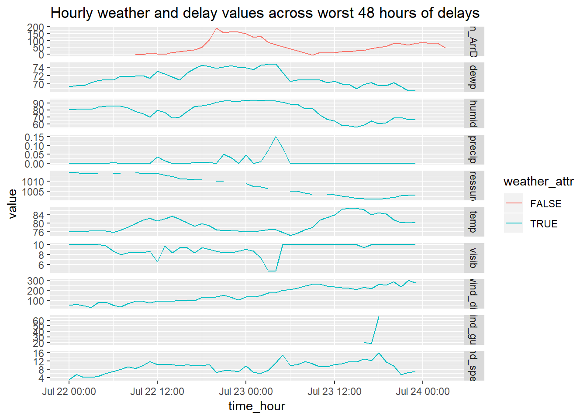
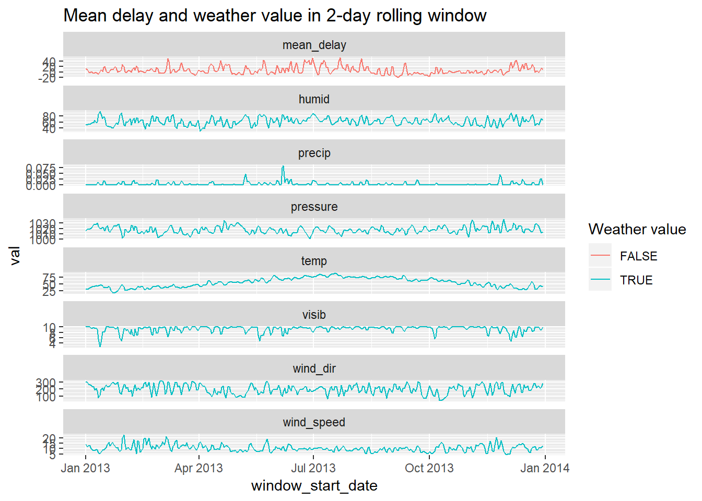

*Make sure the following packages are installed:*  


# ch. 13: Relational data

> "The relations of three or more tables are always a property of the relations between each pairs."  

* Three families of verbs in relational data: *

* __Mutating joins__, which add new variables to one data frame from matching
  observations in another.
    + `inner_join`: match when equal
    + `left_join`: keep all observations in table in 1st arg
    + `right_join`: keep all observations in table in 2nd arg
    + `full_join`: keep all observations in table in 1st and 2nd arg
* __Filtering joins__, which filter observations from one data frame based on
  whether or not they match an observation in the other table.
    + `semi_join(x, y)` __keeps__ all observations in `x` that have a match in `y`.
    + `anti_join(x, y)` __drops__ all observations in `x` that have a match in `y`.
* __Set operations__, which treat observations as if they were set elements.
    + `intersect(x, y)`: return only observations in both `x` and `y` (when inputs are a df, is comparing across all values in a row).
    + `union(x, y)`: return unique observations in `x` and `y`.
    + `setdiff(x, y)`: return observations in `x`, but not in `y`.

`base::merge()` can perform all four types of mutating join:  

dplyr              | merge
-------------------|-------------------------------------------
`inner_join(x, y)` | `merge(x, y)`
`left_join(x, y)`  | `merge(x, y, all.x = TRUE)`
`right_join(x, y)` | `merge(x, y, all.y = TRUE)`,
`full_join(x, y)`  | `merge(x, y, all.x = TRUE, all.y = TRUE)`

SQL is the inspiration for dplyr's conventions, so the translation is straightforward:

dplyr                        | SQL
-----------------------------|-------------------------------------------
`inner_join(x, y, by = "z")` | `SELECT * FROM x INNER JOIN y USING (z)`
`left_join(x, y, by = "z")`  | `SELECT * FROM x LEFT OUTER JOIN y USING (z)`
`right_join(x, y, by = "z")` | `SELECT * FROM x RIGHT OUTER JOIN y USING (z)`
`full_join(x, y, by = "z")`  | `SELECT * FROM x FULL OUTER JOIN y USING (z)`

## 13.2 nycflights13


```r
flights
airlines
airports
planes
weather
```


### 13.2.1

1.  *Imagine you wanted to draw (approximately) the route each plane flies from*
    *its origin to its destination. What variables would you need? What tables*
    *would you need to combine?*  
    
    To draw a line from origin to destination, I need the lat lon points from airports` as well as the dest and origin variables from `flights`.
    
    
1.  *I forgot to draw the relationship between `weather` and `airports`.*
    *What is the relationship and how should it appear in the diagram?*
    
    `origin` from `weather connects to `faa` from `airports` in a many to one relationship
    

1.  *`weather` only contains information for the origin (NYC) airports. If*
    *it contained weather records for all airports in the USA, what additional*
    *relation would it define with `flights`?*  
    
    It would connect to `dest`.

1.  *We know that some days of the year are "special", and fewer people than*
    *usual fly on them. How might you represent that data as a data frame?*
    *What would be the primary keys of that table? How would it connect to the*
    *existing tables?*
    
    Make a set of days that are less popular and have these dates connect by month and day
    
## 13.3 Keys

### 13.3.1

1.  *Add a surrogate key to `flights`.*

    
    ```r
    flights %>%
      mutate(surrogate_key = row_number()) %>% 
      glimpse()
    ```
    
    ```
    ## Observations: 336,776
    ## Variables: 20
    ## $ year           <int> 2013, 2013, 2013, 2013, 2013, 2013, 2013, 2013,...
    ## $ month          <int> 1, 1, 1, 1, 1, 1, 1, 1, 1, 1, 1, 1, 1, 1, 1, 1,...
    ## $ day            <int> 1, 1, 1, 1, 1, 1, 1, 1, 1, 1, 1, 1, 1, 1, 1, 1,...
    ## $ dep_time       <int> 517, 533, 542, 544, 554, 554, 555, 557, 557, 55...
    ## $ sched_dep_time <int> 515, 529, 540, 545, 600, 558, 600, 600, 600, 60...
    ## $ dep_delay      <dbl> 2, 4, 2, -1, -6, -4, -5, -3, -3, -2, -2, -2, -2...
    ## $ arr_time       <int> 830, 850, 923, 1004, 812, 740, 913, 709, 838, 7...
    ## $ sched_arr_time <int> 819, 830, 850, 1022, 837, 728, 854, 723, 846, 7...
    ## $ arr_delay      <dbl> 11, 20, 33, -18, -25, 12, 19, -14, -8, 8, -2, -...
    ## $ carrier        <chr> "UA", "UA", "AA", "B6", "DL", "UA", "B6", "EV",...
    ## $ flight         <int> 1545, 1714, 1141, 725, 461, 1696, 507, 5708, 79...
    ## $ tailnum        <chr> "N14228", "N24211", "N619AA", "N804JB", "N668DN...
    ## $ origin         <chr> "EWR", "LGA", "JFK", "JFK", "LGA", "EWR", "EWR"...
    ## $ dest           <chr> "IAH", "IAH", "MIA", "BQN", "ATL", "ORD", "FLL"...
    ## $ air_time       <dbl> 227, 227, 160, 183, 116, 150, 158, 53, 140, 138...
    ## $ distance       <dbl> 1400, 1416, 1089, 1576, 762, 719, 1065, 229, 94...
    ## $ hour           <dbl> 5, 5, 5, 5, 6, 5, 6, 6, 6, 6, 6, 6, 6, 6, 6, 5,...
    ## $ minute         <dbl> 15, 29, 40, 45, 0, 58, 0, 0, 0, 0, 0, 0, 0, 0, ...
    ## $ time_hour      <dttm> 2013-01-01 05:00:00, 2013-01-01 05:00:00, 2013...
    ## $ surrogate_key  <int> 1, 2, 3, 4, 5, 6, 7, 8, 9, 10, 11, 12, 13, 14, ...
    ```


1.  *Identify the keys in the following datasets*

    1.  `Lahman::Batting`: player, year, stint
    
    
    ```r
    Lahman::Batting %>% 
      count(playerID, yearID, stint) %>% 
      filter(n > 1)
    ```
    
    ```
    ## # A tibble: 0 x 4
    ## # ... with 4 variables: playerID <chr>, yearID <int>, stint <int>, n <int>
    ```
    
    
    1.  `babynames::babynames`: name, sex, year
    
    ```r
    babynames::babynames %>% 
      count(name, sex, year) %>% 
      filter(n > 1)
    ```
    
    ```
    ## # A tibble: 0 x 4
    ## # ... with 4 variables: name <chr>, sex <chr>, year <dbl>, n <int>
    ```
    
    
    1.  `nasaweather::atmos`: lat, long, year, month
    
    
    ```r
    nasaweather::atmos %>% 
      count(lat, long, year, month) %>% 
      filter(n > 1)
    ```
    
    ```
    ## # A tibble: 0 x 5
    ## # ... with 5 variables: lat <dbl>, long <dbl>, year <int>, month <int>,
    ## #   n <int>
    ```
    
    1.  `fueleconomy::vehicles`: id
    
    
    ```r
    fueleconomy::vehicles %>% 
      count(id) %>% 
      filter(n > 1)
    ```
    
    ```
    ## # A tibble: 0 x 2
    ## # ... with 2 variables: id <int>, n <int>
    ```
    
    1.  `ggplot2::diamonds`: needs surrogate
    
    
    ```r
    diamonds %>% 
      count(x, y, z, depth, table, carat, cut, color, price, clarity ) %>% 
      filter(n > 1)
    ```
    
    ```
    ## # A tibble: 143 x 11
    ##        x     y     z depth table carat cut       color price clarity     n
    ##    <dbl> <dbl> <dbl> <dbl> <dbl> <dbl> <ord>     <ord> <int> <ord>   <int>
    ##  1  0     0     0     64.1    60  0.71 Good      F      2130 SI2         2
    ##  2  4.23  4.26  2.69  63.4    57  0.3  Good      J       394 VS1         2
    ##  3  4.26  4.23  2.69  63.4    57  0.3  Very Good J       506 VS1         2
    ##  4  4.26  4.29  2.66  62.2    57  0.3  Ideal     H       450 SI1         2
    ##  5  4.27  4.28  2.66  62.2    57  0.3  Ideal     H       450 SI1         2
    ##  6  4.29  4.31  2.71  63      55  0.3  Very Good G       526 VS2         2
    ##  7  4.29  4.31  2.73  63.5    56  0.31 Good      D       571 SI1         2
    ##  8  4.31  4.28  2.67  62.2    58  0.3  Premium   D       709 SI1         2
    ##  9  4.31  4.29  2.71  63      55  0.3  Ideal     G       675 VS2         2
    ## 10  4.31  4.29  2.73  63.5    56  0.31 Very Good D       732 SI1         2
    ## # ... with 133 more rows
    ```
    
    ```r
    diamonds %>% 
      mutate(surrogate_id = row_number())
    ```
    
    ```
    ## # A tibble: 53,940 x 11
    ##    carat cut   color clarity depth table price     x     y     z
    ##    <dbl> <ord> <ord> <ord>   <dbl> <dbl> <int> <dbl> <dbl> <dbl>
    ##  1 0.23  Ideal E     SI2      61.5    55   326  3.95  3.98  2.43
    ##  2 0.21  Prem~ E     SI1      59.8    61   326  3.89  3.84  2.31
    ##  3 0.23  Good  E     VS1      56.9    65   327  4.05  4.07  2.31
    ##  4 0.290 Prem~ I     VS2      62.4    58   334  4.2   4.23  2.63
    ##  5 0.31  Good  J     SI2      63.3    58   335  4.34  4.35  2.75
    ##  6 0.24  Very~ J     VVS2     62.8    57   336  3.94  3.96  2.48
    ##  7 0.24  Very~ I     VVS1     62.3    57   336  3.95  3.98  2.47
    ##  8 0.26  Very~ H     SI1      61.9    55   337  4.07  4.11  2.53
    ##  9 0.22  Fair  E     VS2      65.1    61   337  3.87  3.78  2.49
    ## 10 0.23  Very~ H     VS1      59.4    61   338  4     4.05  2.39
    ## # ... with 53,930 more rows, and 1 more variable: surrogate_id <int>
    ```
    
    

1.  *Draw a diagram illustrating the connections between the `Batting`,*
    *`Master`, and `Salaries` tables in the Lahman package. Draw another diagram*
    *that shows the relationship between `Master`, `Managers`, `AwardsManagers`.*  
    
    For each dataset show just the `head(1)`
    
    Combine by playerid
    
    ```
    ##    playerID yearID stint teamID lgID G AB R H X2B X3B HR RBI SB CS BB SO
    ## 1 abercda01   1871     1    TRO   NA 1  4 0 0   0   0  0   0  0  0  0  0
    ##   IBB HBP SH SF GIDP
    ## 1  NA  NA NA NA   NA
    ```
    
    ```
    ##    playerID birthYear birthMonth birthDay birthCountry birthState
    ## 1 aardsda01      1981         12       27          USA         CO
    ##   birthCity deathYear deathMonth deathDay deathCountry deathState
    ## 1    Denver        NA         NA       NA         <NA>       <NA>
    ##   deathCity nameFirst nameLast   nameGiven weight height bats throws
    ## 1      <NA>     David  Aardsma David Allan    215     75    R      R
    ##        debut  finalGame  retroID   bbrefID deathDate  birthDate
    ## 1 2004-04-06 2015-08-23 aardd001 aardsda01      <NA> 1981-12-27
    ```
    
    
    Combine by playerID, yearID
    
    ```
    ##    playerID yearID stint teamID lgID G AB R H X2B X3B HR RBI SB CS BB SO
    ## 1 abercda01   1871     1    TRO   NA 1  4 0 0   0   0  0   0  0  0  0  0
    ##   IBB HBP SH SF GIDP
    ## 1  NA  NA NA NA   NA
    ```
    
    ```
    ##   yearID teamID lgID  playerID salary
    ## 1   1985    ATL   NL barkele01 870000
    ```
    
    Combine by playerID
    
    ```
    ##    playerID birthYear birthMonth birthDay birthCountry birthState
    ## 1 aardsda01      1981         12       27          USA         CO
    ##   birthCity deathYear deathMonth deathDay deathCountry deathState
    ## 1    Denver        NA         NA       NA         <NA>       <NA>
    ##   deathCity nameFirst nameLast   nameGiven weight height bats throws
    ## 1      <NA>     David  Aardsma David Allan    215     75    R      R
    ##        debut  finalGame  retroID   bbrefID deathDate  birthDate
    ## 1 2004-04-06 2015-08-23 aardd001 aardsda01      <NA> 1981-12-27
    ```
    
    ```
    ##   yearID teamID lgID  playerID salary
    ## 1   1985    ATL   NL barkele01 870000
    ```
    
    Connect by playerID
    
    ```
    ##    playerID birthYear birthMonth birthDay birthCountry birthState
    ## 1 aardsda01      1981         12       27          USA         CO
    ##   birthCity deathYear deathMonth deathDay deathCountry deathState
    ## 1    Denver        NA         NA       NA         <NA>       <NA>
    ##   deathCity nameFirst nameLast   nameGiven weight height bats throws
    ## 1      <NA>     David  Aardsma David Allan    215     75    R      R
    ##        debut  finalGame  retroID   bbrefID deathDate  birthDate
    ## 1 2004-04-06 2015-08-23 aardd001 aardsda01      <NA> 1981-12-27
    ```
    
    ```
    ##    playerID yearID teamID lgID inseason  G  W  L rank plyrMgr
    ## 1 wrighha01   1871    BS1   NA        1 31 20 10    3       Y
    ```
    
    Connect by playerID 
    
    ```
    ##    playerID birthYear birthMonth birthDay birthCountry birthState
    ## 1 aardsda01      1981         12       27          USA         CO
    ##   birthCity deathYear deathMonth deathDay deathCountry deathState
    ## 1    Denver        NA         NA       NA         <NA>       <NA>
    ##   deathCity nameFirst nameLast   nameGiven weight height bats throws
    ## 1      <NA>     David  Aardsma David Allan    215     75    R      R
    ##        debut  finalGame  retroID   bbrefID deathDate  birthDate
    ## 1 2004-04-06 2015-08-23 aardd001 aardsda01      <NA> 1981-12-27
    ```
    
    ```
    ##    playerID                   awardID yearID lgID  tie notes
    ## 1 larusto01 BBWAA Manager of the Year   1983   AL <NA>    NA
    ```

    *How would you characterise the relationship between the `Batting`,*
    *`Pitching`, and `Fielding` tables?*

    All connect by playerID, yearID, stint
    
    
    ```
    ##    playerID yearID stint teamID lgID G AB R H X2B X3B HR RBI SB CS BB SO
    ## 1 abercda01   1871     1    TRO   NA 1  4 0 0   0   0  0   0  0  0  0  0
    ##   IBB HBP SH SF GIDP
    ## 1  NA  NA NA NA   NA
    ```
    
    ```
    ##    playerID yearID stint teamID lgID W L G GS CG SHO SV IPouts  H ER HR BB
    ## 1 bechtge01   1871     1    PH1   NA 1 2 3  3  2   0  0     78 43 23  0 11
    ##   SO BAOpp  ERA IBB WP HBP BK BFP GF  R SH SF GIDP
    ## 1  1    NA 7.96  NA NA  NA  0  NA NA 42 NA NA   NA
    ```
    
    ```
    ##    playerID yearID stint teamID lgID POS G GS InnOuts PO A E DP PB WP SB
    ## 1 abercda01   1871     1    TRO   NA  SS 1 NA      NA  1 3 2  0 NA NA NA
    ##   CS ZR
    ## 1 NA NA
    ```
  
  
## 13.4 Mutating joins

> The most commonly used join is the left join: you use this whenever you look up additional data from another table, because it preserves the original observations even when there isn't a match.

### 13.4.6 

1.  *Compute the average delay by destination, then join on the `airports`*
    *data frame so you can show the spatial distribution of delays. Here's an*
    *easy way to draw a map of the United States:*  

    
    ```r
    airports %>%
      semi_join(flights, c("faa" = "dest")) %>%
      ggplot(aes(lon, lat)) +
      borders("state") +
      geom_point() +
      coord_quickmap()
    ```
  
    Now adding in colour by average delay.
  
    
    ```r
    flights %>% 
      semi_join(airports, c("dest" = "faa")) %>%
      group_by(dest) %>% 
      summarise(delay = mean(arr_delay, na.rm=TRUE)) %>% 
      left_join(airports, by = c("dest"="faa")) %>% 
      ggplot(aes(lon, lat)) +
      borders("state") +
      geom_point(aes(colour = delay)) +
      coord_quickmap()+
      scale_color_gradientn(colours = rainbow(3))
    ```
    
    
    

1.  *Add the location of the origin _and_ destination (i.e. the `lat` and `lon`)*
    *to `flights`.*
    
    
    ```r
    flights %>% 
      left_join(airports, by = c("dest" = "faa")) %>% 
      left_join(airports, by = c("origin" = "faa"), suffix=c("_dest", "_origin")) %>%
      select(flight, carrier, dest, lat_dest, lon_dest, origin, lat_origin, lon_origin)
    ```
    
    ```
    ## # A tibble: 336,776 x 8
    ##    flight carrier dest  lat_dest lon_dest origin lat_origin lon_origin
    ##     <int> <chr>   <chr>    <dbl>    <dbl> <chr>       <dbl>      <dbl>
    ##  1   1545 UA      IAH       30.0    -95.3 EWR          40.7      -74.2
    ##  2   1714 UA      IAH       30.0    -95.3 LGA          40.8      -73.9
    ##  3   1141 AA      MIA       25.8    -80.3 JFK          40.6      -73.8
    ##  4    725 B6      BQN       NA       NA   JFK          40.6      -73.8
    ##  5    461 DL      ATL       33.6    -84.4 LGA          40.8      -73.9
    ##  6   1696 UA      ORD       42.0    -87.9 EWR          40.7      -74.2
    ##  7    507 B6      FLL       26.1    -80.2 EWR          40.7      -74.2
    ##  8   5708 EV      IAD       38.9    -77.5 LGA          40.8      -73.9
    ##  9     79 B6      MCO       28.4    -81.3 JFK          40.6      -73.8
    ## 10    301 AA      ORD       42.0    -87.9 LGA          40.8      -73.9
    ## # ... with 336,766 more rows
    ```
    
    Note that the suffix allows you to tag names onto first and second table, hence why vector is length 2  
  
1.  *Is there a relationship between the age of a plane and its delays?*

    
    ```r
    group_by(flights, tailnum) %>% 
      summarise(avg_delay = mean(arr_delay, na.rm=TRUE), 
                n = n()) %>% 
      left_join(planes, by="tailnum") %>% 
      mutate(age = 2013 - year) %>% 
      filter(n > 50, age < 30) %>% 
      ggplot(aes(x = age, y = avg_delay))+
      ggbeeswarm::geom_quasirandom()+
      geom_smooth()
    ```
    
    
    
    Looks as though planes that are roughly 5 to 10 years old have higher delays... Let's look at same thing using boxplots.
    
    
    ```r
    group_by(flights, tailnum) %>% 
      summarise(avg_delay = mean(arr_delay, na.rm=TRUE), 
                n = n()) %>% 
      left_join(planes, by="tailnum") %>% 
      mutate(age = 2013 - year) %>% 
      filter(n > 50, age <= 30, age >= 0) %>% 
      ggplot()+
      geom_boxplot(aes(x = cut_width(age, 2, boundary = 0), y = avg_delay))+
      theme(axis.text.x = element_text(angle = 90, hjust = 1))
    ```
    
    
    
    Perhaps there is not an overall trend association between age and delays, though it seems that the particular group of planes in that time range seem to have delays than either newer or older planes. On the other hand, there does almost look to be a seasonality pattern -- though this may just be me seeing things... perhaps worth exploring more...
    
    A simple way to test for a non-linear relationship would be to discretize age and then pass it through an anova
    
    
    ```r
    nycflights13::flights %>% 
      select(arr_delay, tailnum) %>% 
      left_join(planes, by="tailnum") %>% 
      filter(!is.na(arr_delay)) %>% 
      mutate(age = 2013 - year,
             age_round_5 = (5 * age %/% 5) %>% as.factor()) %>% 
      with(aov(arr_delay ~ age_round_5)) %>% 
      summary()
    ```
    
    ```
    ##                 Df    Sum Sq Mean Sq F value Pr(>F)    
    ## age_round_5     11   1062080   96553   47.92 <2e-16 ***
    ## Residuals   273841 551756442    2015                   
    ## ---
    ## Signif. codes:  0 '***' 0.001 '**' 0.01 '*' 0.05 '.' 0.1 ' ' 1
    ## 53493 observations deleted due to missingness
    ```
    
    * There are weaknesses to using anova, but according to this test arrival delay does not appear to be randomly distributed across age
    * The reason for such a difference may be trivial or may be confounded by a more interesting pattern... but these are deeper questions

1.  *What weather conditions make it more likely to see a delay?*

    There are a lot of ways you could have approached this problem. Below, I look at the average weather value for each of the groups `FALSE`, `TRUE` and `Canceled` -- `FALSE` corresponding with non-delayed flights, `TRUE` with delayed flights and `Canceled` with flights that were canceled. If I were feeling fancy, I would have also added the standard errors on these...

    
    ```r
    flights_weath <- mutate(flights, delay_TF = dep_delay > 0) %>%
      separate(sched_dep_time, 
               into = c("hour_sched", "min_sched"), 
               sep = -3,
               remove = FALSE, 
               convert = TRUE) %>%
      left_join(weather, by = c("origin", "year","month", "day", "hour_sched"="hour"))
    
    flights_weath_gath <- flights_weath %>% 
      select(sched_dep_time, delay_TF, sched_dep_time, temp:visib) %>% 
      mutate(key = row_number()) %>% 
      gather(temp, dewp, humid, wind_dir, wind_speed, wind_gust, precip, pressure, visib, 
           key="weather", value="values") 
    
    flights_summarized <- flights_weath_gath %>% 
      group_by(weather, delay_TF) %>% 
      summarise(median_weath = median(values, na.rm = TRUE),
                mean_weath = mean(values, na.rm = TRUE), 
                sum_n = sum(!is.na(values))) %>% 
      ungroup() %>% 
      mutate(delay_TF = ifelse(is.na(delay_TF), "Canceled", delay_TF),
             delay_TF = forcats::as_factor(delay_TF, c(FALSE, TRUE, "Canceled")))
    
    flights_summarized %>%  
      ggplot(aes(x = delay_TF, y = mean_weath, fill = delay_TF))+
      geom_col()+
      facet_wrap(~weather, scales = "free_y")+
      theme(axis.text.x = element_text(angle = 90, hjust = 1))
    ```
    
    

    While precipitation is the largest difference, my guess is that the standard error on this would be much greater day to day because as you can see the values are very low, so it could be that a few cases with a lot of rain may tick it up, but it may be tough to actually use this as a predictor... 

1.  *What happened on June 13 2013? Display the spatial pattern of delays,*
    *and then use Google to cross-reference with the weather.*


    
    Looks like East coast is getting hammered and flights arriving from Atlanta an similar locations were very delayed. Guessing either weather issue, or problem in Atl or delta.
    
## 13.5 Filtering joins

### 13.5.1

1.  *What does it mean for a flight to have a missing `tailnum`?*

    All flights with a missing tailnum in the `flights` table were cancelled as you can see below.
    
    ```r
    flights %>% 
      count(is.na(tailnum), is.na(arr_delay))
    ```
    
    ```
    ## # A tibble: 3 x 3
    ##   `is.na(tailnum)` `is.na(arr_delay)`      n
    ##   <lgl>            <lgl>               <int>
    ## 1 FALSE            FALSE              327346
    ## 2 FALSE            TRUE                 6918
    ## 3 TRUE             TRUE                 2512
    ```

    *What do the tail numbers that don't have a matching record in `planes` have in common?*
    *(Hint: one variable explains ~90% of the problems.)*
    
    
    ```r
    flights %>% 
      anti_join(planes, by="tailnum") %>% 
      count(carrier, sort = TRUE)
    ```
    
    ```
    ## # A tibble: 10 x 2
    ##    carrier     n
    ##    <chr>   <int>
    ##  1 MQ      25397
    ##  2 AA      22558
    ##  3 UA       1693
    ##  4 9E       1044
    ##  5 B6        830
    ##  6 US        699
    ##  7 FL        187
    ##  8 DL        110
    ##  9 F9         50
    ## 10 WN         38
    ```
    
    ```r
    flights %>% 
      mutate(in_planes = tailnum %in% planes$tailnum) %>% 
      group_by(carrier) %>% 
      summarise(flights_inPlanes = sum(in_planes),
                n = n(),
                perc_inPlanes = flights_inPlanes / n) %>% 
      ungroup()
    ```
    
    ```
    ## # A tibble: 16 x 4
    ##    carrier flights_inPlanes     n perc_inPlanes
    ##    <chr>              <int> <int>         <dbl>
    ##  1 9E                 17416 18460        0.943 
    ##  2 AA                 10171 32729        0.311 
    ##  3 AS                   714   714        1     
    ##  4 B6                 53805 54635        0.985 
    ##  5 DL                 48000 48110        0.998 
    ##  6 EV                 54173 54173        1     
    ##  7 F9                   635   685        0.927 
    ##  8 FL                  3073  3260        0.943 
    ##  9 HA                   342   342        1     
    ## 10 MQ                  1000 26397        0.0379
    ## 11 OO                    32    32        1     
    ## 12 UA                 56972 58665        0.971 
    ## 13 US                 19837 20536        0.966 
    ## 14 VX                  5162  5162        1     
    ## 15 WN                 12237 12275        0.997 
    ## 16 YV                   601   601        1
    ```

    Some carriers do not have many of their tailnums data in the `planes` table. Anyone have more insight here?


1.  *Filter flights to only show flights with planes that have flown at least 100*
    *flights.*
    
    
    ```r
    planes_many <- flights %>% 
      count(tailnum, sort=TRUE) %>% 
      filter(n > 100)
    
    semi_join(flights, planes_many)
    ```
    
    ```
    ## # A tibble: 229,202 x 19
    ##     year month   day dep_time sched_dep_time dep_delay arr_time
    ##    <int> <int> <int>    <int>          <int>     <dbl>    <int>
    ##  1  2013     1     1      517            515         2      830
    ##  2  2013     1     1      533            529         4      850
    ##  3  2013     1     1      544            545        -1     1004
    ##  4  2013     1     1      554            558        -4      740
    ##  5  2013     1     1      555            600        -5      913
    ##  6  2013     1     1      557            600        -3      709
    ##  7  2013     1     1      557            600        -3      838
    ##  8  2013     1     1      558            600        -2      849
    ##  9  2013     1     1      558            600        -2      853
    ## 10  2013     1     1      558            600        -2      923
    ## # ... with 229,192 more rows, and 12 more variables: sched_arr_time <int>,
    ## #   arr_delay <dbl>, carrier <chr>, flight <int>, tailnum <chr>,
    ## #   origin <chr>, dest <chr>, air_time <dbl>, distance <dbl>, hour <dbl>,
    ## #   minute <dbl>, time_hour <dttm>
    ```

1.  *Combine `fueleconomy::vehicles` and `fueleconomy::common` to find only the*
    *records for the most common models.*
    
    
    ```r
    fueleconomy::vehicles %>% 
      semi_join(fueleconomy::common, by=c("make", "model"))
    ```
    
    ```
    ## # A tibble: 14,531 x 12
    ##       id make  model   year class trans drive   cyl displ fuel    hwy   cty
    ##    <int> <chr> <chr>  <int> <chr> <chr> <chr> <int> <dbl> <chr> <int> <int>
    ##  1  1833 Acura Integ~  1986 Subc~ Auto~ Fron~     4   1.6 Regu~    28    22
    ##  2  1834 Acura Integ~  1986 Subc~ Manu~ Fron~     4   1.6 Regu~    28    23
    ##  3  3037 Acura Integ~  1987 Subc~ Auto~ Fron~     4   1.6 Regu~    28    22
    ##  4  3038 Acura Integ~  1987 Subc~ Manu~ Fron~     4   1.6 Regu~    28    23
    ##  5  4183 Acura Integ~  1988 Subc~ Auto~ Fron~     4   1.6 Regu~    27    22
    ##  6  4184 Acura Integ~  1988 Subc~ Manu~ Fron~     4   1.6 Regu~    28    23
    ##  7  5303 Acura Integ~  1989 Subc~ Auto~ Fron~     4   1.6 Regu~    27    22
    ##  8  5304 Acura Integ~  1989 Subc~ Manu~ Fron~     4   1.6 Regu~    28    23
    ##  9  6442 Acura Integ~  1990 Subc~ Auto~ Fron~     4   1.8 Regu~    24    20
    ## 10  6443 Acura Integ~  1990 Subc~ Manu~ Fron~     4   1.8 Regu~    26    21
    ## # ... with 14,521 more rows
    ```
    

1.  *Find the 48 hours (over the course of the whole year) that have the worst*
    *delays. Cross-reference it with the `weather` data. Can you see any*
    *patterns?*
    
    
    First: Create two variables that together capture all 48 hour time windows across the year, at the day window of granularity (e.g. the time of day the flight takes off does not matter in establishing time windows for this example, only the day).
    Second: Gather these time windows into a single dataframe (note that this will increase the length of your data by ~364/365 * 100 %)
    Third: Group by `window_start_date` and calculate average `arr_delay` and related metrics.
    
    
    ```r
    delays_windows <- flights %>% 
      #First
      mutate(date_flight = lubridate::as_date(time_hour)) %>% 
      mutate(startdate_window1 = cut.Date(date_flight, "2 day")) %>% 
      mutate(date_flight2 = ifelse(!(date_flight == min(date_flight, na.rm = TRUE)), date_flight, NA),
             date_flight2 = lubridate::as_date(date_flight2),
             startdate_window2 = cut.Date(date_flight2, "2 day")) %>% 
      select(-date_flight, -date_flight2) %>% 
      #Second
      gather(startdate_window1, startdate_window2, key = "start_window", value = "window_start_date") %>% 
      filter(!is.na(window_start_date)) %>% 
      #Third
      group_by(window_start_date) %>% 
      summarise(num = n(),
                perc_cancelled = sum(is.na(arr_delay)) / n(),
                mean_delay = mean(arr_delay, na.rm = TRUE),
                perc_delay = mean(arr_delay > 0, na.rm = TRUE),
                total_delay_mins = sum(arr_delay, na.rm = TRUE)) %>% 
      ungroup()
    ```
    
    ```
    ## Warning: attributes are not identical across measure variables;
    ## they will be dropped
    ```
    
    ```r
    #don't worry about warning of 'attributes are not identical...', that is
    #because the cut function assigns attributes to the value, it's fine if
    #these are dropped here.
    ```
    
    Create tibble of worst 2-day period for mean `arr_delay`
    
    ```r
    WorstWindow <- delays_windows %>% 
      mutate(mean_delay_rank = dplyr::min_rank(-mean_delay)) %>% 
      filter(mean_delay_rank <= 1)
    
    WorstDates <- tibble(dates = c(lubridate::as_date(WorstWindow$window_start_date), lubridate::as_date(WorstWindow$window_start_date) + lubridate::duration(1, "days")))
    ```
    
    Ammend weather data so that weather is an average across three NY locations rather than seperate for each ^[note that a weighted average based on traffic would be more appropriate here because the `mean_delay` values will be weighted by number of flights going through each -- hopefully lack of substantial difference between locatioins means this won't be too impactful...]
    
    ```r
    weather_ammended <- weather %>% 
      mutate(time_hour = lubridate::make_datetime(year, month, day, hour)) %>% 
      select(-one_of("origin", "year", "month", "day", "hour")) %>% 
      group_by(time_hour) %>% 
      summarise_all(mean, na.rm = TRUE) %>% 
      ungroup()
    ```
    
    
    Filtering join to just times weather for worst 2 days
    
    ```r
    weather_worst <- weather_ammended %>%
      mutate(dates = as_date(time_hour)) %>% 
      semi_join(WorstDates)
    ```
    
    Plot of hourly weather values across 48 hour time windows.
    
    ```r
    weather_worst %>% 
      select(-dates) %>% 
      gather(temp:visib, key = "weather_type", value = "weather_value") %>% 
      ggplot(aes(x = time_hour, y = weather_value))+
      geom_line()+
      facet_grid(weather_type ~ ., scales = "free_y")+
      labs(title = 'Hourly weather values across worst 48 hours of delays')
    ```
    
    

    Patterns:  
      
    * `wind_gust` and `wind_speed` are the same.
    * See high level of colinearity in spikes and changes, e.g. increase in `precip` corresponds with decrease in `visib` and perhaps uptick in `wind_spee`
    
    Perhaps, we want to view how the average hourly weather values compare on the worst days to average weather days. Create summary of average hourly weather values for worst 48 hour period, for average period, and then append these and plot.
    
    ```r
    bind_rows(  
    weather_worst %>% 
      summarise_at(vars(temp:visib), mean, na.rm = TRUE) %>% 
      mutate(category = "weather on worst 48") %>% 
      gather(temp:visib, key = weather_type, value = weather_val)
    ,
    weather_ammended %>% 
      summarise_at(vars(temp:visib), mean, na.rm = TRUE) %>% 
      mutate(category = "weather on average") %>% 
      gather(temp:visib, key = weather_type, value = weather_val)
    ) %>% 
      ggplot(aes(x = category, y = weather_val, fill = category))+
      geom_col()+
      facet_wrap(~weather_type, scales = "free_y")+
      labs(title = "Hourly average weather values on worst 48 hour window of delays vs. hourly average weather across year", 
           caption = "Note that delays are based on mean(arr_delay, na.rm = TRUE)")
    ```
    
    

    For this to be the worst 48 hour period, the weather doesn't actually seem to be as extreme as I would have guessed.
    
    Let's add-in average `arr_delay` by planned departure time to this to see how the delay times throughout the day varied, to see if there was a surge or change in weather that led to the huge change in delays.
    
    
    ```r
    flights %>% 
      mutate(dates = as_date(time_hour)) %>% 
      semi_join(WorstDates) %>% 
      group_by(time_hour) %>% 
      summarise(value = mean(arr_delay, na.rm = TRUE)) %>% 
      ungroup() %>% 
      mutate(value_type = "Mean_ArrDelay") %>% 
      bind_rows(
      weather_worst %>% 
        select(-dates) %>% 
        gather(temp:visib, key = "value_type", value = "value")
      ) %>% 
      mutate(weather_attr = !(value_type == "Mean_ArrDelay"),
             value_type = forcats::fct_relevel(value_type, "Mean_ArrDelay")) %>% 
      ggplot(aes(x = time_hour, value, colour = weather_attr))+
      geom_line()+
      facet_grid(value_type ~ ., scales = "free_y")+
      labs(title = 'Hourly weather and delay values across worst 48 hours of delays')
    ```
    
    

    Maybe that first uptick in precipitation corresponded with the increase in delay... but still, looks extreme like an incident caused this. I cheched the news and it looks like a plane was crash landed onto the tarmac at one of the airports on this day https://en.wikipedia.org/wiki/Southwest_Airlines_Flight_345#cite_note-DMN_Aircraft_Totaled_20160808-4 , I checked the incident time and it occurred at 17:45 Jul 22, looks like it overlaps with the time we see the uptick in delays.  

    I show plots and models of 48 hour time windows in a variety of other contexts and detail in [Appendix]

1.  *What does `anti_join(flights, airports, by = c("dest" = "faa"))` tell you?*
    *What does `anti_join(airports, flights, by = c("faa" = "dest"))` tell you?*

    `anti_join(flights, airports, by = c("dest" = "faa"))` --tells me the flight dests missing an airport
    `anti_join(airports, flights, by = c("faa" = "dest"))` -- tells me the airports with no flights coming to them

1.  *You might expect that there's an implicit relationship between plane*
    *and airline, because each plane is flown by a single airline. Confirm*
    *or reject this hypothesis using the tools you've learned above.*

    
    ```r
    tail_carr <- flights %>% 
      filter(!is.na(tailnum)) %>% 
      distinct(carrier, tailnum) %>% 
      count(tailnum, sort=TRUE)
    
    tail_carr %>% 
      filter(n > 1)
    ```
    
    ```
    ## # A tibble: 17 x 2
    ##    tailnum     n
    ##    <chr>   <int>
    ##  1 N146PQ      2
    ##  2 N153PQ      2
    ##  3 N176PQ      2
    ##  4 N181PQ      2
    ##  5 N197PQ      2
    ##  6 N200PQ      2
    ##  7 N228PQ      2
    ##  8 N232PQ      2
    ##  9 N933AT      2
    ## 10 N935AT      2
    ## 11 N977AT      2
    ## 12 N978AT      2
    ## 13 N979AT      2
    ## 14 N981AT      2
    ## 15 N989AT      2
    ## 16 N990AT      2
    ## 17 N994AT      2
    ```
    
    
    You should reject that hypothesis, you can see that 17 `tailnum`s are duplicated on multiple carriers.  
    
    Below is code to show those 17 tailnums
    
    ```r
    flights %>% 
      distinct(carrier, tailnum) %>% 
      filter(!is.na(tailnum)) %>% 
      group_by(tailnum) %>% 
      mutate(n_tail = n()) %>%
      ungroup() %>% 
      filter(n_tail > 1) %>% 
      arrange(desc(n_tail), tailnum)
    ```
    
    ```
    ## # A tibble: 34 x 3
    ##    carrier tailnum n_tail
    ##    <chr>   <chr>    <int>
    ##  1 9E      N146PQ       2
    ##  2 EV      N146PQ       2
    ##  3 9E      N153PQ       2
    ##  4 EV      N153PQ       2
    ##  5 9E      N176PQ       2
    ##  6 EV      N176PQ       2
    ##  7 9E      N181PQ       2
    ##  8 EV      N181PQ       2
    ##  9 9E      N197PQ       2
    ## 10 EV      N197PQ       2
    ## # ... with 24 more rows
    ```

#Appendix

##13.5.1.4

Graph all of these metrics at once using roughly the same method as used on 13.4.6 #4.

```r
delays_windows %>% 
  gather(perc_cancelled, mean_delay, perc_delay, key = value_type, value = val) %>% 
  mutate(window_start_date = lubridate::as_date(window_start_date)) %>% 
  ggplot(aes(window_start_date, val))+
  geom_line()+
  facet_wrap(~value_type, scales = "free_y", ncol = 1)+
  scale_x_date(date_labels = "%b %d")+
  labs(title = 'Measures of delay across 48 hour time windows')
```


Create 48 hour windows for weather data. Follow exact same steps as above.


```r
weather_windows <- weather_ammended %>% 
  mutate(date_flight = lubridate::as_date(time_hour)) %>% 
  mutate(startdate_window1 = cut.Date(date_flight, "2 day")) %>% 
  mutate(date_flight2 = ifelse(!(date_flight == min(date_flight, na.rm = TRUE)), date_flight, NA),
         date_flight2 = lubridate::as_date(date_flight2),
         startdate_window2 = cut.Date(date_flight2, "2 day")) %>% 
  select(-date_flight, -date_flight2) %>% 
    #Second
  gather(startdate_window1, startdate_window2, key = "start_window", value = "window_start_date") %>% 
  filter(!is.na(window_start_date)) %>% 
  #Third
  group_by(window_start_date) %>%
  summarise_at(vars(temp:visib), mean, na.rm = TRUE) %>% 
  ungroup() %>% 
  select(-wind_gust)
```

```
## Warning: attributes are not identical across measure variables;
## they will be dropped
```

  Graph using same method as above...

```r
weather_windows %>% 
  gather(temp:visib, key = weather_type, value = val) %>% 
  mutate(window_start_date = lubridate::as_date(window_start_date)) %>% 
  ggplot(aes(x = window_start_date, y = val))+
  geom_line()+
  facet_wrap(~weather_type, ncol = 1, scales = "free_y")+
  scale_x_date(date_labels = "%b %d")+
  labs(title = 'Measures of weather across 48 hour time windows')
```


Connect delays and weather data


```r
weather_delay_joined <- left_join(delays_windows, weather_windows, by = "window_start_date") %>% 
  select(mean_delay, temp:visib, window_start_date) %>%
  select(-dewp) %>%  #is almost completely correlated with temp so removed one of them...
  na.omit()
```

Plot of 48 hour window of weather scores against mean delay keeping intact order of observations


```r
weather_delay_joined %>% 
  gather(mean_delay, temp:visib, key = value_type, value = val) %>% 
  mutate(window_start_date = lubridate::as_date(window_start_date),
         value_type = forcats::fct_relevel(value_type, "mean_delay")) %>%
  ggplot(aes(x = window_start_date, y = val, colour = ! value_type == "mean_delay"))+
  geom_line()+
  facet_wrap(~value_type, scales = "free_y", ncol = 1)+
  labs(colour = "Weather value", title = "Mean delay and weather value in 2-day rolling window")
```



Plot of mean_delay against weather type, each point representing a different 'window'

```r
weather_delay_joined %>% 
  gather(temp:visib, key = weather_type, value = weather_val) %>% 
  ggplot(aes(x = weather_val, y = mean_delay))+
  geom_point()+
  geom_smooth()+
  facet_wrap(~weather_type, scales = "free_x")
```


In a sense, these plots are not really valid as they obscure the fact that each point is not an independent observation (because there is a high level of association with w/e the value was on a single day with what it was in the previous day). E.g. mean_delay has a correlation of ~ 0.68 with prior days value as shown below... This is often ignored and we can also ignore it for now as it gets into time series and things we don't need to worry about for now... but somthing to be aware...


```r
weather_delay_joined %>% 
  mutate(mean_delay_lag = lag(mean_delay)) %>% 
  select(mean_delay, mean_delay_lag) %>% 
  na.omit() %>% 
  cor()
```

```
##                mean_delay mean_delay_lag
## mean_delay      1.0000000      0.6795631
## mean_delay_lag  0.6795631      1.0000000
```

Data is not Independent (as mentioned above) and many problems associated with this... but let's ignore this for now and just look at a few statisitics... 

Can see below that raw correlation of `mean_delay` is highest with humid. 


```r
weather_delay_joined %>%  
  select(-window_start_date) %>% 
  cor()
```

```
##             mean_delay        temp      humid    wind_dir  wind_speed
## mean_delay  1.00000000  0.08515338  0.4549140 -0.05371522  0.16262585
## temp        0.08515338  1.00000000  0.3036520 -0.25906906 -0.40160692
## humid       0.45491403  0.30365205  1.0000000 -0.51010505 -0.30383181
## wind_dir   -0.05371522 -0.25906906 -0.5101050  1.00000000  0.50039832
## wind_speed  0.16262585 -0.40160692 -0.3038318  0.50039832  1.00000000
## precip      0.36475598  0.02775525  0.4481898 -0.12853817  0.11176053
## pressure   -0.31716918 -0.23873857 -0.2363718 -0.26627495 -0.25716938
## visib      -0.38740156  0.12290097 -0.6647598  0.26307685  0.05275072
##                 precip   pressure       visib
## mean_delay  0.36475598 -0.3171692 -0.38740156
## temp        0.02775525 -0.2387386  0.12290097
## humid       0.44818978 -0.2363718 -0.66475984
## wind_dir   -0.12853817 -0.2662749  0.26307685
## wind_speed  0.11176053 -0.2571694  0.05275072
## precip      1.00000000 -0.2265636 -0.44400337
## pressure   -0.22656357  1.0000000  0.12032520
## visib      -0.44400337  0.1203252  1.00000000
```

When accounting for other variables, see relationship with windspeed seems to emerge as important...

```r
weather_delay_joined %>% 
  select(-window_start_date) %>% 
  lm(mean_delay ~ ., data = .) %>% 
  summary()
```

```
## 
## Call:
## lm(formula = mean_delay ~ ., data = .)
## 
## Residuals:
##     Min      1Q  Median      3Q     Max 
## -26.179  -7.581  -1.374   5.271  38.008 
## 
## Coefficients:
##              Estimate Std. Error t value Pr(>|t|)    
## (Intercept) 169.56872  132.07737   1.284   0.2000    
## temp          0.05460    0.04702   1.161   0.2464    
## humid         0.48158    0.09088   5.299 2.04e-07 ***
## wind_dir      0.01420    0.01376   1.032   0.3026    
## wind_speed    1.15641    0.25561   4.524 8.28e-06 ***
## precip      140.84141   78.84192   1.786   0.0749 .  
## pressure     -0.19722    0.12476  -1.581   0.1148    
## visib        -1.15009    0.80567  -1.427   0.1543    
## ---
## Signif. codes:  0 '***' 0.001 '**' 0.01 '*' 0.05 '.' 0.1 ' ' 1
## 
## Residual standard error: 11.64 on 356 degrees of freedom
## Multiple R-squared:  0.3332,	Adjusted R-squared:  0.3201 
## F-statistic: 25.42 on 7 and 356 DF,  p-value: < 2.2e-16
```

For a variety of reasons, especially in cases where your observations are not independent, you may want to evaluate how the change in an attribute relates to the change in another attribute. In the cases below I plot the diffs for example:  
  
*(average value on 2013-02-07 to 2013-02-08) - (average value on 2013-02-08 to 2013-02-09)*  
  
Note that the time windows are not distinct but overlap by 24 hours.

If doing a thorough account of time-series you would do a lot more than I show below...


```r
weather_delay_joined %>% 
  gather(mean_delay, temp:visib, key = value_type, value = val) %>% 
  mutate(window_start_date = lubridate::as_date(window_start_date),
         value_type = forcats::fct_relevel(value_type, "mean_delay")) %>%
  group_by(value_type) %>% 
  mutate(value_diff = val - lag(val)) %>% 
  ggplot(aes(x = window_start_date, y = value_diff, colour = !value_type == "mean_delay"))+
  geom_line()+
  facet_wrap(~value_type, scales = "free_y", ncol = 1)+
  labs(colour = "Weather value", title = "Plot of diffs in value")
```

```
## Warning: Removed 2 rows containing missing values (geom_path).
```


Let's plot these diffs as a scatter plot now (no longer looking at the order in which the observations emerged)

```r
weather_delay_joined %>% 
  gather(temp:visib, key = weather_type, value = val) %>% 
  group_by(weather_type) %>% 
  mutate(weather_diff = val - lag(val),
         delay_diff = mean_delay - lag(mean_delay)) %>% 
  ungroup() %>% 
  ggplot(aes(x = weather_diff, y = delay_diff))+
  geom_point()+
  geom_smooth()+
  facet_wrap(~weather_type, scales = "free_x")+
  labs(title = "scatter plot of diffs in value")
```

```
## Warning: Removed 7 rows containing non-finite values (stat_smooth).
```

```
## Warning: Removed 7 rows containing missing values (geom_point).
```


Let's look at the correlatioin and regression against these diffs

```r
diff_data <- weather_delay_joined %>% 
  gather(mean_delay, temp:visib, key = value_type, value = val) %>% 
  group_by(value_type) %>% 
  mutate(diff = val - lag(val)) %>% 
  ungroup() %>% 
  select(-val) %>% 
  spread(key = value_type, value = diff)

diff_data %>%
  select(-window_start_date) %>% 
  na.omit() %>% 
  cor()
```

```
##                 humid  mean_delay      precip   pressure         temp
## humid       1.0000000  0.54331654  0.48014091 -0.3427556  0.318534448
## mean_delay  0.5433165  1.00000000  0.51510649 -0.3247584  0.150601446
## precip      0.4801409  0.51510649  1.00000000 -0.3014413  0.074916969
## pressure   -0.3427556 -0.32475840 -0.30144131  1.0000000 -0.488629288
## temp        0.3185344  0.15060145  0.07491697 -0.4886293  1.000000000
## visib      -0.7393902 -0.53844191 -0.49795469  0.2721685 -0.206815887
## wind_dir   -0.4978895 -0.20689204 -0.20823801 -0.2443716 -0.003608694
## wind_speed -0.1964910  0.05738881  0.15742776 -0.3687487 -0.085437521
##                  visib     wind_dir  wind_speed
## humid      -0.73939024 -0.497889528 -0.19649100
## mean_delay -0.53844191 -0.206892045  0.05738881
## precip     -0.49795469 -0.208238012  0.15742776
## pressure    0.27216848 -0.244371617 -0.36874869
## temp       -0.20681589 -0.003608694 -0.08543752
## visib       1.00000000  0.378625695  0.06152223
## wind_dir    0.37862569  1.000000000  0.43970745
## wind_speed  0.06152223  0.439707451  1.00000000
```

```r
diff_data %>% 
  select(-window_start_date) %>% 
  lm(mean_delay ~ ., data = .) %>% 
  summary()
```

```
## 
## Call:
## lm(formula = mean_delay ~ ., data = .)
## 
## Residuals:
##     Min      1Q  Median      3Q     Max 
## -32.843  -4.394  -0.189   3.749  27.177 
## 
## Coefficients:
##               Estimate Std. Error t value Pr(>|t|)    
## (Intercept)  -0.022454   0.460301  -0.049 0.961121    
## humid         0.281416   0.082305   3.419 0.000701 ***
## precip      324.087906  63.453719   5.107 5.34e-07 ***
## pressure     -0.275033   0.149084  -1.845 0.065895 .  
## temp         -0.127570   0.143134  -0.891 0.373394    
## visib        -2.420046   0.728749  -3.321 0.000991 ***
## wind_dir      0.002373   0.012316   0.193 0.847329    
## wind_speed    0.128749   0.226138   0.569 0.569487    
## ---
## Signif. codes:  0 '***' 0.001 '**' 0.01 '*' 0.05 '.' 0.1 ' ' 1
## 
## Residual standard error: 8.77 on 355 degrees of freedom
##   (1 observation deleted due to missingness)
## Multiple R-squared:  0.4111,	Adjusted R-squared:  0.3995 
## F-statistic:  35.4 on 7 and 355 DF,  p-value: < 2.2e-16
```
