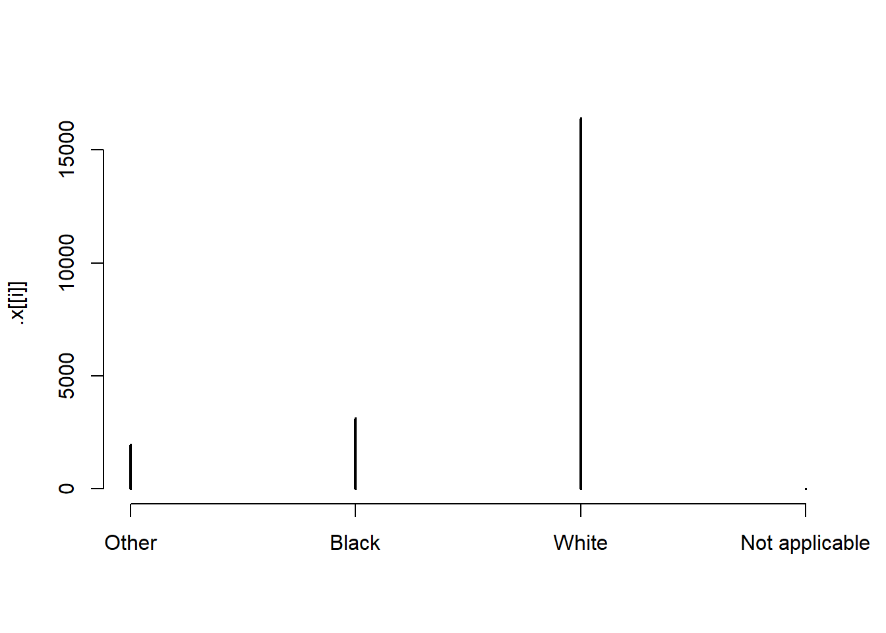
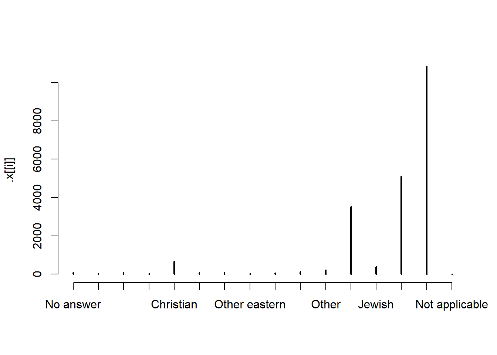

*Make sure the following packages are installed:*  


# ch. 15: Factors

* `factor` make variable a factor based on `levels` provided
* `fct_rev` reverses order of factors
* `fct_infreq` orders levels in increasing frequency
* `fct_relevel` lets you move levels to front of order
* `fct_inorder` orders existing factor by order values show-up in in data
* `fct_reorder` orders input factors by other specified variables value (median by default), 3 inputs: `f`: factor to modify, `x`: input var to order by, `fun`: function to use on x, also have `desc` option
* `fct_reorder2` orders input factor by max of other specified variable (good for making legends align as expected)
* `fct_recode` lets you change value of each level
* `fct_collapse` is variant of `fct_recode` that allows you to provide multiple old levels as a vector
* `fct_lump` allows you to lump together small groups, use `n` to specify number of groups to end with

Create factors by order they come-in:

Avoiding dropping levels with `drop = FALSE`

```r
gss_cat %>% 
  ggplot(aes(race))+
  geom_bar()+
  scale_x_discrete(drop = FALSE)
```


```r
# Is there a similar way to do this with count?
```

## 15.4: Modifying factor order

Example with `fct_recode`


```r
gss_cat %>%
  mutate(partyid = fct_recode(partyid,
    "Republican, strong"    = "Strong republican",
    "Republican, weak"      = "Not str republican",
    "Independent, near rep" = "Ind,near rep",
    "Independent, near dem" = "Ind,near dem",
    "Democrat, weak"        = "Not str democrat",
    "Democrat, strong"      = "Strong democrat"
  )) %>%
  count(partyid)
```

```
## # A tibble: 10 x 2
##    partyid                   n
##    <fct>                 <int>
##  1 No answer               154
##  2 Don't know                1
##  3 Other party             393
##  4 Republican, strong     2314
##  5 Republican, weak       3032
##  6 Independent, near rep  1791
##  7 Independent            4119
##  8 Independent, near dem  2499
##  9 Democrat, weak         3690
## 10 Democrat, strong       3490
```


### 15.3.1 

1.  Explore the distribution of `rincome` (reported income). What makes the
    default bar chart hard to understand? How could you improve the plot?
    
    
    ```r
    gss_cat %>% 
      ggplot(aes(x = rincome)) +
      geom_bar()
    ```
    
    
    
    
    * Default bar chart has categories across the x-asix, I flipped these to be across the y-axis 
    * Also, have highest values at the bottom rather than at the top and have different version of NA showing-up at both top and bottom, all should be on one side
    * In `bar_prep`, I used reg expressions to extract the numeric values, arrange by that, and then set factor levels according to the new order
        + Solution is probably unnecessarily complicated...^[Also had issue with not rendering for book.]

    
    ```r
    bar_prep <- gss_cat %>% 
      tidyr::extract(col = rincome, into =c("dollars1", "dollars2"), "([0-9]+)[^0-9]*([0-9]*)", remove = FALSE) %>% 
      mutate_at(c("dollars1", "dollars2"), ~ifelse(is.na(.) | . == "", 0, as.numeric(.))) %>% 
      arrange(dollars1, dollars2) %>% 
      mutate(rincome = fct_inorder(rincome))
    
    bar_prep %>% 
      ggplot(aes(x = rincome)) +
      geom_bar() +
      scale_x_discrete(drop = FALSE) +
      coord_flip()
    ```
    
    


1.  What is the most common `relig` in this survey? What's the most
    common `partyid`?

    
    ```r
    gss_cat %>%
      count(relig, sort = TRUE)
    ```
    
    ```
    ## # A tibble: 15 x 2
    ##    relig                       n
    ##    <fct>                   <int>
    ##  1 Protestant              10846
    ##  2 Catholic                 5124
    ##  3 None                     3523
    ##  4 Christian                 689
    ##  5 Jewish                    388
    ##  6 Other                     224
    ##  7 Buddhism                  147
    ##  8 Inter-nondenominational   109
    ##  9 Moslem/islam              104
    ## 10 Orthodox-christian         95
    ## 11 No answer                  93
    ## 12 Hinduism                   71
    ## 13 Other eastern              32
    ## 14 Native american            23
    ## 15 Don't know                 15
    ```
    
    ```r
    gss_cat %>%
      count(partyid, sort = TRUE)
    ```
    
    ```
    ## # A tibble: 10 x 2
    ##    partyid                n
    ##    <fct>              <int>
    ##  1 Independent         4119
    ##  2 Not str democrat    3690
    ##  3 Strong democrat     3490
    ##  4 Not str republican  3032
    ##  5 Ind,near dem        2499
    ##  6 Strong republican   2314
    ##  7 Ind,near rep        1791
    ##  8 Other party          393
    ##  9 No answer            154
    ## 10 Don't know             1
    ```

    * `relig` most common -- Protestant, 10846,
    * `partyid` most common -- Independent, 4119

1.  Which `relig` does `denom` (denomination) apply to? How can you find
    out with a table? How can you find out with a visualisation?
    
    *With visualization:*
    
    ```r
    gss_cat %>% 
      ggplot(aes(x=relig, fill=denom))+
      geom_bar()+
      coord_flip()
    ```
    
    
    
    * Notice which have the widest variety of colours -- are protestant, and Christian slightly
    
    *With table:*
    
    ```r
    gss_cat %>% 
      count(relig, denom) %>% 
      count(relig, sort = TRUE)
    ```
    
    ```
    ## # A tibble: 15 x 2
    ##    relig                       n
    ##    <fct>                   <int>
    ##  1 Protestant                 29
    ##  2 Christian                   4
    ##  3 Other                       2
    ##  4 No answer                   1
    ##  5 Don't know                  1
    ##  6 Inter-nondenominational     1
    ##  7 Native american             1
    ##  8 Orthodox-christian          1
    ##  9 Moslem/islam                1
    ## 10 Other eastern               1
    ## 11 Hinduism                    1
    ## 12 Buddhism                    1
    ## 13 None                        1
    ## 14 Jewish                      1
    ## 15 Catholic                    1
    ```
    
	
## 	15.4: Modifying factor order

### 15.4.1
	
1.  There are some suspiciously high numbers in `tvhours`. Is the mean a good
    summary?
    
    
    ```r
    gss_cat %>%
      mutate(tvhours_fct = factor(tvhours)) %>% 
      ggplot(aes(x = tvhours_fct)) +
      geom_bar()
    ```
    
    
   
   * Distribution is reasonably skewed with some values showing-up as 24 hours which seems impossible, in addition to this we have a lot of na values, this may skew results
   * Given high number of missing values, `tvhours` may also just not be reliable, do NA's associate with other variables? -- Perhaps could try and impute these NAs

1.  For each factor in `gss_cat` identify whether the order of the levels is
    arbitrary or principled.
    
    
    ```r
    gss_cat %>% 
      purrr::keep(is.factor) %>% 
      purrr::map(levels)
    ```
    
    ```
    ## $marital
    ## [1] "No answer"     "Never married" "Separated"     "Divorced"     
    ## [5] "Widowed"       "Married"      
    ## 
    ## $race
    ## [1] "Other"          "Black"          "White"          "Not applicable"
    ## 
    ## $rincome
    ##  [1] "No answer"      "Don't know"     "Refused"        "$25000 or more"
    ##  [5] "$20000 - 24999" "$15000 - 19999" "$10000 - 14999" "$8000 to 9999" 
    ##  [9] "$7000 to 7999"  "$6000 to 6999"  "$5000 to 5999"  "$4000 to 4999" 
    ## [13] "$3000 to 3999"  "$1000 to 2999"  "Lt $1000"       "Not applicable"
    ## 
    ## $partyid
    ##  [1] "No answer"          "Don't know"         "Other party"       
    ##  [4] "Strong republican"  "Not str republican" "Ind,near rep"      
    ##  [7] "Independent"        "Ind,near dem"       "Not str democrat"  
    ## [10] "Strong democrat"   
    ## 
    ## $relig
    ##  [1] "No answer"               "Don't know"             
    ##  [3] "Inter-nondenominational" "Native american"        
    ##  [5] "Christian"               "Orthodox-christian"     
    ##  [7] "Moslem/islam"            "Other eastern"          
    ##  [9] "Hinduism"                "Buddhism"               
    ## [11] "Other"                   "None"                   
    ## [13] "Jewish"                  "Catholic"               
    ## [15] "Protestant"              "Not applicable"         
    ## 
    ## $denom
    ##  [1] "No answer"            "Don't know"           "No denomination"     
    ##  [4] "Other"                "Episcopal"            "Presbyterian-dk wh"  
    ##  [7] "Presbyterian, merged" "Other presbyterian"   "United pres ch in us"
    ## [10] "Presbyterian c in us" "Lutheran-dk which"    "Evangelical luth"    
    ## [13] "Other lutheran"       "Wi evan luth synod"   "Lutheran-mo synod"   
    ## [16] "Luth ch in america"   "Am lutheran"          "Methodist-dk which"  
    ## [19] "Other methodist"      "United methodist"     "Afr meth ep zion"    
    ## [22] "Afr meth episcopal"   "Baptist-dk which"     "Other baptists"      
    ## [25] "Southern baptist"     "Nat bapt conv usa"    "Nat bapt conv of am" 
    ## [28] "Am bapt ch in usa"    "Am baptist asso"      "Not applicable"
    ```
    
    * `rincome` is principaled, rest are arbitrary


1.  Why did moving "Not applicable" to the front of the levels move it to the
    bottom of the plot?
    
    * Becuase is moving this factor to be first in order
	
## 	15.5: Modifying factor levels

### 15.5.1

1.  How have the proportions of people identifying as Democrat, Republican, and
    Independent changed over time?

    *As a line plot: * 
    
    ```r
    gss_cat %>%
      mutate(partyid = fct_collapse(
        partyid,
        other = c("No answer", "Don't know", "Other party"),
        rep = c("Strong republican", "Not str republican"),
        ind = c("Ind,near rep", "Independent", "Ind,near dem"),
        dem = c("Not str democrat", "Strong democrat")
      )) %>%
      count(year, partyid) %>%
      group_by(year) %>%
      mutate(prop = n / sum(n)) %>%
      ungroup() %>%
      ggplot(aes(
        x = year,
        y = prop,
        colour = fct_reorder2(partyid, year, prop)
      )) +
      geom_line() +
      labs(colour = "partyid")
    ```
    
    
    
    *As a bar plot: * 
    
    
    ```r
    gss_cat %>%
      mutate(partyid = fct_collapse(
        partyid,
        other = c("No answer", "Don't know", "Other party"),
        rep = c("Strong republican", "Not str republican"),
        ind = c("Ind,near rep", "Independent", "Ind,near dem"),
        dem = c("Not str democrat", "Strong democrat")
      )) %>%
      count(year, partyid) %>%
      group_by(year) %>%
      mutate(prop = n / sum(n)) %>%
      ungroup() %>%
      ggplot(aes(
        x = year,
        y = prop,
        fill = fct_reorder2(partyid, year, prop)
      )) +
      geom_col() +
      labs(colour = "partyid")
    ```
    
    

    * Suggests proportion of republicans has gone down with independents and other going up.

1.  How could you collapse `rincome` into a small set of categories?

    
    ```r
    other = c("No answer", "Don't know", "Refused", "Not applicable")
    high = c("$25000 or more", "$20000 - 24999", "$15000 - 19999", "$10000 - 14999")
    med = c("$8000 to 9999", "$7000 to 7999", "$6000 to 6999", "$5000 to 5999")
    low = c("$4000 to 4999", "$3000 to 3999", "$1000 to 2999", "Lt $1000")
    
    mutate(gss_cat,
           rincome = fct_collapse(
           rincome,
           other = other,
           high = high,
           med = med,
           low = low
           )) %>%
           count(rincome)
    ```
    
    ```
    ## # A tibble: 4 x 2
    ##   rincome     n
    ##   <fct>   <int>
    ## 1 other    8468
    ## 2 high    10862
    ## 3 med       970
    ## 4 low      1183
    ```


# Appendix 

## Viewing all levels

A few ways to get an initial look at the levels or counts across a dataset


```r
gss_cat %>% 
  purrr::map(unique)
```

```
## $year
## [1] 2000 2002 2004 2006 2008 2010 2012 2014
## 
## $marital
## [1] Never married Divorced      Widowed       Married       Separated    
## [6] No answer    
## Levels: No answer Never married Separated Divorced Widowed Married
## 
## $age
##  [1] 26 48 67 39 25 36 44 47 53 52 51 40 77 45 49 19 54 82 83 89 88 72 34
## [24] 55 37 22 33 43 29 57 31 46 65 56 66 20 64 59 23 21 27 78 61 84 69 32
## [47] 76 41 70 75 80 24 50 30 62 60 28 35 38 73 87 58 63 42 85 NA 79 18 71
## [70] 68 74 81 86
## 
## $race
## [1] White Black Other
## Levels: Other Black White Not applicable
## 
## $rincome
##  [1] $8000 to 9999  Not applicable $20000 - 24999 $25000 or more
##  [5] $7000 to 7999  $10000 - 14999 Refused        $15000 - 19999
##  [9] $3000 to 3999  $5000 to 5999  Don't know     $1000 to 2999 
## [13] Lt $1000       No answer      $6000 to 6999  $4000 to 4999 
## 16 Levels: No answer Don't know Refused $25000 or more ... Not applicable
## 
## $partyid
##  [1] Ind,near rep       Not str republican Independent       
##  [4] Not str democrat   Strong democrat    Ind,near dem      
##  [7] Strong republican  Other party        No answer         
## [10] Don't know        
## 10 Levels: No answer Don't know Other party ... Strong democrat
## 
## $relig
##  [1] Protestant              Orthodox-christian     
##  [3] None                    Christian              
##  [5] Jewish                  Catholic               
##  [7] Other                   Inter-nondenominational
##  [9] Hinduism                Native american        
## [11] No answer               Buddhism               
## [13] Moslem/islam            Other eastern          
## [15] Don't know             
## 16 Levels: No answer Don't know ... Not applicable
## 
## $denom
##  [1] Southern baptist     Baptist-dk which     No denomination     
##  [4] Not applicable       Lutheran-mo synod    Other               
##  [7] United methodist     Episcopal            Other lutheran      
## [10] Afr meth ep zion     Am bapt ch in usa    Other methodist     
## [13] Presbyterian c in us Methodist-dk which   Nat bapt conv usa   
## [16] Am lutheran          Nat bapt conv of am  Am baptist asso     
## [19] Evangelical luth     Afr meth episcopal   Lutheran-dk which   
## [22] Luth ch in america   Presbyterian, merged No answer           
## [25] Wi evan luth synod   Other baptists       Other presbyterian  
## [28] United pres ch in us Presbyterian-dk wh   Don't know          
## 30 Levels: No answer Don't know No denomination Other ... Not applicable
## 
## $tvhours
##  [1] 12 NA  2  4  1  3  0  7  5  8 10  6 15 11 24 20 13 14 21  9 16 22 18
## [24] 17 23
```

```r
gss_cat %>% 
  purrr::map(table)
```

```
## $year
## 
## 2000 2002 2004 2006 2008 2010 2012 2014 
## 2817 2765 2812 4510 2023 2044 1974 2538 
## 
## $marital
## 
##     No answer Never married     Separated      Divorced       Widowed 
##            17          5416           743          3383          1807 
##       Married 
##         10117 
## 
## $age
## 
##  18  19  20  21  22  23  24  25  26  27  28  29  30  31  32  33  34  35 
##  91 249 251 278 298 361 344 396 400 385 387 376 433 407 445 425 425 417 
##  36  37  38  39  40  41  42  43  44  45  46  47  48  49  50  51  52  53 
## 428 438 426 415 452 434 405 448 432 404 422 435 424 417 430 390 400 396 
##  54  55  56  57  58  59  60  61  62  63  64  65  66  67  68  69  70  71 
## 387 365 384 321 326 323 338 307 310 292 253 259 231 271 205 201 213 206 
##  72  73  74  75  76  77  78  79  80  81  82  83  84  85  86  87  88  89 
## 189 152 180 179 171 137 150 135 127 119 105  99 100  75  74  54  57 148 
## 
## $race
## 
##          Other          Black          White Not applicable 
##           1959           3129          16395              0 
## 
## $rincome
## 
##      No answer     Don't know        Refused $25000 or more $20000 - 24999 
##            183            267            975           7363           1283 
## $15000 - 19999 $10000 - 14999  $8000 to 9999  $7000 to 7999  $6000 to 6999 
##           1048           1168            340            188            215 
##  $5000 to 5999  $4000 to 4999  $3000 to 3999  $1000 to 2999       Lt $1000 
##            227            226            276            395            286 
## Not applicable 
##           7043 
## 
## $partyid
## 
##          No answer         Don't know        Other party 
##                154                  1                393 
##  Strong republican Not str republican       Ind,near rep 
##               2314               3032               1791 
##        Independent       Ind,near dem   Not str democrat 
##               4119               2499               3690 
##    Strong democrat 
##               3490 
## 
## $relig
## 
##               No answer              Don't know Inter-nondenominational 
##                      93                      15                     109 
##         Native american               Christian      Orthodox-christian 
##                      23                     689                      95 
##            Moslem/islam           Other eastern                Hinduism 
##                     104                      32                      71 
##                Buddhism                   Other                    None 
##                     147                     224                    3523 
##                  Jewish                Catholic              Protestant 
##                     388                    5124                   10846 
##          Not applicable 
##                       0 
## 
## $denom
## 
##            No answer           Don't know      No denomination 
##                  117                   52                 1683 
##                Other            Episcopal   Presbyterian-dk wh 
##                 2534                  397                  244 
## Presbyterian, merged   Other presbyterian United pres ch in us 
##                   67                   47                  110 
## Presbyterian c in us    Lutheran-dk which     Evangelical luth 
##                  104                  267                  122 
##       Other lutheran   Wi evan luth synod    Lutheran-mo synod 
##                   30                   71                  212 
##   Luth ch in america          Am lutheran   Methodist-dk which 
##                   71                  146                  239 
##      Other methodist     United methodist     Afr meth ep zion 
##                   33                 1067                   32 
##   Afr meth episcopal     Baptist-dk which       Other baptists 
##                   77                 1457                  213 
##     Southern baptist    Nat bapt conv usa  Nat bapt conv of am 
##                 1536                   40                   76 
##    Am bapt ch in usa      Am baptist asso       Not applicable 
##                  130                  237                10072 
## 
## $tvhours
## 
##    0    1    2    3    4    5    6    7    8    9   10   11   12   13   14 
##  675 2345 3040 1959 1408  695  478  119  262   19  122    9   96    9   24 
##   15   16   17   18   20   21   22   23   24 
##   17   10    2    7   14    2    2    1   22
```

```r
gss_cat %>% 
  purrr::map(table) %>% 
  purrr::map(plot)
```



```
## $year
## [1] 2000 2002 2004 2006 2008 2010 2012 2014
## 
## $marital
## [1] 1 2 3 4 5 6
## 
## $age
##  [1] 18 19 20 21 22 23 24 25 26 27 28 29 30 31 32 33 34 35 36 37 38 39 40
## [24] 41 42 43 44 45 46 47 48 49 50 51 52 53 54 55 56 57 58 59 60 61 62 63
## [47] 64 65 66 67 68 69 70 71 72 73 74 75 76 77 78 79 80 81 82 83 84 85 86
## [70] 87 88 89
## 
## $race
## [1] 1 2 3 4
## 
## $rincome
##  [1]  1  2  3  4  5  6  7  8  9 10 11 12 13 14 15 16
## 
## $partyid
##  [1]  1  2  3  4  5  6  7  8  9 10
## 
## $relig
##  [1]  1  2  3  4  5  6  7  8  9 10 11 12 13 14 15 16
## 
## $denom
##  [1]  1  2  3  4  5  6  7  8  9 10 11 12 13 14 15 16 17 18 19 20 21 22 23
## [24] 24 25 26 27 28 29 30
## 
## $tvhours
##  [1]  0  1  2  3  4  5  6  7  8  9 10 11 12 13 14 15 16 17 18 20 21 22 23
## [24] 24
```

## Percentage NA each level


```r
gss_cat %>% 
  purrr::map(~(sum(is.na(.x)) / length(.x)))
```

```
## $year
## [1] 0
## 
## $marital
## [1] 0
## 
## $age
## [1] 0.003537681
## 
## $race
## [1] 0
## 
## $rincome
## [1] 0
## 
## $partyid
## [1] 0
## 
## $relig
## [1] 0
## 
## $denom
## [1] 0
## 
## $tvhours
## [1] 0.4722804
```

## Print all levels of tibble


```r
gss_cat %>% 
  count(tvhours) %>% 
  print(n = Inf)
```

```
## # A tibble: 25 x 2
##    tvhours     n
##      <int> <int>
##  1       0   675
##  2       1  2345
##  3       2  3040
##  4       3  1959
##  5       4  1408
##  6       5   695
##  7       6   478
##  8       7   119
##  9       8   262
## 10       9    19
## 11      10   122
## 12      11     9
## 13      12    96
## 14      13     9
## 15      14    24
## 16      15    17
## 17      16    10
## 18      17     2
## 19      18     7
## 20      20    14
## 21      21     2
## 22      22     2
## 23      23     1
## 24      24    22
## 25      NA 10146
```

