--- 
title: "A Minimal Book Example"
author: "Yihui Xie"
date: "2019-05-22"
site: bookdown::bookdown_site
documentclass: book
bibliography: [book.bib, packages.bib]
biblio-style: apalike
link-citations: yes
description: "This is a minimal example of using the bookdown package to write a book. The output format for this example is bookdown::gitbook."
---

# Prerequisites

This is a _sample_ book written in **Markdown**. You can use anything that Pandoc's Markdown supports, e.g., a math equation $a^2 + b^2 = c^2$.

The **bookdown** package can be installed from CRAN or Github:


```r
install.packages("bookdown")
# or the development version
# devtools::install_github("rstudio/bookdown")
```

Remember each Rmd file contains one and only one chapter, and a chapter is defined by the first-level heading `#`.

To compile this example to PDF, you need XeLaTeX. You are recommended to install TinyTeX (which includes XeLaTeX): <https://yihui.name/tinytex/>.


<!--chapter:end:index.Rmd-->

*Make sure the following packages are installed:*  


# Chapter 3

* `geom_point`: 
* `geom_smooth`: 
* `geom_bar`: 
* `geom_count`: 
* `geom_jitter`: 
* `geom_boxplot`: 
* `geom_polygon`: 
* `geom_abline`: 
* `facet_wrap`: 
* `facet_grid`: 
* `stat_count`: 
* `stat_summary`: 
* `stat_bin`: 
* `stat_smooth`: 
* `position` adjustments:
    + `identity`: ; `dodge`: ; `fill`: ;
    + `position_dodge` ; `position_fill` ; `position_identiy` ; `position_jitter` ; `position_stack` ; 
* 3 ways to override default mapping
    + 
* `coord_flip`: 
* `coord_quickmap`: 
* `coord_polar`: 
* `coord_fixed`: 

`ggplot(data = <DATA>) + 
  <GEOM_FUNCTION>(
     mapping = aes(<MAPPINGS>),
     stat = <STAT>, 
     position = <POSITION>
  ) +
  <COORDINATE_FUNCTION> +
  <FACET_FUNCTION>`
  

## 3.2: First steps
### 3.2.4
**1. Run ggplot(data = mpg). What do you see?**


```r
ggplot(data = mpg)
```


Just a blank grey space.

**2. How many rows are in mpg? How many columns?**


```r
ncol(mtcars)
```

```
## [1] 11
```

```r
nrow(mtcars)
```

```
## [1] 32
```


**3. What does the drv variable describe? Read the help for ?mpg to find out.**  

Front wheel, rear wheel or 4 wheel drive.  

  
**4. Make a scatterplot of hwy vs cyl.**


```r
ggplot(mpg)+
  geom_point(aes(x = hwy, y = cyl))
```


Inverse relationship.  
  
**5. What happens if you make a scatterplot of class vs drv? Why is the plot not useful?**  
*(key question)*

```r
ggplot(mpg)+
  geom_point(aes(x = class, y = drv))
```


The points stack-up on top of one another so you don't get a sense of how many are on each point.  

*Any ideas for what methods could you use to improve the view of this data?*

## 3.3: Aesthetic mappings
### 3.3.1.
**1. What’s gone wrong with this code? Why are the points not blue?**

```r
ggplot(data = mpg) + 
  geom_point(mapping = aes(x = displ, y = hwy, color = "blue"))
```


  
The `color` field is in the `aes` function so it is expecting a character or factor variable. By inputting "blue" here, ggplot reads this as a character field with the value "blue" that it then supplies it's default color schemes to (1st: salmon, 2nd: teal)

**2. Which variables in mpg are categorical? Which variables are continuous? (Hint: type ?mpg to read the documentation for the dataset). How can you see this information when you run mpg?**  


```r
mpg
```

```
## # A tibble: 234 x 11
##    manufacturer model displ  year   cyl trans drv     cty   hwy fl    class
##    <chr>        <chr> <dbl> <int> <int> <chr> <chr> <int> <int> <chr> <chr>
##  1 audi         a4      1.8  1999     4 auto~ f        18    29 p     comp~
##  2 audi         a4      1.8  1999     4 manu~ f        21    29 p     comp~
##  3 audi         a4      2    2008     4 manu~ f        20    31 p     comp~
##  4 audi         a4      2    2008     4 auto~ f        21    30 p     comp~
##  5 audi         a4      2.8  1999     6 auto~ f        16    26 p     comp~
##  6 audi         a4      2.8  1999     6 manu~ f        18    26 p     comp~
##  7 audi         a4      3.1  2008     6 auto~ f        18    27 p     comp~
##  8 audi         a4 q~   1.8  1999     4 manu~ 4        18    26 p     comp~
##  9 audi         a4 q~   1.8  1999     4 auto~ 4        16    25 p     comp~
## 10 audi         a4 q~   2    2008     4 manu~ 4        20    28 p     comp~
## # ... with 224 more rows
```

The data is in tibble form already so just printing it shows the type, but could also use the `glimpse` and `str` functions.


**3. Map a continuous variable to color, size, and shape. How do these aesthetics behave differently for categorical vs. continuous variables?**

```r
ggplot(data = mpg) + 
  geom_point(mapping = aes(x = cty, y = hwy, color = cyl, size = displ, shape = fl))
```

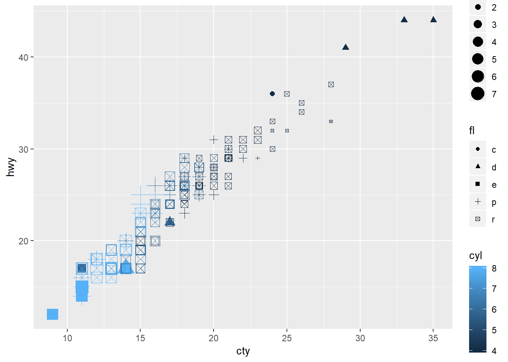
  
`color`: For continuous applies a gradient, for categorical it applies distinct colors based on the number of categories.  
`size`: For continuous, applies in order, for categorical will apply in an order that may be arbitrary if there is not an order provided.  
`shape`: Will not allow you to input a continuous variable.  

**4. What happens if you map the same variable to multiple aesthetics?**  
Will map onto both fields. Can be redundant in some cases, in others it can be valuable for clarity.

```r
ggplot(data = mpg)+
  geom_point(mapping = aes(x = cty, y = hwy, color = fl, shape = fl))
```


**5. What does the stroke aesthetic do? What shapes does it work with? (Hint: use ?geom_point)**

```r
?geom_point
```

```
## starting httpd help server ... done
```

```r
ggplot(data = mpg, mapping = aes(x = cty, y = hwy)) +
  geom_point(shape = 21, colour = "black", fill = "white", size = 5, stroke = 5)
```


```r
ggplot(data = mpg, mapping = aes(x = cty, y = hwy)) +
  geom_point(shape = 21, colour = "black", fill = "white", size = 5, stroke = 3)
```

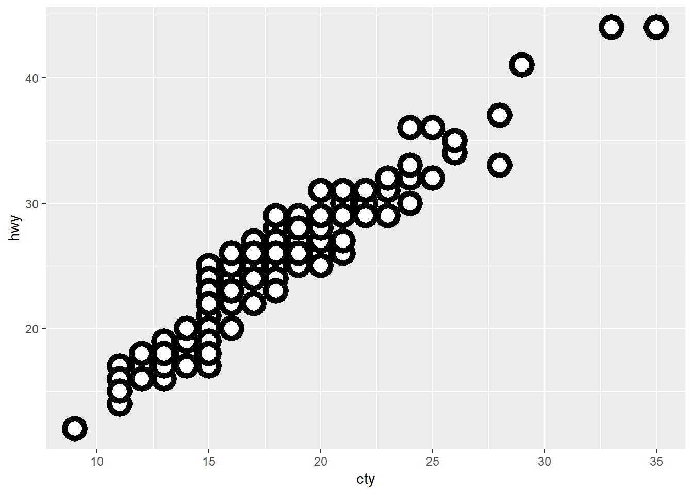

For shapes that have a border (like 21), you can colour the inside and outside separately. Use the stroke aesthetic to modify the width of the border.   

**6. What happens if you map an aesthetic to something other than a variable name, like aes(colour = displ < 5)?**

```r
ggplot(data = mpg, mapping = aes(x = cty, y = hwy, colour = displ < 5)) +
  geom_point()
```


The field becomes a logical operator in this case.

## 3.5: Facets

### 3.5.1.

**1. What happens if you facet on a continuous variable?**


```r
ggplot(data = mpg, mapping = aes(x = cty, y = hwy))+
  geom_point()+
  facet_wrap(~cyl)
```


It will facet along all of the possible values.  

**2. What do the empty cells in plot with `facet_grid(drv ~ cyl)` mean?**  

```r
ggplot(data = mpg) + 
  geom_point(mapping = aes(x = displ, y = hwy)) + 
  facet_grid(drv ~ cyl)
```


**How do they relate to this plot?**

```r
ggplot(data = mpg) + 
  geom_point(mapping = aes(x = drv, y = cyl))
```

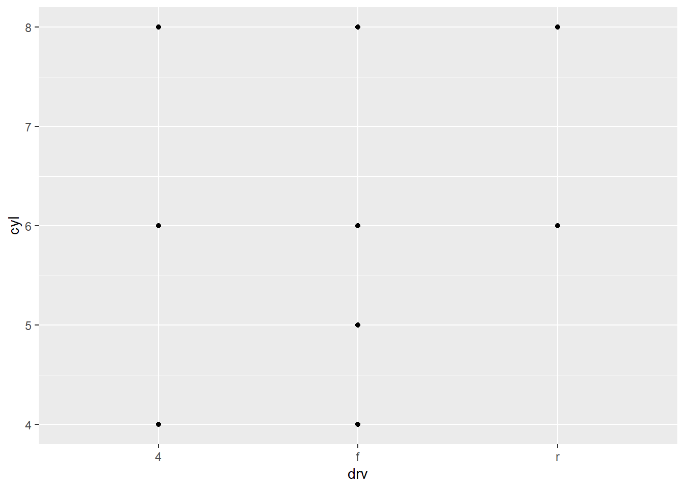

They represent the locations where there is no point on the above graph (could be made more clear by giving consistent order to axes).

**3. What plots does the following code make? What does . do?**


```r
ggplot(data = mpg) + 
  geom_point(mapping = aes(x = displ, y = hwy)) +
  facet_grid(drv ~ .)
```


```r
ggplot(data = mpg) + 
  geom_point(mapping = aes(x = displ, y = hwy)) +
  facet_grid(. ~ cyl)
```


Can use to specify if to facet by rows or columns.  


**4. Take the first faceted plot in this section:**

```r
ggplot(data = mpg) + 
  geom_point(mapping = aes(x = displ, y = hwy)) + 
  facet_wrap(~ class, nrow = 2)
```


**What are the advantages to using faceting instead of the colour aesthetic? What are the disadvantages? How might the balance change if you had a larger dataset?**  
  
Faceting prevents overlapping points in the data. A disadvantage is that you have to move your eye to look at different graphs. Some groups you don't have much data on as well so those don't present much information. If there is more data, you may be more comfortable using facetting as each group should have points that you can view.


**5. Read ?facet_wrap. What does nrow do? What does ncol do? What other options control the layout of the individual panels? Why doesn't facet_grid() have nrow and ncol argument?**  
  
`nrow` and `ncol` specify the number of columns or rows to facet by, `facet_grid` does not have this option because the splits are defined by the number of unique values in each variable. Other important options are `scales` which let you define if the scales are able to change between each plot.


**6. When using facet_grid() you should usually put the variable with more unique levels in the columns. Why?**  
  
I'm not sure why exactly, if I compare these, it's not completely unclear.

```r
#more unique levels on columns
ggplot(data = mpg) + 
  geom_point(mapping = aes(x = cty, y = hwy)) + 
  facet_grid(year ~ class)
```


```r
#more unique levels on rows
ggplot(data = mpg) + 
  geom_point(mapping = aes(x = cty, y = hwy)) + 
  facet_grid(class ~ year)
```

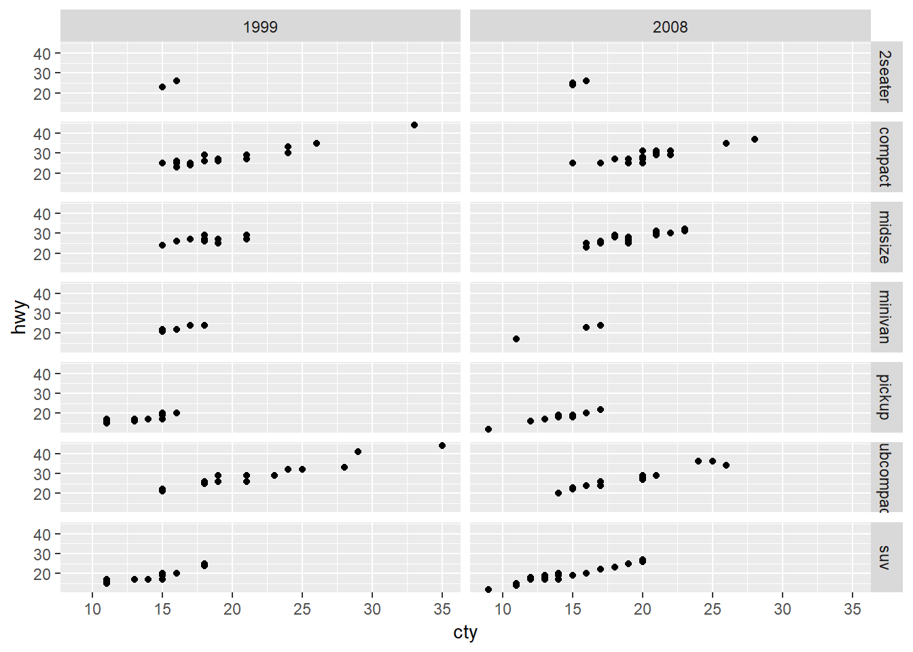

My guess though would be that it's because our computer screens are generally wider than they are tall. Hence there will be more space for viewing a higher number of attributes going across columns than by rows.  

## 3.6: Geometric Objects

### 3.6.1

**1. What geom would you use to draw a line chart? A boxplot? A histogram? An area chart?**  
* `geom_line`  
* `geom_boxplot`  
* `geom_histogram`  
* `geom_area`
    + Notice that `geom_area` is just a special case of `geom_ribbon`

*Example of `geom_area`:*  


```r
huron <- data.frame(year = 1875:1972, level = as.vector(LakeHuron) - 575)
h <- ggplot(huron, aes(year))

h + geom_ribbon(aes(ymin = 0, ymax = level))
```


```r
h + geom_area(aes(y = level))
```


```r
# Add aesthetic mappings
h +
  geom_ribbon(aes(ymin = level - 1, ymax = level + 1), fill = "grey70") +
  geom_line(aes(y = level))
```


```r
h +
  geom_area(aes(y = level), fill = "grey70") +
  geom_line(aes(y = level))
```


**2. Run this code in your head and predict what the output will look like. Then, run the code in R and check your predictions.**  

```r
ggplot(data = mpg, mapping = aes(x = displ, y = hwy, color = drv)) + 
  geom_point() + 
  geom_smooth(se = FALSE)
```

```
## `geom_smooth()` using method = 'loess' and formula 'y ~ x'
```


**3. What does show.legend = FALSE do? What happens if you remove it? Why do you think I used it earlier in the chapter?**  

```r
ggplot(data = mpg) +
  geom_smooth(
    mapping = aes(x = displ, y = hwy, color = drv),
    show.legend = FALSE
  )
```

```
## `geom_smooth()` using method = 'loess' and formula 'y ~ x'
```


It get's rid of the legend that would be assogiated with this geom. You removed it previously to keep it consistent with your other graphs that did not include them to specify the `drv`.  

**4. What does the `se` argument to `geom_smooth()` do?**  
`se` here stands for standard error, so if we specify it as `FALSE` we are saying we do not want to show the standard errors for the plot.  


**5. Will these two graphs look different? Why/why not?**  

```r
ggplot(data = mpg, mapping = aes(x = displ, y = hwy)) + 
  geom_point() + 
  geom_smooth()
```

```
## `geom_smooth()` using method = 'loess' and formula 'y ~ x'
```


```r
ggplot() + 
  geom_point(data = mpg, mapping = aes(x = displ, y = hwy)) + 
  geom_smooth(data = mpg, mapping = aes(x = displ, y = hwy))
```

```
## `geom_smooth()` using method = 'loess' and formula 'y ~ x'
```


No, because local mappings for each geom are the same as the global mappings in the other.  

**6. Recreate the R code necessary to generate the following graphs.**  


```r
ggplot(mpg, aes(displ, hwy))+
  geom_point() +
  geom_smooth(se = FALSE)
```

```
## `geom_smooth()` using method = 'loess' and formula 'y ~ x'
```


```r
ggplot(mpg, aes(displ, hwy, group = drv))+
  geom_point() +
  geom_smooth(se = FALSE)
```

```
## `geom_smooth()` using method = 'loess' and formula 'y ~ x'
```


```r
ggplot(mpg, aes(displ, hwy, colour = drv))+
  geom_point() +
  geom_smooth(se = FALSE)
```

```
## `geom_smooth()` using method = 'loess' and formula 'y ~ x'
```


```r
ggplot(mpg, aes(displ, hwy))+
  geom_point(aes(colour = drv)) +
  geom_smooth(se = FALSE)
```

```
## `geom_smooth()` using method = 'loess' and formula 'y ~ x'
```


```r
ggplot(mpg, aes(displ, hwy))+
  geom_point(aes(color = drv)) +
  geom_smooth(aes(linetype = drv), se = FALSE)
```

```
## `geom_smooth()` using method = 'loess' and formula 'y ~ x'
```


```r
ggplot(mpg, aes(displ, hwy)) +
  geom_point(colour = "white", size = 4) +
  geom_point(aes(colour = drv))
```


## 3.7: statistical transformations

### 3.7.1.

**1. What is the default `geom` associated with `stat_summary()`? How could you rewrite the previous plot to use that geom function instead of the stat function?**  

The default is `geom_pointrange`,  the point being the mean, and the lines being the standard error on the y value (i.e. the deviation of the mean of the value).

```r
ggplot(mpg) +
  stat_summary(aes(cyl, cty))
```

```
## No summary function supplied, defaulting to `mean_se()
```


*Rewritten with geom^[See [3.7.1.1 extension] for notes on how to relate this to dplyr code.]:*


```r
ggplot(mpg)+
  geom_pointrange(aes(x = cyl, y = cty), stat = "summary")
```

```
## No summary function supplied, defaulting to `mean_se()
```


The specific example though is actually not the default:


```r
ggplot(data = diamonds) + 
  stat_summary(
    mapping = aes(x = cut, y = depth),
    fun.ymin = min,
    fun.ymax = max,
    fun.y = median
  )
```


*Rewritten with geom:*

```r
ggplot(data = diamonds)+
  geom_pointrange(aes(x = cut, y = depth), 
                  stat = "summary", 
                  fun.ymin = "min",
                  fun.ymax = "max", 
                  fun.y = "median")
```


**2. What does geom_col() do? How is it different to geom_bar()?**  
`geom_col` has `"identity" as the default `stat`, so it expects to receive a variable that already has the value aggregated^[I often use this over `geom_bar` and do the aggregation with dplyr rather than ggplot2]


**3.Most geoms and stats come in pairs that are almost always used in concert. Read through the documentation and make a list of all the pairs. What do they have in common?**  


```r
?ggplot2
```


**4.What variables does stat_smooth() compute? What parameters control its behaviour?**  
See here: http://ggplot2.tidyverse.org/reference/#section-layer-stats for a helpful resource.
Also, someone who aggregated some online: http://sape.inf.usi.ch/quick-reference/ggplot2/geom ^[Though it's missing some very common ones like `geom_col` and `geom_bar`.]


**5. In our proportion bar chart, we need to set group = 1. Why? In other words what is the problem with these two graphs?**  
(key question)

```r
ggplot(data = diamonds) + 
  geom_bar(mapping = aes(x = cut, y = ..prop..))
```


```r
ggplot(data = diamonds) + 
  geom_bar(mapping = aes(x = cut, fill = color, y = ..prop..))
```


```r
ggplot(data = diamonds) + 
  geom_bar(mapping = aes(x = cut, y = ..prop.., group = 1))
```


This is a solution, but still seems off as prop becomes out of a value greater than 1

```r
ggplot(data = diamonds) + 
  geom_bar(mapping = aes(x = cut, fill = color, y = ..prop.., group = color))
```


For this second graph though, I would think you would want something more like the following:

```r
ggplot(data = diamonds) + 
  geom_bar(mapping = aes(x = cut, fill = color), position = "fill")
```


Which could be generated by this code as well

```r
diamonds %>% 
  count(cut, color) %>% 
  group_by(cut) %>% 
  mutate(prop = n / sum(n)) %>% 
  ggplot(aes(x = cut, y = prop, fill = color))+
  geom_col()
```

## 3.8: Position Adjjustment

### 3.8.1.

**1.What is the problem with this plot? How could you improve it?**
(key question)

```r
ggplot(data = mpg, mapping = aes(x = cty, y = hwy)) + 
  geom_point()
```


The points overlap, could use `geom_jjitter` instead


```r
ggplot(data = mpg, mapping = aes(x = cty, y = hwy)) + 
  geom_jitter()
```


**2. What parameters to geom_jitter() control the amount of jittering?**  
`height` and `width`

**3. Compare and contrast geom_jitter() with geom_count().**  
(key question)
Take the above chart and instead use `geom_count`

```r
ggplot(data = mpg, mapping = aes(x = cty, y = hwy)) + 
  geom_count()
```


Can also use `geom_count` with `color`, and can use "jitter" in `position` arg.

```r
ggplot(data = mpg, mapping = aes(x = cty, y = hwy, colour = drv)) + 
  geom_count()
```


```r
ggplot(data = mpg, mapping = aes(x = cty, y = hwy, colour = drv)) + 
  geom_count(position = "jitter")
```


```r
ggplot(data = mpg, mapping = aes(x = cty, y = hwy, colour = drv)) + 
  geom_jitter(size = 3, alpha = 0.3)
```


One problem with `geom_count` is that the shapes can still block-out other shapes at that same point of different colors. You can flip the orderof the stacking order of the colors with `position` = "dodge". Still this seems limited.


```r
ggplot(data = mpg, mapping = aes(x = cty, y = hwy, colour = drv)) + 
  geom_count(position = "dodge")
```

```
## Warning: Width not defined. Set with `position_dodge(width = ?)`
```


**4. What’s the default position adjustment for geom_boxplot()? Create a visualisation of the mpg dataset that demonstrates it.**  
`dodge`, but seems like `identity` is the same


```r
ggplot(data=mpg, mapping=aes(x=class, y=hwy))+
  geom_boxplot()
```


## 3.9: Coordinate systems

### 3.9.1.

**1.Turn a stacked bar chart into a pie chart using `coord_polar()`.**  
These are more illustrative than anything, here is a note from the documetantion:  
*NOTE: Use these plots with caution - polar coordinates has major perceptual problems. The main point of these examples is to demonstrate how these common plots can be described in the grammar.  Use with EXTREME caution.*

```r
ggplot(mpg, aes(x = 1, fill = class))+
  geom_bar(position = "fill") +
  coord_polar(theta = "y") + 
  scale_x_continuous(labels = NULL)
```


If I want to make multiple levels:

```r
ggplot(mpg, aes(x = as.factor(cyl), fill = class))+
  geom_bar(position = "fill") +
  coord_polar(theta = "y")
```


**2. What does labs() do? Read the documentation.**  
Used for giving labels.

```r
?labs
```


**3. What’s the difference between `coord_quickmap()` and `coord_map()`?**  
The first is an approximation, useful for smaller regions to be proected. For this example, do not see substantial differences.

```r
nz <- map_data("nz")

ggplot(nz,aes(long,lat,group=group))+
  geom_polygon(fill="red",colour="black")+
  coord_quickmap()
```


```r
ggplot(nz,aes(long,lat,group=group))+
  geom_polygon(fill="red",colour="black")+
  coord_map()
```


**4. What does the plot below tell you about the relationship between city and highway mpg? Why is coord_fixed() important? What does geom_abline() do?**  
`geom_abline()` adds a line with a given intercept and slope (either given by `aes` or by `intercept` and `slope` args)  
`coord_fixed` ensures that the ratios between the x and y axis stay at a specified relationship (default = 1). This is important for easily seeing the magnitude of the relationship between variables.  


```r
ggplot(data = mpg, mapping = aes(x = cty, y = hwy)) +
  geom_point() + 
  geom_abline() +
  coord_fixed()
```


# Appendix
## 3.7.1.1 extension

```r
ggplot(mpg, aes(x = cyl, y = cty, group = cyl))+
  geom_pointrange(stat = "summary")
```

```
## No summary function supplied, defaulting to `mean_se()
```


This seems to be the same as what you would get by doing the following with dplyr:

```r
mpg %>% 
  group_by(cyl) %>% 
  dplyr::summarise(mean = mean(cty),
            sd = (sum((cty - mean(cty))^2) / (n() - 1))^0.5,
            n = n(),
            se = sd / n^0.5,
            lower = mean - se,
            upper = mean + se) %>% 
  ggplot(aes(x = cyl, y = mean, group = cyl))+
  geom_pointrange(aes(ymin = lower, ymax = upper))
```


Other geoms you could have set stat_summary to:  

`crossbar`:

```r
ggplot(mpg) +
  stat_summary(aes(cyl, cty), geom = "crossbar")
```

```
## No summary function supplied, defaulting to `mean_se()
```


`errorbar`: 

```r
ggplot(mpg) +
  stat_summary(aes(cyl, cty), geom = "errorbar")
```

```
## No summary function supplied, defaulting to `mean_se()
```


`linerange`:

```r
ggplot(mpg) +
  stat_summary(aes(cyl, cty), geom = "linerange")
```

```
## No summary function supplied, defaulting to `mean_se()
```


## 3.8: Position adustments

Some "dodge"" examples

```r
ggplot(data = diamonds) + 
  geom_bar(mapping = aes(x = cut, fill = clarity), position = "dodge")
```


```r
diamonds %>% 
  count(cut, color) %>% 
  ggplot(aes(x = cut, y = n, fill = color))+
  geom_col(position = "dodge")
```


Looking of `geom_jitter` and only changing width.

```r
ggplot(data = mpg, mapping = aes(x = drv, y = hwy))+
  geom_jitter(height = 0, width = .2)
```


## 3.9: Coordinate systems  
`coord_flip` is helpful, especially for quickly tackling issues with axis labels
`coord_quickmap` is important to remember if plotting spatial data.
`coord_polar` is important to remember if plotting spatial coordinates.
`map_data` for extracting data on maps of locations

## add in table of contents and other details...

<!--chapter:end:03-data-visualization.Rmd-->


*Make sure the following packages are installed:*  


```r
knitr::opts_chunk$set(echo = TRUE, cache = TRUE)

library(ggplot2)
library(dplyr)
library(nycflights13)
library(Lahman)
library(gapminder)
library(tidyr)
library(plotly) 
```

# ch. 5
  
**Key functions from chapter:**  
  
* `filter()`: for filtering rows by some condition(s)  
* `arrange()`: for ordering rows by some condition(s) 
    * `desc`: order by descending instead (often use within arrange or with ranking functions)
* `select()`: for selecting columns by name, position, or criteria  
    * helper functions: `everything`, `starts_with`, `ends_with`, `contains`, `matches`: selects variables that match a regular expression, `num_range("x", 1:3)`:  matches `x1`, `x2` and `x3`
* `rename()`: rename variables w/o dropping variables not indicated
* `mutate()`: for changing columns and adding new columns * `group_by()`: for performing operations grouped by the values of some fields  
* `summarise()`: for collapsing dataframes into individual rows or aggregates -- typically used in conjunction with group_by(), typically used to aggregate
* `%>%`: pass the previous output into the first position of the next argument, think of as saying, "then you do..."  
* `count`: shortcut for <group_by([var])> --> <summarise(n = n())>
* `near`: Are two values essentially equal (use to test equivalence and deals with oddities in floats)
* `is.na`: TRUE output if `NA` (and related values) else FALSE
* `between`: `between(Sepal.Length, 1, 3)` is equivalent to `Sepal.Length >=1 & Sepal.Length <=3`
* `transmute`: mutate but only keep the outputted column(s)
* `lead`, `lag`: take value n positions in lead or lag position
* `log`, `log2`, `log10`: log funcitons of base `e`, 2, 10
* `cumsum`, `cumprod`, `cummin`, `cummax`, `cummean`: Common cumalitive functions
* `<`, `<=`, `>`, `>=`, `!=`: Logical operators
* `min_rank`, `row_number`, `dense_rank`, `percent_rank`, `cume_dist`, `ntile`: common ranking functions
* Location: `mean`; `median`
* Spread: `sd`: standard deviation; `IQR()`: Interquartile range; `mad()`: median absolute deviaiton

```r
x <- c(1, 2, 3, 4, 6, 7, 8, 8, 10, 100)
IQR(x)
mad(x)
sd(x)
```

* Rank: `min`; `quantile`; `max`
* Position: `first(x)`, `nth(x, 2)`, `last(x)`. These work similarly to `x[1]`, `x[2]`, and `x[length(x)]` but let you set a default value if that position does not exist

```r
first(x)
nth(x, 5)
last(x)
```

* measures of rank: `min`, `max`, `rank`, `quantile(x, 0.25)` is just 0.25 value (generalization of median, but allows you to specify)  
* counts: `n()` for rows, `sum(!is.na(x))` for non-missing rows, for distinct count, use `n_distinct(x)`
* Counts and proportions of logical values: `sum(x > 10)`, `mean(y == 0)`
* `range()` returns vector containing min and max of values in a vector (so returns two values).  
* `vignette`: function to open vignettes
    + e.g. `vignette("window-functions")`

## 5.2: Filter rows

## 5.2.4.

**1.Find all flights that...**  
(key question)  
*1.1.Find flights that had an arrival delay of 2 + hrs*

```r
filter(flights, arr_delay >= 120) %>% 
  glimpse()
```

```
## Observations: 10,200
## Variables: 19
## $ year           <int> 2013, 2013, 2013, 2013, 2013, 2013, 2013, 2013,...
## $ month          <int> 1, 1, 1, 1, 1, 1, 1, 1, 1, 1, 1, 1, 1, 1, 1, 1,...
## $ day            <int> 1, 1, 1, 1, 1, 1, 1, 1, 1, 1, 1, 1, 1, 1, 1, 1,...
## $ dep_time       <int> 811, 848, 957, 1114, 1505, 1525, 1549, 1558, 17...
## $ sched_dep_time <int> 630, 1835, 733, 900, 1310, 1340, 1445, 1359, 16...
## $ dep_delay      <dbl> 101, 853, 144, 134, 115, 105, 64, 119, 62, 103,...
## $ arr_time       <int> 1047, 1001, 1056, 1447, 1638, 1831, 1912, 1718,...
## $ sched_arr_time <int> 830, 1950, 853, 1222, 1431, 1626, 1656, 1515, 1...
## $ arr_delay      <dbl> 137, 851, 123, 145, 127, 125, 136, 123, 123, 13...
## $ carrier        <chr> "MQ", "MQ", "UA", "UA", "EV", "B6", "EV", "EV",...
## $ flight         <int> 4576, 3944, 856, 1086, 4497, 525, 4181, 5712, 4...
## $ tailnum        <chr> "N531MQ", "N942MQ", "N534UA", "N76502", "N17984...
## $ origin         <chr> "LGA", "JFK", "EWR", "LGA", "EWR", "EWR", "EWR"...
## $ dest           <chr> "CLT", "BWI", "BOS", "IAH", "RIC", "MCO", "MCI"...
## $ air_time       <dbl> 118, 41, 37, 248, 63, 152, 234, 53, 119, 154, 2...
## $ distance       <dbl> 544, 184, 200, 1416, 277, 937, 1092, 228, 533, ...
## $ hour           <dbl> 6, 18, 7, 9, 13, 13, 14, 13, 16, 16, 13, 14, 16...
## $ minute         <dbl> 30, 35, 33, 0, 10, 40, 45, 59, 30, 20, 25, 22, ...
## $ time_hour      <dttm> 2013-01-01 06:00:00, 2013-01-01 18:00:00, 2013...
```


*1.2.flew to Houston IAH or HOU*

```r
filter(flights, dest %in% c("IAH","HOU"))
```

```
## # A tibble: 9,313 x 19
##     year month   day dep_time sched_dep_time dep_delay arr_time
##    <int> <int> <int>    <int>          <int>     <dbl>    <int>
##  1  2013     1     1      517            515         2      830
##  2  2013     1     1      533            529         4      850
##  3  2013     1     1      623            627        -4      933
##  4  2013     1     1      728            732        -4     1041
##  5  2013     1     1      739            739         0     1104
##  6  2013     1     1      908            908         0     1228
##  7  2013     1     1     1028           1026         2     1350
##  8  2013     1     1     1044           1045        -1     1352
##  9  2013     1     1     1114            900       134     1447
## 10  2013     1     1     1205           1200         5     1503
## # ... with 9,303 more rows, and 12 more variables: sched_arr_time <int>,
## #   arr_delay <dbl>, carrier <chr>, flight <int>, tailnum <chr>,
## #   origin <chr>, dest <chr>, air_time <dbl>, distance <dbl>, hour <dbl>,
## #   minute <dbl>, time_hour <dttm>
```


*1.3.flew through American, United or Delta*  

```r
filter(flights, carrier %in% c("UA", "AA","DL"))
```

```
## # A tibble: 139,504 x 19
##     year month   day dep_time sched_dep_time dep_delay arr_time
##    <int> <int> <int>    <int>          <int>     <dbl>    <int>
##  1  2013     1     1      517            515         2      830
##  2  2013     1     1      533            529         4      850
##  3  2013     1     1      542            540         2      923
##  4  2013     1     1      554            600        -6      812
##  5  2013     1     1      554            558        -4      740
##  6  2013     1     1      558            600        -2      753
##  7  2013     1     1      558            600        -2      924
##  8  2013     1     1      558            600        -2      923
##  9  2013     1     1      559            600        -1      941
## 10  2013     1     1      559            600        -1      854
## # ... with 139,494 more rows, and 12 more variables: sched_arr_time <int>,
## #   arr_delay <dbl>, carrier <chr>, flight <int>, tailnum <chr>,
## #   origin <chr>, dest <chr>, air_time <dbl>, distance <dbl>, hour <dbl>,
## #   minute <dbl>, time_hour <dttm>
```

*1.4. Departed in Summer*  

```r
filter(flights, month <= 8 & month >= 6)
```

```
## # A tibble: 86,995 x 19
##     year month   day dep_time sched_dep_time dep_delay arr_time
##    <int> <int> <int>    <int>          <int>     <dbl>    <int>
##  1  2013     6     1        2           2359         3      341
##  2  2013     6     1      451            500        -9      624
##  3  2013     6     1      506            515        -9      715
##  4  2013     6     1      534            545       -11      800
##  5  2013     6     1      538            545        -7      925
##  6  2013     6     1      539            540        -1      832
##  7  2013     6     1      546            600       -14      850
##  8  2013     6     1      551            600        -9      828
##  9  2013     6     1      552            600        -8      647
## 10  2013     6     1      553            600        -7      700
## # ... with 86,985 more rows, and 12 more variables: sched_arr_time <int>,
## #   arr_delay <dbl>, carrier <chr>, flight <int>, tailnum <chr>,
## #   origin <chr>, dest <chr>, air_time <dbl>, distance <dbl>, hour <dbl>,
## #   minute <dbl>, time_hour <dttm>
```

*1.5. Arrived more than 2 hurs late, but didn't leave late*  

```r
filter(flights, arr_delay > 120, dep_delay >= 0)
```

```
## # A tibble: 10,008 x 19
##     year month   day dep_time sched_dep_time dep_delay arr_time
##    <int> <int> <int>    <int>          <int>     <dbl>    <int>
##  1  2013     1     1      811            630       101     1047
##  2  2013     1     1      848           1835       853     1001
##  3  2013     1     1      957            733       144     1056
##  4  2013     1     1     1114            900       134     1447
##  5  2013     1     1     1505           1310       115     1638
##  6  2013     1     1     1525           1340       105     1831
##  7  2013     1     1     1549           1445        64     1912
##  8  2013     1     1     1558           1359       119     1718
##  9  2013     1     1     1732           1630        62     2028
## 10  2013     1     1     1803           1620       103     2008
## # ... with 9,998 more rows, and 12 more variables: sched_arr_time <int>,
## #   arr_delay <dbl>, carrier <chr>, flight <int>, tailnum <chr>,
## #   origin <chr>, dest <chr>, air_time <dbl>, distance <dbl>, hour <dbl>,
## #   minute <dbl>, time_hour <dttm>
```

*1.6. were delayed at least an hour, but made up over 30 mins in flight*  


```r
filter(flights, (arr_delay-dep_delay)<=-30, dep_delay>=60)
```

```
## # A tibble: 2,074 x 19
##     year month   day dep_time sched_dep_time dep_delay arr_time
##    <int> <int> <int>    <int>          <int>     <dbl>    <int>
##  1  2013     1     1     1716           1545        91     2140
##  2  2013     1     1     2205           1720       285       46
##  3  2013     1     1     2326           2130       116      131
##  4  2013     1     3     1503           1221       162     1803
##  5  2013     1     3     1821           1530       171     2131
##  6  2013     1     3     1839           1700        99     2056
##  7  2013     1     3     1850           1745        65     2148
##  8  2013     1     3     1923           1815        68     2036
##  9  2013     1     3     1941           1759       102     2246
## 10  2013     1     3     1950           1845        65     2228
## # ... with 2,064 more rows, and 12 more variables: sched_arr_time <int>,
## #   arr_delay <dbl>, carrier <chr>, flight <int>, tailnum <chr>,
## #   origin <chr>, dest <chr>, air_time <dbl>, distance <dbl>, hour <dbl>,
## #   minute <dbl>, time_hour <dttm>
```

*Equivalent solution:*  
`filter(flights, (arr_delay-dep_delay)<=-30 & dep_delay>=60)`  
  
*1.7. departed between midnight and 6am (inclusive)*  

```r
filter(flights, dep_time>=0 & dep_time<=600)
```

```
## # A tibble: 9,344 x 19
##     year month   day dep_time sched_dep_time dep_delay arr_time
##    <int> <int> <int>    <int>          <int>     <dbl>    <int>
##  1  2013     1     1      517            515         2      830
##  2  2013     1     1      533            529         4      850
##  3  2013     1     1      542            540         2      923
##  4  2013     1     1      544            545        -1     1004
##  5  2013     1     1      554            600        -6      812
##  6  2013     1     1      554            558        -4      740
##  7  2013     1     1      555            600        -5      913
##  8  2013     1     1      557            600        -3      709
##  9  2013     1     1      557            600        -3      838
## 10  2013     1     1      558            600        -2      753
## # ... with 9,334 more rows, and 12 more variables: sched_arr_time <int>,
## #   arr_delay <dbl>, carrier <chr>, flight <int>, tailnum <chr>,
## #   origin <chr>, dest <chr>, air_time <dbl>, distance <dbl>, hour <dbl>,
## #   minute <dbl>, time_hour <dttm>
```

```r
filter(flights, dep_time>=0, dep_time<=600)
```

```
## # A tibble: 9,344 x 19
##     year month   day dep_time sched_dep_time dep_delay arr_time
##    <int> <int> <int>    <int>          <int>     <dbl>    <int>
##  1  2013     1     1      517            515         2      830
##  2  2013     1     1      533            529         4      850
##  3  2013     1     1      542            540         2      923
##  4  2013     1     1      544            545        -1     1004
##  5  2013     1     1      554            600        -6      812
##  6  2013     1     1      554            558        -4      740
##  7  2013     1     1      555            600        -5      913
##  8  2013     1     1      557            600        -3      709
##  9  2013     1     1      557            600        -3      838
## 10  2013     1     1      558            600        -2      753
## # ... with 9,334 more rows, and 12 more variables: sched_arr_time <int>,
## #   arr_delay <dbl>, carrier <chr>, flight <int>, tailnum <chr>,
## #   origin <chr>, dest <chr>, air_time <dbl>, distance <dbl>, hour <dbl>,
## #   minute <dbl>, time_hour <dttm>
```

**2. Another useful dplyr filtering helper is `between()`. What does it do? Can you use it to simplify the code needed to answer the previous challenges?**  
  
This is a shortcut for `x >= left & x <= right`  
  
solving 1.7. using `between`:  

```r
filter(flights, between(dep_time, 0, 600))
```


**3. How many flights have a missing `dep_time`? What other variables are missing? What might these rows represent?**  
(key question)

```r
filter(flights,is.na(dep_time))
```

```
## # A tibble: 8,255 x 19
##     year month   day dep_time sched_dep_time dep_delay arr_time
##    <int> <int> <int>    <int>          <int>     <dbl>    <int>
##  1  2013     1     1       NA           1630        NA       NA
##  2  2013     1     1       NA           1935        NA       NA
##  3  2013     1     1       NA           1500        NA       NA
##  4  2013     1     1       NA            600        NA       NA
##  5  2013     1     2       NA           1540        NA       NA
##  6  2013     1     2       NA           1620        NA       NA
##  7  2013     1     2       NA           1355        NA       NA
##  8  2013     1     2       NA           1420        NA       NA
##  9  2013     1     2       NA           1321        NA       NA
## 10  2013     1     2       NA           1545        NA       NA
## # ... with 8,245 more rows, and 12 more variables: sched_arr_time <int>,
## #   arr_delay <dbl>, carrier <chr>, flight <int>, tailnum <chr>,
## #   origin <chr>, dest <chr>, air_time <dbl>, distance <dbl>, hour <dbl>,
## #   minute <dbl>, time_hour <dttm>
```

8255, perhaps these are canceled flights.  
  
**4. Why is NA ^ 0 not missing? Why is NA | TRUE not missing? Why is FALSE & NA not missing? Can you figure out the general rule? (NA `*` 0 is a tricky counterexample!)**


```r
NA^0
```

```
## [1] 1
```

Anything raised to the 0 is 1.


```r
FALSE & NA
```

```
## [1] FALSE
```

For the "AND" operator `&` for it to be `TRUE` both values would need to be `TRUE` so if one is `FALSE` the entire statment must be.


```r
TRUE | NA
```

```
## [1] TRUE
```

The "OR" operator `|` specifies that if at least one of the values is `TRUE` the whole statement is, so because one is already `TRUE` the whole statement must be. 

```r
NA*0
```

```
## [1] NA
```

This does not come-out to 0 as expected because the laws of addition and multiplication here only hold for natural numbers, but it is possible that `NA` could represent `Inf` or `-Inf` in which case the outut is `NaN` rather than 0.


```r
Inf*0
```

```
## [1] NaN
```

See this article for more details: https://math.stackexchange.com/questions/28940/why-is-infinity-multiplied-by-zero-not-an-easy-zero-answer .

##5.3: Arrange rows

### 5.3.1.

**1. Sort out all missing values to start**

```r
arrange(flights, desc(is.na(dep_time)))
```

```
## # A tibble: 336,776 x 19
##     year month   day dep_time sched_dep_time dep_delay arr_time
##    <int> <int> <int>    <int>          <int>     <dbl>    <int>
##  1  2013     1     1       NA           1630        NA       NA
##  2  2013     1     1       NA           1935        NA       NA
##  3  2013     1     1       NA           1500        NA       NA
##  4  2013     1     1       NA            600        NA       NA
##  5  2013     1     2       NA           1540        NA       NA
##  6  2013     1     2       NA           1620        NA       NA
##  7  2013     1     2       NA           1355        NA       NA
##  8  2013     1     2       NA           1420        NA       NA
##  9  2013     1     2       NA           1321        NA       NA
## 10  2013     1     2       NA           1545        NA       NA
## # ... with 336,766 more rows, and 12 more variables: sched_arr_time <int>,
## #   arr_delay <dbl>, carrier <chr>, flight <int>, tailnum <chr>,
## #   origin <chr>, dest <chr>, air_time <dbl>, distance <dbl>, hour <dbl>,
## #   minute <dbl>, time_hour <dttm>
```

```r
arrange(flights, desc(is.na(arr_delay)))
```

```
## # A tibble: 336,776 x 19
##     year month   day dep_time sched_dep_time dep_delay arr_time
##    <int> <int> <int>    <int>          <int>     <dbl>    <int>
##  1  2013     1     1     1525           1530        -5     1934
##  2  2013     1     1     1528           1459        29     2002
##  3  2013     1     1     1740           1745        -5     2158
##  4  2013     1     1     1807           1738        29     2251
##  5  2013     1     1     1939           1840        59       29
##  6  2013     1     1     1952           1930        22     2358
##  7  2013     1     1     2016           1930        46       NA
##  8  2013     1     1       NA           1630        NA       NA
##  9  2013     1     1       NA           1935        NA       NA
## 10  2013     1     1       NA           1500        NA       NA
## # ... with 336,766 more rows, and 12 more variables: sched_arr_time <int>,
## #   arr_delay <dbl>, carrier <chr>, flight <int>, tailnum <chr>,
## #   origin <chr>, dest <chr>, air_time <dbl>, distance <dbl>, hour <dbl>,
## #   minute <dbl>, time_hour <dttm>
```

```r
count(flights, is.na(arr_delay))
```

```
## # A tibble: 2 x 2
##   `is.na(arr_delay)`      n
##   <lgl>               <int>
## 1 FALSE              327346
## 2 TRUE                 9430
```

```r
count(flights, is.na(dep_delay), is.na(arr_delay))
```

```
## # A tibble: 3 x 3
##   `is.na(dep_delay)` `is.na(arr_delay)`      n
##   <lgl>              <lgl>               <int>
## 1 FALSE              FALSE              327346
## 2 FALSE              TRUE                 1175
## 3 TRUE               TRUE                 8255
```

**2. Find most delayed departures**  

```r
arrange(flights, desc(dep_delay)) %>% 
  select(dep_delay)
```

```
## # A tibble: 336,776 x 1
##    dep_delay
##        <dbl>
##  1      1301
##  2      1137
##  3      1126
##  4      1014
##  5      1005
##  6       960
##  7       911
##  8       899
##  9       898
## 10       896
## # ... with 336,766 more rows
```

**3. Find the fastest flights**

```r
arrange(flights,air_time) %>% 
  glimpse()
```

```
## Observations: 336,776
## Variables: 19
## $ year           <int> 2013, 2013, 2013, 2013, 2013, 2013, 2013, 2013,...
## $ month          <int> 1, 4, 12, 2, 2, 2, 3, 3, 3, 3, 5, 5, 6, 8, 9, 9...
## $ day            <int> 16, 13, 6, 3, 5, 12, 2, 8, 18, 19, 8, 19, 12, 1...
## $ dep_time       <int> 1355, 537, 922, 2153, 1303, 2123, 1450, 2026, 1...
## $ sched_dep_time <int> 1315, 527, 851, 2129, 1315, 2130, 1500, 1935, 1...
## $ dep_delay      <dbl> 40, 10, 31, 24, -12, -7, -10, 51, 87, 41, 137, ...
## $ arr_time       <int> 1442, 622, 1021, 2247, 1342, 2211, 1547, 2131, ...
## $ sched_arr_time <int> 1411, 628, 954, 2224, 1411, 2225, 1608, 2056, 1...
## $ arr_delay      <dbl> 31, -6, 27, 23, -29, -14, -21, 35, 67, 19, 109,...
## $ carrier        <chr> "EV", "EV", "EV", "EV", "EV", "EV", "US", "9E",...
## $ flight         <int> 4368, 4631, 4276, 4619, 4368, 4619, 2132, 3650,...
## $ tailnum        <chr> "N16911", "N12167", "N27200", "N13913", "N13955...
## $ origin         <chr> "EWR", "EWR", "EWR", "EWR", "EWR", "EWR", "LGA"...
## $ dest           <chr> "BDL", "BDL", "BDL", "PHL", "BDL", "PHL", "BOS"...
## $ air_time       <dbl> 20, 20, 21, 21, 21, 21, 21, 21, 21, 21, 21, 21,...
## $ distance       <dbl> 116, 116, 116, 80, 116, 80, 184, 94, 116, 116, ...
## $ hour           <dbl> 13, 5, 8, 21, 13, 21, 15, 19, 13, 21, 21, 21, 2...
## $ minute         <dbl> 15, 27, 51, 29, 15, 30, 0, 35, 29, 45, 59, 59, ...
## $ time_hour      <dttm> 2013-01-16 13:00:00, 2013-04-13 05:00:00, 2013...
```

**4. Flights traveling the longest distance**

```r
arrange(flights, desc(distance)) %>% 
  glimpse()
```

```
## Observations: 336,776
## Variables: 19
## $ year           <int> 2013, 2013, 2013, 2013, 2013, 2013, 2013, 2013,...
## $ month          <int> 1, 1, 1, 1, 1, 1, 1, 1, 1, 1, 1, 1, 1, 1, 1, 1,...
## $ day            <int> 1, 2, 3, 4, 5, 6, 7, 8, 9, 10, 11, 12, 13, 14, ...
## $ dep_time       <int> 857, 909, 914, 900, 858, 1019, 1042, 901, 641, ...
## $ sched_dep_time <int> 900, 900, 900, 900, 900, 900, 900, 900, 900, 90...
## $ dep_delay      <dbl> -3, 9, 14, 0, -2, 79, 102, 1, 1301, -1, -5, 1, ...
## $ arr_time       <int> 1516, 1525, 1504, 1516, 1519, 1558, 1620, 1504,...
## $ sched_arr_time <int> 1530, 1530, 1530, 1530, 1530, 1530, 1530, 1530,...
## $ arr_delay      <dbl> -14, -5, -26, -14, -11, 28, 50, -26, 1272, -41,...
## $ carrier        <chr> "HA", "HA", "HA", "HA", "HA", "HA", "HA", "HA",...
## $ flight         <int> 51, 51, 51, 51, 51, 51, 51, 51, 51, 51, 51, 51,...
## $ tailnum        <chr> "N380HA", "N380HA", "N380HA", "N384HA", "N381HA...
## $ origin         <chr> "JFK", "JFK", "JFK", "JFK", "JFK", "JFK", "JFK"...
## $ dest           <chr> "HNL", "HNL", "HNL", "HNL", "HNL", "HNL", "HNL"...
## $ air_time       <dbl> 659, 638, 616, 639, 635, 611, 612, 645, 640, 63...
## $ distance       <dbl> 4983, 4983, 4983, 4983, 4983, 4983, 4983, 4983,...
## $ hour           <dbl> 9, 9, 9, 9, 9, 9, 9, 9, 9, 9, 9, 9, 9, 9, 9, 9,...
## $ minute         <dbl> 0, 0, 0, 0, 0, 0, 0, 0, 0, 0, 0, 0, 0, 0, 0, 0,...
## $ time_hour      <dttm> 2013-01-01 09:00:00, 2013-01-02 09:00:00, 2013...
```

**and the shortest distance.**

```r
arrange(flights, distance) %>% 
  glimpse()
```

```
## Observations: 336,776
## Variables: 19
## $ year           <int> 2013, 2013, 2013, 2013, 2013, 2013, 2013, 2013,...
## $ month          <int> 7, 1, 1, 1, 1, 1, 1, 1, 1, 1, 1, 1, 1, 1, 1, 1,...
## $ day            <int> 27, 3, 4, 4, 4, 5, 6, 7, 8, 9, 10, 11, 12, 13, ...
## $ dep_time       <int> NA, 2127, 1240, 1829, 2128, 1155, 2125, 2124, 2...
## $ sched_dep_time <int> 106, 2129, 1200, 1615, 2129, 1200, 2129, 2129, ...
## $ dep_delay      <dbl> NA, -2, 40, 134, -1, -5, -4, -5, -3, -3, 4, 6, ...
## $ arr_time       <int> NA, 2222, 1333, 1937, 2218, 1241, 2224, 2212, 2...
## $ sched_arr_time <int> 245, 2224, 1306, 1721, 2224, 1306, 2224, 2224, ...
## $ arr_delay      <dbl> NA, -2, 27, 136, -6, -25, 0, -12, 39, -7, -1, 9...
## $ carrier        <chr> "US", "EV", "EV", "EV", "EV", "EV", "EV", "EV",...
## $ flight         <int> 1632, 3833, 4193, 4502, 4645, 4193, 4619, 4619,...
## $ tailnum        <chr> NA, "N13989", "N14972", "N15983", "N27962", "N1...
## $ origin         <chr> "EWR", "EWR", "EWR", "EWR", "EWR", "EWR", "EWR"...
## $ dest           <chr> "LGA", "PHL", "PHL", "PHL", "PHL", "PHL", "PHL"...
## $ air_time       <dbl> NA, 30, 30, 28, 32, 29, 22, 25, 30, 27, 30, 30,...
## $ distance       <dbl> 17, 80, 80, 80, 80, 80, 80, 80, 80, 80, 80, 80,...
## $ hour           <dbl> 1, 21, 12, 16, 21, 12, 21, 21, 21, 21, 21, 21, ...
## $ minute         <dbl> 6, 29, 0, 15, 29, 0, 29, 29, 30, 29, 29, 29, 17...
## $ time_hour      <dttm> 2013-07-27 01:00:00, 2013-01-03 21:00:00, 2013...
```

#5.4: Select columns

#5.4.1.
**1. Brainstorm as many ways as possible to select `dep_time`, `dep_delay`, `arr_time`, and `arr_delay` from `flights`.**


```r
vars <- c("dep_time", "dep_delay", "arr_time", "arr_delay")
```


```r
#method 1
select(flights, vars)

#method 2, probably
indexes <- which(names(flights) %in% vars)
select(flights, indexes)

#method 3
select(flights, contains("_time"), contains("_delay"), -contains("sched"), -contains("air"))
```


```r
#method 4
select(flights, starts_with("dep"), starts_with("arr")) %>% 
  select(ends_with("time"), ends_with("delay"))
```

```
## # A tibble: 336,776 x 4
##    dep_time arr_time dep_delay arr_delay
##       <int>    <int>     <dbl>     <dbl>
##  1      517      830         2        11
##  2      533      850         4        20
##  3      542      923         2        33
##  4      544     1004        -1       -18
##  5      554      812        -6       -25
##  6      554      740        -4        12
##  7      555      913        -5        19
##  8      557      709        -3       -14
##  9      557      838        -3        -8
## 10      558      753        -2         8
## # ... with 336,766 more rows
```

**2. What happens if you include the name of a variable multiple times in a `select()` call?**  
  
It only shows-up once.  
  
**3. What does the `one_of()` function do? Why might it be helpful in conjunction with this vector?**  
`vars <- c("year", "month", "day", "dep_delay", "arr_delay")`  
  
Can be used to select multiple variables with a character vector or to negate selecting certain variables.  

**4. Does the result of running the following code surprise you? How do the select helpers deal with case by default? How can you change that default?**  


```r
select(flights, contains("TIME"))
```

```
## # A tibble: 336,776 x 6
##    dep_time sched_dep_time arr_time sched_arr_time air_time
##       <int>          <int>    <int>          <int>    <dbl>
##  1      517            515      830            819      227
##  2      533            529      850            830      227
##  3      542            540      923            850      160
##  4      544            545     1004           1022      183
##  5      554            600      812            837      116
##  6      554            558      740            728      150
##  7      555            600      913            854      158
##  8      557            600      709            723       53
##  9      557            600      838            846      140
## 10      558            600      753            745      138
## # ... with 336,766 more rows, and 1 more variable: time_hour <dttm>
```

Default is case insensitive, to change this specify `ignore.case = FALSE`


```r
select(flights, contains("TIME", ignore.case = FALSE))
```

```
## # A tibble: 336,776 x 0
```

##5.5: Add new vars

###5.5.2.

**1. Currently `dep_time` and `sched_dep_time` are convenient to look at, but hard to compute with because they’re not really continuous numbers. Convert them to a more convenient representation of number of minutes since midnight.**  


```r
time_to_mins <- function(x) (60*(x %/% 100) + (x %% 100))
```


```r
flights_new <- mutate(flights,
       DepTime_MinsToMid = time_to_mins(dep_time),
       #same thing as above, but without calling custom function
       DepTime_MinsToMid_copy = (60*(dep_time %/% 100) + (dep_time %% 100)),
       SchedDepTime_MinsToMid = time_to_mins(sched_dep_time))
```

**2. Compare `air_time` with `arr_time` - `dep_time`. What do you expect to see? What do you see? What do you need to do to fix it?**  
  
You would expect that: $air\_time = dep\_time - arr\_time$  
However this does not seem to be the case when you look at `air_time` generally...  

Let's create this variable.  I'll name it `air_calc`.

First method:

```r
flights_new2 <- mutate(flights, 
       # This air_time_clac step is necessary because you need to take into account red-eye flights in calculation
       air_time_calc = ifelse(dep_time > arr_time, arr_time + 2400, arr_time), 
       air_calc = time_to_mins(air_time_calc) - time_to_mins(dep_time)) 
```

The above method is the simple approach, though it doesn't take into account the timezone of the arrivals locations. To hanle this, I do a `left_join` on the `airports` dataframe and change `arr_time` to take into account the timezone and output the value in EST (as opposed to locatl time). We have not learned about 'joins' yet, so don't worry if this loses you.

```r
flights_new2 <- flights %>% 
  left_join(select(nycflights13::airports, dest = faa, tz)) %>% 
  mutate(arr_time_old = arr_time) %>% 
  mutate(arr_time = arr_time - 100*(tz+5)) %>%
  mutate( 
# This arr_time_calc step is a helper variable I created to take into account the red-eye flights in calculation
       arr_time_calc = ifelse(dep_time > arr_time, arr_time + 2400, arr_time), 
       air_calc = time_to_mins(arr_time_calc) - time_to_mins(dep_time)) %>% 
  select(-arr_time_calc)
```

```
## Joining, by = "dest"
```


Curiouis if anyone explored the `air_time` variable and figured out the details of how exactly it was off if there was something systematic? I checked this briefly in the appendix, but did not go deep.  
  

**3. Compare `dep_time`, `sched_dep_time`, and `dep_delay`. How would you expect those three numbers to be related?**  
You would expect that: $dep\_delay = dep\_time - sched\_dep\_time$ .  

Let's see if this is the case by creating a var `dep_delay2` that uses this definition, then see if it is equal to the original `dep_delay`

```r
##maybe a couple off, but for the most part seems consistent
mutate(flights,
       dep_delay2 = time_to_mins(dep_time) - time_to_mins(sched_dep_time),
       dep_same = dep_delay == dep_delay2) %>% 
  count(dep_same)
```

```
## # A tibble: 3 x 2
##   dep_same      n
##   <lgl>     <int>
## 1 FALSE      1207
## 2 TRUE     327314
## 3 NA         8255
```

Seems generally to align (with `dep_delay`). Those that are inconsistent are when the delay bleeds into the next day, indicating a problem with my equation, not the `dep_delay` value as you can see below.


```r
mutate(flights,
       dep_delay2 = time_to_mins(dep_time) - time_to_mins(sched_dep_time),
       dep_same = dep_delay == dep_delay2) %>% 
  filter(!dep_same) %>% 
  glimpse()
```

```
## Observations: 1,207
## Variables: 21
## $ year           <int> 2013, 2013, 2013, 2013, 2013, 2013, 2013, 2013,...
## $ month          <int> 1, 1, 1, 1, 1, 1, 1, 1, 1, 1, 1, 1, 1, 1, 1, 1,...
## $ day            <int> 1, 2, 2, 3, 3, 3, 4, 4, 5, 5, 6, 7, 9, 9, 9, 10...
## $ dep_time       <int> 848, 42, 126, 32, 50, 235, 25, 106, 14, 37, 16,...
## $ sched_dep_time <int> 1835, 2359, 2250, 2359, 2145, 2359, 2359, 2245,...
## $ dep_delay      <dbl> 853, 43, 156, 33, 185, 156, 26, 141, 15, 127, 1...
## $ arr_time       <int> 1001, 518, 233, 504, 203, 700, 505, 201, 503, 3...
## $ sched_arr_time <int> 1950, 442, 2359, 442, 2311, 437, 442, 2356, 445...
## $ arr_delay      <dbl> 851, 36, 154, 22, 172, 143, 23, 125, 18, 130, 9...
## $ carrier        <chr> "MQ", "B6", "B6", "B6", "B6", "B6", "B6", "B6",...
## $ flight         <int> 3944, 707, 22, 707, 104, 727, 707, 608, 739, 11...
## $ tailnum        <chr> "N942MQ", "N580JB", "N636JB", "N763JB", "N329JB...
## $ origin         <chr> "JFK", "JFK", "JFK", "JFK", "JFK", "JFK", "JFK"...
## $ dest           <chr> "BWI", "SJU", "SYR", "SJU", "BUF", "BQN", "SJU"...
## $ air_time       <dbl> 41, 189, 49, 193, 58, 186, 194, 44, 201, 163, 1...
## $ distance       <dbl> 184, 1598, 209, 1598, 301, 1576, 1598, 273, 161...
## $ hour           <dbl> 18, 23, 22, 23, 21, 23, 23, 22, 23, 22, 23, 23,...
## $ minute         <dbl> 35, 59, 50, 59, 45, 59, 59, 45, 59, 30, 59, 59,...
## $ time_hour      <dttm> 2013-01-01 18:00:00, 2013-01-02 23:00:00, 2013...
## $ dep_delay2     <dbl> -587, -1397, -1284, -1407, -1255, -1284, -1414,...
## $ dep_same       <lgl> FALSE, FALSE, FALSE, FALSE, FALSE, FALSE, FALSE...
```

**4. Find the 10 most delayed flights using a ranking function. How do you want to handle ties? Carefully read the documentation for `min_rank()`.**  
(key question)


```r
mutate(flights, 
       rank_delay = min_rank(-dep_delay)) %>%
  arrange(rank_delay) %>% 
  head(10) %>% 
  select(flight, sched_dep_time, dep_time, dep_delay, rank_delay)
```

```
## # A tibble: 10 x 5
##    flight sched_dep_time dep_time dep_delay rank_delay
##     <int>          <int>    <int>     <dbl>      <int>
##  1     51            900      641      1301          1
##  2   3535           1935     1432      1137          2
##  3   3695           1635     1121      1126          3
##  4    177           1845     1139      1014          4
##  5   3075           1600      845      1005          5
##  6   2391           1900     1100       960          6
##  7   2119            810     2321       911          7
##  8   2007           1900      959       899          8
##  9   2047            759     2257       898          9
## 10    172           1700      756       896         10
```

Check-out different rank functions

```r
x <- c(1, 2, 3, 4, 4, 6, 7, 8, 8, 10)

min_rank(x)
```

```
##  [1]  1  2  3  4  4  6  7  8  8 10
```

```r
dense_rank(x)
```

```
##  [1] 1 2 3 4 4 5 6 7 7 8
```

```r
percent_rank(x)
```

```
##  [1] 0.0000000 0.1111111 0.2222222 0.3333333 0.3333333 0.5555556 0.6666667
##  [8] 0.7777778 0.7777778 1.0000000
```

```r
cume_dist(x)
```

```
##  [1] 0.1 0.2 0.3 0.5 0.5 0.6 0.7 0.9 0.9 1.0
```


**5. What does `1:3 + 1:10` return? Why?**  
(key question)


```r
1:3 + 1:10
```

```
## Warning in 1:3 + 1:10: longer object length is not a multiple of shorter
## object length
```

```
##  [1]  2  4  6  5  7  9  8 10 12 11
```
This is returned because `1:3` is being recycled as each element is added to an element in 1:10.


**6. What trigonometric functions does R provide?**  

```r
?sin
```


## 5.6: Grouped summaries


```r
not_cancelled %>% 
  select(year, month, day, dep_time) %>% 
  group_by(year, month, day) %>% 
  mutate(r = min_rank(desc(dep_time))) %>%
  # ungroup %>% 
  mutate( range_min = range(r)[1],
          range_max = range(r)[2]) %>% 
  filter(r %in% range(r)) 
```

### 5.6.7.

**1. Brainstorm at least 5 different ways to assess the typical delay characteristics of a group of flights. (key question)**  
  
*90th percentile for delays for flights by destination*  

```r
flights %>% 
  group_by(dest) %>% 
  summarise(delay.90 = quantile(arr_delay, 0.90, na.rm = TRUE)) %>% 
  arrange(desc(delay.90))
```

```
## # A tibble: 105 x 2
##    dest  delay.90
##    <chr>    <dbl>
##  1 TUL      126  
##  2 TYS      109. 
##  3 CAE      107  
##  4 DSM      103  
##  5 OKC       99.6
##  6 BHM       99.2
##  7 RIC       90  
##  8 PVD       81.3
##  9 CRW       80.8
## 10 CVG       80  
## # ... with 95 more rows
```

*average `dep_delay` by hour of day*  

```r
flights %>% 
  group_by(hour) %>% 
  summarise(avg_delay = mean(arr_delay, na.rm = TRUE)) %>% 
  ggplot(aes(x = hour, y = avg_delay))+
  geom_point()+ 
  geom_smooth()
```

```
## `geom_smooth()` using method = 'loess' and formula 'y ~ x'
```

```
## Warning: Removed 1 rows containing non-finite values (stat_smooth).
```

```
## Warning: Removed 1 rows containing missing values (geom_point).
```


*Percentage of flights delayed or canceled by `origin`*  

```r
flights %>% 
  group_by(origin) %>% 
  summarise(num_delayed = sum(arr_delay > 0, na.rm = TRUE)/n())
```

```
## # A tibble: 3 x 2
##   origin num_delayed
##   <chr>        <dbl>
## 1 EWR          0.415
## 2 JFK          0.385
## 3 LGA          0.382
```

*Percentage of flights canceled by airline*  
(technically not delays...)  

```r
flights %>% 
  group_by(carrier) %>% 
  summarise(perc_canceled = sum(is.na(arr_delay))/n(),
            n = n()) %>% 
  ungroup() %>% 
  filter(n >= 1000) %>% 
  mutate(most_rank = min_rank(-perc_canceled)) %>% 
  arrange(most_rank)
```

```
## # A tibble: 11 x 4
##    carrier perc_canceled     n most_rank
##    <chr>           <dbl> <int>     <int>
##  1 9E            0.0632  18460         1
##  2 EV            0.0566  54173         2
##  3 MQ            0.0515  26397         3
##  4 US            0.0343  20536         4
##  5 FL            0.0261   3260         5
##  6 AA            0.0239  32729         6
##  7 WN            0.0188  12275         7
##  8 UA            0.0151  58665         8
##  9 B6            0.0107  54635         9
## 10 DL            0.00940 48110        10
## 11 VX            0.00891  5162        11
```

*Percentage of flights delayed by airline*

```r
flights %>% 
  group_by(carrier) %>% 
  summarise(perc_delayed = sum(arr_delay > 0, na.rm = TRUE)/sum(!is.na(arr_delay)),
            n = n()) %>% 
  ungroup() %>% 
  filter(n >= 1000) %>% 
  mutate(most_rank = min_rank(-perc_delayed)) %>% 
  arrange(most_rank)
```

```
## # A tibble: 11 x 4
##    carrier perc_delayed     n most_rank
##    <chr>          <dbl> <int>     <int>
##  1 FL             0.597  3260         1
##  2 EV             0.479 54173         2
##  3 MQ             0.467 26397         3
##  4 WN             0.440 12275         4
##  5 B6             0.437 54635         5
##  6 UA             0.385 58665         6
##  7 9E             0.384 18460         7
##  8 US             0.371 20536         8
##  9 DL             0.344 48110         9
## 10 VX             0.341  5162        10
## 11 AA             0.335 32729        11
```

**Consider the following scenarios:**  

*1.1 A flight is 15 minutes early 50% of the time, and 15 minutes late 50% of the time.*  

```r
flights %>% 
  group_by(flight) %>% 
  # filter(!is.na(arr_delay)) %>%  ##Keeping this in would exclude the possibility of canceled
  summarise(early.15 = sum(arr_delay <= -15, na.rm = TRUE)/n(),
            late.15 = sum(arr_delay >= 15, na.rm = TRUE)/n(),
            n = n()) %>% 
  ungroup() %>% 
  filter(early.15 == .5, late.15 == .5)
```

```
## # A tibble: 18 x 4
##    flight early.15 late.15     n
##     <int>    <dbl>   <dbl> <int>
##  1    107      0.5     0.5     2
##  2   2072      0.5     0.5     2
##  3   2366      0.5     0.5     2
##  4   2500      0.5     0.5     2
##  5   2552      0.5     0.5     2
##  6   3495      0.5     0.5     2
##  7   3518      0.5     0.5     2
##  8   3544      0.5     0.5     2
##  9   3651      0.5     0.5     2
## 10   3705      0.5     0.5     2
## 11   3916      0.5     0.5     2
## 12   3951      0.5     0.5     2
## 13   4273      0.5     0.5     2
## 14   4313      0.5     0.5     2
## 15   5297      0.5     0.5     2
## 16   5322      0.5     0.5     2
## 17   5388      0.5     0.5     2
## 18   5505      0.5     0.5     4
```

*1.2 A flight is always 10 minutes late.*

```r
flights %>% 
  group_by(flight) %>% 
  summarise(late.10 = sum(arr_delay >= 10)/n()) %>% 
  ungroup() %>% 
  filter(late.10 == 1)
```

```
## # A tibble: 93 x 2
##    flight late.10
##     <int>   <dbl>
##  1     94       1
##  2    730       1
##  3    974       1
##  4   1084       1
##  5   1226       1
##  6   1510       1
##  7   1514       1
##  8   1859       1
##  9   1868       1
## 10   2101       1
## # ... with 83 more rows
```


*1.3 A flight is 30 minutes early 50% of the time, and 30 minutes late 50% of the time.*

```r
flights %>% 
  group_by(flight) %>% 
  # filter(!is.na(arr_delay)) %>%  ##Keeping this in would exclude the possibility of canceled
  summarise(early.30 = sum(arr_delay <= -30, na.rm = TRUE)/n(),
            late.30 = sum(arr_delay >= 30, na.rm = TRUE)/n(),
            n = n()) %>% 
  ungroup() %>% 
  filter(early.30 == .5, late.30 == .5)
```

```
## # A tibble: 3 x 4
##   flight early.30 late.30     n
##    <int>    <dbl>   <dbl> <int>
## 1   3651      0.5     0.5     2
## 2   3916      0.5     0.5     2
## 3   3951      0.5     0.5     2
```


*1.4 99% of the time a flight is on time. 1% of the time it’s 2 hours late.*

```r
flights %>% 
  group_by(flight) %>% 
  # filter(!is.na(arr_delay)) %>%  ##Keeping this in would exclude the possibility of canceled
  summarise(ontime = sum(arr_delay <= 0, na.rm = TRUE)/n(),
            late.120 = sum(arr_delay >= 120, na.rm = TRUE)/n(),
            n = n()) %>%
  ungroup() %>% 
  filter(ontime == .99, late.120 == .01)
```

```
## # A tibble: 0 x 4
## # ... with 4 variables: flight <int>, ontime <dbl>, late.120 <dbl>,
## #   n <int>
```

Looks like this exact proportion doesn't happen. But let's look at those flights that have the greatest differences in proportion on-time vs. 2 hours late while still having values in both categories^[The output below is actually just maximizing difference in proportion 2 hrs late vs on time, it does not matter whether the higher proportion is on-time or late. It just happens in practice that the higher proprotion is generally the on-time].  


```r
flights %>% 
  group_by(flight) %>% 
  summarise(ontime = sum(arr_delay <= 0, na.rm = TRUE)/n(),
            late.120 = sum(arr_delay >= 120, na.rm = TRUE)/n(),
            n = n()) %>%
  ungroup() %>% 
  filter_at(c("ontime", "late.120"), all_vars(. != 0 & . != 1)) %>% 
  mutate(max_dist = abs(ontime - late.120)) %>% 
  arrange(desc(max_dist))
```

```
## # A tibble: 2,098 x 5
##    flight ontime late.120     n max_dist
##     <int>  <dbl>    <dbl> <int>    <dbl>
##  1   5288  0.927  0.0244     41    0.902
##  2   2085  0.901  0.00658   152    0.895
##  3   2174  0.914  0.0286     35    0.886
##  4   2243  0.9    0.0167    120    0.883
##  5   2180  0.889  0.0131    153    0.876
##  6   2118  0.867  0.00699   143    0.860
##  7   1167  0.864  0.00662   302    0.858
##  8   3613  0.886  0.0286     35    0.857
##  9   1772  0.891  0.0364     55    0.855
## 10   1157  0.847  0.00667   150    0.84 
## # ... with 2,088 more rows
```


**2. Which is more important: arrival delay or departure delay?**  
Arrival delay.

**3. Come up with another approach that will give you the same output as `not_cancelled %>% count(dest)` and `not_cancelled %>% count(tailnum, wt = distance)` (without using `count()`).**  
(key question)


```r
not_cancelled <- flights %>% 
  filter(!is.na(dep_delay), !is.na(arr_delay))

not_cancelled %>% 
  group_by(dest) %>% 
  summarise(n = n())
```

```
## # A tibble: 104 x 2
##    dest      n
##    <chr> <int>
##  1 ABQ     254
##  2 ACK     264
##  3 ALB     418
##  4 ANC       8
##  5 ATL   16837
##  6 AUS    2411
##  7 AVL     261
##  8 BDL     412
##  9 BGR     358
## 10 BHM     269
## # ... with 94 more rows
```

```r
not_cancelled %>% 
  group_by(tailnum) %>% 
  summarise(n = sum(distance))
```

```
## # A tibble: 4,037 x 2
##    tailnum      n
##    <chr>    <dbl>
##  1 D942DN    3418
##  2 N0EGMQ  239143
##  3 N10156  109664
##  4 N102UW   25722
##  5 N103US   24619
##  6 N104UW   24616
##  7 N10575  139903
##  8 N105UW   23618
##  9 N107US   21677
## 10 N108UW   32070
## # ... with 4,027 more rows
```


**4. Our definition of cancelled flights (`is.na(dep_delay) | is.na(arr_delay)`) is slightly suboptimal. Why? Which is the most important column?**  

You only need the `is.na(arr_delay)` column. By having both, it is doing more checks then is necessary. 

While not precise, you can see that the number of rows with just is.na(arr_delay) would be the same in either case.


```r
filter(flights, is.na(dep_delay) | is.na(arr_delay)) %>% 
  count()
```

```
## # A tibble: 1 x 1
##       n
##   <int>
## 1  9430
```

```r
filter(flights, is.na(arr_delay)) %>% 
  count()
```

```
## # A tibble: 1 x 1
##       n
##   <int>
## 1  9430
```

To be more precise, you could check these with the `identical` function.  


```r
check_1 <- filter(flights, is.na(dep_delay) | is.na(arr_delay))

check_2 <- filter(flights, is.na(arr_delay))

identical(check_1, check_2)
```

```
## [1] TRUE
```


**5. Look at the number of cancelled flights per day. Is there a pattern?**   
(key question)  

Number of canceled flights:

```r
flights %>% 
  group_by(day) %>% 
  summarise(cancelled = sum(is.na(arr_delay)),
            avg_delayed = mean(arr_delay, na.rm = TRUE),
            num = n(),
            cancelled_perc = cancelled / num) %>% 
  ggplot(aes(x = day, y = cancelled))+
  geom_line()
```

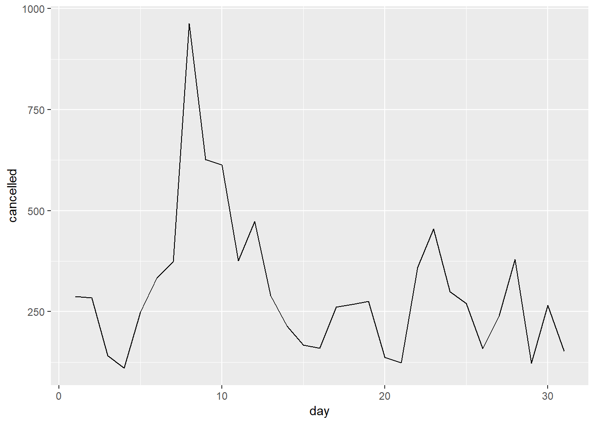

**Is the proportion of cancelled flights related to the average delay?**  

Proporton of canceled flights and then average delay of flights by day:

```r
flights %>% 
  group_by(day) %>% 
  summarise(cancelled = sum(is.na(arr_delay)),
            avg_delayed = mean(arr_delay, na.rm = TRUE),
            num = n(),
            cancelled_perc = cancelled / num) %>% 
  ggplot(aes(x = day, y = cancelled_perc))+
  geom_line()
```


```r
flights %>% 
  group_by(day) %>% 
  summarise(cancelled = sum(is.na(arr_delay)),
            avg_delayed = mean(arr_delay, na.rm = TRUE),
            num = n(),
            cancelled_perc = cancelled / num) %>% 
  ggplot(aes(x = day, y = avg_delayed))+
  geom_line()
```

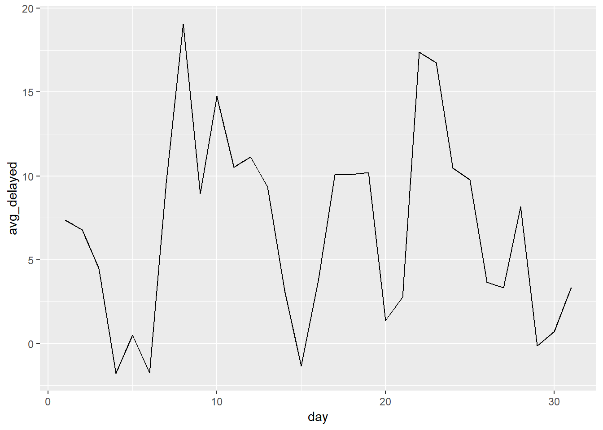

Looks roughly like there is some overlap.  
  
I liked Vincent's appraoch to this problem better than my own and would recommend checking out his code.  
  

**6. Which carrier has the worst delays? Challenge: can you disentangle the effects of bad airports vs. bad carriers? Why/why not? (Hint: think about flights %>% group_by(carrier, dest) %>% summarise(n()))**  
(key question)  


```r
flights %>% 
  group_by(carrier) %>% 
  summarise(avg_delay = mean(arr_delay, na.rm = TRUE),
            n = n()) %>% 
  arrange(desc(avg_delay))
```

```
## # A tibble: 16 x 3
##    carrier avg_delay     n
##    <chr>       <dbl> <int>
##  1 F9         21.9     685
##  2 FL         20.1    3260
##  3 EV         15.8   54173
##  4 YV         15.6     601
##  5 OO         11.9      32
##  6 MQ         10.8   26397
##  7 WN          9.65  12275
##  8 B6          9.46  54635
##  9 9E          7.38  18460
## 10 UA          3.56  58665
## 11 US          2.13  20536
## 12 VX          1.76   5162
## 13 DL          1.64  48110
## 14 AA          0.364 32729
## 15 HA         -6.92    342
## 16 AS         -9.93    714
```

Difficult to untangle in the `origin` airports because carriers may predominantly go through one of the three. The code below produces the origin name that the carrier that flies from the most along with the proportion of associated flights.     

```r
flights %>% 
  group_by(carrier, origin) %>% 
  summarise(n = n()) %>% 
  mutate(perc = n / sum(n)) %>% 
  group_by(carrier) %>% 
  mutate(rank = min_rank(-perc)) %>%
  arrange(carrier, rank) %>% 
  filter(rank == 1) %>% 
  select(carrier, highest_origin = origin, highest_prop = perc, n_total = n) %>% 
  arrange(desc(n_total))
```

```
## # A tibble: 16 x 4
## # Groups:   carrier [16]
##    carrier highest_origin highest_prop n_total
##    <chr>   <chr>                 <dbl>   <int>
##  1 UA      EWR                   0.786   46087
##  2 EV      EWR                   0.811   43939
##  3 B6      JFK                   0.770   42076
##  4 DL      LGA                   0.479   23067
##  5 MQ      LGA                   0.641   16928
##  6 AA      LGA                   0.472   15459
##  7 9E      JFK                   0.794   14651
##  8 US      LGA                   0.640   13136
##  9 WN      EWR                   0.504    6188
## 10 VX      JFK                   0.697    3596
## 11 FL      LGA                   1        3260
## 12 AS      EWR                   1         714
## 13 F9      LGA                   1         685
## 14 YV      LGA                   1         601
## 15 HA      JFK                   1         342
## 16 OO      LGA                   0.812      26
```

Below we look at destinations and the `carrier` that has the highest proportion of flights from one of the NYC destinations (ignoring for specific `origin` -- JFK, LGA, etc. are not seperated).

```r
flights %>% 
  group_by(dest, carrier) %>% 
  summarise(n = n()) %>% 
  mutate(perc = n / sum(n)) %>% 
  group_by(dest) %>% 
  mutate(rank = min_rank(-perc)) %>%
  arrange(carrier, rank) %>% 
  filter(rank == 1) %>% 
  select(dest, highest_carrier = carrier, highest_perc = perc, n_total = n) %>% 
  arrange(desc(n_total))
```

```
## # A tibble: 105 x 4
## # Groups:   dest [105]
##    dest  highest_carrier highest_perc n_total
##    <chr> <chr>                  <dbl>   <int>
##  1 ATL   DL                     0.614   10571
##  2 CLT   US                     0.614    8632
##  3 DFW   AA                     0.831    7257
##  4 MIA   AA                     0.617    7234
##  5 ORD   UA                     0.404    6984
##  6 IAH   UA                     0.962    6924
##  7 SFO   UA                     0.512    6819
##  8 FLL   B6                     0.544    6563
##  9 MCO   B6                     0.460    6472
## 10 LAX   UA                     0.360    5823
## # ... with 95 more rows
```

To get at the question of 'best carrier', you may consider doing a grouped comparison of average delays or cancellataions controlling for where they are flying to and from what origin...


**7. What does the `sort` argument to `count()` do. When might you use it?**  
  
`sort` orders by `n`, you may want to use it when you 


## Grouped mutates (and filters)

### 5.7.1.

**1. Refer back to the lists of useful mutate and filtering functions. Describe how each operation changes when you combine it with grouping.**  


**2. Which plane (tailnum) has the worst on-time record?**  

```r
flights %>% 
  group_by(tailnum) %>% 
  summarise(n = n(),
            num_not_delayed = sum(arr_delay <= 0, na.rm = TRUE),
            ontime_rate = num_not_delayed/ n, 
            sum_delayed_time_grt0 = sum(ifelse(arr_delay >= 0, arr_delay, 0), na.rm = TRUE)) %>% 
  filter(n > 100, !is.na(tailnum)) %>%
  arrange(ontime_rate)
```

```
## # A tibble: 1,200 x 5
##    tailnum     n num_not_delayed ontime_rate sum_delayed_time_grt0
##    <chr>   <int>           <int>       <dbl>                 <dbl>
##  1 N505MQ    242              83       0.343                  5911
##  2 N15910    280             105       0.375                  8737
##  3 N36915    228              86       0.377                  6392
##  4 N16919    251              96       0.382                  7955
##  5 N14998    230              88       0.383                  7166
##  6 N14953    256             100       0.391                  6550
##  7 N22971    230              90       0.391                  6547
##  8 N503MQ    191              75       0.393                  4420
##  9 N27152    109              43       0.394                  2058
## 10 N31131    109              43       0.394                  2740
## # ... with 1,190 more rows
```

N505MQ  

**3. What time of day should you fly if you want to avoid delays as much as possible?**  

average `dep_delay` by hour of day

```r
flights %>% 
  group_by(hour) %>% 
  summarise(med_delay = mean(arr_delay, na.rm = TRUE)) %>% 
  ggplot(aes(x = hour, y = med_delay))+
  geom_point()+ 
  geom_smooth()
```

```
## `geom_smooth()` using method = 'loess' and formula 'y ~ x'
```

```
## Warning: Removed 1 rows containing non-finite values (stat_smooth).
```

```
## Warning: Removed 1 rows containing missing values (geom_point).
```


Fly in the morning.

**4. For each destination, compute the total minutes of delay. For each, flight, compute the proportion of the total delay for its destination.**  


```r
flights %>% 
  group_by(dest, flight) %>% 
  summarise(TotalDelay_DestFlight = sum(arr_delay, na.rm = TRUE)) %>% 
  mutate(TotalDelay_Dest = sum(TotalDelay_DestFlight),
         PropOfDest = TotalDelay_DestFlight / TotalDelay_Dest)
```

```
## # A tibble: 11,467 x 5
## # Groups:   dest [105]
##    dest  flight TotalDelay_DestFlight TotalDelay_Dest PropOfDest
##    <chr>  <int>                 <dbl>           <dbl>      <dbl>
##  1 ABQ       65                   605            1113    0.544  
##  2 ABQ     1505                   508            1113    0.456  
##  3 ACK     1191                   652            1281    0.509  
##  4 ACK     1195                    20            1281    0.0156 
##  5 ACK     1291                   234            1281    0.183  
##  6 ACK     1491                   375            1281    0.293  
##  7 ALB     3256                   -12            6018   -0.00199
##  8 ALB     3260                   111            6018    0.0184 
##  9 ALB     3264                   -47            6018   -0.00781
## 10 ALB     3811                   570            6018    0.0947 
## # ... with 11,457 more rows
```

I did this such that flights could have "negative" delays, this could have been approached differently though...  

**5. Delays are typically temporally correlated: even once the problem that caused the initial delay has been resolved, later flights are delayed to allow earlier flights to leave. Using lag() explore how the delay of a flight is related to the delay of the immediately preceding flight.**  


```r
flights %>% 
  group_by(origin) %>% 
  mutate(delay_lag = lag(dep_delay, 1),
         diff_lag = abs(dep_delay -delay_lag)) %>% 
  ungroup() %>% 
  select(dep_delay, delay_lag) %>% 
  na.omit() %>% 
  cor()
```

```
##           dep_delay delay_lag
## dep_delay 1.0000000 0.3506866
## delay_lag 0.3506866 1.0000000
```

Correlation of $$dep\_delay_{t-1}$$ with $$dep\_delay_{t}$$ is 0.35 .  

Below is a function to get the correlation out for any lag level.


```r
cor_by_lag <- function(lag){
flights %>% 
  group_by(origin) %>% 
  mutate(delay_lag = lag(dep_delay, lag),
         diff_lag = abs(dep_delay -delay_lag)) %>% 
  ungroup() %>% 
  select(dep_delay, delay_lag) %>% 
  na.omit() %>% 
  cor() %>% 
  .[2,1] %>% 
  as.vector()
}
```

Let's see the correlation pushing the lag time back.

```r
cor_by_lag(1)
```

```
## [1] 0.3506866
```

```r
cor_by_lag(10)
```

```
## [1] 0.2622796
```

```r
cor_by_lag(100)
```

```
## [1] 0.04023232
```

```r
cor_by_lag(1000)
```

```
## [1] 0.03191625
```

It makes sense that these values get smaller as flights that are further apart have delay lengths that are less correlated. See [5.7.1.8.] for a sneak peak on iteration of this function.  
  

**6. Look at each destination. Can you find flights that are suspiciously fast? (i.e. flights that represent a potential data entry error). Compute the air time a flight relative to the shortest flight to that destination. Which flights were most delayed in the air?**  


```r
flights %>% 
  filter(!is.na(arr_delay)) %>%
  group_by(dest) %>%
  mutate(sd_air_time = sd(air_time),
         mean_air_time = mean(air_time)) %>% 
  ungroup() %>% 
  mutate(supect_fast_cutoff = mean_air_time - 4*sd_air_time,
         suspect_flag = air_time < supect_fast_cutoff) %>%
  select(dest, flight, hour, day, month, air_time, sd_air_time, mean_air_time, supect_fast_cutoff, suspect_flag, air_time, air_time) %>%
  filter(suspect_flag) 
```

```
## # A tibble: 4 x 10
##   dest  flight  hour   day month air_time sd_air_time mean_air_time
##   <chr>  <int> <dbl> <int> <int>    <dbl>       <dbl>         <dbl>
## 1 BNA     3805    19    23     3       70       11.0          114. 
## 2 GSP     4292    20    13     5       55        8.13          93.4
## 3 ATL     1499    17    25     5       65        9.81         113. 
## 4 MSP     4667    15     2     7       93       11.8          151. 
## # ... with 2 more variables: supect_fast_cutoff <dbl>, suspect_flag <lgl>
```

**7. Find all destinations that are flown by at least two carriers. Use that information to rank the carriers.**  

I found this quesiton ambiguous in terms of what it wants when it says "rank" the carriers using this. What I did was to say filter to just those destinations that have at least two carriers and then count the number of destinations with multiple carriers that each airline travels to. So it's almost which airlines have more routes to 'crowded' destinations.


```r
flights %>% 
  group_by(dest) %>% 
  mutate(n_carrier = n_distinct(carrier)) %>% 
  filter(n_carrier > 1) %>% 
  group_by(carrier) %>% 
  summarise(n_dest = n_distinct(dest)) %>% 
  mutate(rank = min_rank(-n_dest)) %>% 
  arrange(rank)
```

```
## # A tibble: 16 x 3
##    carrier n_dest  rank
##    <chr>    <int> <int>
##  1 EV          51     1
##  2 9E          48     2
##  3 UA          42     3
##  4 DL          39     4
##  5 B6          35     5
##  6 AA          19     6
##  7 MQ          19     6
##  8 WN          10     8
##  9 OO           5     9
## 10 US           5     9
## 11 VX           4    11
## 12 YV           3    12
## 13 FL           2    13
## 14 AS           1    14
## 15 F9           1    14
## 16 HA           1    14
```

Another way to approach this may have been to say to evaluate the delays between carriers going to the same destination and used that as a way of comparing and 'ranking' the best carriers. This would have been a more ambitious problem to answer.

**8. For each plane, count the number of flights before the first delay of greater than 1 hour.**  


```r
tail_nums_counts <- flights %>% 
  arrange(tailnum, month, day, dep_time) %>% 
  group_by(tailnum) %>% 
  mutate(cum_sum = cumsum(arr_delay <= 60),
         nrow = row_number(),
         nrow_equal = nrow == cum_sum,
         cum_sum_before = cum_sum * nrow_equal) %>%
  mutate(total_before_hour = max(cum_sum_before, na.rm = TRUE)) %>% 
  select(year, month, day, dep_time, tailnum, arr_delay, cum_sum, nrow, nrow_equal, cum_sum_before, total_before_hour) %>% 
  ungroup()

#let's change this to get rid of canceled flights, because those don't count as flights or delays.
tail_nums_counts <- flights %>% 
  filter(!is.na(arr_delay)) %>% 
  select(tailnum, month, day, dep_time, arr_delay) %>% 
  arrange(tailnum, month, day, dep_time) %>% 
  group_by(tailnum) %>% 
  mutate(cum_sum = cumsum(arr_delay <= 60),
         nrow = row_number(),
         nrow_equal = nrow == cum_sum,
         cum_sum_before = cum_sum * nrow_equal) %>%
  mutate(total_before_hour = max(cum_sum_before, na.rm = TRUE)) %>% 
  select(month, day, dep_time, tailnum, arr_delay, cum_sum, nrow, nrow_equal, cum_sum_before, total_before_hour) %>% 
  ungroup()

tail_nums_counts %>% 
  filter(!is.na(tailnum)) %>% 
  arrange(desc(nrow), tailnum) %>% 
  distinct(tailnum, .keep_all = TRUE) %>% 
  select(tailnum, total_before_hour) %>% 
  arrange(tailnum)
```

```
## # A tibble: 4,037 x 2
##    tailnum total_before_hour
##    <chr>               <dbl>
##  1 D942DN                  0
##  2 N0EGMQ                  0
##  3 N10156                  9
##  4 N102UW                 25
##  5 N103US                 46
##  6 N104UW                  3
##  7 N10575                  0
##  8 N105UW                 22
##  9 N107US                 20
## 10 N108UW                 36
## # ... with 4,027 more rows
```


# Appendix
The appendix is either extensions upon solutions. Solving the problems using functions we haven'te learned yet, or other random notes / tidbits.  

## 5.4.1.3.
You actually don't need `one_of` for selecting by character vector, more useful is when using it to negate fields by name.  


```r
select(flights, -one_of(vars))
```

```
## # A tibble: 336,776 x 15
##     year month   day sched_dep_time sched_arr_time carrier flight tailnum
##    <int> <int> <int>          <int>          <int> <chr>    <int> <chr>  
##  1  2013     1     1            515            819 UA        1545 N14228 
##  2  2013     1     1            529            830 UA        1714 N24211 
##  3  2013     1     1            540            850 AA        1141 N619AA 
##  4  2013     1     1            545           1022 B6         725 N804JB 
##  5  2013     1     1            600            837 DL         461 N668DN 
##  6  2013     1     1            558            728 UA        1696 N39463 
##  7  2013     1     1            600            854 B6         507 N516JB 
##  8  2013     1     1            600            723 EV        5708 N829AS 
##  9  2013     1     1            600            846 B6          79 N593JB 
## 10  2013     1     1            600            745 AA         301 N3ALAA 
## # ... with 336,766 more rows, and 7 more variables: origin <chr>,
## #   dest <chr>, air_time <dbl>, distance <dbl>, hour <dbl>, minute <dbl>,
## #   time_hour <dttm>
```


## 5.5.2.1.
Other, more sophisticated method^[This method is helpful for if you have more than ust a couple variables you are applying a transformation to.]

```r
mutate_at(.tbl = flights, 
          .vars = c("dep_time", "sched_dep_time"), 
          .funs = funs(new = time_to_mins)) 
```

## 5.5.2.2

### Closer look at `air_time`

Wanted to look at original `air_time` variable a little more. Histogram below shows that most differences are now between 20 - 40 minutes from the actual time.

```r
flights_new2 %>% 
  group_by(dest) %>% 
  summarise(distance_med = median(distance, na.rm = TRUE),
            air_calc_med = median(air_calc, na.rm = TRUE),
            air_old_med = median(air_time, na.rm = TRUE),
            diff_new_old = air_calc_med - air_old_med,
            diff_hrs = as.factor(round(diff_new_old/60)),
            num = n()) %>% 
  ggplot(aes(diff_new_old))+
  geom_histogram()
```

```
## `stat_bin()` using `bins = 30`. Pick better value with `binwidth`.
```

```
## Warning: Removed 5 rows containing non-finite values (stat_bin).
```

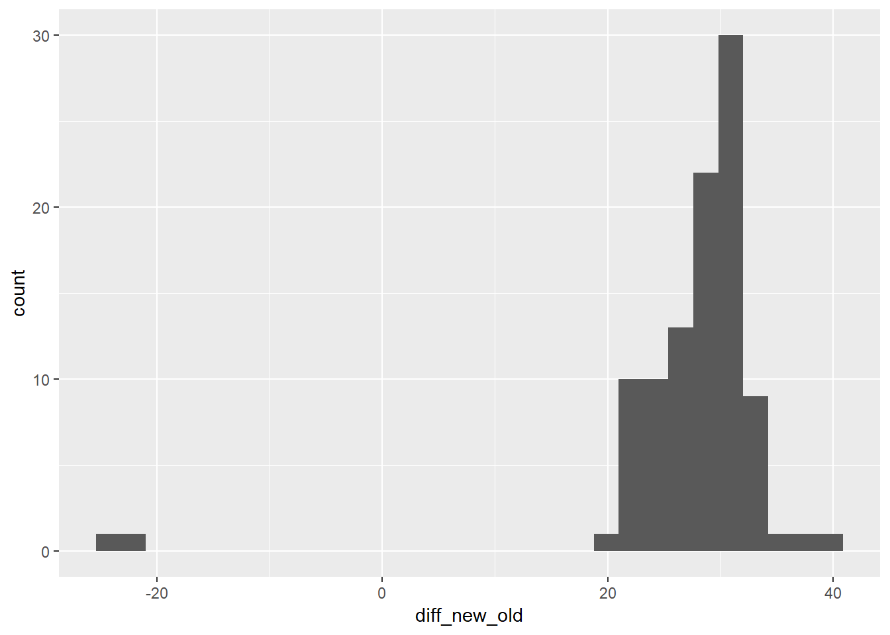

Regressing `diff` on `arr_delay` and `dep_delay` (remember `diff` is the difference between `air_time` and `air_calc`)

```r
mod_air_time2 <- mutate(flights_new2, diff =  (air_time - air_calc)) %>% 
  select(-air_time, -air_calc, -flight, -tailnum, -dest) %>% 
  na.omit() %>% 
  lm(diff ~ dep_delay + arr_delay, data = .)

summary(mod_air_time2)
```

```
## 
## Call:
## lm(formula = diff ~ dep_delay + arr_delay, data = .)
## 
## Residuals:
##     Min      1Q  Median      3Q     Max 
## -93.168  -6.684   0.688   6.878 101.169 
## 
## Coefficients:
##               Estimate Std. Error t value Pr(>|t|)    
## (Intercept) -33.511843   0.024118 -1389.5   <2e-16 ***
## dep_delay     0.533376   0.001355   393.5   <2e-16 ***
## arr_delay    -0.552852   0.001217  -454.2   <2e-16 ***
## ---
## Signif. codes:  0 '***' 0.001 '**' 0.01 '*' 0.05 '.' 0.1 ' ' 1
## 
## Residual standard error: 12.43 on 319806 degrees of freedom
## Multiple R-squared:  0.3956,	Adjusted R-squared:  0.3956 
## F-statistic: 1.047e+05 on 2 and 319806 DF,  p-value: < 2.2e-16
```
Doing such accounts for ~40% of the variation in the values.

The `dep_delay` and `arr_delay` variables are highly colinear which is part of the reason for the coefficients being opposite in the model.

```r
flights_new2 %>% 
  select(air_time, air_calc, arr_delay, dep_delay) %>% 
  mutate(diff = air_time - air_calc) %>% 
  select(-air_time, -air_calc) %>% 
  na.omit() %>% 
  cor()
```

```
##            arr_delay   dep_delay        diff
## arr_delay  1.0000000  0.91531953 -0.32086698
## dep_delay  0.9153195  1.00000000 -0.07582942
## diff      -0.3208670 -0.07582942  1.00000000
```

Typically, this suggests that you do not need to include both variables in the model as they will likely be providing the same information. Though here that is not the case as only including `arr_delay` associates with a steep decline in `R^2` to just account for ~10% of the variation.

```r
mod_air_time <- mutate(flights_new2, diff =  (air_time - air_calc)) %>% 
  select(-air_time, -air_calc, -flight, -tailnum, -dest) %>% 
  na.omit() %>% 
lm(diff ~ arr_delay, data = .)

summary(mod_air_time)
```

```
## 
## Call:
## lm(formula = diff ~ arr_delay, data = .)
## 
## Residuals:
##      Min       1Q   Median       3Q      Max 
## -182.960   -6.385    2.013    7.983  154.382 
## 
## Coefficients:
##               Estimate Std. Error t value Pr(>|t|)    
## (Intercept) -2.984e+01  2.710e-02 -1101.3   <2e-16 ***
## arr_delay   -1.144e-01  5.972e-04  -191.6   <2e-16 ***
## ---
## Signif. codes:  0 '***' 0.001 '**' 0.01 '*' 0.05 '.' 0.1 ' ' 1
## 
## Residual standard error: 15.14 on 319807 degrees of freedom
## Multiple R-squared:  0.103,	Adjusted R-squared:  0.103 
## F-statistic: 3.67e+04 on 1 and 319807 DF,  p-value: < 2.2e-16
```

Add predictions from models of `air_time` to dataframe and take sample of 500 from entire `flights` dataset to visualise.

```r
flights_preds_mod <- flights_new2 %>% 
  mutate(diff =  (air_time - air_calc)) %>% 
  na.omit() %>% 
  modelr::spread_predictions(mod_air_time, mod_air_time2) %>% 
  select(diff, dep_delay, arr_delay, air_calc, air_time, mod_air_time, mod_air_time2) %>% 
  sample_n(500) 
```

Looking at `dep_delay` on `arr_delay` with `diff` overlaid in colour.

```r
flights_preds_mod %>%
  mutate(diff_group = cut(diff, 4)) %>% 
  ggplot(aes(dep_delay, arr_delay))+
  geom_point(aes(colour = diff_group))
```


I'm going to stop there though for now. Below are just some other plots I was messing aroun with.

### Other plots with `air_time`
These are mostly just me messing around. This section will be very tough to follow.  
  
Produce 3-d plot with actuals in black and predictions in red and green (not evaluated in html document).

```r
a <- flights_preds_mod$arr_delay
b <- flights_preds_mod$dep_delay
c <- flights_preds_mod$diff
rgl::plot3d(a, b, c)

#one variabled model
rgl::points3d(a, 0, flights_preds_mod$mod_air_time, color = "red")

#two variabled model
rgl::points3d(a, b, flights_preds_mod$mod_air_time2, color = "green")
```

Plot of median `air_time` vs. median `dist`.

```r
flights_new2 %>% 
  select(dest, dep_time, arr_time, air_time, distance) %>% 
  mutate_at(.vars = c("dep_time", "arr_time"), 
            .funs = funs(time_to_mins)) %>% 
  group_by(dest) %>% 
  summarise(med_air = median(air_time, na.rm = TRUE),
            med_dist = median(distance, na.rm = TRUE)) %>% 
  ggplot(., aes(x = med_dist, y = med_air))+
  geom_point()+
  scale_y_continuous(breaks = seq(0, 660, 60))
```

```
## Warning: funs() is soft deprecated as of dplyr 0.8.0
## please use list() instead
## 
## # Before:
## funs(name = f(.)
## 
## # After: 
## list(name = ~f(.))
## This warning is displayed once per session.
```

```
## Warning: Removed 1 rows containing missing values (geom_point).
```


Use linear regression to identify those points that were off from the relationship between `air_time` and `distance`.
+First build model
+Add residuals onto dataframe
+Arrange df so that largest residuals are at the top.

```r
time_dist_mod <- lm(air_time ~ distance, data = flights)

flights %>% 
  select(dest, dep_time, arr_time, air_time, distance) %>% 
  mutate_at(.vars = c("dep_time", "arr_time"), 
            .funs = funs(time_to_mins)) %>% 
  group_by(dest) %>% 
  summarise(air_time = median(air_time, na.rm = TRUE),
            distance = median(distance, na.rm = TRUE)) %>% 
  modelr::add_predictions(time_dist_mod) %>% 
  modelr::add_residuals(time_dist_mod) %>% 
  arrange(desc(abs(resid)))
```

```
## # A tibble: 105 x 5
##    dest  air_time distance  pred resid
##    <chr>    <dbl>    <dbl> <dbl> <dbl>
##  1 ANC       414.     3370 443.  -29.0
##  2 HNL       616      4963 644.  -28.4
##  3 BQN       194      1576 217.  -23.2
##  4 SJU       197      1598 220.  -23.0
##  5 PSE       201      1617 222.  -21.4
##  6 STT       203      1623 223.  -20.2
##  7 EGE       253      1726 236.   16.9
##  8 BGR        54       378  66.1 -12.1
##  9 PSP       330.     2378 318.   12.1
## 10 HDN       247      1728 236.   10.6
## # ... with 95 more rows
```
Looks like BQN, SJU, PSE, and STT are the closer of dests with the greatest departures (in addition to the higher leverage points ANC and HNL). (note the columns here are median values despite the 'med' not being in the column names)

Let's do the samthing as above but just plot this output in a gpplot with our preds representing the line from our model.
(are using our own specified model rather than just using `geom_smooth`.)

```r
flights %>% 
  select(dest, dep_time, arr_time, air_time, distance) %>% 
  mutate_at(.vars = c("dep_time", "arr_time"), 
            .funs = funs(time_to_mins)) %>% 
  group_by(dest) %>% 
  summarise(air_time = median(air_time, na.rm = TRUE),
            distance = median(distance, na.rm = TRUE)) %>% 
  modelr::add_predictions(time_dist_mod) %>% 
  modelr::add_residuals(time_dist_mod) %>% 
  arrange(desc(abs(resid))) %>% 
  ggplot(., aes(x = distance, y = air_time))+
    geom_line(aes(y = pred), colour = "navy blue")+
  geom_point()+
  scale_y_continuous(breaks = seq(0, 660, 60))
```

```
## Warning: Removed 1 rows containing missing values (geom_point).
```


For fun, select 6 random `dest` and plot the `dep_time` vs `air_calc` (true `air_time`) with a median line cutting through the ponits.

```r
set.seed(1234)
flights_new2 %>% 
  mutate_at(.vars = c("dep_time", "arr_time"), 
            .funs = funs(time_to_mins)) %>% 
  group_by(dest) %>% 
  mutate(med_calc = median(air_calc, na.rm = TRUE)) %>% 
  nest() %>% 
  sample_n(6) %>% 
  unnest() %>% 
  ggplot(aes(x = dep_time, y = air_calc))+
  geom_point(aes(colour = dest))+
  geom_line(aes(y = med_calc))+
  scale_x_continuous(breaks = seq(0, 24*60, 120), limits = c(0, 24*60))+
  facet_wrap(~dest)
```

```
## Warning: Removed 604 rows containing missing values (geom_point).
```

```
## Warning: Removed 101 rows containing missing values (geom_path).
```


Do the same with the original `air_calc` values (would want to standardize access between these and above)

```r
set.seed(1234)
flights %>% 
  # select(dest, dep_time, arr_time, air_time, distance) %>% 
  mutate_at(.vars = c("dep_time", "arr_time"), 
            .funs = funs(time_to_mins)) %>% 
  group_by(dest) %>% 
  mutate(med_AirTime = median(air_time, na.rm = TRUE)) %>% 
  nest() %>% 
  sample_n(6) %>% 
  unnest() %>% 
  ggplot(aes(x = dep_time, y = air_time))+
  geom_point(aes(colour = dest))+
  geom_line(aes(y = med_AirTime))+
  scale_x_continuous(breaks = seq(0, 24*60, 120), limits = c(0, 24*60))+
  facet_wrap(~dest)
```

```
## Warning: Removed 289 rows containing missing values (geom_point).
```

```
## Warning: Removed 101 rows containing missing values (geom_path).
```


Explore the `air_time` var more.
If you want to see how these may differ by different categories^[ Linear regression is used here which aren't learned until later in the book though.]. 

Select 6 random `dest`s and plot all points for `distance` and `air_time`

```r
flights %>% 
  select(dest, dep_time, arr_time, air_time, distance) %>% 
  mutate_at(.vars = c("dep_time", "arr_time"), 
            .funs = funs(time_to_mins)) %>% 
  group_by(dest) %>% 
  nest() %>% 
  sample_n(6) %>% 
  unnest() %>% 
  ggplot(aes(x = distance, y = air_time))+
  geom_point(aes(colour = dest))
```

```
## Warning: Removed 341 rows containing missing values (geom_point).
```


Distribution of times each flight number runs in window.

```r
flights %>% 
  group_by(flight) %>% 
  summarise(n = n()) %>%
  ungroup() %>% 
  filter(n <100) %>% 
  ggplot(aes(x = n))+
  geom_histogram(bins = 100)
```


## 5.6.7.1.

Below is an extension on using the `quantile` method, but it is far beyond where we are right now.

For the question *90th percentile for delays for flights by destination*  we used `quantile` to output only the 90th percentile of values for each destination. Here, I want to address what if you had wanted to output the delays at multiple values, say, arbitrarily the 25th, 50th, 75th percentiles. One option would be to create a new variable for each value and in each quantile function sepcify 0.25, 0.50, 0.75 respectively.  


```r
flights %>% 
  group_by(dest) %>% 
  summarise(delay.25 = quantile(arr_delay, 0.25, na.rm = TRUE),
            delay.50 = quantile(arr_delay, 0.50, na.rm = TRUE),
            delay.75 = quantile(arr_delay, 0.75, na.rm = TRUE))
```

```
## # A tibble: 105 x 4
##    dest  delay.25 delay.50 delay.75
##    <chr>    <dbl>    <dbl>    <dbl>
##  1 ABQ      -24       -5.5     22.8
##  2 ACK      -13       -3       10  
##  3 ALB      -17       -4       28  
##  4 ANC      -10.8      1.5     10  
##  5 ATL      -12       -1       16  
##  6 AUS      -19       -5       15  
##  7 AVL      -11       -1       13  
##  8 BDL      -18      -10       14  
##  9 BGR      -21.8     -9       19.8
## 10 BHM      -20       -2       34  
## # ... with 95 more rows
```

But there is a lot of replication here and the `quantile` function is also able to output more than one value by specifying the `probs` argument.

```r
quantile(c(1:100), probs = c(0.25, .50, 0.75))
```

```
##   25%   50%   75% 
## 25.75 50.50 75.25
```

So, in theory, rather than calling `quantile` multiple times, you could just call it once. However for any variable you create `summarise` is expecting only a single value output for each row, so just passing it in as-is will cause it to fail.

```r
flights %>% 
  group_by(dest) %>% 
  summarise(delays = quantile(arr_delay, probs = c(0.25, .50, 0.75), na.rm = TRUE))
```

```
## Error: Column `delays` must be length 1 (a summary value), not 3
```

To make this work you need to make the value a list, so that it will output a single list in each row of the column^[This style is covered at the end of the book in the section 'list-columns' in iteration.]^[Also you need your dataframe to be in a tibble form rather than traditional dataframes for list-cols to work]. I am going to create another list-column field of the quantiles I specified.  


```r
prob_vals <- seq(from = 0.25, to = 0.75, by = 0.25)

flights_quantiles <- flights %>% 
  group_by(dest) %>% 
  summarise(delays_val = list(quantile(arr_delay, probs = prob_vals, na.rm = TRUE)),
            delays_q = list(c('25th', '50th', '75th')))

flights_quantiles
```

```
## # A tibble: 105 x 3
##    dest  delays_val delays_q 
##    <chr> <list>     <list>   
##  1 ABQ   <dbl [3]>  <chr [3]>
##  2 ACK   <dbl [3]>  <chr [3]>
##  3 ALB   <dbl [3]>  <chr [3]>
##  4 ANC   <dbl [3]>  <chr [3]>
##  5 ATL   <dbl [3]>  <chr [3]>
##  6 AUS   <dbl [3]>  <chr [3]>
##  7 AVL   <dbl [3]>  <chr [3]>
##  8 BDL   <dbl [3]>  <chr [3]>
##  9 BGR   <dbl [3]>  <chr [3]>
## 10 BHM   <dbl [3]>  <chr [3]>
## # ... with 95 more rows
```

To convert these outputs out of the list-col format, I can use the function `unnest`.


```r
flights_quantiles %>% 
  unnest()
```

```
## # A tibble: 315 x 3
##    dest  delays_val delays_q
##    <chr>      <dbl> <chr>   
##  1 ABQ        -24   25th    
##  2 ABQ         -5.5 50th    
##  3 ABQ         22.8 75th    
##  4 ACK        -13   25th    
##  5 ACK         -3   50th    
##  6 ACK         10   75th    
##  7 ALB        -17   25th    
##  8 ALB         -4   50th    
##  9 ALB         28   75th    
## 10 ANC        -10.8 25th    
## # ... with 305 more rows
```

This will output the values as individual rows, repeating the `dest` value for the length of the list. If I want to spread the `delays_quantile` values into seperate columns I can use the `spread` function that is in the tidying R chapter.


```r
flights_quantiles %>% 
  unnest() %>% 
  spread(key = delays_q, value = delays_val, sep = "_")
```

```
## # A tibble: 105 x 4
##    dest  delays_q_25th delays_q_50th delays_q_75th
##    <chr>         <dbl>         <dbl>         <dbl>
##  1 ABQ           -24            -5.5          22.8
##  2 ACK           -13            -3            10  
##  3 ALB           -17            -4            28  
##  4 ANC           -10.8           1.5          10  
##  5 ATL           -12            -1            16  
##  6 AUS           -19            -5            15  
##  7 AVL           -11            -1            13  
##  8 BDL           -18           -10            14  
##  9 BGR           -21.8          -9            19.8
## 10 BHM           -20            -2            34  
## # ... with 95 more rows
```

Let's plot our unnested (but not unspread) data to see roughly the distribution of the delays for each destination at our quantiles of interest^[The mutate step that is commented-out would reorder the `delays_q` variable according to the mean value of the `delays_val`, but this is not necessary here so I commented it out. You will learn more about this in the factors chapter.lm].

```r
flights_quantiles %>% 
  unnest() %>% 
  # mutate(delays_q = forcats::fct_reorder(f = delays_q, x = delays_val, fun = mean, na.rm = TRUE)) %>%
  ggplot(aes(x = delays_q, y = delays_val))+
  geom_boxplot()
```

```
## Warning: Removed 3 rows containing non-finite values (stat_boxplot).
```


It can be a hassle naming the values explicitly. `quantile`'s default `probs` argument value is 0, 0.25, 0.5, 0.75, 1. Rather than needing to type the `delays_q` values `list(c('0%', '25%', '50%', '75%', '100%'))` you could have generated the values of these names dynamically using the `map` function in the `purrr` package (see chapter on iteration) to pass the `names` function over each value in `delays_val`.    


```r
flights_quantiles2 <- flights %>% 
  group_by(dest) %>% 
  summarise(delays_val = list(quantile(arr_delay, na.rm = TRUE)),
            delays_q = list(c('0th', '25th', '50th', '75th', '100th'))) %>% 
  mutate(delays_q2 = purrr::map(delays_val, names))

flights_quantiles2
```

```
## # A tibble: 105 x 4
##    dest  delays_val delays_q  delays_q2
##    <chr> <list>     <list>    <list>   
##  1 ABQ   <dbl [5]>  <chr [5]> <chr [5]>
##  2 ACK   <dbl [5]>  <chr [5]> <chr [5]>
##  3 ALB   <dbl [5]>  <chr [5]> <chr [5]>
##  4 ANC   <dbl [5]>  <chr [5]> <chr [5]>
##  5 ATL   <dbl [5]>  <chr [5]> <chr [5]>
##  6 AUS   <dbl [5]>  <chr [5]> <chr [5]>
##  7 AVL   <dbl [5]>  <chr [5]> <chr [5]>
##  8 BDL   <dbl [5]>  <chr [5]> <chr [5]>
##  9 BGR   <dbl [5]>  <chr [5]> <chr [5]>
## 10 BHM   <dbl [5]>  <chr [5]> <chr [5]>
## # ... with 95 more rows
```

And then let's `unnest` the data^[The names assigned by the `quantile` function are a little different from those I supplied.].

```r
flights_quantiles2 %>% 
  unnest()
```

```
## # A tibble: 525 x 4
##    dest  delays_val delays_q delays_q2
##    <chr>      <dbl> <chr>    <chr>    
##  1 ABQ        -61   0th      0%       
##  2 ABQ        -24   25th     25%      
##  3 ABQ         -5.5 50th     50%      
##  4 ABQ         22.8 75th     75%      
##  5 ABQ        153   100th    100%     
##  6 ACK        -25   0th      0%       
##  7 ACK        -13   25th     25%      
##  8 ACK         -3   50th     50%      
##  9 ACK         10   75th     75%      
## 10 ACK        221   100th    100%     
## # ... with 515 more rows
```


## 5.6.7.4.

To measure the difference in speed you can use the `microbenchmark` function

```r
microbenchmark::microbenchmark(sub_optimal = filter(flights, is.na(dep_delay) | is.na(arr_delay)),
                               optimal = filter(flights, is.na(arr_delay)),
                               times = 10)
```

```
## Unit: milliseconds
##         expr    min     lq     mean  median      uq     max neval cld
##  sub_optimal 8.9264 9.6834 11.01722 11.0962 12.4696 13.3862    10   b
##      optimal 5.6547 6.6423  7.67271  7.4279  9.1390  9.6563    10  a
```


## 5.6.7.5.

Explore the percentage delayed vs. percentage cancelled.

```r
flights %>% 
  group_by(day) %>% 
  summarise(cancelled = sum(is.na(arr_delay)),
            delayed = sum(arr_delay > 0, na.rm = TRUE),
            num = n(),
            cancelled_perc = cancelled / num,
            delayed_perc = delayed / num) %>% 
  ggplot(aes(x = day))+
  geom_line(aes(y = cancelled_perc), colour = "dark blue")+
    geom_line(aes(y = delayed_perc), colour = "dark red")
```


Let's try faceting by origin and looking at both values next to each other.

```r
flights %>% 
  group_by(origin, day) %>% 
  summarise(cancelled = sum(is.na(arr_delay)),
            avg_delayed = mean(arr_delay, na.rm = TRUE),
            num = n(),
            cancelled_perc = cancelled / num) %>% 
  gather(key = type, value = value, avg_delayed, cancelled_perc) %>% 
  ggplot(aes(x = day, y = value))+
  geom_line()+
  facet_grid(type ~ origin, scales = "free_y")
```


Look's like the relationship across origins with the delay overlaid with color (not actually crazy about how this look).  


```r
flights %>% 
  group_by(origin, day) %>% 
  summarise(cancelled = sum(is.na(arr_delay)),
            avg_delayed = mean(arr_delay, na.rm = TRUE),
            num = n(),
            cancelled_perc = cancelled / num) %>% 
  ggplot(aes(x = day, y = cancelled_perc, colour = avg_delayed))+
  geom_line()+
  facet_grid(origin ~ .)
```


Let's look at values as individual points and overlay a `geom_smooth`

```r
flights %>% 
  group_by(origin, day) %>% 
  summarise(cancelled = sum(is.na(arr_delay)),
            avg_delayed = mean(arr_delay, na.rm = TRUE),
            num = n(),
            cancelled_perc = cancelled / num) %>% 
  ggplot(aes(avg_delayed, cancelled_perc, colour = origin))+
  geom_point()+
  geom_smooth()
```

```
## `geom_smooth()` using method = 'loess' and formula 'y ~ x'
```


### Modeling approach

We also could approach this using a model and regressing the average proportion of cancelled flights on average delay.

```r
cancelled_mod1 <- flights %>% 
  group_by(origin, day) %>% 
  summarise(cancelled = sum(is.na(arr_delay)),
            avg_delayed = mean(arr_delay, na.rm = TRUE),
            num = n(),
            cancelled_perc = cancelled / num) %>% 
  lm(cancelled_perc ~ avg_delayed, data = .)

summary(cancelled_mod1)
```

```
## 
## Call:
## lm(formula = cancelled_perc ~ avg_delayed, data = .)
## 
## Residuals:
##       Min        1Q    Median        3Q       Max 
## -0.026363 -0.009392 -0.002610  0.006196  0.048436 
## 
## Coefficients:
##              Estimate Std. Error t value Pr(>|t|)    
## (Intercept) 0.0152588  0.0020945   7.285 1.12e-10 ***
## avg_delayed 0.0018688  0.0002311   8.086 2.54e-12 ***
## ---
## Signif. codes:  0 '***' 0.001 '**' 0.01 '*' 0.05 '.' 0.1 ' ' 1
## 
## Residual standard error: 0.01342 on 91 degrees of freedom
## Multiple R-squared:  0.4181,	Adjusted R-squared:  0.4117 
## F-statistic: 65.39 on 1 and 91 DF,  p-value: 2.537e-12
```

```r
  # ggplot(aes(x = day, y = cancelled_perc))+
  # geom_line()
```

If you were confused by the `.` in `lm(cancelled_perc ~ avg_delayed, data = .)`, the dot specifies where the output from the prior steps should be piped into. The default is for it to go into the first argument, but for the `lm` function, data is not the first argument, so I have to explicitly tell it that the prior steps output should be inputted into the data argument of the `lm` function. See [On piping dots] for more details.   
  
The average delay accounts for 42% of the variation in the proportion of canceled flights.
  
Modeling the log-odds of the proportion of cancelled flights might be more successful as it produces a variable not constrained by 0 to 1, better aligning with the assumptions of linear regression.


```r
cancelled_mod2 <- flights %>% 
  group_by(origin, day) %>% 
  summarise(cancelled = sum(is.na(arr_delay)),
            avg_delayed = mean(arr_delay, na.rm = TRUE),
            num = n(),
            cancelled_perc = cancelled / num,
            cancelled_logodds = log(cancelled / (num - cancelled))) %>%
  lm(cancelled_logodds ~ avg_delayed, data = .)
```

To convert logodds back to percentage, I built the following equation.


```r
convert_logodds <- function(log_odds) exp(log_odds) / (1 + exp(log_odds))
```

Let's calculate the MAE or mean absolute error on our percentages.

```r
cancelled_preds2 <- flights %>% 
  group_by(origin, day) %>% 
  summarise(cancelled = sum(is.na(arr_delay)),
            avg_delayed = mean(arr_delay, na.rm = TRUE),
            num = n(),
            cancelled_perc = cancelled / num,
            cancelled_logodds = log(cancelled / (num - cancelled))) %>%
  ungroup() %>% 
  modelr::spread_predictions(cancelled_mod1, cancelled_mod2) %>% 
  mutate(cancelled_mod2 = convert_logodds(cancelled_mod2))

cancelled_preds2 %>% 
  summarise(MAE1 = mean(abs(cancelled_perc - cancelled_mod1), na.rm = TRUE),
            MAE2 = mean(abs(cancelled_perc - cancelled_mod2), na.rm = TRUE),
            mean_value = mean(cancelled_perc, na.rm = TRUE))
```

```
## # A tibble: 1 x 3
##     MAE1    MAE2 mean_value
##    <dbl>   <dbl>      <dbl>
## 1 0.0101 0.00954     0.0279
```

Let's look at the differences in the outputs of the predictions from these models.


```r
cancelled_preds2 %>% 
  ggplot(aes(avg_delayed, cancelled_perc))+
  geom_point()+
  scale_size_continuous(range = c(1, 2))+
  geom_line(aes(y = cancelled_mod1), colour = "blue", size = 1)+
  geom_line(aes(y = cancelled_mod2), colour = "red", size = 1)
```


^[Another approach may be to try and identify the individual risk of having a flight cancelled based on the average delay. If this is the case, you may want to use model evaluation techniques that seperate models based on the assigned probabilities in which case MAE may actually not be the most appropriate evaluation technique. You could try using logistic regression for this. You may also consider taking into account the weight of each of the points. I had discussions on these, but decided they were too in the weeds so deleted them even from the appendix...]
  

## 5.6.7.6.


As an example, let's look at just Atl flights from LGA and compare DL, FL, MQ.


```r
flights %>% 
  filter(dest == 'ATL', origin == 'LGA') %>% 
  count(carrier)
```

```
## # A tibble: 5 x 2
##   carrier     n
##   <chr>   <int>
## 1 DL       5544
## 2 EV          1
## 3 FL       2337
## 4 MQ       2322
## 5 WN         59
```

And compare the median delays between the three primary carriers DL, FL, MQ.


```r
carriers_lga_atl <- flights %>% 
  filter(dest == 'ATL', origin == 'LGA') %>% 
  group_by(carrier) %>% 
  # filter out small samples
  mutate(n_tot = n()) %>% 
  filter(n_tot > 100) %>% 
  select(-n_tot) %>% 
  ###
  filter(!is.na(arr_delay)) %>% 
  ungroup()

label <- carriers_lga_atl %>% 
  group_by(carrier) %>% 
  summarise(arr_delay = median(arr_delay, na.rm = TRUE))

carriers_lga_atl %>% 
  select(carrier, arr_delay) %>% 
  ggplot()+
  geom_boxplot(aes(carrier, arr_delay, colour = carrier), outlier.shape = NA)+
  coord_cartesian(y = c(-60, 75))+
  geom_text(mapping = aes(x = carrier, group = carrier, y = arr_delay + 5, label = arr_delay), data = label)
```


Or perhaps you want to use a statistical method to compare if the differences in the grouped are significant...

```r
carriers_lga_atl %>% 
  lm(arr_delay ~ carrier, data = .) %>% 
  summary()
```

```
## 
## Call:
## lm(formula = arr_delay ~ carrier, data = .)
## 
## Residuals:
##    Min     1Q Median     3Q    Max 
## -64.74 -22.33 -11.33   4.67 888.67 
## 
## Coefficients:
##             Estimate Std. Error t value Pr(>|t|)    
## (Intercept)   6.3273     0.6149   10.29  < 2e-16 ***
## carrierFL    14.4172     1.1340   12.71  < 2e-16 ***
## carrierMQ     7.7067     1.1417    6.75 1.56e-11 ***
## ---
## Signif. codes:  0 '***' 0.001 '**' 0.01 '*' 0.05 '.' 0.1 ' ' 1
## 
## Residual standard error: 45.48 on 9979 degrees of freedom
## Multiple R-squared:  0.01692,	Adjusted R-squared:  0.01672 
## F-statistic: 85.86 on 2 and 9979 DF,  p-value: < 2.2e-16
```

This shows the mean delay for DL is ~6.3, FL is ~20.7, MQ is ~14 and FL and MQ are significantly different from DL (and DL is significantly different from 0)^[Repeated t-test methods could be used for comparing MQ and FL, see function `pairwise.t.test`]. The carrier accouts for ~1.6% of the variation in arrival... etc....  


## 5.7.1.6.

Let's look at the fastest 20 `air_time`s for each destination.

```r
flights_new2 %>% 
  group_by(dest) %>% 
  mutate(min_rank = min_rank(air_time)) %>% 
  filter(min_rank < 20) %>% 
  ggplot(aes(distance, air_time, colour = dest))+
  geom_point()+
  guides(colour = FALSE)
```


Let's do the same for my custom `air_time` calculation `air_calc`. 

```r
flights_new2 %>% 
  group_by(dest) %>% 
  mutate(min_rank = min_rank(air_calc)) %>% 
  filter(min_rank < 20) %>% 
  ggplot(aes(distance, air_calc, colour = dest))+
  geom_point()+
  guides(colour = FALSE)
```


*Rather than the fastest 20, let's look at the mean `dist` and `air_time` for each^[Each colour corresponds with a `dest` though I excluded the legend.].*  
  
First using the `air_time` value.

```r
flights_new2 %>% 
  mutate_at(.vars = c("dep_time", "arr_time"), 
            .funs = funs(time_to_mins)) %>% 
  group_by(dest) %>% 
  summarise(mean_air = mean(air_time, na.rm = TRUE),
            mean_dist = mean(distance, na.rm = TRUE)) %>% 
  ggplot(., aes(x = mean_dist, y = mean_air))+
  geom_point(aes(colour = dest))+
  scale_y_continuous(breaks = seq(0, 660, 60))+
  guides(colour = FALSE)
```

```
## Warning: funs() is soft deprecated as of dplyr 0.8.0
## please use list() instead
## 
## # Before:
## funs(name = f(.)
## 
## # After: 
## list(name = ~f(.))
## This warning is displayed once per session.
```

```
## Warning: Removed 1 rows containing missing values (geom_point).
```


Then with the custom `air_calc`.

```r
flights_new2 %>% 
  mutate_at(.vars = c("dep_time", "arr_time"), 
            .funs = funs(time_to_mins)) %>% 
  group_by(dest) %>% 
  summarise(mean_air = mean(air_calc, na.rm = TRUE),
            mean_dist = mean(distance, na.rm = TRUE)) %>% 
  ggplot(., aes(x = mean_dist, y = mean_air))+
  geom_point(aes(colour = dest))+
  scale_y_continuous(breaks = seq(0, 660, 60))+
  guides(colour = FALSE)
```

```
## Warning: Removed 5 rows containing missing values (geom_point).
```


## 5.7.1.5

Let's run this for every 3 lags (1, 4, 7, ...) and plot.


```r
lags_cors <- tibble(lag = seq(1,200, 3)) %>% 
  mutate(cor = purrr::map_dbl(lag, cor_by_lag))

lags_cors %>% 
  ggplot(aes(x = lag, cor))+
  geom_line()+
  coord_cartesian(ylim = c(0, 0.40))
```


## 5.7.1.8.


```r
tail_nums_counts %>% 
  nest() %>% 
  sample_n(10) %>% 
  unnest() %>% 
  View()
```

## Other

### On piping dots

The `.` let's you explicitly state where to pipe the output from the prior steps. The default is to have it go into the first argument of the function.

*Let's look at an example:*

```r
flights %>% 
  filter(!is.na(arr_delay)) %>% 
  count(origin)
```

```
## # A tibble: 3 x 2
##   origin      n
##   <chr>   <int>
## 1 EWR    117127
## 2 JFK    109079
## 3 LGA    101140
```

This is the exact same thing as the code below, I just added the dots to be explicit about where in the function the output from the prior steps will go:

```r
flights %>% 
  filter(., !is.na(arr_delay)) %>% 
  count(., origin)
```

```
## # A tibble: 3 x 2
##   origin      n
##   <chr>   <int>
## 1 EWR    117127
## 2 JFK    109079
## 3 LGA    101140
```

Functions in dplyr, etc. expect dataframes in the first argument, so the default piping behavior works fine you don't end-up using the dot in this way.  However functions outside of the tidyverse are not always so consistent and may expect the dataframe (or w/e your output from the prior step is) in a different location of the function, hence the need to use the dot to specify where it should go. 

The example below uses base R's `lm` (linear models) function to regress `arr_delay` on `dep_delay` and `distance`^[You may want to add a step to pipe this into `summary()` after the `lm` step as well.]. The first argument expects a function, the second argument the data, hence the need for the dot.


```r
flights %>% 
  filter(., !is.na(arr_delay)) %>% 
  lm(arr_delay ~ dep_delay + distance, .) 
```

```
## 
## Call:
## lm(formula = arr_delay ~ dep_delay + distance, data = .)
## 
## Coefficients:
## (Intercept)    dep_delay     distance  
##   -3.212779     1.018077    -0.002551
```

When using the `.` in piping, I will usually make the argment name I am piping into explicit. This makes it more clear and also means if I have the position order wrong it doesn't matter.


```r
flights %>% 
  filter(., !is.na(arr_delay)) %>% 
  lm(arr_delay ~ dep_delay + distance, data = .)
```

You can also use the `.` in conjunction with R's subsetting to output vectors. In the example below I filter flights, then extract the `arr_delay` column as a vector and pipe it into the base R function `quantile`.


```r
flights %>% 
  filter(!is.na(arr_delay)) %>% 
  .$arr_delay %>%
  quantile(probs = seq(from = 0, to = 1, by = 0.10))
```

```
##   0%  10%  20%  30%  40%  50%  60%  70%  80%  90% 100% 
##  -86  -26  -19  -14  -10   -5    1    9   21   52 1272
```
`quantile` is expecting a numeric vector in it's first argument so the above works. If instead of `.$arr_delay`, you'd tried `select(arr_delay`) the function would have failed because the `select` statement outputs a dataframe rather than a vector (and `quantile` would have become very angry with you). One weakness with the above method is it only allows you to input a single vector into the base R function (while many funcitons can take in multiple vectors).
  
A better way of doing this is to use the `with` function. The `with` function allows you to pipe a dataframe into the first argument and then reference the column in that dataframe with just the field names. This makes using those base R funcitons easier and more similar in syntax to tidyverse functions. For example, the above example would look become.


```r
flights %>% 
  filter(!is.na(arr_delay)) %>% 
  with(quantile(arr_delay, probs = seq(from = 0, to = 1, by = 0.10)))
```

```
##   0%  10%  20%  30%  40%  50%  60%  70%  80%  90% 100% 
##  -86  -26  -19  -14  -10   -5    1    9   21   52 1272
```

This method also makes it easy to input multiple field names in this style. Let's look at this with the `table` function^[`table` produces contingency tables.]


```r
flights %>% 
  filter(!is.na(arr_delay)) %>% 
  with(table(origin, carrier))
```

```
##       carrier
## origin    9E    AA    AS    B6    DL    EV    F9    FL    HA    MQ    OO
##    EWR  1193  3363   709  6472  4295 41557     0     0     0  2097     6
##    JFK 13742 13600     0 41666 20559  1326     0     0   342  6838     0
##    LGA  2359 14984     0  5911 22804  8225   681  3175     0 16102    23
##       carrier
## origin    UA    US    VX    WN    YV
##    EWR 45501  4326  1552  6056     0
##    JFK  4478  2964  3564     0     0
##    LGA  7803 12541     0  5988   544
```

## plotly
the `plotly` package has a cool function `ggplotly` that allows you to add wrappers `ggplot` that turn it into html that allow you to do things like zoom-in and hover over points. It also has a `frame` argument that allows you to make animations or filter between points. Here is an example from the `flights` dataset.  

Note that this will not render in a markdown format, but only in html.


```r
p <- flights %>% 
  group_by(hour, month) %>% 
  summarise(avg_delay = mean(arr_delay, na.rm = TRUE)) %>% 
  ggplot(aes(x = hour, y = avg_delay, group = month, frame = month))+
  geom_point()+
  geom_smooth()

plotly::ggplotly(p)
```

This is the base from which this is built.


```r
flights %>% 
  group_by(hour, month) %>% 
  summarise(avg_delay = mean(arr_delay, na.rm = TRUE)) %>% 
  ggplot(aes(x = hour, y = avg_delay, group = month))+
  geom_point()+
  geom_smooth()
```

```
## `geom_smooth()` using method = 'loess' and formula 'y ~ x'
```

```
## Warning: Removed 1 rows containing non-finite values (stat_smooth).
```

```
## Warning: Removed 1 rows containing missing values (geom_point).
```


<!--chapter:end:05-data-transformations.Rmd-->

*Make sure the following packages are installed:*  


# ch. 7, data exploration
* `cut_width`: specify binsize of each cut (often use with `geom_boxplot`)
* `cut_number`:  specify number of groups to make, allowing for variable binsize (often use with `geom_boxplot`)
* `geom_histogram`: ...
* `geom_freqpoly`: for if you want to have overlapping histograms (so outputs lines instead)
    + can set y as `..density..` to equalize scale of each (similar to how `geom_density` does).
* `geom_boxplot`: ...
* `geom_violin`: Creates double sided histograms for each factor of x
* `geom_bin2d`: scatter plot of x and y values, but use shading to determine count/density in each point
* `geom_hex`: same as `geom_bin2d` but hexagon instead of square shapes are shaded in
* `reorder`: arg1 = variable to reorder, arg2 = variable to reorder it by arg3 = function to reorder by (e.g. median, mean, max...)
* `coord_cartesian`: adjust x,y window w/o filtering out values that are excluded from view
* `xlim`; `ylim`: adjust window and filter out values not within window (same method as `scale_x(/y)_continuous`)
    + these v. `coord_cartesian` is important for geoms like `geom_smooth` that aggregate as they visualize
* `ifelse`: vectorized if else (not to be confused with `if` and `else` functions)
    + `dplyr::if_else` is more strict alternative
* `case_when`: create new variable that relies on complex combination of existing variables
    + often use when you have complex or multiple `ifelse` statements accruing

## 7.3. Variation

### 7.3.4.

*1. Explore the distribution of each of the x, y, and z variables in diamonds. What do you learn? Think about a diamond and how you might decide which dimension is the length, width, and depth.*  

x has some 0s which signifies a data colletion error, y and z have extreme outliers (z more so).


```r
x_hist <- ggplot(diamonds)+
  geom_histogram(aes(x = x), binwidth = 0.1)

y_hist <- ggplot(diamonds)+
  geom_histogram(aes(x = y), binwidth = 0.1)

z_hist <- ggplot(diamonds)+
  geom_histogram(aes(x = z), binwidth = 0.1)


gridExtra::grid.arrange(x_hist, y_hist, z_hist, ncol = 1)
```


Below you see that all three have peaks and troughs on even points. X and y have more similar distributions than z.

```r
ggplot(diamonds)+
  geom_histogram(aes(x=x),binwidth=.1)+
  coord_cartesian(xlim = c(3,11))
```


```r
ggplot(diamonds)+
  geom_histogram(aes(x=y),binwidth=.1)+
  coord_cartesian(xlim = c(3,11))
```


```r
ggplot(diamonds)+
  geom_histogram(aes(x=z),binwidth=.1)+
  coord_cartesian(xlim = c(3,11))
```


I would say that x and y are likely length and width and z depth because diamonds are typically circular on the face so will have the same ratio of length and width and we see this is the case for the x and y dimensions 

```r
diamonds %>% 
  sample_n(1000) %>% 
  ggplot()+
  geom_point(aes(x, y))+
  coord_fixed()
```


Whereas z tends to be more shallow.


```r
diamonds %>% 
  sample_n(1000) %>% 
  ggplot()+
  geom_point(aes(x, z))+
  coord_fixed()
```


*2. Explore the distribution of price. Do you discover anything unusual or surprising? (Hint: Carefully think about the binwidth and make sure you try a wide range of values.)*  


```r
ggplot(diamonds)+
  geom_histogram(aes(x = price), binwidth=10)
```


Price is right skewed.

Also notice that from 1400 to 1600 there are diamonds.


```r
ggplot(diamonds)+
  geom_histogram(aes(x = price), binwidth = 5)+coord_cartesian(xlim = c(1400,1600))
```


*3. How many diamonds are 0.99 carat? How many are 1 carat? What do you think is the cause of the difference?*  


```r
filter(diamonds, carat == 0.99) %>% 
  count()
```

```
## # A tibble: 1 x 1
##       n
##   <int>
## 1    23
```

```r
filter(diamonds, carat == 1) %>% 
  count()
```

```
## # A tibble: 1 x 1
##       n
##   <int>
## 1  1558
```

For visual scale.

```r
ggplot(diamonds)+
  geom_histogram(aes(x=carat), binwidth=.01)+
  coord_cartesian(xlim=c(.99,1))
```


The difference may be caused by jewlers rounding-up because people want to buy '1' carat diamonds not 0.99 carat diamonds. It could also be that some listings are simpoly only in integers^[not necessarily rounding one way or the other.].

*4.Compare and contrast `coord_cartesian()` vs `xlim()` or `ylim()` when zooming in on a histogram. What happens if you leave binwidth unset? What happens if you try and zoom so only half a bar shows?*  

`coord_cartesian` does not change data ust window view where as `xlim` and `ylim` will get rid of data outside of domain^[This is especially important when building things like boxplots whose graphs depend on all points in the graph.].


## 7.4. Missing values

### 7.4.1.

*1. What happens to missing values in a histogram? What happens to missing values in a bar chart? Why is there a difference?*  
With numeric data they both filter out NAs, though for categorical / character variables the `barplot` will create a seperate olumn with the category. This is because `NA` can just be thought of as another category though it is difficulty to place it within a distribution of values.

Treats these the same.

```r
mutate(diamonds, carattest=ifelse(carat<1.5 & carat>.7, NA, carat)) %>% 
  ggplot() +
  geom_histogram(aes(x=carattest))
```

```
## `stat_bin()` using `bins = 30`. Pick better value with `binwidth`.
```

```
## Warning: Removed 20543 rows containing non-finite values (stat_bin).
```


```r
mutate(diamonds, carattest=ifelse(carat<1.5 & carat>.7, NA, color)) %>% 
  ggplot() +
  geom_bar(aes(x=carattest))
```

```
## Warning: Removed 20543 rows containing non-finite values (stat_count).
```


For character than it creates a new bar for `NA`s

```r
mutate(diamonds, carattest=ifelse(carat<1.5 & carat>.7, NA, color)) %>% 
  ggplot() +
  geom_bar(aes(x = as.character(carattest)))
```


*2. What does na.rm = TRUE do in `mean()` and `sum()`?*  
  
Filters it out of the vector of values.  

## 7.5. Covariation

### 7.5.1.1.

*1. Use what you've learned to improve the visualisation of the departure times of cancelled vs. non-cancelled flights.*  
Looks like while non-cancelled flights happen at similar frequency in mornings and evenings, cancelled flights happen at a greater frequency in the evenings.


```r
nycflights13::flights %>% 
  mutate(
    cancelled = is.na(dep_time),
    sched_hour = sched_dep_time %/% 100,
    sched_min = sched_dep_time %% 100,
    sched_dep_time = sched_hour + sched_min / 60
  ) %>% 
  ggplot(mapping = aes(x=sched_dep_time, y=..density..)) + 
  geom_freqpoly(mapping = aes(colour = cancelled), binwidth = .25)+
  xlim(c(5,25))
```

```
## Warning: Removed 1 rows containing non-finite values (stat_bin).
```

```
## Warning: Removed 4 rows containing missing values (geom_path).
```

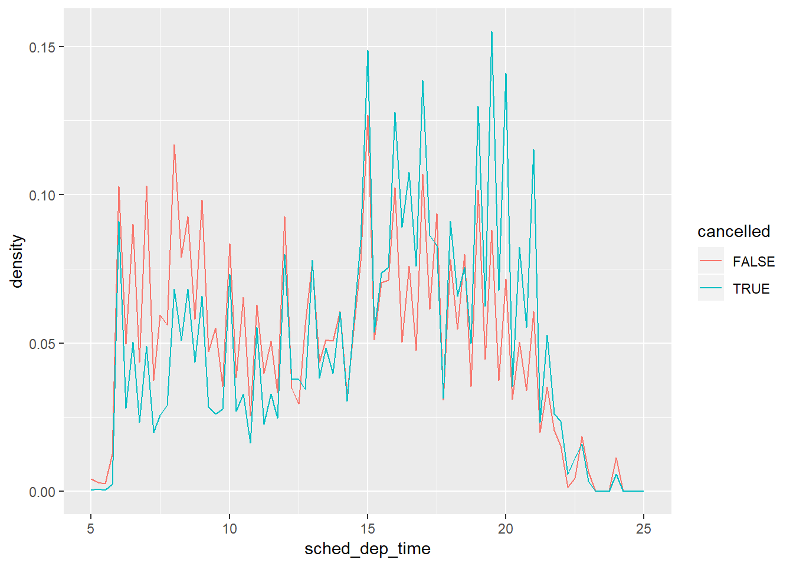

Let's look at the same plot but smooth the distributions to make the pattern easier to see.

```r
nycflights13::flights %>% 
  mutate(
    cancelled = is.na(dep_time),
    sched_hour = sched_dep_time %/% 100,
    sched_min = sched_dep_time %% 100,
    sched_dep_time = sched_hour + sched_min / 60
  ) %>% 
  ggplot(mapping = aes(x=sched_dep_time)) + 
  geom_density(mapping = aes(fill = cancelled), alpha = 0.30)+
  xlim(c(5,25))
```

```
## Warning: Removed 1 rows containing non-finite values (stat_density).
```


*2.What variable in the diamonds dataset is most important for predicting the price of a diamond? How is that variable correlated with cut? Why does the combination of those two relationships lead to lower quality diamonds being more expensive?*  
  
carat is the most important for predicting price.


```r
cor(diamonds$price, select(diamonds, carat, depth, table, x, y, z))
```

```
##          carat      depth     table         x         y         z
## [1,] 0.9215913 -0.0106474 0.1271339 0.8844352 0.8654209 0.8612494
```

fair `cut`s seem to associate with a higher `carat` thus while lower quality diamonds may be selling for more that is being driven by the `carat` of the diamond (the most important factor in `price`) and the quality simply cannot offset this.


```r
ggplot(data=diamonds, aes(x=cut, y=carat))+
  geom_boxplot()+
  coord_flip()
```


*3.Install the ggstance package, and create a horizontal boxplot. How does this compare to using coord_flip()?*  


```r
ggplot(diamonds)+
  ggstance::geom_boxploth(aes(x = carat, y = cut))
```


Looks like it does the same thing.

*4. One problem with boxplots is that they were developed in an era of much smaller datasets and tend to display a prohibitively large number of "outlying values". One approach to remedy this problem is the letter value plot. Install the lvplot package, and try using geom_lv() to display the distribution of price vs cut. What do you learn? How do you interpret the plots?*  

I found this helpful: https://stats.stackexchange.com/questions/301159/understanding-and-interpreting-letter-value-boxplots 

This produces a 'letter-value' boxplot which means that in the first box you have the middle ~1/2 of data, then in the adoining boxes the next ~1/4, so within the middle 3 boxes you have the middle ~3/4 of data, next two boxes is ~7/8ths, then ~15/16th etc.


```r
set.seed(1234)
a <- diamonds %>% 
  ggplot()+
  lvplot::geom_lv(aes(x = cut, y = price))

set.seed(1234)
b <- diamonds %>% 
  ggplot()+
  geom_boxplot(aes(x = cut, y = price))
```

Perhaps a helpful way to understand this is to see what it looks like at different specified 'k' values (which)

You can see the letters when you add `fill = ..LV..` to the aesthetic.


```r
diamonds %>% 
  ggplot()+
  lvplot::geom_lv(aes(x = cut, y = price, alpha = ..LV..), fill = "blue")+
  scale_alpha_discrete(range = c(0.7, 0))
```

```
## Warning: Using alpha for a discrete variable is not advised.
```


```r
diamonds %>% 
  ggplot()+
  lvplot::geom_lv(aes(x = cut, y = price, fill = ..LV..))
```


Letters represent 'median', 'fourths', 'eights'...


*5. Compare and contrast geom_violin() with a facetted geom_histogram(), or a coloured geom_freqpoly(). What are the pros and cons of each method?*  


```r
ggplot(diamonds,aes(x = cut, y = carat))+
  geom_violin()
```


```r
ggplot(diamonds,aes(colour = cut, x = carat, y = ..density..))+
  geom_freqpoly()
```

```
## `stat_bin()` using `bins = 30`. Pick better value with `binwidth`.
```


```r
ggplot(diamonds, aes(x = carat, y = ..density..))+
  geom_histogram()+
  facet_wrap(~cut)
```

```
## `stat_bin()` using `bins = 30`. Pick better value with `binwidth`.
```


I like how `geom_freqpoly` has points directly overlaying but it can also be tough to read some, and the lines can overlap and be tough to tell apart, you also have to specify `density` for this and `geom_histogram` whereas for `geom_violin` it is the default. The tails in `geom_violin` can be easy to read but they also pull these for each of the of the values whereas by faceting `geomo_histogram` and setting `scales = "free"` you can have independent scales. I think the biggest advantage of the histogram is that it is the most familiar so people will know what you're looking at.


*6. If you have a small dataset, it's sometimes useful to use geom_jitter() to see the relationship between a continuous and categorical variable. The ggbeeswarm package provides a number of methods similar to geom_jitter(). List them and briefly describe what each one does.*  

(Come back to)


```r
ggplot(mpg, aes(x = displ, y = cty, color = drv))+
  geom_point()    
```


```r
ggplot(mpg, aes(x = displ, y = cty, color = drv))+
  geom_jitter()
```

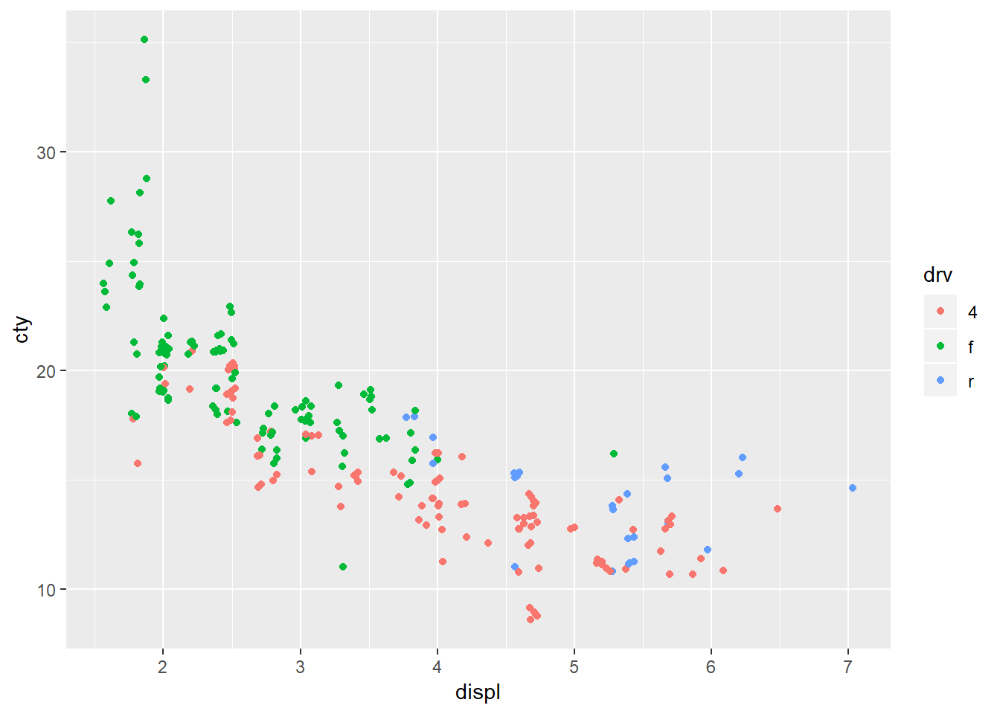

```r
ggplot(mpg, aes(x = displ, y = cty, color = drv))+
  geom_beeswarm()
```

```
## Warning in f(...): The default behavior of beeswarm has changed in version
## 0.6.0. In versions <0.6.0, this plot would have been dodged on the y-
## axis. In versions >=0.6.0, grouponX=FALSE must be explicitly set to group
## on y-axis. Please set grouponX=TRUE/FALSE to avoid this warning and ensure
## proper axis choice.
```


```r
ggplot(mpg, aes(x = displ, y = cty, color = drv))+
  geom_quasirandom()
```

```
## Warning in f(...): The default behavior of beeswarm has changed in version
## 0.6.0. In versions <0.6.0, this plot would have been dodged on the y-
## axis. In versions >=0.6.0, grouponX=FALSE must be explicitly set to group
## on y-axis. Please set grouponX=TRUE/FALSE to avoid this warning and ensure
## proper axis choice.
```


`geom_jitter` is similar to `geom_point` but it provides random noise to the points. You can control these with the `width` and `height` arguments. This is valuable as it allows you to better see points that may overlap one another. `geom_beeswarm` adds variation in a uniform pattern by default across only the x-axis. `geom-quasirandom` also defaults to distributing the points across the x-axis however it produces quasi-random variation, <span style="color:green">'quasi'</span> because it looks as though points follow some interrelationship^[Would need to read documentation for details.] and if you run the plot multiple times you will get the exact same plot whereas for `geom_jitter` you will get a slightly different plot each time. To see the differences between `geom_beeswarm` and geom_quasirandom` it's helpful to look at the plots above, but holding the y value constant at 1.


```r
plot_orig <- ggplot(mpg, aes(x = displ, y = cty, color = drv))+
  geom_point()

plot_bees <- ggplot(mpg, aes(x = 1, y = cty, color = drv))+
  geom_beeswarm()

plot_quasi <- ggplot(mpg, aes(x = 1, y = cty, color = drv))+
  geom_quasirandom()

gridExtra::grid.arrange(plot_orig, plot_bees, plot_quasi, ncol = 1)
```


### 7.5.2.1.

*1. How could you rescale the count dataset above to more clearly show the distribution of cut within colour, or colour within cut?*  
  
Proportion cut in color:  
(change `group_by` to `group_by(cut, color)` to set-up the converse)

```r
cut_in_color_graph <- diamonds %>% 
  group_by(color, cut) %>% 
  summarise(n = n()) %>% 
  mutate(proportion_cut_in_color = n/sum(n)) %>%
  ggplot(aes(x = color, y = cut))+
  geom_tile(aes(fill = proportion_cut_in_color))+
  labs(fill = "proportion\ncut in color")

cut_in_color_graph
```


This makes it clear that `ideal` cuts dominate the proportions of multiple colors, not ust G.  I though am only so-so about this visualization with `geom_tile`... curious if someone had a better way of visualizing...?


```r
library(seriation)
library(d3heatmap)
library(heatmaply)
```

Did anyone explore these?  
  
*2. Use `geom_tile()` together with dplyr to explore how average flight delays vary by destination and month of year. What makes the plot difficult to read? How could you improve it?*


I improved the original graph by adding in a filter so that only destinations that received over 10000 flights were included

```r
flights %>% 
  group_by(dest, month) %>% 
  summarise(delay_mean = mean(dep_delay, na.rm=TRUE), 
            n = n()) %>% 
  mutate(sum_n = sum(n)) %>% 
  select(dest, month, delay_mean, n, sum_n) %>% 
  as.data.frame() %>% 
  filter(dest == "ABQ") %>% 
  #the sum on n will be at the dest level here
  filter(sum_n > 30) %>% 
  ggplot(aes(x = as.factor(month), y = dest, fill = delay_mean))+
  geom_tile()
```

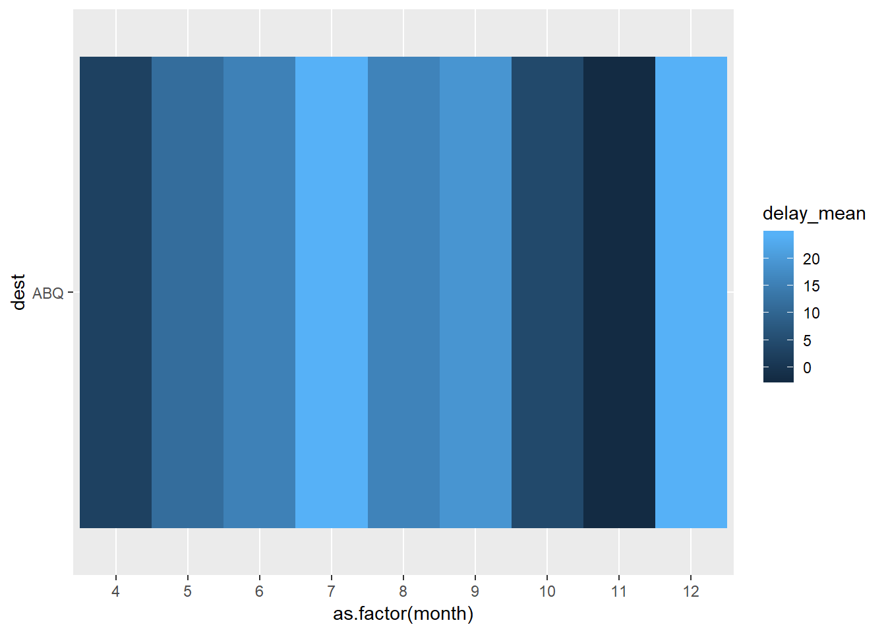

Another way to improve it may be to group the destinations into regions. This also will prevent you from filtering out data. We aren't given region information, but we do have lat and long points in the `airports` dataset. See appendix for ntoes.  
  

*3. Why is it slightly better to use aes(x = color, y = cut) rather than aes(x = cut, y = color) in the example above?*  

If you're comparing the proportion of cut in color and want to be looking at how the specific cut proportion is changing, it may easier to view this while looking left to right vs. down to up. Compare the two plots below.


```r
cut_in_color_graph
```


```r
cut_in_color_graph+
  coord_flip()
```


## 7.5.3 Two continuous variables

Two-d histograms

```r
smaller <- diamonds %>% 
  filter(carat < 3)

ggplot(data = smaller) +
  geom_hex(mapping = aes(x = carat, y = price))
```


```r
#can change bin number
ggplot(data = smaller) +
  geom_bin2d(mapping = aes(x = carat, y = price), bins = c(30, 30))
```


```r
#or binwidth
ggplot(data = smaller) +
  geom_bin2d(mapping = aes(x = carat, y = price), binwidth = c(.1, 1000))
```


Binned boxplots, violins, and lvs


```r
#split by width
ggplot(smaller, aes(x = carat, y = price))+
  geom_boxplot(aes(group = cut_width(carat, 0.1)))
```


```r
#split to get approximately same number in each box with cut_number()
ggplot(smaller, aes(x = carat, y = price))+
  geom_boxplot(aes(group = cut_number(carat, 20)))
```


These methods don't seem to work quite as well with violin plots or letter value plots

```r
##violin
ggplot(smaller, aes(x = carat, y = price))+
  geom_violin(aes(group = cut_width(carat, 0.1)))
```


```r
ggplot(smaller, aes(x = carat, y = price))+
  geom_violin(aes(group = cut_number(carat, 20)))
```


```r
##letter value
ggplot(smaller, aes(x = carat, y = price))+
  lvplot::geom_lv(aes(group = cut_width(carat, 0.1)))
```


```r
ggplot(smaller, aes(x = carat, y = price))+
  lvplot::geom_lv(aes(group = cut_number(carat, 10)))
```


But that may be because there is not enough information in each bin, they may be more effective with smaller bin sizes... Interested if anyone found more effective methods for using things other than boxplots with this binning style?

```r
ggplot(smaller, aes(x = carat, y = price))+
  geom_violin(aes(group = cut_width(carat, .25)))
```


### 7.5.3.1.

*1. Instead of summarising the conditional distribution with a boxplot, you could use a frequency polygon. What do you need to consider when using cut_width() vs cut_number()? How does that impact a visualisation of the 2d distribution of carat and price?*  
  
You should keep in mind how many lines you are going to create, they may overlap each other and look busy if you're not careful.  
  

For the visualization below i wrapped it in the funciton `ggplotly`. This funciton wraps your ggplot in html so that you can do things like hover over the points

```r
ggplot(smaller, aes(x=price))+
  geom_freqpoly(aes(colour = cut_number(carat, 10)))
```

```
## `stat_bin()` using `bins = 30`. Pick better value with `binwidth`.
```


However, I set the code chunks such that it will only execute for html, not markdown docs.

```r
p <- ggplot(smaller, aes(x=price))+
  geom_freqpoly(aes(colour = cut_width(carat, 0.25)))


plotly::ggplotly(p)
```

```
## `stat_bin()` using `bins = 30`. Pick better value with `binwidth`.
```

<!--html_preserve--><div id="htmlwidget-a092234a00f466fa8377" style="width:672px;height:480px;" class="plotly html-widget"></div>
<script type="application/json" data-for="htmlwidget-a092234a00f466fa8377">{"x":{"data":[{"x":[0,637.827586206897,1275.65517241379,1913.48275862069,2551.31034482759,3189.13793103448,3826.96551724138,4464.79310344828,5102.62068965517,5740.44827586207,6378.27586206897,7016.10344827586,7653.93103448276,8291.75862068965,8929.58620689655,9567.41379310345,10205.2413793103,10843.0689655172,11480.8965517241,12118.724137931,12756.5517241379,13394.3793103448,14032.2068965517,14670.0344827586,15307.8620689655,15945.6896551724,16583.5172413793,17221.3448275862,17859.1724137931,18497,19134.8275862069,19772.6551724138],"y":[0,10836,1175,8,5,0,0,0,0,0,0,0,0,0,0,0,0,0,0,0,0,0,0,0,0,0,0,0,0,0,0,0],"text":["cut_width(carat, 0.25): [0.125,0.375]<br />count:     0<br />price:     0.0000","cut_width(carat, 0.25): [0.125,0.375]<br />count: 10836<br />price:   637.8276","cut_width(carat, 0.25): [0.125,0.375]<br />count:  1175<br />price:  1275.6552","cut_width(carat, 0.25): [0.125,0.375]<br />count:     8<br />price:  1913.4828","cut_width(carat, 0.25): [0.125,0.375]<br />count:     5<br />price:  2551.3103","cut_width(carat, 0.25): [0.125,0.375]<br />count:     0<br />price:  3189.1379","cut_width(carat, 0.25): [0.125,0.375]<br />count:     0<br />price:  3826.9655","cut_width(carat, 0.25): [0.125,0.375]<br />count:     0<br />price:  4464.7931","cut_width(carat, 0.25): [0.125,0.375]<br />count:     0<br />price:  5102.6207","cut_width(carat, 0.25): [0.125,0.375]<br />count:     0<br />price:  5740.4483","cut_width(carat, 0.25): [0.125,0.375]<br />count:     0<br />price:  6378.2759","cut_width(carat, 0.25): [0.125,0.375]<br />count:     0<br />price:  7016.1034","cut_width(carat, 0.25): [0.125,0.375]<br />count:     0<br />price:  7653.9310","cut_width(carat, 0.25): [0.125,0.375]<br />count:     0<br />price:  8291.7586","cut_width(carat, 0.25): [0.125,0.375]<br />count:     0<br />price:  8929.5862","cut_width(carat, 0.25): [0.125,0.375]<br />count:     0<br />price:  9567.4138","cut_width(carat, 0.25): [0.125,0.375]<br />count:     0<br />price: 10205.2414","cut_width(carat, 0.25): [0.125,0.375]<br />count:     0<br />price: 10843.0690","cut_width(carat, 0.25): [0.125,0.375]<br />count:     0<br />price: 11480.8966","cut_width(carat, 0.25): [0.125,0.375]<br />count:     0<br />price: 12118.7241","cut_width(carat, 0.25): [0.125,0.375]<br />count:     0<br />price: 12756.5517","cut_width(carat, 0.25): [0.125,0.375]<br />count:     0<br />price: 13394.3793","cut_width(carat, 0.25): [0.125,0.375]<br />count:     0<br />price: 14032.2069","cut_width(carat, 0.25): [0.125,0.375]<br />count:     0<br />price: 14670.0345","cut_width(carat, 0.25): [0.125,0.375]<br />count:     0<br />price: 15307.8621","cut_width(carat, 0.25): [0.125,0.375]<br />count:     0<br />price: 15945.6897","cut_width(carat, 0.25): [0.125,0.375]<br />count:     0<br />price: 16583.5172","cut_width(carat, 0.25): [0.125,0.375]<br />count:     0<br />price: 17221.3448","cut_width(carat, 0.25): [0.125,0.375]<br />count:     0<br />price: 17859.1724","cut_width(carat, 0.25): [0.125,0.375]<br />count:     0<br />price: 18497.0000","cut_width(carat, 0.25): [0.125,0.375]<br />count:     0<br />price: 19134.8276","cut_width(carat, 0.25): [0.125,0.375]<br />count:     0<br />price: 19772.6552"],"type":"scatter","mode":"lines","line":{"width":1.88976377952756,"color":"rgba(248,118,109,1)","dash":"solid"},"hoveron":"points","name":"[0.125,0.375]","legendgroup":"[0.125,0.375]","showlegend":true,"xaxis":"x","yaxis":"y","hoverinfo":"text","frame":null},{"x":[0,637.827586206897,1275.65517241379,1913.48275862069,2551.31034482759,3189.13793103448,3826.96551724138,4464.79310344828,5102.62068965517,5740.44827586207,6378.27586206897,7016.10344827586,7653.93103448276,8291.75862068965,8929.58620689655,9567.41379310345,10205.2413793103,10843.0689655172,11480.8965517241,12118.724137931,12756.5517241379,13394.3793103448,14032.2068965517,14670.0344827586,15307.8620689655,15945.6896551724,16583.5172413793,17221.3448275862,17859.1724137931,18497,19134.8275862069,19772.6551724138],"y":[0,2789,5520,3758,572,95,17,11,1,0,0,0,0,0,0,0,0,0,0,0,0,0,0,0,0,0,0,0,0,0,0,0],"text":["cut_width(carat, 0.25): (0.375,0.625]<br />count:     0<br />price:     0.0000","cut_width(carat, 0.25): (0.375,0.625]<br />count:  2789<br />price:   637.8276","cut_width(carat, 0.25): (0.375,0.625]<br />count:  5520<br />price:  1275.6552","cut_width(carat, 0.25): (0.375,0.625]<br />count:  3758<br />price:  1913.4828","cut_width(carat, 0.25): (0.375,0.625]<br />count:   572<br />price:  2551.3103","cut_width(carat, 0.25): (0.375,0.625]<br />count:    95<br />price:  3189.1379","cut_width(carat, 0.25): (0.375,0.625]<br />count:    17<br />price:  3826.9655","cut_width(carat, 0.25): (0.375,0.625]<br />count:    11<br />price:  4464.7931","cut_width(carat, 0.25): (0.375,0.625]<br />count:     1<br />price:  5102.6207","cut_width(carat, 0.25): (0.375,0.625]<br />count:     0<br />price:  5740.4483","cut_width(carat, 0.25): (0.375,0.625]<br />count:     0<br />price:  6378.2759","cut_width(carat, 0.25): (0.375,0.625]<br />count:     0<br />price:  7016.1034","cut_width(carat, 0.25): (0.375,0.625]<br />count:     0<br />price:  7653.9310","cut_width(carat, 0.25): (0.375,0.625]<br />count:     0<br />price:  8291.7586","cut_width(carat, 0.25): (0.375,0.625]<br />count:     0<br />price:  8929.5862","cut_width(carat, 0.25): (0.375,0.625]<br />count:     0<br />price:  9567.4138","cut_width(carat, 0.25): (0.375,0.625]<br />count:     0<br />price: 10205.2414","cut_width(carat, 0.25): (0.375,0.625]<br />count:     0<br />price: 10843.0690","cut_width(carat, 0.25): (0.375,0.625]<br />count:     0<br />price: 11480.8966","cut_width(carat, 0.25): (0.375,0.625]<br />count:     0<br />price: 12118.7241","cut_width(carat, 0.25): (0.375,0.625]<br />count:     0<br />price: 12756.5517","cut_width(carat, 0.25): (0.375,0.625]<br />count:     0<br />price: 13394.3793","cut_width(carat, 0.25): (0.375,0.625]<br />count:     0<br />price: 14032.2069","cut_width(carat, 0.25): (0.375,0.625]<br />count:     0<br />price: 14670.0345","cut_width(carat, 0.25): (0.375,0.625]<br />count:     0<br />price: 15307.8621","cut_width(carat, 0.25): (0.375,0.625]<br />count:     0<br />price: 15945.6897","cut_width(carat, 0.25): (0.375,0.625]<br />count:     0<br />price: 16583.5172","cut_width(carat, 0.25): (0.375,0.625]<br />count:     0<br />price: 17221.3448","cut_width(carat, 0.25): (0.375,0.625]<br />count:     0<br />price: 17859.1724","cut_width(carat, 0.25): (0.375,0.625]<br />count:     0<br />price: 18497.0000","cut_width(carat, 0.25): (0.375,0.625]<br />count:     0<br />price: 19134.8276","cut_width(carat, 0.25): (0.375,0.625]<br />count:     0<br />price: 19772.6552"],"type":"scatter","mode":"lines","line":{"width":1.88976377952756,"color":"rgba(219,142,0,1)","dash":"solid"},"hoveron":"points","name":"(0.375,0.625]","legendgroup":"(0.375,0.625]","showlegend":true,"xaxis":"x","yaxis":"y","hoverinfo":"text","frame":null},{"x":[0,637.827586206897,1275.65517241379,1913.48275862069,2551.31034482759,3189.13793103448,3826.96551724138,4464.79310344828,5102.62068965517,5740.44827586207,6378.27586206897,7016.10344827586,7653.93103448276,8291.75862068965,8929.58620689655,9567.41379310345,10205.2413793103,10843.0689655172,11480.8965517241,12118.724137931,12756.5517241379,13394.3793103448,14032.2068965517,14670.0344827586,15307.8620689655,15945.6896551724,16583.5172413793,17221.3448275862,17859.1724137931,18497,19134.8275862069,19772.6551724138],"y":[0,7,110,1400,3236,1781,547,142,45,10,5,2,1,0,0,0,0,0,0,0,0,0,0,0,0,0,0,0,0,0,0,0],"text":["cut_width(carat, 0.25): (0.625,0.875]<br />count:     0<br />price:     0.0000","cut_width(carat, 0.25): (0.625,0.875]<br />count:     7<br />price:   637.8276","cut_width(carat, 0.25): (0.625,0.875]<br />count:   110<br />price:  1275.6552","cut_width(carat, 0.25): (0.625,0.875]<br />count:  1400<br />price:  1913.4828","cut_width(carat, 0.25): (0.625,0.875]<br />count:  3236<br />price:  2551.3103","cut_width(carat, 0.25): (0.625,0.875]<br />count:  1781<br />price:  3189.1379","cut_width(carat, 0.25): (0.625,0.875]<br />count:   547<br />price:  3826.9655","cut_width(carat, 0.25): (0.625,0.875]<br />count:   142<br />price:  4464.7931","cut_width(carat, 0.25): (0.625,0.875]<br />count:    45<br />price:  5102.6207","cut_width(carat, 0.25): (0.625,0.875]<br />count:    10<br />price:  5740.4483","cut_width(carat, 0.25): (0.625,0.875]<br />count:     5<br />price:  6378.2759","cut_width(carat, 0.25): (0.625,0.875]<br />count:     2<br />price:  7016.1034","cut_width(carat, 0.25): (0.625,0.875]<br />count:     1<br />price:  7653.9310","cut_width(carat, 0.25): (0.625,0.875]<br />count:     0<br />price:  8291.7586","cut_width(carat, 0.25): (0.625,0.875]<br />count:     0<br />price:  8929.5862","cut_width(carat, 0.25): (0.625,0.875]<br />count:     0<br />price:  9567.4138","cut_width(carat, 0.25): (0.625,0.875]<br />count:     0<br />price: 10205.2414","cut_width(carat, 0.25): (0.625,0.875]<br />count:     0<br />price: 10843.0690","cut_width(carat, 0.25): (0.625,0.875]<br />count:     0<br />price: 11480.8966","cut_width(carat, 0.25): (0.625,0.875]<br />count:     0<br />price: 12118.7241","cut_width(carat, 0.25): (0.625,0.875]<br />count:     0<br />price: 12756.5517","cut_width(carat, 0.25): (0.625,0.875]<br />count:     0<br />price: 13394.3793","cut_width(carat, 0.25): (0.625,0.875]<br />count:     0<br />price: 14032.2069","cut_width(carat, 0.25): (0.625,0.875]<br />count:     0<br />price: 14670.0345","cut_width(carat, 0.25): (0.625,0.875]<br />count:     0<br />price: 15307.8621","cut_width(carat, 0.25): (0.625,0.875]<br />count:     0<br />price: 15945.6897","cut_width(carat, 0.25): (0.625,0.875]<br />count:     0<br />price: 16583.5172","cut_width(carat, 0.25): (0.625,0.875]<br />count:     0<br />price: 17221.3448","cut_width(carat, 0.25): (0.625,0.875]<br />count:     0<br />price: 17859.1724","cut_width(carat, 0.25): (0.625,0.875]<br />count:     0<br />price: 18497.0000","cut_width(carat, 0.25): (0.625,0.875]<br />count:     0<br />price: 19134.8276","cut_width(carat, 0.25): (0.625,0.875]<br />count:     0<br />price: 19772.6552"],"type":"scatter","mode":"lines","line":{"width":1.88976377952756,"color":"rgba(174,162,0,1)","dash":"solid"},"hoveron":"points","name":"(0.625,0.875]","legendgroup":"(0.625,0.875]","showlegend":true,"xaxis":"x","yaxis":"y","hoverinfo":"text","frame":null},{"x":[0,637.827586206897,1275.65517241379,1913.48275862069,2551.31034482759,3189.13793103448,3826.96551724138,4464.79310344828,5102.62068965517,5740.44827586207,6378.27586206897,7016.10344827586,7653.93103448276,8291.75862068965,8929.58620689655,9567.41379310345,10205.2413793103,10843.0689655172,11480.8965517241,12118.724137931,12756.5517241379,13394.3793103448,14032.2068965517,14670.0344827586,15307.8620689655,15945.6896551724,16583.5172413793,17221.3448275862,17859.1724137931,18497,19134.8275862069,19772.6551724138],"y":[0,0,4,60,218,895,1957,2553,1647,989,832,559,421,222,202,109,85,70,42,19,12,5,2,6,9,6,2,2,3,3,0,0],"text":["cut_width(carat, 0.25): (0.875,1.12]<br />count:     0<br />price:     0.0000","cut_width(carat, 0.25): (0.875,1.12]<br />count:     0<br />price:   637.8276","cut_width(carat, 0.25): (0.875,1.12]<br />count:     4<br />price:  1275.6552","cut_width(carat, 0.25): (0.875,1.12]<br />count:    60<br />price:  1913.4828","cut_width(carat, 0.25): (0.875,1.12]<br />count:   218<br />price:  2551.3103","cut_width(carat, 0.25): (0.875,1.12]<br />count:   895<br />price:  3189.1379","cut_width(carat, 0.25): (0.875,1.12]<br />count:  1957<br />price:  3826.9655","cut_width(carat, 0.25): (0.875,1.12]<br />count:  2553<br />price:  4464.7931","cut_width(carat, 0.25): (0.875,1.12]<br />count:  1647<br />price:  5102.6207","cut_width(carat, 0.25): (0.875,1.12]<br />count:   989<br />price:  5740.4483","cut_width(carat, 0.25): (0.875,1.12]<br />count:   832<br />price:  6378.2759","cut_width(carat, 0.25): (0.875,1.12]<br />count:   559<br />price:  7016.1034","cut_width(carat, 0.25): (0.875,1.12]<br />count:   421<br />price:  7653.9310","cut_width(carat, 0.25): (0.875,1.12]<br />count:   222<br />price:  8291.7586","cut_width(carat, 0.25): (0.875,1.12]<br />count:   202<br />price:  8929.5862","cut_width(carat, 0.25): (0.875,1.12]<br />count:   109<br />price:  9567.4138","cut_width(carat, 0.25): (0.875,1.12]<br />count:    85<br />price: 10205.2414","cut_width(carat, 0.25): (0.875,1.12]<br />count:    70<br />price: 10843.0690","cut_width(carat, 0.25): (0.875,1.12]<br />count:    42<br />price: 11480.8966","cut_width(carat, 0.25): (0.875,1.12]<br />count:    19<br />price: 12118.7241","cut_width(carat, 0.25): (0.875,1.12]<br />count:    12<br />price: 12756.5517","cut_width(carat, 0.25): (0.875,1.12]<br />count:     5<br />price: 13394.3793","cut_width(carat, 0.25): (0.875,1.12]<br />count:     2<br />price: 14032.2069","cut_width(carat, 0.25): (0.875,1.12]<br />count:     6<br />price: 14670.0345","cut_width(carat, 0.25): (0.875,1.12]<br />count:     9<br />price: 15307.8621","cut_width(carat, 0.25): (0.875,1.12]<br />count:     6<br />price: 15945.6897","cut_width(carat, 0.25): (0.875,1.12]<br />count:     2<br />price: 16583.5172","cut_width(carat, 0.25): (0.875,1.12]<br />count:     2<br />price: 17221.3448","cut_width(carat, 0.25): (0.875,1.12]<br />count:     3<br />price: 17859.1724","cut_width(carat, 0.25): (0.875,1.12]<br />count:     3<br />price: 18497.0000","cut_width(carat, 0.25): (0.875,1.12]<br />count:     0<br />price: 19134.8276","cut_width(carat, 0.25): (0.875,1.12]<br />count:     0<br />price: 19772.6552"],"type":"scatter","mode":"lines","line":{"width":1.88976377952756,"color":"rgba(100,178,0,1)","dash":"solid"},"hoveron":"points","name":"(0.875,1.12]","legendgroup":"(0.875,1.12]","showlegend":true,"xaxis":"x","yaxis":"y","hoverinfo":"text","frame":null},{"x":[0,637.827586206897,1275.65517241379,1913.48275862069,2551.31034482759,3189.13793103448,3826.96551724138,4464.79310344828,5102.62068965517,5740.44827586207,6378.27586206897,7016.10344827586,7653.93103448276,8291.75862068965,8929.58620689655,9567.41379310345,10205.2413793103,10843.0689655172,11480.8965517241,12118.724137931,12756.5517241379,13394.3793103448,14032.2068965517,14670.0344827586,15307.8620689655,15945.6896551724,16583.5172413793,17221.3448275862,17859.1724137931,18497,19134.8275862069,19772.6551724138],"y":[0,0,0,0,20,34,146,379,697,694,553,423,271,245,228,186,158,123,75,50,43,30,16,12,10,9,1,4,3,2,0,0],"text":["cut_width(carat, 0.25): (1.12,1.38]<br />count:     0<br />price:     0.0000","cut_width(carat, 0.25): (1.12,1.38]<br />count:     0<br />price:   637.8276","cut_width(carat, 0.25): (1.12,1.38]<br />count:     0<br />price:  1275.6552","cut_width(carat, 0.25): (1.12,1.38]<br />count:     0<br />price:  1913.4828","cut_width(carat, 0.25): (1.12,1.38]<br />count:    20<br />price:  2551.3103","cut_width(carat, 0.25): (1.12,1.38]<br />count:    34<br />price:  3189.1379","cut_width(carat, 0.25): (1.12,1.38]<br />count:   146<br />price:  3826.9655","cut_width(carat, 0.25): (1.12,1.38]<br />count:   379<br />price:  4464.7931","cut_width(carat, 0.25): (1.12,1.38]<br />count:   697<br />price:  5102.6207","cut_width(carat, 0.25): (1.12,1.38]<br />count:   694<br />price:  5740.4483","cut_width(carat, 0.25): (1.12,1.38]<br />count:   553<br />price:  6378.2759","cut_width(carat, 0.25): (1.12,1.38]<br />count:   423<br />price:  7016.1034","cut_width(carat, 0.25): (1.12,1.38]<br />count:   271<br />price:  7653.9310","cut_width(carat, 0.25): (1.12,1.38]<br />count:   245<br />price:  8291.7586","cut_width(carat, 0.25): (1.12,1.38]<br />count:   228<br />price:  8929.5862","cut_width(carat, 0.25): (1.12,1.38]<br />count:   186<br />price:  9567.4138","cut_width(carat, 0.25): (1.12,1.38]<br />count:   158<br />price: 10205.2414","cut_width(carat, 0.25): (1.12,1.38]<br />count:   123<br />price: 10843.0690","cut_width(carat, 0.25): (1.12,1.38]<br />count:    75<br />price: 11480.8966","cut_width(carat, 0.25): (1.12,1.38]<br />count:    50<br />price: 12118.7241","cut_width(carat, 0.25): (1.12,1.38]<br />count:    43<br />price: 12756.5517","cut_width(carat, 0.25): (1.12,1.38]<br />count:    30<br />price: 13394.3793","cut_width(carat, 0.25): (1.12,1.38]<br />count:    16<br />price: 14032.2069","cut_width(carat, 0.25): (1.12,1.38]<br />count:    12<br />price: 14670.0345","cut_width(carat, 0.25): (1.12,1.38]<br />count:    10<br />price: 15307.8621","cut_width(carat, 0.25): (1.12,1.38]<br />count:     9<br />price: 15945.6897","cut_width(carat, 0.25): (1.12,1.38]<br />count:     1<br />price: 16583.5172","cut_width(carat, 0.25): (1.12,1.38]<br />count:     4<br />price: 17221.3448","cut_width(carat, 0.25): (1.12,1.38]<br />count:     3<br />price: 17859.1724","cut_width(carat, 0.25): (1.12,1.38]<br />count:     2<br />price: 18497.0000","cut_width(carat, 0.25): (1.12,1.38]<br />count:     0<br />price: 19134.8276","cut_width(carat, 0.25): (1.12,1.38]<br />count:     0<br />price: 19772.6552"],"type":"scatter","mode":"lines","line":{"width":1.88976377952756,"color":"rgba(0,189,92,1)","dash":"solid"},"hoveron":"points","name":"(1.12,1.38]","legendgroup":"(1.12,1.38]","showlegend":true,"xaxis":"x","yaxis":"y","hoverinfo":"text","frame":null},{"x":[0,637.827586206897,1275.65517241379,1913.48275862069,2551.31034482759,3189.13793103448,3826.96551724138,4464.79310344828,5102.62068965517,5740.44827586207,6378.27586206897,7016.10344827586,7653.93103448276,8291.75862068965,8929.58620689655,9567.41379310345,10205.2413793103,10843.0689655172,11480.8965517241,12118.724137931,12756.5517241379,13394.3793103448,14032.2068965517,14670.0344827586,15307.8620689655,15945.6896551724,16583.5172413793,17221.3448275862,17859.1724137931,18497,19134.8275862069,19772.6551724138],"y":[0,0,0,0,0,8,20,21,34,53,119,178,292,285,327,289,274,261,263,180,166,126,138,111,85,59,46,32,16,15,0,0],"text":["cut_width(carat, 0.25): (1.38,1.62]<br />count:     0<br />price:     0.0000","cut_width(carat, 0.25): (1.38,1.62]<br />count:     0<br />price:   637.8276","cut_width(carat, 0.25): (1.38,1.62]<br />count:     0<br />price:  1275.6552","cut_width(carat, 0.25): (1.38,1.62]<br />count:     0<br />price:  1913.4828","cut_width(carat, 0.25): (1.38,1.62]<br />count:     0<br />price:  2551.3103","cut_width(carat, 0.25): (1.38,1.62]<br />count:     8<br />price:  3189.1379","cut_width(carat, 0.25): (1.38,1.62]<br />count:    20<br />price:  3826.9655","cut_width(carat, 0.25): (1.38,1.62]<br />count:    21<br />price:  4464.7931","cut_width(carat, 0.25): (1.38,1.62]<br />count:    34<br />price:  5102.6207","cut_width(carat, 0.25): (1.38,1.62]<br />count:    53<br />price:  5740.4483","cut_width(carat, 0.25): (1.38,1.62]<br />count:   119<br />price:  6378.2759","cut_width(carat, 0.25): (1.38,1.62]<br />count:   178<br />price:  7016.1034","cut_width(carat, 0.25): (1.38,1.62]<br />count:   292<br />price:  7653.9310","cut_width(carat, 0.25): (1.38,1.62]<br />count:   285<br />price:  8291.7586","cut_width(carat, 0.25): (1.38,1.62]<br />count:   327<br />price:  8929.5862","cut_width(carat, 0.25): (1.38,1.62]<br />count:   289<br />price:  9567.4138","cut_width(carat, 0.25): (1.38,1.62]<br />count:   274<br />price: 10205.2414","cut_width(carat, 0.25): (1.38,1.62]<br />count:   261<br />price: 10843.0690","cut_width(carat, 0.25): (1.38,1.62]<br />count:   263<br />price: 11480.8966","cut_width(carat, 0.25): (1.38,1.62]<br />count:   180<br />price: 12118.7241","cut_width(carat, 0.25): (1.38,1.62]<br />count:   166<br />price: 12756.5517","cut_width(carat, 0.25): (1.38,1.62]<br />count:   126<br />price: 13394.3793","cut_width(carat, 0.25): (1.38,1.62]<br />count:   138<br />price: 14032.2069","cut_width(carat, 0.25): (1.38,1.62]<br />count:   111<br />price: 14670.0345","cut_width(carat, 0.25): (1.38,1.62]<br />count:    85<br />price: 15307.8621","cut_width(carat, 0.25): (1.38,1.62]<br />count:    59<br />price: 15945.6897","cut_width(carat, 0.25): (1.38,1.62]<br />count:    46<br />price: 16583.5172","cut_width(carat, 0.25): (1.38,1.62]<br />count:    32<br />price: 17221.3448","cut_width(carat, 0.25): (1.38,1.62]<br />count:    16<br />price: 17859.1724","cut_width(carat, 0.25): (1.38,1.62]<br />count:    15<br />price: 18497.0000","cut_width(carat, 0.25): (1.38,1.62]<br />count:     0<br />price: 19134.8276","cut_width(carat, 0.25): (1.38,1.62]<br />count:     0<br />price: 19772.6552"],"type":"scatter","mode":"lines","line":{"width":1.88976377952756,"color":"rgba(0,193,167,1)","dash":"solid"},"hoveron":"points","name":"(1.38,1.62]","legendgroup":"(1.38,1.62]","showlegend":true,"xaxis":"x","yaxis":"y","hoverinfo":"text","frame":null},{"x":[0,637.827586206897,1275.65517241379,1913.48275862069,2551.31034482759,3189.13793103448,3826.96551724138,4464.79310344828,5102.62068965517,5740.44827586207,6378.27586206897,7016.10344827586,7653.93103448276,8291.75862068965,8929.58620689655,9567.41379310345,10205.2413793103,10843.0689655172,11480.8965517241,12118.724137931,12756.5517241379,13394.3793103448,14032.2068965517,14670.0344827586,15307.8620689655,15945.6896551724,16583.5172413793,17221.3448275862,17859.1724137931,18497,19134.8275862069,19772.6551724138],"y":[0,0,0,0,0,0,0,1,6,11,9,24,34,31,57,66,68,82,68,75,62,65,46,33,29,35,25,37,26,22,0,0],"text":["cut_width(carat, 0.25): (1.62,1.88]<br />count:     0<br />price:     0.0000","cut_width(carat, 0.25): (1.62,1.88]<br />count:     0<br />price:   637.8276","cut_width(carat, 0.25): (1.62,1.88]<br />count:     0<br />price:  1275.6552","cut_width(carat, 0.25): (1.62,1.88]<br />count:     0<br />price:  1913.4828","cut_width(carat, 0.25): (1.62,1.88]<br />count:     0<br />price:  2551.3103","cut_width(carat, 0.25): (1.62,1.88]<br />count:     0<br />price:  3189.1379","cut_width(carat, 0.25): (1.62,1.88]<br />count:     0<br />price:  3826.9655","cut_width(carat, 0.25): (1.62,1.88]<br />count:     1<br />price:  4464.7931","cut_width(carat, 0.25): (1.62,1.88]<br />count:     6<br />price:  5102.6207","cut_width(carat, 0.25): (1.62,1.88]<br />count:    11<br />price:  5740.4483","cut_width(carat, 0.25): (1.62,1.88]<br />count:     9<br />price:  6378.2759","cut_width(carat, 0.25): (1.62,1.88]<br />count:    24<br />price:  7016.1034","cut_width(carat, 0.25): (1.62,1.88]<br />count:    34<br />price:  7653.9310","cut_width(carat, 0.25): (1.62,1.88]<br />count:    31<br />price:  8291.7586","cut_width(carat, 0.25): (1.62,1.88]<br />count:    57<br />price:  8929.5862","cut_width(carat, 0.25): (1.62,1.88]<br />count:    66<br />price:  9567.4138","cut_width(carat, 0.25): (1.62,1.88]<br />count:    68<br />price: 10205.2414","cut_width(carat, 0.25): (1.62,1.88]<br />count:    82<br />price: 10843.0690","cut_width(carat, 0.25): (1.62,1.88]<br />count:    68<br />price: 11480.8966","cut_width(carat, 0.25): (1.62,1.88]<br />count:    75<br />price: 12118.7241","cut_width(carat, 0.25): (1.62,1.88]<br />count:    62<br />price: 12756.5517","cut_width(carat, 0.25): (1.62,1.88]<br />count:    65<br />price: 13394.3793","cut_width(carat, 0.25): (1.62,1.88]<br />count:    46<br />price: 14032.2069","cut_width(carat, 0.25): (1.62,1.88]<br />count:    33<br />price: 14670.0345","cut_width(carat, 0.25): (1.62,1.88]<br />count:    29<br />price: 15307.8621","cut_width(carat, 0.25): (1.62,1.88]<br />count:    35<br />price: 15945.6897","cut_width(carat, 0.25): (1.62,1.88]<br />count:    25<br />price: 16583.5172","cut_width(carat, 0.25): (1.62,1.88]<br />count:    37<br />price: 17221.3448","cut_width(carat, 0.25): (1.62,1.88]<br />count:    26<br />price: 17859.1724","cut_width(carat, 0.25): (1.62,1.88]<br />count:    22<br />price: 18497.0000","cut_width(carat, 0.25): (1.62,1.88]<br />count:     0<br />price: 19134.8276","cut_width(carat, 0.25): (1.62,1.88]<br />count:     0<br />price: 19772.6552"],"type":"scatter","mode":"lines","line":{"width":1.88976377952756,"color":"rgba(0,186,222,1)","dash":"solid"},"hoveron":"points","name":"(1.62,1.88]","legendgroup":"(1.62,1.88]","showlegend":true,"xaxis":"x","yaxis":"y","hoverinfo":"text","frame":null},{"x":[0,637.827586206897,1275.65517241379,1913.48275862069,2551.31034482759,3189.13793103448,3826.96551724138,4464.79310344828,5102.62068965517,5740.44827586207,6378.27586206897,7016.10344827586,7653.93103448276,8291.75862068965,8929.58620689655,9567.41379310345,10205.2413793103,10843.0689655172,11480.8965517241,12118.724137931,12756.5517241379,13394.3793103448,14032.2068965517,14670.0344827586,15307.8620689655,15945.6896551724,16583.5172413793,17221.3448275862,17859.1724137931,18497,19134.8275862069,19772.6551724138],"y":[0,0,0,0,0,0,0,0,3,7,17,9,5,8,8,27,25,41,61,106,120,117,100,104,125,140,142,120,129,115,1,0],"text":["cut_width(carat, 0.25): (1.88,2.12]<br />count:     0<br />price:     0.0000","cut_width(carat, 0.25): (1.88,2.12]<br />count:     0<br />price:   637.8276","cut_width(carat, 0.25): (1.88,2.12]<br />count:     0<br />price:  1275.6552","cut_width(carat, 0.25): (1.88,2.12]<br />count:     0<br />price:  1913.4828","cut_width(carat, 0.25): (1.88,2.12]<br />count:     0<br />price:  2551.3103","cut_width(carat, 0.25): (1.88,2.12]<br />count:     0<br />price:  3189.1379","cut_width(carat, 0.25): (1.88,2.12]<br />count:     0<br />price:  3826.9655","cut_width(carat, 0.25): (1.88,2.12]<br />count:     0<br />price:  4464.7931","cut_width(carat, 0.25): (1.88,2.12]<br />count:     3<br />price:  5102.6207","cut_width(carat, 0.25): (1.88,2.12]<br />count:     7<br />price:  5740.4483","cut_width(carat, 0.25): (1.88,2.12]<br />count:    17<br />price:  6378.2759","cut_width(carat, 0.25): (1.88,2.12]<br />count:     9<br />price:  7016.1034","cut_width(carat, 0.25): (1.88,2.12]<br />count:     5<br />price:  7653.9310","cut_width(carat, 0.25): (1.88,2.12]<br />count:     8<br />price:  8291.7586","cut_width(carat, 0.25): (1.88,2.12]<br />count:     8<br />price:  8929.5862","cut_width(carat, 0.25): (1.88,2.12]<br />count:    27<br />price:  9567.4138","cut_width(carat, 0.25): (1.88,2.12]<br />count:    25<br />price: 10205.2414","cut_width(carat, 0.25): (1.88,2.12]<br />count:    41<br />price: 10843.0690","cut_width(carat, 0.25): (1.88,2.12]<br />count:    61<br />price: 11480.8966","cut_width(carat, 0.25): (1.88,2.12]<br />count:   106<br />price: 12118.7241","cut_width(carat, 0.25): (1.88,2.12]<br />count:   120<br />price: 12756.5517","cut_width(carat, 0.25): (1.88,2.12]<br />count:   117<br />price: 13394.3793","cut_width(carat, 0.25): (1.88,2.12]<br />count:   100<br />price: 14032.2069","cut_width(carat, 0.25): (1.88,2.12]<br />count:   104<br />price: 14670.0345","cut_width(carat, 0.25): (1.88,2.12]<br />count:   125<br />price: 15307.8621","cut_width(carat, 0.25): (1.88,2.12]<br />count:   140<br />price: 15945.6897","cut_width(carat, 0.25): (1.88,2.12]<br />count:   142<br />price: 16583.5172","cut_width(carat, 0.25): (1.88,2.12]<br />count:   120<br />price: 17221.3448","cut_width(carat, 0.25): (1.88,2.12]<br />count:   129<br />price: 17859.1724","cut_width(carat, 0.25): (1.88,2.12]<br />count:   115<br />price: 18497.0000","cut_width(carat, 0.25): (1.88,2.12]<br />count:     1<br />price: 19134.8276","cut_width(carat, 0.25): (1.88,2.12]<br />count:     0<br />price: 19772.6552"],"type":"scatter","mode":"lines","line":{"width":1.88976377952756,"color":"rgba(0,166,255,1)","dash":"solid"},"hoveron":"points","name":"(1.88,2.12]","legendgroup":"(1.88,2.12]","showlegend":true,"xaxis":"x","yaxis":"y","hoverinfo":"text","frame":null},{"x":[0,637.827586206897,1275.65517241379,1913.48275862069,2551.31034482759,3189.13793103448,3826.96551724138,4464.79310344828,5102.62068965517,5740.44827586207,6378.27586206897,7016.10344827586,7653.93103448276,8291.75862068965,8929.58620689655,9567.41379310345,10205.2413793103,10843.0689655172,11480.8965517241,12118.724137931,12756.5517241379,13394.3793103448,14032.2068965517,14670.0344827586,15307.8620689655,15945.6896551724,16583.5172413793,17221.3448275862,17859.1724137931,18497,19134.8275862069,19772.6551724138],"y":[0,0,0,0,0,0,0,0,1,3,5,7,1,3,5,0,3,9,9,15,27,33,48,39,38,46,35,52,47,38,1,0],"text":["cut_width(carat, 0.25): (2.12,2.38]<br />count:     0<br />price:     0.0000","cut_width(carat, 0.25): (2.12,2.38]<br />count:     0<br />price:   637.8276","cut_width(carat, 0.25): (2.12,2.38]<br />count:     0<br />price:  1275.6552","cut_width(carat, 0.25): (2.12,2.38]<br />count:     0<br />price:  1913.4828","cut_width(carat, 0.25): (2.12,2.38]<br />count:     0<br />price:  2551.3103","cut_width(carat, 0.25): (2.12,2.38]<br />count:     0<br />price:  3189.1379","cut_width(carat, 0.25): (2.12,2.38]<br />count:     0<br />price:  3826.9655","cut_width(carat, 0.25): (2.12,2.38]<br />count:     0<br />price:  4464.7931","cut_width(carat, 0.25): (2.12,2.38]<br />count:     1<br />price:  5102.6207","cut_width(carat, 0.25): (2.12,2.38]<br />count:     3<br />price:  5740.4483","cut_width(carat, 0.25): (2.12,2.38]<br />count:     5<br />price:  6378.2759","cut_width(carat, 0.25): (2.12,2.38]<br />count:     7<br />price:  7016.1034","cut_width(carat, 0.25): (2.12,2.38]<br />count:     1<br />price:  7653.9310","cut_width(carat, 0.25): (2.12,2.38]<br />count:     3<br />price:  8291.7586","cut_width(carat, 0.25): (2.12,2.38]<br />count:     5<br />price:  8929.5862","cut_width(carat, 0.25): (2.12,2.38]<br />count:     0<br />price:  9567.4138","cut_width(carat, 0.25): (2.12,2.38]<br />count:     3<br />price: 10205.2414","cut_width(carat, 0.25): (2.12,2.38]<br />count:     9<br />price: 10843.0690","cut_width(carat, 0.25): (2.12,2.38]<br />count:     9<br />price: 11480.8966","cut_width(carat, 0.25): (2.12,2.38]<br />count:    15<br />price: 12118.7241","cut_width(carat, 0.25): (2.12,2.38]<br />count:    27<br />price: 12756.5517","cut_width(carat, 0.25): (2.12,2.38]<br />count:    33<br />price: 13394.3793","cut_width(carat, 0.25): (2.12,2.38]<br />count:    48<br />price: 14032.2069","cut_width(carat, 0.25): (2.12,2.38]<br />count:    39<br />price: 14670.0345","cut_width(carat, 0.25): (2.12,2.38]<br />count:    38<br />price: 15307.8621","cut_width(carat, 0.25): (2.12,2.38]<br />count:    46<br />price: 15945.6897","cut_width(carat, 0.25): (2.12,2.38]<br />count:    35<br />price: 16583.5172","cut_width(carat, 0.25): (2.12,2.38]<br />count:    52<br />price: 17221.3448","cut_width(carat, 0.25): (2.12,2.38]<br />count:    47<br />price: 17859.1724","cut_width(carat, 0.25): (2.12,2.38]<br />count:    38<br />price: 18497.0000","cut_width(carat, 0.25): (2.12,2.38]<br />count:     1<br />price: 19134.8276","cut_width(carat, 0.25): (2.12,2.38]<br />count:     0<br />price: 19772.6552"],"type":"scatter","mode":"lines","line":{"width":1.88976377952756,"color":"rgba(179,133,255,1)","dash":"solid"},"hoveron":"points","name":"(2.12,2.38]","legendgroup":"(2.12,2.38]","showlegend":true,"xaxis":"x","yaxis":"y","hoverinfo":"text","frame":null},{"x":[0,637.827586206897,1275.65517241379,1913.48275862069,2551.31034482759,3189.13793103448,3826.96551724138,4464.79310344828,5102.62068965517,5740.44827586207,6378.27586206897,7016.10344827586,7653.93103448276,8291.75862068965,8929.58620689655,9567.41379310345,10205.2413793103,10843.0689655172,11480.8965517241,12118.724137931,12756.5517241379,13394.3793103448,14032.2068965517,14670.0344827586,15307.8620689655,15945.6896551724,16583.5172413793,17221.3448275862,17859.1724137931,18497,19134.8275862069,19772.6551724138],"y":[0,0,0,0,0,0,0,0,0,0,1,0,1,1,1,1,2,1,0,6,5,3,6,13,9,15,23,24,19,21,0,0],"text":["cut_width(carat, 0.25): (2.38,2.62]<br />count:     0<br />price:     0.0000","cut_width(carat, 0.25): (2.38,2.62]<br />count:     0<br />price:   637.8276","cut_width(carat, 0.25): (2.38,2.62]<br />count:     0<br />price:  1275.6552","cut_width(carat, 0.25): (2.38,2.62]<br />count:     0<br />price:  1913.4828","cut_width(carat, 0.25): (2.38,2.62]<br />count:     0<br />price:  2551.3103","cut_width(carat, 0.25): (2.38,2.62]<br />count:     0<br />price:  3189.1379","cut_width(carat, 0.25): (2.38,2.62]<br />count:     0<br />price:  3826.9655","cut_width(carat, 0.25): (2.38,2.62]<br />count:     0<br />price:  4464.7931","cut_width(carat, 0.25): (2.38,2.62]<br />count:     0<br />price:  5102.6207","cut_width(carat, 0.25): (2.38,2.62]<br />count:     0<br />price:  5740.4483","cut_width(carat, 0.25): (2.38,2.62]<br />count:     1<br />price:  6378.2759","cut_width(carat, 0.25): (2.38,2.62]<br />count:     0<br />price:  7016.1034","cut_width(carat, 0.25): (2.38,2.62]<br />count:     1<br />price:  7653.9310","cut_width(carat, 0.25): (2.38,2.62]<br />count:     1<br />price:  8291.7586","cut_width(carat, 0.25): (2.38,2.62]<br />count:     1<br />price:  8929.5862","cut_width(carat, 0.25): (2.38,2.62]<br />count:     1<br />price:  9567.4138","cut_width(carat, 0.25): (2.38,2.62]<br />count:     2<br />price: 10205.2414","cut_width(carat, 0.25): (2.38,2.62]<br />count:     1<br />price: 10843.0690","cut_width(carat, 0.25): (2.38,2.62]<br />count:     0<br />price: 11480.8966","cut_width(carat, 0.25): (2.38,2.62]<br />count:     6<br />price: 12118.7241","cut_width(carat, 0.25): (2.38,2.62]<br />count:     5<br />price: 12756.5517","cut_width(carat, 0.25): (2.38,2.62]<br />count:     3<br />price: 13394.3793","cut_width(carat, 0.25): (2.38,2.62]<br />count:     6<br />price: 14032.2069","cut_width(carat, 0.25): (2.38,2.62]<br />count:    13<br />price: 14670.0345","cut_width(carat, 0.25): (2.38,2.62]<br />count:     9<br />price: 15307.8621","cut_width(carat, 0.25): (2.38,2.62]<br />count:    15<br />price: 15945.6897","cut_width(carat, 0.25): (2.38,2.62]<br />count:    23<br />price: 16583.5172","cut_width(carat, 0.25): (2.38,2.62]<br />count:    24<br />price: 17221.3448","cut_width(carat, 0.25): (2.38,2.62]<br />count:    19<br />price: 17859.1724","cut_width(carat, 0.25): (2.38,2.62]<br />count:    21<br />price: 18497.0000","cut_width(carat, 0.25): (2.38,2.62]<br />count:     0<br />price: 19134.8276","cut_width(carat, 0.25): (2.38,2.62]<br />count:     0<br />price: 19772.6552"],"type":"scatter","mode":"lines","line":{"width":1.88976377952756,"color":"rgba(239,103,235,1)","dash":"solid"},"hoveron":"points","name":"(2.38,2.62]","legendgroup":"(2.38,2.62]","showlegend":true,"xaxis":"x","yaxis":"y","hoverinfo":"text","frame":null},{"x":[0,637.827586206897,1275.65517241379,1913.48275862069,2551.31034482759,3189.13793103448,3826.96551724138,4464.79310344828,5102.62068965517,5740.44827586207,6378.27586206897,7016.10344827586,7653.93103448276,8291.75862068965,8929.58620689655,9567.41379310345,10205.2413793103,10843.0689655172,11480.8965517241,12118.724137931,12756.5517241379,13394.3793103448,14032.2068965517,14670.0344827586,15307.8620689655,15945.6896551724,16583.5172413793,17221.3448275862,17859.1724137931,18497,19134.8275862069,19772.6551724138],"y":[0,0,0,0,0,0,0,0,0,0,0,1,0,1,1,1,2,1,1,0,0,1,1,0,2,2,1,5,1,3,0,0],"text":["cut_width(carat, 0.25): (2.62,2.88]<br />count:     0<br />price:     0.0000","cut_width(carat, 0.25): (2.62,2.88]<br />count:     0<br />price:   637.8276","cut_width(carat, 0.25): (2.62,2.88]<br />count:     0<br />price:  1275.6552","cut_width(carat, 0.25): (2.62,2.88]<br />count:     0<br />price:  1913.4828","cut_width(carat, 0.25): (2.62,2.88]<br />count:     0<br />price:  2551.3103","cut_width(carat, 0.25): (2.62,2.88]<br />count:     0<br />price:  3189.1379","cut_width(carat, 0.25): (2.62,2.88]<br />count:     0<br />price:  3826.9655","cut_width(carat, 0.25): (2.62,2.88]<br />count:     0<br />price:  4464.7931","cut_width(carat, 0.25): (2.62,2.88]<br />count:     0<br />price:  5102.6207","cut_width(carat, 0.25): (2.62,2.88]<br />count:     0<br />price:  5740.4483","cut_width(carat, 0.25): (2.62,2.88]<br />count:     0<br />price:  6378.2759","cut_width(carat, 0.25): (2.62,2.88]<br />count:     1<br />price:  7016.1034","cut_width(carat, 0.25): (2.62,2.88]<br />count:     0<br />price:  7653.9310","cut_width(carat, 0.25): (2.62,2.88]<br />count:     1<br />price:  8291.7586","cut_width(carat, 0.25): (2.62,2.88]<br />count:     1<br />price:  8929.5862","cut_width(carat, 0.25): (2.62,2.88]<br />count:     1<br />price:  9567.4138","cut_width(carat, 0.25): (2.62,2.88]<br />count:     2<br />price: 10205.2414","cut_width(carat, 0.25): (2.62,2.88]<br />count:     1<br />price: 10843.0690","cut_width(carat, 0.25): (2.62,2.88]<br />count:     1<br />price: 11480.8966","cut_width(carat, 0.25): (2.62,2.88]<br />count:     0<br />price: 12118.7241","cut_width(carat, 0.25): (2.62,2.88]<br />count:     0<br />price: 12756.5517","cut_width(carat, 0.25): (2.62,2.88]<br />count:     1<br />price: 13394.3793","cut_width(carat, 0.25): (2.62,2.88]<br />count:     1<br />price: 14032.2069","cut_width(carat, 0.25): (2.62,2.88]<br />count:     0<br />price: 14670.0345","cut_width(carat, 0.25): (2.62,2.88]<br />count:     2<br />price: 15307.8621","cut_width(carat, 0.25): (2.62,2.88]<br />count:     2<br />price: 15945.6897","cut_width(carat, 0.25): (2.62,2.88]<br />count:     1<br />price: 16583.5172","cut_width(carat, 0.25): (2.62,2.88]<br />count:     5<br />price: 17221.3448","cut_width(carat, 0.25): (2.62,2.88]<br />count:     1<br />price: 17859.1724","cut_width(carat, 0.25): (2.62,2.88]<br />count:     3<br />price: 18497.0000","cut_width(carat, 0.25): (2.62,2.88]<br />count:     0<br />price: 19134.8276","cut_width(carat, 0.25): (2.62,2.88]<br />count:     0<br />price: 19772.6552"],"type":"scatter","mode":"lines","line":{"width":1.88976377952756,"color":"rgba(255,99,182,1)","dash":"solid"},"hoveron":"points","name":"(2.62,2.88]","legendgroup":"(2.62,2.88]","showlegend":true,"xaxis":"x","yaxis":"y","hoverinfo":"text","frame":null}],"layout":{"margin":{"t":26.2283105022831,"r":7.30593607305936,"b":40.1826484018265,"l":48.9497716894977},"plot_bgcolor":"rgba(235,235,235,1)","paper_bgcolor":"rgba(255,255,255,1)","font":{"color":"rgba(0,0,0,1)","family":"","size":14.6118721461187},"xaxis":{"domain":[0,1],"automargin":true,"type":"linear","autorange":false,"range":[-1339.43793103448,21112.0931034483],"tickmode":"array","ticktext":["0","5000","10000","15000","20000"],"tickvals":[0,5000,10000,15000,20000],"categoryorder":"array","categoryarray":["0","5000","10000","15000","20000"],"nticks":null,"ticks":"outside","tickcolor":"rgba(51,51,51,1)","ticklen":3.65296803652968,"tickwidth":0.66417600664176,"showticklabels":true,"tickfont":{"color":"rgba(77,77,77,1)","family":"","size":11.689497716895},"tickangle":-0,"showline":false,"linecolor":null,"linewidth":0,"showgrid":true,"gridcolor":"rgba(255,255,255,1)","gridwidth":0.66417600664176,"zeroline":false,"anchor":"y","title":"price","titlefont":{"color":"rgba(0,0,0,1)","family":"","size":14.6118721461187},"hoverformat":".2f"},"yaxis":{"domain":[0,1],"automargin":true,"type":"linear","autorange":false,"range":[-541.8,11377.8],"tickmode":"array","ticktext":["0","3000","6000","9000"],"tickvals":[0,3000,6000,9000],"categoryorder":"array","categoryarray":["0","3000","6000","9000"],"nticks":null,"ticks":"outside","tickcolor":"rgba(51,51,51,1)","ticklen":3.65296803652968,"tickwidth":0.66417600664176,"showticklabels":true,"tickfont":{"color":"rgba(77,77,77,1)","family":"","size":11.689497716895},"tickangle":-0,"showline":false,"linecolor":null,"linewidth":0,"showgrid":true,"gridcolor":"rgba(255,255,255,1)","gridwidth":0.66417600664176,"zeroline":false,"anchor":"x","title":"count","titlefont":{"color":"rgba(0,0,0,1)","family":"","size":14.6118721461187},"hoverformat":".2f"},"shapes":[{"type":"rect","fillcolor":null,"line":{"color":null,"width":0,"linetype":[]},"yref":"paper","xref":"paper","x0":0,"x1":1,"y0":0,"y1":1}],"showlegend":true,"legend":{"bgcolor":"rgba(255,255,255,1)","bordercolor":"transparent","borderwidth":1.88976377952756,"font":{"color":"rgba(0,0,0,1)","family":"","size":11.689497716895},"y":0.96751968503937},"annotations":[{"text":"cut_width(carat, 0.25)","x":1.02,"y":1,"showarrow":false,"ax":0,"ay":0,"font":{"color":"rgba(0,0,0,1)","family":"","size":14.6118721461187},"xref":"paper","yref":"paper","textangle":-0,"xanchor":"left","yanchor":"bottom","legendTitle":true}],"hovermode":"closest","barmode":"relative"},"config":{"doubleClick":"reset","modeBarButtonsToAdd":[{"name":"Collaborate","icon":{"width":1000,"ascent":500,"descent":-50,"path":"M487 375c7-10 9-23 5-36l-79-259c-3-12-11-23-22-31-11-8-22-12-35-12l-263 0c-15 0-29 5-43 15-13 10-23 23-28 37-5 13-5 25-1 37 0 0 0 3 1 7 1 5 1 8 1 11 0 2 0 4-1 6 0 3-1 5-1 6 1 2 2 4 3 6 1 2 2 4 4 6 2 3 4 5 5 7 5 7 9 16 13 26 4 10 7 19 9 26 0 2 0 5 0 9-1 4-1 6 0 8 0 2 2 5 4 8 3 3 5 5 5 7 4 6 8 15 12 26 4 11 7 19 7 26 1 1 0 4 0 9-1 4-1 7 0 8 1 2 3 5 6 8 4 4 6 6 6 7 4 5 8 13 13 24 4 11 7 20 7 28 1 1 0 4 0 7-1 3-1 6-1 7 0 2 1 4 3 6 1 1 3 4 5 6 2 3 3 5 5 6 1 2 3 5 4 9 2 3 3 7 5 10 1 3 2 6 4 10 2 4 4 7 6 9 2 3 4 5 7 7 3 2 7 3 11 3 3 0 8 0 13-1l0-1c7 2 12 2 14 2l218 0c14 0 25-5 32-16 8-10 10-23 6-37l-79-259c-7-22-13-37-20-43-7-7-19-10-37-10l-248 0c-5 0-9-2-11-5-2-3-2-7 0-12 4-13 18-20 41-20l264 0c5 0 10 2 16 5 5 3 8 6 10 11l85 282c2 5 2 10 2 17 7-3 13-7 17-13z m-304 0c-1-3-1-5 0-7 1-1 3-2 6-2l174 0c2 0 4 1 7 2 2 2 4 4 5 7l6 18c0 3 0 5-1 7-1 1-3 2-6 2l-173 0c-3 0-5-1-8-2-2-2-4-4-4-7z m-24-73c-1-3-1-5 0-7 2-2 3-2 6-2l174 0c2 0 5 0 7 2 3 2 4 4 5 7l6 18c1 2 0 5-1 6-1 2-3 3-5 3l-174 0c-3 0-5-1-7-3-3-1-4-4-5-6z"},"click":"function(gd) { \n        // is this being viewed in RStudio?\n        if (location.search == '?viewer_pane=1') {\n          alert('To learn about plotly for collaboration, visit:\\n https://cpsievert.github.io/plotly_book/plot-ly-for-collaboration.html');\n        } else {\n          window.open('https://cpsievert.github.io/plotly_book/plot-ly-for-collaboration.html', '_blank');\n        }\n      }"}],"cloud":false},"source":"A","attrs":{"6a4c49166eb2":{"colour":{},"x":{},"type":"scatter"}},"cur_data":"6a4c49166eb2","visdat":{"6a4c49166eb2":["function (y) ","x"]},"highlight":{"on":"plotly_click","persistent":false,"dynamic":false,"selectize":false,"opacityDim":0.2,"selected":{"opacity":1},"debounce":0},"base_url":"https://plot.ly"},"evals":["config.modeBarButtonsToAdd.0.click"],"jsHooks":[]}</script><!--/html_preserve-->


  
*2. Visualise the distribution of carat, partitioned by price.*  
  

```r
ggplot(diamonds, aes(x = price, y = carat))+
  geom_violin(aes(group = cut_width(price, 2500)))
```


  
*3. How does the price distribution of very large diamonds compare to small diamonds. Is it as you expect, or does it surprise you?*  
  

```r
diamonds %>% 
  mutate(percent_rank = percent_rank(carat),
         small = percent_rank < 0.025,
         large = percent_rank > 0.975) %>% 
  filter(small | large) %>% 
  ggplot(aes(large, price)) +
  geom_violin()+
  facet_wrap(~large)
```


  
Small diamonds have a left-skewed distribution, whereas large diamonds have a right skewed distribution.  
  
*4. Combine two of the techniques you've learned to visualise the combined distribution of cut, carat, and price.*  


```r
ggplot(diamonds, aes(x = carat, y = price))+
  geom_jitter(aes(colour = cut), alpha = 0.2)+
  geom_smooth(aes(colour = cut))
```

```
## `geom_smooth()` using method = 'gam' and formula 'y ~ s(x, bs = "cs")'
```


```r
ggplot(diamonds, aes(x = carat, y = price))+
  geom_boxplot(aes(group = cut_width(carat, 0.5), colour = cut))+
  facet_grid(. ~ cut)
```


```r
##I think this gives a better visualization, but is a little more complicated to produce, I also have the github version of ggplot and do not know whether the `preserve` arg is available in current CRAN installation.
diamonds %>% 
  mutate(carat = cut(carat, 5)) %>% 
  ggplot(aes(x = carat, y = price))+
  geom_boxplot(aes(group = interaction(cut_width(carat, 0.5), cut), fill = cut), position = position_dodge(preserve = "single"))
```


  
  
*5.Two dimensional plots reveal outliers that are not visible in one dimensional plots. For example, some points in the plot below have an unusual combination of x and y values, which makes the points outliers even though their x and y values appear normal when examined separately.*  
  

```r
ggplot(data = diamonds) +
  geom_point(mapping = aes(x = x, y = y)) +
  coord_cartesian(xlim = c(4, 11), ylim = c(4, 11))
```


  
*Why is a scatterplot a better display than a binned plot for this case?*  
Binned plots give less precise value estimates at each point (constrained by the granularity of the binning) so outliers do not show-up as clearly. They also show less precise relationships between the data. The level of variability (at least with boxplots) can also be tougher to intuit. For example, let's look at the plot below as a binned boxplot.


```r
ggplot(data = diamonds) +
  geom_boxplot(mapping = aes(x = cut_width(x, 1), y = y)) +
  coord_cartesian(xlim = c(4, 11), ylim = c(4, 11))
```


  
  
# Appendix

## 7.5.2.1.2.

Plot below shows four regions I'll split the country into. Seems like for a few destinations the lat and long points were likely misentered (probably backwards).


```r
all_states <- map_data("state")
p <- geom_polygon( data=all_states, aes(x=long, y=lat, group = group, label = NULL), colour="white", fill="grey10" )

dest_regions <- nycflights13::airports %>% 
  mutate(lat_cut = cut(percent_rank(lat), 2, labels = c("S", "N")),
         lon_cut = cut(percent_rank(lon), 2, labels = c("W", "E")),
         quadrant = paste0(lat_cut, lon_cut)) 

point_plot <- dest_regions %>%
  ggplot(aes(lon, lat, colour = quadrant))+
  p+
  geom_point()

point_plot
```


Now let's join our region information with our flight data and do our calculations grouping by `quadrant` rather than `dest`. Note that those `quadrant`s with `NA` (did not join with `flights`) looked to be Pueorto Rico or other non-state locations.

```r
flights %>% 
  left_join(dest_regions, by = c("dest" = "faa")) %>% 
  group_by(quadrant, month) %>% 
  summarise(delay_mean = mean(dep_delay, na.rm=TRUE), 
            n = n()) %>% 
  mutate(sum_n = sum(n)) %>% 
  #the sum on n will be at the dest level here
  # filter(sum_n > 10000) %>% 
  ggplot(aes(x = as.factor(month), y = quadrant, fill = delay_mean))+
  geom_tile()
```


I think changing the color from light-->dark to instead blue-->red may make for a more effective visualization as well.  
  
## 7.5.3.1.4.

To get the `fill` value to vary need to iterate through and make each graph seperate, can't ust use facet.

```r
diamonds_nest <- diamonds %>%
  group_by(cut) %>% 
  tidyr::nest()


plot_free <- function(df, name){
ggplot(df)+
  geom_bin2d(aes(carat, price))+
  ggtitle(name)
}

gridExtra::grid.arrange(grobs = mutate(diamonds_nest, out = purrr::map2(data, cut, plot_free))$out)
```


```r
diamonds %>% 
  mutate(cut = forcats::as_factor(as.character(cut), levels = c("Fair", "Good", "Very Good", "Premium", "Ideal"))) %>%
  # with(contrasts(cut))
  lm(log(price) ~ log(carat) + cut, data = .) %>% 
  summary()
```

```
## 
## Call:
## lm(formula = log(price) ~ log(carat) + cut, data = .)
## 
## Residuals:
##      Min       1Q   Median       3Q      Max 
## -1.52247 -0.16484 -0.00587  0.16087  1.38115 
## 
## Coefficients:
##               Estimate Std. Error t value Pr(>|t|)    
## (Intercept)   8.517337   0.001996 4267.70   <2e-16 ***
## log(carat)    1.695771   0.001910  887.68   <2e-16 ***
## cutPremium   -0.078994   0.002810  -28.11   <2e-16 ***
## cutGood      -0.153967   0.004046  -38.06   <2e-16 ***
## cutVery Good -0.076458   0.002904  -26.32   <2e-16 ***
## cutFair      -0.317212   0.006632  -47.83   <2e-16 ***
## ---
## Signif. codes:  0 '***' 0.001 '**' 0.01 '*' 0.05 '.' 0.1 ' ' 1
## 
## Residual standard error: 0.2545 on 53934 degrees of freedom
## Multiple R-squared:  0.9371,	Adjusted R-squared:  0.9371 
## F-statistic: 1.607e+05 on 5 and 53934 DF,  p-value: < 2.2e-16
```

```r
contrasts(diamonds$cut)
```

```
##              .L         .Q            .C         ^4
## [1,] -0.6324555  0.5345225 -3.162278e-01  0.1195229
## [2,] -0.3162278 -0.2672612  6.324555e-01 -0.4780914
## [3,]  0.0000000 -0.5345225 -4.095972e-16  0.7171372
## [4,]  0.3162278 -0.2672612 -6.324555e-01 -0.4780914
## [5,]  0.6324555  0.5345225  3.162278e-01  0.1195229
```

```r
count(diamonds, cut)
```

```
## # A tibble: 5 x 2
##   cut           n
##   <ord>     <int>
## 1 Fair       1610
## 2 Good       4906
## 3 Very Good 12082
## 4 Premium   13791
## 5 Ideal     21551
```


<!--chapter:end:07-exploratory-data-analysis.Rmd-->

*Make sure the following packages are installed:*  


# ch. 10: Tibbles


```r
vignette("tibble")
```

* `tibble`: produces a dataframe w/ some other helpful qualities that have advantages over `data.frame`
* `as_tibble`: convert to a tibble
* `tribble`: transposed tibble - set-up for data entry into a tibble in code
* `print`: can use print to set how the tibble will print

```r
nycflights13::flights %>% 
  print(n = 2, width = Inf)
```

```
## # A tibble: 336,776 x 19
##    year month   day dep_time sched_dep_time dep_delay arr_time
##   <int> <int> <int>    <int>          <int>     <dbl>    <int>
## 1  2013     1     1      517            515         2      830
## 2  2013     1     1      533            529         4      850
##   sched_arr_time arr_delay carrier flight tailnum origin dest  air_time
##            <int>     <dbl> <chr>    <int> <chr>   <chr>  <chr>    <dbl>
## 1            819        11 UA        1545 N14228  EWR    IAH        227
## 2            830        20 UA        1714 N24211  LGA    IAH        227
##   distance  hour minute time_hour          
##      <dbl> <dbl>  <dbl> <dttm>             
## 1     1400     5     15 2013-01-01 05:00:00
## 2     1416     5     29 2013-01-01 05:00:00
## # ... with 3.368e+05 more rows
```

    + Also can convert with `as.data.frame` or use `options`, see 10.5.6 below
* `enframe`: let's you encode name and value, see 10.5.5 below
* `class`: for checking the class of the object
    + Though is not fully accurate, in that the actual object class of vectors is "base", not double, etc., so kind of lies...

## 10.5

*1. How can you tell if an object is a tibble? (Hint: try printing mtcars, which is a regular data frame).*  
  
Could look at printing, e.g. only prints first 15 rows and enough variables where you can see them all, or by checking explicitly the `class` function^[or could check a few other things such as if list-cols are supported]

*2. Compare and contrast the following operations on a data.frame and equivalent tibble. What is different? Why might the default data frame behaviours cause you frustration?*  
  
Dataframes can't do list-cols. Never changes type of input e.g. from strings to factors, never changes names of variables, never creates row names. Also, you can do list-cols with tibbles.  
  

*3. If you have the name of a variable stored in an object, e.g. var <- "mpg", how can you extract the reference variable from a tibble?*  
  

```r
var <- "var_name"

# Will extract the column as an atomic vector
df[[var]]
```

*4. Practice referring to non-syntactic names in the following data frame by:*  
  

```r
df <- tibble(`1` = 1:10, `2` = 11:20)
```

*a. Extracting the variable called 1.*  

```r
df %>% 
  select(1)
```

```
## # A tibble: 10 x 1
##      `1`
##    <int>
##  1     1
##  2     2
##  3     3
##  4     4
##  5     5
##  6     6
##  7     7
##  8     8
##  9     9
## 10    10
```
  

*b. Plotting a scatterplot of 1 vs 2.*  

```r
df %>% 
  ggplot(aes(x = `1`, y = `2`))+
  geom_point()
```


 
*c. Creating a new column called 3 which is 2 divided by 1.*  
  

```r
df %>% 
  mutate(`3` = `1` / `2`) 
```

```
## # A tibble: 10 x 3
##      `1`   `2`    `3`
##    <int> <int>  <dbl>
##  1     1    11 0.0909
##  2     2    12 0.167 
##  3     3    13 0.231 
##  4     4    14 0.286 
##  5     5    15 0.333 
##  6     6    16 0.375 
##  7     7    17 0.412 
##  8     8    18 0.444 
##  9     9    19 0.474 
## 10    10    20 0.5
```

*d. Renaming the columns to one, two and three.*  

```r
df %>% 
  mutate(`3` = `1` / `2`) %>% 
  rename(one = `1`,
         two = `2`,
         three = `3`)
```

```
## # A tibble: 10 x 3
##      one   two  three
##    <int> <int>  <dbl>
##  1     1    11 0.0909
##  2     2    12 0.167 
##  3     3    13 0.231 
##  4     4    14 0.286 
##  5     5    15 0.333 
##  6     6    16 0.375 
##  7     7    17 0.412 
##  8     8    18 0.444 
##  9     9    19 0.474 
## 10    10    20 0.5
```
  

*5. What does tibble::enframe() do? When might you use it?*  

Let's you encode "name" and "value"

```r
tibble::enframe(1:3)
```

```
## # A tibble: 3 x 2
##    name value
##   <int> <int>
## 1     1     1
## 2     2     2
## 3     3     3
```

```r
tibble::enframe(c(a = 5, b = 8))
```

```
## # A tibble: 2 x 2
##   name  value
##   <chr> <dbl>
## 1 a         5
## 2 b         8
```

```r
tibble::enframe(c(a = 5:8, b = 7:10))
```

```
## # A tibble: 8 x 2
##   name  value
##   <chr> <int>
## 1 a1        5
## 2 a2        6
## 3 a3        7
## 4 a4        8
## 5 b1        7
## 6 b2        8
## 7 b3        9
## 8 b4       10
```

```r
tibble::enframe(c(a = 5:8, b = 7:10, d = 9:12))
```

```
## # A tibble: 12 x 2
##    name  value
##    <chr> <int>
##  1 a1        5
##  2 a2        6
##  3 a3        7
##  4 a4        8
##  5 b1        7
##  6 b2        8
##  7 b3        9
##  8 b4       10
##  9 d1        9
## 10 d2       10
## 11 d3       11
## 12 d4       12
```

*6. What option controls how many additional column names are printed at the footer of a tibble?*  

* argument `tibble.width`


```r
options(tibble.print_max = n, tibble.print_min = m)
options(tibble.width = Inf)
options(dplyr.print_min = Inf) #to always show all rows
```

<!--chapter:end:10-tibbles.Rmd-->

*Make sure the following packages are installed:*  


# ch. 11: Data import
* `read_csv()` reads comma delimited files, `read_csv2()` reads semicolon
  separated files (common in countries where `,` is used as the decimal place),
  `read_tsv()` reads tab delimited files, and `read_delim()` reads in files
  with any delimiter.
* `read_fwf()` reads fixed width files. You can specify fields either by their
  widths with `fwf_widths()` or their position with `fwf_positions()`.
  `read_table()` reads a common variation of fixed width files where columns
  are separated by white space.
* `data.table::fread`, good for raw speed
* `read_log()` reads Apache style log files. (But also check out
  [webreadr](https://github.com/Ironholds/webreadr) which is built on top
  of `read_log()` and provides many more helpful tools.)


```r
read_log(readr_example("example.log"))
```

```
## Parsed with column specification:
## cols(
##   X1 = col_character(),
##   X2 = col_character(),
##   X3 = col_character(),
##   X4 = col_character(),
##   X5 = col_character(),
##   X6 = col_integer(),
##   X7 = col_integer()
## )
```

```
## # A tibble: 2 x 7
##   X1       X2    X3          X4           X5                       X6    X7
##   <chr>    <chr> <chr>       <chr>        <chr>                 <int> <int>
## 1 172.21.~ <NA>  "Microsoft~ 08/Apr/2001~ GET /scripts/iisadmi~   200  3401
## 2 127.0.0~ <NA>  frank       10/Oct/2000~ GET /apache_pb.gif H~   200  2326
```

```r
# readr_example finds the correct path associated with the package by doing the following:
## system.file("extdata", path, package = "readr", mustWork = TRUE)
```

* `parse_*()`: take character vector and return more specialized vector
    + `parse_logical`, `parse_integer`, `parse_double`, `parse_number`^[can be helpful for dealing with parsing currencies or percentages for example...], `parse_character`, `parse_factor`(has `levels` as an argument), `parse_datetime`, `parse_date`, `parse_time` (these last three have an arg of` `format`)
* `locale` argument for use in parse functions to affect formatting and to pass into argument `locale = locale(<arg> = "<value>"))`
    + for double, e.g. `locale = locale(decimal_mark = ",")`
    + for number, e.g. `locale = locale(grouping_mark = ".")`
    + for character, e.g. `locale = locale(encoding = "Latin1")`
    + for dates, e.g. `locale = locale(lang = "fr")` (to see built-in language options use `date_name_langs` and can create own with `date_names`)
* `problems`: returns problems on import
* `charToRaw` will show underlying representation of a character^[e.g. helpful for use w/ `parse_char`]
* `guess_encoding`: can guess encoding -- generally would use this with `charToRaw` and helps avoid figuring out encoding by hand

```r
x1 <- "El Ni\xf1o was particularly bad this year"
guess_encoding(charToRaw(x1))
```

```
## # A tibble: 2 x 2
##   encoding   confidence
##   <chr>           <dbl>
## 1 ISO-8859-1       0.46
## 2 ISO-8859-9       0.23
```
* If defaults don't work (primarily for dates, times, numbers) can use following to specify parsing:
Year
: `%Y` (4 digits). 
: `%y` (2 digits); 00-69 -> 2000-2069, 70-99 -> 1970-1999.

Month
: `%m` (2 digits).
: `%b` (abbreviated name, like "Jan").
: `%B` (full name, "January").

Day
: `%d` (2 digits).
: `%e` (optional leading space).

Time
: `%H` 0-23 hour.
: `%I` 0-12, must be used with `%p`.
: `%p` AM/PM indicator.
: `%M` minutes.
: `%S` integer seconds.
: `%OS` real seconds. 
: `%Z` Time zone (as name, e.g. `America/Chicago`). Beware of abbreviations:
  if you're American, note that "EST" is a Canadian time zone that does not
  have daylight savings time. It is _not_ Eastern Standard Time! We'll
  come back to this [time zones].
: `%z` (as offset from UTC, e.g. `+0800`). 

Non-digits
: `%.` skips one non-digit character.
: `%*` skips any number of non-digits.

* `guess_parser`: returns what readr would think the character vector you provide it should be parsed into
* `parse_guess`: uses readr's guess of the vector type to parse the column
* `col_*`: counterpoint to `parse_*` functions except for use when data is in a file rather than a string already loaded in R (as needed for `parse_*`)
    + `cols`: use this to pass in the `col_*` types, 
    + `col_types = cols(
         x = col_double(),
         y = col_date()
        )`
    + to read in all columns as character use `col_types = cols(.default = col_character())`
    + can set `n_max` to smallish number if reading in large file and still debugging parsing issues
* Recommend always input `cols`, if you want to be strict when loading in data set `stop_for_problems`
* `read_lines` read into character vector of lines (use when having major issues)
* `read_file` read in as character vector of length 1 (use when having major issues)
* `read_rds` reads in R's custom binary format^[`readRDS` is base R version]
* `feather::read_feather`: fast binary file format shared across languages^[though does not support list-cols]
* writing files^[readr functions will encodes strings in UTF-8 and saves dates and date-times in ISO8601):
    + `write_csv`, `write_tsv`, `write_excel_csv`, `write_rds`^[base R version is `saveRDS`], * `feather::read_feather`
* other packages for reading-in / writing data: `haven`, `readxl`, `DBI`, `odbc`, `jsonlite`, `xml2`, `rio`


## 11.2.2.  

  
*1. What function would you use to read a file where fields were separated with "|"?*  
`read_delim`  for example:

```r
read_delim("a|b|c\n1|2|3", delim = "|")
```

```
## # A tibble: 1 x 3
##       a     b     c
##   <int> <int> <int>
## 1     1     2     3
```
  
*2. Apart from `file`, `skip`, and `comment`, what other arguments do `read_csv()` and `read_tsv()` have in common?*^[* `skip = n`, `comment = #` any line that starts w/ input to comment will be skipped, `col_names = FALSE` or perhaps `c("x", "y", "z")`, `na = "."`]

col_names, col_types, locale, na, quoted_na, quote, trim_ws, skip, n_max, guess_max, progress  
  

*3. What are the most important arguments to `read_fwf()`?*  

widths

*4. Sometimes strings in a CSV file contain commas. To prevent them from causing problems they need to be surrounded by a quoting character, like " or '.* By convention, `read_csv()` assumes that the quoting character will be ", and if you want to change it you'll need to use `read_delim()` instead. *What arguments do you need to specify to read the following text into a data frame?*
  

```r
"x,y\n1,'a,b'"
```

```
## [1] "x,y\n1,'a,b'"
```

```r
read_delim("x,y\n1,'a,b'", delim = ",", quote = "'")
```

```
## # A tibble: 1 x 2
##       x y    
##   <int> <chr>
## 1     1 a,b
```

*5. Identify what is wrong with each of the following inline CSV files. What happens when you run the code?*  
  
* `read_csv("a,b\n1,2,3\n4,5,6")`
    + needs 3rd column header, skips 3rd argument on each line, corrected: `read_csv("a,b\n1,2\n3,4\n5,6")`

* `read_csv("a,b,c\n1,2\n1,2,3,4")`
    + missing 3rd value on 2nd line so currently makes NA, corrected: `read_csv("a,b,c\n1,2, 1\n2,3,4")`

* `read_csv("a,b\n\"1")`
    + 2nd value missing and 2nd quote mark missing (though quotes are unnecessary), corrected: `read_csv("a,b\n\"1\",\"2\"")`

* `read_csv("a,b\n1,2\na,b")`
    + Have character and numeric types,

* `read_csv("a;b\n1;3")`
    + need to make read_csv2() because is seperated by semicolons, corrected: `read_csv2("a;b\n1;3")`

## 11.3.5.

*1. What are the most important arguments to `locale()`?*  

* It depends on the `parse_*` type, e.g. 
    + for double, e.g. `locale = locale(decimal_mark = ",")`
    + for number, e.g. `locale = locale(grouping_mark = ".")`
    + for character, e.g. `locale = locale(encoding = "Latin1")`
    + for dates, e.g. `locale = locale(lang = "fr")`
* Below are a few examples for double and number

```r
parse_double("1.23")
```

```
## [1] 1.23
```

```r
parse_double("1,23", locale = locale(decimal_mark=","))
```

```
## [1] 1.23
```

```r
parse_number("the cost is $125.34, it's a good deal") #Slightly different than book, captures decimal
```

```
## [1] 125.34
```

```r
parse_number("$123,456,789")
```

```
## [1] 123456789
```

```r
parse_number("$123.456.789")
```

```
## [1] 123.456
```

```r
parse_number("$123.456.789", locale = locale(grouping_mark = "."))#used in europe
```

```
## [1] 123456789
```

```r
parse_number("$123'456'789", locale = locale(grouping_mark = "'"))#used in Switzerland
```

```
## [1] 123456789
```
  

*2. What happens if you try and set `decimal_mark` and `grouping_mark` to the same character? What happens to the default value of grouping_mark when you set decimal_mark to ","? What happens to the default value of decimal_mark when you set the grouping_mark to "."?*  

* can't set both to be same--if you change one, other automatically changes

```r
parse_number("$135.435,45", locale = locale(grouping_mark = ".", decimal_mark = ","))
```

```
## [1] 135435.4
```

```r
parse_number("$135.435,45", locale = locale(grouping_mark = "."))
```

```
## [1] 135435.4
```
  

*3. I didn't discuss the date_format and time_format options to `locale()`. What do they do? Construct an example that shows when they might be useful.*

* date_format and time_format in locale() let you set the default date and time formats

```r
parse_date("31 january 2015", format = "%d %B %Y")
```

```
## [1] "2015-01-31"
```

```r
parse_date("31 january 2015", locale = locale(date_format = "%d %B %Y"))
```

```
## [1] "2015-01-31"
```

```r
#let's you change it in locale()
```
  

*4. If you live outside the US, create a new locale object that encapsulates the settings for the types of file you read most commonly.*  

* I live in the US.  

*5. What's the difference between read_csv() and read_csv2()?*  

* Second expects semicolons  

*6. What are the most common encodings used in Europe? What are the most common encodings used in Asia? Do some googling to find out.*  

* Europe tends to use "%d-%m-%Y"
* Asia tends to use "%d.%m.%Y"

*7. Generate the correct format string to parse each of the following dates and times:*  


```r
d1 <- "January 1, 2010"
d2 <- "2015-Mar-07"
d3 <- "06-Jun-2017"
d4 <- c("August 19 (2015)", "July 1 (2015)")
d5 <- "12/30/14" # Dec 30, 2014
t1 <- "1705"
t2 <- "11:15:10.12 PM"
t3 <- "11:::15:10.12 PM"
```

Solutions:

```r
parse_date(d1, "%B %d, %Y")
```

```
## [1] "2010-01-01"
```

```r
parse_date(d2, "%Y-%b-%d")
```

```
## [1] "2015-03-07"
```

```r
parse_date(d3, "%d-%b-%Y")
```

```
## [1] "2017-06-06"
```

```r
parse_date(d3, "%d%.%b-%Y") #could use this alternatively
```

```
## [1] "2017-06-06"
```

```r
parse_date(d4, "%B %d (%Y)")
```

```
## [1] "2015-08-19" "2015-07-01"
```

```r
parse_date(d5, "%m/%d/%y")
```

```
## [1] "2014-12-30"
```

```r
parse_time(t1, "%H%M")
```

```
## 17:05:00
```

```r
parse_time(t2, "%I:%M:%OS %p")
```

```
## 23:15:10.12
```

```r
parse_time(t3, "%I%*%M:%OS %p")
```

```
## 23:15:10.12
```

<!--chapter:end:11-data-import.Rmd-->

*Make sure the following packages are installed:*  


# ch. 12: Tidy data

* `spread`: pivot, e.g. `spread(iris, Species)`
* `gather`: unpivot, e.g. `gather(mpg, drv, class, key = "drive_or_class", value = "value")`
* `separate`: one column into many, e.g. `separate(table3, rate, into = c("cases", "population"), sep = "/")`
    + default uses non-alphanumeric character as `sep`, can also use number to separate by width
* `extract` similar to separate but specify what to pull-out rather than what to split by
* `unite` inverse of separate

```r
# example distinguishing separate, extract, unite
tibble(x = c("a,b,c", "d,e,f", "h,i,j", "k,l,m")) %>% 
  separate(x, c("one", "two", "three"), sep = ",", remove = FALSE) %>% 
  unite(one, two, three, col = "x2", sep = ",", remove = FALSE) %>% 
  extract(x2, into = c("a", "b", "c"), regex = "([a-z]+),([a-z]+),([a-z]+)", remove = FALSE)
```

```
## # A tibble: 4 x 8
##   x     x2    a     b     c     one   two   three
##   <chr> <chr> <chr> <chr> <chr> <chr> <chr> <chr>
## 1 a,b,c a,b,c a     b     c     a     b     c    
## 2 d,e,f d,e,f d     e     f     d     e     f    
## 3 h,i,j h,i,j h     i     j     h     i     j    
## 4 k,l,m k,l,m k     l     m     k     l     m
```

* `complete()` takes a set of columns, and finds all unique combinations. It then ensures the original dataset contains all those values, filling in explicit NAs where necessary.
* `fill()` takes a set of columns where you want missing values to be replaced by the most recent non-missing value (sometimes called last observation carried forward).

```r
# examples of complete and fill
treatment <- tribble(
  ~ person,           ~ treatment, ~response,
  "Derrick Whitmore", 1,           7,
  NA,                 2,           10,
  NA,                 3,           9,
  "Katherine Burke",  1,           4
)

treatment %>% 
  fill(person)
```

```
## # A tibble: 4 x 3
##   person           treatment response
##   <chr>                <dbl>    <dbl>
## 1 Derrick Whitmore         1        7
## 2 Derrick Whitmore         2       10
## 3 Derrick Whitmore         3        9
## 4 Katherine Burke          1        4
```

```r
treatment %>% 
  fill(person) %>% 
  complete(person, treatment)
```

```
## # A tibble: 6 x 3
##   person           treatment response
##   <chr>                <dbl>    <dbl>
## 1 Derrick Whitmore         1        7
## 2 Derrick Whitmore         2       10
## 3 Derrick Whitmore         3        9
## 4 Katherine Burke          1        4
## 5 Katherine Burke          2       NA
## 6 Katherine Burke          3       NA
```


## 12.2: Tidy data

### 12.2.1.

*1. Using prose, describe how the variables and observations are organised in each of the sample tables.*  
* `table1`: each country-year is a row with cases and pop as values
* `table2`: each country-year-type is a row
* `table3`: each country-year is a row with rate containing values for both `cases` and `population`
* `table4a` and `table4b`: a represents cases, b population, each row is a country and then column are the year for the value 

*2. Compute the rate for table2, and table4a + table4b. You will need to perform four operations:*  
  
a. Extract the number of TB cases per country per year.  
b. Extract the matching population per country per year.  
c. Divide cases by population, and multiply by 10000.  
d. Store back in the appropriate place.  
e. Which representation is easiest to work with? Which is hardest? Why?  

with `table2`:

```r
table2 %>% 
  spread(type, count) %>% 
  mutate(rate = 1000 * cases / population) %>% 
  arrange(country, year)
```

```
## # A tibble: 6 x 5
##   country      year  cases population   rate
##   <chr>       <int>  <int>      <int>  <dbl>
## 1 Afghanistan  1999    745   19987071 0.0373
## 2 Afghanistan  2000   2666   20595360 0.129 
## 3 Brazil       1999  37737  172006362 0.219 
## 4 Brazil       2000  80488  174504898 0.461 
## 5 China        1999 212258 1272915272 0.167 
## 6 China        2000 213766 1280428583 0.167
```

with `table4` 'a' and 'b'`:

```r
table4a %>% 
  gather(2,3, key = "year", value = "cases") %>% 
  inner_join(table4b %>% 
               gather(c(2,3), key = "year", value = "population"),
             by = c("country", "year")) %>% 
  mutate(rate = 1000 * cases / population)
```

```
## # A tibble: 6 x 5
##   country     year   cases population   rate
##   <chr>       <chr>  <int>      <int>  <dbl>
## 1 Afghanistan 1999     745   19987071 0.0373
## 2 Brazil      1999   37737  172006362 0.219 
## 3 China       1999  212258 1272915272 0.167 
## 4 Afghanistan 2000    2666   20595360 0.129 
## 5 Brazil      2000   80488  174504898 0.461 
## 6 China       2000  213766 1280428583 0.167
```

* between these, `table2` was easier, though `table1` would have been easiest -- is fewer steps to get 1 row = 1 observation (if we define an observation as a country in a year with certain attributes)

*3. Recreate the plot showing change in cases over time using table2 instead of table1. What do you need to do first?*  

```r
table2 %>% 
  spread(type, count) %>% 
  ggplot(aes(x = year, y = cases, group = country))+
  geom_line(colour = "grey50")+
  geom_point(aes(colour = country))
```


* first had to spread data

## 12.3: Spreading and gathering

### 12.3.3.

*1. Why are gather() and spread() not perfectly symmetrical?*  
Carefully consider the following example:  


```r
stocks <- tibble(
  year   = c(2015, 2015, 2016, 2016),
  half  = c(   1,    2,     1,    2),
  return = c(1.88, 0.59, 0.92, 0.17)
)

stocks %>% 
  spread(year, return) %>% 
  gather("year", "return", `2015`:`2016`)
```

```
## # A tibble: 4 x 3
##    half year  return
##   <dbl> <chr>  <dbl>
## 1     1 2015    1.88
## 2     2 2015    0.59
## 3     1 2016    0.92
## 4     2 2016    0.17
```
(Hint: look at the variable types and think about column names.)  
  
* are not perfectly symmetrical, because type for key = changes to character when using `gather` -- column type information is not transferred.  
* position of columns change as well


* Both spread() and gather() have a convert argument. What does it do?*  
  
Use this to automatically change `key` column type, otherwise will default in `gather` for example to become a character type.

*2. Why does this code fail?*  


```r
table4a %>% 
  gather(1999, 2000, key = "year", value = "cases")
```

```
## Error in inds_combine(.vars, ind_list): Position must be between 0 and n
```

Need backticks on year column names


```r
table4a %>% 
  gather(`1999`, `2000`, key = "year", value = "cases")
```

```
## # A tibble: 6 x 3
##   country     year   cases
##   <chr>       <chr>  <int>
## 1 Afghanistan 1999     745
## 2 Brazil      1999   37737
## 3 China       1999  212258
## 4 Afghanistan 2000    2666
## 5 Brazil      2000   80488
## 6 China       2000  213766
```

*3. Why does spreading this tibble fail? How could you add a new column to fix the problem?*  


```r
people <- tribble(
  ~name,             ~key,    ~value,
  #-----------------|--------|------
  "Phillip Woods",   "age",       45,
  "Phillip Woods",   "height",   186,
  "Phillip Woods",   "age",       50,
  "Jessica Cordero", "age",       37,
  "Jessica Cordero", "height",   156
)

people %>% 
  spread(key = "key", value = "value")
```

```
## Error: Duplicate identifiers for rows (1, 3)
```

Fails because you have more than one age for philip woods, could add a unique ID column and it will work.

```r
people %>% 
  mutate(id = 1:n()) %>% 
  spread(key = "key", value = "value")
```

```
## # A tibble: 5 x 4
##   name               id   age height
##   <chr>           <int> <dbl>  <dbl>
## 1 Jessica Cordero     4    37     NA
## 2 Jessica Cordero     5    NA    156
## 3 Phillip Woods       1    45     NA
## 4 Phillip Woods       2    NA    186
## 5 Phillip Woods       3    50     NA
```


*4. Tidy the simple tibble below. Do you need to spread or gather it? What are the variables?*  


```r
preg <- tribble(
  ~pregnant, ~male, ~female,
  "yes",     NA,    10,
  "no",      20,    12
)
```

Need to gather `gender`


```r
preg %>% 
  gather(male, female, key="gender", value="Number")
```

```
## # A tibble: 4 x 3
##   pregnant gender Number
##   <chr>    <chr>   <dbl>
## 1 yes      male       NA
## 2 no       male       20
## 3 yes      female     10
## 4 no       female     12
```

## 12.4: Separating and uniting

### 12.4.3.

*1. What do the extra and fill arguments do in separate()? Experiment with the various options for the following two toy datasets.*  


```r
tibble(x = c("a,b,c", "d,e,f,g", "h,i,j")) %>% 
  separate(x, c("one", "two", "three"))
```

```
## Warning: Expected 3 pieces. Additional pieces discarded in 1 rows [2].
```

```
## # A tibble: 3 x 3
##   one   two   three
##   <chr> <chr> <chr>
## 1 a     b     c    
## 2 d     e     f    
## 3 h     i     j
```

```r
tibble(x = c("a,b,c", "d,e", "f,g,i")) %>% 
  separate(x, c("one", "two", "three"))
```

```
## Warning: Expected 3 pieces. Missing pieces filled with `NA` in 1 rows [2].
```

```
## # A tibble: 3 x 3
##   one   two   three
##   <chr> <chr> <chr>
## 1 a     b     c    
## 2 d     e     <NA> 
## 3 f     g     i
```

`fill` determines what to do when there are too few arguments, default is to fill right arguments with `NA` can change this though.  

```r
tribble(~a,~b,
        "so it goes","hello,you,are") %>% 
  separate(b, into=c("e","f","g", "h"), sep=",", fill = "left")
```

```
## # A tibble: 1 x 5
##   a          e     f     g     h    
##   <chr>      <chr> <chr> <chr> <chr>
## 1 so it goes <NA>  hello you   are
```

`extra` determines what to do when you have more splits than you do `into` spaces.  Default is to drop extra  
Can change to limit num of splits to length of `into` with value "merge"


```r
tribble(~a,~b,
        "so it goes","hello,you,are") %>% 
  separate(b, into=c("e","f"), sep=",", extra="merge")
```

```
## # A tibble: 1 x 3
##   a          e     f      
##   <chr>      <chr> <chr>  
## 1 so it goes hello you,are
```


*2. Both unite() and separate() have a remove argument. What does it do? Why would you set it to FALSE?*  

`remove = FALSE` allows you to specify to keep the input column(s)

```r
tibble(x = c("a,b,c", "d,e,f", "h,i,j", "k,l,m")) %>% 
  separate(x, c("one", "two", "three"), remove = FALSE) %>% 
  unite(one, two, three, col = "x2", sep = ",", remove = FALSE)
```

```
## # A tibble: 4 x 5
##   x     x2    one   two   three
##   <chr> <chr> <chr> <chr> <chr>
## 1 a,b,c a,b,c a     b     c    
## 2 d,e,f d,e,f d     e     f    
## 3 h,i,j h,i,j h     i     j    
## 4 k,l,m k,l,m k     l     m
```


*3. Compare and contrast separate() and extract(). Why are there three variations of separation (by position, by separator, and with groups), but only one unite?*  
  
`extract` is like `separate` but provide what to capture rather than what to split by as in `regex` instead of `sep`.

```r
df <- data.frame(x = c("a-b", "a-d", "b-c", "d&e", NA), y = 1)

df %>% 
  extract(col = x, into = c("1st", "2nd"), regex = "([A-z]).([A-z])")
```

```
##    1st  2nd y
## 1    a    b 1
## 2    a    d 1
## 3    b    c 1
## 4    d    e 1
## 5 <NA> <NA> 1
```

```r
df %>% 
  separate(col = x, into = c("1st", "2nd"), sep = "[^A-z]")
```

```
##    1st  2nd y
## 1    a    b 1
## 2    a    d 1
## 3    b    c 1
## 4    d    e 1
## 5 <NA> <NA> 1
```


Because there are many ways to split something up, but only one way to bring multiple things together...  


## 12.5: missing values

### 12.5.1. 

*1. Compare and contrast the fill arguments to spread() and complete().*  

Both create open cells by filling out those that are not currently in the dataset, `complete` though does it by adding rows of iterations not included, whereas `spread` does it by the process of spreading out fields and naturally generating values that did not have row values previously. The`fill` in each specifies what value should go into these created cells.


```r
treatment2 <- tribble(
  ~ person,           ~ treatment, ~response,
  "Derrick Whitmore", 1,           7,
  "Derrick Whitmore", 2,           10,
  "Derrick Whitmore", 3,           9,
  "Katherine Burke",  1,           4
)

treatment2 %>% 
  complete(person, treatment, fill = list(response = 0))
```

```
## # A tibble: 6 x 3
##   person           treatment response
##   <chr>                <dbl>    <dbl>
## 1 Derrick Whitmore         1        7
## 2 Derrick Whitmore         2       10
## 3 Derrick Whitmore         3        9
## 4 Katherine Burke          1        4
## 5 Katherine Burke          2        0
## 6 Katherine Burke          3        0
```

```r
treatment2 %>% 
  spread(key = treatment, value = response, fill = 0)
```

```
## # A tibble: 2 x 4
##   person             `1`   `2`   `3`
##   <chr>            <dbl> <dbl> <dbl>
## 1 Derrick Whitmore     7    10     9
## 2 Katherine Burke      4     0     0
```


*2. What does the direction argument to fill() do?*  
  
Let's you fill either up or down. E.g. below is filling up example.

```r
treatment <- tribble(
  ~ person,           ~ treatment, ~response,
  "Derrick Whitmore", 1,           7,
  NA,                 2,           10,
  NA,                 3,           9,
  "Katherine Burke",  1,           4
)

treatment %>% 
  fill(person, .direction = "up")
```

```
## # A tibble: 4 x 3
##   person           treatment response
##   <chr>                <dbl>    <dbl>
## 1 Derrick Whitmore         1        7
## 2 Katherine Burke          2       10
## 3 Katherine Burke          3        9
## 4 Katherine Burke          1        4
```


## 12.6 Case Study

### 12.6.1. 

*1. In this case study I set na.rm = TRUE just to make it easier to check that we had the correct values. Is this reasonable? Think about how missing values are represented in this dataset. Are there implicit missing values? What's the difference between an NA and zero?*  
  
In this case it's reasonable, an `NA` perhaps means the metric wasn't recorded in that year, whereas 0 means it was recorded but there were 0 cases.  

Implicit missing values represented by say Afghanistan not having any reported cases for females.
  
*2. What happens if you neglect the mutate() step? (mutate(key = stringr::str_replace(key, "newrel", "new_rel")))*  
  
You would have had one less column, so 'newtype' would have been on column, rather than these splitting.  

*3. I claimed that iso2 and iso3 were redundant with country. Confirm this claim.*  


```r
who %>% 
  select(1:3) %>% 
  distinct() %>% 
  count()
```

```
## # A tibble: 1 x 1
##       n
##   <int>
## 1   219
```

```r
who %>% 
  select(1:3) %>% 
  distinct() %>% 
  unite(country, iso2, iso3, col = "country_combined") %>% 
  count()
```

```
## # A tibble: 1 x 1
##       n
##   <int>
## 1   219
```

Both of the above are the same length.

*4. For each country, year, and sex compute the total number of cases of TB. Make an informative visualisation of the data.*  


```r
who_present <- who %>%
  gather(code, value, new_sp_m014:newrel_f65, na.rm = TRUE) %>% 
  mutate(code = stringr::str_replace(code, "newrel", "new_rel")) %>%
  separate(code, c("new", "var", "sexage")) %>% 
  select(-new, -iso2, -iso3) %>% 
  separate(sexage, c("sex", "age"), sep = 1)
```


```r
who_present %>% 
  group_by(sex, year, country) %>% 
  summarise(mean=mean(value)) %>% 
  ggplot(aes(x=year, y=mean, colour=sex))+
  geom_point()+
  geom_jitter()
```

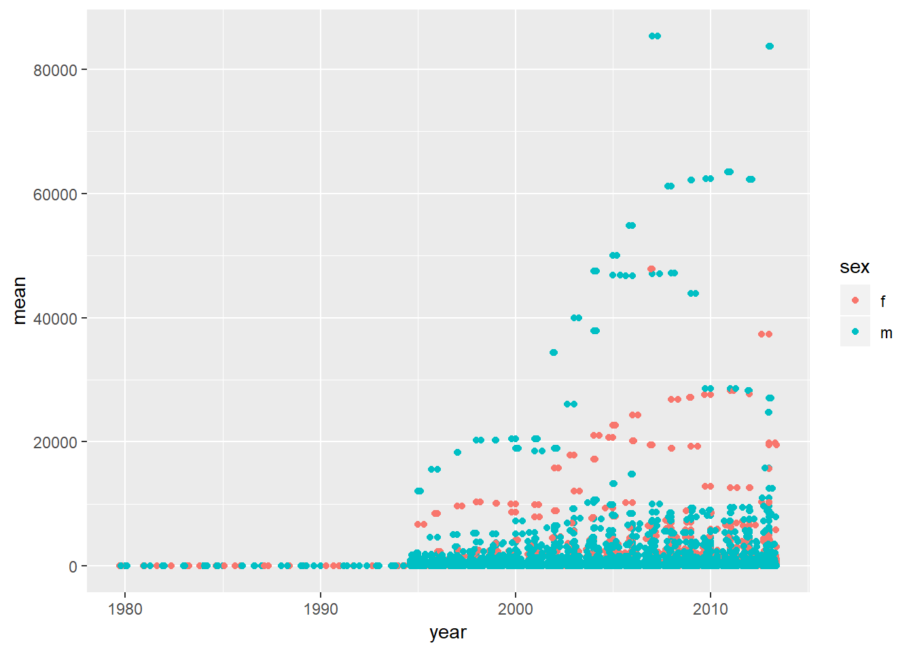

```r
#ratio of female tb cases over time
who_present %>% 
  group_by(sex, year) %>% 
  summarise(meansex=sum(value)) %>%
  ungroup() %>% 
  group_by(year) %>% 
  mutate(tot=sum(meansex)) %>% 
  ungroup() %>% 
  mutate(ratio=meansex/tot) %>% 
  filter(sex=="f") %>% 
  ggplot(aes(x=year, y=ratio, colour=sex))+
  geom_line()
```


```r
#countries with the most outbreaks
who_present %>%
  group_by(country, year) %>% 
  summarise(n=sum(value)) %>% 
  ungroup() %>% 
  group_by(country) %>% 
  mutate(total_country=sum(n)) %>% 
  filter(total_country>1000000) %>% 
  ggplot(aes(x=year,y=n,colour=country))+
  geom_line()
```


```r
#countries with the most split by gender as well
who_present %>%
  group_by(country, sex, year) %>% 
  summarise(n=sum(value)) %>% 
  ungroup() %>% 
  group_by(country) %>% 
  mutate(total_country=sum(n)) %>% 
  filter(total_country>1000000) %>% 
  ggplot(aes(x=year,y=n,colour=sex))+
  geom_line()+
  facet_wrap(~country)
```


```r
#take log and summarise
who_present %>%
  group_by(country, year) %>% 
  summarise(n=sum(value), logn=log(n)) %>% 
  ungroup() %>% 
  group_by(country) %>% 
  mutate(total_c=sum(n)) %>% 
  filter(total_c>1000000) %>% 
  ggplot(aes(x=year,y=logn, colour=country))+
  geom_line(show.legend=TRUE)
```


```r
#average # of countries with more female TB cases
who_present %>%
  group_by(country, year, sex) %>% 
  summarise(n=sum(value), logn=log(n)) %>% 
  ungroup() %>% 
  group_by(country, year) %>% 
  mutate(total_c=sum(n)) %>%
  ungroup() %>% 
  mutate(perc_gender=n/total_c, femalemore=ifelse(perc_gender>.5,1,0)) %>% 
  filter(sex=="f") %>% 
  group_by(year) %>% 
  summarise(summaryfem=mean(femalemore,na.rm=TRUE )) %>% 
  ggplot(aes(x=year,y=summaryfem))+
  geom_line()
```


<!--chapter:end:12-tidy-data.Rmd-->

*Make sure the following packages are installed:*  


# ch. 13: Relational data

> "The relations of three or more tables are always a property of the relations between each pairs."  

* Three families of verbs in relational data: *

* __Mutating joins__, which add new variables to one data frame from matching
  observations in another.
    + `inner_join`: match when equal
    + `left_join`: keep all observations in table in 1st arg
    + `right_join`: keep all observations in table in 2nd arg
    + `full_join`: keep all observations in table in 1st and 2nd arg
* __Filtering joins__, which filter observations from one data frame based on
  whether or not they match an observation in the other table.
    + `semi_join(x, y)` __keeps__ all observations in `x` that have a match in `y`.
    + `anti_join(x, y)` __drops__ all observations in `x` that have a match in `y`.
* __Set operations__, which treat observations as if they were set elements.
    + `intersect(x, y)`: return only observations in both `x` and `y` (when inputs are a df, is comparing across all values in a row).
    + `union(x, y)`: return unique observations in `x` and `y`.
    + `setdiff(x, y)`: return observations in `x`, but not in `y`.

`base::merge()` can perform all four types of mutating join:  

dplyr              | merge
-------------------|-------------------------------------------
`inner_join(x, y)` | `merge(x, y)`
`left_join(x, y)`  | `merge(x, y, all.x = TRUE)`
`right_join(x, y)` | `merge(x, y, all.y = TRUE)`,
`full_join(x, y)`  | `merge(x, y, all.x = TRUE, all.y = TRUE)`

SQL is the inspiration for dplyr's conventions, so the translation is straightforward:

dplyr                        | SQL
-----------------------------|-------------------------------------------
`inner_join(x, y, by = "z")` | `SELECT * FROM x INNER JOIN y USING (z)`
`left_join(x, y, by = "z")`  | `SELECT * FROM x LEFT OUTER JOIN y USING (z)`
`right_join(x, y, by = "z")` | `SELECT * FROM x RIGHT OUTER JOIN y USING (z)`
`full_join(x, y, by = "z")`  | `SELECT * FROM x FULL OUTER JOIN y USING (z)`

## 13.2 nycflights13


```r
flights
airlines
airports
planes
weather
```


### 13.2.1

1.  *Imagine you wanted to draw (approximately) the route each plane flies from*
    *its origin to its destination. What variables would you need? What tables*
    *would you need to combine?*  
    
    To draw a line from origin to destination, I need the lat lon points from airports` as well as the dest and origin variables from `flights`.
    
    
1.  *I forgot to draw the relationship between `weather` and `airports`.*
    *What is the relationship and how should it appear in the diagram?*
    
    `origin` from `weather connects to `faa` from `airports` in a many to one relationship
    

1.  *`weather` only contains information for the origin (NYC) airports. If*
    *it contained weather records for all airports in the USA, what additional*
    *relation would it define with `flights`?*  
    
    It would connect to `dest`.

1.  *We know that some days of the year are "special", and fewer people than*
    *usual fly on them. How might you represent that data as a data frame?*
    *What would be the primary keys of that table? How would it connect to the*
    *existing tables?*
    
    Make a set of days that are less popular and have these dates connect by month and day
    
## 13.3 Keys

### 13.3.1

1.  *Add a surrogate key to `flights`.*

    
    ```r
    flights %>%
      mutate(surrogate_key = row_number()) %>% 
      glimpse()
    ```
    
    ```
    ## Observations: 336,776
    ## Variables: 20
    ## $ year           <int> 2013, 2013, 2013, 2013, 2013, 2013, 2013, 2013,...
    ## $ month          <int> 1, 1, 1, 1, 1, 1, 1, 1, 1, 1, 1, 1, 1, 1, 1, 1,...
    ## $ day            <int> 1, 1, 1, 1, 1, 1, 1, 1, 1, 1, 1, 1, 1, 1, 1, 1,...
    ## $ dep_time       <int> 517, 533, 542, 544, 554, 554, 555, 557, 557, 55...
    ## $ sched_dep_time <int> 515, 529, 540, 545, 600, 558, 600, 600, 600, 60...
    ## $ dep_delay      <dbl> 2, 4, 2, -1, -6, -4, -5, -3, -3, -2, -2, -2, -2...
    ## $ arr_time       <int> 830, 850, 923, 1004, 812, 740, 913, 709, 838, 7...
    ## $ sched_arr_time <int> 819, 830, 850, 1022, 837, 728, 854, 723, 846, 7...
    ## $ arr_delay      <dbl> 11, 20, 33, -18, -25, 12, 19, -14, -8, 8, -2, -...
    ## $ carrier        <chr> "UA", "UA", "AA", "B6", "DL", "UA", "B6", "EV",...
    ## $ flight         <int> 1545, 1714, 1141, 725, 461, 1696, 507, 5708, 79...
    ## $ tailnum        <chr> "N14228", "N24211", "N619AA", "N804JB", "N668DN...
    ## $ origin         <chr> "EWR", "LGA", "JFK", "JFK", "LGA", "EWR", "EWR"...
    ## $ dest           <chr> "IAH", "IAH", "MIA", "BQN", "ATL", "ORD", "FLL"...
    ## $ air_time       <dbl> 227, 227, 160, 183, 116, 150, 158, 53, 140, 138...
    ## $ distance       <dbl> 1400, 1416, 1089, 1576, 762, 719, 1065, 229, 94...
    ## $ hour           <dbl> 5, 5, 5, 5, 6, 5, 6, 6, 6, 6, 6, 6, 6, 6, 6, 5,...
    ## $ minute         <dbl> 15, 29, 40, 45, 0, 58, 0, 0, 0, 0, 0, 0, 0, 0, ...
    ## $ time_hour      <dttm> 2013-01-01 05:00:00, 2013-01-01 05:00:00, 2013...
    ## $ surrogate_key  <int> 1, 2, 3, 4, 5, 6, 7, 8, 9, 10, 11, 12, 13, 14, ...
    ```


1.  *Identify the keys in the following datasets*

    1.  `Lahman::Batting`: player, year, stint
    
    
    ```r
    Lahman::Batting %>% 
      count(playerID, yearID, stint) %>% 
      filter(n > 1)
    ```
    
    ```
    ## # A tibble: 0 x 4
    ## # ... with 4 variables: playerID <chr>, yearID <int>, stint <int>, n <int>
    ```
    
    
    1.  `babynames::babynames`: name, sex, year
    
    ```r
    babynames::babynames %>% 
      count(name, sex, year) %>% 
      filter(n > 1)
    ```
    
    ```
    ## # A tibble: 0 x 4
    ## # ... with 4 variables: name <chr>, sex <chr>, year <dbl>, n <int>
    ```
    
    
    1.  `nasaweather::atmos`: lat, long, year, month
    
    
    ```r
    nasaweather::atmos %>% 
      count(lat, long, year, month) %>% 
      filter(n > 1)
    ```
    
    ```
    ## # A tibble: 0 x 5
    ## # ... with 5 variables: lat <dbl>, long <dbl>, year <int>, month <int>,
    ## #   n <int>
    ```
    
    1.  `fueleconomy::vehicles`: id
    
    
    ```r
    fueleconomy::vehicles %>% 
      count(id) %>% 
      filter(n > 1)
    ```
    
    ```
    ## # A tibble: 0 x 2
    ## # ... with 2 variables: id <int>, n <int>
    ```
    
    1.  `ggplot2::diamonds`: needs surrogate
    
    
    ```r
    diamonds %>% 
      count(x, y, z, depth, table, carat, cut, color, price, clarity ) %>% 
      filter(n > 1)
    ```
    
    ```
    ## # A tibble: 143 x 11
    ##        x     y     z depth table carat cut       color price clarity     n
    ##    <dbl> <dbl> <dbl> <dbl> <dbl> <dbl> <ord>     <ord> <int> <ord>   <int>
    ##  1  0     0     0     64.1    60  0.71 Good      F      2130 SI2         2
    ##  2  4.23  4.26  2.69  63.4    57  0.3  Good      J       394 VS1         2
    ##  3  4.26  4.23  2.69  63.4    57  0.3  Very Good J       506 VS1         2
    ##  4  4.26  4.29  2.66  62.2    57  0.3  Ideal     H       450 SI1         2
    ##  5  4.27  4.28  2.66  62.2    57  0.3  Ideal     H       450 SI1         2
    ##  6  4.29  4.31  2.71  63      55  0.3  Very Good G       526 VS2         2
    ##  7  4.29  4.31  2.73  63.5    56  0.31 Good      D       571 SI1         2
    ##  8  4.31  4.28  2.67  62.2    58  0.3  Premium   D       709 SI1         2
    ##  9  4.31  4.29  2.71  63      55  0.3  Ideal     G       675 VS2         2
    ## 10  4.31  4.29  2.73  63.5    56  0.31 Very Good D       732 SI1         2
    ## # ... with 133 more rows
    ```
    
    ```r
    diamonds %>% 
      mutate(surrogate_id = row_number())
    ```
    
    ```
    ## # A tibble: 53,940 x 11
    ##    carat cut   color clarity depth table price     x     y     z
    ##    <dbl> <ord> <ord> <ord>   <dbl> <dbl> <int> <dbl> <dbl> <dbl>
    ##  1 0.23  Ideal E     SI2      61.5    55   326  3.95  3.98  2.43
    ##  2 0.21  Prem~ E     SI1      59.8    61   326  3.89  3.84  2.31
    ##  3 0.23  Good  E     VS1      56.9    65   327  4.05  4.07  2.31
    ##  4 0.290 Prem~ I     VS2      62.4    58   334  4.2   4.23  2.63
    ##  5 0.31  Good  J     SI2      63.3    58   335  4.34  4.35  2.75
    ##  6 0.24  Very~ J     VVS2     62.8    57   336  3.94  3.96  2.48
    ##  7 0.24  Very~ I     VVS1     62.3    57   336  3.95  3.98  2.47
    ##  8 0.26  Very~ H     SI1      61.9    55   337  4.07  4.11  2.53
    ##  9 0.22  Fair  E     VS2      65.1    61   337  3.87  3.78  2.49
    ## 10 0.23  Very~ H     VS1      59.4    61   338  4     4.05  2.39
    ## # ... with 53,930 more rows, and 1 more variable: surrogate_id <int>
    ```
    
    

1.  *Draw a diagram illustrating the connections between the `Batting`,*
    *`Master`, and `Salaries` tables in the Lahman package. Draw another diagram*
    *that shows the relationship between `Master`, `Managers`, `AwardsManagers`.*  
    
    For each dataset show just the `head(1)`
    
    Combine by playerid
    
    ```
    ##    playerID yearID stint teamID lgID G AB R H X2B X3B HR RBI SB CS BB SO
    ## 1 abercda01   1871     1    TRO   NA 1  4 0 0   0   0  0   0  0  0  0  0
    ##   IBB HBP SH SF GIDP
    ## 1  NA  NA NA NA   NA
    ```
    
    ```
    ##    playerID birthYear birthMonth birthDay birthCountry birthState
    ## 1 aardsda01      1981         12       27          USA         CO
    ##   birthCity deathYear deathMonth deathDay deathCountry deathState
    ## 1    Denver        NA         NA       NA         <NA>       <NA>
    ##   deathCity nameFirst nameLast   nameGiven weight height bats throws
    ## 1      <NA>     David  Aardsma David Allan    215     75    R      R
    ##        debut  finalGame  retroID   bbrefID deathDate  birthDate
    ## 1 2004-04-06 2015-08-23 aardd001 aardsda01      <NA> 1981-12-27
    ```
    
    
    Combine by playerID, yearID
    
    ```
    ##    playerID yearID stint teamID lgID G AB R H X2B X3B HR RBI SB CS BB SO
    ## 1 abercda01   1871     1    TRO   NA 1  4 0 0   0   0  0   0  0  0  0  0
    ##   IBB HBP SH SF GIDP
    ## 1  NA  NA NA NA   NA
    ```
    
    ```
    ##   yearID teamID lgID  playerID salary
    ## 1   1985    ATL   NL barkele01 870000
    ```
    
    Combine by playerID
    
    ```
    ##    playerID birthYear birthMonth birthDay birthCountry birthState
    ## 1 aardsda01      1981         12       27          USA         CO
    ##   birthCity deathYear deathMonth deathDay deathCountry deathState
    ## 1    Denver        NA         NA       NA         <NA>       <NA>
    ##   deathCity nameFirst nameLast   nameGiven weight height bats throws
    ## 1      <NA>     David  Aardsma David Allan    215     75    R      R
    ##        debut  finalGame  retroID   bbrefID deathDate  birthDate
    ## 1 2004-04-06 2015-08-23 aardd001 aardsda01      <NA> 1981-12-27
    ```
    
    ```
    ##   yearID teamID lgID  playerID salary
    ## 1   1985    ATL   NL barkele01 870000
    ```
    
    Connect by playerID
    
    ```
    ##    playerID birthYear birthMonth birthDay birthCountry birthState
    ## 1 aardsda01      1981         12       27          USA         CO
    ##   birthCity deathYear deathMonth deathDay deathCountry deathState
    ## 1    Denver        NA         NA       NA         <NA>       <NA>
    ##   deathCity nameFirst nameLast   nameGiven weight height bats throws
    ## 1      <NA>     David  Aardsma David Allan    215     75    R      R
    ##        debut  finalGame  retroID   bbrefID deathDate  birthDate
    ## 1 2004-04-06 2015-08-23 aardd001 aardsda01      <NA> 1981-12-27
    ```
    
    ```
    ##    playerID yearID teamID lgID inseason  G  W  L rank plyrMgr
    ## 1 wrighha01   1871    BS1   NA        1 31 20 10    3       Y
    ```
    
    Connect by playerID 
    
    ```
    ##    playerID birthYear birthMonth birthDay birthCountry birthState
    ## 1 aardsda01      1981         12       27          USA         CO
    ##   birthCity deathYear deathMonth deathDay deathCountry deathState
    ## 1    Denver        NA         NA       NA         <NA>       <NA>
    ##   deathCity nameFirst nameLast   nameGiven weight height bats throws
    ## 1      <NA>     David  Aardsma David Allan    215     75    R      R
    ##        debut  finalGame  retroID   bbrefID deathDate  birthDate
    ## 1 2004-04-06 2015-08-23 aardd001 aardsda01      <NA> 1981-12-27
    ```
    
    ```
    ##    playerID                   awardID yearID lgID  tie notes
    ## 1 larusto01 BBWAA Manager of the Year   1983   AL <NA>    NA
    ```

    *How would you characterise the relationship between the `Batting`,*
    *`Pitching`, and `Fielding` tables?*

    All connect by playerID, yearID, stint
    
    
    ```
    ##    playerID yearID stint teamID lgID G AB R H X2B X3B HR RBI SB CS BB SO
    ## 1 abercda01   1871     1    TRO   NA 1  4 0 0   0   0  0   0  0  0  0  0
    ##   IBB HBP SH SF GIDP
    ## 1  NA  NA NA NA   NA
    ```
    
    ```
    ##    playerID yearID stint teamID lgID W L G GS CG SHO SV IPouts  H ER HR BB
    ## 1 bechtge01   1871     1    PH1   NA 1 2 3  3  2   0  0     78 43 23  0 11
    ##   SO BAOpp  ERA IBB WP HBP BK BFP GF  R SH SF GIDP
    ## 1  1    NA 7.96  NA NA  NA  0  NA NA 42 NA NA   NA
    ```
    
    ```
    ##    playerID yearID stint teamID lgID POS G GS InnOuts PO A E DP PB WP SB
    ## 1 abercda01   1871     1    TRO   NA  SS 1 NA      NA  1 3 2  0 NA NA NA
    ##   CS ZR
    ## 1 NA NA
    ```
  
  
## 13.4 Mutating joins

> The most commonly used join is the left join: you use this whenever you look up additional data from another table, because it preserves the original observations even when there isn't a match.

### 13.4.6 

1.  *Compute the average delay by destination, then join on the `airports`*
    *data frame so you can show the spatial distribution of delays. Here's an*
    *easy way to draw a map of the United States:*  

    
    ```r
    airports %>%
      semi_join(flights, c("faa" = "dest")) %>%
      ggplot(aes(lon, lat)) +
      borders("state") +
      geom_point() +
      coord_quickmap()
    ```
  
    Now adding in colour by average delay.
  
    
    ```r
    flights %>% 
      semi_join(airports, c("dest" = "faa")) %>%
      group_by(dest) %>% 
      summarise(delay = mean(arr_delay, na.rm=TRUE)) %>% 
      left_join(airports, by = c("dest"="faa")) %>% 
      ggplot(aes(lon, lat)) +
      borders("state") +
      geom_point(aes(colour = delay)) +
      coord_quickmap()+
      scale_color_gradientn(colours = rainbow(3))
    ```
    
    
    

1.  *Add the location of the origin _and_ destination (i.e. the `lat` and `lon`)*
    *to `flights`.*
    
    
    ```r
    flights %>% 
      left_join(airports, by = c("dest" = "faa")) %>% 
      left_join(airports, by = c("origin" = "faa"), suffix=c("_dest", "_origin")) %>%
      select(flight, carrier, dest, lat_dest, lon_dest, origin, lat_origin, lon_origin)
    ```
    
    ```
    ## # A tibble: 336,776 x 8
    ##    flight carrier dest  lat_dest lon_dest origin lat_origin lon_origin
    ##     <int> <chr>   <chr>    <dbl>    <dbl> <chr>       <dbl>      <dbl>
    ##  1   1545 UA      IAH       30.0    -95.3 EWR          40.7      -74.2
    ##  2   1714 UA      IAH       30.0    -95.3 LGA          40.8      -73.9
    ##  3   1141 AA      MIA       25.8    -80.3 JFK          40.6      -73.8
    ##  4    725 B6      BQN       NA       NA   JFK          40.6      -73.8
    ##  5    461 DL      ATL       33.6    -84.4 LGA          40.8      -73.9
    ##  6   1696 UA      ORD       42.0    -87.9 EWR          40.7      -74.2
    ##  7    507 B6      FLL       26.1    -80.2 EWR          40.7      -74.2
    ##  8   5708 EV      IAD       38.9    -77.5 LGA          40.8      -73.9
    ##  9     79 B6      MCO       28.4    -81.3 JFK          40.6      -73.8
    ## 10    301 AA      ORD       42.0    -87.9 LGA          40.8      -73.9
    ## # ... with 336,766 more rows
    ```
    
    Note that the suffix allows you to tag names onto first and second table, hence why vector is length 2  
  
1.  *Is there a relationship between the age of a plane and its delays?*

    
    ```r
    group_by(flights, tailnum) %>% 
      summarise(avg_delay = mean(arr_delay, na.rm=TRUE), 
                n = n()) %>% 
      left_join(planes, by="tailnum") %>% 
      mutate(age = 2013 - year) %>% 
      filter(n > 50, age < 30) %>% 
      ggplot(aes(x = age, y = avg_delay))+
      ggbeeswarm::geom_quasirandom()+
      geom_smooth()
    ```
    
    ```
    ## `geom_smooth()` using method = 'gam' and formula 'y ~ s(x, bs = "cs")'
    ```
    
    
    
    Looks as though planes that are roughly 5 to 10 years old have higher delays... Let's look at same thing using boxplots.
    
    
    ```r
    group_by(flights, tailnum) %>% 
      summarise(avg_delay = mean(arr_delay, na.rm=TRUE), 
                n = n()) %>% 
      left_join(planes, by="tailnum") %>% 
      mutate(age = 2013 - year) %>% 
      filter(n > 50, age <= 30, age >= 0) %>% 
      ggplot()+
      geom_boxplot(aes(x = cut_width(age, 2, boundary = 0), y = avg_delay))+
      theme(axis.text.x = element_text(angle = 90, hjust = 1))
    ```
    
    
    
    Perhaps there is not an overall trend association between age and delays, though it seems that the particular group of planes in that time range seem to have delays than either newer or older planes. On the other hand, there does almost look to be a seasonality pattern -- though this may just be me seeing things... perhaps worth exploring more...
    
    A simple way to test for a non-linear relationship would be to discretize age and then pass it through an anova
    
    
    ```r
    nycflights13::flights %>% 
      select(arr_delay, tailnum) %>% 
      left_join(planes, by="tailnum") %>% 
      filter(!is.na(arr_delay)) %>% 
      mutate(age = 2013 - year,
             age_round_5 = (5 * age %/% 5) %>% as.factor()) %>% 
      with(aov(arr_delay ~ age_round_5)) %>% 
      summary()
    ```
    
    ```
    ##                 Df    Sum Sq Mean Sq F value Pr(>F)    
    ## age_round_5     11   1062080   96553   47.92 <2e-16 ***
    ## Residuals   273841 551756442    2015                   
    ## ---
    ## Signif. codes:  0 '***' 0.001 '**' 0.01 '*' 0.05 '.' 0.1 ' ' 1
    ## 53493 observations deleted due to missingness
    ```
    
    * There are weaknesses to using anova, but according to this test arrival delay does not appear to be randomly distributed across age
    * The reason for such a difference may be trivial or may be confounded by a more interesting pattern... but these are deeper questions

1.  *What weather conditions make it more likely to see a delay?*

    There are a lot of ways you could have approached this problem. Below, I look at the average weather value for each of the groups `FALSE`, `TRUE` and `Canceled` -- `FALSE` corresponding with non-delayed flights, `TRUE` with delayed flights and `Canceled` with flights that were canceled. If I were feeling fancy, I would have also added the standard errors on these...

    
    ```r
    flights_weath <- mutate(flights, delay_TF = dep_delay > 0) %>%
      separate(sched_dep_time, 
               into = c("hour_sched", "min_sched"), 
               sep = -3,
               remove = FALSE, 
               convert = TRUE) %>%
      left_join(weather, by = c("origin", "year","month", "day", "hour_sched"="hour"))
    
    flights_weath_gath <- flights_weath %>% 
      select(sched_dep_time, delay_TF, sched_dep_time, temp:visib) %>% 
      mutate(key = row_number()) %>% 
      gather(temp, dewp, humid, wind_dir, wind_speed, wind_gust, precip, pressure, visib, 
           key="weather", value="values") 
    
    flights_summarized <- flights_weath_gath %>% 
      group_by(weather, delay_TF) %>% 
      summarise(median_weath = median(values, na.rm = TRUE),
                mean_weath = mean(values, na.rm = TRUE), 
                sum_n = sum(!is.na(values))) %>% 
      ungroup() %>% 
      mutate(delay_TF = ifelse(is.na(delay_TF), "Canceled", delay_TF),
             delay_TF = forcats::as_factor(delay_TF, c(FALSE, TRUE, "Canceled")))
    
    flights_summarized %>%  
      ggplot(aes(x = delay_TF, y = mean_weath, fill = delay_TF))+
      geom_col()+
      facet_wrap(~weather, scales = "free_y")+
      theme(axis.text.x = element_text(angle = 90, hjust = 1))
    ```
    
    

    While precipitation is the largest difference, my guess is that the standard error on this would be much greater day to day because as you can see the values are very low, so it could be that a few cases with a lot of rain may tick it up, but it may be tough to actually use this as a predictor... 

1.  *What happened on June 13 2013? Display the spatial pattern of delays,*
    *and then use Google to cross-reference with the weather.*


    
    Looks like East coast is getting hammered and flights arriving from Atlanta an similar locations were very delayed. Guessing either weather issue, or problem in Atl or delta.
    
## 13.5 Filtering joins

### 13.5.1

1.  *What does it mean for a flight to have a missing `tailnum`?*

    All flights with a missing tailnum in the `flights` table were cancelled as you can see below.
    
    ```r
    flights %>% 
      count(is.na(tailnum), is.na(arr_delay))
    ```
    
    ```
    ## # A tibble: 3 x 3
    ##   `is.na(tailnum)` `is.na(arr_delay)`      n
    ##   <lgl>            <lgl>               <int>
    ## 1 FALSE            FALSE              327346
    ## 2 FALSE            TRUE                 6918
    ## 3 TRUE             TRUE                 2512
    ```

    *What do the tail numbers that don't have a matching record in `planes` have in common?*
    *(Hint: one variable explains ~90% of the problems.)*
    
    
    ```r
    flights %>% 
      anti_join(planes, by="tailnum") %>% 
      count(carrier, sort = TRUE)
    ```
    
    ```
    ## # A tibble: 10 x 2
    ##    carrier     n
    ##    <chr>   <int>
    ##  1 MQ      25397
    ##  2 AA      22558
    ##  3 UA       1693
    ##  4 9E       1044
    ##  5 B6        830
    ##  6 US        699
    ##  7 FL        187
    ##  8 DL        110
    ##  9 F9         50
    ## 10 WN         38
    ```
    
    ```r
    flights %>% 
      mutate(in_planes = tailnum %in% planes$tailnum) %>% 
      group_by(carrier) %>% 
      summarise(flights_inPlanes = sum(in_planes),
                n = n(),
                perc_inPlanes = flights_inPlanes / n) %>% 
      ungroup()
    ```
    
    ```
    ## # A tibble: 16 x 4
    ##    carrier flights_inPlanes     n perc_inPlanes
    ##    <chr>              <int> <int>         <dbl>
    ##  1 9E                 17416 18460        0.943 
    ##  2 AA                 10171 32729        0.311 
    ##  3 AS                   714   714        1     
    ##  4 B6                 53805 54635        0.985 
    ##  5 DL                 48000 48110        0.998 
    ##  6 EV                 54173 54173        1     
    ##  7 F9                   635   685        0.927 
    ##  8 FL                  3073  3260        0.943 
    ##  9 HA                   342   342        1     
    ## 10 MQ                  1000 26397        0.0379
    ## 11 OO                    32    32        1     
    ## 12 UA                 56972 58665        0.971 
    ## 13 US                 19837 20536        0.966 
    ## 14 VX                  5162  5162        1     
    ## 15 WN                 12237 12275        0.997 
    ## 16 YV                   601   601        1
    ```

    Some carriers do not have many of their tailnums data in the `planes` table. Anyone have more insight here?


1.  *Filter flights to only show flights with planes that have flown at least 100*
    *flights.*
    
    
    ```r
    planes_many <- flights %>% 
      count(tailnum, sort=TRUE) %>% 
      filter(n > 100)
    
    semi_join(flights, planes_many)
    ```
    
    ```
    ## Joining, by = "tailnum"
    ```
    
    ```
    ## # A tibble: 229,202 x 19
    ##     year month   day dep_time sched_dep_time dep_delay arr_time
    ##    <int> <int> <int>    <int>          <int>     <dbl>    <int>
    ##  1  2013     1     1      517            515         2      830
    ##  2  2013     1     1      533            529         4      850
    ##  3  2013     1     1      544            545        -1     1004
    ##  4  2013     1     1      554            558        -4      740
    ##  5  2013     1     1      555            600        -5      913
    ##  6  2013     1     1      557            600        -3      709
    ##  7  2013     1     1      557            600        -3      838
    ##  8  2013     1     1      558            600        -2      849
    ##  9  2013     1     1      558            600        -2      853
    ## 10  2013     1     1      558            600        -2      923
    ## # ... with 229,192 more rows, and 12 more variables: sched_arr_time <int>,
    ## #   arr_delay <dbl>, carrier <chr>, flight <int>, tailnum <chr>,
    ## #   origin <chr>, dest <chr>, air_time <dbl>, distance <dbl>, hour <dbl>,
    ## #   minute <dbl>, time_hour <dttm>
    ```

1.  *Combine `fueleconomy::vehicles` and `fueleconomy::common` to find only the*
    *records for the most common models.*
    
    
    ```r
    fueleconomy::vehicles %>% 
      semi_join(fueleconomy::common, by=c("make", "model"))
    ```
    
    ```
    ## # A tibble: 14,531 x 12
    ##       id make  model   year class trans drive   cyl displ fuel    hwy   cty
    ##    <int> <chr> <chr>  <int> <chr> <chr> <chr> <int> <dbl> <chr> <int> <int>
    ##  1  1833 Acura Integ~  1986 Subc~ Auto~ Fron~     4   1.6 Regu~    28    22
    ##  2  1834 Acura Integ~  1986 Subc~ Manu~ Fron~     4   1.6 Regu~    28    23
    ##  3  3037 Acura Integ~  1987 Subc~ Auto~ Fron~     4   1.6 Regu~    28    22
    ##  4  3038 Acura Integ~  1987 Subc~ Manu~ Fron~     4   1.6 Regu~    28    23
    ##  5  4183 Acura Integ~  1988 Subc~ Auto~ Fron~     4   1.6 Regu~    27    22
    ##  6  4184 Acura Integ~  1988 Subc~ Manu~ Fron~     4   1.6 Regu~    28    23
    ##  7  5303 Acura Integ~  1989 Subc~ Auto~ Fron~     4   1.6 Regu~    27    22
    ##  8  5304 Acura Integ~  1989 Subc~ Manu~ Fron~     4   1.6 Regu~    28    23
    ##  9  6442 Acura Integ~  1990 Subc~ Auto~ Fron~     4   1.8 Regu~    24    20
    ## 10  6443 Acura Integ~  1990 Subc~ Manu~ Fron~     4   1.8 Regu~    26    21
    ## # ... with 14,521 more rows
    ```
    

1.  *Find the 48 hours (over the course of the whole year) that have the worst*
    *delays. Cross-reference it with the `weather` data. Can you see any*
    *patterns?*
    
    
    First: Create two variables that together capture all 48 hour time windows across the year, at the day window of granularity (e.g. the time of day the flight takes off does not matter in establishing time windows for this example, only the day).
    Second: Gather these time windows into a single dataframe (note that this will increase the length of your data by ~364/365 * 100 %)
    Third: Group by `window_start_date` and calculate average `arr_delay` and related metrics.
    
    
    ```r
    delays_windows <- flights %>% 
      #First
      mutate(date_flight = lubridate::as_date(time_hour)) %>% 
      mutate(startdate_window1 = cut.Date(date_flight, "2 day")) %>% 
      mutate(date_flight2 = ifelse(!(date_flight == min(date_flight, na.rm = TRUE)), date_flight, NA),
             date_flight2 = lubridate::as_date(date_flight2),
             startdate_window2 = cut.Date(date_flight2, "2 day")) %>% 
      select(-date_flight, -date_flight2) %>% 
      #Second
      gather(startdate_window1, startdate_window2, key = "start_window", value = "window_start_date") %>% 
      filter(!is.na(window_start_date)) %>% 
      #Third
      group_by(window_start_date) %>% 
      summarise(num = n(),
                perc_cancelled = sum(is.na(arr_delay)) / n(),
                mean_delay = mean(arr_delay, na.rm = TRUE),
                perc_delay = mean(arr_delay > 0, na.rm = TRUE),
                total_delay_mins = sum(arr_delay, na.rm = TRUE)) %>% 
      ungroup()
    ```
    
    ```
    ## Warning: attributes are not identical across measure variables;
    ## they will be dropped
    ```
    
    ```r
    #don't worry about warning of 'attributes are not identical...', that is
    #because the cut function assigns attributes to the value, it's fine if
    #these are dropped here.
    ```
    
    Create tibble of worst 2-day period for mean `arr_delay`
    
    ```r
    WorstWindow <- delays_windows %>% 
      mutate(mean_delay_rank = dplyr::min_rank(-mean_delay)) %>% 
      filter(mean_delay_rank <= 1)
    
    WorstDates <- tibble(dates = c(lubridate::as_date(WorstWindow$window_start_date), lubridate::as_date(WorstWindow$window_start_date) + lubridate::duration(1, "days")))
    ```
    
    Ammend weather data so that weather is an average across three NY locations rather than seperate for each ^[note that a weighted average based on traffic would be more appropriate here because the `mean_delay` values will be weighted by number of flights going through each -- hopefully lack of substantial difference between locatioins means this won't be too impactful...]
    
    ```r
    weather_ammended <- weather %>% 
      mutate(time_hour = lubridate::make_datetime(year, month, day, hour)) %>% 
      select(-one_of("origin", "year", "month", "day", "hour")) %>% 
      group_by(time_hour) %>% 
      summarise_all(mean, na.rm = TRUE) %>% 
      ungroup()
    ```
    
    
    Filtering join to just times weather for worst 2 days
    
    ```r
    weather_worst <- weather_ammended %>%
      mutate(dates = as_date(time_hour)) %>% 
      semi_join(WorstDates)
    ```
    
    ```
    ## Joining, by = "dates"
    ```
    
    Plot of hourly weather values across 48 hour time windows.
    
    ```r
    weather_worst %>% 
      select(-dates) %>% 
      gather(temp:visib, key = "weather_type", value = "weather_value") %>% 
      ggplot(aes(x = time_hour, y = weather_value))+
      geom_line()+
      facet_grid(weather_type ~ ., scales = "free_y")+
      labs(title = 'Hourly weather values across worst 48 hours of delays')
    ```
    
    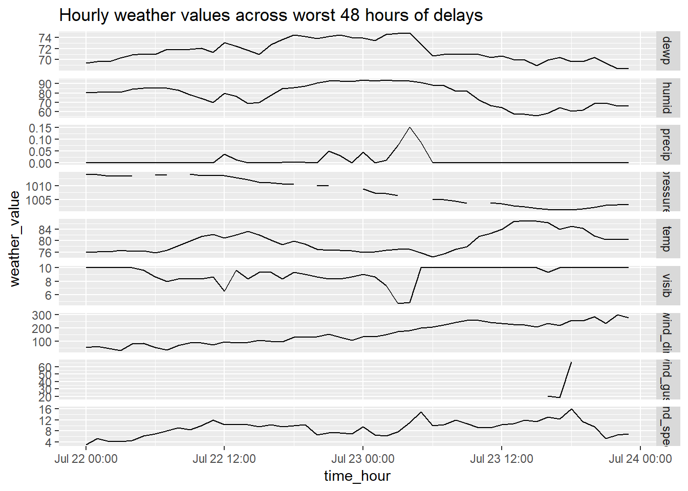

    Patterns:  
      
    * `wind_gust` and `wind_speed` are the same.
    * See high level of colinearity in spikes and changes, e.g. increase in `precip` corresponds with decrease in `visib` and perhaps uptick in `wind_spee`
    
    Perhaps, we want to view how the average hourly weather values compare on the worst days to average weather days. Create summary of average hourly weather values for worst 48 hour period, for average period, and then append these and plot.
    
    ```r
    bind_rows(  
    weather_worst %>% 
      summarise_at(vars(temp:visib), mean, na.rm = TRUE) %>% 
      mutate(category = "weather on worst 48") %>% 
      gather(temp:visib, key = weather_type, value = weather_val)
    ,
    weather_ammended %>% 
      summarise_at(vars(temp:visib), mean, na.rm = TRUE) %>% 
      mutate(category = "weather on average") %>% 
      gather(temp:visib, key = weather_type, value = weather_val)
    ) %>% 
      ggplot(aes(x = category, y = weather_val, fill = category))+
      geom_col()+
      facet_wrap(~weather_type, scales = "free_y")+
      labs(title = "Hourly average weather values on worst 48 hour window of delays vs. hourly average weather across year", 
           caption = "Note that delays are based on mean(arr_delay, na.rm = TRUE)")
    ```
    
    

    For this to be the worst 48 hour period, the weather doesn't actually seem to be as extreme as I would have guessed.
    
    Let's add-in average `arr_delay` by planned departure time to this to see how the delay times throughout the day varied, to see if there was a surge or change in weather that led to the huge change in delays.
    
    
    ```r
    flights %>% 
      mutate(dates = as_date(time_hour)) %>% 
      semi_join(WorstDates) %>% 
      group_by(time_hour) %>% 
      summarise(value = mean(arr_delay, na.rm = TRUE)) %>% 
      ungroup() %>% 
      mutate(value_type = "Mean_ArrDelay") %>% 
      bind_rows(
      weather_worst %>% 
        select(-dates) %>% 
        gather(temp:visib, key = "value_type", value = "value")
      ) %>% 
      mutate(weather_attr = !(value_type == "Mean_ArrDelay"),
             value_type = forcats::fct_relevel(value_type, "Mean_ArrDelay")) %>% 
      ggplot(aes(x = time_hour, value, colour = weather_attr))+
      geom_line()+
      facet_grid(value_type ~ ., scales = "free_y")+
      labs(title = 'Hourly weather and delay values across worst 48 hours of delays')
    ```
    
    ```
    ## Joining, by = "dates"
    ```
    
    

    Maybe that first uptick in precipitation corresponded with the increase in delay... but still, looks extreme like an incident caused this. I cheched the news and it looks like a plane was crash landed onto the tarmac at one of the airports on this day https://en.wikipedia.org/wiki/Southwest_Airlines_Flight_345#cite_note-DMN_Aircraft_Totaled_20160808-4 , I checked the incident time and it occurred at 17:45 Jul 22, looks like it overlaps with the time we see the uptick in delays.  

    I show plots and models of 48 hour time windows in a variety of other contexts and detail in [Appendix]

1.  *What does `anti_join(flights, airports, by = c("dest" = "faa"))` tell you?*
    *What does `anti_join(airports, flights, by = c("faa" = "dest"))` tell you?*

    `anti_join(flights, airports, by = c("dest" = "faa"))` --tells me the flight dests missing an airport
    `anti_join(airports, flights, by = c("faa" = "dest"))` -- tells me the airports with no flights coming to them

1.  *You might expect that there's an implicit relationship between plane*
    *and airline, because each plane is flown by a single airline. Confirm*
    *or reject this hypothesis using the tools you've learned above.*

    
    ```r
    tail_carr <- flights %>% 
      filter(!is.na(tailnum)) %>% 
      distinct(carrier, tailnum) %>% 
      count(tailnum, sort=TRUE)
    
    tail_carr %>% 
      filter(n > 1)
    ```
    
    ```
    ## # A tibble: 17 x 2
    ##    tailnum     n
    ##    <chr>   <int>
    ##  1 N146PQ      2
    ##  2 N153PQ      2
    ##  3 N176PQ      2
    ##  4 N181PQ      2
    ##  5 N197PQ      2
    ##  6 N200PQ      2
    ##  7 N228PQ      2
    ##  8 N232PQ      2
    ##  9 N933AT      2
    ## 10 N935AT      2
    ## 11 N977AT      2
    ## 12 N978AT      2
    ## 13 N979AT      2
    ## 14 N981AT      2
    ## 15 N989AT      2
    ## 16 N990AT      2
    ## 17 N994AT      2
    ```
    
    
    You should reject that hypothesis, you can see that 17 `tailnum`s are duplicated on multiple carriers.  
    
    Below is code to show those 17 tailnums
    
    ```r
    flights %>% 
      distinct(carrier, tailnum) %>% 
      filter(!is.na(tailnum)) %>% 
      group_by(tailnum) %>% 
      mutate(n_tail = n()) %>%
      ungroup() %>% 
      filter(n_tail > 1) %>% 
      arrange(desc(n_tail), tailnum)
    ```
    
    ```
    ## # A tibble: 34 x 3
    ##    carrier tailnum n_tail
    ##    <chr>   <chr>    <int>
    ##  1 9E      N146PQ       2
    ##  2 EV      N146PQ       2
    ##  3 9E      N153PQ       2
    ##  4 EV      N153PQ       2
    ##  5 9E      N176PQ       2
    ##  6 EV      N176PQ       2
    ##  7 9E      N181PQ       2
    ##  8 EV      N181PQ       2
    ##  9 9E      N197PQ       2
    ## 10 EV      N197PQ       2
    ## # ... with 24 more rows
    ```

#Appendix

##13.5.1.4

Graph all of these metrics at once using roughly the same method as used on 13.4.6 #4.

```r
delays_windows %>% 
  gather(perc_cancelled, mean_delay, perc_delay, key = value_type, value = val) %>% 
  mutate(window_start_date = lubridate::as_date(window_start_date)) %>% 
  ggplot(aes(window_start_date, val))+
  geom_line()+
  facet_wrap(~value_type, scales = "free_y", ncol = 1)+
  scale_x_date(date_labels = "%b %d")+
  labs(title = 'Measures of delay across 48 hour time windows')
```


Create 48 hour windows for weather data. Follow exact same steps as above.


```r
weather_windows <- weather_ammended %>% 
  mutate(date_flight = lubridate::as_date(time_hour)) %>% 
  mutate(startdate_window1 = cut.Date(date_flight, "2 day")) %>% 
  mutate(date_flight2 = ifelse(!(date_flight == min(date_flight, na.rm = TRUE)), date_flight, NA),
         date_flight2 = lubridate::as_date(date_flight2),
         startdate_window2 = cut.Date(date_flight2, "2 day")) %>% 
  select(-date_flight, -date_flight2) %>% 
    #Second
  gather(startdate_window1, startdate_window2, key = "start_window", value = "window_start_date") %>% 
  filter(!is.na(window_start_date)) %>% 
  #Third
  group_by(window_start_date) %>%
  summarise_at(vars(temp:visib), mean, na.rm = TRUE) %>% 
  ungroup() %>% 
  select(-wind_gust)
```

```
## Warning: attributes are not identical across measure variables;
## they will be dropped
```

  Graph using same method as above...

```r
weather_windows %>% 
  gather(temp:visib, key = weather_type, value = val) %>% 
  mutate(window_start_date = lubridate::as_date(window_start_date)) %>% 
  ggplot(aes(x = window_start_date, y = val))+
  geom_line()+
  facet_wrap(~weather_type, ncol = 1, scales = "free_y")+
  scale_x_date(date_labels = "%b %d")+
  labs(title = 'Measures of weather across 48 hour time windows')
```


Connect delays and weather data


```r
weather_delay_joined <- left_join(delays_windows, weather_windows, by = "window_start_date") %>% 
  select(mean_delay, temp:visib, window_start_date) %>%
  select(-dewp) %>%  #is almost completely correlated with temp so removed one of them...
  na.omit()
```

Plot of 48 hour window of weather scores against mean delay keeping intact order of observations


```r
weather_delay_joined %>% 
  gather(mean_delay, temp:visib, key = value_type, value = val) %>% 
  mutate(window_start_date = lubridate::as_date(window_start_date),
         value_type = forcats::fct_relevel(value_type, "mean_delay")) %>%
  ggplot(aes(x = window_start_date, y = val, colour = ! value_type == "mean_delay"))+
  geom_line()+
  facet_wrap(~value_type, scales = "free_y", ncol = 1)+
  labs(colour = "Weather value", title = "Mean delay and weather value in 2-day rolling window")
```


Plot of mean_delay against weather type, each point representing a different 'window'

```r
weather_delay_joined %>% 
  gather(temp:visib, key = weather_type, value = weather_val) %>% 
  ggplot(aes(x = weather_val, y = mean_delay))+
  geom_point()+
  geom_smooth()+
  facet_wrap(~weather_type, scales = "free_x")
```

```
## `geom_smooth()` using method = 'loess' and formula 'y ~ x'
```

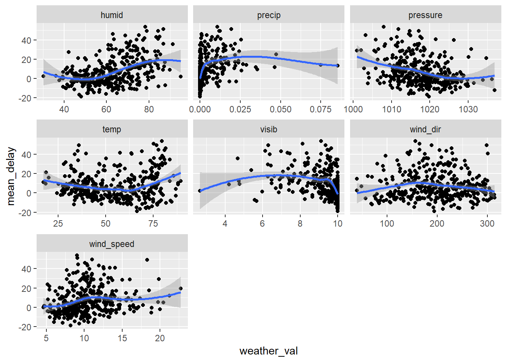

In a sense, these plots are not really valid as they obscure the fact that each point is not an independent observation (because there is a high level of association with w/e the value was on a single day with what it was in the previous day). E.g. mean_delay has a correlation of ~ 0.68 with prior days value as shown below... This is often ignored and we can also ignore it for now as it gets into time series and things we don't need to worry about for now... but somthing to be aware...


```r
weather_delay_joined %>% 
  mutate(mean_delay_lag = lag(mean_delay)) %>% 
  select(mean_delay, mean_delay_lag) %>% 
  na.omit() %>% 
  cor()
```

```
##                mean_delay mean_delay_lag
## mean_delay      1.0000000      0.6795631
## mean_delay_lag  0.6795631      1.0000000
```

Data is not Independent (as mentioned above) and many problems associated with this... but let's ignore this for now and just look at a few statisitics... 

Can see below that raw correlation of `mean_delay` is highest with humid. 


```r
weather_delay_joined %>%  
  select(-window_start_date) %>% 
  cor()
```

```
##             mean_delay        temp      humid    wind_dir  wind_speed
## mean_delay  1.00000000  0.08515338  0.4549140 -0.05371522  0.16262585
## temp        0.08515338  1.00000000  0.3036520 -0.25906906 -0.40160692
## humid       0.45491403  0.30365205  1.0000000 -0.51010505 -0.30383181
## wind_dir   -0.05371522 -0.25906906 -0.5101050  1.00000000  0.50039832
## wind_speed  0.16262585 -0.40160692 -0.3038318  0.50039832  1.00000000
## precip      0.36475598  0.02775525  0.4481898 -0.12853817  0.11176053
## pressure   -0.31716918 -0.23873857 -0.2363718 -0.26627495 -0.25716938
## visib      -0.38740156  0.12290097 -0.6647598  0.26307685  0.05275072
##                 precip   pressure       visib
## mean_delay  0.36475598 -0.3171692 -0.38740156
## temp        0.02775525 -0.2387386  0.12290097
## humid       0.44818978 -0.2363718 -0.66475984
## wind_dir   -0.12853817 -0.2662749  0.26307685
## wind_speed  0.11176053 -0.2571694  0.05275072
## precip      1.00000000 -0.2265636 -0.44400337
## pressure   -0.22656357  1.0000000  0.12032520
## visib      -0.44400337  0.1203252  1.00000000
```

When accounting for other variables, see relationship with windspeed seems to emerge as important...

```r
weather_delay_joined %>% 
  select(-window_start_date) %>% 
  lm(mean_delay ~ ., data = .) %>% 
  summary()
```

```
## 
## Call:
## lm(formula = mean_delay ~ ., data = .)
## 
## Residuals:
##     Min      1Q  Median      3Q     Max 
## -26.179  -7.581  -1.374   5.271  38.008 
## 
## Coefficients:
##              Estimate Std. Error t value Pr(>|t|)    
## (Intercept) 169.56872  132.07737   1.284   0.2000    
## temp          0.05460    0.04702   1.161   0.2464    
## humid         0.48158    0.09088   5.299 2.04e-07 ***
## wind_dir      0.01420    0.01376   1.032   0.3026    
## wind_speed    1.15641    0.25561   4.524 8.28e-06 ***
## precip      140.84141   78.84192   1.786   0.0749 .  
## pressure     -0.19722    0.12476  -1.581   0.1148    
## visib        -1.15009    0.80567  -1.427   0.1543    
## ---
## Signif. codes:  0 '***' 0.001 '**' 0.01 '*' 0.05 '.' 0.1 ' ' 1
## 
## Residual standard error: 11.64 on 356 degrees of freedom
## Multiple R-squared:  0.3332,	Adjusted R-squared:  0.3201 
## F-statistic: 25.42 on 7 and 356 DF,  p-value: < 2.2e-16
```

For a variety of reasons, especially in cases where your observations are not independent, you may want to evaluate how the change in an attribute relates to the change in another attribute. In the cases below I plot the diffs for example:  
  
*(average value on 2013-02-07 to 2013-02-08) - (average value on 2013-02-08 to 2013-02-09)*  
  
Note that the time windows are not distinct but overlap by 24 hours.

If doing a thorough account of time-series you would do a lot more than I show below...


```r
weather_delay_joined %>% 
  gather(mean_delay, temp:visib, key = value_type, value = val) %>% 
  mutate(window_start_date = lubridate::as_date(window_start_date),
         value_type = forcats::fct_relevel(value_type, "mean_delay")) %>%
  group_by(value_type) %>% 
  mutate(value_diff = val - lag(val)) %>% 
  ggplot(aes(x = window_start_date, y = value_diff, colour = !value_type == "mean_delay"))+
  geom_line()+
  facet_wrap(~value_type, scales = "free_y", ncol = 1)+
  labs(colour = "Weather value", title = "Plot of diffs in value")
```

```
## Warning: Removed 2 rows containing missing values (geom_path).
```


Let's plot these diffs as a scatter plot now (no longer looking at the order in which the observations emerged)

```r
weather_delay_joined %>% 
  gather(temp:visib, key = weather_type, value = val) %>% 
  group_by(weather_type) %>% 
  mutate(weather_diff = val - lag(val),
         delay_diff = mean_delay - lag(mean_delay)) %>% 
  ungroup() %>% 
  ggplot(aes(x = weather_diff, y = delay_diff))+
  geom_point()+
  geom_smooth()+
  facet_wrap(~weather_type, scales = "free_x")+
  labs(title = "scatter plot of diffs in value")
```

```
## `geom_smooth()` using method = 'loess' and formula 'y ~ x'
```

```
## Warning: Removed 7 rows containing non-finite values (stat_smooth).
```

```
## Warning: Removed 7 rows containing missing values (geom_point).
```


Let's look at the correlatioin and regression against these diffs

```r
diff_data <- weather_delay_joined %>% 
  gather(mean_delay, temp:visib, key = value_type, value = val) %>% 
  group_by(value_type) %>% 
  mutate(diff = val - lag(val)) %>% 
  ungroup() %>% 
  select(-val) %>% 
  spread(key = value_type, value = diff)

diff_data %>%
  select(-window_start_date) %>% 
  na.omit() %>% 
  cor()
```

```
##                 humid  mean_delay      precip   pressure         temp
## humid       1.0000000  0.54331654  0.48014091 -0.3427556  0.318534448
## mean_delay  0.5433165  1.00000000  0.51510649 -0.3247584  0.150601446
## precip      0.4801409  0.51510649  1.00000000 -0.3014413  0.074916969
## pressure   -0.3427556 -0.32475840 -0.30144131  1.0000000 -0.488629288
## temp        0.3185344  0.15060145  0.07491697 -0.4886293  1.000000000
## visib      -0.7393902 -0.53844191 -0.49795469  0.2721685 -0.206815887
## wind_dir   -0.4978895 -0.20689204 -0.20823801 -0.2443716 -0.003608694
## wind_speed -0.1964910  0.05738881  0.15742776 -0.3687487 -0.085437521
##                  visib     wind_dir  wind_speed
## humid      -0.73939024 -0.497889528 -0.19649100
## mean_delay -0.53844191 -0.206892045  0.05738881
## precip     -0.49795469 -0.208238012  0.15742776
## pressure    0.27216848 -0.244371617 -0.36874869
## temp       -0.20681589 -0.003608694 -0.08543752
## visib       1.00000000  0.378625695  0.06152223
## wind_dir    0.37862569  1.000000000  0.43970745
## wind_speed  0.06152223  0.439707451  1.00000000
```

```r
diff_data %>% 
  select(-window_start_date) %>% 
  lm(mean_delay ~ ., data = .) %>% 
  summary()
```

```
## 
## Call:
## lm(formula = mean_delay ~ ., data = .)
## 
## Residuals:
##     Min      1Q  Median      3Q     Max 
## -32.843  -4.394  -0.189   3.749  27.177 
## 
## Coefficients:
##               Estimate Std. Error t value Pr(>|t|)    
## (Intercept)  -0.022454   0.460301  -0.049 0.961121    
## humid         0.281416   0.082305   3.419 0.000701 ***
## precip      324.087906  63.453719   5.107 5.34e-07 ***
## pressure     -0.275033   0.149084  -1.845 0.065895 .  
## temp         -0.127570   0.143134  -0.891 0.373394    
## visib        -2.420046   0.728749  -3.321 0.000991 ***
## wind_dir      0.002373   0.012316   0.193 0.847329    
## wind_speed    0.128749   0.226138   0.569 0.569487    
## ---
## Signif. codes:  0 '***' 0.001 '**' 0.01 '*' 0.05 '.' 0.1 ' ' 1
## 
## Residual standard error: 8.77 on 355 degrees of freedom
##   (1 observation deleted due to missingness)
## Multiple R-squared:  0.4111,	Adjusted R-squared:  0.3995 
## F-statistic:  35.4 on 7 and 355 DF,  p-value: < 2.2e-16
```

<!--chapter:end:13-relational-data.Rmd-->

*Make sure the following packages are installed:*  


# ch. 14: Strings

* `writeLines`: see raw contents of a string (prints each string in a vector on a new line)
* `str_length`: number of characters in a string
* `str_c`: combine two or more strings
    * use `collapse` arg to make vector of strings to single string
* `str_replace_na`: print `NA` as "NA"
* `str_sub`: `start` and `end` args to specify position to remove (or replace), can use negative numbers as well to represent from back
* `str_to_lower`, `str_to_upper`, `str_to_upper`: for changing string case
    * `locale` arg (to handle slight differences in characters)
* `str_order`, `str_sort`: more robust version of `order` and `sort` which take allow a `locale` argument
* `str_view`, `str_view_all`: shows how character and regular expression match

* `\d`: matches any digit.
* `\s`: matches any whitespace (e.g. space, tab, newline).
* `[abc]`: matches a, b, or c.
* `[^abc]`: matches anything except a, b, or c.

* `{n}`: exactly n
* `{n,}`: n or more
* `{,m}`: at most m
* `{n,m}`: between n and m

* `str_detect`: returns logical vector of `TRUE`/`FALSE` values
* `str_subset`: subset of `TRUE` values from `str_detect`
* `str_count`: number of matches in a string
* `str_extract`: extract actual text of a match
* `str_extract_all`: returns list with all matches
    * `simplify = TRUE` returns a matrix
* `str_match`: similar to `str_extract` but gives each individual component of match in a matrix, rather than a character vector (also have a `str_match_all`)
* `tidyr::extract`: like `str_match` but name columns with matches which are moved into new columns
* `str_replace`, `str_replace_all`: replace matches with new strings
* `str_split` split a string into pieces -- default is individual words (returns list)
    * `simplify = TRUE` again will return a matrix
* `boundary` use to specify level of split, e.g. `str_view_all(x, boundary("word"))`
* `str_locate`, `str_locate_all`: gives starting an dending positions of each match
* `regex` use in match to specify more options, e.g. `str_view(bananas, regex("banana", ignore_case = TRUE))`
    * `multiline = TRUE` allows `^` and `$` to match start and end of each line (rather than of string)
    * `comments = TRUE` allows you to add comments on a complex regular expression
    * `dotall = TRUE` allows `.` to match more than just letters e.g. `\\n`
* `fixed`, `coll` related alternatives to `regex`
* `apropos` searches all objects available from global environment (e.g. say you can't remember function name)
* `dir`: lists all files in a directory
    * `pattern` arg takes a regex
* `stringi` more comprehensive package than `stringr` (~5x as many funs)

## 14.2: String basics

Use `wrteLines` to show what string 'This string has a \\n new line' looks like printed.


```r
string_exp <- 'This string has a \n new line'
print(string_exp)
```

```
## [1] "This string has a \n new line"
```

```r
writeLines(string_exp)
```

```
## This string has a 
##  new line
```

To see full list of specifal characters:


```r
?'"'
```

Objects of length 0 are silently dropped. This is particularly useful in conjunction with `if`:


```r
name <- "Bryan"
time_of_day <- "morning"
birthday <- FALSE

str_c(
  "Good ", time_of_day, " ", name,
  if (birthday) " and HAPPY BIRTHDAY",
  "."
)
```

```
## [1] "Good morning Bryan."
```

Collapse vectors into single string


```r
str_c(c("x", "y", "z"), c("a", "b", "c"), collapse = ", ")
```

```
## [1] "xa, yb, zc"
```

Can use assignment form of `str_sub()`


```r
x <- c("Apple", "Banana", "Pear")
str_sub(x, 1, 1) <- str_to_lower(str_sub(x, 1, 1))
x
```

```
## [1] "apple"  "banana" "pear"
```

`str_pad` looks interesting


```r
str_pad("the dogs come for you.", width = 40, pad = ",", side = "both") #must specify width =, side = default is left
```

```
## [1] ",,,,,,,,,the dogs come for you.,,,,,,,,,"
```


### 14.2.5

1.  *In code that doesn't use stringr, you'll often see `paste()` and `paste0()`.*
    *What's the difference between the two functions?*  

    `paste0` has no `sep` argument and just appends any value provided like another string vector. 
    They differs from `str_c` in that they  automatically convert NA values to character. Also, they do not return output 
    
    ```r
    paste("a", "b", "c", c("x", "y"), sep = "-")
    ```
    
    ```
    ## [1] "a-b-c-x" "a-b-c-y"
    ```
    
    ```r
    paste0("a", "b", "c", c("x", "y"), sep = "-")
    ```
    
    ```
    ## [1] "abcx-" "abcy-"
    ```
    
    *What stringr function are they equivalent to?*  
    `paste()` and `paste0()` are similar to `str_c()` though are different in how they handle NAs (see below). They also will return a warning when recycling vectors whose legth do not have a common factor.  
    
    ```r
    paste(c("a", "b", "x"), c("x", "y"), sep = "-")
    ```
    
    ```
    ## [1] "a-x" "b-y" "x-x"
    ```
    
    ```r
    str_c(c("a", "b", "x"), c("x", "y"), sep = "-")
    ```
    
    ```
    ## Warning in stri_c(..., sep = sep, collapse = collapse, ignore_null = TRUE):
    ## longer object length is not a multiple of shorter object length
    ```
    
    ```
    ## [1] "a-x" "b-y" "x-x"
    ```
    
     *How do the functions differ in their handling of `NA`?*
    
    ```r
    paste(c("a", "b"), c(NA, "y"), sep = "-")
    ```
    
    ```
    ## [1] "a-NA" "b-y"
    ```
    
    ```r
    str_c(c("a", "b"), c(NA, "y"), sep = "-")
    ```
    
    ```
    ## [1] NA    "b-y"
    ```
     
     
1.  *In your own words, describe the difference between the `sep` and `collapse`*
    *arguments to `str_c()`.*
    
    sep puts characters between items within a vector, collapse puts a character between vectors being collapsed

1.  *Use `str_length()` and `str_sub()` to extract the middle character from *
    *a string.* 
    
    ```r
    x <- "world"
    str_sub(x, start = ceiling(str_length(x) / 2), end = ceiling(str_length(x) / 2))
    ```
    
    ```
    ## [1] "r"
    ```


    *What will you do if the string has an even number of characters?*
    In this circumstance the above solution would take the anterior middle value, below is a solution that would return both middle values.
    
    ```r
    x <- "worlds"
    
    str_sub(x, ceiling(str_length(x) / 2 + 1), start = ceiling(str_length(x) / 2 + 1))
    ```
    
    ```
    ## [1] "l"
    ```
    
    ```r
    str_sub(x,
            start = ifelse(str_length(x) %% 2 == 0, floor(str_length(x) / 2), ceiling(str_length(x) / 2 )), 
            end = floor(str_length(x) / 2) + 1)
    ```
    
    ```
    ## [1] "rl"
    ```

1.  *What does `str_wrap()` do? When might you want to use it?*
    indent = for first line, exdent = others  
    * could use `str_wrap()` for editing of documents etc., setting width=1 will give each word its own line
    
    
    ```r
    str_wrap("Tonight, we dine in Hell.", width = 10, indent = 0, exdent = 3) %>% 
      writeLines()
    ```
    
    ```
    ## Tonight,
    ##    we dine in
    ##    Hell.
    ```
    
1.  *What does `str_trim()` do? What's the opposite of `str_trim()`?*
    Removes whitespace from beginning and end of character, side = specifies which side 
    
    ```r
    str_trim("   so much white space   ", side = "right") # (default is 'both')
    ```
    
    ```
    ## [1] "   so much white space"
    ```


1.  *Write a function that turns (e.g.) a vector `c("a", "b", "c")` into* 
    *the string `a, b, and c`. Think carefully about what it should do if*
    *given a vector of length 0, 1, or 2.*
    
    ```r
    vec_to_string <- function(x) {
      
      #If 1 or 0 length vector
      if (length(x) < 2)
      return(x)
      comma <- ifelse(length(x) > 2, ", ", " ")
      b <- str_c(x, collapse = comma)
      
      #replace ',' with 'and' in last
      str_sub(b,-(str_length(x)[length(x)] + 1), -(str_length(x)[length(x)] +
      1)) <- " and "
      return(b)
    }
    x <- c("a", "b", "c", "d")
    vec_to_string(x)
    ```
    
    ```
    ## [1] "a, b, c, and d"
    ```
    
  
## 14.3: Matching patterns w/ regex


```r
x <- c("apple", "banana", "pear")
str_view(x, "an")
```

<!--html_preserve--><div id="htmlwidget-9c9038b22bc3fb3a6a69" style="width:960px;height:100%;" class="str_view html-widget"></div>
<script type="application/json" data-for="htmlwidget-9c9038b22bc3fb3a6a69">{"x":{"html":"<ul>\n  <li>apple<\/li>\n  <li>b<span class='match'>an<\/span>ana<\/li>\n  <li>pear<\/li>\n<\/ul>"},"evals":[],"jsHooks":[]}</script><!--/html_preserve-->

To match a literal `\` need `\\\\` because both string and regex will escape it.

```r
x <- "a\\b"
writeLines(x)
```

```
## a\b
```

```r
str_view(x,"\\\\")
```

<!--html_preserve--><div id="htmlwidget-83795dfb389230a78344" style="width:960px;height:100%;" class="str_view html-widget"></div>
<script type="application/json" data-for="htmlwidget-83795dfb389230a78344">{"x":{"html":"<ul>\n  <li>a<span class='match'>\\<\/span>b<\/li>\n<\/ul>"},"evals":[],"jsHooks":[]}</script><!--/html_preserve-->


### 14.3.1.1

1.  *Explain why each of these strings don't match a `\`: `"\"`, `"\\"`, `"\\\"`.*

    `"\"` -> leaves open quote string because escapes quote
    `"\\"`,  -> escapes second `\` so left with blank
    `"\\\"` -> third `\` escapes quote so left with open quote as well
    
1.  *How would you match the sequence `"'\`?*
    
    ```r
    x <- "alfred\"'\\goes"
    writeLines(x)
    ```
    
    ```
    ## alfred"'\goes
    ```
    
    ```r
    str_view(x, "\\\"'\\\\")
    ```
    
    <!--html_preserve--><div id="htmlwidget-cc8bbd6f38bf454c2e8d" style="width:960px;height:100%;" class="str_view html-widget"></div>
    <script type="application/json" data-for="htmlwidget-cc8bbd6f38bf454c2e8d">{"x":{"html":"<ul>\n  <li>alfred<span class='match'>\"'\\<\/span>goes<\/li>\n<\/ul>"},"evals":[],"jsHooks":[]}</script><!--/html_preserve-->


1.  *What patterns will the regular expression `\..\..\..` match? *

    Would match 6 character string of following form "(dot)(anychar)(dot)(anychar)(dot)(anychar)"
    
    ```r
    x <- c("alf.r.e.dd.ss..lsdf.d.kj")
    str_view(x, pattern = "\\..\\..\\..")
    ```
    
    <!--html_preserve--><div id="htmlwidget-78507f619bb90fbb18ce" style="width:960px;height:100%;" class="str_view html-widget"></div>
    <script type="application/json" data-for="htmlwidget-78507f619bb90fbb18ce">{"x":{"html":"<ul>\n  <li>alf<span class='match'>.r.e.d<\/span>d.ss..lsdf.d.kj<\/li>\n<\/ul>"},"evals":[],"jsHooks":[]}</script><!--/html_preserve-->

    *How would you represent it as a string?*
    
    ```r
    x_pattern <- "\\..\\..\\.."
    writeLines(x_pattern)
    ```
    
    ```
    ## \..\..\..
    ```

### 14.3.2.1
Using `\b` to set boundary between words (not used often)


```r
apropos("\\bsum\\b")
```

```
## [1] "contr.sum" "sum"
```

```r
apropos("^(sum)$")
```

```
## [1] "sum"
```


1.  *How would you match the literal string `"$^$"`?*

    
    ```r
    x <- "so it goes $^$ here"
    str_view(x, "\\$\\^\\$")
    ```
    
    <!--html_preserve--><div id="htmlwidget-72777666f45feac0e024" style="width:960px;height:100%;" class="str_view html-widget"></div>
    <script type="application/json" data-for="htmlwidget-72777666f45feac0e024">{"x":{"html":"<ul>\n  <li>so it goes <span class='match'>$^$<\/span> here<\/li>\n<\/ul>"},"evals":[],"jsHooks":[]}</script><!--/html_preserve-->


1.  *Given the corpus of common words in `stringr::words`, create regular*
    *expressions that find all words that:*
    
    1. *Start with "y".*
    
    ```r
    str_view(stringr::words, "^y", match = TRUE)
    ```
    
    <!--html_preserve--><div id="htmlwidget-4d9ab719dbfc18357dbf" style="width:960px;height:100%;" class="str_view html-widget"></div>
    <script type="application/json" data-for="htmlwidget-4d9ab719dbfc18357dbf">{"x":{"html":"<ul>\n  <li><span class='match'>y<\/span>ear<\/li>\n  <li><span class='match'>y<\/span>es<\/li>\n  <li><span class='match'>y<\/span>esterday<\/li>\n  <li><span class='match'>y<\/span>et<\/li>\n  <li><span class='match'>y<\/span>ou<\/li>\n  <li><span class='match'>y<\/span>oung<\/li>\n<\/ul>"},"evals":[],"jsHooks":[]}</script><!--/html_preserve-->
    
    2. *End with "x"*
    
    ```r
    str_view(stringr::words, "x$", match = TRUE)
    ```
    
    <!--html_preserve--><div id="htmlwidget-ac143cf2b8d632617dfa" style="width:960px;height:100%;" class="str_view html-widget"></div>
    <script type="application/json" data-for="htmlwidget-ac143cf2b8d632617dfa">{"x":{"html":"<ul>\n  <li>bo<span class='match'>x<\/span><\/li>\n  <li>se<span class='match'>x<\/span><\/li>\n  <li>si<span class='match'>x<\/span><\/li>\n  <li>ta<span class='match'>x<\/span><\/li>\n<\/ul>"},"evals":[],"jsHooks":[]}</script><!--/html_preserve-->
    
    3. *Are exactly three letters long. (Don't cheat by using `str_length()`!)*
    
    ```r
    str_view(stringr::words, "^...$", match = TRUE)
    ```
    
    4. *Have seven letters or more.*
    
    ```r
    str_view(stringr::words, ".......", match = TRUE)
    ```

    Since this list is long, you might want to use the `match` argument to
    `str_view()` to show only the matching or non-matching words.

### 14.3.3.1

Other special characters  
* `\d`: matches any digit.
* `\s`: matches any whitespace (e.g. space, tab, newline).
* `[abc]`: matches a, b, or c.
* `[^abc]`: matches anything except a, b, or c.

1.  *Create regular expressions to find all words that:*

    1. *Start with a vowel.*
    
    
    ```r
    str_view(stringr::words, "^[aeiou]", match = TRUE)
    ```

    2. *That only contain consonants. (Hint: thinking about matching *
       *"not"-vowels.)*
    
    
    ```r
    str_view(stringr::words, "^[^aeiou]*[^aeiouy]$", match = TRUE)
    ```
    
    <!--html_preserve--><div id="htmlwidget-0e065a535a69f1abb592" style="width:960px;height:100%;" class="str_view html-widget"></div>
    <script type="application/json" data-for="htmlwidget-0e065a535a69f1abb592">{"x":{"html":"<ul>\n  <li><span class='match'>mrs<\/span><\/li>\n<\/ul>"},"evals":[],"jsHooks":[]}</script><!--/html_preserve-->
       

    3. *End with `ed`, but not with `eed`.*
    
    ```r
    str_view(stringr::words, "[^e]ed$", match = TRUE)
    ```
    
    <!--html_preserve--><div id="htmlwidget-294d59163c6c9e85d112" style="width:960px;height:100%;" class="str_view html-widget"></div>
    <script type="application/json" data-for="htmlwidget-294d59163c6c9e85d112">{"x":{"html":"<ul>\n  <li><span class='match'>bed<\/span><\/li>\n  <li>hund<span class='match'>red<\/span><\/li>\n  <li><span class='match'>red<\/span><\/li>\n<\/ul>"},"evals":[],"jsHooks":[]}</script><!--/html_preserve-->
    
    4. *End with `ing` or `ise`.*
    
    ```r
    str_view(stringr::words, "(ing|ise)$", match = TRUE)
    ```
    
    <!--html_preserve--><div id="htmlwidget-81dbe98af787025e1e8c" style="width:960px;height:100%;" class="str_view html-widget"></div>
    <script type="application/json" data-for="htmlwidget-81dbe98af787025e1e8c">{"x":{"html":"<ul>\n  <li>advert<span class='match'>ise<\/span><\/li>\n  <li>br<span class='match'>ing<\/span><\/li>\n  <li>dur<span class='match'>ing<\/span><\/li>\n  <li>even<span class='match'>ing<\/span><\/li>\n  <li>exerc<span class='match'>ise<\/span><\/li>\n  <li>k<span class='match'>ing<\/span><\/li>\n  <li>mean<span class='match'>ing<\/span><\/li>\n  <li>morn<span class='match'>ing<\/span><\/li>\n  <li>otherw<span class='match'>ise<\/span><\/li>\n  <li>pract<span class='match'>ise<\/span><\/li>\n  <li>ra<span class='match'>ise<\/span><\/li>\n  <li>real<span class='match'>ise<\/span><\/li>\n  <li>r<span class='match'>ing<\/span><\/li>\n  <li>r<span class='match'>ise<\/span><\/li>\n  <li>s<span class='match'>ing<\/span><\/li>\n  <li>surpr<span class='match'>ise<\/span><\/li>\n  <li>th<span class='match'>ing<\/span><\/li>\n<\/ul>"},"evals":[],"jsHooks":[]}</script><!--/html_preserve-->
    
1.  *Empirically verify the rule "i before e except after c".*

    
    ```r
    str_view(stringr::words, "(^(ei))|cie|[^c]ei", match = TRUE)
    ```
    
    <!--html_preserve--><div id="htmlwidget-78a2791fe4ab5d7fbf9b" style="width:960px;height:100%;" class="str_view html-widget"></div>
    <script type="application/json" data-for="htmlwidget-78a2791fe4ab5d7fbf9b">{"x":{"html":"<ul>\n  <li><span class='match'>ei<\/span>ght<\/li>\n  <li><span class='match'>ei<\/span>ther<\/li>\n  <li>s<span class='match'>cie<\/span>nce<\/li>\n  <li>so<span class='match'>cie<\/span>ty<\/li>\n  <li><span class='match'>wei<\/span>gh<\/li>\n<\/ul>"},"evals":[],"jsHooks":[]}</script><!--/html_preserve-->
    

1.  *Is "q" always followed by a "u"?*
    
    ```r
    str_view(stringr::words, "q[^u]", match = TRUE)
    ```
    
    <!--html_preserve--><div id="htmlwidget-5ea009afa38e97c1585d" style="width:960px;height:100%;" class="str_view html-widget"></div>
    <script type="application/json" data-for="htmlwidget-5ea009afa38e97c1585d">{"x":{"html":"<ul>\n  <li><\/li>\n<\/ul>"},"evals":[],"jsHooks":[]}</script><!--/html_preserve-->
     
     of the words in list, yes.

1.  *Write a regular expression that matches a word if it's probably written*
    *in British English, not American English.*
    
    ```r
    str_view(stringr::words, "(l|b)our|parat", match = TRUE)
    ```
    
    <!--html_preserve--><div id="htmlwidget-239984931e9bb3a3cd3d" style="width:960px;height:100%;" class="str_view html-widget"></div>
    <script type="application/json" data-for="htmlwidget-239984931e9bb3a3cd3d">{"x":{"html":"<ul>\n  <li>co<span class='match'>lour<\/span><\/li>\n  <li>la<span class='match'>bour<\/span><\/li>\n  <li>se<span class='match'>parat<\/span>e<\/li>\n<\/ul>"},"evals":[],"jsHooks":[]}</script><!--/html_preserve-->

1.  *Create a regular expression that will match telephone numbers as commonly*
    *written in your country.*
    
    ```r
    x <- c("dkl kls. klk. _", "(425) 591-6020", "her number is (581) 434-3242", "442", "  dsi")
    str_view(x, "\\(\\d\\d\\d\\)\\s\\d\\d\\d-\\d\\d\\d\\d")
    ```
    
    <!--html_preserve--><div id="htmlwidget-dd905128274fb24fe568" style="width:960px;height:100%;" class="str_view html-widget"></div>
    <script type="application/json" data-for="htmlwidget-dd905128274fb24fe568">{"x":{"html":"<ul>\n  <li>dkl kls. klk. _<\/li>\n  <li><span class='match'>(425) 591-6020<\/span><\/li>\n  <li>her number is <span class='match'>(581) 434-3242<\/span><\/li>\n  <li>442<\/li>\n  <li>  dsi<\/li>\n<\/ul>"},"evals":[],"jsHooks":[]}</script><!--/html_preserve-->
    
    Aboves not a good way to solve this, will see better methods in next section.


### 14.3.4.1
Controlling number of times:  
  
* `?`: 0 or 1
* `+`: 1 or more
* `*`: 0 or more
* `{n}`: exactly n
* `{n,}`: n or more
* `{,m}`: at most m
* `{n,m}`: between n and m

By default these matches are "greedy": they will match the longest string possible. You can make them "lazy", matching the shortest string possible by putting a `?` after them. This is an advanced feature of regular expressions, but it's useful to know that it exists:


```r
x <- "1888 is the longest year in Roman numerals: MDCCCLXXXVIII"
str_view(x, 'C{2,3}')
```

<!--html_preserve--><div id="htmlwidget-69ccf0599cbdac6f5866" style="width:960px;height:100%;" class="str_view html-widget"></div>
<script type="application/json" data-for="htmlwidget-69ccf0599cbdac6f5866">{"x":{"html":"<ul>\n  <li>1888 is the longest year in Roman numerals: MD<span class='match'>CCC<\/span>LXXXVIII<\/li>\n<\/ul>"},"evals":[],"jsHooks":[]}</script><!--/html_preserve-->

```r
str_view(x, 'C{2,3}?')
```

<!--html_preserve--><div id="htmlwidget-a5e8da410829c94912cc" style="width:960px;height:100%;" class="str_view html-widget"></div>
<script type="application/json" data-for="htmlwidget-a5e8da410829c94912cc">{"x":{"html":"<ul>\n  <li>1888 is the longest year in Roman numerals: MD<span class='match'>CC<\/span>CLXXXVIII<\/li>\n<\/ul>"},"evals":[],"jsHooks":[]}</script><!--/html_preserve-->

1.  *Describe the equivalents of `?`, `+`, `*` in `{m,n}` form.*
    `?` : `{0,1}`
    `+` : `{1, }`
    `*` : `{0, }`

1.  *Describe in words what these regular expressions match:*
    *(read carefully to see if I'm using a regular expression or a string*
    *that defines a regular expression.)*

    1. `^.*$`   : starts with anything, and ends with anything--matches whole thing
    
    
    ```r
    str_view(x, "^.*$")
    ```
    
    <!--html_preserve--><div id="htmlwidget-7b1eb5efbf2641707304" style="width:960px;height:100%;" class="str_view html-widget"></div>
    <script type="application/json" data-for="htmlwidget-7b1eb5efbf2641707304">{"x":{"html":"<ul>\n  <li><span class='match'>1888 is the longest year in Roman numerals: MDCCCLXXXVIII<\/span><\/li>\n<\/ul>"},"evals":[],"jsHooks":[]}</script><!--/html_preserve-->
    
    2.   `"\\{.+\\}"`    : match text in brackets greater than nothing
    
    
    ```r
    x <- c("test", "some in {brackets}", "just {} no match")
    str_view(x, "\\{.+\\}")
    ```
    
    <!--html_preserve--><div id="htmlwidget-1c25aeb6ec9f4ca64e49" style="width:960px;height:100%;" class="str_view html-widget"></div>
    <script type="application/json" data-for="htmlwidget-1c25aeb6ec9f4ca64e49">{"x":{"html":"<ul>\n  <li>test<\/li>\n  <li>some in <span class='match'>{brackets}<\/span><\/li>\n  <li>just {} no match<\/li>\n<\/ul>"},"evals":[],"jsHooks":[]}</script><!--/html_preserve-->
    
    3. `\d{4}-\d{2}-\d{2}`   : 4 numbers - 2 numbers - 2 numbers
    
    
    ```r
    x <- c("4444-22-22", "test", "333-4444-22")
    str_view(x, "\\d{4}-\\d{2}-\\d{2}")
    ```
    
    <!--html_preserve--><div id="htmlwidget-d2ebb76c220693570812" style="width:960px;height:100%;" class="str_view html-widget"></div>
    <script type="application/json" data-for="htmlwidget-d2ebb76c220693570812">{"x":{"html":"<ul>\n  <li><span class='match'>4444-22-22<\/span><\/li>\n  <li>test<\/li>\n  <li>333-4444-22<\/li>\n<\/ul>"},"evals":[],"jsHooks":[]}</script><!--/html_preserve-->
    
    4. `"\\\\{4}"`   :  4 brackets
    
    
    ```r
    x <- c("\\\\\\\\", "\\\\\\", "\\\\", "\\")
    writeLines(x)
    ```
    
    ```
    ## \\\\
    ## \\\
    ## \\
    ## \
    ```
    
    ```r
    str_view(x, "\\\\{4}")
    ```
    
    <!--html_preserve--><div id="htmlwidget-0d529565beed6230fa1f" style="width:960px;height:100%;" class="str_view html-widget"></div>
    <script type="application/json" data-for="htmlwidget-0d529565beed6230fa1f">{"x":{"html":"<ul>\n  <li><span class='match'>\\\\\\\\<\/span><\/li>\n  <li>\\\\\\<\/li>\n  <li>\\\\<\/li>\n  <li>\\<\/li>\n<\/ul>"},"evals":[],"jsHooks":[]}</script><!--/html_preserve-->
    
    ```r
    x <- c("\\\\\\\\", "\\\\\\", "\\\\", "\\")
    str_view(x, "\\\\\\\\")
    ```
    
    <!--html_preserve--><div id="htmlwidget-3b941f18c6d56912edb7" style="width:960px;height:100%;" class="str_view html-widget"></div>
    <script type="application/json" data-for="htmlwidget-3b941f18c6d56912edb7">{"x":{"html":"<ul>\n  <li><span class='match'>\\\\<\/span>\\\\<\/li>\n  <li><span class='match'>\\\\<\/span>\\<\/li>\n  <li><span class='match'>\\\\<\/span><\/li>\n  <li>\\<\/li>\n<\/ul>"},"evals":[],"jsHooks":[]}</script><!--/html_preserve-->


1.  *Create regular expressions to find all words that:*

    1. find all words that start with three consonants
    
    
    ```r
    str_view(stringr::words, "^[^aeoiouy]{3}", match = TRUE)
    ```
    
    <!--html_preserve--><div id="htmlwidget-d7ff1d77b622022bdb98" style="width:960px;height:100%;" class="str_view html-widget"></div>
    <script type="application/json" data-for="htmlwidget-d7ff1d77b622022bdb98">{"x":{"html":"<ul>\n  <li><span class='match'>Chr<\/span>ist<\/li>\n  <li><span class='match'>Chr<\/span>istmas<\/li>\n  <li><span class='match'>mrs<\/span><\/li>\n  <li><span class='match'>sch<\/span>eme<\/li>\n  <li><span class='match'>sch<\/span>ool<\/li>\n  <li><span class='match'>str<\/span>aight<\/li>\n  <li><span class='match'>str<\/span>ategy<\/li>\n  <li><span class='match'>str<\/span>eet<\/li>\n  <li><span class='match'>str<\/span>ike<\/li>\n  <li><span class='match'>str<\/span>ong<\/li>\n  <li><span class='match'>str<\/span>ucture<\/li>\n  <li><span class='match'>thr<\/span>ee<\/li>\n  <li><span class='match'>thr<\/span>ough<\/li>\n  <li><span class='match'>thr<\/span>ow<\/li>\n<\/ul>"},"evals":[],"jsHooks":[]}</script><!--/html_preserve-->
    
    Include `y` because when it shows up otherwise, is in vowel form.
    
    2. have three or more vowels in a row
    
    
    ```r
    str_view(stringr::words, "[aeiou]{3}", match = TRUE)
    ```
    
    <!--html_preserve--><div id="htmlwidget-c41f86f29f59ffe46544" style="width:960px;height:100%;" class="str_view html-widget"></div>
    <script type="application/json" data-for="htmlwidget-c41f86f29f59ffe46544">{"x":{"html":"<ul>\n  <li>b<span class='match'>eau<\/span>ty<\/li>\n  <li>obv<span class='match'>iou<\/span>s<\/li>\n  <li>prev<span class='match'>iou<\/span>s<\/li>\n  <li>q<span class='match'>uie<\/span>t<\/li>\n  <li>ser<span class='match'>iou<\/span>s<\/li>\n  <li>var<span class='match'>iou<\/span>s<\/li>\n<\/ul>"},"evals":[],"jsHooks":[]}</script><!--/html_preserve-->
    
    In this case, do not include the `y`.
    
    3. have 2 or more vowel-consonant pairs in a row
    
    
    ```r
    str_view(stringr::words, "([aeiou][^aeiou]){2,}", match = TRUE)
    ```

1.  *Solve the beginner regexp crosswords at*
    *<https://regexcrossword.com/challenges/beginner>.*

### 14.3.5.1

1.  *Describe, in words, what these expressions will match:*

    *I change questions 1 and 3 to what I think they were meant to be written as `(.)\\1\\1` and `(.)\\1` respectively.

    1. `(.)\\1\\1` : repeat the char in the first group, and then repeat that char again
    1. `"(.)(.)\\2\\1"` : 1st char, 2nd char followed by 2nd char, first char
    1. `(..)\\1` : 2 chars repeated twice
    1. `"(.).\\1.\\1"` : chars shows-up 3 times with one character between each
    1. `"(.)(.)(.).*\\3\\2\\1"` : 3 chars in one order with * chars between, then 3 chars with 3 letters in the reverse order of what it started

    
    ```r
    x <- c("steefddff", "ssdfsdfffsdasdlkd", "DLKKJIOWdkl", "klnlsd", "t11", "(.)\1\1")
    
    str_view_all(x, "(.)\\1\\1", match = TRUE) #xxx
    ```
    
    <!--html_preserve--><div id="htmlwidget-765a311d611824490268" style="width:960px;height:100%;" class="str_view html-widget"></div>
    <script type="application/json" data-for="htmlwidget-765a311d611824490268">{"x":{"html":"<ul>\n  <li>ssdfsd<span class='match'>fff<\/span>sdasdlkd<\/li>\n<\/ul>"},"evals":[],"jsHooks":[]}</script><!--/html_preserve-->
    
    ```r
    str_view_all(fruit, "(.)(.)\\2\\1", match = TRUE) #xyyx
    ```
    
    <!--html_preserve--><div id="htmlwidget-26e614d0eaf717c1b961" style="width:960px;height:100%;" class="str_view html-widget"></div>
    <script type="application/json" data-for="htmlwidget-26e614d0eaf717c1b961">{"x":{"html":"<ul>\n  <li>bell p<span class='match'>eppe<\/span>r<\/li>\n  <li>chili p<span class='match'>eppe<\/span>r<\/li>\n<\/ul>"},"evals":[],"jsHooks":[]}</script><!--/html_preserve-->
    
    ```r
    str_view_all(fruit, "(..)\\1", match = TRUE) #xxyy
    ```
    
    <!--html_preserve--><div id="htmlwidget-d8934ce138ef383ea9df" style="width:960px;height:100%;" class="str_view html-widget"></div>
    <script type="application/json" data-for="htmlwidget-d8934ce138ef383ea9df">{"x":{"html":"<ul>\n  <li>b<span class='match'>anan<\/span>a<\/li>\n  <li><span class='match'>coco<\/span>nut<\/li>\n  <li><span class='match'>cucu<\/span>mber<\/li>\n  <li><span class='match'>juju<\/span>be<\/li>\n  <li><span class='match'>papa<\/span>ya<\/li>\n  <li>s<span class='match'>alal<\/span> berry<\/li>\n<\/ul>"},"evals":[],"jsHooks":[]}</script><!--/html_preserve-->
    
    ```r
    str_view(stringr::words, "(.).\\1.\\1", match = TRUE) #x.x.x
    ```
    
    <!--html_preserve--><div id="htmlwidget-44cb669436b22e4d8126" style="width:960px;height:100%;" class="str_view html-widget"></div>
    <script type="application/json" data-for="htmlwidget-44cb669436b22e4d8126">{"x":{"html":"<ul>\n  <li><span class='match'>eleve<\/span>n<\/li>\n<\/ul>"},"evals":[],"jsHooks":[]}</script><!--/html_preserve-->
    
    ```r
    str_view(stringr::words, "(.)(.)(.).*\\3\\2\\1", match = TRUE) #xyz.*zyx
    ```
    
    <!--html_preserve--><div id="htmlwidget-449c1a5583b0369976f1" style="width:960px;height:100%;" class="str_view html-widget"></div>
    <script type="application/json" data-for="htmlwidget-449c1a5583b0369976f1">{"x":{"html":"<ul>\n  <li><span class='match'>paragrap<\/span>h<\/li>\n<\/ul>"},"evals":[],"jsHooks":[]}</script><!--/html_preserve-->

1.  *Construct regular expressions to match words that:*

    1. *Start and end with the same character.*
    
    ```r
    str_view(stringr::words, "^(.).*\\1$", match = TRUE)
    ```
    
    2. *Contain a repeated pair of letters*
       (e.g. "church" contains "ch" repeated twice.)
    
    ```r
    str_view(stringr::words, "(..).*\\1", match = TRUE)
    ```
    
    3. *Contain one letter repeated in at least three places*
       (e.g. "eleven" contains three "e"s.)
    
    ```r
    str_view(stringr::words, "(.).+\\1.+\\1", match = TRUE)
    ```


## 14.4 Tools

Switch point with Stephen. Will take 30 minutes to go through the main points from exercises / solutions up to here.

### 14.4.2

1.  *For each of the following challenges, try solving it by using both a single*
    *regular expression, and a combination of multiple `str_detect()` calls.*
    
    1.  *Find all words that start or end with `x`.*
    
    ```r
    str_subset(words, "^x|x$")
    ```
    
    ```
    ## [1] "box" "sex" "six" "tax"
    ```
    
    2.  *Find all words that start with a vowel and end with a consonant.*
    
    ```r
    str_subset(words, "^[aeiou].*[^aeiouy]$")
    ```
    
    ```
    ##   [1] "about"       "accept"      "account"     "across"      "act"        
    ##   [6] "actual"      "add"         "address"     "admit"       "affect"     
    ##  [11] "afford"      "after"       "afternoon"   "again"       "against"    
    ##  [16] "agent"       "air"         "all"         "allow"       "almost"     
    ##  [21] "along"       "alright"     "although"    "always"      "amount"     
    ##  [26] "and"         "another"     "answer"      "apart"       "apparent"   
    ##  [31] "appear"      "appoint"     "approach"    "arm"         "around"     
    ##  [36] "art"         "as"          "ask"         "at"          "attend"     
    ##  [41] "awful"       "each"        "east"        "eat"         "effect"     
    ##  [46] "egg"         "eight"       "either"      "elect"       "electric"   
    ##  [51] "eleven"      "end"         "english"     "enough"      "enter"      
    ##  [56] "environment" "equal"       "especial"    "even"        "evening"    
    ##  [61] "ever"        "exact"       "except"      "exist"       "expect"     
    ##  [66] "explain"     "express"     "if"          "important"   "in"         
    ##  [71] "indeed"      "individual"  "inform"      "instead"     "interest"   
    ##  [76] "invest"      "it"          "item"        "obvious"     "occasion"   
    ##  [81] "odd"         "of"          "off"         "offer"       "often"      
    ##  [86] "old"         "on"          "open"        "or"          "order"      
    ##  [91] "original"    "other"       "ought"       "out"         "over"       
    ##  [96] "own"         "under"       "understand"  "union"       "unit"       
    ## [101] "unless"      "until"       "up"          "upon"        "usual"
    ```
    
    Counted `y` as a vowel if ending with, but not to start. This does not work perfect. For example words like `ygritte` would still be included even though `y` is activng as a vowel there whereas words like `boy` would be excluded even though acting as a consonant there. From here on out I am going to always exclude `y`.
    
    3.  *Are there any words that contain at least one of each different*
        *vowel?*
    
    ```r
    vowels <- c("a","e","i","o","u")
    words[str_detect(words, "a") &
            str_detect(words, "e") &
            str_detect(words, "i") &
            str_detect(words, "o") & 
            str_detect(words, "u")]
    ```
    
    ```
    ## character(0)
    ```
    
    No. More elgant way of doing this using iteration methods we'll learn later is below.
    
    ```r
    vowels <- c("a","e","i","o","u")
    
    tibble(vowels = vowels, words = list(words)) %>% 
      mutate(detect_vowels = purrr::map2(words, vowels, str_detect)) %>% 
      spread(key = vowels, value = detect_vowels) %>% 
      unnest() %>% 
      mutate(unique_vowels = rowSums(.[2:6])) %>% 
      arrange(desc(unique_vowels))
    ```
    
    ```
    ## # A tibble: 980 x 7
    ##    words       a     e     i     o     u     unique_vowels
    ##    <chr>       <lgl> <lgl> <lgl> <lgl> <lgl>         <dbl>
    ##  1 absolute    TRUE  TRUE  FALSE TRUE  TRUE              4
    ##  2 appropriate TRUE  TRUE  TRUE  TRUE  FALSE             4
    ##  3 associate   TRUE  TRUE  TRUE  TRUE  FALSE             4
    ##  4 authority   TRUE  FALSE TRUE  TRUE  TRUE              4
    ##  5 colleague   TRUE  TRUE  FALSE TRUE  TRUE              4
    ##  6 continue    FALSE TRUE  TRUE  TRUE  TRUE              4
    ##  7 encourage   TRUE  TRUE  FALSE TRUE  TRUE              4
    ##  8 introduce   FALSE TRUE  TRUE  TRUE  TRUE              4
    ##  9 organize    TRUE  TRUE  TRUE  TRUE  FALSE             4
    ## 10 previous    FALSE TRUE  TRUE  TRUE  TRUE              4
    ## # ... with 970 more rows
    ```
    
    ```r
    #seems that nothing gets over 4
    ```


1.  *What word has the highest number of vowels? What word has the highest*
    *proportion of vowels? (Hint: what is the denominator?)*
    
    ```r
    vowel_counts <- tibble(words = words, 
                           n_string = str_length(words),
                           n_vowel = str_count(words, vowels),
                           prop_vowel = n_vowel / n_string)
    ```
    
    'Experience' has the most vowels
    
    ```r
    vowel_counts %>% 
      arrange(desc(n_vowel))
    ```
    
    ```
    ## # A tibble: 980 x 4
    ##    words      n_string n_vowel prop_vowel
    ##    <chr>         <int>   <int>      <dbl>
    ##  1 experience       10       4      0.4  
    ##  2 individual       10       3      0.3  
    ##  3 achieve           7       2      0.286
    ##  4 actual            6       2      0.333
    ##  5 afternoon         9       2      0.222
    ##  6 against           7       2      0.286
    ##  7 already           7       2      0.286
    ##  8 america           7       2      0.286
    ##  9 benefit           7       2      0.286
    ## 10 choose            6       2      0.333
    ## # ... with 970 more rows
    ```
    
    'a' has the highest proportion
    
    ```r
    vowel_counts %>% 
      arrange(desc(prop_vowel))
    ```
    
    ```
    ## # A tibble: 980 x 4
    ##    words n_string n_vowel prop_vowel
    ##    <chr>    <int>   <int>      <dbl>
    ##  1 a            1       1      1    
    ##  2 too          3       2      0.667
    ##  3 wee          3       2      0.667
    ##  4 feed         4       2      0.5  
    ##  5 in           2       1      0.5  
    ##  6 look         4       2      0.5  
    ##  7 need         4       2      0.5  
    ##  8 room         4       2      0.5  
    ##  9 so           2       1      0.5  
    ## 10 soon         4       2      0.5  
    ## # ... with 970 more rows
    ```


### 14.4.3.1

1.  *In the previous example, you might have noticed that the regular*
    *expression matched "flickered", which is not a colour. Modify the *
    *regex to fix the problem.*

1.  *From the Harvard sentences data, extract:*

    1. *The first word from each sentence.*
    
    
    ```r
    str_extract(sentences, "[A-z]*")
    ```
    
    2. *All words ending in `ing`.*
    
    
    ```r
    #ends in "ing" or "ing."
    sent_ing <- str_subset(sentences, ".*ing(\\.|\\s)")  
    str_extract_all(sent_ing, "[A-z]+ing", simplify=TRUE)
    ```
    
    3. *All plurals.*

    
    ```r
    str_subset(sentences, "[A-z]*s(\\.|\\s)") %>% #take all sentences that have a word ending in s
      str_extract_all("[A-z]*s\\b", simplify = TRUE) %>%
      .[str_length(.) > 3] %>%  #get rid of the short words
      str_subset(".*[^s]s$") %>%   #get rid of words ending in 'ss'
      str_subset(".*[^i]s$")  #get rid of 'this'
    ```


### 14.4.4.1


```r
noun <- "(a|the) ([^ \\.]+)"

has_noun <- sentences %>%
  str_subset(noun) %>%
  head(10) 

has_noun %>% 
  str_extract_all(noun, simplify = TRUE)

#creates split into seperate pieces
has_noun %>% 
  str_match_all(noun)

#Can make dataframe with, but need to name all
tibble(has_noun = has_noun) %>% 
  extract(has_noun, into = c("article", "noun"), regex = noun)
```


1. *Find all words that come after a "number" like "one", "two", "three" etc.*
   *Pull out both the number and the word.*
    
    ```r
    #Create regex expression
    nums <- c("one", "two", "three", "four", "five", "six", "seven", "eight", "nine")
    nums <- str_c("\\b", nums)
    nums_c <- str_c(nums, collapse = "|")
    re <- str_c("(",nums_c,")", " ", "([^ \\.]+)", sep = "")
    re
    
    sentences_with_nums <- sentences %>% 
      str_subset(regex(re, ignore_case = TRUE))
    
    #SAME THING, but in a DF
    tibble(sentences_var = sentences_with_nums) %>% 
      extract(sentences_var, into = c("num", "following"), regex = re, remove = FALSE)
    ```

1. *Find all contractions. Separate out the pieces before and after the *
   *apostrophe.*

    
    ```r
    contr <- "([^ \\.]+)'([^ \\.]*)"  #note the () facilitate the split with functions
    sentences %>% 
      str_subset(contr) %>% #note the improvement this word definition is to the above [^ ]+ 
      str_match_all(contr)
    ```

### 14.4.5.1

1.   *Replace all forward slashes in a string with backslashes.*

    
    ```r
    x <- c("test/dklsk/")
    str_replace_all(x, "/", "\\\\") %>% 
      writeLines()
    ```
    
    ```
    ## test\dklsk\
    ```


1.   *Implement a simple version of `str_to_lower()` using `replace_all()`.*

    
    ```r
    x <- c("BIdklsKOS")
    str_replace_all(x, "([A-Z])", tolower)
    ```
    
    ```
    ## [1] "bidklskos"
    ```


1.   *Switch the first and last letters in `words`. Which of those strings*
     *are still words?*

    
    ```r
    str_replace(words, "(^.)(.*)(.$)", "\\3\\2\\1")
    ```
    
    Any words that start and end with the same letter, e.g. 'treat', as well as a few other examples like, war --> raw .


### 14.4.6.1

When using `boundary()` with `str_split` can set to  "character", "line", "sentence", and "word" and gives alternative to splitting by pattern.

1.  *Split up a string like `"apples, pears, and bananas"` into individual*
    *components.*
    
    
    ```r
    x <- "apples, pears, and bananas"
    str_split(x, ",* ")  #note that regular expression works to handle commas as well
    ```
    
    ```
    ## [[1]]
    ## [1] "apples"  "pears"   "and"     "bananas"
    ```
    
    
1.  *Why is it better to split up by `boundary("word")` than `" "`?*

    Handles commas and punctuation, I though still would prefer to use patterns where possible over `boundary` function.  regex is more generally applicabale as well outside of R.
    
    ```r
    str_split(x, boundary("word"))
    ```
    
    ```
    ## [[1]]
    ## [1] "apples"  "pears"   "and"     "bananas"
    ```

1.  *What does splitting with an empty string (`""`) do? Experiment, and*
    *then read the documentation.*
    Splitting by an empty string splits up each character.
    
    ```r
    str_split(x,"")
    ```
    
    ```
    ## [[1]]
    ##  [1] "a" "p" "p" "l" "e" "s" "," " " "p" "e" "a" "r" "s" "," " " "a" "n"
    ## [18] "d" " " "b" "a" "n" "a" "n" "a" "s"
    ```


## 14.5: Other types of patterns

`regex` args to know: 

*   `ignore_case = TRUE` allows characters to match either their uppercase or 
    lowercase forms. This always uses the current locale.
*   `multiline = TRUE` allows `^` and `$` to match the start and end of each
    line rather than the start and end of the complete string.
*   `comments = TRUE` allows you to use comments and white space to make 
    complex regular expressions more understandable. Spaces are ignored, as is 
    everything after `#`. To match a literal space, you'll need to escape it: 
    `"\\ "`.
*   `dotall = TRUE` allows `.` to match everything, including `\n`. 
  
Alternatives to `regex()`:
*   `fixed()`: matches exactly the specified sequence of bytes. It ignores
    all special regular expressions and operates at a very low level. 
    This allows you to avoid complex escaping and can be much faster than 
    regular expressions.
*   `coll()`: compare strings using standard **coll**ation rules. This is 
    useful for doing case insensitive matching. Note that `coll()` takes a
    `locale` parameter that controls which rules are used for comparing
    characters.

### 14.5.1

1.  *How would you find all strings containing `\` with `regex()` vs.*
    *with `fixed()`?*
    would be `\\` instead of `\\\\`
    
    ```r
    str_view_all("so \\ the party is on\\ right?", fixed("\\"))
    ```
    
    <!--html_preserve--><div id="htmlwidget-d1134b5e2a564528ab61" style="width:960px;height:100%;" class="str_view html-widget"></div>
    <script type="application/json" data-for="htmlwidget-d1134b5e2a564528ab61">{"x":{"html":"<ul>\n  <li>so <span class='match'>\\<\/span> the party is on<span class='match'>\\<\/span> right?<\/li>\n<\/ul>"},"evals":[],"jsHooks":[]}</script><!--/html_preserve-->

1.  *What are the five most common words in `sentences`?*
    
    ```r
    str_extract_all(sentences, boundary("word"), simplify = TRUE) %>%
      as_tibble() %>%
      gather(V1:V12, value = "words", key = "order") %>%
      mutate(words = str_to_lower(words)) %>%
      filter(!words == "") %>%
      count(words, sort = TRUE) %>%
      head(5)
    ```
    
    ```
    ## Warning: `as_tibble.matrix()` requires a matrix with column names or a `.name_repair` argument. Using compatibility `.name_repair`.
    ## This warning is displayed once per session.
    ```
    
    ```
    ## # A tibble: 5 x 2
    ##   words     n
    ##   <chr> <int>
    ## 1 the     751
    ## 2 a       202
    ## 3 of      132
    ## 4 to      123
    ## 5 and     118
    ```


### 14.7.1

Other functions:
`apropos` searches all objects available from the global environment--useful if you can't remember fun name. E.g. below checks those that start with `replace` and then those that start with `str`, but not `stri`

```r
apropos("^(replace)")
```

```
## [1] "replace"    "replace_na"
```

```r
apropos("^(str)[^i]")
```

```
##  [1] "str_c"           "str_conv"        "str_count"      
##  [4] "str_detect"      "str_dup"         "str_extract"    
##  [7] "str_extract_all" "str_flatten"     "str_glue"       
## [10] "str_glue_data"   "str_interp"      "str_length"     
## [13] "str_locate"      "str_locate_all"  "str_match"      
## [16] "str_match_all"   "str_order"       "str_pad"        
## [19] "str_remove"      "str_remove_all"  "str_replace"    
## [22] "str_replace_all" "str_replace_na"  "str_sort"       
## [25] "str_split"       "str_split_fixed" "str_squish"     
## [28] "str_sub"         "str_sub<-"       "str_subset"     
## [31] "str_to_lower"    "str_to_title"    "str_to_upper"   
## [34] "str_trim"        "str_trunc"       "str_view"       
## [37] "str_view_all"    "str_which"       "str_wrap"       
## [40] "strcapture"      "strftime"        "strheight"      
## [43] "strOptions"      "strptime"        "strrep"         
## [46] "strsplit"        "strtoi"          "strtrim"        
## [49] "StructTS"        "structure"       "strwidth"       
## [52] "strwrap"
```

1.  *Find the stringi functions that:*
    1. *Count the number of words.* -- `stri_count`
    2. *Find duplicated strings.* -- `stri_duplicated`
    3. *Generate random text.* -- `str_rand_strings`

1.  *How do you control the language that `stri_sort()` uses for *
    *sorting?*
    
    `decreasing = `

<!--chapter:end:14-strings.Rmd-->

*Make sure the following packages are installed:*  


# ch. 15: Factors

* `factor` make variable a factor based on `levels` provided
* `fct_rev` reverses order of factors
* `fct_infreq` orders levels in increasing frequency
* `fct_relevel` lets you move levels to front of order
* `fct_inorder` orders existing factor by order values show-up in in data
* `fct_reorder` orders input factors by other specified variables value (median by default), 3 inputs: `f`: factor to modify, `x`: input var to order by, `fun`: function to use on x, also have `desc` option
* `fct_reorder2` orders input factor by max of other specified variable (good for making legends align as expected)
* `fct_recode` lets you change value of each level
* `fct_collapse` is variant of `fct_recode` that allows you to provide multiple old levels as a vector
* `fct_lump` allows you to lump together small groups, use `n` to specify number of groups to end with

Create factors by order they come-in:

Avoiding dropping levels with `drop = FALSE`

```r
gss_cat %>% 
  ggplot(aes(race))+
  geom_bar()+
  scale_x_discrete(drop = FALSE)
```


```r
# Is there a similar way to do this with count?
```

## 15.4: Modifying factor order

Example with `fct_recode`


```r
gss_cat %>%
  mutate(partyid = fct_recode(partyid,
    "Republican, strong"    = "Strong republican",
    "Republican, weak"      = "Not str republican",
    "Independent, near rep" = "Ind,near rep",
    "Independent, near dem" = "Ind,near dem",
    "Democrat, weak"        = "Not str democrat",
    "Democrat, strong"      = "Strong democrat"
  )) %>%
  count(partyid)
```

```
## # A tibble: 10 x 2
##    partyid                   n
##    <fct>                 <int>
##  1 No answer               154
##  2 Don't know                1
##  3 Other party             393
##  4 Republican, strong     2314
##  5 Republican, weak       3032
##  6 Independent, near rep  1791
##  7 Independent            4119
##  8 Independent, near dem  2499
##  9 Democrat, weak         3690
## 10 Democrat, strong       3490
```


### 15.3.1 

1.  Explore the distribution of `rincome` (reported income). What makes the
    default bar chart hard to understand? How could you improve the plot?
    
    
    ```r
    gss_cat %>% 
      ggplot(aes(x = rincome)) +
      geom_bar()
    ```
    
    
    
    
    * Default bar chart has categories across the x-asix, I flipped these to be across the y-axis 
    * Also, have highest values at the bottom rather than at the top and have different version of NA showing-up at both top and bottom, all should be on one side
    * In `bar_prep`, I used reg expressions to extract the numeric values, arrange by that, and then set factor levels according to the new order
        + Solution is probably unnecessarily complicated...^[Also had issue with not rendering for book.]

    
    ```r
    bar_prep <- gss_cat %>% 
      tidyr::extract(col = rincome, into =c("dollars1", "dollars2"), "([0-9]+)[^0-9]*([0-9]*)", remove = FALSE) %>% 
      mutate_at(c("dollars1", "dollars2"), ~ifelse(is.na(.) | . == "", 0, as.numeric(.))) %>% 
      arrange(dollars1, dollars2) %>% 
      mutate(rincome = fct_inorder(rincome))
    
    bar_prep %>% 
      ggplot(aes(x = rincome)) +
      geom_bar() +
      scale_x_discrete(drop = FALSE) +
      coord_flip()
    ```
    
    


1.  What is the most common `relig` in this survey? What's the most
    common `partyid`?

    
    ```r
    gss_cat %>%
      count(relig, sort = TRUE)
    ```
    
    ```
    ## # A tibble: 15 x 2
    ##    relig                       n
    ##    <fct>                   <int>
    ##  1 Protestant              10846
    ##  2 Catholic                 5124
    ##  3 None                     3523
    ##  4 Christian                 689
    ##  5 Jewish                    388
    ##  6 Other                     224
    ##  7 Buddhism                  147
    ##  8 Inter-nondenominational   109
    ##  9 Moslem/islam              104
    ## 10 Orthodox-christian         95
    ## 11 No answer                  93
    ## 12 Hinduism                   71
    ## 13 Other eastern              32
    ## 14 Native american            23
    ## 15 Don't know                 15
    ```
    
    ```r
    gss_cat %>%
      count(partyid, sort = TRUE)
    ```
    
    ```
    ## # A tibble: 10 x 2
    ##    partyid                n
    ##    <fct>              <int>
    ##  1 Independent         4119
    ##  2 Not str democrat    3690
    ##  3 Strong democrat     3490
    ##  4 Not str republican  3032
    ##  5 Ind,near dem        2499
    ##  6 Strong republican   2314
    ##  7 Ind,near rep        1791
    ##  8 Other party          393
    ##  9 No answer            154
    ## 10 Don't know             1
    ```

    * `relig` most common -- Protestant, 10846,
    * `partyid` most common -- Independent, 4119

1.  Which `relig` does `denom` (denomination) apply to? How can you find
    out with a table? How can you find out with a visualisation?
    
    *With visualization:*
    
    ```r
    gss_cat %>% 
      ggplot(aes(x=relig, fill=denom))+
      geom_bar()+
      coord_flip()
    ```
    
    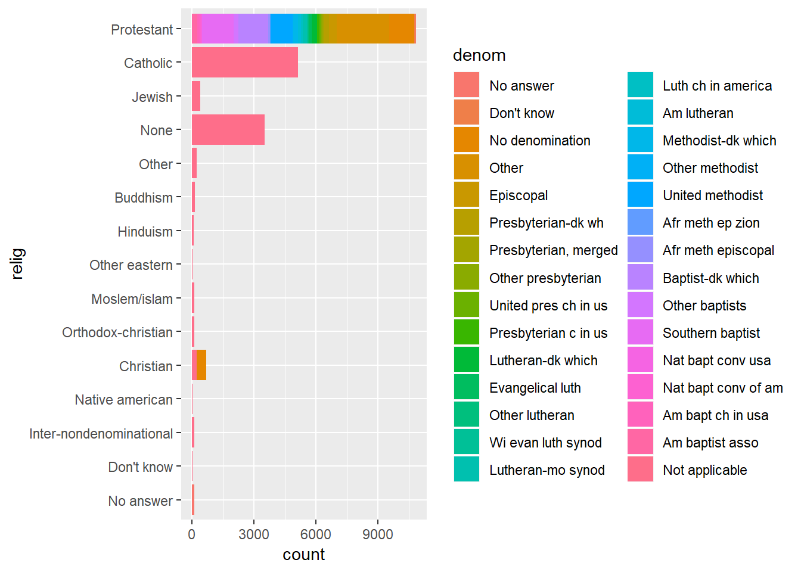
    
    * Notice which have the widest variety of colours -- are protestant, and Christian slightly
    
    *With table:*
    
    ```r
    gss_cat %>% 
      count(relig, denom) %>% 
      count(relig, sort = TRUE)
    ```
    
    ```
    ## # A tibble: 15 x 2
    ##    relig                       n
    ##    <fct>                   <int>
    ##  1 Protestant                 29
    ##  2 Christian                   4
    ##  3 Other                       2
    ##  4 No answer                   1
    ##  5 Don't know                  1
    ##  6 Inter-nondenominational     1
    ##  7 Native american             1
    ##  8 Orthodox-christian          1
    ##  9 Moslem/islam                1
    ## 10 Other eastern               1
    ## 11 Hinduism                    1
    ## 12 Buddhism                    1
    ## 13 None                        1
    ## 14 Jewish                      1
    ## 15 Catholic                    1
    ```
    
	
## 	15.4: Modifying factor order

### 15.4.1
	
1.  There are some suspiciously high numbers in `tvhours`. Is the mean a good
    summary?
    
    
    ```r
    gss_cat %>%
      mutate(tvhours_fct = factor(tvhours)) %>% 
      ggplot(aes(x = tvhours_fct)) +
      geom_bar()
    ```
    
    
   
   * Distribution is reasonably skewed with some values showing-up as 24 hours which seems impossible, in addition to this we have a lot of na values, this may skew results
   * Given high number of missing values, `tvhours` may also just not be reliable, do NA's associate with other variables? -- Perhaps could try and impute these NAs

1.  For each factor in `gss_cat` identify whether the order of the levels is
    arbitrary or principled.
    
    
    ```r
    gss_cat %>% 
      purrr::keep(is.factor) %>% 
      purrr::map(levels)
    ```
    
    ```
    ## $marital
    ## [1] "No answer"     "Never married" "Separated"     "Divorced"     
    ## [5] "Widowed"       "Married"      
    ## 
    ## $race
    ## [1] "Other"          "Black"          "White"          "Not applicable"
    ## 
    ## $rincome
    ##  [1] "No answer"      "Don't know"     "Refused"        "$25000 or more"
    ##  [5] "$20000 - 24999" "$15000 - 19999" "$10000 - 14999" "$8000 to 9999" 
    ##  [9] "$7000 to 7999"  "$6000 to 6999"  "$5000 to 5999"  "$4000 to 4999" 
    ## [13] "$3000 to 3999"  "$1000 to 2999"  "Lt $1000"       "Not applicable"
    ## 
    ## $partyid
    ##  [1] "No answer"          "Don't know"         "Other party"       
    ##  [4] "Strong republican"  "Not str republican" "Ind,near rep"      
    ##  [7] "Independent"        "Ind,near dem"       "Not str democrat"  
    ## [10] "Strong democrat"   
    ## 
    ## $relig
    ##  [1] "No answer"               "Don't know"             
    ##  [3] "Inter-nondenominational" "Native american"        
    ##  [5] "Christian"               "Orthodox-christian"     
    ##  [7] "Moslem/islam"            "Other eastern"          
    ##  [9] "Hinduism"                "Buddhism"               
    ## [11] "Other"                   "None"                   
    ## [13] "Jewish"                  "Catholic"               
    ## [15] "Protestant"              "Not applicable"         
    ## 
    ## $denom
    ##  [1] "No answer"            "Don't know"           "No denomination"     
    ##  [4] "Other"                "Episcopal"            "Presbyterian-dk wh"  
    ##  [7] "Presbyterian, merged" "Other presbyterian"   "United pres ch in us"
    ## [10] "Presbyterian c in us" "Lutheran-dk which"    "Evangelical luth"    
    ## [13] "Other lutheran"       "Wi evan luth synod"   "Lutheran-mo synod"   
    ## [16] "Luth ch in america"   "Am lutheran"          "Methodist-dk which"  
    ## [19] "Other methodist"      "United methodist"     "Afr meth ep zion"    
    ## [22] "Afr meth episcopal"   "Baptist-dk which"     "Other baptists"      
    ## [25] "Southern baptist"     "Nat bapt conv usa"    "Nat bapt conv of am" 
    ## [28] "Am bapt ch in usa"    "Am baptist asso"      "Not applicable"
    ```
    
    * `rincome` is principaled, rest are arbitrary


1.  Why did moving "Not applicable" to the front of the levels move it to the
    bottom of the plot?
    
    * Becuase is moving this factor to be first in order
	
## 	15.5: Modifying factor levels

### 15.5.1

1.  How have the proportions of people identifying as Democrat, Republican, and
    Independent changed over time?

    *As a line plot: * 
    
    ```r
    gss_cat %>%
      mutate(partyid = fct_collapse(
        partyid,
        other = c("No answer", "Don't know", "Other party"),
        rep = c("Strong republican", "Not str republican"),
        ind = c("Ind,near rep", "Independent", "Ind,near dem"),
        dem = c("Not str democrat", "Strong democrat")
      )) %>%
      count(year, partyid) %>%
      group_by(year) %>%
      mutate(prop = n / sum(n)) %>%
      ungroup() %>%
      ggplot(aes(
        x = year,
        y = prop,
        colour = fct_reorder2(partyid, year, prop)
      )) +
      geom_line() +
      labs(colour = "partyid")
    ```
    
    
    
    *As a bar plot: * 
    
    
    ```r
    gss_cat %>%
      mutate(partyid = fct_collapse(
        partyid,
        other = c("No answer", "Don't know", "Other party"),
        rep = c("Strong republican", "Not str republican"),
        ind = c("Ind,near rep", "Independent", "Ind,near dem"),
        dem = c("Not str democrat", "Strong democrat")
      )) %>%
      count(year, partyid) %>%
      group_by(year) %>%
      mutate(prop = n / sum(n)) %>%
      ungroup() %>%
      ggplot(aes(
        x = year,
        y = prop,
        fill = fct_reorder2(partyid, year, prop)
      )) +
      geom_col() +
      labs(colour = "partyid")
    ```
    
    

    * Suggests proportion of republicans has gone down with independents and other going up.

1.  How could you collapse `rincome` into a small set of categories?

    
    ```r
    other = c("No answer", "Don't know", "Refused", "Not applicable")
    high = c("$25000 or more", "$20000 - 24999", "$15000 - 19999", "$10000 - 14999")
    med = c("$8000 to 9999", "$7000 to 7999", "$6000 to 6999", "$5000 to 5999")
    low = c("$4000 to 4999", "$3000 to 3999", "$1000 to 2999", "Lt $1000")
    
    mutate(gss_cat,
           rincome = fct_collapse(
           rincome,
           other = other,
           high = high,
           med = med,
           low = low
           )) %>%
           count(rincome)
    ```
    
    ```
    ## # A tibble: 4 x 2
    ##   rincome     n
    ##   <fct>   <int>
    ## 1 other    8468
    ## 2 high    10862
    ## 3 med       970
    ## 4 low      1183
    ```


# Appendix 

## Viewing all levels

A few ways to get an initial look at the levels or counts across a dataset


```r
gss_cat %>% 
  purrr::map(unique)
```

```
## $year
## [1] 2000 2002 2004 2006 2008 2010 2012 2014
## 
## $marital
## [1] Never married Divorced      Widowed       Married       Separated    
## [6] No answer    
## Levels: No answer Never married Separated Divorced Widowed Married
## 
## $age
##  [1] 26 48 67 39 25 36 44 47 53 52 51 40 77 45 49 19 54 82 83 89 88 72 34
## [24] 55 37 22 33 43 29 57 31 46 65 56 66 20 64 59 23 21 27 78 61 84 69 32
## [47] 76 41 70 75 80 24 50 30 62 60 28 35 38 73 87 58 63 42 85 NA 79 18 71
## [70] 68 74 81 86
## 
## $race
## [1] White Black Other
## Levels: Other Black White Not applicable
## 
## $rincome
##  [1] $8000 to 9999  Not applicable $20000 - 24999 $25000 or more
##  [5] $7000 to 7999  $10000 - 14999 Refused        $15000 - 19999
##  [9] $3000 to 3999  $5000 to 5999  Don't know     $1000 to 2999 
## [13] Lt $1000       No answer      $6000 to 6999  $4000 to 4999 
## 16 Levels: No answer Don't know Refused $25000 or more ... Not applicable
## 
## $partyid
##  [1] Ind,near rep       Not str republican Independent       
##  [4] Not str democrat   Strong democrat    Ind,near dem      
##  [7] Strong republican  Other party        No answer         
## [10] Don't know        
## 10 Levels: No answer Don't know Other party ... Strong democrat
## 
## $relig
##  [1] Protestant              Orthodox-christian     
##  [3] None                    Christian              
##  [5] Jewish                  Catholic               
##  [7] Other                   Inter-nondenominational
##  [9] Hinduism                Native american        
## [11] No answer               Buddhism               
## [13] Moslem/islam            Other eastern          
## [15] Don't know             
## 16 Levels: No answer Don't know ... Not applicable
## 
## $denom
##  [1] Southern baptist     Baptist-dk which     No denomination     
##  [4] Not applicable       Lutheran-mo synod    Other               
##  [7] United methodist     Episcopal            Other lutheran      
## [10] Afr meth ep zion     Am bapt ch in usa    Other methodist     
## [13] Presbyterian c in us Methodist-dk which   Nat bapt conv usa   
## [16] Am lutheran          Nat bapt conv of am  Am baptist asso     
## [19] Evangelical luth     Afr meth episcopal   Lutheran-dk which   
## [22] Luth ch in america   Presbyterian, merged No answer           
## [25] Wi evan luth synod   Other baptists       Other presbyterian  
## [28] United pres ch in us Presbyterian-dk wh   Don't know          
## 30 Levels: No answer Don't know No denomination Other ... Not applicable
## 
## $tvhours
##  [1] 12 NA  2  4  1  3  0  7  5  8 10  6 15 11 24 20 13 14 21  9 16 22 18
## [24] 17 23
```

```r
gss_cat %>% 
  purrr::map(table)
```

```
## $year
## 
## 2000 2002 2004 2006 2008 2010 2012 2014 
## 2817 2765 2812 4510 2023 2044 1974 2538 
## 
## $marital
## 
##     No answer Never married     Separated      Divorced       Widowed 
##            17          5416           743          3383          1807 
##       Married 
##         10117 
## 
## $age
## 
##  18  19  20  21  22  23  24  25  26  27  28  29  30  31  32  33  34  35 
##  91 249 251 278 298 361 344 396 400 385 387 376 433 407 445 425 425 417 
##  36  37  38  39  40  41  42  43  44  45  46  47  48  49  50  51  52  53 
## 428 438 426 415 452 434 405 448 432 404 422 435 424 417 430 390 400 396 
##  54  55  56  57  58  59  60  61  62  63  64  65  66  67  68  69  70  71 
## 387 365 384 321 326 323 338 307 310 292 253 259 231 271 205 201 213 206 
##  72  73  74  75  76  77  78  79  80  81  82  83  84  85  86  87  88  89 
## 189 152 180 179 171 137 150 135 127 119 105  99 100  75  74  54  57 148 
## 
## $race
## 
##          Other          Black          White Not applicable 
##           1959           3129          16395              0 
## 
## $rincome
## 
##      No answer     Don't know        Refused $25000 or more $20000 - 24999 
##            183            267            975           7363           1283 
## $15000 - 19999 $10000 - 14999  $8000 to 9999  $7000 to 7999  $6000 to 6999 
##           1048           1168            340            188            215 
##  $5000 to 5999  $4000 to 4999  $3000 to 3999  $1000 to 2999       Lt $1000 
##            227            226            276            395            286 
## Not applicable 
##           7043 
## 
## $partyid
## 
##          No answer         Don't know        Other party 
##                154                  1                393 
##  Strong republican Not str republican       Ind,near rep 
##               2314               3032               1791 
##        Independent       Ind,near dem   Not str democrat 
##               4119               2499               3690 
##    Strong democrat 
##               3490 
## 
## $relig
## 
##               No answer              Don't know Inter-nondenominational 
##                      93                      15                     109 
##         Native american               Christian      Orthodox-christian 
##                      23                     689                      95 
##            Moslem/islam           Other eastern                Hinduism 
##                     104                      32                      71 
##                Buddhism                   Other                    None 
##                     147                     224                    3523 
##                  Jewish                Catholic              Protestant 
##                     388                    5124                   10846 
##          Not applicable 
##                       0 
## 
## $denom
## 
##            No answer           Don't know      No denomination 
##                  117                   52                 1683 
##                Other            Episcopal   Presbyterian-dk wh 
##                 2534                  397                  244 
## Presbyterian, merged   Other presbyterian United pres ch in us 
##                   67                   47                  110 
## Presbyterian c in us    Lutheran-dk which     Evangelical luth 
##                  104                  267                  122 
##       Other lutheran   Wi evan luth synod    Lutheran-mo synod 
##                   30                   71                  212 
##   Luth ch in america          Am lutheran   Methodist-dk which 
##                   71                  146                  239 
##      Other methodist     United methodist     Afr meth ep zion 
##                   33                 1067                   32 
##   Afr meth episcopal     Baptist-dk which       Other baptists 
##                   77                 1457                  213 
##     Southern baptist    Nat bapt conv usa  Nat bapt conv of am 
##                 1536                   40                   76 
##    Am bapt ch in usa      Am baptist asso       Not applicable 
##                  130                  237                10072 
## 
## $tvhours
## 
##    0    1    2    3    4    5    6    7    8    9   10   11   12   13   14 
##  675 2345 3040 1959 1408  695  478  119  262   19  122    9   96    9   24 
##   15   16   17   18   20   21   22   23   24 
##   17   10    2    7   14    2    2    1   22
```

```r
gss_cat %>% 
  purrr::map(table) %>% 
  purrr::map(plot)
```

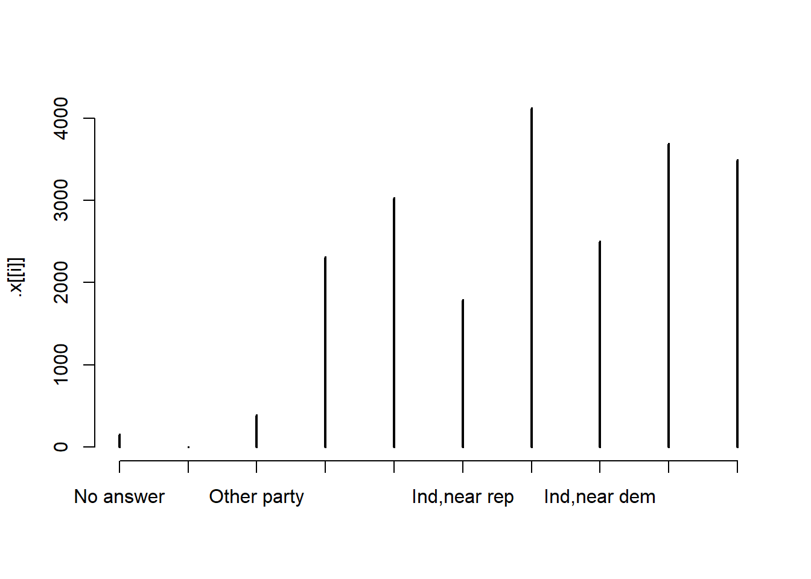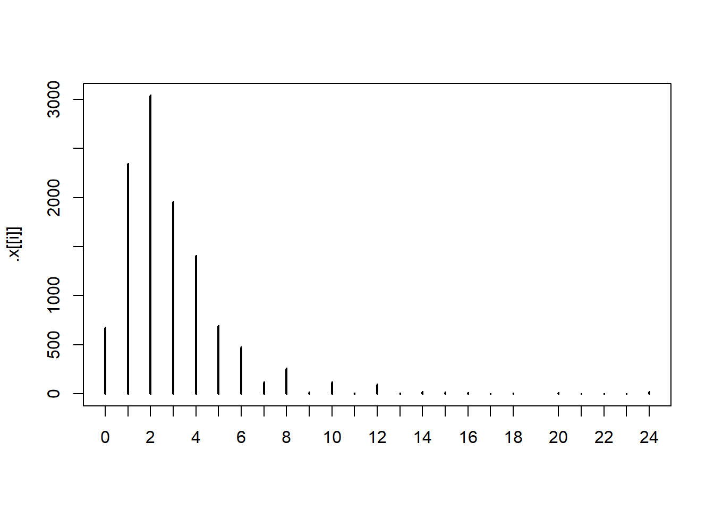

```
## $year
## [1] 2000 2002 2004 2006 2008 2010 2012 2014
## 
## $marital
## [1] 1 2 3 4 5 6
## 
## $age
##  [1] 18 19 20 21 22 23 24 25 26 27 28 29 30 31 32 33 34 35 36 37 38 39 40
## [24] 41 42 43 44 45 46 47 48 49 50 51 52 53 54 55 56 57 58 59 60 61 62 63
## [47] 64 65 66 67 68 69 70 71 72 73 74 75 76 77 78 79 80 81 82 83 84 85 86
## [70] 87 88 89
## 
## $race
## [1] 1 2 3 4
## 
## $rincome
##  [1]  1  2  3  4  5  6  7  8  9 10 11 12 13 14 15 16
## 
## $partyid
##  [1]  1  2  3  4  5  6  7  8  9 10
## 
## $relig
##  [1]  1  2  3  4  5  6  7  8  9 10 11 12 13 14 15 16
## 
## $denom
##  [1]  1  2  3  4  5  6  7  8  9 10 11 12 13 14 15 16 17 18 19 20 21 22 23
## [24] 24 25 26 27 28 29 30
## 
## $tvhours
##  [1]  0  1  2  3  4  5  6  7  8  9 10 11 12 13 14 15 16 17 18 20 21 22 23
## [24] 24
```

## Percentage NA each level


```r
gss_cat %>% 
  purrr::map(~(sum(is.na(.x)) / length(.x)))
```

```
## $year
## [1] 0
## 
## $marital
## [1] 0
## 
## $age
## [1] 0.003537681
## 
## $race
## [1] 0
## 
## $rincome
## [1] 0
## 
## $partyid
## [1] 0
## 
## $relig
## [1] 0
## 
## $denom
## [1] 0
## 
## $tvhours
## [1] 0.4722804
```

## Print all levels of tibble


```r
gss_cat %>% 
  count(tvhours) %>% 
  print(n = Inf)
```

```
## # A tibble: 25 x 2
##    tvhours     n
##      <int> <int>
##  1       0   675
##  2       1  2345
##  3       2  3040
##  4       3  1959
##  5       4  1408
##  6       5   695
##  7       6   478
##  8       7   119
##  9       8   262
## 10       9    19
## 11      10   122
## 12      11     9
## 13      12    96
## 14      13     9
## 15      14    24
## 16      15    17
## 17      16    10
## 18      17     2
## 19      18     7
## 20      20    14
## 21      21     2
## 22      22     2
## 23      23     1
## 24      24    22
## 25      NA 10146
```


<!--chapter:end:15-factors.Rmd-->

*Make sure the following packages are installed:*  


# ch. 16: Dates and times

* `today` get current date
* `now` get current date-time
* `ymd_hms` one example of straight-forward set-of of functions that take either strings or unquoted numbers and output dates or date-times
* `make_datetime` create date-time from individual components, e.g. make_datetime(year, month, day, hour, minute)
* `as_date_time` and `as_date` let you switch between date-time and dates, e.g. `as_datetime(today())` or `as_date(now())`
* Accessor functions let you pull out components from an existing date-time:
    + `year`, `month`, `mday`, `yday`, `wday`, `hour`, `minute`, `second`
        + `month` and `wday` have `label = TRUE` to pull the abbreviated name rather than the number, and pull full name with `abbr = FALSE`
    + You can also use these to set particular components `year(datetime) <- 2020`
* `update` allows you to specify multiple values at one time, e.g. `update(datetime, year = 2020, month = 2, mday = 2, hour = 2)`
    + When values are too big they roll-over e.g. `update(ymd("2015-02-01"), mday = 30)` will become '2015-03-02'
* Rounding functions to nearest unit of time
    + `floor_date`, `round_date`, `ceiling_date`
* `as.duration` convert diff-time to a duration
* Durations (can add and multiply):
    + `dseconds`, `dhours`, `ddays`, `dweeks`, `dyears`
* Periods (can add and multiply), more likely to do what you expect than duration:
    + `seconds`, `minutes`, `hours`, `days`, `weeks`, `months`
* Interval is a duration with a starting point, making it precise and possible to determine EXACT length
    + e.g. `(today() %--% next_year) / ddays(1)` to find exact duration
* `Sys.timezone` to see what R thinks your current time zone is
* `tz = ` arg in `ymd_hms` let's you change printing behavior (not underlying value, as assumes UTC unless changed)
* `with_tz` allows you to print an existing date-time object to a specific other timezone
* `force_tz` when have an object that's been labeled with wrong time-zone and need to fix it

## 16.2: Creating date/times

Note that 1 in date-times is treated as 1 - second in numeric contexts, so example below sets `binwidth = 86400` to specify 1 day


```r
make_datetime_100 <- function(year, month, day, time) {
  make_datetime(year, month, day, time %/% 100, time %% 100)
}

flights_dt <- flights %>% 
  filter(!is.na(dep_time), !is.na(arr_time)) %>% 
  mutate_at(c("dep_time", "arr_time", "sched_dep_time", "sched_arr_time"), funs(make_datetime_100(year, month, day, .))) %>% 
  select(origin, dest, ends_with("delay"), ends_with("time"))
```

```
## Warning: funs() is soft deprecated as of dplyr 0.8.0
## please use list() instead
## 
## # Before:
## funs(name = f(.)
## 
## # After: 
## list(name = ~f(.))
## This warning is displayed once per session.
```

```r
flights_dt %>% 
  ggplot(aes(dep_time)) + 
  geom_freqpoly(binwidth = 86400)
```


### 16.2.4

1.  What happens if you parse a string that contains invalid dates?

    
    ```r
    ymd(c("2010-10-10", "bananas"))
    ```
    
    ```
    ## Warning: 1 failed to parse.
    ```
    
    ```
    ## [1] "2010-10-10" NA
    ```

    * Outputs an NA and sends warning of number that failed to parse

1.  What does the `tzone` argument to `today()` do? Why is it important?

    * Let's you specify timezones, may be different days depending on location
    
    
    ```r
    today(tzone = "MST")
    ```
    
    ```
    ## [1] "2019-05-12"
    ```
    
    ```r
    now(tzone = "MST")
    ```
    
    ```
    ## [1] "2019-05-12 17:49:56 MST"
    ```
    

1.  Use the appropriate lubridate function to parse each of the following dates:

    
    ```r
    d1 <- "January 1, 2010"
    d2 <- "2015-Mar-07"
    d3 <- "06-Jun-2017"
    d4 <- c("August 19 (2015)", "July 1 (2015)")
    d5 <- "12/30/14" # Dec 30, 2014
    ```

    
    ```r
    mdy(d1)
    ```
    
    ```
    ## [1] "2010-01-01"
    ```
    
    ```r
    ymd(d2)
    ```
    
    ```
    ## [1] "2015-03-07"
    ```
    
    ```r
    dmy(d3)
    ```
    
    ```
    ## [1] "2017-06-06"
    ```
    
    ```r
    mdy(d4)
    ```
    
    ```
    ## [1] "2015-08-19" "2015-07-01"
    ```
    
    ```r
    mdy(d5)
    ```
    
    ```
    ## [1] "2014-12-30"
    ```

	
## 16.3: Date-time components

This allows you to plot the number of flights per week


```r
flights_dt %>% 
  count(week = floor_date(dep_time, "week")) %>% 
  ggplot(aes(week, n)) +
    geom_line()
```

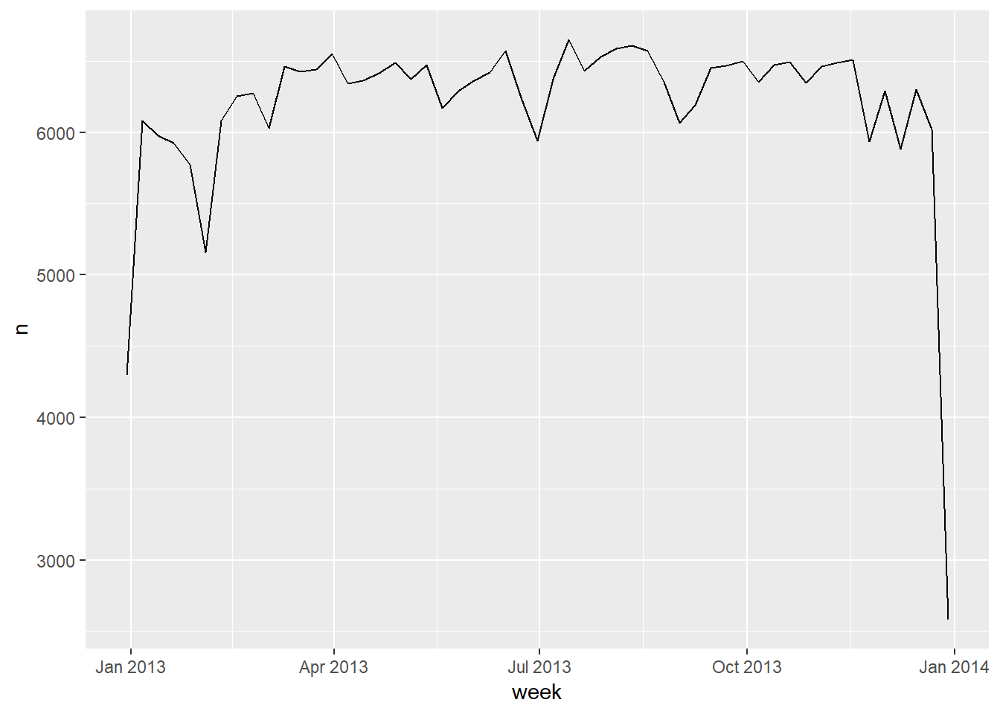


### 16.3.4

1.  How does the distribution of flight times within a day change over the 
    course of the year?
    
    *Median flight time by day*
    
    ```r
    flights_dt %>%
      transmute(quarter_dep = quarter(dep_time) %>% factor(),
                day_dep = as_date(dep_time),
                dep_time = as.hms(dep_time)) %>% 
      group_by(quarter_dep, day_dep) %>% 
      summarise(day_median = median(dep_time)) %>% 
      ungroup() %>% 
      ggplot(aes(x = day_dep, y = day_median)) +
      geom_line(aes(colour = quarter_dep, group = 1)) +
      labs(title = "Median flight times by day, coloured by quarter", subtitle = "Typical flight times change with daylight savings times")+
      geom_vline(xintercept = ymd("20130310"), linetype = 2)+
      geom_vline(xintercept = ymd("20131103"), linetype = 2)
    ```
    
    
    
    * First couple and last couple months tend to have slightly earlier start times
    
    *Quantiles of flight times by month*
    
    ```r
    flights_dt %>%
      transmute(month_dep = month(dep_time, label = TRUE),
                quarter_dep = quarter(dep_time) %>% factor(),
                wk_dep = week(dep_time),
                dep_time = as.hms(dep_time)) %>% 
      group_by(month_dep, wk_dep) %>% 
      ungroup() %>% 
      ggplot(aes(x = month_dep, y = dep_time, group = month_dep)) +
      geom_boxplot()
    ```
    
    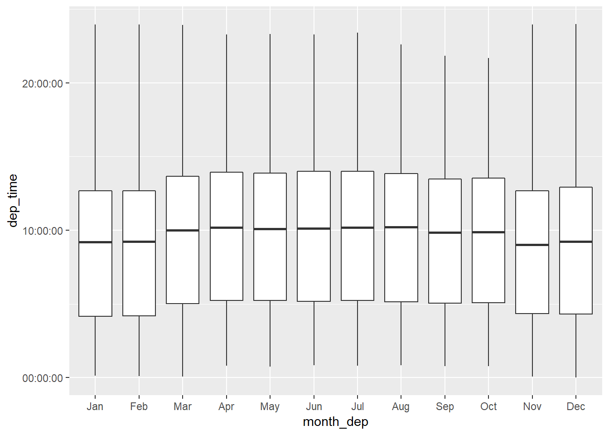
    
    * Reinforces prior plot, shows that first couple and last couple months of year tend to have slightly higher proportion of flights earlier in day
    
    *Weekly flight proportions by 4 hour blocks*
    
    ```r
    flights_dt %>%
      transmute(month_dep = month(dep_time, label = TRUE),
                wk_dep = week(dep_time),
                dep_time_4hrs = floor_date(dep_time, "4 hours"),
                hour_dep_4hrs = hour(dep_time_4hrs) %>% factor) %>% 
      count(wk_dep, hour_dep_4hrs) %>%
      group_by(wk_dep) %>% 
      mutate(wk_tot = sum(n), 
             wk_prop = round(n / wk_tot, 3)) %>% 
      ungroup() %>% 
      ggplot(aes(x = wk_dep, y = wk_prop)) +
      geom_col(aes(fill = hour_dep_4hrs))
    ```
    
    
    
    * Last week of the year have a lower proportion of late flights, and a higher proportion of morning flights

    See [16.3.4.1] for a few other plots I looked at.
    
1.  Compare `dep_time`, `sched_dep_time` and `dep_delay`. Are they consistent?
    Explain your findings.

    
    ```r
    flights_dt %>%
      mutate(dep_delay_check = (dep_time - sched_dep_time) / dminutes(1),
             same = dep_delay == dep_delay_check,
             difference = dep_delay_check - dep_delay) %>%
      filter(abs(difference) > 0)
    ```
    
    ```
    ## # A tibble: 1,205 x 12
    ##    origin dest  dep_delay arr_delay dep_time            sched_dep_time     
    ##    <chr>  <chr>     <dbl>     <dbl> <dttm>              <dttm>             
    ##  1 JFK    BWI         853       851 2013-01-01 08:48:00 2013-01-01 18:35:00
    ##  2 JFK    SJU          43        36 2013-01-02 00:42:00 2013-01-02 23:59:00
    ##  3 JFK    SYR         156       154 2013-01-02 01:26:00 2013-01-02 22:50:00
    ##  4 JFK    SJU          33        22 2013-01-03 00:32:00 2013-01-03 23:59:00
    ##  5 JFK    BUF         185       172 2013-01-03 00:50:00 2013-01-03 21:45:00
    ##  6 JFK    BQN         156       143 2013-01-03 02:35:00 2013-01-03 23:59:00
    ##  7 JFK    SJU          26        23 2013-01-04 00:25:00 2013-01-04 23:59:00
    ##  8 JFK    PWM         141       125 2013-01-04 01:06:00 2013-01-04 22:45:00
    ##  9 JFK    PSE          15        18 2013-01-05 00:14:00 2013-01-05 23:59:00
    ## 10 JFK    FLL         127       130 2013-01-05 00:37:00 2013-01-05 22:30:00
    ## # ... with 1,195 more rows, and 6 more variables: arr_time <dttm>,
    ## #   sched_arr_time <dttm>, air_time <dbl>, dep_delay_check <dbl>,
    ## #   same <lgl>, difference <dbl>
    ```
    
    * They are except in the case when it goes over a day, the day is not pushed forward so it counts it as being 24 hours off

1.  Compare `air_time` with the duration between the departure and arrival.
    Explain your findings. (Hint: consider the location of the airport.)
    
    
    ```r
    flights_dt %>% 
      mutate(air_time_check = (arr_time - dep_time) / dminutes(1)) %>%
      select(air_time_check, air_time, dep_time, arr_time, everything())
    ```
    
    ```
    ## # A tibble: 328,063 x 10
    ##    air_time_check air_time dep_time            arr_time            origin
    ##             <dbl>    <dbl> <dttm>              <dttm>              <chr> 
    ##  1            193      227 2013-01-01 05:17:00 2013-01-01 08:30:00 EWR   
    ##  2            197      227 2013-01-01 05:33:00 2013-01-01 08:50:00 LGA   
    ##  3            221      160 2013-01-01 05:42:00 2013-01-01 09:23:00 JFK   
    ##  4            260      183 2013-01-01 05:44:00 2013-01-01 10:04:00 JFK   
    ##  5            138      116 2013-01-01 05:54:00 2013-01-01 08:12:00 LGA   
    ##  6            106      150 2013-01-01 05:54:00 2013-01-01 07:40:00 EWR   
    ##  7            198      158 2013-01-01 05:55:00 2013-01-01 09:13:00 EWR   
    ##  8             72       53 2013-01-01 05:57:00 2013-01-01 07:09:00 LGA   
    ##  9            161      140 2013-01-01 05:57:00 2013-01-01 08:38:00 JFK   
    ## 10            115      138 2013-01-01 05:58:00 2013-01-01 07:53:00 LGA   
    ## # ... with 328,053 more rows, and 5 more variables: dest <chr>,
    ## #   dep_delay <dbl>, arr_delay <dbl>, sched_dep_time <dttm>,
    ## #   sched_arr_time <dttm>
    ```
    
    * Initial check is off, so need to take into account the time-zone and difference from NYC, so join timezone document
    
    
    ```r
    flights_dt %>% 
      left_join(select(nycflights13::airports, dest = faa, tz), by = "dest") %>% 
      mutate(arr_time_new = arr_time - dhours(tz + 5)) %>% 
      mutate(air_time_tz = (arr_time_new - dep_time) / dminutes(1),
             diff_Airtime = air_time_tz - air_time) %>% 
      select( origin, dest, tz, contains("time"), -(contains("sched")))
    ```
    
    ```
    ## # A tibble: 328,063 x 9
    ##    origin dest     tz dep_time            arr_time            air_time
    ##    <chr>  <chr> <dbl> <dttm>              <dttm>                 <dbl>
    ##  1 EWR    IAH      -6 2013-01-01 05:17:00 2013-01-01 08:30:00      227
    ##  2 LGA    IAH      -6 2013-01-01 05:33:00 2013-01-01 08:50:00      227
    ##  3 JFK    MIA      -5 2013-01-01 05:42:00 2013-01-01 09:23:00      160
    ##  4 JFK    BQN      NA 2013-01-01 05:44:00 2013-01-01 10:04:00      183
    ##  5 LGA    ATL      -5 2013-01-01 05:54:00 2013-01-01 08:12:00      116
    ##  6 EWR    ORD      -6 2013-01-01 05:54:00 2013-01-01 07:40:00      150
    ##  7 EWR    FLL      -5 2013-01-01 05:55:00 2013-01-01 09:13:00      158
    ##  8 LGA    IAD      -5 2013-01-01 05:57:00 2013-01-01 07:09:00       53
    ##  9 JFK    MCO      -5 2013-01-01 05:57:00 2013-01-01 08:38:00      140
    ## 10 LGA    ORD      -6 2013-01-01 05:58:00 2013-01-01 07:53:00      138
    ## # ... with 328,053 more rows, and 3 more variables: arr_time_new <dttm>,
    ## #   air_time_tz <dbl>, diff_Airtime <dbl>
    ```
    
    * Is closer but still off. In chapter 5, problem 5.5.2.1 I go further into this
    * In [Appendix] section [16.3.4.3] filter to NAs
    
1.  How does the average delay time change over the course of a day?
    Should you use `dep_time` or `sched_dep_time`? Why?
    
    
    ```r
    flights_dt %>% 
      mutate(sched_dep_time = as.hms(floor_date(sched_dep_time, "30 mins"))) %>%
      group_by(sched_dep_time) %>%
      summarise(delay_mean = mean(arr_delay, na.rm = TRUE), 
                n = n(),
                n_na = sum(is.na(arr_delay)) / n,
                delay_median = median(arr_delay, na.rm = TRUE)) %>% 
      ggplot(aes(x = sched_dep_time, y = delay_mean, size = n)) +
      geom_point()
    ```
    
    
      
    * It goes-up throughout the day
    * Use `sched_dep_time` because it has the correct day

1.  On what day of the week should you leave if you want to minimise the
    chance of a delay?

    
    ```r
    flights_dt %>%
      mutate(weekday = wday(sched_dep_time, label = TRUE)) %>%
      group_by(weekday) %>%
      summarise(prop_delay = sum(dep_delay > 0) / n())
    ```
    
    ```
    ## # A tibble: 7 x 2
    ##   weekday prop_delay
    ##   <ord>        <dbl>
    ## 1 Sun          0.383
    ## 2 Mon          0.401
    ## 3 Tue          0.364
    ## 4 Wed          0.372
    ## 5 Thu          0.431
    ## 6 Fri          0.425
    ## 7 Sat          0.348
    ```
    
    * wknd has a slightly lower proportion of flights delayed (Thursday has the worst)

1.  What makes the distribution of `diamonds$carat` and 
    `flights$sched_dep_time` similar?
    
    
    ```r
    ggplot(diamonds, aes(x = carat)) +
      geom_histogram(bins = 500)+
      labs(title = "Distribution of carat in diamonds dataset")
    ```
    
    
    
    ```r
    ggplot(flights, aes(x = as.hms(sched_dep_time))) +
      geom_histogram(bins = 24*6)+
      labs(title = "Distribution of scheduled departure times in flights dataset")
    ```
    
    
    
    * Both have gaps and peaks at 'attractive' values

1.  Confirm my hypothesis that the early departures of flights in minutes
    20-30 and 50-60 are caused by scheduled flights that leave early. 
    Hint: create a binary variable that tells you whether or not a flight 
    was delayed.
    
    
    ```r
    mutate(flights_dt,
           mins_dep = minute(dep_time),
           mins_sched = minute(sched_dep_time),
           delayed = dep_delay > 0) %>%
      group_by(mins_dep) %>%
      summarise(prop_delayed = sum(delayed) / n()) %>%
      ggplot(aes(x = mins_dep, y = prop_delayed)) +
      geom_line()
    ```
    
    
    
    * Consistent with above hypothesis
    
    
	
## 16.4: Time spans

* **durations**, which represent an exact number of seconds.
* **periods**, which represent human units like weeks and months.
* **intervals**, which represent a starting and ending point.


Periods example, using durations to fix oddity of problem when flight arrives overnight

```r
flights_dt <- flights_dt %>% 
  mutate(
    overnight = arr_time < dep_time,
    arr_time = arr_time + days(overnight * 1),
    sched_arr_time = sched_arr_time + days(overnight * 1)
  )
```

Intervals example to get precise number of days dependent on specific time

```r
next_year <- today() + years(1)
(today() %--% next_year) / ddays(1)
```

```
## [1] 366
```

To find out how many periods fall in an interval, need to use integer division

```r
(today() %--% next_year) %/% days(1)
```

```
## Note: method with signature 'Timespan#Timespan' chosen for function '%/%',
##  target signature 'Interval#Period'.
##  "Interval#ANY", "ANY#Period" would also be valid
```

```
## [1] 366
```


### 16.4.5

1.  Why is there `months()` but no `dmonths()`?

    * the duration varies from month to month

1.  Explain `days(overnight * 1)` to someone who has just started 
    learning R. How does it work?
    
    * this used in the example above makes it such that if `overnight` is TRUE, it will return the same time period but one day ahead, if false, does not change (as is adding 0 days)

1.  a. Create a vector of dates giving the first day of every month in 2015.

    
    ```r
    x <- ymd("2015-01-01")
    mons <- c(0:11)
    (x + months(mons)) %>% wday(label = TRUE)
    ```
    
    ```
    ##  [1] Thu Sun Sun Wed Fri Mon Wed Sat Tue Thu Sun Tue
    ## Levels: Sun < Mon < Tue < Wed < Thu < Fri < Sat
    ```

    b. Create a vector of dates giving the first day of every month
    in the _current_ year.
    
    
    ```r
    x <- today() %>% update(month = 1, mday = 1)
    mons <- c(0:11)
    (x + months(mons)) %>% wday(label=TRUE)
    ```
    
    ```
    ##  [1] Tue Fri Fri Mon Wed Sat Mon Thu Sun Tue Fri Sun
    ## Levels: Sun < Mon < Tue < Wed < Thu < Fri < Sat
    ```
    

1.  Write a function that given your birthday (as a date), returns 
    how old you are in years.

    
    ```r
    birthday_age <- function(birthday) {
      (ymd(birthday) %--% today()) %/% years(1)
    }
    birthday_age("1989-09-07")
    ```
    
    ```
    ## [1] 29
    ```


1.  Why can't `(today() %--% (today() + years(1)) / months(1)` work?
    * Can't add and subtract intervals

# Appendix

## 16.3.4.1

*Weekly median fight time*

```r
flights_dt %>%
  transmute(quarter_dep = quarter(dep_time) %>% factor(),
            day_dep = as_date(dep_time),
            wk_dep = floor_date(dep_time, "1 week") %>% as_date,
            dep_time = as.hms(dep_time)) %>% 
  group_by(quarter_dep, wk_dep) %>% 
  summarise(wk_median = median(dep_time)) %>% 
  ungroup() %>% 
  mutate(wk_median = as.hms(wk_median)) %>% 
  ggplot(aes(x = wk_dep, y = wk_median)) +
  geom_line(aes(colour = quarter_dep, group = 1)) 
```


*Proportion of flights in each hour, by quarter* 

```r
flights_dt %>%
  transmute(quarter_dep = quarter(dep_time) %>% factor(),
            hour_dep = hour(dep_time)) %>% 
  count(quarter_dep, hour_dep) %>%
  group_by(quarter_dep) %>% 
  mutate(quarter_tot = sum(n), 
         quarter_prop = round(n / quarter_tot, 3)) %>% 
  ungroup() %>% 
    ggplot(aes(x = hour_dep, y = quarter_prop)) +
    geom_line(aes(colour = quarter_dep))
```


* Q1 seems to be a little more extreme at the local maximas

*Look at proportion of flights by hour faceted by each month*

```r
flights_dt %>%
  transmute(month_dep = month(dep_time, label = TRUE),
            hour_dep = hour(dep_time)) %>% 
  count(month_dep, hour_dep) %>%
  group_by(month_dep) %>% 
  mutate(month_tot = sum(n), 
         month_prop = round(n / month_tot, 3)) %>% 
  ungroup() %>% 
  ggplot(aes(x = hour_dep, y = month_prop)) +
  geom_line() +
  facet_wrap( ~ month_dep)
```


## 16.3.4.3

* Perhaps these are flights where landed in different location...

```r
flights_dt %>% 
  mutate(arr_delay_test = (arr_time - sched_arr_time) / dminutes(1)) %>% 
  select( origin, dest, dep_delay, arr_delay, arr_delay_test, contains("time")) %>% 
  filter(is.na(arr_delay))
```

```
## # A tibble: 717 x 10
##    origin dest  dep_delay arr_delay arr_delay_test dep_time           
##    <chr>  <chr>     <dbl>     <dbl>          <dbl> <dttm>             
##  1 LGA    XNA          -5        NA             89 2013-01-01 15:25:00
##  2 EWR    STL          29        NA            195 2013-01-01 15:28:00
##  3 LGA    XNA          -5        NA             98 2013-01-01 17:40:00
##  4 EWR    SAN          29        NA            108 2013-01-01 18:07:00
##  5 JFK    DFW          59        NA          -1282 2013-01-01 19:39:00
##  6 EWR    TUL          22        NA            111 2013-01-01 19:52:00
##  7 EWR    XNA          43        NA            148 2013-01-02 09:05:00
##  8 LGA    GRR         120        NA            179 2013-01-02 11:25:00
##  9 JFK    DFW           8        NA            102 2013-01-02 18:48:00
## 10 EWR    MCI          85        NA            177 2013-01-02 18:49:00
## # ... with 707 more rows, and 4 more variables: sched_dep_time <dttm>,
## #   arr_time <dttm>, sched_arr_time <dttm>, air_time <dbl>
```

## 16.3.4.4

*Below started looking at proportions...

```r
mutate(flights_dt,
       dep_old = dep_time,
       sched_old = sched_dep_time,
       dep_time = floor_date(dep_time, "5 minutes"),
       sched_dep_time = floor_date(sched_dep_time, "5 minutes"),
       mins_dep = minute(dep_time),
       mins_sched = minute(sched_dep_time),
       delayed = dep_delay > 0) %>%
  group_by(mins_dep, mins_sched) %>%
  summarise(num_delayed = sum(delayed),
            num = n(),
            prop_delayed = num_delayed / num) %>% 
  group_by(mins_dep) %>% 
  mutate(num_tot = sum(num),
         prop_sched = num / num_tot,
         sched_dep_diff = mins_dep - mins_sched) %>% 
  ungroup() %>% 
  ggplot(aes(x = mins_dep, y = prop_sched, fill = factor(mins_sched))) +
  geom_col()+
  labs(title = "Proportion of early flights by minute scheduled v. minute departed")
```


```r
  mutate(flights_dt,
       dep_old = dep_time,
       sched_old = sched_dep_time,
       # dep_time = floor_date(dep_time, "5 minutes"),
       # sched_dep_time = floor_date(sched_dep_time, "5 minutes"),
       mins_dep = minute(dep_time),
       mins_sched = minute(sched_dep_time),
       early_less10 = dep_delay >= -10) %>%
  filter(dep_delay < 0) %>% 
  group_by(mins_dep) %>%
  summarise(num = n(),
            sum_recent10 = sum(early_less10),
            prop_recent10 = sum_recent10 / num) %>% 
  ungroup() %>% 
  ggplot(aes(x = mins_dep, y = prop_recent10)) +
  geom_line()+
  labs(title = "proportion of early flights that were scheduled to leave within 10 mins of when they did")
```


<!--chapter:end:16-dates-and-times.Rmd-->


```r
knitr::opts_chunk$set(echo = TRUE, cache = TRUE, message = FALSE)
```

*Make sure the following packages are installed:*  

```r
library(ggplot2)
library(dplyr)
library(forcats)
library(tidyr)
library(lubridate)
library(stringr)
```


# ch. 18: Pipes (notes only)

* `pryr::object_size` gives the memory occupied by all of its arguments (note that built-in object.size does not allow measuring multiple objects so can't see shared space). This function is actually shown in chapter 18: Pipes
* Some functions do not work naturally with the pipe.
    + If you want to use `assign` with the pipe, you must be explicit about the environment


```r
env <- environment()
"x" %>% assign(100, envir = env)
x
```

```
## [1] 100
```

* `try`, `tryCatch`, `suppressMessages`, and `suppressWarnings` from base R all also do not work well

Other pipes = 'T pipe', `%T>%` that returns left-hand side rather than right.  Will let the plot output, but then continues.  Notice that this doesn't work for ggplot as ggplot does output something


```r
library(magrittr)
rnorm(100) %>%
  matrix(ncol = 2) %T>%
  plot() %>% 
  str()
```

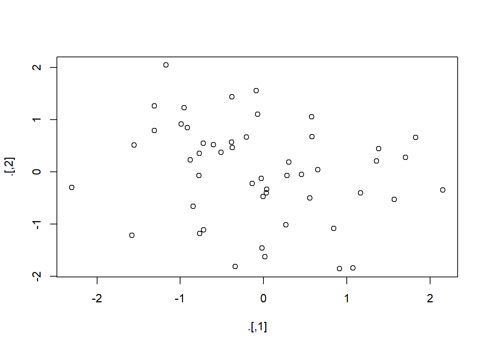

```
##  num [1:50, 1:2] 0.282 -0.775 -0.955 2.151 -0.208 ...
```

```r
iris %>% 
  select(Sepal.Length, Sepal.Width) %T>%  
  plot() %>% 
  select(Sepal.Length) %>% 
  head(10)
```


```
##    Sepal.Length
## 1           5.1
## 2           4.9
## 3           4.7
## 4           4.6
## 5           5.0
## 6           5.4
## 7           4.6
## 8           5.0
## 9           4.4
## 10          4.9
```

* `%$%` allows you to blow out the names of the arguments, I personally prefer using the `with` function for this instead as I find it to be a little more readable...
  + The two examples below are equivalent

```r
mtcars %$%
  cor(disp, mpg)
```

```
## [1] -0.8475514
```

```r
mtcars %>%
  with(cor(disp, mpg))
```

```
## [1] -0.8475514
```


<!--chapter:end:18-pipes.Rmd-->


```r
knitr::opts_chunk$set(echo = TRUE, cache = TRUE, message = FALSE)
```

*Make sure the following packages are installed:*  

```r
library(nycflights13)
library(ggplot2)
library(dplyr)
library(forcats)
library(tidyr)
library(lubridate)
library(stringr)
library(e1071)
```

# ch. 19: Functions

* `function_name <- function(input1, input2) {}`
* `if () {}`
* `else if () {}`
* `else {}`
* `||` (or) , `&&` (and) -- used to combine multiple logical expressions
* `|` and `&` are vectorized operations not to be used with `if` statements
* `any` checks if any values in vector are `TRUE`
* `all` checks if all values in vector are `TRUE`
* `identical` strict check for if values are the same
* `dplyr::near` for more lenient comparison and typically better than `identical` as unaffected by floating point numbers and fine with different types
* `switch` evaluate selected code based on position or name (good for replacing long chain of `if` statements). e.g. 


```r
Operation_Times2 <- function(x, y, op){
   first_op <- switch(op,
     plus = x + y,
     minus = x - y,
     times = x * y,
     divide = x / y,
     stop("Unknown op!")
   )
   
   first_op * 2
  }

Operation_Times2(5, 7, "plus")
```

```
## [1] 24
```

* `stop` stops expression and executes error action, note that `.call` default is `FALSE`
* `warning` generates a warning that corresponds with arguments, `suppressWarnings` may also be useful to no
* `stopifnot` test multiple args and will produce error message if any are not true -- compromise that prevents you from tedious work of putting multiple `if(){} else stop()` statements
* `...` useful catch-all if your function primarily wraps another function (note that misspelled arguments will not raise an error), e.g. 


```r
commas <- function(...) stringr::str_c(..., collapse = ", ")
commas(letters[1:10])
```

```
## [1] "a, b, c, d, e, f, g, h, i, j"
```

* `cut` can be used to discretize continuous variables (also saves long `if` statements)
* `return` allows you to return the function early, typically reserve use for when the function can return early with a simpler function
* `cat` function to print label in output
* `invisible` input does not get printed out

## 19.2: When should you write a function?

### 19.2.1

1.  Why is `TRUE` not a parameter to `rescale01()`? What would happen if
    `x` contained a single missing value, and `na.rm` was `FALSE`?
    
    * `TRUE` doesn't change between uses.
    * The output would be `NA`

1.  In the second variant of `rescale01()`, infinite values are left
    unchanged. Rewrite `rescale01()` so that `-Inf` is mapped to 0, and 
    `Inf` is mapped to 1.

    
    ```r
    rescale01_inf <- function(x){
      
      rng <- range(x, na.rm = TRUE, finite = TRUE)
      x_scaled <- (x - rng[1]) / (rng[2] - rng[1])
      is_inf <- is.infinite(x)
      is_less0 <- x < 0
      x_scaled[is_inf & is_less0] <- 0
      x_scaled[is_inf & (!is_less0)] <- 1
      x_scaled
    }
    
    x <-  c(Inf, -Inf, 0, 3, -5)
    rescale01_inf(x)
    ```
    
    ```
    ## [1] 1.000 0.000 0.625 1.000 0.000
    ```
    
1.  Practice turning the following code snippets into functions. Think about 
    what each function does. What would you call it? How many arguments does it
    need? Can you rewrite it to be more expressive or less duplicative?

    
    ```r
    mean(is.na(x))
    
    x / sum(x, na.rm = TRUE)
    
    sd(x, na.rm = TRUE) / mean(x, na.rm = TRUE)
    ```

    * See solutions below:
    
    ```r
    x <- c(1, 4, 2, 0, NA, 3, NA)
    
    #mean(is.na(x))
    perc_na <- function(x) {
      is.na(x) %>% mean()
    }
    
    perc_na(x)
    ```
    
    ```
    ## [1] 0.2857143
    ```
    
    ```r
    #x / sum(x, na.rm = TRUE)
    prop_weighted <- function(x) {
      x / sum(x, na.rm = TRUE)
    }
    prop_weighted(x)
    ```
    
    ```
    ## [1] 0.1 0.4 0.2 0.0  NA 0.3  NA
    ```
    
    ```r
    #sd(x, na.rm = TRUE) / mean(x, na.rm = TRUE)
    CoefficientOfVariation <- function(x) {
      sd(x, na.rm = TRUE) / mean(x, na.rm = TRUE)
    }
    
    CoefficientOfVariation(x)
    ```
    
    ```
    ## [1] 0.7905694
    ```


1.  Follow <http://nicercode.github.io/intro/writing-functions.html> to 
    write your own functions to compute the variance and skew of a numeric 
    vector.
    
    * Re-do below to write measures for skew and variance (e.g. kurtosis, etc.)  
    
    
    ```r
    var_bry <- function(x){
      sum((x - mean(x)) ^ 2) / (length(x) - 1)
    }
    
    skewness_bry <- function(x) {
      mean((x - mean(x)) ^ 3) / var_bry(x) ^ (3 / 2)
    }
    ```
    
    Let's create some samples of distributions -- normal, t (with 7 degrees of freedom), unifrom, poisson (with lambda of 2).  
    
    Note that an example with a cauchy distribution and looking at difference in kurtosis between that and a normal distribution has been moved to the [Appendix] section [19.2.1.4].
    
    ```r
    nd <- rnorm(10000)
    td_df7 <- rt(10000, df = 7)
    ud <- runif(10000)
    pd_l2 <- rpois(10000, 2)
    ```
    
    
    Verify that these functions match with established functions
    
    ```r
    dplyr::near(skewness_bry(pd_l2), e1071::skewness(pd_l2, type = 3))
    ```
    
    ```
    ## [1] TRUE
    ```
    
    ```r
    dplyr::near(var_bry(pd_l2), var(pd_l2))
    ```
    
    ```
    ## [1] TRUE
    ```
    
    Let's look at the distributions as well as their variance an skewness
    
    ```r
    distributions_df <- tibble(normal_dist = nd,
           t_7df_dist = td_df7,
           uniform_dist = ud,
           poisson_dist = pd_l2)
    
    distributions_df %>% 
      gather(normal_dist:poisson_dist, value = "sample", key = "dist_type") %>% 
      mutate(dist_type = factor(forcats::fct_inorder(dist_type))) %>% 
      ggplot(aes(x = sample))+
      geom_histogram()+
      facet_wrap(~ dist_type, scales = "free")
    ```
    
    ```
    ## `stat_bin()` using `bins = 30`. Pick better value with `binwidth`.
    ```
    
    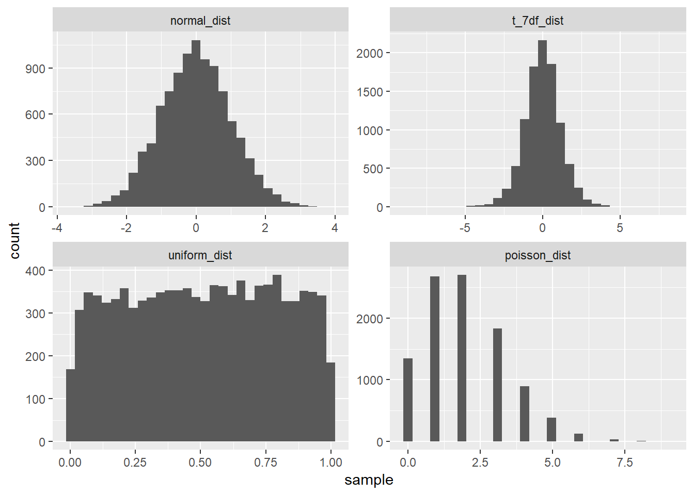
    
    ```r
    tibble(dist_type = names(distributions_df),
    skewness = purrr::map_dbl(distributions_df, skewness_bry), 
    variance = purrr::map_dbl(distributions_df, var_bry))
    ```
    
    ```
    ## # A tibble: 4 x 3
    ##   dist_type    skewness variance
    ##   <chr>           <dbl>    <dbl>
    ## 1 normal_dist    0.0509   1.01  
    ## 2 t_7df_dist    -0.0253   1.42  
    ## 3 uniform_dist  -0.0311   0.0823
    ## 4 poisson_dist   0.686    2.01
    ```
    
    * excellent video explaining intuition behind skewness: https://www.youtube.com/watch?v=z3XaFUP1rAM  
    
1.  Write `both_na()`, a function that takes two vectors of the same length 
    and returns the number of positions that have an `NA` in both vectors.
    
    
    ```r
    both_na <- function(x, y) {
      if (length(x) == length(y)) {
      sum(is.na(x) & is.na(y))
      } else
      stop("Vectors are not equal length")
    }
    
    x <- c(4, NA, 7, NA, 3)
    y <- c(NA, NA, 5, NA, 0)
    z <- c(NA, 4)
    
    both_na(x, y)
    ```
    
    ```
    ## [1] 2
    ```
    
    ```r
    both_na(x, z)
    ```
    
    ```
    ## Error in both_na(x, z): Vectors are not equal length
    ```

1.  What do the following functions do? Why are they useful even though they
    are so short?
    
    
    ```r
    is_directory <- function(x) file.info(x)$isdir
    is_readable <- function(x) file.access(x, 4) == 0
    ```

    * first checks if what is being referred to is actually a directory
    * second checks if a specific file is readable

1.  Read the [complete lyrics](https://en.wikipedia.org/wiki/Little_Bunny_Foo_Foo) 
    to "Little Bunny Foo Foo". There's a lot of duplication in this song. 
    Extend the initial piping example to recreate the complete song, and use 
    functions to reduce the duplication.
    
    * Do later...

## 19.3: Functions are for humans and computers

* Recommends snake_case over camelCase, but just choose one and be consistent
* When functions have a link, common prefix over suffix (i.e. input_select, input_text over, select_input, text_input) 
* ctrl + shift + r creates section breaks in R scripts like below  
`# test label --------------------------------------------------------------`
    + (though these cannot be made in markdown documents)


### 19.3.1

1.  Read the source code for each of the following three functions, puzzle out
    what they do, and then brainstorm better names.
    
    
    ```r
    f1 <- function(string, prefix) {
      substr(string, 1, nchar(prefix)) == prefix
    }
    f2 <- function(x) {
      if (length(x) <= 1) return(NULL)
      x[-length(x)]
    }
    f3 <- function(x, y) {
      rep(y, length.out = length(x))
    }
    ```
    
    * `f1`: `check_prefix`
    * `f2`: `return_not_last`
    * `f3`: `repeat_for_length`
    
1.  Take a function that you've written recently and spend 5 minutes 
    brainstorming a better name for it and its arguments.
    
    * Do later, consider doing for the airpline fix time functions, or for the CaseAnalysis data

1.  Compare and contrast `rnorm()` and `MASS::mvrnorm()`. How could you make
    them more consistent? 
    
    * uses mu = and Sigma = instead of mean = and sd = , and has extra parameters like tol, empirical, EISPACK
    * Similar in that both are pulling samples from gaussian distribution
    * `mvrnorm` is multivariate though, could change name to `rnorm_mv`
    
1.  Make a case for why `norm_r()`, `norm_d()` etc would be better than
    `rnorm()`, `dnorm()`. Make a case for the opposite.
    
    * `norm_*` would show the commonality of them being from the same distribution. One could argue the important commonality though may be more related to it being either a random sample or a density distribution, in which case the `r*` or `d*` coming first may make more sense. To me, the fact that the help pages has all of the 'normal distribution' functions on the same page suggests the former may make more sense. However, I actually like having it be set-up the way it is, because I am more likely to forget the name of the distribution type I want over the fact that I want a random sample, so it's easier to type `r` and then do ctrl + space and have autocomplete help me find the specific distribution I want, e.g. `rnorm`, `runif`, `rpois`, `rbinom`...
    
## 19.4: Conditional execution

* Function example that uses `if` statement.  I though this was a tricky function and added some notes below...

```r
has_name <- function(x) {
  nms <- names(x) 
  if (is.null(nms)) { 
    rep(FALSE, length(x))
  } else {
    !is.na(nms) & nms != ""
  }
}
```

* note that if all names are blank, it returns the one-unit vector value NULL, hence the need for the `if` statement here...
* `is.null` is not vectorized in the way that `is.na` is -- an exmpale of base R not being perfectly consistent. E.g. it's job is to return `TRUE` if given a `NULL` input, if you give it a list of `NULL` inputs it will return `FALSE`, e.g. `is.null(list(NULL, NULL))`

### 19.4.4

1.  What's the difference between `if` and `ifelse()`? Carefully read the help
    and construct three examples that illustrate the key differences.
    
    * `ifelse` is vectorized, `if` is not
        + Typically use `if` in functions when giving conditional options for how to evaluate
        + Typically use `ifelse` when changing specific values in a vector
    * If you supply `if` with a vector of length > 1, it will use the first value
        
    
    ```r
    x <- c(3, 4, 6)
    y <- c("5", "c", "9")
    
    # Use ifelse simple transformations of values like example below
    ifelse(x < 5, 0, x)
    ```
    
    ```
    ## [1] 0 0 6
    ```
    
    ```r
    cutoff_make0 <- function(x, cutoff = 0){
      if(is.numeric(x)){
        ifelse(x < cutoff, 0, x)
      } else stop("The input provided is not a numeric vector")
    }
    
    cutoff_make0(x, cutoff = 4)
    ```
    
    ```
    ## [1] 0 4 6
    ```
    
    ```r
    cutoff_make0(y, cutoff = 4)
    ```
    
    ```
    ## Error in cutoff_make0(y, cutoff = 4): The input provided is not a numeric vector
    ```
    
1.  Write a greeting function that says "good morning", "good afternoon",
    or "good evening", depending on the time of day. (Hint: use a time
    argument that defaults to `lubridate::now()`. That will make it 
    easier to test your function.)

    
    ```r
    greeting <- function(when) {
      
      time <- hour(when)
      
      if (time < 12 && time > 4) {
        greating <- "good morning"
      } else if (time < 17 && time >= 12) {
        greeting <- "good afternoon"
      } else greeting <- "good evening"
      
      when_char <- as.character(when)
      mid <- ", it is: "
      cat(greeting, mid, when_char, sep = "")
    }
    
    greeting(now())
    ```
    
    ```
    ## good evening, it is: 2019-05-13 17:50:45
    ```

1.  Implement a `fizzbuzz` function. It takes a single number as input. If
    the number is divisible by three, it returns "fizz". If it's divisible by
    five it returns "buzz". If it's divisible by three and five, it returns
    "fizzbuzz". Otherwise, it returns the number. Make sure you first write 
    working code before you create the function.
    
    
    ```r
    fizzbuzz <- function(x){
      if(is.numeric(x) && length(x) == 1){
        y <- ""
        if (x %% 5 == 0) y <- str_c(y, "fizz")
        if (x %% 3 == 0) y <- str_c(y, "buzz")
        if (str_length(y) == 0) {
          print(x)
        } else print(y)
      } else stop("Input is not a numeric vector with length 1")
    }
    
    fizzbuzz(4)
    ```
    
    ```
    ## [1] 4
    ```
    
    ```r
    fizzbuzz(10)
    ```
    
    ```
    ## [1] "fizz"
    ```
    
    ```r
    fizzbuzz(6)
    ```
    
    ```
    ## [1] "buzz"
    ```
    
    ```r
    fizzbuzz(30)
    ```
    
    ```
    ## [1] "fizzbuzz"
    ```
    
    ```r
    fizzbuzz(c(34, 21))
    ```
    
    ```
    ## Error in fizzbuzz(c(34, 21)): Input is not a numeric vector with length 1
    ```
    
    
1.  How could you use `cut()` to simplify this set of nested if-else statements?

    
    ```r
    if (temp <= 0) {
      "freezing"
    } else if (temp <= 10) {
      "cold"
    } else if (temp <= 20) {
      "cool"
    } else if (temp <= 30) {
      "warm"
    } else {
      "hot"
    }
    ```
    
    * Below is example of fix
    
    
    ```r
    temp <- seq(-10, 50, 5)
    cut(temp, 
        breaks = c(-Inf, 0, 10, 20, 30, Inf),  #need to include negative and positive infiniity
        labels = c("freezing", "cold", "cool", "warm", "hot"),
        right = TRUE,
        oredered_result = TRUE)
    ```
    
    ```
    ##  [1] freezing freezing freezing cold     cold     cool     cool    
    ##  [8] warm     warm     hot      hot      hot      hot     
    ## Levels: freezing cold cool warm hot
    ```
    
    How would you change the call to `cut()` if I'd used `<` instead of `<=`?
    What is the other chief advantage of `cut()` for this problem? (Hint:
    what happens if you have many values in `temp`?)
    
    * See below change to `right` argument
    
    ```r
    cut(temp, 
        breaks = c(-Inf, 0, 10, 20, 30, Inf),  #need to include negative and positive infiniity
        labels = c("freezing", "cold", "cool", "warm", "hot"),
        right = FALSE,
        oredered_result = TRUE)
    ```
    
    ```
    ##  [1] freezing freezing cold     cold     cool     cool     warm    
    ##  [8] warm     hot      hot      hot      hot      hot     
    ## Levels: freezing cold cool warm hot
    ```

1.  What happens if you use `switch()` with numeric values?

    * It will return the index of the argument.
      + In example below, I input '3' into `switch` value so it does the `times` argument

    
    ```r
    math_operation <- function(x, y, op){
       switch(op,
         plus = x + y,
         minus = x - y,
         times = x * y,
         divide = x / y,
         stop("Unknown op!")
       )
      }
    
    math_operation(5, 4, 3)
    ```
    
    ```
    ## [1] 20
    ```

1.  What does this `switch()` call do? What happens if `x` is "e"?

    
    ```r
    x <- "e"
    
    switch(x, 
      a = ,
      b = "ab",
      c = ,
      d = "cd"
    )
    ```
    
    Experiment, then carefully read the documentation. 
    
    * If `x` is 'e' nothing will be outputted. If `x` is 'c' or 'd' then 'cd' is outputted. If 'a' or 'b' then 'ab' is outputeed.  If blank it will continue down list until reaching an argument to output.
    
## 19.5: Function arguments

*Common non-descriptive short argument names: *  

* `x`, `y`, `z`: vectors.
* `w`: a vector of weights.
* `df`: a data frame.
* `i`, `j`: numeric indices (typically rows and columns).
* `n`: length, or number of rows.
* `p`: number of columns.

### 19.5.5

1.  What does `commas(letters, collapse = "-")` do? Why?

    * `commas` function is below
    
    ```r
    commas <- function(...) stringr::str_c(..., collapse = ", ")
    
    commas(letters[1:10])
    ```
    
    ```
    ## [1] "a, b, c, d, e, f, g, h, i, j"
    ```
    
    ```r
    commas(letters[1:10], collapse = "-")
    ```
    
    ```
    ## Error in stringr::str_c(..., collapse = ", "): formal argument "collapse" matched by multiple actual arguments
    ```
    
    * The above fails because are essentially specifying two different values for the `collapse` argument
    
    * Takes in vector of mulitple strings and outputs one-unit character string with items concatenated together and seperated by columns
    * Is able to do this via use of `...` that turns this into a wrapper on `stringr::str_c` with the `collapse` value specified

1.  It'd be nice if you could supply multiple characters to the `pad` argument, 
    e.g. `rule("Title", pad = "-+")`. Why doesn't this currently work? How 
    could you fix it?
    
    * current `rule` function is below
    
    ```r
    rule <- function(..., pad = "-") {
      title <- paste0(...)
      width <- getOption("width") - nchar(title) - 5
      cat(title, " ", stringr::str_dup(pad, width), "\n", sep = "")
    }
    
    # Note that `cat` is used instead of `paste` because paste would output it as a character vector, whereas `cat` is focused on just ouptut, could also have used `print`, though print does more conversion than cat does (apparently)
    
    rule("Tis the season"," to be jolly")
    ```
    
    ```
    ## Tis the season to be jolly --------------------------------------------
    ```
    
    * doesn't work because pad ends-up being too many characters in this situation
    
    ```r
    rule("Tis the season"," to be jolly", pad="+-")
    ```
    
    ```
    ## Tis the season to be jolly +-+-+-+-+-+-+-+-+-+-+-+-+-+-+-+-+-+-+-+-+-+-+-+-+-+-+-+-+-+-+-+-+-+-+-+-+-+-+-+-+-+-+-+-
    ```
    
    * instead would need to make the number of times `pad` is duplicated dependent on its length, see below for fix
    
    
    ```r
    rule_pad_fix <- function(..., pad = "-") {
      title <- paste0(...)
      width <- getOption("width") - nchar(title) - 5
      width_fix <- width %/% stringr::str_length(pad)
      cat(title, " ", stringr::str_dup(pad, width_fix), "\n", sep = "")
    }
    
    rule_pad_fix("Tis the season"," to be jolly", pad="+-")
    ```
    
    ```
    ## Tis the season to be jolly +-+-+-+-+-+-+-+-+-+-+-+-+-+-+-+-+-+-+-+-+-+-
    ```
    
1.  What does the `trim` argument to `mean()` do? When might you use it?

    * `trim` specifies proportion of data to take off from both ends, good with outliers
    
    ```r
    mean(c(-1000, 1:100, 100000), trim = .025) 
    ```
    
    ```
    ## [1] 50.5
    ```

1.  The default value for the `method` argument to `cor()` is 
    `c("pearson", "kendall", "spearman")`. What does that mean? What 
    value is used by default?
  
    * is showing that you can choose from any of these, will default to use `pearson` (value in first position)
    
## 19.6: Return values

```r
show_missings <- function(df) {
  n <- sum(is.na(df))
  cat("Missing values: ", n, "\n", sep = "")
  invisible(df)
}

x <- show_missings(mtcars)
```

```
## Missing values: 0
```

```r
str(x)
```

```
## 'data.frame':	32 obs. of  11 variables:
##  $ mpg : num  21 21 22.8 21.4 18.7 18.1 14.3 24.4 22.8 19.2 ...
##  $ cyl : num  6 6 4 6 8 6 8 4 4 6 ...
##  $ disp: num  160 160 108 258 360 ...
##  $ hp  : num  110 110 93 110 175 105 245 62 95 123 ...
##  $ drat: num  3.9 3.9 3.85 3.08 3.15 2.76 3.21 3.69 3.92 3.92 ...
##  $ wt  : num  2.62 2.88 2.32 3.21 3.44 ...
##  $ qsec: num  16.5 17 18.6 19.4 17 ...
##  $ vs  : num  0 0 1 1 0 1 0 1 1 1 ...
##  $ am  : num  1 1 1 0 0 0 0 0 0 0 ...
##  $ gear: num  4 4 4 3 3 3 3 4 4 4 ...
##  $ carb: num  4 4 1 1 2 1 4 2 2 4 ...
```

* can still use in pipes

```r
mtcars %>% 
  show_missings() %>% 
  mutate(mpg = ifelse(mpg < 20, NA, mpg)) %>% 
  show_missings() 
```

```
## Missing values: 0
## Missing values: 18
```


# Appendix

## 19.2.1.4

*Function for Standard Error* 


    
    ```r
    x <- c(5, -2, 8, 6, 9)
    sd(x, na.rm = TRUE) / sqrt(sum(!is.na(x)))
    ```
    
    ```
    ## [1] 1.933908
    ```
    
    ```r
    sample_se <- function(x) {
      sd(x, na.rm = TRUE) / sqrt(sum(!is.na(x)) - 1)
    }    #sqrt(var(x)/sum(!is.na(x)))
    
    sample_se(x)
    ```
    
    ```
    ## [1] 2.162175
    ```


*Function for kurtosis*

```r
kurtosis_type3 <- function(x){
  sum((x - mean(x)) ^ 4) / length(x) / sd(x) ^ 4 - 3
}
```

Notice differences between cauchy and normal distribution


```r
set.seed(1235)
norm_exp <- rnorm(10000)

set.seed(1235)
cauchy_exp <- rcauchy(10000)

hist(norm_exp)
```


```r
hist(cauchy_exp)
```


```r
kurtosis_type3(norm_exp)
```

```
## [1] 0.06382172
```

```r
kurtosis_type3(cauchy_exp)
```

```
## [1] 1197.052
```


## Changing values with indexes

*In this section I use the word 'indexes' to refer to any base R method for specifying position ^[I am using the word loosely to mean both either the situation when you specify postions by a series of `TRUE` / `FALSE` values or a series of numeric indexes E.g. x[c(TRUE, TRUE, FALSE, FALSE, TRUE)] or x[c(1, 2, 5)] , 'index' obviously sounds more like the later, but I mean it generally to cover just 'base R method of specifying positoin'.].

My solution to building the new function in 19.2.1.2 shows another way of replacing values over re-writing a new vector, namely by specifying indexes and then forcing those to be a new value.  

For example, say we have a vector `c(1:20)` and we want to make all even values equal to 0.  below is how you could do that by simply re-writing this to a new vector

```r
x <- c(1:20)

x_0_even <- ifelse((x %% 2) == 0, 0, x)

x_0_even
```

```
##  [1]  1  0  3  0  5  0  7  0  9  0 11  0 13  0 15  0 17  0 19  0
```

Alternatively, you could do this by simply overwriting the values in a specified index with a value (like I did in question 19.2.1.2)

```r
x <- c(1:20)

x[(x %% 2) == 0] <- 0

x
```

```
##  [1]  1  0  3  0  5  0  7  0  9  0 11  0 13  0 15  0 17  0 19  0
```

Both the indexing and the ifelse method give the same output. I have a slight preference for the `ifelse` method as I think it is a little easier to read. Also, it doesn't force you to overwrite your data -- to save against this second problem I will often save a copy before applying the indexed approach (though if it's in a function don't need to worry about this as changes will default to occur within function not global environment). e.g.


```r
x <- c(1:20)
x_0_even <- x

x_0_even[(x %% 2) == 0] <- 0

x_0_even
```

```
##  [1]  1  0  3  0  5  0  7  0  9  0 11  0 13  0 15  0 17  0 19  0
```

If you're curious about speed of each, you can see the index method tends to be faster on this dataset.  

*Build functions (necessary for measuring speed): *

```r
method_ifelse <- function(vector = c(1:20)){
  x <- vector
  
  x_0_even <- ifelse((x %% 2) == 0, 0, x)
  
  x_0_even
}

method_index <- function(vector = c(1:20)){
  x <- vector
  x[(x %% 2) == 0] <- 0
  
  x
}
```

*Measure time it takes to run: *

```r
microbenchmark::microbenchmark(ifelse = method_ifelse(1:1000),
                               index = method_index(1:1000),
                               times = 500)
```

```
## Unit: microseconds
##    expr     min       lq    mean  median       uq     max neval cld
##  ifelse 109.702 135.2510 278.932 162.851 221.1515 16451.2   500   b
##   index  42.801  48.8005 138.000  56.651  68.2010 16964.8   500  a
```

The index methods tends to be faster.

### Applying indexing to dfs

I have a high preference for using tidyverse style approaches when applying transformations to dataframes, though there are instances when it's easier to use indexing methods. A common example of this is say we want to replace all of the `NA` values across multiple columns in a dataframe.


```r
df <- tibble(x = c(NA, 3, 4),
       y = c(4, NA, NA))
```

The code below uses an indexing method to replace all `NA` values in the df with 0

```r
df_cleanNA <- df
df_cleanNA[is.na(df)] <- 0

df_cleanNA
```

```
## # A tibble: 3 x 2
##       x     y
##   <dbl> <dbl>
## 1     0     4
## 2     3     0
## 3     4     0
```

Below is the dplyr approach (requires knowledge of `mutate_all` and `funs`)

```r
mutate_all(df, funs(ifelse(is.na(.), 0, .)))
```

```
## Warning: funs() is soft deprecated as of dplyr 0.8.0
## please use list() instead
## 
## # Before:
## funs(name = f(.)
## 
## # After: 
## list(name = ~f(.))
## This warning is displayed once per session.
```

```
## # A tibble: 3 x 2
##       x     y
##   <dbl> <dbl>
## 1     0     4
## 2     3     0
## 3     4     0
```

With a purrr function you could have done:

```r
purrr::map_df(df, ~ifelse(is.na(.x), 0, .x))
```

```
## # A tibble: 3 x 2
##       x     y
##   <dbl> <dbl>
## 1     0     4
## 2     3     0
## 3     4     0
```

If you're curious of speed of each, below is microbenchmark test


```r
df_na0_index <- function(df){
  df[is.na(df)] <- 0
  df
}

df_na0_dplyr <- function(df){
  mutate_all(df, funs(ifelse(is.na(.), 0, .)))
}

df_na0_purrr <- function(df){
  purrr::map_df(df, ~ifelse(is.na(.x), 0, .x))
}
```

*Measure time it takes to run: *  

First on tiny dataset:

```r
microbenchmark::microbenchmark(index = df_na0_index(flights),
                               dplyr = df_na0_index(flights),
                               purrr = df_na0_purrr(flights),
                               times = 10)
```

```
## Unit: milliseconds
##   expr       min        lq      mean    median        uq       max neval
##  index   95.4151  105.2464  180.1668  123.4780  315.6865  358.9221    10
##  dplyr  102.6523  107.1538  232.4382  233.9622  335.7390  403.0783    10
##  purrr 1524.7338 1755.9659 1972.4752 1827.1936 1861.8809 3805.1779    10
##  cld
##   a 
##   a 
##    b
```


Then on larger dataset:

```r
microbenchmark::microbenchmark(index = df_na0_index(flights),
                               dplyr = df_na0_index(flights),
                               purrr = df_na0_purrr(flights),
                               times = 10)
```

```
## Unit: milliseconds
##   expr       min        lq      mean    median        uq       max neval
##  index  105.0681  120.5942  187.1421  129.1251  311.6510  367.6541    10
##  dplyr   82.8993  107.9641  189.8387  136.1861  336.5434  376.6536    10
##  purrr 1534.7489 1691.5109 1785.8386 1841.6595 1882.3680 1925.9034    10
##  cld
##   a 
##   a 
##    b
```

You should see that the index and dplyr method are pretty consistent on time, whereas the purrr method will be slower. For this example and some problems like this then indexing may be the best option (generally though I lean more towards using dplyr where possible).  

I also wonder if there may be a better alternative to `ifelse` in this situation.

## Better than `ifelse()`?

I end-up using `ifelse` a lot for basic transformations, I'm curious if there is a more efficient alternative for use with dplyr style...

* I learned about dplyr's functions `dplyr::recode` which is similar to `forcats::fct_recode` and can be used for replacing multiple character values. 
* `dplyr::case_when` can be used for more complex criteria

## Dplyr and functions

As was mentioned, dplyr uses non-standard evaluation. This means that when referring to column names form within a function, dplyr will require some slightly different syntax... I typically find ways around this by deploying tricks with the `*_` verbs or taking advantage of the `vars` functions and `*_at` or by messing with the names, though am interested to hear other methods...

Say you want to write a function that takes in a dataframe and a list of column names and you want to return a sum of these into a new column with the name corresponding with the name of the spliced together columns. What would be the most elegant way of doing this with tidyverse style?

## 19.2.3.5

    
    ```r
    position_both_na <- function(x, y) {
      if (length(x) == length(y)) {
      (c(1:length(x)))[(is.na(x) & is.na(y))]
      } else
      stop("Vectors are not equal length")
    }
    
    x <- c(4, NA, 7, NA, 3)
    y <- c(NA, NA, 5, NA, 0)
    z <- c(NA, 4)
    both_na(x, y)
    ```
    
    ```
    ## [1] 2
    ```
    
    ```r
    both_na(x, z)
    ```
    
    ```
    ## Error in both_na(x, z): Vectors are not equal length
    ```

* specifies position where both are `NA`
* second example shows returning of 'stop' argument

<!--chapter:end:19-functions.Rmd-->

*Make sure the following packages are installed:*  


```r
knitr::opts_chunk$set(echo = TRUE, cache = TRUE, message = FALSE)

library(tidyverse)
library(ggplot2)
library(dplyr)
library(tidyr)
library(nycflights13)
library(babynames)
library(nasaweather)
library(lubridate)
library(purrr)
library(readr)
```

# ch. 20: Vectors


* `is.finite`, `is.infinite`, `is.na`, `is.nan`


* `typeof` retruns type of vector
* `length` returns length of vector
* `pryr::object_size` view size of object stored
* specific `NA` values can be defined explicitly with `NA_integer_`, `NA_real_`, `NA_character_` (usually don't need to know)
* explicitly differentiate integers from doubles with `10L` v `10`
* explicit coersion functions: `as.logical`, `as.integer`, `as.double`, `as.character`, or use `col_[types]` when reading in so that coersion done at source
* test functions from `purrr` package that are more consistent than base R's


* `set_names` lets you set names after the fact, e.g. `set_names(1:3, c("a", "b", "c"))`
* For more details on subsetting: http://adv-r.had.co.nz/Subsetting.html#applications 
* `str` checks structure (excellent for use with lists)
* `attr` and `attributes` get and set attributes
  + main types of attributes: **Names**, **Dimensions/dims**, **Class**. Class is important for object oriented programming which is covered in more detail here: http://adv-r.had.co.nz/OO-essentials.html#s3 
* `useMethod` in function syntax indicates it is a generic function
* `methods` lists all methods within a generic
* `getS3method` to show specific implementation of a method
* Above are used together to investigate details of code for functions


```r
as.Date
```

```
## function (x, ...) 
## UseMethod("as.Date")
## <bytecode: 0x000000001cc21870>
## <environment: namespace:base>
```

```r
methods("as.Date")
```

```
## [1] as.Date.character as.Date.default   as.Date.factor    as.Date.IDate*   
## [5] as.Date.numeric   as.Date.POSIXct   as.Date.POSIXlt  
## see '?methods' for accessing help and source code
```

```r
getS3method("as.Date", "default")
```

```
## function (x, ...) 
## {
##     if (inherits(x, "Date")) 
##         x
##     else if (is.logical(x) && all(is.na(x))) 
##         .Date(as.numeric(x))
##     else stop(gettextf("do not know how to convert '%s' to class %s", 
##         deparse(substitute(x)), dQuote("Date")), domain = NA)
## }
## <bytecode: 0x00000000281bf2a8>
## <environment: namespace:base>
```

* Unfortunately, tidyverse functions are not particularly easy to unpack/understand this way...

```r
select
```

```
## function (.data, ...) 
## {
##     UseMethod("select")
## }
## <bytecode: 0x000000001ce63a38>
## <environment: namespace:dplyr>
```

```r
methods("select")
```

```
## [1] select.data.frame* select.default*    select.grouped_df*
## [4] select.list        select.tbl_cube*  
## see '?methods' for accessing help and source code
```

```r
getS3method("select", "default")
```

```
## function (.data, ...) 
## {
##     select_(.data, .dots = compat_as_lazy_dots(...))
## }
## <bytecode: 0x0000000027122a68>
## <environment: namespace:dplyr>
```

* **Augmented vectors**: vectors with additional attributes, e.g. factors (levels, class = factors), dates and datetimes (tzone, class = (POSIXct, POSIXt)), POSIXlt (names, class = (POSIXLt, POSIXt)), tibbles (names, class = (tbl_df, tbl, data.frame), row.names) -- in the integer, double and double, list, list types.
  + data.frames only have class data.frame, whereas tibbles have tbl_df, and tbl as well

```r
a <- list(a = 1:3, b = "a string", c = pi, d = list(c(-1,-2), -5))

a[[4]][[1]]
```

```
## [1] -1 -2
```

* `class` get or set class attribute
* `unclass` returns copy with 'class' attribute removed
## 20.3: Important types of atomic vector

### 20.3.5

1.  Describe the difference between `is.finite(x)` and  `!is.infinite(x)`.

    * both `is.infinite` and `!is.infinite` return `FALSE` for `NA` or `NaN` values, therefore these values will become `TRUE` when negated, e.g. see example below:

    
    ```r
    is.finite(c(6,11,-Inf, NA, NaN))
    ```
    
    ```
    ## [1]  TRUE  TRUE FALSE FALSE FALSE
    ```
    
    ```r
    !is.infinite(c(6,11,-Inf, NA, NaN))
    ```
    
    ```
    ## [1]  TRUE  TRUE FALSE  TRUE  TRUE
    ```


1.  Read the source code for `dplyr::near()` (Hint: to see the source code,
    drop the `()`). How does it work? 

1.  A logical vector can take 3 possible values. How many possible
    values can an integer vector take? How many possible values can
    a double take? Use google to do some research.
    * it checks if the difference between the value is within `tol` which by default is `.Machine$double.eps^0.5`

1.  Brainstorm at least four functions that allow you to convert a double to an
    integer. How do they differ? Be precise.
    
    * `as.integer`, `as.factor` (technically is going to a factor), `round(, 0)`, `floor`, `ceiling`, these last 3 though do not change the type, which would remain an integer
    
1.  What functions from the readr package allow you to turn a string
    into logical, integer, and double vector?
    
    * `parse_*` or `col_*`

    
## 20.4: Using atomic vectors

### 20.4.6

1.  What does `mean(is.na(x))` tell you about a vector `x`? What about
    `sum(!is.finite(x))`?

    * percentage that are `NA` or `NaN`
    * number that are either `Inf`, `-Inf`, `NA` or `NaN`

1.  Carefully read the documentation of `is.vector()`. What does it actually
    test for? Why does `is.atomic()` not agree with the definition of 
    atomic vectors above?
    
    * `is.vector` tests if it is a specific type of vector with no attributes other than names. This second requirement means that any augmented vectors such as factors, dates, tibbles all would return false.
    * `is.atomic` returns TRUE to `is.atomic(NULL)` despite this representing the empty set.
    
1.  Compare and contrast `setNames()` with `purrr::set_names()`.

    * both assign names after fact
    * `purrr::set_names` is stricter and returns an error in situations like the following where as `setNames` does not
    
    
    ```r
    setNames(1:4, c("a"))
    ```
    
    ```
    ##    a <NA> <NA> <NA> 
    ##    1    2    3    4
    ```
    
    ```r
    set_names(1:4, c("a")) 
    ```
    
    ```
    ## Error: `nm` must be `NULL` or a character vector the same length as `x`
    ```
    

1.  Create functions that take a vector as input and returns:

    
    ```r
    x <- c(-3:14, NA, Inf, NaN)
    ```
    
    1. The last value.  Should you use `[` or `[[`?

    
    ```r
    return_last <- function(x) x[[length(x)]]
    
    return_last(x)
    ```
    
    ```
    ## [1] NaN
    ```

    1. The elements at even numbered positions.
    
    
    ```r
    return_even <- function(x) x[((1:length(x)) %% 2 == 0)]
    
    return_even(x)
    ```
    
    ```
    ##  [1]  -2   0   2   4   6   8  10  12  14 Inf
    ```
    
    
    1. Every element except the last value.
    
    ```r
    return_not_last <- function(x) x[-length(x)]
    
    return_not_last(x)
    ```
    
    ```
    ##  [1]  -3  -2  -1   0   1   2   3   4   5   6   7   8   9  10  11  12  13
    ## [18]  14  NA Inf
    ```

    
    1. Only even numbers (and no missing values).
    
    ```r
    #only even and not na
    return_even_no_na <- function(x) x[((1:length(x)) %% 2 == 0) & !is.na(x)]
    
    return_even_no_na(x)
    ```
    
    ```
    ##  [1]  -2   0   2   4   6   8  10  12  14 Inf
    ```


1.  Why is `x[-which(x > 0)]` not the same as `x[x <= 0]`? 

    
    ```r
    x[-which(x > 0)]  #which only reports the indices of the matches, so specifies all to be removed
    ```
    
    ```
    ## [1]  -3  -2  -1   0  NA NaN
    ```
    
    ```r
    x[x <= 0]  #This method reports T/F'sNaN is converted into NA
    ```
    
    ```
    ## [1] -3 -2 -1  0 NA NA
    ```

    * in the 2nd instance, `NaN`s will get converted to `NA`

1.  What happens when you subset with a positive integer that's bigger
    than the length of the vector? What happens when you subset with a 
    name that doesn't exist?
    
    * you get back an `NA` though it seems to take longer in the case when subsetting by a name that doesn't exist.
    
## 20.5: Recursive vectors (lists)

* 3 ways of subsetting `[]`, `[[]]`, `$`

### 20.5.4

```r
a <- list(a = 1:3, b = "a string", c = pi, d = list(-1, -5))
```


1.  Draw the following lists as nested sets:

    1.  `list(a, b, list(c, d), list(e, f))`
    1.  `list(list(list(list(list(list(a))))))`

    * I did not conform with Hadley's square v rounded syntax, but hopefully this gives a sense of what the above are:
    
    
    
1.  What happens if you subset a tibble as if you're subsetting a list?
    What are the key differences between a list and a tibble?
    
    * dataframe is just a list of columns, so behaves similarly
    * dataframe has restriction that each column has the same number of elements whereas lists do not have this requirement

    
## 20.7: Augmented vectors

### 20.7.4

1.  What does `hms::hms(3600)` return? 

    
    ```r
    x <- hms::hms(3600)
    ```
    
    How does it print? 
    
    ```r
    print(x)
    ```
    
    ```
    ## 01:00:00
    ```
    
    What primitive type is the augmented vector built on top of? 
    
    ```r
    typeof(x)
    ```
    
    ```
    ## [1] "double"
    ```
    
    What attributes does it use?
    
    ```r
    attributes(x)
    ```
    
    ```
    ## $class
    ## [1] "hms"      "difftime"
    ## 
    ## $units
    ## [1] "secs"
    ```

    
1.  Try and make a tibble that has columns with different lengths. What
    happens?
    
    * if the column is length one it will repeat for the length of the other column(s), otherwise if it is not the same length it will return an error
    
    ```r
    tibble(x = 1:4, y = 5:6)  #error
    ```
    
    ```
    ## Error: Tibble columns must have consistent lengths, only values of length one are recycled:
    ## * Length 2: Column `y`
    ## * Length 4: Column `x`
    ```
    
    ```r
    tibble(x = 1:5, y = 6)  #can have length 1 that repeats
    ```
    
    ```
    ## # A tibble: 5 x 2
    ##       x     y
    ##   <int> <dbl>
    ## 1     1     6
    ## 2     2     6
    ## 3     3     6
    ## 4     4     6
    ## 5     5     6
    ```

1.  Based on the definition above, is it ok to have a list as a
    column of a tibble?
    
    * Yes, as long as the number of elements align with the other length of the other columns -- this will come-up a lot in the modeling chapters.
  
# Appendix 

## subsetting nested lists    


```r
x <- list("a", list(list("c", "d"), "e2"), list("e", "f"))
x
```

```
## [[1]]
## [1] "a"
## 
## [[2]]
## [[2]][[1]]
## [[2]][[1]][[1]]
## [1] "c"
## 
## [[2]][[1]][[2]]
## [1] "d"
## 
## 
## [[2]][[2]]
## [1] "e2"
## 
## 
## [[3]]
## [[3]][[1]]
## [1] "e"
## 
## [[3]][[2]]
## [1] "f"
```

It can be confusing how to subset items in a nested list, lists output helps tell you the subsetting needed to extract particular items. For example, to output `list("c", "d")` requires `x[[2]][[1]]`, to output just `d` requires `x[[2]][[1]][[2]]`


<!--chapter:end:20-vectors.Rmd-->


*Make sure the following packages are installed:*  

```r
library(tidyverse)
library(ggplot2)
library(dplyr)
library(tidyr)
library(nycflights13)
library(babynames)
library(nasaweather)
library(lubridate)
library(purrr)
library(readr)
library(stringr)
```


# ch. 21: Iteration

* Common `for` loop template:

```r
output <- vector("double", ncol(df)) # common for loop style  
for (i in seq_len(length(df))){
  output[[i]] <- fun(df[[i]])
  }  
```

* Common `while` loop template:

```r
i <- 1
while (i <= length(x)){
  # body
  i <- i + 1
}  
```

* `seq_along(df)` does essentially same as `seq_len(length(df))`
* `unlist` flatten list of vectors into single vector
    + `flaten_dbl` is stricter alternative
* `dplyr::bind_rows` save output in a list of dfs and then append all at end rather than sequential `rbind`ing
* `sample(c("T", "H"), 1)`
* `sapply` is wrapper around `lapply` that automatically simplifies output -- problematic in that never know what ouptut will be
* `vapply` is safe alternative to `sapply` e.g. for logical `vapply(df, is.numeric, logical(1))`, but `map_lgl(df, is.numeric)` is more simple
* `map()`     makes a list.
  * `map_lgl()` makes a logical vector.
  * `map_int()` makes an integer vector.
  * `map_dbl()` makes a double vector.
  * `map_chr()` makes a character vector.
* shortcuts for applying functions in `map`:

```r
models <- mtcars %>% 
  split(.$cyl) %>% 
  map(function(df) lm(mpg ~ wt, data = df))

models <- mtcars %>% 
  split(.$cyl) %>% 
  map(~lm(mpg ~ wt, data = .))
```

* extracting by named elements from `map`:

```r
models %>% 
  map(summary) %>% 
  map_dbl("r.squared")
```

```
##         4         6         8 
## 0.5086326 0.4645102 0.4229655
```

* extracting by positions from `map`

```r
x <- list(list(1, 2, 3), list(4, 5, 6), list(7, 8, 9))
x %>% 
  map_dbl(2)
```

```
## [1] 2 5 8
```

* `map2` let's you iterate through two components at once
* `pmap` allows you to iterate over p components -- works well to hold inputs in a dataframe
* `safely` takes funciton returns two parts, result and error object
  + similar to `try` but more consistent
* `possibly` similar to safely, but provide it a default value to return for errors
* `quietly` is similar to safely but captures all printed output messages and warnings
* `purrr::transpose` allows you to do things like get all 2nd elements in list, e.g. show later
* `invoke_map` let's you iterate over both the functions and the parameters, have an `f` and a `param` input, e.g. 

```r
f <- c("runif", "rnorm", "rpois")
param <- list(
  list(min = -1, max = 1), 
  list(sd = 5), 
  list(lambda = 10)
)

invoke_map(f, param, n = 5) %>% str()
```

```
## List of 3
##  $ : num [1:5] -0.409 0.558 -0.523 0.435 0.437
##  $ : num [1:5] 0.886 -11.405 3.467 -1.42 1.317
##  $ : int [1:5] 9 12 7 11 13
```

* `walk` is alternative to `map` that you call for side effects. Also have `walk2` and `pwalk` that are generally more useful 
  + all invisibly return `.x (the first argument) so can used in the middle of pipelines
* `keep` and `discard` keep or discard elements in the input based off if `TRUE` to predicate
* `some` and `every` determine if the predicte is true for any or for all of our elements
* `detect` finds the first element where the predicate is true, `detect_index` returns its position
* `head_while` and `tail_while` take elements from the start or end of a vector while a predicate is true
* `reduce` is good for applying two table rule repeatedly, e.g. joins
  * `accumulate` is similar but keeps all the interim results

## 21.2: For loops

### 21.2.1

1.  Write for loops to (think about the output, sequence, and body __before__ you start writing
    the loop):

    1. Compute the mean of every column in `mtcars`.
    
    
    ```r
    output <- vector("double", length(mtcars))
    for (i in seq_along(mtcars)){
      output[[i]] <- mean(mtcars[[i]])
    }
    output
    ```
    
    ```
    ##  [1]  20.090625   6.187500 230.721875 146.687500   3.596563   3.217250
    ##  [7]  17.848750   0.437500   0.406250   3.687500   2.812500
    ```
    

    
    1. Determine the type of each column in `nycflights13::flights`.
    
    
    ```r
    output <- vector("character", length(flights))
    for (i in seq_along(flights)){
      output[[i]] <- typeof(flights[[i]])
    }
    output
    ```
    
    ```
    ##  [1] "integer"   "integer"   "integer"   "integer"   "integer"  
    ##  [6] "double"    "integer"   "integer"   "double"    "character"
    ## [11] "integer"   "character" "character" "character" "double"   
    ## [16] "double"    "double"    "double"    "double"
    ```
    
    1. Compute the number of unique values in each column of `iris`.
    
    
    ```r
    output <- vector("integer", length(iris))
    for (i in seq_along(iris)){
      output[[i]] <- unique(iris[[i]]) %>% length()
    }
    output
    ```
    
    ```
    ## [1] 35 23 43 22  3
    ```
    

    1. Generate 10 random normals for each of $\mu = -10$, $0$, $10$, and $100$.
    
    ```r
    output <- vector("list", 4)
    input_means <- c(-10, 0, 10, 100)
    for (i in seq_along(output)){
      output[[i]] <- rnorm(10, mean = input_means[[i]])
    }
    output
    ```
    
    ```
    ## [[1]]
    ##  [1]  -8.605634  -9.551704  -8.731523  -9.168458 -11.001371  -9.892221
    ##  [7] -11.043184  -9.411637  -8.819886 -10.332451
    ## 
    ## [[2]]
    ##  [1]  0.19044226  0.11141624  0.61720007 -0.38035899  0.44768544
    ##  [6] -0.76423577 -0.40651589  0.55417807  0.06447749  0.08577118
    ## 
    ## [[3]]
    ##  [1] 11.592015 10.230275 10.485456  8.524484 10.216160 11.801228  9.621886
    ##  [8]  9.711169  8.557296  9.674630
    ## 
    ## [[4]]
    ##  [1] 100.13861 101.68396  99.78997 100.02390 101.28014 100.47896 101.61287
    ##  [8] 101.60146  98.30665  98.46330
    ```
    

1.  Eliminate the for loop in each of the following examples by taking 
    advantage of an existing function that works with vectors:
    
    *example:*
    
    ```r
    out <- ""
    for (x in letters) {
      out <- stringr::str_c(out, x)
    }
    out
    ```
    
    * collabse letters into length-one character vector with all characters concatenated
    
    ```r
    str_c(letters, collapse = "")
    ```
    
    ```
    ## [1] "abcdefghijklmnopqrstuvwxyz"
    ```
    
    *example:*
    
    ```r
    x <- sample(100)
    sd <- 0
    for (i in seq_along(x)) {
      sd <- sd + (x[i] - mean(x)) ^ 2
    }
    sd <- sqrt(sd / (length(x) - 1))
    sd
    ```
    
    ```
    ## [1] 29.01149
    ```
    
    * calculate standard deviaiton of x
    
    ```r
    sd(x)
    ```
    
    ```
    ## [1] 29.01149
    ```
    
    *example:*
    
    ```r
    x <- runif(100)
    out <- vector("numeric", length(x))
    out[1] <- x[1]
    for (i in 2:length(x)) {
      out[i] <- out[i - 1] + x[i]
    }
    out
    ```
    
    ```
    ##   [1]  0.8580032  1.4080813  1.5292076  1.8895446  2.4094579  3.3166936
    ##   [7]  3.8572252  4.3904290  4.6774750  5.0117995  5.0337810  5.7165738
    ##  [13]  6.6656070  6.8884448  6.9893374  7.5160177  8.1294626  8.2121125
    ##  [19]  9.0054869  9.6317329 10.0096182 10.1991910 10.9756814 11.2147282
    ##  [25] 11.5998986 12.4242918 13.0039785 13.6570119 14.1396485 14.8146508
    ##  [31] 15.7955621 16.1207877 16.3791735 16.9890055 17.2455810 17.8340259
    ##  [37] 18.2746532 18.6945429 19.5790383 20.3310052 20.9530894 21.5696893
    ##  [43] 21.7309806 21.7913738 22.7637727 23.5481768 23.9762264 24.1652629
    ##  [49] 24.4743612 24.7854173 25.6875924 25.8098735 26.5417532 27.3075973
    ##  [55] 27.9745816 28.0616426 28.8171291 29.1407773 29.9401545 30.0814611
    ##  [61] 30.1579563 30.8852811 31.8248619 32.1942498 32.2743315 32.6599626
    ##  [67] 32.9568671 33.5236929 34.3447372 35.0544010 35.6379143 36.0917088
    ##  [73] 36.1054679 36.4354180 37.2624050 37.4476478 37.5941831 38.0229500
    ##  [79] 38.4023391 38.4249938 39.1162637 39.7592861 39.9539571 40.5353900
    ##  [85] 41.4559670 41.9394460 42.4031692 43.2762369 44.1857884 44.5963724
    ##  [91] 44.7255799 44.9908209 44.9994744 45.9817091 46.3829987 46.8719624
    ##  [97] 47.5409347 48.4808963 49.4798175 50.0605786
    ```
    
    * calculate cumulative sum
    
    ```r
    cumsum(x)
    ```
    
    ```
    ##   [1]  0.8580032  1.4080813  1.5292076  1.8895446  2.4094579  3.3166936
    ##   [7]  3.8572252  4.3904290  4.6774750  5.0117995  5.0337810  5.7165738
    ##  [13]  6.6656070  6.8884448  6.9893374  7.5160177  8.1294626  8.2121125
    ##  [19]  9.0054869  9.6317329 10.0096182 10.1991910 10.9756814 11.2147282
    ##  [25] 11.5998986 12.4242918 13.0039785 13.6570119 14.1396485 14.8146508
    ##  [31] 15.7955621 16.1207877 16.3791735 16.9890055 17.2455810 17.8340259
    ##  [37] 18.2746532 18.6945429 19.5790383 20.3310052 20.9530894 21.5696893
    ##  [43] 21.7309806 21.7913738 22.7637727 23.5481768 23.9762264 24.1652629
    ##  [49] 24.4743612 24.7854173 25.6875924 25.8098735 26.5417532 27.3075973
    ##  [55] 27.9745816 28.0616426 28.8171291 29.1407773 29.9401545 30.0814611
    ##  [61] 30.1579563 30.8852811 31.8248619 32.1942498 32.2743315 32.6599626
    ##  [67] 32.9568671 33.5236929 34.3447372 35.0544010 35.6379143 36.0917088
    ##  [73] 36.1054679 36.4354180 37.2624050 37.4476478 37.5941831 38.0229500
    ##  [79] 38.4023391 38.4249938 39.1162637 39.7592861 39.9539571 40.5353900
    ##  [85] 41.4559670 41.9394460 42.4031692 43.2762369 44.1857884 44.5963724
    ##  [91] 44.7255799 44.9908209 44.9994744 45.9817091 46.3829987 46.8719624
    ##  [97] 47.5409347 48.4808963 49.4798175 50.0605786
    ```
    

1.  Combine your function writing and for loop skills:

    1. Write a for loop that `prints()` the lyrics to the children's song "Alice the camel".

    
    ```r
    num_humps <- c("five", "four", "three", "two", "one", "no")
    
    for (i in seq_along(num_humps)){
      
      paste0("Alice the camel has ", num_humps[[i]], " humps.") %>% 
        rep(3) %>% 
        writeLines()
      
      writeLines("So go, Alice, go.\n")
      
    }
    ```
    
    ```
    ## Alice the camel has five humps.
    ## Alice the camel has five humps.
    ## Alice the camel has five humps.
    ## So go, Alice, go.
    ## 
    ## Alice the camel has four humps.
    ## Alice the camel has four humps.
    ## Alice the camel has four humps.
    ## So go, Alice, go.
    ## 
    ## Alice the camel has three humps.
    ## Alice the camel has three humps.
    ## Alice the camel has three humps.
    ## So go, Alice, go.
    ## 
    ## Alice the camel has two humps.
    ## Alice the camel has two humps.
    ## Alice the camel has two humps.
    ## So go, Alice, go.
    ## 
    ## Alice the camel has one humps.
    ## Alice the camel has one humps.
    ## Alice the camel has one humps.
    ## So go, Alice, go.
    ## 
    ## Alice the camel has no humps.
    ## Alice the camel has no humps.
    ## Alice the camel has no humps.
    ## So go, Alice, go.
    ```

    1. Convert the nursery rhyme "ten in the bed" to a function. Generalise it to any number of people in any sleeping structure.

    
    ```r
    nursery_bed <- function(num, y) {
      output <- vector("character", num)
      for (i in seq_along(output)) {
        output[[i]] <- str_replace_all(
        'There were x in the _y\n And the little one said, \n"Roll over! Roll over!"\n So they all rolled over and\n one fell out.', c("x" = (length(output) - i + 1), "_y" = y))
      } 
      str_c(output, collapse = "\n\n") %>% 
        writeLines()
    }
    
    nursery_bed(3, "asteroid")
    ```
    
    ```
    ## There were 3 in the asteroid
    ##  And the little one said, 
    ## "Roll over! Roll over!"
    ##  So they all rolled over and
    ##  one fell out.
    ## 
    ## There were 2 in the asteroid
    ##  And the little one said, 
    ## "Roll over! Roll over!"
    ##  So they all rolled over and
    ##  one fell out.
    ## 
    ## There were 1 in the asteroid
    ##  And the little one said, 
    ## "Roll over! Roll over!"
    ##  So they all rolled over and
    ##  one fell out.
    ```
    
    
    1. Convert the song "99 bottles of beer on the wall" to a function.
       Generalise to any number of any vessel containing any liquid on 
       any surface.  
       
    * This is a little bit of a lazy version...
       
    
    ```r
    beer_rhyme <- function(x, y, z){
      output <- vector("character", x)
      for (i in seq_along(output)){
        output[i] <-
          str_replace_all("x bottles of y on the z.\n One fell off...", c(
          "x" = (x - i + 1),
          "y" = y,
          "z" = z
          ))
      }
      output <- (str_c(output, collapse = "\n") %>% 
                   str_c("\nNo more bottles...", collapse = ""))
      writeLines(output)
    }
    
    beer_rhyme(4, "soda", "toilet")
    ```
    
    ```
    ## 4 bottles of soda on the toilet.
    ##  One fell off...
    ## 3 bottles of soda on the toilet.
    ##  One fell off...
    ## 2 bottles of soda on the toilet.
    ##  One fell off...
    ## 1 bottles of soda on the toilet.
    ##  One fell off...
    ## No more bottles...
    ```
    

1.  It's common to see for loops that don't preallocate the output and instead increase the length of a vector at each step. How does this affect performance? Design and execute an experiment.
    
    
    ```r
    preallocate <- function(){
    x <- vector("double", 100)
      for (i in seq_along(x)){
        x[i] <- rnorm(1)
      }
    }
    
    growing <- function(){
      x <- c(0)
        for (i in 1:100){
          x[i] <- rnorm(1)
      }
    }
    
    microbenchmark::microbenchmark(
      space = preallocate(),
      no_space = growing(),
      times = 20
    )  
    ```
    
    ```
    ## Unit: microseconds
    ##      expr     min       lq     mean   median       uq     max neval cld
    ##     space 209.701 224.8505 794.2008 237.5510 378.6010 10645.4    20   a
    ##  no_space 248.901 274.3000 927.2258 383.5005 486.6515 11356.5    20   a
    ```

    * see roughly 35% better performance when creating ahead of time
        
    * note: if you can do these operations with vectorized approach though -- they're often much faster
    
    
    ```r
    microbenchmark::microbenchmark(
      space = preallocate(),
      no_space = growing(),
      vector = rnorm(100),
      times = 20
    )
    ```
    
    ```
    ## Unit: microseconds
    ##      expr     min      lq      mean  median      uq     max neval cld
    ##     space 174.001 188.801 281.59090 218.851 369.601 472.701    20  b 
    ##  no_space 222.001 300.601 407.19095 436.351 494.301 550.300    20   c
    ##    vector  10.201  11.701  17.49595  18.701  23.201  24.302    20 a
    ```
    
    * vectorized was > 10x faster

## 21.3 For loop variations

### 21.3.5

1.  Imagine you have a directory full of CSV files that you want to read in. You have their paths in a vector, `files <- dir("data/", pattern = "\\.csv$", full.names = TRUE)`, and now want to read each one with `read_csv()`. Write the for loop that will load them into a single data frame. 
    
* To start this problem, I first created a file directory, and then wrote in 26 csvs each with the most popular name from each year since 1880 for a particular letter[^WalkExample].
* Next I read these into a single dataframe with a for loop
    
[^WalkExample]: 
  Below is the code that accomplished this. I used `walk2` and methods we learn later in the chapter.

    
    ```r
    dir.create("ch21_csvs_example")
    
    babynames %>% 
      mutate(first_letter = str_sub(name, 1, 1)) %>% 
      group_by(first_letter, year) %>% 
      filter(dplyr::min_rank(-prop) == 1) %>%  
      split(.$first_letter) %>% 
      # map(~select(.x, -first_letter)) %>% 
      walk2(.x = ., .y = names(.), 
            ~write_csv(.x,
                       paste0("ch21_csvs_example/", "letter_", .y, ".csv"))
            )
    ```


```r
append_csvs <- function(dir){
  #input vector of file paths name and output appended file
  
  out <- vector("list", length(dir))
  for (i in seq_along(out)){
    out[[i]] <- read_csv(dir[[i]], col_types = cols(.default = "c"))
  }
  out <-  bind_rows(out) %>% 
    type_convert()
  out
}

dir_examp <- dir("ch21_csvs_example", 
    pattern = "csv$",
    full.names = TRUE)

names_appended <- append_csvs(dir_examp)
```

```
## Parsed with column specification:
## cols(
##   year = col_double(),
##   sex = col_character(),
##   name = col_character(),
##   n = col_integer(),
##   prop = col_double(),
##   first_letter = col_character()
## )
```

```r
names_appended
```

```
## # A tibble: 3,514 x 6
##     year sex   name      n   prop first_letter
##    <dbl> <chr> <chr> <int>  <dbl> <chr>       
##  1  1880 F     Anna   2604 0.0267 A           
##  2  1881 F     Anna   2698 0.0273 A           
##  3  1882 F     Anna   3143 0.0272 A           
##  4  1883 F     Anna   3306 0.0275 A           
##  5  1884 F     Anna   3860 0.0281 A           
##  6  1885 F     Anna   3994 0.0281 A           
##  7  1886 F     Anna   4283 0.0279 A           
##  8  1887 F     Anna   4227 0.0272 A           
##  9  1888 F     Anna   4982 0.0263 A           
## 10  1889 F     Anna   5062 0.0268 A           
## # ... with 3,504 more rows
```


* See [Using map] for example of how this could be accomplished using `map` and `map(safely(read_csv))`.


2.  *What happens if you use `for (nm in names(x))` and `x` has no names?*


```r
x <- list(1:10, 11:18, 19:25)
for (nm in names(x)) {
  print(x[[nm]])
}
```

* each iteration produces an error, so nothing is written
  
*What if only some of the elements are named? *


```r
x <- list(a = 1:10, 11:18, c = 19:25)
for (nm in names(x)) {
  print(x[[nm]])
}
```

```
##  [1]  1  2  3  4  5  6  7  8  9 10
## NULL
## [1] 19 20 21 22 23 24 25
```

* you have output for those with names and NULL for those without
  
*What if the names are not unique?*

```r
x <- list(a = 1:10, a = 11:18, c = 19:25)
for (nm in names(x)) {
  print(x[[nm]])
}
```

```
##  [1]  1  2  3  4  5  6  7  8  9 10
##  [1]  1  2  3  4  5  6  7  8  9 10
## [1] 19 20 21 22 23 24 25
```

* it prints the first position with the name
      
3.  Write a function that prints the mean of each numeric column in a data frame, along with its name. For example, `show_mean(iris)` would print:

```r
show_mean(iris)
#> Sepal.Length: 5.84
#> Sepal.Width:  3.06
#> Petal.Length: 3.76
#> Petal.Width:  1.20
```

(Extra challenge: what function did I use to make sure that the numbers lined up nicely, even though the variable names had different lengths?)


```r
show_mean <- function(df){
  # select just cols that are numeric
  out <- vector("logical", length(df))
  for (i in seq_along(df)) {
    out[[i]] <- is.numeric(df[[i]])
  } 
  df_select <- df[out]
  # keep/discard funs would have made this easy
  
  # make list of values w/ mean
  means <- vector("list", length(df_select))
  names(means) <- names(df_select)
  for (i in seq_along(df_select)){
    means[[i]] <- mean(df_select[[i]], na.rm = TRUE) %>%
      round(digits = 2)
  }
  
  # print out, use method to identify max chars for vars printed
  means_names <- names(means)
  chars_max <- (str_count(means_names) + str_count(as.character(means))) %>% max()
  chars_pad <- chars_max - (str_count(means_names) + str_count(as.character(means)))
  names(chars_pad) <- means_names
  

str_c(means_names, ": ", str_dup(" ", chars_pad), means) %>% 
  writeLines()
}

show_mean(flights)
```

```
## year:              2013
## month:             6.55
## day:              15.71
## dep_time:       1349.11
## sched_dep_time: 1344.25
## dep_delay:        12.64
## arr_time:       1502.05
## sched_arr_time: 1536.38
## arr_delay:          6.9
## flight:         1971.92
## air_time:        150.69
## distance:       1039.91
## hour:             13.18
## minute:           26.23
```


4.  What does this code do? How does it work?


```r
trans <- list( 
  disp = function(x) x * 0.0163871,
  am = function(x) {
    factor(x, labels = c("auto", "manual"))
  }
)
for (var in names(trans)) {
  mtcars[[var]] <- trans[[var]](mtcars[[var]])
}
mtcars
```

* first part builds list of functions, 2nd applies those to a dataset
* are storing the data transformations as a function and then applying this to a dataframe ^[This is a very powerful practice because it allows you to save / keep track of your manipulations and apply them at other locations, while keeping the logic very well organized -- go and use this for documenting your work / transformations]
    
## 21.4: For loops vs. functionals

### 21.4.1

1.  Read the documentation for `apply()`. In the 2d case, what two for loops does it generalise?
    
    * It allows you to input either 1 or 2 for the `MARGIN` argument, which corresponds with looping over either the rows or the columns.
  
1.  Adapt `col_summary()` so that it only applies to numeric columns
    You might want to start with an `is_numeric()` function that returns
    a logical vector that has a TRUE corresponding to each numeric column.
    
    
    ```r
    col_summary_gen <- function(df, fun, ...) {
      #find cols that are numeric
      out <- vector("logical", length(df))
      for (i in seq_along(df)) {
        out[[i]] <- is.numeric(df[[i]])
      }
      #make list of values w/ mean
      df_select <- df[out]
      output <- vector("list", length(df_select))
      names(output) <- names(df_select)
      for (nm in names(output)) {
        output[[nm]] <- fun(df_select[[nm]], ...) %>% 
          round(digits = 2)
      }
      
      as_tibble(output)
    }
    
    col_summary_gen(flights, fun = median, na.rm = TRUE) %>% 
      gather() # trick to gather all easily
    ```
    
    ```
    ## # A tibble: 14 x 2
    ##    key            value
    ##    <chr>          <dbl>
    ##  1 year            2013
    ##  2 month              7
    ##  3 day               16
    ##  4 dep_time        1401
    ##  5 sched_dep_time  1359
    ##  6 dep_delay         -2
    ##  7 arr_time        1535
    ##  8 sched_arr_time  1556
    ##  9 arr_delay         -5
    ## 10 flight          1496
    ## 11 air_time         129
    ## 12 distance         872
    ## 13 hour              13
    ## 14 minute            29
    ```
    
    * the `...` makes this so you can add arguments to the functions.    
    
## 21.5: The map functions

### 21.5.3

1.  Write code that uses one of the map functions to:

    *Compute the mean of every column in `mtcars`.*
    
    ```r
    purrr::map_dbl(mtcars, mean)
    ```
    
    ```
    ##        mpg        cyl       disp         hp       drat         wt 
    ##  20.090625   6.187500 230.721875 146.687500   3.596563   3.217250 
    ##       qsec         vs         am       gear       carb 
    ##  17.848750   0.437500   0.406250   3.687500   2.812500
    ```
    
    *Determine the type of each column in `nycflights13::flights`.*
    
    
    ```r
    purrr::map_chr(flights, typeof)
    ```
    
    ```
    ##           year          month            day       dep_time sched_dep_time 
    ##      "integer"      "integer"      "integer"      "integer"      "integer" 
    ##      dep_delay       arr_time sched_arr_time      arr_delay        carrier 
    ##       "double"      "integer"      "integer"       "double"    "character" 
    ##         flight        tailnum         origin           dest       air_time 
    ##      "integer"    "character"    "character"    "character"       "double" 
    ##       distance           hour         minute      time_hour 
    ##       "double"       "double"       "double"       "double"
    ```
    
    *Compute the number of unique values in each column of `iris`.*
    
    
    ```r
    purrr::map(iris, unique) %>% 
      map_dbl(length)
    ```
    
    ```
    ## Sepal.Length  Sepal.Width Petal.Length  Petal.Width      Species 
    ##           35           23           43           22            3
    ```
    
    *Generate 10 random normals for each of $\mu = -10$, $0$, $10$, and $100$.*
    
    
    ```r
    purrr::map_dbl(flights, ~mean(is.na(.x)))
    ```
    
    ```
    ##           year          month            day       dep_time sched_dep_time 
    ##    0.000000000    0.000000000    0.000000000    0.024511842    0.000000000 
    ##      dep_delay       arr_time sched_arr_time      arr_delay        carrier 
    ##    0.024511842    0.025871796    0.000000000    0.028000808    0.000000000 
    ##         flight        tailnum         origin           dest       air_time 
    ##    0.000000000    0.007458964    0.000000000    0.000000000    0.028000808 
    ##       distance           hour         minute      time_hour 
    ##    0.000000000    0.000000000    0.000000000    0.000000000
    ```
    

1.  How can you create a single vector that for each column in a data frame indicates whether or not it's a factor?
    
    
    ```r
    purrr::map_lgl(iris, is.factor) %>% 
      as_tibble() %>% 
      mutate(column_names = row.names(.))
    ```
    
    ```
    ## Warning: Calling `as_tibble()` on a vector is discouraged, because the behavior is likely to change in the future. Use `enframe(name = NULL)` instead.
    ## This warning is displayed once per session.
    ```
    
    ```
    ## # A tibble: 5 x 2
    ##   value column_names
    ##   <lgl> <chr>       
    ## 1 FALSE 1           
    ## 2 FALSE 2           
    ## 3 FALSE 3           
    ## 4 FALSE 4           
    ## 5 TRUE  5
    ```
    
    * for this example, I added in a simple extra little trick to convert to a tibble and include original column names as a field

1.  What happens when you use the map functions on vectors that aren't lists? What does `map(1:5, runif)` do? Why?
    
    
    ```r
    purrr::map(1:5, rnorm)
    ```
    
    ```
    ## [[1]]
    ## [1] 0.4391096
    ## 
    ## [[2]]
    ## [1]  0.8208845 -0.6472386
    ## 
    ## [[3]]
    ## [1]  1.2370871 -0.2923219 -0.9071869
    ## 
    ## [[4]]
    ## [1]  0.85739268 -0.47479483 -0.41955432  0.01922702
    ## 
    ## [[5]]
    ## [1]  1.6925511 -0.7488949  0.9860727  1.3210354  2.6457355
    ```
    
    * it runs on each item in the vector. In this case then it is passing the values 1, 2, 3, 4, 5 into the first argument of `rnorm`, hence pattern above.
      
1.  What does `map(-2:2, rnorm, n = 5)` do? Why?

    
    ```r
    map(-2:2, rnorm, n = 5)
    ```
    
    ```
    ## [[1]]
    ## [1] -2.232507 -1.610769 -1.453563 -1.973188 -1.292248
    ## 
    ## [[2]]
    ## [1]  0.2100225 -1.7027453 -2.0078008 -1.9682395 -1.6489133
    ## 
    ## [[3]]
    ## [1] -1.0483896 -0.3063056 -0.6601716  1.0763075 -1.2620099
    ## 
    ## [[4]]
    ## [1] 1.8392045 0.6817932 0.3007251 1.2341282 1.1654949
    ## 
    ## [[5]]
    ## [1] 0.7579657 3.4136742 2.7921738 2.4277744 3.5363210
    ```

    * It makes 5 vectors each of length 5 with the values centered at the means of -2,-1, 0, 1, 2 respectively. 
    * The reason is that the default filling of the first argument is already named by the defined input of 'n = 5', therefore, the inputs are instead going to the 2nd argument, and hence become the mean of the different rnorm calls.
    
1.  Rewrite `map(x, function(df) lm(mpg ~ wt, data = df))` to eliminate the anonymous function. 
    

```r
mtcars %>% 
  purrr::map( ~ lm(mpg ~ wt, data = .))
```
    
    
## 21.9 Other patterns of for loops

### 21.9.3

1.  Implement your own version of `every()` using a for loop. Compare it with `purrr::every()`. What does purrr's version do that your version doesn't?
    
    
    ```r
    every_loop <- function(x, fun, ...) {
      output <- vector("list", length(x))
      for (i in seq_along(x)) {
      output[[i]] <- fun(x[[i]])
      }
      total <- flatten_lgl(output)
      sum(total) == length(x)
    }
    
    x <- list(flights, mtcars, iris)
    every_loop(x, is.data.frame)
    ```
    
    ```
    ## [1] TRUE
    ```
    
    ```r
    every(x, is.data.frame)
    ```
    
    ```
    ## [1] TRUE
    ```
    
    * mine can't handle shortcut formulas or new functions    
    
    ```r
    z <- sample(10)
    z %>% 
      every( ~ . < 11)
    ```
    
    ```
    ## [1] TRUE
    ```
    
    ```r
    # e.g. below would fail
    # z %>%
    #   every_loop( ~ . < 11)
    ```
    

1.  Create an enhanced `col_sum()` that applies a summary function to every numeric column in a data frame.
    
    
    ```r
    col_summary_enh <- function(x,fun){
      x %>% 
        keep(is.numeric) %>% 
        purrr::map_dbl(fun)
    }
    col_summary_enh(mtcars, median)
    ```
    
    ```
    ##     mpg     cyl    disp      hp    drat      wt    qsec      vs      am 
    ##  19.200   6.000 196.300 123.000   3.695   3.325  17.710   0.000   0.000 
    ##    gear    carb 
    ##   4.000   2.000
    ```
    

1.  A possible base R equivalent of `col_sum()` is:
    
    ```r
    col_sum3 <- function(df, f) {
      is_num <- sapply(df, is.numeric)
      df_num <- df[, is_num]
    
      sapply(df_num, f)
    }
    ```
    
    But it has a number of bugs as illustrated with the following inputs:
    
    
    ```r
    df <- tibble(
      x = 1:3, 
      y = 3:1,
      z = c("a", "b", "c")
    )
    # OK
    col_sum3(df, mean) 
    # Has problems: don't always return numeric vector
    col_sum3(df[1:2], mean) 
    col_sum3(df[1], mean) 
    col_sum3(df[0], mean)
    ```
    
    What causes the bugs?
    
    * The vector output is not always consistent in it's output type. Also, returns error when inputting an empty list due to indexing issue.
    
# Appendix

## 21.3.5.1

### Using map


```r
    outputted_csv <- files_example %>% 
      mutate(csv_data = map(file_paths, read_csv))
    
    outputted_csv <- files_example %>% 
      mutate(csv_data = map(file_paths, safely(read_csv)))
```

### Plot of names
* Below is a plot of the proportion of individuals named the most popular letter in each year. This suggests that the top names by letter do not have as large of a proportion of the population ocmpared to historically.


```r
names_appended %>% 
  ggplot(aes(x = year, y = prop, colour = first_letter))+
  geom_line()
```


### csv other example

This is some code I used to read csvs from a shared drive. I added on the 'file_path_pull' and 'files_example' components to add in information on the file paths and other details that were relevant... you might also add this data into a new column on the output...

```r
files_path_pull <- dir("//companydomain.com/directory/", 
                       pattern = "csv$",
                       full.names = TRUE)

files_example <- tibble(file_paths = files_path_pull[1:2]) %>% 
  extract(file_paths, into = c("path", "name"), regex = "(.*)([0-9]{4}-[0-9]{2}-[0-9]{2})", remove = FALSE)

read_dir <- function(dir){
  #input vector of file paths name and output appended file
  out <- vector("list", length(dir))
  for (i in seq_along(out)){
    out[[i]] <- read_csv(dir[[i]])
  }
  out <-  bind_rows(out)
  out
}

read_dir(files_example$file_paths)
```


## 21.3.5.2 with purrr
Slightly less attractive printing

```r
show_mean2 <- function(df) {
  df %>% 
    keep(is.numeric) %>% 
    map_dbl(mean, na.rm = TRUE)
}

show_mean2(flights)
```

```
##           year          month            day       dep_time sched_dep_time 
##    2013.000000       6.548510      15.710787    1349.109947    1344.254840 
##      dep_delay       arr_time sched_arr_time      arr_delay         flight 
##      12.639070    1502.054999    1536.380220       6.895377    1971.923620 
##       air_time       distance           hour         minute 
##     150.686460    1039.912604      13.180247      26.230100
```

Maybe slightly better printing and in df

```r
show_mean3 <- function(df){
  df %>% 
    keep(is.numeric) %>% 
    map_dbl(mean, na.rm = TRUE) %>% 
    as_tibble() %>% 
    mutate(names = row.names(.))
}

show_mean3(flights)
```

```
## # A tibble: 14 x 2
##      value names
##      <dbl> <chr>
##  1 2013    1    
##  2    6.55 2    
##  3   15.7  3    
##  4 1349.   4    
##  5 1344.   5    
##  6   12.6  6    
##  7 1502.   7    
##  8 1536.   8    
##  9    6.90 9    
## 10 1972.   10   
## 11  151.   11   
## 12 1040.   12   
## 13   13.2  13   
## 14   26.2  14
```

Other method is to take advantage of the gather function

```r
flights %>% 
  keep(is.numeric) %>% 
  map(mean, na.rm = TRUE) %>% 
  as_tibble() %>% 
  gather()
```

```
## # A tibble: 14 x 2
##    key              value
##    <chr>            <dbl>
##  1 year           2013   
##  2 month             6.55
##  3 day              15.7 
##  4 dep_time       1349.  
##  5 sched_dep_time 1344.  
##  6 dep_delay        12.6 
##  7 arr_time       1502.  
##  8 sched_arr_time 1536.  
##  9 arr_delay         6.90
## 10 flight         1972.  
## 11 air_time        151.  
## 12 distance       1040.  
## 13 hour             13.2 
## 14 minute           26.2
```


## 21.9 mirroring keep
* below is one method for passing multiple, more complex arguments through keep, though you can also use function shortcuts (`~`) in `keep` and `discard`
    
    ```r
    ##how to pass multiple functions through keep?
    #can use map to subset columns by multiple criteria and then subset at end
    flights %>%
      purrr::map(is.na) %>% 
      purrr::map_dbl(sum) %>% 
      purrr::map_lgl(~.>10) %>% 
      flights[.]
    ```
    
    ```
    ## # A tibble: 336,776 x 6
    ##    dep_time dep_delay arr_time arr_delay tailnum air_time
    ##       <int>     <dbl>    <int>     <dbl> <chr>      <dbl>
    ##  1      517         2      830        11 N14228       227
    ##  2      533         4      850        20 N24211       227
    ##  3      542         2      923        33 N619AA       160
    ##  4      544        -1     1004       -18 N804JB       183
    ##  5      554        -6      812       -25 N668DN       116
    ##  6      554        -4      740        12 N39463       150
    ##  7      555        -5      913        19 N516JB       158
    ##  8      557        -3      709       -14 N829AS        53
    ##  9      557        -3      838        -8 N593JB       140
    ## 10      558        -2      753         8 N3ALAA       138
    ## # ... with 336,766 more rows
    ```


## invoke examples

Let's change the example to be with quantile...


```r
invoke(runif, n = 10)
```

```
##  [1] 0.81345521 0.88052352 0.38314117 0.74222772 0.02877394 0.35947447
##  [7] 0.83027929 0.34242953 0.25848362 0.05059524
```

```r
list("01a", "01b") %>%
  invoke(paste, ., sep = "-")
```

```
## [1] "01a-01b"
```

```r
set.seed(123)
invoke_map(list(runif, rnorm), list(list(n = 10), list(n = 5)))
```

```
## [[1]]
##  [1] 0.2875775 0.7883051 0.4089769 0.8830174 0.9404673 0.0455565 0.5281055
##  [8] 0.8924190 0.5514350 0.4566147
## 
## [[2]]
## [1]  1.7150650  0.4609162 -1.2650612 -0.6868529 -0.4456620
```

```r
set.seed(123)
invoke_map(list(runif, rnorm), list(list(n = 10), list(5, 50)))
```

```
## [[1]]
##  [1] 0.2875775 0.7883051 0.4089769 0.8830174 0.9404673 0.0455565 0.5281055
##  [8] 0.8924190 0.5514350 0.4566147
## 
## [[2]]
## [1] 51.71506 50.46092 48.73494 49.31315 49.55434
```


```r
list(m1 = mean, m2 = median) %>% invoke_map(x = rcauchy(100))
```

```
## $m1
## [1] 0.7316016
## 
## $m2
## [1] 0.1690467
```

```r
rcauchy(100)
```

```
##   [1]   -1.99514216    1.57378677    1.44901985    0.82604308    2.30072052
##   [6]   -0.04961749    0.52626840    0.29408692    0.47790231   -1.47138470
##  [11]   -2.54305059   -0.35508248   -1.65511601   -1.08467708  -15.03813728
##  [16]   -1.82118206   -0.62669137   -0.79456204   -0.06347636    5.19179251
##  [21]    1.48851593    3.42095041    0.03289526    0.65171559   -0.53864091
##  [26]    0.88812626    0.93375555    0.24570517    0.97348569   -1.11905466
##  [31]   -0.51964526  128.72537963    2.72138263    0.97793363    0.36391811
##  [36]    2.77745450   -4.34935786    0.81096079    5.70518746    0.81669440
##  [41] -138.41947905    2.02359725   -1.96283674    2.40809060    2.04850398
##  [46]   -9.41347275   -1.06265274    0.83312509    3.55625549    1.10375978
##  [51]   -2.31140048    0.65162145   -0.45665528   -1.02179975   -1.71189590
##  [56]   -2.57239721    2.35617831  -10.63750166   -0.41538322   -3.80770683
##  [61]   -0.55070513    1.49607830   -1.30359005    1.09910916   -3.27457763
##  [66]   16.99304208    1.09921270   -4.86030197   -0.27969649   -0.31842181
##  [71]    1.16466121    1.59209243   -0.04514112   -2.52586678   -0.19951960
##  [76]    9.47599952    3.31841045   -1.82945785    0.51884667   -4.29179059
##  [81]    0.93155898   -0.11880720   -3.03333758  -21.16294537    3.16450655
##  [86]   -0.39503234    2.19801293    1.27457150    0.59413768    0.60064481
##  [91]   17.70703023    1.01880490    0.80764382   -1.63905090    0.15086898
##  [96]   -1.36865319    1.99173761    3.39988162   -0.63043489   -0.26058630
```

Let's store everything in a dataframe...


```r
set.seed(123)
tibble(funs = list(rn = "rnorm", rp = "rpois", ru = "runif"),
       params = list(list(n = 20, mean = 10), list(n = 20, lambda = 3), list(n = 20, min = -1, max = 1))) %>% 
  with(invoke_map_df(funs, params))
```

```
## # A tibble: 20 x 3
##       rn    rp      ru
##    <dbl> <int>   <dbl>
##  1  9.44     1  0.330 
##  2  9.77     2 -0.810 
##  3 11.6      2 -0.232 
##  4 10.1      2 -0.451 
##  5 10.1      1  0.629 
##  6 11.7      1 -0.103 
##  7 10.5      2  0.620 
##  8  8.73     3  0.625 
##  9  9.31     2  0.589 
## 10  9.55     5 -0.120 
## 11 11.2      0  0.509 
## 12 10.4      3  0.258 
## 13 10.4      4  0.420 
## 14 10.1      1 -0.999 
## 15  9.44     3 -0.0494
## 16 11.8      2 -0.560 
## 17 10.5      1 -0.240 
## 18  8.03     4  0.226 
## 19 10.7      5 -0.296 
## 20  9.53     2 -0.778
```


```r
map_df(iris, ~.x*2)
```

```
## Warning in Ops.factor(.x, 2): '*' not meaningful for factors
```

```
## # A tibble: 150 x 5
##    Sepal.Length Sepal.Width Petal.Length Petal.Width Species
##           <dbl>       <dbl>        <dbl>       <dbl> <lgl>  
##  1         10.2         7            2.8         0.4 NA     
##  2          9.8         6            2.8         0.4 NA     
##  3          9.4         6.4          2.6         0.4 NA     
##  4          9.2         6.2          3           0.4 NA     
##  5         10           7.2          2.8         0.4 NA     
##  6         10.8         7.8          3.4         0.8 NA     
##  7          9.2         6.8          2.8         0.6 NA     
##  8         10           6.8          3           0.4 NA     
##  9          8.8         5.8          2.8         0.4 NA     
## 10          9.8         6.2          3           0.2 NA     
## # ... with 140 more rows
```

```r
select(iris, -Species) %>% 
  flatten_dbl() %>% 
  mean()
```

```
## [1] 3.4645
```


```r
mean.and.median <- function(x){
  list(mean = mean(x, na.rm = TRUE), 
       median = median(x, na.rm = TRUE))
}
```


Difference between dfr and dfc, taken from here: https://bio304-class.github.io/bio304-fall2017/control-flow-in-R.html 

```r
iris %>%
  select(-Species) %>%
  map_dfr(mean.and.median) %>% 
  bind_cols(tibble(names = names(select(iris, -Species))))
```

```
## # A tibble: 4 x 3
##    mean median names       
##   <dbl>  <dbl> <chr>       
## 1  5.84   5.8  Sepal.Length
## 2  3.06   3    Sepal.Width 
## 3  3.76   4.35 Petal.Length
## 4  1.20   1.3  Petal.Width
```

```r
iris %>%
  select(-Species) %>%
  map_dfr(mean.and.median) %>% 
  bind_cols(tibble(names = names(select(iris, -Species))))
```

```
## # A tibble: 4 x 3
##    mean median names       
##   <dbl>  <dbl> <chr>       
## 1  5.84   5.8  Sepal.Length
## 2  3.06   3    Sepal.Width 
## 3  3.76   4.35 Petal.Length
## 4  1.20   1.3  Petal.Width
```


```r
iris %>%
  select(-Species) %>%
  map_dfc(mean.and.median)
```

```
## # A tibble: 1 x 8
##    mean median mean1 median1 mean2 median2 mean3 median3
##   <dbl>  <dbl> <dbl>   <dbl> <dbl>   <dbl> <dbl>   <dbl>
## 1  5.84    5.8  3.06       3  3.76    4.35  1.20     1.3
```

## indexing nms caution
When creating your empty list, use indexes rather than names if you are creating values, otherwise you are creating new values on the list. E.g. in the example below I the output ends up being length 6 because you have the 3 `NULL` values plus the 3 newly created named positions.

```r
x <- list(a = 1:10, b = 11:18, c = 19:25)
output <- vector("list", length(x))
for (nm in names(x)) {
  output[[nm]] <- x[[nm]] * 3
}
output
```

```
## [[1]]
## NULL
## 
## [[2]]
## NULL
## 
## [[3]]
## NULL
## 
## $a
##  [1]  3  6  9 12 15 18 21 24 27 30
## 
## $b
## [1] 33 36 39 42 45 48 51 54
## 
## $c
## [1] 57 60 63 66 69 72 75
```

## in class notes

the `map_*` functions are essentially like running a `flatten_*` after running `map`. E.g. the two things below are equivalent


```r
map(flights, typeof) %>% 
  flatten_chr()
```

```
##  [1] "integer"   "integer"   "integer"   "integer"   "integer"  
##  [6] "double"    "integer"   "integer"   "double"    "character"
## [11] "integer"   "character" "character" "character" "double"   
## [16] "double"    "double"    "double"    "double"
```

```r
map_chr(flights, typeof)
```

```
##           year          month            day       dep_time sched_dep_time 
##      "integer"      "integer"      "integer"      "integer"      "integer" 
##      dep_delay       arr_time sched_arr_time      arr_delay        carrier 
##       "double"      "integer"      "integer"       "double"    "character" 
##         flight        tailnum         origin           dest       air_time 
##      "integer"    "character"    "character"    "character"       "double" 
##       distance           hour         minute      time_hour 
##       "double"       "double"       "double"       "double"
```


Calculate the number of unique values for each level

```r
iris %>% 
  map(unique) %>% 
  map_dbl(length)

map_int(iris, ~length(unique(.x)))
```
    
Iterate through different min and max values

```r
min_params <- c(-1, 0, -10)
max_params <- c(11:13)
map2(.x = min_params, .y = max_params, ~runif(n = 10, min = .x, max = .y))
```

```
## [[1]]
##  [1]  1.9234337  7.0166670  4.0117614  8.4583500  0.2343757  4.2187129
##  [7] 10.8194838  9.7166134  9.6376287  1.1006318
## 
## [[2]]
##  [1] 1.568348 7.837223 4.122198 7.881098 3.844479 2.252293 9.387532
##  [8] 1.123140 5.601348 6.138066
## 
## [[3]]
##  [1]  3.7997461 -2.3450586  1.2380998 11.9528980  1.1067551 10.4780551
##  [7] 11.0320783  4.0009046 -0.5541351 -6.6168221
```

When using `pmap` it's often best to keep the parameters in a dataframe

```r
min_df_params <- tibble(n = c(10, 15, 20, 50 ), 
                        min = c(-1, 0, 1, 2), 
                        max = c(0, 1, 2, 3))

pmap(min_df_params, runif)
```

```
## [[1]]
##  [1] -0.06470020 -0.69877110 -0.93927943 -0.05227306 -0.27940373
##  [6] -0.85770570 -0.45071534 -0.04590876 -0.41451665 -0.59548972
## 
## [[2]]
##  [1] 0.6478935 0.3198206 0.3077200 0.2197676 0.3694889 0.9842192 0.1542023
##  [8] 0.0910440 0.1419069 0.6900071 0.6192565 0.8913941 0.6729991 0.7370777
## [15] 0.5211357
## 
## [[3]]
##  [1] 1.659838 1.821805 1.786282 1.979822 1.439432 1.311702 1.409475
##  [8] 1.010467 1.183850 1.842729 1.231162 1.239100 1.076691 1.245724
## [15] 1.732135 1.847453 1.497527 1.387909 1.246449 1.111096
## 
## [[4]]
##  [1] 2.389994 2.571935 2.216893 2.444768 2.217991 2.502300 2.353905
##  [8] 2.649985 2.374714 2.355445 2.533688 2.740334 2.221103 2.412746
## [15] 2.265687 2.629973 2.183828 2.863644 2.746568 2.668285 2.618018
## [22] 2.372238 2.529836 2.874682 2.581750 2.839768 2.312448 2.708290
## [29] 2.265018 2.594343 2.481290 2.265033 2.564590 2.913188 2.901874
## [36] 2.274167 2.321483 2.985641 2.619993 2.937314 2.466533 2.406833
## [43] 2.659230 2.152347 2.572867 2.238726 2.962359 2.601366 2.515030
## [50] 2.402573
```


You can often use `map` a bunch of output that can then be stored in a tibble

```r
tibble(type = map_chr(mtcars, typeof),
       means = map_dbl(mtcars, mean),
       median = map_dbl(mtcars, median),
       names = names(mtcars))
```

```
## # A tibble: 11 x 4
##    type     means median names
##    <chr>    <dbl>  <dbl> <chr>
##  1 double  20.1    19.2  mpg  
##  2 double   6.19    6    cyl  
##  3 double 231.    196.   disp 
##  4 double 147.    123    hp   
##  5 double   3.60    3.70 drat 
##  6 double   3.22    3.32 wt   
##  7 double  17.8    17.7  qsec 
##  8 double   0.438   0    vs   
##  9 double   0.406   0    am   
## 10 double   3.69    4    gear 
## 11 double   2.81    2    carb
```


*Provide the number of unique values for all columns excluding columns with numeric types or date types.*


```r
num_unique <- function(df) {
  df %>% 
  keep(~is_character(.x) | is.factor(.x)) %>% 
  map(~length(unique(.x))) %>% 
  as_tibble() %>% 
  gather() %>% 
  rename(field_name = key, num_unique = value)
}

num_unique(flights)
```

```
## # A tibble: 4 x 2
##   field_name num_unique
##   <chr>           <int>
## 1 carrier            16
## 2 tailnum          4044
## 3 origin              3
## 4 dest              105
```

```r
num_unique(iris)
```

```
## # A tibble: 1 x 2
##   field_name num_unique
##   <chr>           <int>
## 1 Species             3
```

```r
num_unique(mpg)
```

```
## # A tibble: 6 x 2
##   field_name   num_unique
##   <chr>             <int>
## 1 manufacturer         15
## 2 model                38
## 3 trans                10
## 4 drv                   3
## 5 fl                    5
## 6 class                 7
```

<!--chapter:end:21-iteration.Rmd-->


*Make sure the following packages are installed:*  


# ch. 23: Model basics

* `geom_abline` create line or lines given intercept and slopes, e.g. `geom_abline(aes(intercept = a1, slope = a2), data = models, alpha = 1/4)`
* `optim` general purpose function for optimization using Newton-Raphson search
* `coef` function for extracting coefficients from a linear model
* `modelr::data_grid`, can be used to generate an evenly spaced grid of values that covers region where data lies ^[`expand.grid` is very similar to `data_grid`]
  * First arg is dataframe, next args are variable names to build grid from
  * when using with continuous data, `seq_range` or similar can be a good complement, see [^SplineNote] for an example where this is used.
* `seq_range(x1, 5)` takes 5 values evenly spaced within this set.  Two other useful args:  
  + `pretty = TRUE ` : will generate a "pretty sequence"
  ++ `seq_range(c(0.0123, 0.923423), n = 5, pretty = TRUE)` , 0, 0.2, 0.4, 0.6, 0.8, 1
  + `trim = 0.1` will trim off 10% of tail values (useful if vars have long tailed distribution and you want to focus on values near center)
  +`expand = 0.1 is kind of the opposite and expands the range by 10%
* `modelr::add_predictions` takes a data frame and modle an adds predictions from the model to a new column
* `modelr::add_residuals` is similar to above but requires actual value be in dataframe so that residuals can be calculated
* `modelr::spread_residuals` and `modelr::gather_residuals` allow you to do this for multiple models at once. equivalent are avaialble for `*_predictions` as well.
* use `model_matrix` to see what equation is being fitted
* To include *all* 2-way interactions can do something like this `model_matrix(sim3, y ~ (x1 + x2 + x3)^2)` or `model_matrix(sim3, y ~ (.)^2)`
* Use `I()` in `I(x2^2)` to incorporate squared term or any transformation that includes `+`, `-`, `*`, or `^`
* Use `poly` to include 1, 2, ... n order terms associated with a variable, e.g. `model_matrix(df, y ~ poly(x, 3))`
* `splines::ns()` represent safer alternative to `poly` that is less likely to become extreme, e.g.Interesting spline note[^SplineNote].

[^SplineNote]: 
  Below you can see the differences between splines and polynomials as we extrapolate outside of the immediate range of interest. Let's create another dataset with a slightly larger domain
    
    
    ```r
    sim5 <- tibble(
      x = seq(0, 3.5 * pi, length = 50),
      y = 4 * sin(x) + rnorm(length(x))
    )
    
    ggplot(sim5, aes(x, y)) +
      geom_point()
    ```
    
    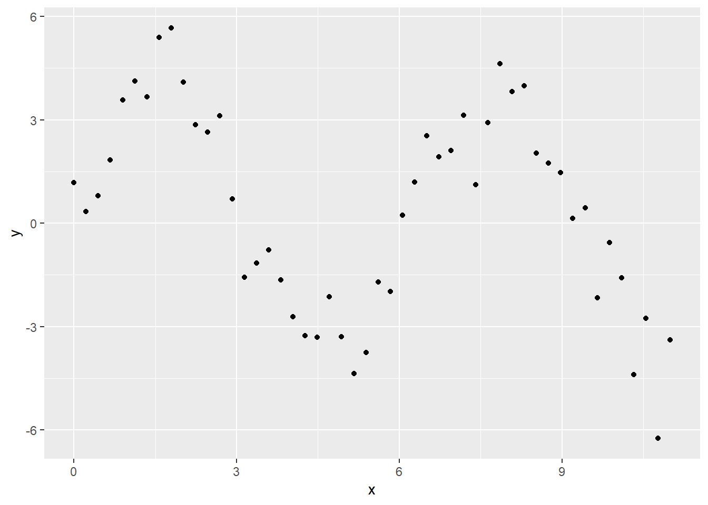
    
    
    
    ```r
    mod1 <- lm(y ~ splines::ns(x, 1), data = sim5)
    mod2 <- lm(y ~ splines::ns(x, 2), data = sim5)
    mod3 <- lm(y ~ splines::ns(x, 3), data = sim5)
    mod4 <- lm(y ~ splines::ns(x, 4), data = sim5)
    mod5 <- lm(y ~ splines::ns(x, 5), data = sim5)
    
    grid <- sim5 %>% 
      data_grid(x = modelr::seq_range(x, n = 50, expand = 0.1)) %>% 
      gather_predictions(mod1, mod2, mod3, mod4, mod5, .pred = "y")
    
    ggplot(sim5, aes(x, y)) + 
      geom_point() +
      geom_line(data = grid, colour = "red") +
      facet_wrap(~ model)
    ```
    
    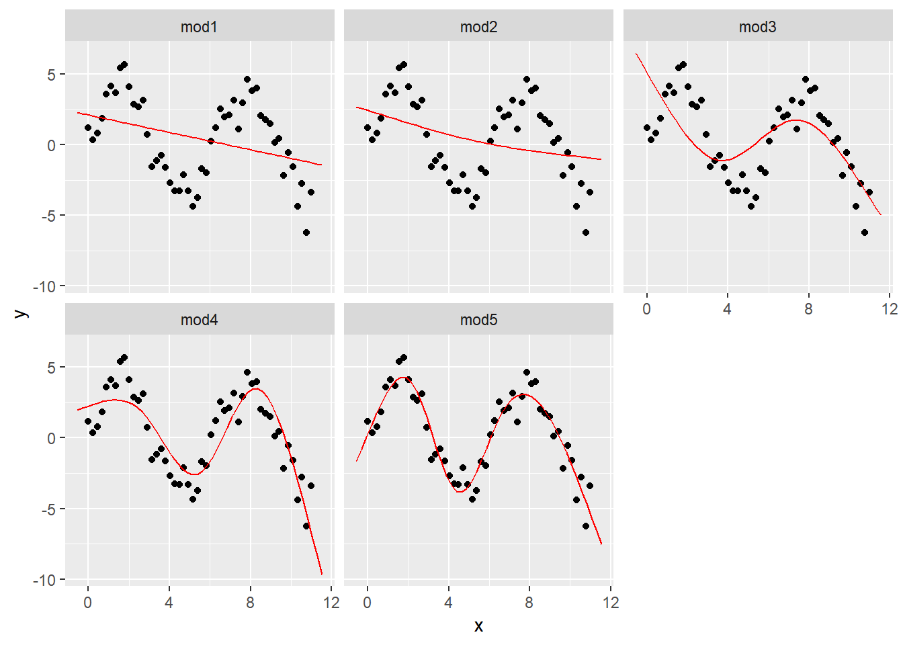
    
    *Notice that model with 5 degrees of freedom is able to now roughly approximate the model
    
    *Below are notes on performance of splines vs polynomials when extrapolating data*
    
    ```r
    sim5.1 <- tibble(
      x = seq(-pi, 4.5 * pi, length = 50),
      y = 4 * sin(x) + rnorm(length(x))
    )
    ```
    
    Plot the models that used `ns` for natural splines
    
    ```r
    grid <- sim5.1 %>% 
      data_grid(x = modelr::seq_range(x, n = 50, expand = 0.1)) %>% 
      gather_predictions(mod1, mod2, mod3, mod4, mod5, .pred = "y")
    
    ggplot(sim5.1, aes(x, y)) + 
      geom_point() +
      geom_line(data = grid, colour = "red") +
      facet_wrap(~ model)
    ```
    
    
    
    * Notice 5 degrees of freedom only allows it to mirror up-down-up-down, representing behavior of 5th degree polynomial, extrapolating outside of this performance is poor  
      
    *Build equivalent models using `poly`*
    
    
    ```r
    mod1 <- lm(y ~ poly(x, 1), data = sim5)
    mod2 <- lm(y ~ poly(x, 2), data = sim5)
    mod3 <- lm(y ~ poly(x, 3), data = sim5)
    mod4 <- lm(y ~ poly(x, 4), data = sim5)
    mod5 <- lm(y ~ poly(x, 5), data = sim5)
    ```
  
    
    ```r
    grid <- sim5.1 %>% 
      data_grid(x = modelr::seq_range(x, n = 50, expand = 0.1)) %>% 
      gather_predictions(mod1, mod2, mod3, mod4, mod5, .pred = "y")
    
    ggplot(sim5.1, aes(x, y)) + 
      geom_point() +
      geom_line(data = grid, colour = "red") +
      facet_wrap(~ model)
    ```
    
    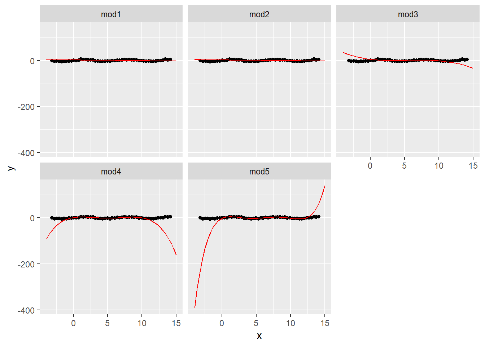
  
    * Performance on extrapolation becomes much worse for the polynomial though
    * Notice that the values cover a much larger codomain that is much farther from the actual data once extended.

* `nobs(mod)` see how many observations were used in model building (assuming 'mod' represents a model)
* make dropping of missing values explicit with `options(na.action = na.warn)`
  * to make silent in specific models use e.g. `mod <- lm(y ~ x, data = df, na.action = na.exclude)`


## 23.2: A simple model

### 23.2.1

1.  One downside of the linear model is that it is sensitive to unusual values
    because the distance incorporates a squared term. Fit a linear model to 
    the simulated data below, and visualise the results. Rerun a few times to
    generate different simulated datasets. What do you notice about the model? 
    
    
    ```r
    sim1a <- tibble(
      x = rep(1:10, each = 3),
      y = x * 1.5 + 6 + rt(length(x), df = 2)
    )
    ```

    generate n number of datasets that fit characteristics of sim1a
    
    
    ```r
    sim1a_mult <- tibble(num = 1:500) %>%
      rowwise() %>%
      mutate(data = list(tibble(
        x = rep(1:10, each = 3),
        y = x * 1.5 + 6 + rt(length(x), df = 2)
      ))) %>%
      #undoes rowwise (used to have much more of workflow with rowwise, but have
      #changed to use more of map)
      ungroup()
    
    plots_prep <- sim1a_mult %>% 
      mutate(mods = map(data, ~lm(y ~ x, data = .x))) %>% 
      mutate(preds = map2(data, mods, modelr::add_predictions),
             rmse = map2_dbl(mods, data, modelr::rmse),
             mae = map2_dbl(mods, data, modelr::mae))
    
    plots_prep %>% 
      ggplot(aes(x = "rmse", y = rmse))+
      geom_violin()
    ```
    
    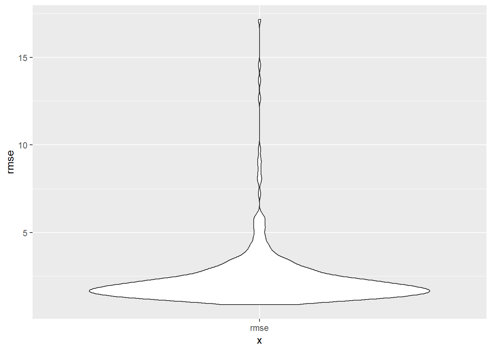
    
    ```r
    plots_prep %>% 
      ggplot(aes(x = "rmse", y = rmse))+
      ggbeeswarm::geom_beeswarm()
    ```
    
    
    
    * as a metric it tends to be more suseptible to outliers, than say mae


1.  One way to make linear models more robust is to use a different distance
    measure. For example, instead of root-mean-squared distance, you could use
    mean-absolute distance:
    
    
    ```r
    measure_distance <- function(mod, data) {
      diff <- data$y - make_prediction(mod, data)
      mean(abs(diff))
    }
    ```
    
    Use `optim()` to fit this model to the simulated data above and compare it 
    to the linear model.
    
    
    ```r
    model_1df <- function(betas, x1 = sim1$x) {
      betas[1] + x1 * betas[2]
    }
    
    measure_mae <- function(mod, data) {
      diff <- data$y - model_1df(betas = mod, data$x)
      mean(abs(diff))
    }
    
    measure_rmse <- function(mod, data) {
      diff <- data$y - model_1df(betas = mod, data$x)
      sqrt(mean(diff^2))
    }
    
    best_mae_sims <- map(sim1a_mult$data, ~optim(c(0,0), measure_mae, data = .x))
    best_rmse_sims <- map(sim1a_mult$data, ~optim(c(0,0), measure_rmse, data = .x))
    ```
    
    
    ```r
    mae_df <- best_mae_sims %>% 
      map("value") %>% 
      transpose() %>% 
      set_names(c("error")) %>% 
      as_tibble() %>% 
      unnest() %>% 
      mutate(error_type = "mae", 
             row_n = row_number())
    
    rmse_df <- best_rmse_sims %>% 
      map("value") %>% 
      transpose() %>% 
      set_names(c("error")) %>% 
      as_tibble() %>% 
      unnest() %>% 
      mutate(error_type = "rmse",
             row_n = row_number())
    
    bind_rows(rmse_df, mae_df) %>% 
      ggplot(aes(x = row_n, colour = error_type))+
      geom_point(aes(y = error))
    ```
    
    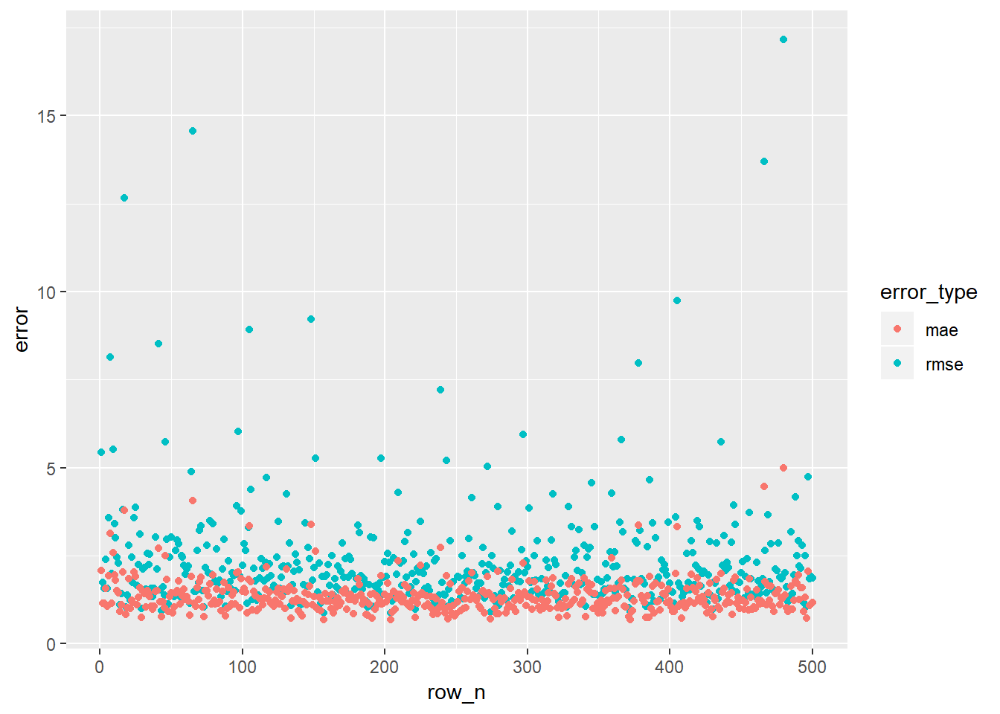
    
    * you can see the error for rmse seems to have more extreme examples
    
    
    ```r
    bind_rows(rmse_df, mae_df) %>% 
      ggplot(aes(x = error_type, colour = error_type))+
      ggbeeswarm::geom_beeswarm(aes(y = error))+
      facet_wrap(~error_type, scales = "free_x")
    ```
    
    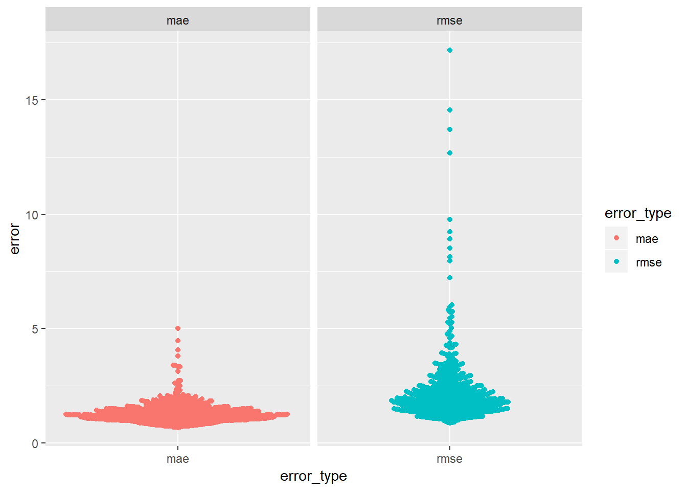
    
    * let's look at differences in the coefficients produced
    
    ```r
    mae_df <- best_mae_sims %>% 
      map("par") %>% 
      transpose() %>% 
      set_names(c("bo", "b1")) %>% 
      as_tibble() %>% 
      unnest() %>% 
      mutate(error_type = "mae", 
             row_n = row_number())
    
    rmse_df <- best_rmse_sims %>% 
      map("par") %>% 
      transpose() %>% 
      set_names(c("bo", "b1")) %>% 
      as_tibble() %>% 
      unnest() %>% 
      mutate(error_type = "rmse",
             row_n = row_number())
    
    bind_rows(rmse_df, mae_df) %>% 
      ggplot(aes(x = bo, colour = error_type))+
      geom_point(aes(y = b1))
    ```
    
    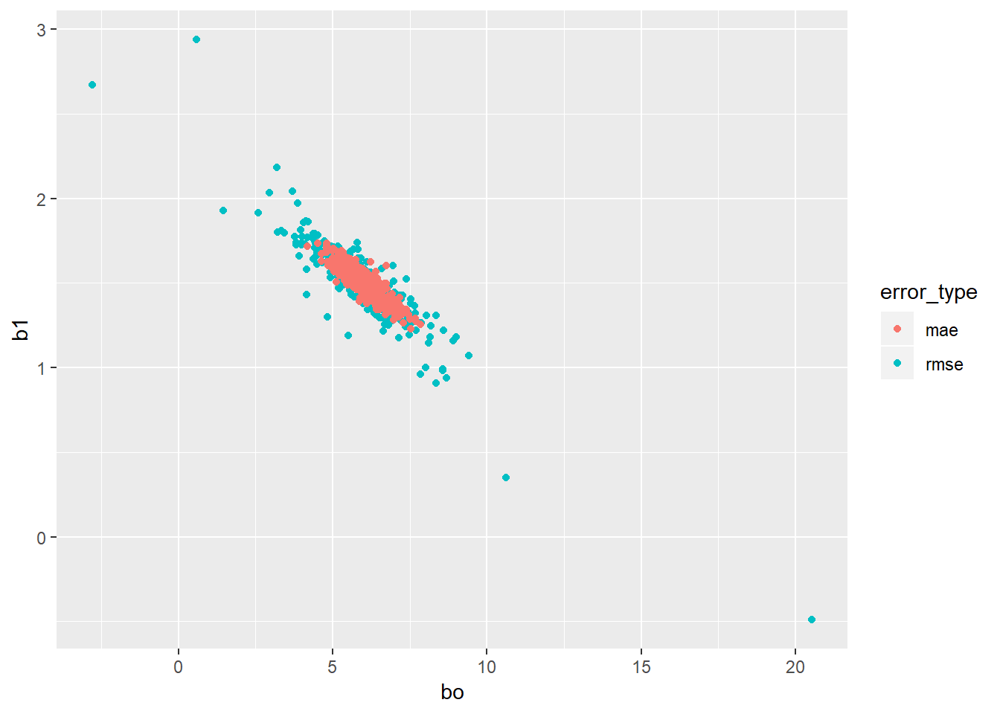
        
    * see more variability in the b1
    * another way of visualizing the variability in coefficients is below
    
    
    ```r
    left_join(rmse_df, mae_df, by = "row_n", suffix = c("_rmse", "_mae")) %>%
      ggplot(aes(x = b1_rmse, y = b1_mae))+
      geom_point()+
      coord_fixed()
    ```
    
    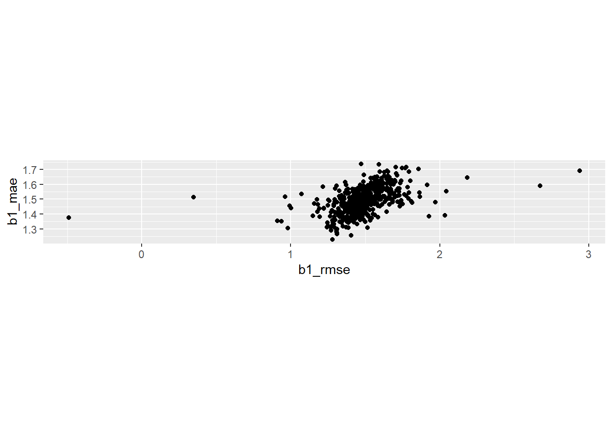

    
1.  One challenge with performing numerical optimisation is that it's only
    guaranteed to find one local optima. What's the problem with optimising
    a three parameter model like this?
    
    
    ```r
    model1 <- function(a, data) {
      a[1] + data$x * a[2] + a[3]
    }
    ```

    * the problem is that is that there are multiple "best" solutions in this example.  a[1] and a[3] together represent the intercept here.

    
    ```r
    models_two <- vector("list", 2)
    
    model1 <- function(a, data) {
      a[1] + data$x * a[2] + a[3]
    }
    
    models_two[[1]] <- optim(c(0, 0, 0), measure_rmse, data = sim1)
    models_two[[1]]$par
    ```
    
    ```
    ## [1]  4.219814  2.051678 -3.049197
    ```
    
    ```r
    model1 <- function(a, data) {
      a[1] + data$x * a[2]
    }
    
    models_two[[2]] <- optim(c(0, 0), measure_rmse, data = sim1)
    
    models_two
    ```
    
    ```
    ## [[1]]
    ## [[1]]$par
    ## [1]  4.219814  2.051678 -3.049197
    ## 
    ## [[1]]$value
    ## [1] 2.128181
    ## 
    ## [[1]]$counts
    ## function gradient 
    ##      110       NA 
    ## 
    ## [[1]]$convergence
    ## [1] 0
    ## 
    ## [[1]]$message
    ## NULL
    ## 
    ## 
    ## [[2]]
    ## [[2]]$par
    ## [1] 4.222248 2.051204
    ## 
    ## [[2]]$value
    ## [1] 2.128181
    ## 
    ## [[2]]$counts
    ## function gradient 
    ##       77       NA 
    ## 
    ## [[2]]$convergence
    ## [1] 0
    ## 
    ## [[2]]$message
    ## NULL
    ```

* a1 and a3 are essentially equivalent, so optimizes somewhat arbitrarily, in this case can see the a1+a3 in the 1st (when there are 3 parameters) is equal to a1 in the 2nd (when there are only two parameters)...
* it would be nice if this spit out a warning of colinearity or something...

## 23.3: Visualising models

### 23.3.3

1.  Instead of using `lm()` to fit a straight line, you can use `loess()`
    to fit a smooth curve. Repeat the process of model fitting, 
    grid generation, predictions, and visualisation on `sim1` using 
    `loess()` instead of `lm()`. How does the result compare to 
    `geom_smooth()`?
        
    
    ```r
    sim1_mod <- lm(y ~ x, data = sim1)
    sim1_mod_loess <- loess(y ~ x, data = sim1)
    
    #Look at plot of points
    sim1 %>% 
      add_predictions(sim1_mod, var = "pred_lin") %>% 
      add_predictions(sim1_mod_loess) %>% 
      add_residuals(sim1_mod_loess) %>%
      ggplot()+
      geom_point(aes(x = x, y = y))+
      geom_line(aes(x = x, y = pred_lin), colour = "dark green", alpha = 0.3, size = 2.5)+
      geom_line(aes(x = x, y = pred), colour = "red", alpha = 0.3, size = 2.5)+
      geom_smooth(aes(x = x, y = y), se = FALSE)
    ```
    
    ```
    ## `geom_smooth()` using method = 'loess' and formula 'y ~ x'
    ```
    
    
    
    * For sim1, the default value for `geom_smooth` is to use loess, os it is the exact same. `geom_smooth` will sometimes use gam or other methods depending on data, note that there is also a `weight` argument that can be useful
    * this relationship looks pretty solidly linear
      * below are some plots of the resids, just for kicks
    
    
    ```r
    sim1 %>% 
      add_predictions(sim1_mod_loess, var = "pred_loess") %>% 
      add_residuals(sim1_mod_loess, var = "resid_loess") %>%
      add_predictions(sim1_mod, var = "pred_lin") %>% 
      add_residuals(sim1_mod, var = "resid_lin") %>%
      # mutate(row_n = row_number) %>% 
      ggplot()+
      geom_ref_line(h = 0)+
      geom_point(aes(x = x, y = resid_loess), colour = "red")+
      geom_point(aes(x = x, y = resid_lin), colour = "blue")
    ```
    
    
    
    
    ```r
    sim1 %>% 
      gather_residuals(sim1_mod, sim1_mod_loess) %>% 
      ggplot()+
      geom_histogram(aes(x = resid))+
      facet_wrap(~model)
    ```
    
    ```
    ## `stat_bin()` using `bins = 30`. Pick better value with `binwidth`.
    ```
    
    

    
1.  `add_predictions()` is paired with `gather_predictions()` and 
    `spread_predictions()`. How do these three functions differ?

    * `spread_predictions()` adds a new `pred` for each model included
    * `gather_predictions()` adds 2 columns `model` and `pred` for each model and repeats the input rows for each model (seems like it would work well with facets)
        
    
    ```r
    sim1 %>% 
      spread_predictions(sim1_mod, sim1_mod_loess)
    ```
    
    ```
    ## # A tibble: 30 x 4
    ##        x     y sim1_mod sim1_mod_loess
    ##    <int> <dbl>    <dbl>          <dbl>
    ##  1     1  4.20     6.27           5.34
    ##  2     1  7.51     6.27           5.34
    ##  3     1  2.13     6.27           5.34
    ##  4     2  8.99     8.32           8.27
    ##  5     2 10.2      8.32           8.27
    ##  6     2 11.3      8.32           8.27
    ##  7     3  7.36    10.4           10.8 
    ##  8     3 10.5     10.4           10.8 
    ##  9     3 10.5     10.4           10.8 
    ## 10     4 12.4     12.4           12.8 
    ## # ... with 20 more rows
    ```
    
    ```r
    #How can I add a prefix when using spread_predictions() ? -- could use the method below
    sim1 %>% 
      gather_predictions(sim1_mod, sim1_mod_loess) %>%
      mutate(model = str_c(model, "_pred")) %>% 
      spread(key = model, value = pred)
    ```
    
    ```
    ## # A tibble: 30 x 4
    ##        x     y sim1_mod_loess_pred sim1_mod_pred
    ##    <int> <dbl>               <dbl>         <dbl>
    ##  1     1  2.13                5.34          6.27
    ##  2     1  4.20                5.34          6.27
    ##  3     1  7.51                5.34          6.27
    ##  4     2  8.99                8.27          8.32
    ##  5     2 10.2                 8.27          8.32
    ##  6     2 11.3                 8.27          8.32
    ##  7     3  7.36               10.8          10.4 
    ##  8     3 10.5                10.8          10.4 
    ##  9     3 10.5                10.8          10.4 
    ## 10     4 11.9                12.8          12.4 
    ## # ... with 20 more rows
    ```
    
    ```r
    #now could add a spread_residuals() without it breaking...
    
    sim1 %>% 
      gather_predictions(sim1_mod, sim1_mod_loess) %>% 
      ggplot()+
      geom_point(aes(x = x, y = y))+
      geom_line(aes(x = x, y = pred))+
      facet_wrap(~model)
    ```
    
    
    
    
1.  What does `geom_ref_line()` do? What package does it come from?
    Why is displaying a reference line in plots showing residuals
    useful and important?
    
    * It comes from ggplot2 and shows either a geom_hline or a geom_vline, depending on whether you specify h or v.  `ggplot2::geom_ref_line`
    
1.  Why might you want to look at a frequency polygon of absolute residuals?
    What are the pros and cons compared to looking at the raw residuals?
    
    * may be good for situations when you have TONS of residuals, and is hard to look at?...
    * pros are it may be easier to get sense of count, cons are that you can't plot it against something like x so patterns associated with residuals will not be picked-up, e.g. heteroskedasticity, or more simply, signs that the model could be improved by incorporating other vars in the model

## 23.4: Formulas and model families

### 23.4.5

1.  What happens if you repeat the analysis of `sim2` using a model without
    an intercept. What happens to the model equation? What happens to the
    predictions?
    
    
    ```r
    mod2 <- lm(y ~ x, data = sim2)
    mod2_NoInt <- lm(y ~ x - 1, data = sim2)
    
    mod2
    ```
    
    ```
    ## 
    ## Call:
    ## lm(formula = y ~ x, data = sim2)
    ## 
    ## Coefficients:
    ## (Intercept)           xb           xc           xd  
    ##      1.1522       6.9639       4.9750       0.7588
    ```
    
    ```r
    mod2_NoInt
    ```
    
    ```
    ## 
    ## Call:
    ## lm(formula = y ~ x - 1, data = sim2)
    ## 
    ## Coefficients:
    ##    xa     xb     xc     xd  
    ## 1.152  8.116  6.127  1.911
    ```
    
    * you have an ANOVA analysis, one of the variables takes on the value of the intercept, the others all have the value of the intercept added to them.
      
1.  Use `model_matrix()` to explore the equations generated for the models
    I fit to `sim3` and `sim4`. Why is `*` a good shorthand for interaction?
    
    ```r
    model_matrix(y ~ x1*x2, data = sim3)
    ```
    
    ```
    ## # A tibble: 120 x 8
    ##    `(Intercept)`    x1   x2b   x2c   x2d `x1:x2b` `x1:x2c` `x1:x2d`
    ##            <dbl> <dbl> <dbl> <dbl> <dbl>    <dbl>    <dbl>    <dbl>
    ##  1             1     1     0     0     0        0        0        0
    ##  2             1     1     0     0     0        0        0        0
    ##  3             1     1     0     0     0        0        0        0
    ##  4             1     1     1     0     0        1        0        0
    ##  5             1     1     1     0     0        1        0        0
    ##  6             1     1     1     0     0        1        0        0
    ##  7             1     1     0     1     0        0        1        0
    ##  8             1     1     0     1     0        0        1        0
    ##  9             1     1     0     1     0        0        1        0
    ## 10             1     1     0     0     1        0        0        1
    ## # ... with 110 more rows
    ```
    
    ```r
    model_matrix(y ~ x1*x2, data = sim4)
    ```
    
    ```
    ## # A tibble: 300 x 4
    ##    `(Intercept)`    x1     x2 `x1:x2`
    ##            <dbl> <dbl>  <dbl>   <dbl>
    ##  1             1    -1 -1       1    
    ##  2             1    -1 -1       1    
    ##  3             1    -1 -1       1    
    ##  4             1    -1 -0.778   0.778
    ##  5             1    -1 -0.778   0.778
    ##  6             1    -1 -0.778   0.778
    ##  7             1    -1 -0.556   0.556
    ##  8             1    -1 -0.556   0.556
    ##  9             1    -1 -0.556   0.556
    ## 10             1    -1 -0.333   0.333
    ## # ... with 290 more rows
    ```
    
    * because each of the levels are multiplied by one another (just don't have to write in the design variables)
  

1.  Using the basic principles, convert the formulas in the following two models into functions. (Hint: start by converting the categorical variable into 0-1 variables.)
    
    
    ```r
    mod1 <- lm(y ~ x1 + x2, data = sim3)
    mod2 <- lm(y ~ x1 * x2, data = sim3)
    ```
    
    * do later

1.   For `sim4`,  which of `mod1` and `mod2` is better? I think `mod2` does a slightly better job at removing patterns, but it's pretty subtle. Can you come up with a plot to support my claim? 
         
    
    ```r
    mod1 <- lm(y ~ x1 + x2, data = sim4)
    mod2 <- lm(y ~ x1 * x2, data = sim4)
    
    grid <-  modelr::seq_range(sim4$x1, n = 3, pretty = TRUE)
    
    sim4 %>% 
      gather_residuals(mod1, mod2) %>% 
      mutate(resid_abs = (resid)^2) %>% 
      group_by(model) %>% 
      summarise(rmse = sqrt(mean(resid_abs)))
    ```
    
    ```
    ## # A tibble: 2 x 2
    ##   model  rmse
    ##   <chr> <dbl>
    ## 1 mod1   2.10
    ## 2 mod2   2.06
    ```
    
    * The aggregate `rmse` between the two models is nearly the same.
    
    
    ```r
    sim4 %>% 
      gather_residuals(mod1, mod2) %>% 
      ggplot(aes(x = resid, fill = model, group = model))+
      geom_density(alpha = 0.3)
    ```
    
    
    
    * any difference in resids is pretty subtle...
    
    *Let's plot them though and see how their predictions differ*
    
    ```r
    sim4 %>% 
      spread_residuals(mod1, mod2) %>% 
      gather_predictions(mod1, mod2) %>% 
      ggplot(aes(x1, pred, colour = x2, group = x2))+
      geom_line()+
      geom_point(aes(y = y), alpha = 0.3)+
      facet_wrap(~model)
    ```
    
    
    
    * notice subtle difference where for mod2 as x2 decreases, the predicted value for x1 also decreases, this is because the interaciton term between these is positive
    * the values near where x2 and x1 are most near 0 should be where the residuals are most similar
    
    *Plot difference in residuals*


```r
sim4 %>% 
  spread_residuals(mod1, mod2) %>% 
  mutate(mod2_less_mod1 = mod2 - mod1) %>% 
  group_by(x1, x2) %>% 
  summarise(mod2_less_mod1 = mean(mod2_less_mod1) ) %>% 
  ungroup() %>% 
  ggplot(aes(x = x1, y = x2))+
  geom_tile(aes(fill = mod2_less_mod1))+
  geom_text(aes(label = round(mod2_less_mod1, 1)), size = 3)+
  scale_fill_gradient2()
```

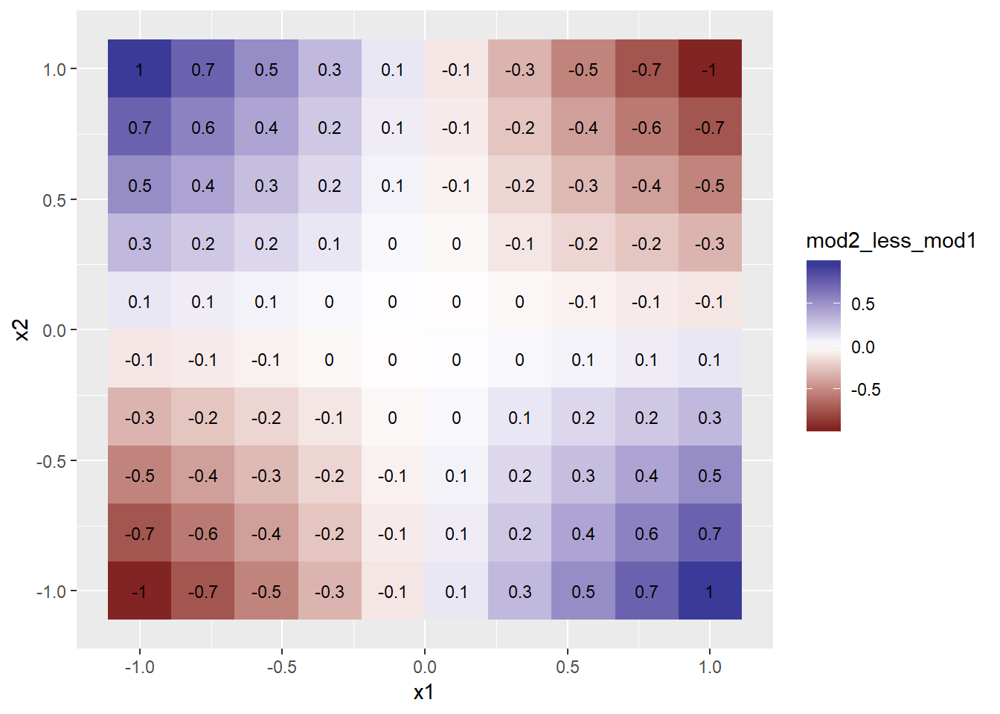

* This shows how `mod2` has higher valued predictions when x1 and x2 are opposite signs compared to the predictions from `mod1`

*Plot difference in distance from 0 between `mod1` and `mod1` resids*

```r
sim4 %>% 
  spread_residuals(mod1, mod2) %>% 
  mutate_at(c("mod1", "mod2"), abs) %>%
  mutate(mod2_less_mod1 = mod2 - mod1) %>% 
  group_by(x1, x2) %>% 
  summarise(mod2_less_mod1 = mean(mod2_less_mod1) ) %>% 
  ungroup() %>% 
  ggplot(aes(x = x1, y = x2))+
  geom_tile(aes(fill = mod2_less_mod1))+
  geom_text(aes(label = round(mod2_less_mod1, 1)), size = 3)+
  scale_fill_gradient2()
```


* see slightly more red than blue indicating that `mod2` may, in general, have slightly smaller residuals on a wider range of locations
  * however very little difference, and I might lean more towards `mod1` for simplicities sake

# Appendix

## Other model families

* __Generalised linear models__, e.g. `stats::glm()`. Linear models assume that
  the response is continuous and the error has a normal distribution. 
  Generalised linear models extend linear models to include non-continuous
  responses (e.g. binary data or counts). They work by defining a distance
  metric based on the statistical idea of likelihood.
  
* __Generalised additive models__, e.g. `mgcv::gam()`, extend generalised
  linear models to incorporate arbitrary smooth functions. That means you can
  write a formula like `y ~ s(x)` which becomes an equation like 
  `y = f(x)` and let `gam()` estimate what that function is (subject to some
  smoothness constraints to make the problem tractable).
  
* __Penalised linear models__, e.g. `glmnet::glmnet()`, add a penalty term to
  the distance that penalises complex models (as defined by the distance 
  between the parameter vector and the origin). This tends to make
  models that generalise better to new datasets from the same population.

* __Robust linear models__, e.g. `MASS:rlm()`, tweak the distance to downweight 
  points that are very far away. This makes them less sensitive to the presence
  of outliers, at the cost of being not quite as good when there are no 
  outliers.
  
* __Trees__, e.g. `rpart::rpart()`, attack the problem in a completely different
  way than linear models. They fit a piece-wise constant model, splitting the
  data into progressively smaller and smaller pieces. Trees aren't terribly
  effective by themselves, but they are very powerful when used in aggregate
  by models like __random forests__ (e.g. `randomForest::randomForest()`) or 
  __gradient boosting machines__ (e.g. `xgboost::xgboost`.)
  
## 23.2 book example


```r
models <- tibble(
  a1 = runif(250, -20, 40),
  a2 = runif(250, -5, 5)
)

ggplot(sim1, aes(x,y))+
  geom_abline(aes(intercept = a1, slope = a2), data = models, alpha = 0.25)+
  geom_point()
```

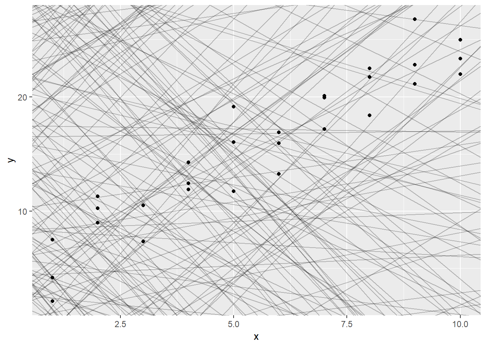

Next, lets set-up a way to calculate the distance between predicted value and each point. 

```r
models_error <- models %>% 
  mutate(preds = map2(.y = a1, .x = a2, ~mutate(sim1, 
                                                pred = .x*x + .y,
                                                resid = y - pred,
                                                error_squared = (y - pred)^2,
                                                error_abs = abs(y - pred))),
         rmse = map_dbl(preds, ~(with(.x, mean(error_squared)) %>% sqrt(.))),
         mae = map_dbl(preds, ~with(.x, mean(error_abs))),
         rank_rmse = min_rank(rmse))
```


```r
ggplot(sim1, aes(x, y))+
  geom_abline(aes(intercept = a1, slope = a2, colour = -rmse), 
              data = filter(models_error, rank_rmse <= 10))+
  geom_point()  
```


Could instead plot this as a model of a1 vs a2 and whichever does the best


```r
models_error %>% 
  ggplot(aes(x = a1, y = a2))+
  geom_point(colour = "red", size = 4, data = filter(models_error, rank_rmse < 15))+
  geom_point(aes(colour = -rmse))
```

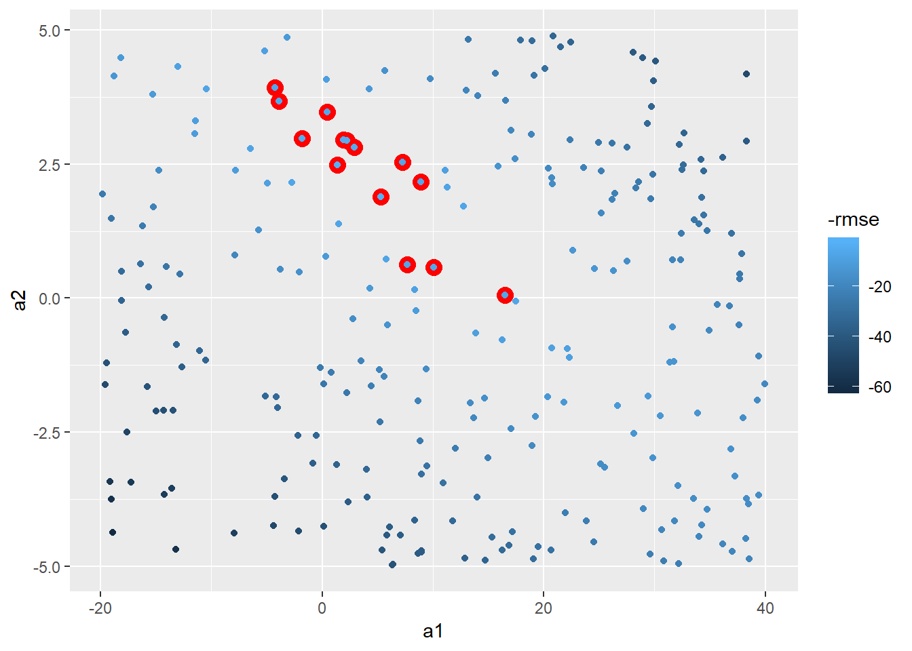

*Could be more methodical and use Grid Search.* Let's use the min and max points of the top 15 to set.


```r
#need helper function because distance function expects the model as a numeric vector of length 2
sim1_rmse <- function(b0, b1, df = sim1, x = "x", y = "y"){
  ((b0 + b1*df[[x]]) - df[[y]])^2 %>% mean() %>% sqrt()
}

sim1_rmse(2,3)
```

```
## [1] 4.574414
```


```r
grid_space <- models_error %>% 
  filter(rank_rmse < 15) %>% 
  summarise(min_x = min(a1),
            max_x = max(a1),
            min_y = min(a2),
            max_y = max(a2))

grid_models <- data_grid(grid_space, 
  a1 = seq(min_x, max_x, length = 25),
  a2 = seq(min_y, max_y, length = 25)
) %>% 
  mutate(rmse = map2_dbl(a1, a2, sim1_rmse, df = sim1))

grid_models %>% 
  ggplot(aes(x = a1, y = a2))+
  geom_point(colour = "red", size = 4, data = filter(grid_models, min_rank(rmse) < 15))+
  geom_point(aes(colour = -rmse))
```


In the future add-in a grid-search that would have used PCA to first rotate axes and then do min and max values.

Could instead use Newton-Raphson search with `optim`

```r
model_1df <- function(betas, x1 = sim1$x) {
  betas[1] + x1 * betas[2]
}

measure_rmse <- function(mod, data) {
  diff <- data$y - model_1df(betas = mod, data$x)
  sqrt(mean(diff^2))
}

best_rmse <- optim(c(0,0), measure_rmse, data = sim1)

best_rmse$par
```

```
## [1] 4.222248 2.051204
```

```r
best_rmse$value
```

```
## [1] 2.128181
```

Above is equivalent to R's `lm` function

```r
sim1_mod <- lm(y ~ x, data = sim1)

sim1_mod %>% coef
```

```
## (Intercept)           x 
##    4.220822    2.051533
```

```r
rmse(sim1_mod, sim1)
```

```
## [1] 2.128181
```

* Notice are *slightly* different, perhaps due to number of steps optim will take

E.g. could build a function for optimizing upon MAE instead and still works

```r
measure_mae <- function(mod, data) {
  diff <- data$y - model_1df(betas = mod, data$x)
  mean(abs(diff))
}

best_mae <- optim(c(0,0), measure_mae, data = sim1)

best_mae$par
```

```
## [1] 4.364852 2.048918
```


### tidy grid_space

Below is a pseudo-tidy way of creating the `grid_space` var from above, it actually took more effort to create this probably, so didn't use. However you could imagine if you had to do this across A LOT of values it could be worth doing it this way

```r
funs_names <- tibble(funs = c(rep("min", 2), rep("max", 2)),
                     coord = rep(c("x", "y"), 2),
                     field_names = str_c(funs, "_", coord))

grid_space <- models_error %>% 
  filter(rank_rmse < 15) %>% 
  select(a1, a2) %>% 
  rep(2) %>% 
  invoke_map(.f = funs_names$funs,
             .x = .) %>% 
  set_names(funs_names$field_names) %>%
  as_tibble()

grid_space
```

```
## # A tibble: 1 x 4
##   min_x  min_y max_x max_y
##   <dbl>  <dbl> <dbl> <dbl>
## 1 -4.29 0.0536  16.5  3.92
```


## 23.4.5.4
Rather than `geom_density` or `geom_freqpoly` let's look at histogram with values overlaid rather than stacked.

    
    ```r
    sim4 %>% 
      gather_residuals(mod1, mod2) %>% 
      ggplot(aes(x = resid, y = ..density.., fill = model))+
      geom_histogram(position = "identity", alpha = 0.3)
    ```
    
    ```
    ## `stat_bin()` using `bins = 30`. Pick better value with `binwidth`.
    ```
    
    

```


<!--chapter:end:23-model-basics.Rmd-->


```r
knitr::opts_chunk$set(echo = TRUE, cache = TRUE, message = FALSE)
```

*Make sure the following packages are installed:*  


# ch. 24: Model building

* `data_grid`, argument: `.model`: if the model needs variables that haven't been supplied explicitly, will auto-fill them with "typical" values; continuous --> median; categorical --> mode
* `MASS:rlm` robust linear model that uses "M estimation by default"
    * warning: MASS::select will clash with dplyr::select, so I usually won't load in MASS explicitly

## 24.2: Why are low quality diamonds more expensive?


```r
# model for only small diamonds
diamonds2 <- diamonds %>% 
  filter(carat <= 2.5) %>% 
  mutate(lprice = log2(price), 
         lcarat = log2(carat))

mod_diamond <- lm(lprice ~ lcarat, data = diamonds2)

mod_diamond2 <- lm(lprice ~ lcarat + color + cut + clarity, data = diamonds2)

diamonds2 <- diamonds2 %>% 
  add_residuals(mod_diamond2, "resid_lg")
```

### 24.2.3

1.  In the plot of `lcarat` vs. `lprice`, there are some bright vertical strips. What do they represent?

    
    ```r
    plot_lc_lp <- diamonds2 %>% 
      ggplot(aes(lcarat, lprice))+
      geom_hex(show.legend = FALSE)
    
    plot_lp_lc <- diamonds2 %>% 
      ggplot(aes(lprice, lcarat))+
      geom_hex(show.legend = FALSE)
    
    plot_lp <- diamonds2 %>%
      ggplot(aes(lprice))+
      geom_histogram(binwidth = .1)
    
    plot_lc <- diamonds2 %>%
      ggplot(aes(lcarat))+
      geom_histogram(binwidth = 0.1)
    
    gridExtra::grid.arrange(plot_lc_lp, plot_lc, plot_lp + coord_flip()) 
    ```
    
    
    
    * The vertical bands correspond with clumps of `carat_lg` values falling across a range of `price_lg` values
    
    *Histogram of `carat` values*
    
    
    ```r
    diamonds2 %>% 
      ggplot(aes(carat))+
      geom_histogram(binwidth = 0.01)+
      scale_x_continuous(breaks = seq(0, 2, 0.1))
    ```
    
    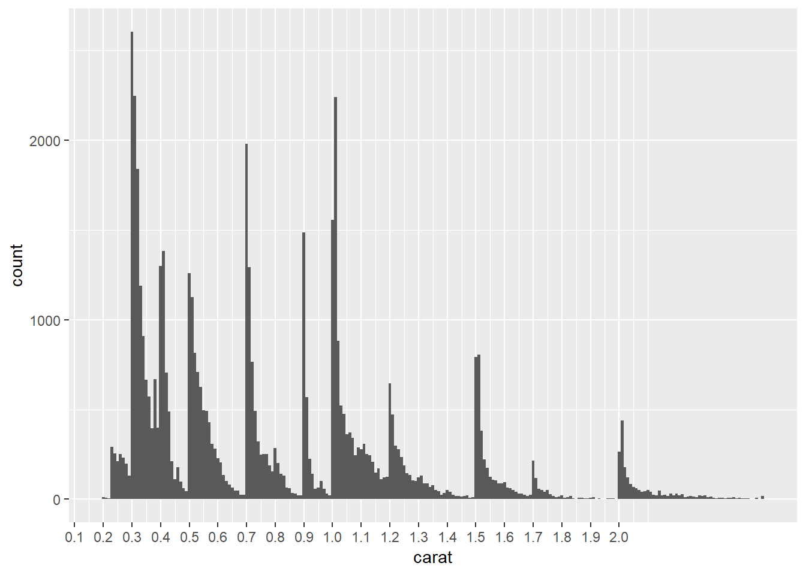
    
    * The chart above shows spikes in carat values at 0.3, 0.4, 0.41, 0.5, 0.7, 0.9, 1.0, 1.01, 1.2, 1.5, 1.7 and 2.0, each distribution spikes at that value and then decreases until hitting the next spike
    * This suggests there is a preference for round numbers ending on tenths
    * It's curious why you don't see really see spikes at 0.6, 0.8, 0.9, 1.1, 1.3, 1.4, 1.6, 1.8, 1.9, it suggests either there is something special about those paricular values -- perhaps diamonds just tend to develop near those sizes so are more available in sizes of 0.7 than say 0.8
    * this article also found similar spikes: https://www.diamdb.com/carat-weight-vs-face-up-size/  as did this: https://www.pricescope.com/wiki/diamonds/diamond-carat-weight , which use different data sets (though they do not explain the spike at 0.9 but no spike at 1.4)
        
1.  If `log(price) = a_0 + a_1 * log(carat)`, what does that say about the relationship between `price` and `carat`?


    * because we're using a natural log it means that an a_1 percentage change in carat corresponds with an a_1 percentage increase in the price
    * if you had used a log base 2 it has a different interpretation that can be thought of in terms of relationship of doubling

1.  Extract the diamonds that have very high and very low residuals. Is there anything unusual about these diamonds? Are they particularly bad or good, or do you think these are pricing errors?

    
    ```r
    extreme_vals <- diamonds2 %>% 
      mutate(extreme_value = (abs(resid_lg) > 1)) %>% 
      filter(extreme_value) %>% 
      add_predictions(mod_diamond2, "pred_lg") %>% 
      mutate(price_pred = 2^(pred_lg))
    
    #graph extreme points as well as line of pred
    diamonds2 %>% 
      add_predictions(mod_diamond2) %>% 
      # mutate(extreme_value = (abs(resid_lg) > 1)) %>% 
      # filter(!extreme_value) %>% 
      ggplot(aes(carat, price))+
      geom_hex(bins = 50)+
      geom_point(aes(carat, price), data = extreme_vals, color = "orange")
    ```
    
    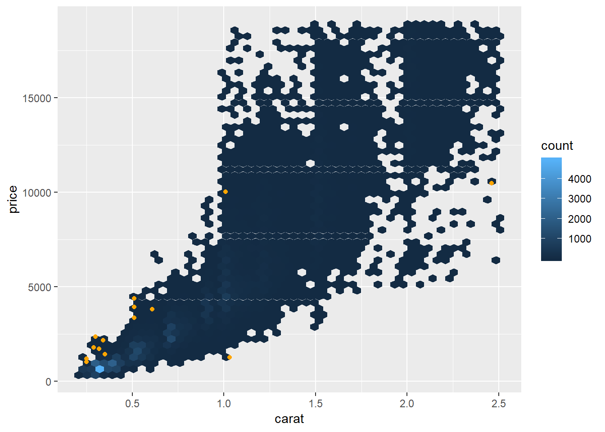
    
    * It's possible some of these these were mislabeled or errors, e.g. an error in typing e.g. 200 miswritten as  2000, though given the wide range in pricing this does not seem like that extreme of a variation.
    
    
    ```r
    diamonds2 %>% 
      add_predictions(mod_diamond2) %>% 
      mutate(extreme_value = (abs(resid_lg) > 1),
             price_pred = 2^pred) %>%
      filter(extreme_value) %>% 
      mutate(multiple = price / price_pred) %>% 
      arrange(desc(multiple)) %>% 
      select(price, price_pred, multiple)
    ```
    
    ```
    ## # A tibble: 16 x 3
    ##    price price_pred multiple
    ##    <int>      <dbl>    <dbl>
    ##  1  2160       314.    6.88 
    ##  2  1776       412.    4.31 
    ##  3  1186       284.    4.17 
    ##  4  1186       284.    4.17 
    ##  5  1013       264.    3.83 
    ##  6  2366       774.    3.05 
    ##  7  1715       576.    2.98 
    ##  8  4368      1705.    2.56 
    ##  9 10011      4048.    2.47 
    ## 10  3807      1540.    2.47 
    ## 11  3360      1373.    2.45 
    ## 12  3920      1705.    2.30 
    ## 13  1415       639.    2.21 
    ## 14  1415       639.    2.21 
    ## 15  1262      2644.    0.477
    ## 16 10470     23622.    0.443
    ```
        
    * If the mislabeling were an issue of e.g. 200 to 2000, you would expect that some of the actual values were ~1/10th or 10x the value of the predicted value. Though none of them appear to have this issue, except for maybe the item that was priced at 2160 but has a price of 314, which is the closest error where the actual value was ~1/10th the value of the prediction

1.  Does the final model, `mod_diamonds2`, do a good job of predicting diamond prices? Would you trust it to tell you how much to spend if you were buying a diamond?

    
    ```r
    perc_unexplained <- diamonds2 %>% 
      add_predictions(mod_diamond2, "pred") %>% 
      mutate(pred_2 = 2^pred,
             mean_price = mean(price),
             error_deviation = (price - pred_2)^2,
             reg_deviation = (pred_2 - mean_price)^2,
             tot_deviation = (price - mean_price)^2) %>% 
      summarise(R_squared = sum(error_deviation) / sum(tot_deviation)) %>% 
      flatten_dbl()
      
    1 - perc_unexplained
    ```
    
    ```
    ## [1] 0.9653255
    ```
    
    * ~96.5% of variance is explained by model which seems pretty solid, though is relative to each situation
    * See [24.2.3.3] for other considerations, though even this is very incomplete. Would want to check a variety of other metrics to further evaluate trust.

## 24.3 What affects the number of daily flights?

These were some useful notes copied from this section of the chapter

```r
daily <- flights %>% 
  mutate(date = make_date(year, month, day)) %>% 
  count(date)

daily <- daily %>% 
  mutate(month = month(date, label = TRUE))

daily <- daily %>% 
  mutate(wday = wday(date, label = TRUE))


term <- function(date) {
  cut(date, 
    breaks = ymd(20130101, 20130605, 20130825, 20140101),
    labels = c("spring", "summer", "fall") 
  )
}

daily <- daily %>% 
  mutate(term = term(date))

daily %>% 
  filter(wday == "Sat") %>% 
  ggplot(aes(date, n, colour = term))+
  geom_point(alpha = .3)+
  geom_line()+
  scale_x_date(NULL, date_breaks = "1 month", date_labels = "%b")
```


### 24.3.5 

1.  Use your Google sleuthing skills to brainstorm why there were fewer than expected flights on Jan 20, May 26, and Sep 1. (Hint: they all have the same explanation.) How would these days generalise to another year?

    * January 20th was the day for MLK day^[it was also the 2nd inauguration for Obama]
    * May 26th was the day before Memorial Day weekend
    * September 1st was the day before labor day
    
    Based on the above, it seems a variable representing "holiday" or "holiday weekend" may be valuable.

1.  What do the three days with high positive residuals represent? How would these days generalise to another year?

    
    ```r
    daily <- flights %>% 
      mutate(date = make_date(year, month, day)) %>% 
      count(date)
    
    daily <- daily %>% 
      mutate(wday = wday(date, label = TRUE))
    ```
    
    
    ```r
    mod <- lm(n ~ wday, data = daily)
    
    daily <- daily %>% 
      add_residuals(mod)
    
    daily %>% 
      top_n(3, resid)
    ```
    
    ```
    ## # A tibble: 3 x 4
    ##   date           n wday  resid
    ##   <date>     <int> <ord> <dbl>
    ## 1 2013-11-30   857 Sat   112. 
    ## 2 2013-12-01   987 Sun    95.5
    ## 3 2013-12-28   814 Sat    69.4
    ```

    * these days correspond with the Saturday and Sunday of Thanksgiving, as well as the Saturday after Christmas
    * these days can fall on different days of the week each year so would vary from year to year depending on which day they fell on
        * ideally you would include some "holiday" variable to help capture the impact of these / better generalise between years
        
    *Check the absolute values*
    
    ```r
    daily %>% 
      top_n(3, abs(resid))
    ```
    
    ```
    ## # A tibble: 3 x 4
    ##   date           n wday  resid
    ##   <date>     <int> <ord> <dbl>
    ## 1 2013-11-28   634 Thu   -332.
    ## 2 2013-11-29   661 Fri   -306.
    ## 3 2013-12-25   719 Wed   -244.
    ```

    *  The days with the greatest magnitude for residuals were on Christmast Day, Thanksgiving Day, and the day after Thanksgiving

1.  Create a new variable that splits the `wday` variable into terms, but only for Saturdays, i.e. it should have `Thurs`, `Fri`, but `Sat-summer`, `Sat-spring`, `Sat-fall`. How does this model compare with the model with every combination of `wday` and `term`?
    
    
    ```r
    term <- function(date) {
      cut(date, 
        breaks = ymd(20130101, 20130605, 20130825, 20140101),
        labels = c("spring", "summer", "fall") 
      )
    }
    
    daily <- daily %>% 
      mutate(term = term(date))
    
    # example with wday_mod
    Example_term_with_sat <- daily %>% 
      mutate(wday_mod = ifelse(wday == "Sat", paste(wday, "_", term), wday)) %>%
      lm(n ~ wday_mod, data = .)
            
    # just wday
    wkday <- daily %>% 
      lm(n ~ wday, data = .)
    
    # wday and term, no interaction...
    wkday_term <- daily %>% 
      mutate(wday_mod = ifelse(wday == "Sat", paste(wday, "_", term), wday)) %>%
      lm(n ~ wday + term, data = .)
    
    # wday and term, interaction
    wkday_term_interaction <- daily %>% 
      mutate(wday_mod = ifelse(wday == "Sat", paste(wday, "_", term), wday)) %>%
      lm(n ~ wday*term, data = .)
    
    daily %>% 
      mutate(wday_mod = ifelse(wday == "Sat", paste(wday, "_", term), wday)) %>%
      gather_predictions(Example_term_with_sat, wkday, wkday_term, wkday_term_interaction) %>% 
      ggplot(aes(date, pred, colour = wday))+
      geom_point()+
      geom_line()+
      facet_wrap(~model, ncol = 1)
    ```
    
    
    
    * In the example, saturday has different predicted number of flights in the summer
        * when just including `wkday` you don't see this differentiation
        * when including `wkday` and `term` you see differentiation in the summer, though this difference is the same across all `wday`s, hence the increased number for Saturday's is less than it shows-up as as compared to either the example (where the term is only interacted with for Saturday) or the `wkday_term_interaction` chart where the interaciton is allowed for each day of the week
        * you see increases in flights across pretty much all `wday`s in summer, though you see the biggest difference in Saturday^[Interactions facilitate encoding these types of conditional relationships, i.e. the impact of summer depends on the day of the week (/ vice versa)]
    
    *Residuals of these models*
    
    ```r
    daily %>% 
      mutate(wday_mod = ifelse(wday == "Sat", paste(wday, "_", term), wday)) %>%
      gather_residuals(Example_term_with_sat, wkday, wkday_term, wkday_term_interaction) %>% 
      ggplot(aes(date, resid, colour = wday))+
      geom_point()+
      geom_line()+
      facet_wrap(~model, ncol = 1)
    ```
    
    
    
    * The graphs with saturday term and interaction across terms do not show gross changes in residuals varying by season the way the models that included just weekday or weekday and term without an interaction do.
    * note that you have a few days with large negative residuals^[Remember this corresponds with days where the predictions are higher than the actuals.] 
        * these likely correspond with holidays
    
1.  Create a new `wday` variable that combines the day of week, term (for Saturdays), and public holidays. What do the residuals of that model look like?

    *Create dataset of federal holidays*
    
    ```r
    # holiday's that could have been added: Easter, black friday
    # consider adding a filter to remove Columbus day and perhaps Veteran's day
    holidays <- tribble(
      ~HolidayName, ~HolidayDate,
      "New Year's", "2013-01-01",
      "MLK", "2013-01-21",
      "President's Day", "2013-02-18", 
      "Memorial Day", "2013-05-27",
      "Independene Day", "2013-07-04",
      "Labor Day", "2013-09-02",
      "Columbus Day", "2013-10-14",
      "Veteran's Day", "2013-11-11",
      "Thanksgiving", "2013-11-28",
      "Christmas Day", "2013-12-25"
    ) %>% 
      mutate(HolidayDate = ymd(HolidayDate))
    ```
    
    Create model with Holiday variable
    
    ```r
    Example_term_with_sat_holiday <- daily %>% 
      mutate(wday_mod = ifelse(wday == "Sat", paste(wday, "_", term), wday)) %>%
      left_join(holidays, by = c("date" = "HolidayDate")) %>% 
      mutate(Holiday = !is.na(HolidayName)) %>% 
      lm(n ~ wday_mod + Holiday, data = .)
    ```
    
    Look at residuals of model
    
    ```r
    daily %>% 
      mutate(wday_mod = ifelse(wday == "Sat", paste(wday, "_", term), wday)) %>%
      left_join(holidays, by = c("date" = "HolidayDate")) %>% 
      mutate(Holiday = !is.na(HolidayName)) %>% 
      gather_residuals(Example_term_with_sat_holiday, Example_term_with_sat) %>% 
      ggplot(aes(date, resid, colour = wday))+
      geom_point()+
      geom_line()+
      facet_wrap(~model, ncol = 1)
    ```
    
    
    
    * Notice the residuals for day's like July 4th and Christas are closer to 0 now, though residuals for smaller holidays like MLK, President's, Columbus, and Veteran's Day are now positive when before they did not have such noticable abberations
    * Suggests that just "holiday" is not enough to capture the relationship
        * In [24.3.5.4] I show how to create a "near holiday" variable (though I do not add any new analysis after creating this)
    
1.  What happens if you fit a day of week effect that varies by month (i.e. `n ~ wday * month`)? Why is this not very helpful? 

    *Create model*
    
    ```r
    week_month <- daily %>% 
      mutate(month = month(date) %>% as.factor()) %>% 
      lm(n ~ wday * month, data = .)
    ```
    
    *Graph predictions*
    (with `n ~ wday * term` as the comparison)
    
    ```r
    daily %>% 
      mutate(month = month(date) %>% as.factor()) %>% 
      gather_predictions(wkday_term_interaction, week_month) %>% 
      ggplot(aes(date, pred, colour = wday))+
      geom_point()+
      geom_line()+
      facet_wrap(~model, ncol = 1)
    ```
    
    
    
    * This model has the most flexibility / inputs, though this makes the pattern harder to follow / interpret
    * Certain decreases in the month to month model are difficult to explain, for example the decrease in the month of May
    
    *Graph residuals*
    (with `n ~ wday * term` as the comparison)
    
    ```r
    daily %>% 
      mutate(month = month(date) %>% as.factor()) %>% 
      gather_residuals(wkday_term_interaction, week_month) %>% 
      ggplot(aes(date, resid, colour = wday))+
      geom_point()+
      geom_line()+
      facet_wrap(~model, ncol = 1)
    ```
    
    
    
    The residuals seem to partially explain some of these inexplicable ups / downs: 
    
    * For the model that incorporates an interaciton with month, you see the residuals in months with a holiday tend to cause the associated day of the week the holiday fell on to then have high residuals on the non-holiday days, an effect thta is less pronounced on the models interacted with `term`
        * The reason for this is that for the monthly variables there are only 4-5 week days in each month, so a holiday on one of these can substantially impact the expected number of flights on the weekend in that month (i.e. the prediction is based just on 4-5 observations). For the term interaction you have more like 12 observations to get an expected value, so while there is still an aberration on that day, the other days predictioins are less affected
    
    Questions such as this fall into the general space of balancing "bias" vs. "variance"
    

1.  What would you expect the model `n ~ wday + ns(date, 5)` to look like? Knowing what you know about the data, why would you expect it to be not particularly effective?

    I would expect to see a similar overall pattern, but with more smoothed affects. Let's check what these actually look like below.
    
    
    ```r
    wkday_term_ns <- daily %>% 
      mutate(wday_mod = ifelse(wday == "Sat", paste(wday, "_", term), wday)) %>% 
      lm(n ~ wday + splines::ns(date, 5), data = .)
    
    wkday_term_interaction_ns <- lm(n ~ wday * splines::ns(date, 5), data = daily)
    ```
    
    Look at predictions
    (light grey are actuals)
    
    ```r
    daily %>% 
      mutate(wday_mod = ifelse(wday == "Sat", paste(wday, "_", term), wday)) %>% 
      gather_predictions(wkday_term_ns, wkday_term_interaction_ns) %>% 
      ggplot(aes(date, pred, colour = wday))+
      geom_point()+
      geom_line(aes(x = date, y = n, group = wday), colour = "grey", alpha = 0.5)+
      geom_line()+
      facet_wrap(~model, ncol = 1)
    ```
    
    
    
    Look at residuals
    (in light grey are actuals)
    
    ```r
    daily %>% 
      mutate(wday_mod = ifelse(wday == "Sat", paste(wday, "_", term), wday)) %>% 
      gather_residuals(wkday_term_ns, wkday_term_interaction_ns) %>% 
      ggplot(aes(date, resid, colour = wday))+
      geom_point()+
      geom_line(aes(x = date, y = n, group = wday), colour = "grey", alpha = 0.5)+
      geom_line()+
      facet_wrap(~model, ncol = 1)
    ```
    
    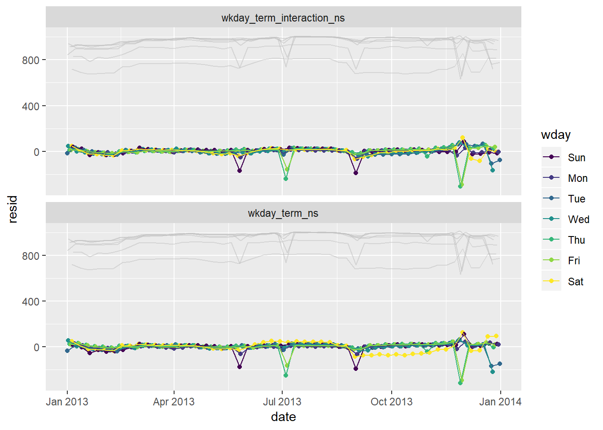


1.  We hypothesised that people leaving on Sundays are more likely to be business travellers who need to be somewhere on Monday. Explore that hypothesis by seeing how it breaks down based on distance and time: if it's true, you'd expect to see more Sunday evening flights to places that are far away.

    
    ```r
    flights %>% 
      mutate(date = lubridate::make_date(year, month, day),
             wday = wday(date, label = TRUE)) %>% 
      select(date, wday, distance) %>%
      filter(distance < 3000) %>% 
      ggplot(aes(wday, distance))+
      geom_boxplot()
    ```
    
    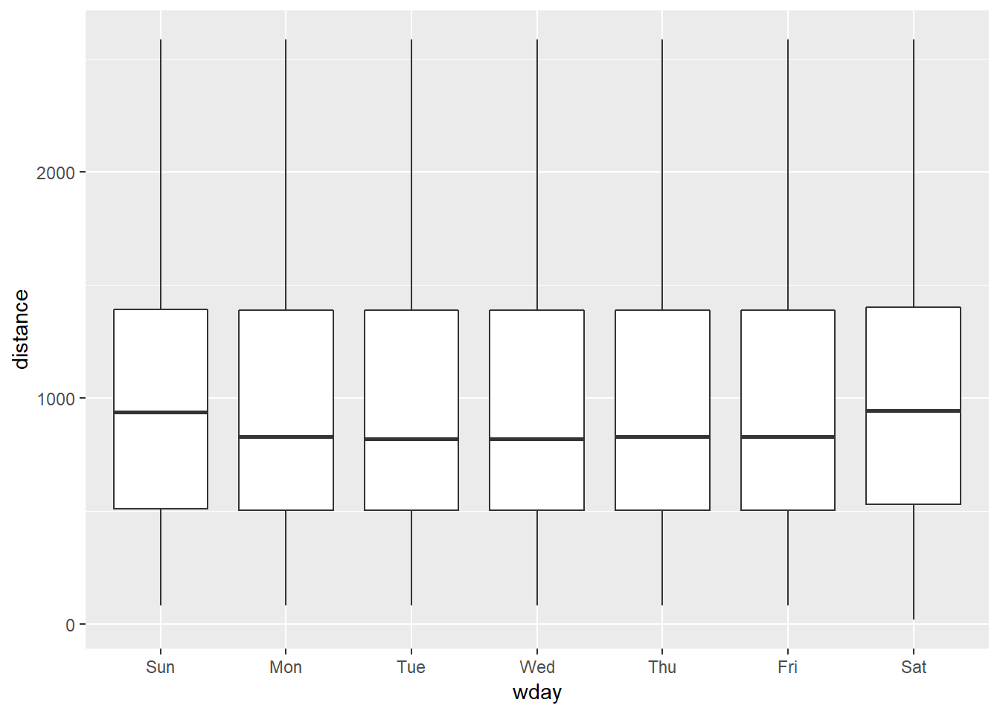
    
    * 25th and 75th percentiles aren't different, but median is a little higher
    * the same is the case for Saturday travel which does not seem to fit into this hypothesis as neatly. The effect seems more general to the weekend than just Saturday, and there seem like there may be other potential explanations than "business travel"

1.  It's a little frustrating that Sunday and Saturday are on separate ends of the plot. Write a small function to set the levels of the factor so that the week starts on Monday.

    
    ```r
    wday_modified <- function(date){
      date_order <- (wday(date) + 5) %% 7
      date <- wday(date, label = TRUE) %>% fct_reorder(date_order)
      date
    }
    
    flights %>% 
      mutate(date = lubridate::make_date(year, month, day),
             wday = wday_modified(date)) %>% 
      select(date, wday, distance) %>%
      filter(distance < 3000) %>% 
      ggplot(aes(wday, distance))+
      geom_boxplot()
    ```
    
    


# Appendix

## 24.2.3.3
Plots of extreme values against a sample and colored by some of the key attributes

*Plots of extreme values against carat, price, clarity*

```r
diamonds2 %>% 
  add_predictions(mod_diamond2) %>% 
  sample_n(5000) %>% 
  ggplot(aes(carat, price))+
  geom_point(aes(carat, price, colour = clarity), alpha = 0.5)+
  geom_point(aes(carat, price, colour = clarity), data = extreme_vals, size = 3)
```


*Plots of extreme values against carat, price, cut*

```r
diamonds2 %>% 
  add_predictions(mod_diamond2) %>% 
  sample_n(5000) %>% 
  ggplot(aes(carat, price))+
  # geom_hex(bins = 50)+
  geom_point(aes(carat, price, colour = cut), alpha = 0.5)+
  geom_point(aes(carat, price, colour = cut), data = extreme_vals, size = 3)
```

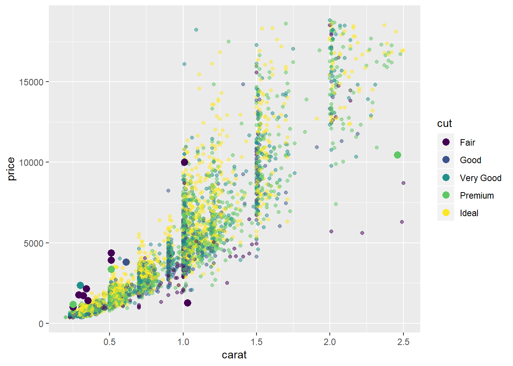

## 24.2.3.4

### heteroskedasticity
Note that heteroskedasticity is one (of several other) important considerations that would be important when deciding how much you trust the model.

*residual vs lprice*

```r
diamonds2 %>% 
  add_residuals(mod_diamond2) %>% 
  ggplot(aes(lprice, resid))+
  geom_hex()
```


* the log transformation helped to ensure our residuals did not have heteroskedasticity against the predictor

*residual (transformed) vs price*
(`resid_transformed` represents the residual against the residual after transforming it from a prediction for `log2(price)` to a prediction for `price`)

```r
diamonds2 %>% 
  add_predictions(mod_diamond2) %>% 
  mutate(resid_transformed = price - 2^(pred)) %>% 
  ggplot(aes(price, resid_transformed))+
  geom_hex()
```


* This is what heteroskedasticity looks like


*residual (transformed) vs log price*
(`resid_transformed` represents the residual against the residual after transforming it from a prediction for `log2(price)` to a prediction for `price`)

```r
# resid v lprice (% change on x resid)
diamonds2 %>% 
  add_predictions(mod_diamond2) %>% 
  mutate(resid_transformed = price - 2^(pred)) %>% 
  ggplot(aes(lprice, resid_transformed))+
  geom_hex()
```


### rsquared on logged values
**(incorrect)**
This is what I did initially. Below I calculate the R^2 on the log values. Within the exercise solution I decided to report the R^2 when calculated on `2^pred`. This has the more useful interpretation of representing the percentage of the variance on the actual price that the model captures, which seems more appropriate in some ways. This question about which is more appropriate to report may be worth revisiting in the future.

```r
#to see if I'm doing it right let's calculate the R_squared of the model using this technique
ss_res <-  diamonds2 %>% 
  add_predictions(mod_diamond2) %>% 
  mutate(extreme_value = (abs(resid_lg) > 1),
         pred_exp = 2^(pred),
         squ_mod = (log2(price) - pred)^2,
         squ_error = (log2(price) - mean(log2(price)))^2) %>% 
  .$squ_mod %>% sum()

ss_tot <- diamonds2 %>% 
  add_predictions(mod_diamond2) %>% 
  mutate(extreme_value = (abs(resid_lg) > 1),
         pred_exp = 2^(pred),
         squ_mod = (log2(price) - pred)^2,
         squ_error = (log2(price) - mean(log2(price)))^2) %>% 
  .$squ_error %>% sum()

# calculated by hand
1 - ss_res / ss_tot
```

```
## [1] 0.9827876
```

```r
# built-in calculation
rsquare(mod_diamond2, diamonds2)
```

```
## [1] 0.9827876
```

The R-squred is ~ 0.983, which means that the model accounts for 98.3% of the variance in price, which seems pretty solid.


## 24.2.3.1
Visualization with horizontal stripes and `lprice` as the focus

```r
# horizontal stripes
gridExtra::grid.arrange(plot_lp_lc, plot_lp, plot_lc + coord_flip()) 
```


* same thing, just change orientation and highlight `lprice` with a histogram

*A few other graphs from this problem*

```r
diamonds2 %>%
  ggplot(aes(price))+
  geom_histogram(binwidth = 50)
```


```r
diamonds2 %>% 
  ggplot(aes(carat))+
  geom_histogram(binwidth = 0.01)
```


Taking the log of price seems to have a bigger impact on the shape of the geom_hex graph

```r
diamonds2 %>% 
  ggplot(aes(carat, lprice))+
  geom_hex(show.legend = FALSE)
```


```r
diamonds2 %>% 
  ggplot(aes(lcarat, price))+
  geom_hex(show.legend = FALSE)
```


### More notes on logs
While taking the log of both price and carat seems to help improve the 'linearity' of the model, perhaps taking the log of the price makes a bigger difference.


```r
# a few other plots
plot_c <- diamonds2 %>%
  ggplot(aes(carat))+
  geom_histogram(binwidth = 0.1)

plot_p <- diamonds2 %>%
  ggplot(aes(price))+
  geom_histogram(binwidth = 10)

plot_c_lp <- diamonds2 %>% 
  ggplot(aes(carat, lprice))+
  geom_hex(show.legend = FALSE)

plot_lc_p <- diamonds2 %>% 
  ggplot(aes(lcarat, price))+
  geom_hex(show.legend = FALSE)


gridExtra::grid.arrange(plot_lc_lp, plot_c_lp, plot_lc_p)
```


* The reason for this may be that the log of the price better resembles a normal distribution than the log of the carat, though taking the log of the carat does also help by, at the least, centering the distribution...


```r
gridExtra::grid.arrange(plot_lp_lc, plot_lp, plot_p)
```


```r
gridExtra::grid.arrange(plot_lc_lp, plot_lc, plot_c)
```

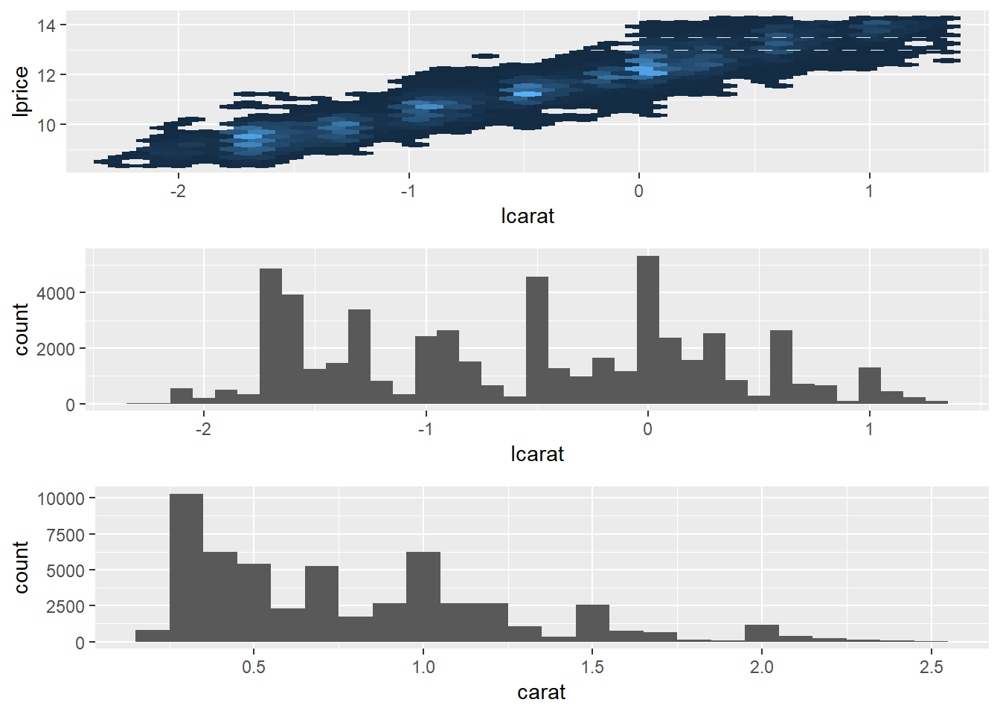

### carat more clumped than price
*(Unnecessary)*
* let's see between price and carat, which causes the appearance of "bands" in the data
* to do this let's look at `geom_hex` when making the accompanying value random

```r
diamonds2 %>% 
  mutate(rand_val = rnorm(n())) %>% 
      ggplot(aes(lcarat, lprice))+
      geom_hex(show.legend = FALSE)
```


```r
diamonds2 %>% 
  mutate(rand_val = rnorm(n())) %>% 
      ggplot(aes(lcarat, rand_val))+
      geom_hex(show.legend = FALSE)
```

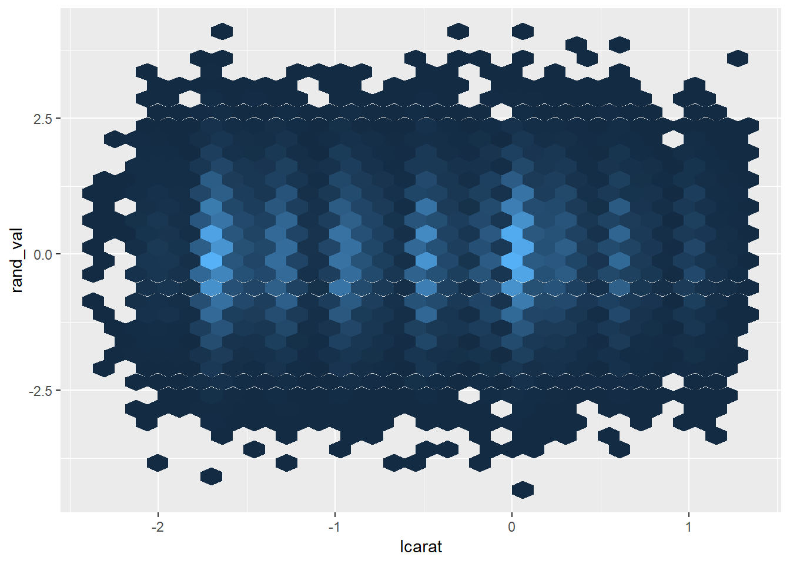

```r
diamonds2 %>% 
  mutate(rand_val = rnorm(n())) %>% 
      ggplot(aes(lprice, rand_val))+
      geom_hex(show.legend = FALSE)
```


* clearly carat are much more clumped
* this check was unnecessary in this case, though the method felt worth saving

## Logs (simulated examples)

### Exponential relationship

Taking the log of a value often centers the distribution which is helpful for getting more normal errors, it's actually not about making the relationship linear per se... but about making the errors normal (and linearlizing the relationship has the effect of doing this). Let's generate some data.

*Review logs on simulated dataset*


```r
set.seed(12)
log_notes_df <- tibble(rand_origin = rnorm(1000, mean = 5),
                       rand_noise = rand_origin + rnorm(1000, mean = 0, sd = 1),
                       rand_exp = 8^rand_noise,
                       rand_exp_log = log2(rand_exp))

# exponential distribution
log_notes_df %>% 
  ggplot(aes(x = rand_exp))+
  geom_histogram()
```

```
## `stat_bin()` using `bins = 30`. Pick better value with `binwidth`.
```


```r
# Then take log base 2 of
# centered at 15 because 8 = 2^3 and it becomes 3*rnorm(mean = 5)
log_notes_df %>% 
  ggplot(aes(x = rand_exp_log))+
  geom_histogram()
```

```
## `stat_bin()` using `bins = 30`. Pick better value with `binwidth`.
```


```r
# The log helped us to uncover the relationship that existed between the original values and the values after some noise was added and then exponentiated
log_notes_df %>% 
  ggplot(aes(x = rand_origin, y = rand_exp_log))+
  geom_hex()
```


```r
  # coord_fixed()


# for every one unit increase in 'rand_origin' we get a ~3 fold increase in the log of the output
# this corresponds with the relationship being 2^3*1 , i.e. 3 comes from 2^3, and the 1 is because there is a 1 to ~1 relationship
log_notes_df %>% 
  lm(rand_exp_log ~ rand_origin, data = .)
```

```
## 
## Call:
## lm(formula = rand_exp_log ~ rand_origin, data = .)
## 
## Coefficients:
## (Intercept)  rand_origin  
##       0.246        2.972
```

* because of the properties of logs and exponents, taking the log transform is robust to linearlizing any exponential relationship regardles of log

### Log log relationship

What happens if you have a log relationship and you take the log of this leading to a log-log relationship?
* You would not need to take the log of a graph in this relationship, but let's look at what happens

```r
log_notes_df2 <- tibble(rand_origin = rnorm(1000, mean = 256, sd = 20),
                       rand_noise = rand_origin + rnorm(1000, mean = 0, sd = 10),
                       rand_log = log2(rand_noise),
                       rand_log_log = log2(rand_log),
                       rand_exp = 2^rand_log)

# centered at 8 because 256 = 2^8 
log_notes_df2 %>% 
  ggplot(aes(x = rand_log))+
  geom_histogram()
```

```
## `stat_bin()` using `bins = 30`. Pick better value with `binwidth`.
```


```r
# centered at 3 because 2^3 = 8
log_notes_df2 %>% 
  ggplot(aes(x = rand_log_log))+
  geom_histogram()
```

```
## `stat_bin()` using `bins = 30`. Pick better value with `binwidth`.
```


```r
log_notes_df2 %>% 
  ggplot(aes(x = rand_log_log, y = rand_origin))+
  geom_hex()
```


* linear relationship still visually seems to exist

Conceptualizing Linear regression can actually get surprisingly complicated.  I'll pull this into a separate blog post at some point.

## Diamonds data review
*(Section arguably unnecessary)*

### carat by mean `table` value
`table` represents the percentage of the max area that is covered by the flat top part of the diamond

```r
diamonds2 %>% 
  group_by(carat) %>% 
  summarise(n = n(),
            sd = sd(table),
            mean = mean(table)) %>% 
  filter(n > 100) %>% 
  ggplot(aes(x = carat, y = mean))+
  geom_point(aes(size = n))+
  geom_line()
```


### Cutoff, Part 1
I get nervous that in the opening example that the diamonds dataset was biased because all values with price over 19000 or carat over 2.5 were removed. This seemed to have the affect of causing larger diamonds to have lower prices than expected. I was worried this might in some way impact the pattern described regarding the residuals across the other dimensions -- so looked at the residuals when building the model on just diamonds with carats less than 0.90. None of the prices seemed to approach 19000 for carats this small so this seemed like a good place to validate the discussion on residuals.

The pattern did indeed hold for even just these small diamonds, so the example Hadley discusses seems appropriate.

*diamonds2 alternative... say that we only want to look at diamonds with carat less than 0.9*

```r
diamonds_test <- diamonds %>% 
  filter(carat <= 0.9) %>%
  mutate_at(vars(price, carat), funs(lg = log2))
```

```
## Warning: funs() is soft deprecated as of dplyr 0.8.0
## please use list() instead
## 
## # Before:
## funs(name = f(.)
## 
## # After: 
## list(name = ~f(.))
## This warning is displayed once per session.
```

```r
mod_diamond <- diamonds_test %>% 
  lm(price_lg ~ carat_lg, data = .)

diamonds2_w_mod <- diamonds_test %>% 
  add_residuals(mod_diamond, "resid_lg")
```

All the patterns Hadley pointed-out seem to hold on this slightly modified dataset

```r
ggplot(diamonds2_w_mod, aes(cut, resid_lg)) + geom_boxplot()
```


```r
ggplot(diamonds2_w_mod, aes(color, resid_lg)) + geom_boxplot()
```


```r
ggplot(diamonds2_w_mod, aes(clarity, resid_lg)) + geom_boxplot()
```


### Cutoff, Part 2

Check if there are differences in coefficients when training on full `diamonds` data set v `diamonds2` dataset

```r
mod_diamonds <- diamonds %>% 
   mutate(lprice = log2(price), 
         lcarat = log2(carat)) %>% 
lm(lprice ~ lcarat, data = .)

mod_diamonds2 <- lm(lprice ~ lcarat, data = diamonds2)

diamonds %>% 
   mutate(lprice = log2(price), 
         lcarat = log2(carat)) %>% 
   spread_predictions(mod_diamonds, mod_diamonds2) %>% 
  sample_n(1000) %>% 
ggplot(aes(x = lcarat, y = lprice))+
  geom_point()+
  geom_line(aes(y = mod_diamonds), colour = "red")+
  geom_line(aes(y = mod_diamonds2), colour = "blue")
```

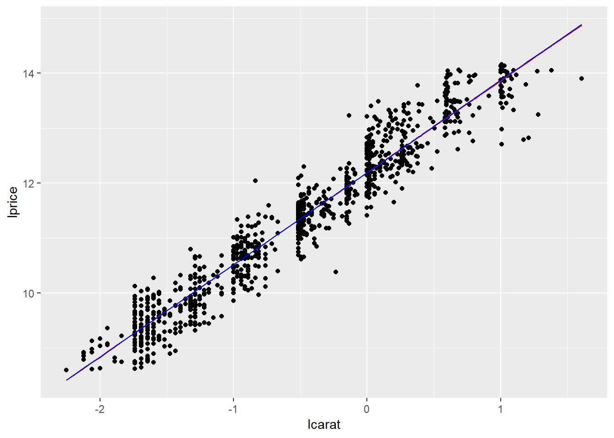

essentially no difference between the models that come-out when training on one v the the other

## 25.3.5.4

In this section I create a marker for days that are "near a holiday"

```r
near_holidays <- holidays %>% 
  # This creates a series of helper variables to create the variable 'Holiday_IntervalDay' that represents an interval that encloses the period between the holiday and the beginning or end of the most recent weekend
  mutate(HolidayWday = wday(HolidayDate, label = TRUE),
         HolidayWknd = lubridate::round_date(HolidayDate, unit = "week"),
         HolidayFloor = lubridate::floor_date(HolidayDate, unit = "week"),
         HolidayCeiling = lubridate::ceiling_date(HolidayDate, unit = "week"),
         Holiday_IntervalDay = case_when(HolidayWknd == HolidayFloor ~ (HolidayFloor - ddays(2)),
                                         TRUE ~ HolidayCeiling)) %>% 
  mutate(Holiday_Period = interval(pmin(HolidayDate, Holiday_IntervalDay), pmax(HolidayDate, Holiday_IntervalDay)))

# This returns each day and whether it occurred near a holiday
near_holiday <- map(near_holidays$Holiday_Period, ~(seq.Date(ymd("2013-01-01"), ymd("2013-12-31"), by = "day") %within% .x)) %>% 
  transpose() %>% 
  map_lgl(any) %>% 
  as_tibble() %>% 
  rename(NearHoliday = value) %>% 
  mutate(date = seq.Date(ymd("2013-01-01"), ymd("2013-12-31"), by = "day"))

near_holiday
```

```
## # A tibble: 365 x 2
##    NearHoliday date      
##    <lgl>       <date>    
##  1 TRUE        2013-01-01
##  2 FALSE       2013-01-02
##  3 FALSE       2013-01-03
##  4 FALSE       2013-01-04
##  5 FALSE       2013-01-05
##  6 FALSE       2013-01-06
##  7 FALSE       2013-01-07
##  8 FALSE       2013-01-08
##  9 FALSE       2013-01-09
## 10 FALSE       2013-01-10
## # ... with 355 more rows
```

* I ended-up not adding any additional analysis here, though the methodology for creating the "near holiday" seemed worth saving
* Could come back to add more in the future

<!--chapter:end:24-model-building.Rmd-->


*Make sure the following packages are installed:*  


# ch. 25: Many models
* `nest` creates a list-column with default key value `data`. Each row value becomes a dataframe with all non-grouping columns and all rows corresponding with a particular group

```r
iris %>% 
  group_by(Species) %>% 
  nest()
```
  
* `unnest` unnest any list-column in your dataframe. 

Notes on `unnest` behavior:
* if there are multiple rows in the list-col being unnested, the existing row values will be duplicated

```r
tibble(x = 1:100) %>% 
  mutate(test1 = list(c(1,2))) %>% 
  unnest(test1) 

# notice duplicated x values: 1,1,2,2,...100,100
# Notice that in situations like the below one though, we get two new columns
# however the row length does not change i.e. there are no duplicates created
# (this is similar to the structure when using broom::glance)
tibble(x = 1:100) %>% 
  mutate(test1 = list(tibble(a = 1, b = 2))) %>% 
  unnest(test1) 
```
  
* if there are multiple list-cols, specify the column to unnest or default behavior will be to unnest all (if not possible)
* when unnesting a single column but multiple list-cols exist, the default behavior is that if unnesting caused no change in row number than keep other list-cols, but if unnesting caused a change in row-number drop other columns. To override the former use `.drop = TRUE` to override the latter use `.drop = FALSE`. ^[Note that if using `.drop = FALSE` in the latter case that you are creating replicated rows for list-col values]

```r
tibble(x = 1:100) %>% 
  mutate(test1 = list(c(1,2)),
         test2 = list(c(3,4))) %>% 
  unnest(test1) # use .drop = TRUE to drop test2 column

# or to unnest both
tibble(x = 1:100) %>% 
  mutate(test1 = list(c(1,2)),
         test2 = list(c(3,4))) %>% 
  unnest()
```
  
* when unnesting multiple columns, all must be the same length or you will get an error, e.g. below would fail:

```r
tibble(x = 1:100) %>% 
  mutate(test1 = list(c(1)),
         test2 = list(c(2,3))) %>% 
  unnest()
```

* To unnest mulitple list-cols with different row-lengths, you should use multiple `unnest` statements, e.g. below would work:

```r
tibble(x = 1:100) %>% 
  mutate(test1 = list(c(1)),
         test2 = list(c(2,3))) %>% 
  unnest(test1) %>% 
  unnest(test2)
```

* Method for nesting individual vectors: `group_by` `%>%` `summarise`, e.g.:

```r
iris %>% 
  group_by(Species) %>% 
  summarise_all(list)
```

```
## # A tibble: 3 x 5
##   Species    Sepal.Length Sepal.Width Petal.Length Petal.Width
##   <fct>      <list>       <list>      <list>       <list>     
## 1 setosa     <dbl [50]>   <dbl [50]>  <dbl [50]>   <dbl [50]> 
## 2 versicolor <dbl [50]>   <dbl [50]>  <dbl [50]>   <dbl [50]> 
## 3 virginica  <dbl [50]>   <dbl [50]>  <dbl [50]>   <dbl [50]>
```
      
* the above has the advantage of producing atomic vectors rather than dataframes as the types inside of the lists
* `broom::glance` takes a model as input and outputs a one row tibble with columns for each of several model evalation statistics (note that these metrics are geared towards evaluating the training)
* `broom::tidy` creates a tibble with columns `term`, `estimate`, `std.error`, `statistic` (t-statistic) and `p.value`. A new row is created for each `term` type, e.g. intercept, x1, x2, etc.
* `ggtitle()`, alternative to `labs(title = "type title here")`
* see [25.4.5] number 3 for a useful way of wrapping certain functions in `list` functions to take advantage of the list-col format

## 25.2: gapminder

The set-up example Hadley goes through is important, below is a slightly altered copy of his example.

__Nested Data__

```r
by_country <- gapminder::gapminder %>% 
  group_by(country, continent) %>% 
  nest()
```

__List-columns__


```r
country_model <- function(df) {
  lm(lifeExp ~ year, data = df)
}
```

Want to apply this function over every data frame, the dataframes are in a list, so do this by:

```r
by_country2 <- by_country %>% 
  mutate(model = purrr::map(data, country_model))
```

Advantage with keeping things in the dataframe is that when you filter, or move things around, everything stays in sync, as do new summary values you might add.


```r
by_country2 %>% 
  arrange(continent, country)
```

```
## # A tibble: 142 x 4
##    country                  continent data              model   
##    <fct>                    <fct>     <list>            <list>  
##  1 Algeria                  Africa    <tibble [12 x 4]> <S3: lm>
##  2 Angola                   Africa    <tibble [12 x 4]> <S3: lm>
##  3 Benin                    Africa    <tibble [12 x 4]> <S3: lm>
##  4 Botswana                 Africa    <tibble [12 x 4]> <S3: lm>
##  5 Burkina Faso             Africa    <tibble [12 x 4]> <S3: lm>
##  6 Burundi                  Africa    <tibble [12 x 4]> <S3: lm>
##  7 Cameroon                 Africa    <tibble [12 x 4]> <S3: lm>
##  8 Central African Republic Africa    <tibble [12 x 4]> <S3: lm>
##  9 Chad                     Africa    <tibble [12 x 4]> <S3: lm>
## 10 Comoros                  Africa    <tibble [12 x 4]> <S3: lm>
## # ... with 132 more rows
```

```r
by_country2 %>% 
  mutate(summaries = purrr::map(model, summary)) %>% 
  mutate(r_squared = purrr::map2_dbl(model, data, rsquare))
```

```
## # A tibble: 142 x 6
##    country     continent data             model   summaries       r_squared
##    <fct>       <fct>     <list>           <list>  <list>              <dbl>
##  1 Afghanistan Asia      <tibble [12 x 4~ <S3: l~ <S3: summary.l~     0.948
##  2 Albania     Europe    <tibble [12 x 4~ <S3: l~ <S3: summary.l~     0.911
##  3 Algeria     Africa    <tibble [12 x 4~ <S3: l~ <S3: summary.l~     0.985
##  4 Angola      Africa    <tibble [12 x 4~ <S3: l~ <S3: summary.l~     0.888
##  5 Argentina   Americas  <tibble [12 x 4~ <S3: l~ <S3: summary.l~     0.996
##  6 Australia   Oceania   <tibble [12 x 4~ <S3: l~ <S3: summary.l~     0.980
##  7 Austria     Europe    <tibble [12 x 4~ <S3: l~ <S3: summary.l~     0.992
##  8 Bahrain     Asia      <tibble [12 x 4~ <S3: l~ <S3: summary.l~     0.967
##  9 Bangladesh  Asia      <tibble [12 x 4~ <S3: l~ <S3: summary.l~     0.989
## 10 Belgium     Europe    <tibble [12 x 4~ <S3: l~ <S3: summary.l~     0.995
## # ... with 132 more rows
```

__unnesting__, dd another dataframe with the residuals included and then unnest

```r
by_country3 <- by_country2 %>%
  mutate(resids = purrr::map2(data, model, add_residuals))
```


```r
resids <- by_country3 %>% 
  unnest(resids)

resids
```

```
## # A tibble: 1,704 x 7
##    country     continent  year lifeExp      pop gdpPercap   resid
##    <fct>       <fct>     <int>   <dbl>    <int>     <dbl>   <dbl>
##  1 Afghanistan Asia       1952    28.8  8425333      779. -1.11  
##  2 Afghanistan Asia       1957    30.3  9240934      821. -0.952 
##  3 Afghanistan Asia       1962    32.0 10267083      853. -0.664 
##  4 Afghanistan Asia       1967    34.0 11537966      836. -0.0172
##  5 Afghanistan Asia       1972    36.1 13079460      740.  0.674 
##  6 Afghanistan Asia       1977    38.4 14880372      786.  1.65  
##  7 Afghanistan Asia       1982    39.9 12881816      978.  1.69  
##  8 Afghanistan Asia       1987    40.8 13867957      852.  1.28  
##  9 Afghanistan Asia       1992    41.7 16317921      649.  0.754 
## 10 Afghanistan Asia       1997    41.8 22227415      635. -0.534 
## # ... with 1,694 more rows
```


### 25.2.5

1.  A linear trend seems to be slightly too simple for the overall trend. Can you do better with a quadratic polynomial? How can you interpret the coefficients of the quadratic? (Hint you might want to transform `year` so that it has mean zero.)

    *Create functions*
    
    ```r
    # funciton to center value
    center_value <- function(df){
      df %>% 
        mutate(year_cent = year - mean(year))
    }
    
    # this function allows me to input any text to "var" to customize the inputs
    # to the model, default are a linear and quadratic term for year (centered)
    lm_quad_2 <- function(df, var = "year_cent + I(year_cent^2)"){
      lm(as.formula(paste("lifeExp ~ ", var)), data = df)
    }
    ```
    
    *Create dataframe with evaluation metrics*
    
    ```r
    by_country3_quad <- by_country3 %>% 
      mutate(
        # create centered data
        data_cent = purrr::map(data, center_value), 
        # create quadratic models
        mod_quad = purrr::map(data_cent, lm_quad_2), 
        # get model evaluation stats from original model
        glance_mod = purrr::map(model, broom::glance), 
        # get model evaluation stats from quadratic model
        glance_quad = purrr::map(mod_quad, broom::glance)) 
    ```
    
    *Create plots*
    
    ```r
    by_country3_quad %>% 
      unnest(glance_mod, glance_quad, .sep = "_", .drop = TRUE) %>% 
      gather(glance_mod_r.squared, glance_quad_r.squared, 
             key = "order", value = "r.squared") %>% 
      ggplot(aes(x = continent, y = r.squared, colour = continent)) +
      geom_boxplot() +
      facet_wrap(~order)
    ```
    
    
    
    * The quadratic trend seems to do better --> indicated by the distribution of the R^2 values being closer to one. The level of improvement seems especially pronounced for African countries.
    
    Let's check this for sure by looking at percentage point improvement in R^2 in chart below

    
    ```r
    by_country3_quad %>% 
      mutate(quad_coefs = map(mod_quad, broom::tidy)) %>% 
      unnest(glance_mod, .sep = "_") %>% 
      unnest(glance_quad) %>% 
      mutate(bad_fit = glance_mod_r.squared < 0.25,
             R.squ_ppt_increase = r.squared - glance_mod_r.squared) %>% 
      ggplot(aes(x = continent, y = R.squ_ppt_increase))+
      # geom_quasirandom(aes(alpha = bad_fit), colour = "black")+
      geom_boxplot(alpha = 0.1, colour = "dark grey")+
      geom_quasirandom(aes(colour = continent))+
      labs(title = "Percentage point (PPT) improvement in R squared value", 
           subtitle = "(When adding a quadratic term to the linear regression model)")
    ```
    
    
    
    *View predictions from linear model with quadratic term*
    (of countries where linear trend did not capture relationship)
    
    ```r
    bad_fit <- by_country3 %>% 
      mutate(glance = purrr::map(model, broom::glance)) %>% 
      unnest(glance, .drop = TRUE) %>% 
      filter(r.squared < 0.25)
    
    #solve with join with bad_fit
    by_country3_quad %>% 
      semi_join(bad_fit, by = "country") %>% 
      mutate(data_preds = purrr::map2(data_cent, mod_quad, add_predictions)) %>% 
      unnest(data_preds) %>% 
      ggplot(aes(x = year, group = country))+
      geom_point(aes(y = lifeExp, colour = country))+
      geom_line(aes(y = pred, colour = country))+
      facet_wrap(~country)+
      theme(axis.text.x = element_text(angle = 90, hjust = 1))
    ```
    
    
    
    * while the quadratic model does a better job fitting the model than a linear term does, I wouldn't say it does a good job of fitting the model
    * it looks like the trends are generally consistent rates of improvement and then there is a sudden drop-off associated with some event, hence an intervention variable may be a more appropriate method for modeling this pattern
    
    *Quadratic model parameters*
    
    ```r
    by_country3_quad %>% 
      mutate(quad_coefs = map(mod_quad, broom::tidy)) %>% 
      unnest(glance_mod, .sep = "_") %>% 
      unnest(glance_quad) %>% 
      unnest(quad_coefs) %>% 
      mutate(bad_fit = glance_mod_r.squared < 0.25) %>% 
      ggplot(aes(x = continent, y = estimate, alpha = bad_fit))+
      geom_boxplot(alpha = 0.1, colour = "dark grey")+
      geom_quasirandom(aes(colour = continent))+
      facet_wrap(~term, scales = "free")+
      labs(caption = "Note that 'bad fit' represents a bad fit on the initial model \nthat did not contain a quadratic term)")+
      theme(axis.text.x = element_text(angle = 90, hjust = 1))
    ```
    
    ```
    ## Warning: Using alpha for a discrete variable is not advised.
    ```
    
    
    
    * The quadratic term (in a linear function, trained with the x-value centered at the mean, as in this dataset) has a few important notes related to interpretation
        * If the coefficient is positive the output will be convex, if it is negative it will be concave (i.e. smile vs. frown shape)
        * The value on the coefficient represents 1/2 the rate at which the relationship between `lifeExp` and `year` is changing for every one unit change from the mean / expected value of `lifeExp` in the dataset. 
        * Hence if the coefficient is near 0, that means the relationship between `lifeExp` and `year` does not change (or at least does not change at a constant rate) when moving in either direction from `lifeExp`s mean value.
    
    To better understand this, let's look look at a specific example. Excluding Rwanda, Botswana was the `country` that the linear model without the quadratic term performed the worst on. We'll use this as our example for interpreting the coefficients.
    
    *Plots of predicted and actual values for Botswanian life expectancy by year*
    
    ```r
    by_country3_quad %>% 
      filter(country == "Botswana") %>% 
      mutate(data_preds = purrr::map2(data_cent, mod_quad, add_predictions)) %>% 
      unnest(data_preds) %>% 
      ggplot(aes(x = year, group = country))+
      geom_point(aes(y = lifeExp))+
      geom_line(aes(y = pred, colour = "prediction"))+
    labs(title = "Data and quadratic trend of predictions for Botswana")
    ```
    
    
    
    *(note that the centered value for year in the 'centered' dataset is 1979.5)*  
    In the model for Botswana, coefficents are:  
    Intercept: ~ 59.81  
    year (centered): ~ 0.0607  
    year (centered)^2: ~ -0.0175  
    
    Hence for every one year we move away from the central year (1979.5), the rate of change between year and price decreases by *~0.035*.
    
    Below I show this graphically by plotting the lines tangent to the models output.
    
    ```r
    botswana_coefs <- by_country3_quad %>% 
      filter(country == "Botswana") %>%
      with(map(mod_quad, coef)) %>% 
      flatten_dbl()
    ```
    
    Helper functions to find tangent points
    
    ```r
    find_slope <- function(x){
      2*botswana_coefs[[3]]*x + botswana_coefs[[2]]
    }
    
    find_y1 <- function(x){
      botswana_coefs[[3]]*(x^2) + botswana_coefs[[2]]*x + botswana_coefs[[1]]
    }
    
    find_intercept <- function(x, y, m){
      y - x*m
    }
    
    tangent_lines <- tibble(x1 = seq(-20, 20, 10)) %>% 
      mutate(slope = find_slope(x1),
             y1 = find_y1(x1),
             intercept = find_intercept(x1, y1, slope),
             slope_change = x1*2*botswana_coefs[[3]]) %>% 
      select(slope, intercept, everything())
    ```
    
    
    ```r
    by_country3_quad %>% 
      filter(country == "Botswana") %>% 
      mutate(data_preds = purrr::map2(data_cent, mod_quad, add_predictions)) %>% 
      unnest(data_preds) %>% 
      ggplot(aes(x = year_cent))+
      geom_line(aes(x = year_cent, y = pred), colour = "red")+
      # geom_line(aes(y = pred, colour = "prediction"))+
    # labs(title = "Data and 2nd order model predictions for Botswana")+
      geom_abline(intercept = tangent_lines[[2]][[1]], slope = tangent_lines[[1]][[1]])+
        geom_abline(intercept = tangent_lines[[2]][[2]], slope = tangent_lines[[1]][[2]])+
        geom_abline(intercept = tangent_lines[[2]][[3]], slope = tangent_lines[[1]][[3]])+
        geom_abline(intercept = tangent_lines[[2]][[4]], slope = tangent_lines[[1]][[4]])+
        geom_abline(intercept = tangent_lines[[2]][[5]], slope = tangent_lines[[1]][[5]])+
      ylim(c(40, 70))+
      coord_fixed()
    ```
    
    
    
    ```r
        by_country3_quad %>% 
      filter(country == "Botswana") %>% 
      mutate(data_preds = purrr::map2(data_cent, mod_quad, add_predictions)) %>% 
      unnest(data_preds) %>% 
      ggplot(aes(x = year_cent))+
      geom_line(aes(x = year_cent, y = pred), colour = "red")+
      geom_abline(aes(intercept = intercept, slope = slope), 
                  data = tangent_lines)+
      coord_fixed()
    ```
    
    
    
    Below is the relevant output in a table.  
    `x1`: represents the change in x value from 1979.5  
    `slope`: slope of the tangent line at particular `x1` value  
    `slope_diff_central`: the amount the slope is different from the slope of the tangent line at the central year  
    
    
    ```r
    select(tangent_lines, x1, slope, slope_diff_central = slope_change)
    ```
    
    ```
    ## # A tibble: 5 x 3
    ##      x1   slope slope_diff_central
    ##   <dbl>   <dbl>              <dbl>
    ## 1   -20  0.760               0.700
    ## 2   -10  0.411               0.350
    ## 3     0  0.0607              0    
    ## 4    10 -0.289              -0.350
    ## 5    20 -0.639              -0.700
    ```
    
    * notice that for every 10 year increase in `x1` we see the slope of the tangent line has decreased by 0.35. If we'd looked at just one year we would have seen the change was 0.035, this correspondig with 2 multiplied by the coefficient on the quadratic term of our model.

1.  Explore other methods for visualising the distribution of $R^2$ per continent. You might want to try the ggbeeswarm package, which provides similar methods for avoiding overlaps as jitter, but uses deterministic methods.
    
    *visualisations of linear model*
    
    ```r
    by_country3_quad %>% 
      unnest(glance_mod) %>% 
      ggplot(aes(x = continent, y = r.squared, colour = continent))+
      geom_boxplot(alpha = 0.1, colour = "dark grey")+
      ggbeeswarm::geom_quasirandom()
    ```
    
    
    
    ```r
    by_country3_quad %>% 
      unnest(glance_mod) %>% 
      ggplot(aes(x = continent, y = r.squared, colour = continent))+
      geom_boxplot(alpha = 0.1, colour = "dark grey")+
      geom_jitter()
    ```
    
    
    
    ```r
    by_country3_quad %>% 
      unnest(glance_mod) %>%  
      ggplot(aes(x = continent, y = r.squared, colour = continent))+
      geom_boxplot(alpha = 0.1, colour = "dark grey")+
      ggbeeswarm::geom_beeswarm()
    ```
    
    

    * I like `geom_quasirandom` the best as an overlay on boxplot, it keeps things centered and doesn't have the gravitational pull affect that makes `geom_beeswarm` become a little misaligned

1.  To create the last plot (showing the data for the countries with the worst model fits), we needed two steps: we created a data frame with one row per country and then semi-joined it to the original dataset. It's possible to avoid this join if we use `unnest()` instead of `unnest(.drop = TRUE)`. How?

    
    ```r
    #first filter by r.squared and then unnest
    by_country3_quad %>% 
      mutate(data_preds = purrr::map2(data_cent, mod_quad, add_predictions)) %>% 
      unnest(glance_mod) %>% 
      mutate(bad_fit = r.squared < 0.25) %>% 
      filter(bad_fit) %>% 
      unnest(data_preds) %>% 
      ggplot(aes(x = year, group = country))+
      geom_point(aes(y = lifeExp, colour = country))+
      geom_line(aes(y = pred, colour = country))+
      facet_wrap(~country)+
      theme(axis.text.x = element_text(angle = 90, hjust = 1))
    ```
    
    

## 25.4: Creating list-columns

### 25.4.5

1.  List all the functions that you can think of that take an atomic vector and return a list.

* `stringr::str_extract_all` + other `stringr` functions

(however the below can also take types that are not atomic and are probably not really what is being looked for)
* `list`
* `tibble`
* `map` / `lapply`

1.  Brainstorm useful summary functions that, like `quantile()`, return multiple values.

* `summary`
* `range`
* ...
    
1.  What's missing in the following data frame? How does `quantile()` return that missing piece? Why isn't that helpful here?

    
    ```r
    mtcars %>% 
      group_by(cyl) %>% 
      summarise(q = list(quantile(mpg))) %>% 
      unnest()
    ```
    
    ```
    ## # A tibble: 15 x 2
    ##      cyl     q
    ##    <dbl> <dbl>
    ##  1     4  21.4
    ##  2     4  22.8
    ##  3     4  26  
    ##  4     4  30.4
    ##  5     4  33.9
    ##  6     6  17.8
    ##  7     6  18.6
    ##  8     6  19.7
    ##  9     6  21  
    ## 10     6  21.4
    ## 11     8  10.4
    ## 12     8  14.4
    ## 13     8  15.2
    ## 14     8  16.2
    ## 15     8  19.2
    ```

    * need to capture probabilities of quantiles to make useful...
    
    ```r
    probs <- c(0.01, 0.25, 0.5, 0.75, 0.99)
    
    mtcars %>% 
      group_by(cyl) %>% 
      summarise(p = list(probs), q = list(quantile(mpg, probs))) %>% 
      unnest()
    ```
    
    ```
    ## # A tibble: 15 x 3
    ##      cyl     p     q
    ##    <dbl> <dbl> <dbl>
    ##  1     4  0.01  21.4
    ##  2     4  0.25  22.8
    ##  3     4  0.5   26  
    ##  4     4  0.75  30.4
    ##  5     4  0.99  33.8
    ##  6     6  0.01  17.8
    ##  7     6  0.25  18.6
    ##  8     6  0.5   19.7
    ##  9     6  0.75  21  
    ## 10     6  0.99  21.4
    ## 11     8  0.01  10.4
    ## 12     8  0.25  14.4
    ## 13     8  0.5   15.2
    ## 14     8  0.75  16.2
    ## 15     8  0.99  19.1
    ```
    
    * see [quantile example] for related method that captures names of quantiles (rather than requiring th user to manually input a vector of probabilities)
    
1.  What does this code do? Why might it be useful?

    
    ```r
    mtcars %>% 
      select(1:3) %>% 
      group_by(cyl) %>% 
      summarise_all(funs(list))
    ```

    * It turns each row into an atomic vector grouped by the particular `cyl` value.  It is different from `nest` in that each column creates a new list-column representing an atomic vector. If `nest` had been used, this woudl have created a single dataframe that all the values woudl have been in. Could be useful for running purr through particular columns...
    * e.g. let's say we want to find the number of unique items in each column for each grouping, we could do that like so
    
    
    ```r
    mtcars %>% 
      group_by(cyl) %>% 
      select(1:5) %>% 
      summarise_all(funs(list)) %>% 
      mutate_all(funs(unique = map_int(., ~length(unique(.x))))) 
    ```
    
    ```
    ## Warning: funs() is soft deprecated as of dplyr 0.8.0
    ## please use list() instead
    ## 
    ## # Before:
    ## funs(name = f(.)
    ## 
    ## # After: 
    ## list(name = ~f(.))
    ## This warning is displayed once per session.
    ```
    
    ```
    ## # A tibble: 3 x 10
    ##     cyl mpg   disp  hp    drat  cyl_unique mpg_unique disp_unique hp_unique
    ##   <dbl> <lis> <lis> <lis> <lis>      <int>      <int>       <int>     <int>
    ## 1     4 <dbl~ <dbl~ <dbl~ <dbl~          1          9          11        10
    ## 2     6 <dbl~ <dbl~ <dbl~ <dbl~          1          6           5         4
    ## 3     8 <dbl~ <dbl~ <dbl~ <dbl~          1         12          11         9
    ## # ... with 1 more variable: drat_unique <int>
    ```
    
    ```r
    # we could also simply overwrite the values (rather than make new columns)
    mtcars %>% 
      group_by(cyl) %>% 
      select(1:5) %>% 
      summarise_all(funs(list)) %>% 
      mutate_all(funs(map_int(., ~length(unique(.x))))) 
    ```
    
    ```
    ## # A tibble: 3 x 5
    ##     cyl   mpg  disp    hp  drat
    ##   <int> <int> <int> <int> <int>
    ## 1     1     9    11    10    10
    ## 2     1     6     5     4     5
    ## 3     1    12    11     9    11
    ```


## 25.5: Simplifying list-columns

### 25.5.3

1.  Why might the `lengths()` function be useful for creating atomic
    vector columns from list-columns?
    
    If all you wanted were the length (not the number of unique items), you would still need a `map function when using `length`
        
    
    ```r
    mtcars %>% 
      group_by(cyl) %>% 
      select(1:5) %>% 
      summarise_all(funs(list)) %>% 
      mutate_all(funs(map_int(., length))) 
    ```
    
    ```
    ## # A tibble: 3 x 5
    ##     cyl   mpg  disp    hp  drat
    ##   <int> <int> <int> <int> <int>
    ## 1     1    11    11    11    11
    ## 2     1     7     7     7     7
    ## 3     1    14    14    14    14
    ```
    
    for this problem, using `lengths` prevents the need to use a `map` function
    
    
    ```r
    mtcars %>% 
      group_by(cyl) %>% 
      select(1:5) %>% 
      summarise_all(funs(list)) %>% 
      mutate_all(lengths) 
    ```
    
    ```
    ## # A tibble: 3 x 5
    ##     cyl   mpg  disp    hp  drat
    ##   <int> <int> <int> <int> <int>
    ## 1     1    11    11    11    11
    ## 2     1     7     7     7     7
    ## 3     1    14    14    14    14
    ```
    
    * is there a more helpful use case...?
    
1.  List the most common types of vector found in a data frame. What makes lists different?

    * the atomic types: char, int, double, fact, date are all more common, they are atomic, whereas lists are not

# Appendix

## models in lists
this is the more traditional way you might store models


```r
models_countries <- purrr::map(by_country$data, country_model)

names(models_countries) <- by_country$country

models_countries[1:3]
```

```
## $Afghanistan
## 
## Call:
## lm(formula = lifeExp ~ year, data = df)
## 
## Coefficients:
## (Intercept)         year  
##   -507.5343       0.2753  
## 
## 
## $Albania
## 
## Call:
## lm(formula = lifeExp ~ year, data = df)
## 
## Coefficients:
## (Intercept)         year  
##   -594.0725       0.3347  
## 
## 
## $Algeria
## 
## Call:
## lm(formula = lifeExp ~ year, data = df)
## 
## Coefficients:
## (Intercept)         year  
##  -1067.8590       0.5693
```

## list-columns for sampling
say you want to sample all the flights on 50 days out of the year. List-cols can be helpful in generating a sample like this:

```r
flights %>% 
  mutate(create_date = make_date(year, month, day)) %>% 
  select(create_date, 5:8) %>% 
  group_by(create_date) %>% 
  nest() %>% 
  sample_n(50) %>% 
  unnest()
```

```
## # A tibble: 45,932 x 5
##    create_date sched_dep_time dep_delay arr_time sched_arr_time
##    <date>               <int>     <dbl>    <int>          <int>
##  1 2013-10-20             520        -3      754            803
##  2 2013-10-20             545        -3      922            933
##  3 2013-10-20             545        -2      843            855
##  4 2013-10-20             600       -11      703            716
##  5 2013-10-20             550         0      921            932
##  6 2013-10-20             600        -6      713            730
##  7 2013-10-20             600        -6      905            858
##  8 2013-10-20             600        -6      836            840
##  9 2013-10-20             600        -3      650            700
## 10 2013-10-20             600        -3      840            815
## # ... with 45,922 more rows
```

The alternative a join, e.g.

```r
flights_samp <- flights %>% 
  mutate(create_date = make_date(year, month, day)) %>% 
  distinct(create_date) %>% 
  sample_n(50)

flights %>% 
  mutate(create_date = make_date(year, month, day)) %>% 
  select(create_date, 5:8) %>% 
  semi_join(flights_samp, by = "create_date")
```

```
## # A tibble: 46,865 x 5
##    create_date sched_dep_time dep_delay arr_time sched_arr_time
##    <date>               <int>     <dbl>    <int>          <int>
##  1 2013-01-19             500        -4      634            648
##  2 2013-01-19             530         5      859            829
##  3 2013-01-19             540        -2     1009           1017
##  4 2013-01-19             540        -1      842            850
##  5 2013-01-19             600        -5      824            837
##  6 2013-01-19             600        -5      819            815
##  7 2013-01-19             600        -4      903            910
##  8 2013-01-19             600        -3      749            759
##  9 2013-01-19             600        -3      749            759
## 10 2013-01-19             600        -3      904            904
## # ... with 46,855 more rows
```

* I find the `nest` - `unnest` method more elegant
* I've found the `semi_join` method seems to run goes faster on large dataframes

## 25.2.5.1

### Include cubic term
Let's look at this example if we had allowed year to be a 3rd order polynomial.  We're really stretching our degrees of freedom in this case -- these might be unlikely to generalize to other data well. 


```r
by_country3 %>% 
  semi_join(bad_fit, by = "country") %>% 
  mutate(
    # create centered data
    data_cent = purrr::map(data, center_value), 
    # create cubic (3rd order) data
    mod_cubic = purrr::map(data_cent, lm_quad_2, var = "year_cent + I(year_cent^2) + I(year_cent^3)"), 
    # get predictions for 3rd order model
    data_cubic = purrr::map2(data_cent, mod_cubic, add_predictions)) %>%
  unnest(data_cubic) %>% 
  ggplot(aes(x = year, group = country))+
  geom_point(aes(y = lifeExp, colour = country))+
  geom_line(aes(y = pred, colour = country))+
  facet_wrap(~country)+
  theme(axis.text.x = element_text(angle = 90, hjust = 1))
```

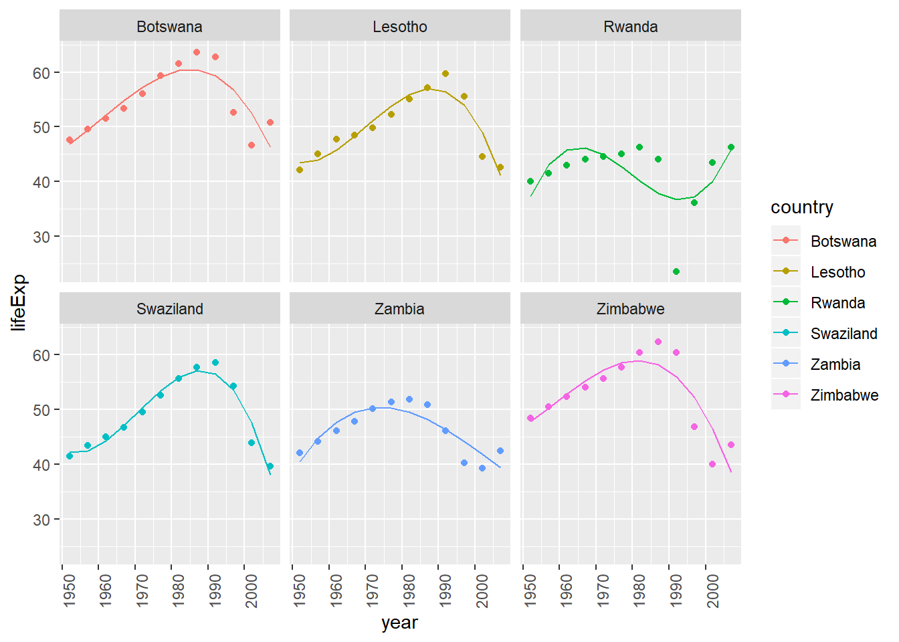

* interpretibility of coefficients beyond quadratic term becomes less strait forward to explain

## Multiple graphs in chunk
My work flow for pulling multiple graphs into a single input has typically been either to build the graphs seperately and then add each to the function `gridExtra::grid.arrange()` or to use faceting as much as possible.  

In 25.2 Hadley showed an example where he put all the graphs within a chunk into a single outputted figure by setting the code chunk options for this. The chunk below is that example.


```r
nz <- filter(gapminder, country == "New Zealand")
nz %>% 
  ggplot(aes(year, lifeExp)) + 
  geom_line() + 
  ggtitle("Full data = ")
```


```r
nz_mod <- lm(lifeExp ~ year, data = nz)
nz %>% 
  add_predictions(nz_mod) %>%
  ggplot(aes(year, pred)) + 
  geom_line() + 
  ggtitle("Linear trend + ")
```


```r
nz %>% 
  add_residuals(nz_mod) %>% 
  ggplot(aes(year, resid)) + 
  geom_hline(yintercept = 0, colour = "white", size = 3) + 
  geom_line() + 
  ggtitle("Remaining pattern")
```


* still printing as 3 individual plots, how to fix?

## list(quantile()) examples


```r
prob_vals <- c(0, .25, .5, .75, 1)
iris %>% 
  group_by(Species) %>% 
  summarise(Petal.Length_q = list(quantile(Petal.Length))) %>% 
  mutate(probs = list(prob_vals)) %>% 
  unnest()
```

```
## # A tibble: 15 x 3
##    Species    Petal.Length_q probs
##    <fct>               <dbl> <dbl>
##  1 setosa               1     0   
##  2 setosa               1.4   0.25
##  3 setosa               1.5   0.5 
##  4 setosa               1.58  0.75
##  5 setosa               1.9   1   
##  6 versicolor           3     0   
##  7 versicolor           4     0.25
##  8 versicolor           4.35  0.5 
##  9 versicolor           4.6   0.75
## 10 versicolor           5.1   1   
## 11 virginica            4.5   0   
## 12 virginica            5.1   0.25
## 13 virginica            5.55  0.5 
## 14 virginica            5.88  0.75
## 15 virginica            6.9   1
```

*Example for using quantile across range of columns*  
*Also notice dynamic method for extracting names*

```r
iris %>% 
  group_by(Species) %>% 
  summarise_all(funs(list(quantile(., probs = prob_vals)))) %>% 
  mutate(probs = map(Petal.Length, names)) %>% 
  unnest()
```

```
## # A tibble: 15 x 6
##    Species    Sepal.Length Sepal.Width Petal.Length Petal.Width probs
##    <fct>             <dbl>       <dbl>        <dbl>       <dbl> <chr>
##  1 setosa             4.3         2.3          1            0.1 0%   
##  2 setosa             4.8         3.2          1.4          0.2 25%  
##  3 setosa             5           3.4          1.5          0.2 50%  
##  4 setosa             5.2         3.68         1.58         0.3 75%  
##  5 setosa             5.8         4.4          1.9          0.6 100% 
##  6 versicolor         4.9         2            3            1   0%   
##  7 versicolor         5.6         2.52         4            1.2 25%  
##  8 versicolor         5.9         2.8          4.35         1.3 50%  
##  9 versicolor         6.3         3            4.6          1.5 75%  
## 10 versicolor         7           3.4          5.1          1.8 100% 
## 11 virginica          4.9         2.2          4.5          1.4 0%   
## 12 virginica          6.22        2.8          5.1          1.8 25%  
## 13 virginica          6.5         3            5.55         2   50%  
## 14 virginica          6.9         3.18         5.88         2.3 75%  
## 15 virginica          7.9         3.8          6.9          2.5 100%
```

## extracting row names
Don't know I'd do this...

```r
quantile(1:100) %>% 
  as_tibble() %>% 
  rownames_to_column()
```

```
## Warning: Calling `as_tibble()` on a vector is discouraged, because the behavior is likely to change in the future. Use `enframe(name = NULL)` instead.
## This warning is displayed once per session.
```

```
## # A tibble: 5 x 2
##   rowname value
##   <chr>   <dbl>
## 1 1         1  
## 2 2        25.8
## 3 3        50.5
## 4 4        75.2
## 5 5       100
```

## `invoke_map` example (book)
I liked Hadley's example with invoke_map and wanted to save it

```r
sim <- tribble(
  ~f,      ~params,
  "runif", list(min = -1, max = -1),
  "rnorm", list(sd = 5),
  "rpois", list(lambda = 10)
)

sim %>%
  mutate(sims = invoke_map(f, params, n = 10))
```

```
## # A tibble: 3 x 3
##   f     params     sims      
##   <chr> <list>     <list>    
## 1 runif <list [2]> <dbl [10]>
## 2 rnorm <list [1]> <dbl [10]>
## 3 rpois <list [1]> <int [10]>
```

## named list example (book)
I liked Hadley's example where you have a list of named vectors that you need to iterate over both the values as well as the names and the use of enframe to facilitate this. 

Below is the copied example and notes:


```r
x <- list(
  a = 1:5,
  b = 3:4, 
  c = 5:6
) 

df <- enframe(x)
df
```

```
## # A tibble: 3 x 2
##   name  value    
##   <chr> <list>   
## 1 a     <int [5]>
## 2 b     <int [2]>
## 3 c     <int [2]>
```

The advantage of this structure is that it generalises in a straightforward way - names are useful if you have character vector of metadata, but don't help if you have other types of data, or multiple vectors.

 Now if you want to iterate over names and values in parallel, you can use `map2()`:


```r
df %>% 
  mutate(
    smry = map2_chr(name, value, ~ stringr::str_c(.x, ": ", .y[1]))
  )
```

```
## # A tibble: 3 x 3
##   name  value     smry 
##   <chr> <list>    <chr>
## 1 a     <int [5]> a: 1 
## 2 b     <int [2]> b: 3 
## 3 c     <int [2]> c: 5
```

<!--chapter:end:25-many-models.Rmd-->


*Make sure the following packages are installed:*  


# ch. 27: R Markdown

* shortcut for inserting code chunk is cmd/ctrl+alt+i
* shortcut for running entire code chunks: cmd/ctrl+shift+enter
* chunk options
    * chunk name is first part after type of code in chunk, e.g. code chunk by name: `"```{r by-name}"`
    * `eval = FALSE` show example output code, but don't evaluate
    * `include = FALSE` evaluate code but don't show code or output
    * `echo = FALSE` is for when you just want the output but not the code itself
    * `message = FALSE` or `warning = False` prevents messages or warnings appearing in the finished line
    * `error = TRUE` causes code to render even if there is an error
    * `results = 'hide'` hides printied output and `fig.show = 'hide'` hides plots
        * allows you to hide particular bits of output


    * `cache = TRUE` save output of chunk to separate folder (speeds-up rendering)
    * `dependson = "chunk_name"` update chunk if dependency changes
    * `cache.extra` if output from function changes, will re-render -- useful for if you only want to update if for example a file changes, e.g.
    

```r
rawdata <- readr::read_csv("a_very_large_file.csv")
```

```
## Parsed with column specification:
## cols(
##   x = col_integer()
## )
```

* good idea to name code chunks after main object created
* `knitr::clean_cache` clear out your caches
* `knitr::opts_chunk` use to change knitting options
    * e.g.
    
    ```r
    # when writing books and tutorials
    knitr::opts_chunk$set(
      comment = "#>",
      collapse = TRUE
    )
    
    # hiding code for report
    knitr::opts_chunk$set(
      echo = FALSE
    )
    # may also set `message = FALSE` and `warning = FALSE`
    ```

* `rmarkdown::render` programmatically knit documents
    * e.g. `rmarkdown::render("27-r-markdown.Rmd", output_format = "all")` to render all formats in YAML header
* `knitr::kable` to make dataframe more visible for printing when knitting
    * also see `xtable`, `stargazer`, `pander`, `tables`, and `ascii` packages
* `format` helpful when inserting numbers into texts, e.g.

```r
comma <- function(x) format(x, digits = 2, big.mark = ",")
comma(3452345)
```

```
## [1] "3,452,345"
```

```r
comma(.12358124331)
```

```
## [1] "0.12"
```
* Use `params:` in YAML header to add in specific values or create parameterized reports, e.g.
```
params:
  start: !r lubridate::ymd("2015-01-01")
  snapshot: !r lubridate::ymd_hms("2015-01-01 12:30:00")
```
* Full chunk options here: https://yihui.name/knitr/options/ 

## 27.2 R Markdown basics

### 27.2.1

1.  Create a new notebook using _File > New File > R Notebook_. Read the 
    instructions. Practice running the chunks. Verify that you can modify
    the code, re-run it, and see modified output.
    
    Done seperately.
    
1.  Create a new R Markdown document with _File > New File > R Markdown..._
    Knit it by clicking the appropriate button. Knit it by using the 
    appropriate keyboard short cut. Verify that you can modify the
    input and see the output update.
    
    Done seperately.
    
1.  Compare and contrast the R notebook and R markdown files you created
    above. How are the outputs similar? How are they different? How are
    the inputs similar? How are they different? What happens if you
    copy the YAML header from one to the other?
    
    * Both by default have code chunks display 'in-line' while working, though with RMD can force to not output in-line.
    * When rendering, default of notebooks will be to render whichever chunks have been rendered during interactive session, whereas RMD document needs directions from code chunk options
        + I generally prefer .Rmd files to notebooks ^[I've found some of my company's security software sometimes acts-up when working interactively if I have my chunk output in-line (just slows down).  Hence, I 'uncheck' `Show output inline for all Rmarkdown documents` from `Tools`-->`Global Options` -->`Appearance`.].

1.  Create one new R Markdown document for each of the three built-in
    formats: HTML, PDF and Word. Knit each of the three documents.
    How does the output differ? How does the input differ? (You may need
    to install LaTeX in order to build the PDF output --- RStudio will
    prompt you if this is necessary.)
    
    Done seperately. HTML does not have page numbers. Plots or other outputs with interactive components will often only be viewable from html (e.g. flexdashboard, plotly, ...). Some input options will work across all formats, e.g. `toc: true`, however other options like code folding may be specific to a format, e.g. code folding will only work with html.
    
## 27.3: Text formatting with Markdown

*Print file from Hadley's github page with commmon formatting:*

```r
cat(readr::read_file("https://raw.githubusercontent.com/hadley/r4ds/master/rmarkdown/markdown.Rmd"))
```

*Other notes*
The following will actually run in the console when knitted (and not in the knitted document):

```
summary(mpg)
```

### 27.3.1

1.  Practice what you've learned by creating a brief CV. The title should be
    your name, and you should include headings for (at least) education or
    employment. Each of the sections should include a bulleted list of
    jobs/degrees. Highlight the year in bold.
    
*this is a weak example (see __ for better examples):*
    
__CV of Bryan Shalloway__
---
_###-###-####_

## Experience
NetApp, Data Scientist | _2017-present_ 
---|---
__Durham__ |

Education Pioneers, Analyst | _2015-2016_ 
-|-
__Denver__ |

Teach for America, High School Math | _2013-2015_ 
-|-
__Durham__ |

## Education
IAA, MS | _2017_  
-|-
    + Advanced Analytics

WashU in STL, AB | _2012_  
-|-
    + Major: Cognitive Neuroscience
    + Minor: Political Science
    + Minor: American Culture Studies
    
2.  Using the R Markdown quick reference, figure out how to:

    1.  Add a footnote.
    
Here is a foonote reference[^1] and another [^2] and a 3rd[^3] and an in-line one^[Superb fourth footnote.]

[^1]: Here is the foonote.

[^2]: 
  here's one with multiple blocks.  
  boo ya this is an awesome foonote.  
  don't you believe it!

[^3]: and the third

    
    2.  Add a horizontal rule.
    
---

A [linked phrase][id].

[id]: http://example.com/ "Title"

---

pagebreaks above and below (AKA horizontal rules)

***

    3.  Add a block quote.

>There is no spoon.  
-Matrix
    
3.  Copy and paste the contents of `diamond-sizes.Rmd` from
    <https://github.com/hadley/r4ds/tree/master/rmarkdown> in to a local
    R markdown document. Check that you can run it, then add text after the 
    frequency polygon that describes its most striking features.

    

* It's interesting that the count of number of diamonds spikes at whole numbers...

## 27.4: Code chunks

### 27.4.7

1.  Add a section that explores how diamond sizes vary by cut, colour,
    and clarity. Assume you're writing a report for someone who doesn't know
    R, and instead of setting `echo = FALSE` on each chunk, set a global 
    option.
    
    * put this into a code chunk:
    ```
    knitr::opts_chunk$set(echo = FALSE)
    ```
1.  Download `diamond-sizes.Rmd` from
    <https://github.com/hadley/r4ds/tree/master/rmarkdown>. Add a section
    that describes the largest 20 diamonds, including a table that displays
    their most important attributes.
    
    
    ```r
    diamonds %>% 
      filter(min_rank(-carat) <= 20) %>% 
      select(starts_with("c")) %>% 
      knitr::kable(caption = "The four C's of the 20 biggest diamonds")
    ```
    
    
    
    Table: (\#tab:unnamed-chunk-662)The four C's of the 20 biggest diamonds
    
     carat  cut         color   clarity 
    ------  ----------  ------  --------
      3.01  Premium     I       I1      
      3.11  Fair        J       I1      
      3.01  Premium     F       I1      
      3.05  Premium     E       I1      
      3.02  Fair        I       I1      
      3.01  Fair        H       I1      
      3.65  Fair        H       I1      
      3.24  Premium     H       I1      
      3.22  Ideal       I       I1      
      3.50  Ideal       H       I1      
      3.01  Premium     G       SI2     
      4.01  Premium     I       I1      
      4.01  Premium     J       I1      
      3.04  Very Good   I       SI2     
      3.40  Fair        D       I1      
      4.00  Very Good   I       I1      
      3.01  Ideal       J       SI2     
      3.67  Premium     I       I1      
      3.01  Ideal       J       I1      
      4.13  Fair        H       I1      
      5.01  Fair        J       I1      
      3.01  Premium     I       SI2     
      3.01  Fair        I       SI2     
      3.01  Fair        I       SI2     
      3.01  Good        I       SI2     
      3.01  Good        I       SI2     
      4.50  Fair        J       I1      
      3.04  Premium     I       SI2     
      3.01  Good        H       SI2     
      3.51  Premium     J       VS2     
      3.01  Premium     J       SI2     
      3.01  Premium     J       SI2     
    
1.  Modify `diamonds-sizes.Rmd` to use `comma()` to produce nicely
    formatted output. Also include the percentage of diamonds that are
    larger than 2.5 carats.
    
    
    ```r
    diamonds %>% 
      summarise(`proportion big` = (sum(carat > 2.5) / n()) %>% 
                  comma()) %>% 
      knitr::kable()
    ```
    
    
    
    |proportion big |
    |:--------------|
    |0.0023         |
    
1.  Set up a network of chunks where `d` depends on `c` and `b`, and
    both `b` and `c` depend on `a`. Have each chunk print `lubridate::now()`,
    set `cache = TRUE`, then verify your understanding of caching.
    

```r
lubridate::now()
```

```
## [1] "2019-05-22 22:14:06 EDT"
```
    

```r
lubridate::now()
```

```
## [1] "2019-05-22 22:14:07 EDT"
```


```r
lubridate::now()
```

```
## [1] "2019-05-22 22:14:07 EDT"
```


```r
lubridate::now()
```

```
## [1] "2019-05-22 22:14:07 EDT"
```


<!--chapter:end:27-r-markdown.Rmd-->


*Make sure the following packages are installed:*  


# ch. 28: Graphics for communication

* `labs()` to add labels
  * common args: `title`, `subtitle`, `caption`, `x`, `y`, `colour`, ...
  * for mathematical equations use `quote` and see `?plotmath`
      * e.g. within `labs()` could do `y = quote(alpha + beta + frac(delta, theta))`
* `geom_text()` similar to `geom_point()` but with argument `label` that adds text where the point would be
    * use `nudge_x` and `nudge_y` to move position around
    * use `vjust` ('top', 'center', or 'bottom') and `hjust` ('left', 'center', or 'right') to control alignment of text
    * can use `+Inf` and `-Inf` to put text in exact corners
    * use `stringr::str_wrap()` to automatically add line breaks
    * `geom_label()` is like `geom_text()` but draws a box around the data that makes easier to see (can adjust `alpha` and `fill` of background box)
    * `ggrepel::geom_label_repel()` is like `geom_label()` but prevents overlap of labels
* `geom_hline()` and `geom_vline` for reference lines (often use `size = 2` and `colour = white`)
* `geom_rect()` to draw rectangle around points (controlled by `xmin`, `xmax`, `ymin`, `ymax`)
* `geom_segment()` to draw attention to a point with an arrow, (common args: `arrow`, `x`, `y`, `xend`, `yend`)
* `annotate` can add in labels by hand (not from values of dataframe)
* `scale_x_continuous()`, `scale_y_continuous()`, `scale_colour_discrete()`, ... `scale_{aes}_{scale type}()`
    * `breaks` and `labels` are key args (can set `labels = NULL` to remove values)
    * `scale_colour_brewer(palette = "Set1")`for color blind people
    * `scale_colour_manual()` for definining colours with specific values, e.g. `scale_colour_manual(values = c(Republican = "red", Democratic = "blue"))`
    * for continuous scales try `scale_colour_gradient()`, `scale_fill_gradient()`, `scale_colour_gradient2()` (two colour gradient, e.g. + / - values), `viridis::scale_colour_viridis()`
    * date scales are a little different, e.g. `scale_x_date()` takes args `date_labels` (e.g. `date_labels = "'%y"`) and `date_breaks` (e.g. `date_breaks = "2 days"`)
    * `scale_x_log10()`, `scale_y_log10`... to substitute values with a particular transformation
* `theme()` customize any non-data components of plots
    * e.g. remove legend with `theme(legend.position = "none")` (could also have inputted "left", "top", "bottom", or "right")
* `guides()` to control display of individual legends -- use in conjunction with `guide_legend()` or `guide_colourbar()`
* `coord_cartesian()` to zoom using `xlim` and `ylim` args
* can customize your themes, e.g. `theme_bw()`, `theme_classic()`..., see `ggthemes` for a bunch of others
* `ggsave()` defaults to save most recent plot
    * key options: `fig.width`, `fig.height`, `fig.asp`, `out.width`, `out.height` (see chapter for details) 
    * other options:  `fig.align`, `fig.cap`, `dev` (e.g. `dev = "png"`)

## 28.2: Label

### 28.2.1

1.  Create one plot on the fuel economy data with customised `title`,
    `subtitle`, `caption`, `x`, `y`, and `colour` labels.
    
    
    ```r
    mpg %>% 
      ggplot(aes(x = hwy, displ))+
      geom_count(aes(colour = class))+
      labs(title = "Larger displacement has lower gas mileage efficiency",
           subtitle = "SUV and pickup classes` tend to be highest on disp",
           caption = "Data is for cars made in either 1999 or 2008",
           colour = "Car class")
    ```
    
    
    

1.  The `geom_smooth()` is somewhat misleading because the `hwy` for
    large engines is skewed upwards due to the inclusion of lightweight
    sports cars with big engines. Use your modelling tools to fit and display
    a better model.

    
    ```r
    mpg %>% 
      ggplot(aes(x = hwy, displ))+
      geom_count(aes(colour = class))+
      labs(title = "Larger displacement has lower gas mileage efficiency",
           subtitle = "SUV and pickup classes` tend to be highest on disp",
           caption = "Data is for cars made in either 1999 or 2008",
           colour = "Car class")+
      geom_smooth()
    ```
    
    
    
    You could take into account the class of the car
    
    
    ```r
    mpg %>% 
      ggplot(aes(x = hwy, displ, colour = class))+
      geom_count()+
      labs(title = "Larger displacement has lower gas mileage efficiency",
           subtitle = "SUV and pickup classes` tend to be highest on disp",
           caption = "Data is for cars made in either 1999 or 2008",
           colour = "Car class")+
      geom_smooth()
    ```
    
    ```
    ## Warning in simpleLoess(y, x, w, span, degree = degree, parametric =
    ## parametric, : span too small. fewer data values than degrees of freedom.
    ```
    
    ```
    ## Warning in simpleLoess(y, x, w, span, degree = degree, parametric =
    ## parametric, : pseudoinverse used at 22.985
    ```
    
    ```
    ## Warning in simpleLoess(y, x, w, span, degree = degree, parametric =
    ## parametric, : neighborhood radius 2.015
    ```
    
    ```
    ## Warning in simpleLoess(y, x, w, span, degree = degree, parametric =
    ## parametric, : reciprocal condition number 0
    ```
    
    ```
    ## Warning in simpleLoess(y, x, w, span, degree = degree, parametric =
    ## parametric, : There are other near singularities as well. 1.0302
    ```
    
    ```
    ## Warning in predLoess(object$y, object$x, newx = if
    ## (is.null(newdata)) object$x else if (is.data.frame(newdata))
    ## as.matrix(model.frame(delete.response(terms(object)), : span too small.
    ## fewer data values than degrees of freedom.
    ```
    
    ```
    ## Warning in predLoess(object$y, object$x, newx = if
    ## (is.null(newdata)) object$x else if (is.data.frame(newdata))
    ## as.matrix(model.frame(delete.response(terms(object)), : pseudoinverse used
    ## at 22.985
    ```
    
    ```
    ## Warning in predLoess(object$y, object$x, newx = if
    ## (is.null(newdata)) object$x else if (is.data.frame(newdata))
    ## as.matrix(model.frame(delete.response(terms(object)), : neighborhood radius
    ## 2.015
    ```
    
    ```
    ## Warning in predLoess(object$y, object$x, newx = if
    ## (is.null(newdata)) object$x else if (is.data.frame(newdata))
    ## as.matrix(model.frame(delete.response(terms(object)), : reciprocal
    ## condition number 0
    ```
    
    ```
    ## Warning in predLoess(object$y, object$x, newx = if
    ## (is.null(newdata)) object$x else if (is.data.frame(newdata))
    ## as.matrix(model.frame(delete.response(terms(object)), : There are other
    ## near singularities as well. 1.0302
    ```
    
    ```
    ## Warning in simpleLoess(y, x, w, span, degree = degree, parametric =
    ## parametric, : pseudoinverse used at 24.035
    ```
    
    ```
    ## Warning in simpleLoess(y, x, w, span, degree = degree, parametric =
    ## parametric, : neighborhood radius 2.035
    ```
    
    ```
    ## Warning in simpleLoess(y, x, w, span, degree = degree, parametric =
    ## parametric, : reciprocal condition number 7.8765e-017
    ```
    
    ```
    ## Warning in simpleLoess(y, x, w, span, degree = degree, parametric =
    ## parametric, : There are other near singularities as well. 1
    ```
    
    ```
    ## Warning in predLoess(object$y, object$x, newx = if
    ## (is.null(newdata)) object$x else if (is.data.frame(newdata))
    ## as.matrix(model.frame(delete.response(terms(object)), : pseudoinverse used
    ## at 24.035
    ```
    
    ```
    ## Warning in predLoess(object$y, object$x, newx = if
    ## (is.null(newdata)) object$x else if (is.data.frame(newdata))
    ## as.matrix(model.frame(delete.response(terms(object)), : neighborhood radius
    ## 2.035
    ```
    
    ```
    ## Warning in predLoess(object$y, object$x, newx = if
    ## (is.null(newdata)) object$x else if (is.data.frame(newdata))
    ## as.matrix(model.frame(delete.response(terms(object)), : reciprocal
    ## condition number 7.8765e-017
    ```
    
    ```
    ## Warning in predLoess(object$y, object$x, newx = if
    ## (is.null(newdata)) object$x else if (is.data.frame(newdata))
    ## as.matrix(model.frame(delete.response(terms(object)), : There are other
    ## near singularities as well. 1
    ```
    
    

1.  Take an exploratory graphic that you've created in the last month, and add
    informative titles to make it easier for others to understand.
    
    Done seperately.
    
## 28.3: Annotations

### 28.3.1

1.  Use `geom_text()` with infinite positions to place text at the
    four corners of the plot.
    
    
    ```r
    data_label <- tibble(x = Inf, y = Inf, label = paste0("Mean highway mpg: ", round(mean(mpg$hwy))))
    
    mpg %>% 
      ggplot(aes(x = hwy, displ))+
      geom_count(aes(colour = class))+
      labs(title = "Larger displacement has lower gas mileage efficiency",
           subtitle = "SUV and pickup classes` tend to be highest on disp",
           caption = "Data is for cars made in either 1999 or 2008",
           colour = "Car class")+
      geom_text(aes(x = x, y = y, label = label), data = data_label, vjust = "top", hjust = "right")
    ```
    
    

    You could technically create the lable w/o the tibble, though it will print multiple times for each row:
    
    ```r
    mpg %>% 
      ggplot(aes(x = hwy, displ))+
      geom_count(aes(colour = class))+
      labs(title = "Larger displacement has lower gas mileage efficiency",
           subtitle = "SUV and pickup classes` tend to be highest on disp",
           caption = "Data is for cars made in either 1999 or 2008",
           colour = "Car class")+
      geom_text(x = Inf, y = Inf, label = paste0("Mean highway mpg: ", round(mean(mpg$hwy))), vjust = "top", hjust = "right")
    ```
    
    
    
    Place label in each of four courners:

```r
    data_label <- tibble(x = c(Inf, -Inf), 
           hjust = c("right", "left"), 
           y = c(Inf, -Inf),
           vjust = c("top", "bottom")) %>% 
      expand(nesting(x, hjust), nesting(y, vjust)) %>% 
      mutate(label = glue::glue("hjust: {hjust}; vjust: {vjust}"))

    mpg %>% 
      ggplot(aes(x = hwy, displ))+
      geom_count(aes(colour = class))+
      labs(title = "Larger displacement has lower gas mileage efficiency",
           subtitle = "SUV and pickup classes` tend to be highest on disp",
           caption = "Data is for cars made in either 1999 or 2008",
           colour = "Car class")+
      geom_text(aes(x = x, y = y, label = label, hjust = hjust, vjust = vjust),
                data = data_label)
```


1.  Read the documentation for `annotate()`. How can you use it to add a text
    label to a plot without having to create a tibble?
    
    
    ```r
    mpg %>% 
      ggplot(aes(x = hwy, displ))+
      geom_count(aes(colour = class))+
      labs(title = "Larger displacement has lower gas mileage efficiency",
           subtitle = "SUV and pickup classes` tend to be highest on disp",
           caption = "Data is for cars made in either 1999 or 2008",
           colour = "Car class")+
      annotate("text", x = Inf, y = Inf, label = paste0("Mean highway mpg: ", round(mean(mpg$hwy))), vjust = "top", hjust = "right")
    ```
    
    
    
    * function adds geoms, but not mapped from variables of a dataframe, so can pass in small items or single labels
    * can specify the geom type with annotate

1.  How do labels with `geom_text()` interact with faceting? How can you
    add a label to a single facet? How can you put a different label in
    each facet? (Hint: think about the underlying data.)

    
    ```r
    data_label_single <- tibble(x = Inf, y = Inf, label = paste0("Mean highway mpg: ", round(mean(mpg$hwy))))
    
    data_label <- mpg %>% 
      group_by(class) %>% 
      summarise(hwy = round(mean(hwy))) %>% 
      mutate(label = paste0("hwy mpg for ", class, ": ", hwy)) %>% 
      mutate(x = Inf, y = Inf)
    
    mpg %>% 
      ggplot(aes(x = hwy, displ))+
      geom_count(aes(colour = class))+
      labs(title = "Larger displacement has lower gas mileage efficiency",
           subtitle = "SUV and pickup classes` tend to be highest on disp",
           caption = "Data is for cars made in either 1999 or 2008",
           colour = "Car class")+
      facet_wrap(~class)+
      geom_smooth()+
      geom_text(aes(x = x, y = y, label = label), data = data_label, vjust = "top", hjust = "right")
    ```
    
    ```
    ## Warning in simpleLoess(y, x, w, span, degree = degree, parametric =
    ## parametric, : span too small. fewer data values than degrees of freedom.
    ```
    
    ```
    ## Warning in simpleLoess(y, x, w, span, degree = degree, parametric =
    ## parametric, : pseudoinverse used at 22.985
    ```
    
    ```
    ## Warning in simpleLoess(y, x, w, span, degree = degree, parametric =
    ## parametric, : neighborhood radius 2.015
    ```
    
    ```
    ## Warning in simpleLoess(y, x, w, span, degree = degree, parametric =
    ## parametric, : reciprocal condition number 0
    ```
    
    ```
    ## Warning in simpleLoess(y, x, w, span, degree = degree, parametric =
    ## parametric, : There are other near singularities as well. 1.0302
    ```
    
    ```
    ## Warning in predLoess(object$y, object$x, newx = if
    ## (is.null(newdata)) object$x else if (is.data.frame(newdata))
    ## as.matrix(model.frame(delete.response(terms(object)), : span too small.
    ## fewer data values than degrees of freedom.
    ```
    
    ```
    ## Warning in predLoess(object$y, object$x, newx = if
    ## (is.null(newdata)) object$x else if (is.data.frame(newdata))
    ## as.matrix(model.frame(delete.response(terms(object)), : pseudoinverse used
    ## at 22.985
    ```
    
    ```
    ## Warning in predLoess(object$y, object$x, newx = if
    ## (is.null(newdata)) object$x else if (is.data.frame(newdata))
    ## as.matrix(model.frame(delete.response(terms(object)), : neighborhood radius
    ## 2.015
    ```
    
    ```
    ## Warning in predLoess(object$y, object$x, newx = if
    ## (is.null(newdata)) object$x else if (is.data.frame(newdata))
    ## as.matrix(model.frame(delete.response(terms(object)), : reciprocal
    ## condition number 0
    ```
    
    ```
    ## Warning in predLoess(object$y, object$x, newx = if
    ## (is.null(newdata)) object$x else if (is.data.frame(newdata))
    ## as.matrix(model.frame(delete.response(terms(object)), : There are other
    ## near singularities as well. 1.0302
    ```
    
    ```
    ## Warning in simpleLoess(y, x, w, span, degree = degree, parametric =
    ## parametric, : pseudoinverse used at 24.035
    ```
    
    ```
    ## Warning in simpleLoess(y, x, w, span, degree = degree, parametric =
    ## parametric, : neighborhood radius 2.035
    ```
    
    ```
    ## Warning in simpleLoess(y, x, w, span, degree = degree, parametric =
    ## parametric, : reciprocal condition number 7.8765e-017
    ```
    
    ```
    ## Warning in simpleLoess(y, x, w, span, degree = degree, parametric =
    ## parametric, : There are other near singularities as well. 1
    ```
    
    ```
    ## Warning in predLoess(object$y, object$x, newx = if
    ## (is.null(newdata)) object$x else if (is.data.frame(newdata))
    ## as.matrix(model.frame(delete.response(terms(object)), : pseudoinverse used
    ## at 24.035
    ```
    
    ```
    ## Warning in predLoess(object$y, object$x, newx = if
    ## (is.null(newdata)) object$x else if (is.data.frame(newdata))
    ## as.matrix(model.frame(delete.response(terms(object)), : neighborhood radius
    ## 2.035
    ```
    
    ```
    ## Warning in predLoess(object$y, object$x, newx = if
    ## (is.null(newdata)) object$x else if (is.data.frame(newdata))
    ## as.matrix(model.frame(delete.response(terms(object)), : reciprocal
    ## condition number 7.8765e-017
    ```
    
    ```
    ## Warning in predLoess(object$y, object$x, newx = if
    ## (is.null(newdata)) object$x else if (is.data.frame(newdata))
    ## as.matrix(model.frame(delete.response(terms(object)), : There are other
    ## near singularities as well. 1
    ```
    
    

1.  What arguments to `geom_label()` control the appearance of the background
    box?
    
    * `fill` argument controls background color
    * `alpha` controls it's relative brighness
    
    ```r
    best_in_class <- mpg %>%
      group_by(class) %>%
      filter(row_number(desc(hwy)) == 1)
    
    ggplot(mpg, aes(displ, hwy)) +
      geom_point(aes(colour = class)) +
      geom_label(aes(label = model), data = best_in_class, nudge_y = 2, alpha = 0.1, fill = "green")
    ```
    
    

1.  What are the four arguments to `arrow()`? How do they work? Create a series
    of plots that demonstrate the most important options.
    
    
    ```r
    ggplot(mpg, aes(displ, hwy)) +
      geom_point(aes(colour = class)) +
      geom_segment(aes(xend = displ +5, yend = hwy + 5), data = best_in_class, lineend = "round")
    ```
    
    
    
    
    ```r
    b <- ggplot(mtcars, aes(wt, mpg)) +
      geom_point()
    
    df <- data.frame(x1 = 2.62, x2 = 3.57, y1 = 21.0, y2 = 15.0)
    b +
     geom_curve(aes(x = x1, y = y1, xend = x2, yend = y2, colour = "curve"), data = df) +
     geom_segment(aes(x = x1, y = y1, xend = x2, yend = y2, colour = "segment"), data = df)
    ```
    
    
    
    ```r
    b + geom_curve(aes(x = x1, y = y1, xend = x2, yend = y2), data = df, curvature = -0.2)
    ```
    
    
    
    ```r
    b + geom_curve(aes(x = x1, y = y1, xend = x2, yend = y2), data = df, curvature = 1)
    ```
    
    
    
    ```r
    b + geom_curve(
      aes(x = x1, y = y1, xend = x2, yend = y2),
      data = df,
      arrow = arrow(length = unit(0.03, "npc"))
    )
    ```
    
    
    
    * `angle` (in degrees), `length` (use `unit()` function to specify with number and type, e.g. "inches"), `ends` ("last", "first", or "both" -- specifying which end), `type` ("open" or "closed")
    
## 28.4: Scales

### 28.4.4

1.  Why doesn't the following code override the default scale?

    
    ```r
    df <- tibble(x = rnorm(100), y = rnorm(100))
    
    ggplot(df, aes(x, y)) +
      geom_hex() +
      scale_colour_gradient(low = "white", high = "red") +
      coord_fixed()
    ```

    * `geom_hex` uses `fill`, not `colour`

    
    ```r
    df <- tibble(x = rnorm(100), y = rnorm(100))
    
    ggplot(df, aes(x, y)) +
      geom_hex() +
      scale_fill_gradient(low = "white", high = "red") +
      coord_fixed()
    ```
    
    ```r
    ggplot(df, aes(x, y)) +
      geom_hex() +
      # scale_fill_gradient(low = "white", high = "red") +
      coord_fixed()
    ```

1.  What is the first argument to every scale? How does it compare to `labs()`?

    * `name`, i.e. what the title will be for that axis/legend/... `labs` first argument is `...` so requires you to name the input

1.  Change the display of the presidential terms by:

    1. Combining the two variants shown above.
    1. Improving the display of the y axis.
    1. Labelling each term with the name of the president.
    1. Adding informative plot labels.
    1. Placing breaks every 4 years (this is trickier than it seems!).
    

```r
presidential %>%
  mutate(id = 33L + row_number()) %>%
  ggplot(aes(start, id, colour = party)) +
  geom_point() +
  geom_segment(aes(xend = end, yend = id)) +
  geom_text(aes(label = name), vjust = "bottom", nudge_y = 0.2)+
  scale_colour_manual(values = c(Republican = "red", Democratic = "blue"))+
  scale_x_date("Year in 20th and 21st century", date_breaks = "4 years", date_labels = "'%y")+
  # scale_x_date(NULL, breaks = presidential$start, date_labels = "'%y")+
  scale_y_continuous(breaks = c(36, 39, 42), labels = c("36th", "39th", "42nd"))+
  labs(y = "President number", x = "Year")
```


    
1.  Use `override.aes` to make the legend on the following plot easier to see.

    
    ```r
    diamonds %>% 
      ggplot(aes(carat, price)) +
      geom_point(aes(colour = cut), alpha = 1/20)+
      guides(colour = guide_legend(override.aes = list(alpha = 1)))
    ```
    
    
    


<!--chapter:end:28-graphics-for-communication.Rmd-->

