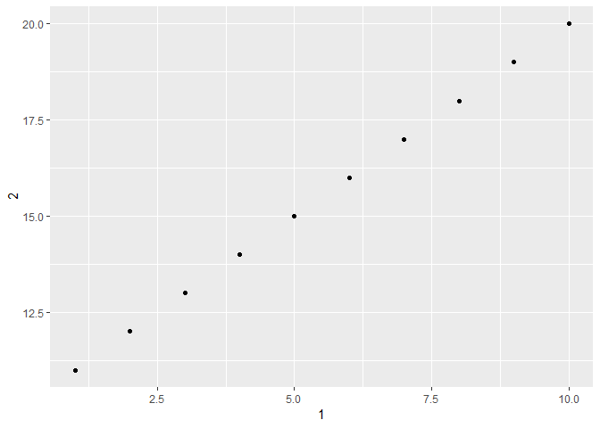

Chapters 10 - 11
================
Bryan Shalloway
Last updated: 2018-08-10

*Make sure the following packages are installed:*

# ch. 10: Tibbles

``` r
vignette("tibble")
```

  - `tibble`: produces a dataframe w/ some other helpful qualities that
    have advantages over `data.frame`
  - `as_tibble`: convert to a tibble
  - `tribble`: transposed tibble - set-up for data entry into a tibble
    in code
  - `print`: can use print to set how the tibble will print

<!-- end list -->

``` r
nycflights13::flights %>% 
  print(n = 2, width = Inf)
```

    ## # A tibble: 336,776 x 19
    ##    year month   day dep_time sched_dep_time dep_delay arr_time
    ##   <int> <int> <int>    <int>          <int>     <dbl>    <int>
    ## 1  2013     1     1      517            515         2      830
    ## 2  2013     1     1      533            529         4      850
    ##   sched_arr_time arr_delay carrier flight tailnum origin dest  air_time
    ##            <int>     <dbl> <chr>    <int> <chr>   <chr>  <chr>    <dbl>
    ## 1            819        11 UA        1545 N14228  EWR    IAH        227
    ## 2            830        20 UA        1714 N24211  LGA    IAH        227
    ##   distance  hour minute time_hour          
    ##      <dbl> <dbl>  <dbl> <dttm>             
    ## 1     1400     5     15 2013-01-01 05:00:00
    ## 2     1416     5     29 2013-01-01 05:00:00
    ## # ... with 3.368e+05 more rows

    + Also can convert with `as.data.frame` or use `options`, see 10.5.6 below

  - `enframe`: let’s you encode name and value, see 10.5.5 below
  - `class`: for checking the class of the object

## 10.5

*1. How can you tell if an object is a tibble? (Hint: try printing
mtcars, which is a regular data frame).*

Could look at printing, e.g. only prints first 15 rows and enough
variables where you can see them all, or by checking explicitly the
`class` function\[1\]

*2. Compare and contrast the following operations on a data.frame and
equivalent tibble. What is different? Why might the default data frame
behaviours cause you frustration?*

Dataframes can’t do list-cols. Never changes type of input e.g. from
strings to factors, never changes names of variables, never creates row
names. Also, you can do list-cols with tibbles.

*3. If you have the name of a variable stored in an object, e.g. var \<-
“mpg”, how can you extract the reference variable from a tibble?*

``` r
var <- "var_name"

# Will extract the column as an atomic vector
df[[var]]
```

*4. Practice referring to non-syntactic names in the following data
frame by:*

``` r
df <- tibble(`1` = 1:10, `2` = 11:20)
```

*a. Extracting the variable called 1.*

``` r
df %>% 
  select(1)
```

    ## # A tibble: 10 x 1
    ##      `1`
    ##    <int>
    ##  1     1
    ##  2     2
    ##  3     3
    ##  4     4
    ##  5     5
    ##  6     6
    ##  7     7
    ##  8     8
    ##  9     9
    ## 10    10

*b. Plotting a scatterplot of 1 vs 2.*

``` r
df %>% 
  ggplot(aes(x = `1`, y = `2`))+
  geom_point()
```

<!-- -->

*c. Creating a new column called 3 which is 2 divided by 1.*

``` r
df %>% 
  mutate(`3` = `1` / `2`) 
```

    ## # A tibble: 10 x 3
    ##      `1`   `2`    `3`
    ##    <int> <int>  <dbl>
    ##  1     1    11 0.0909
    ##  2     2    12 0.167 
    ##  3     3    13 0.231 
    ##  4     4    14 0.286 
    ##  5     5    15 0.333 
    ##  6     6    16 0.375 
    ##  7     7    17 0.412 
    ##  8     8    18 0.444 
    ##  9     9    19 0.474 
    ## 10    10    20 0.5

*d. Renaming the columns to one, two and three.*

``` r
df %>% 
  mutate(`3` = `1` / `2`) %>% 
  rename(one = `1`,
         two = `2`,
         three = `3`)
```

    ## # A tibble: 10 x 3
    ##      one   two  three
    ##    <int> <int>  <dbl>
    ##  1     1    11 0.0909
    ##  2     2    12 0.167 
    ##  3     3    13 0.231 
    ##  4     4    14 0.286 
    ##  5     5    15 0.333 
    ##  6     6    16 0.375 
    ##  7     7    17 0.412 
    ##  8     8    18 0.444 
    ##  9     9    19 0.474 
    ## 10    10    20 0.5

*5. What does tibble::enframe() do? When might you use it?*

Let’s you encode “name” and “value”

``` r
tibble::enframe(1:3)
```

    ## # A tibble: 3 x 2
    ##    name value
    ##   <int> <int>
    ## 1     1     1
    ## 2     2     2
    ## 3     3     3

``` r
tibble::enframe(c(a = 5, b = 8))
```

    ## # A tibble: 2 x 2
    ##   name  value
    ##   <chr> <dbl>
    ## 1 a         5
    ## 2 b         8

``` r
tibble::enframe(c(a = 5:8, b = 7:10))
```

    ## # A tibble: 8 x 2
    ##   name  value
    ##   <chr> <int>
    ## 1 a1        5
    ## 2 a2        6
    ## 3 a3        7
    ## 4 a4        8
    ## 5 b1        7
    ## 6 b2        8
    ## 7 b3        9
    ## 8 b4       10

``` r
tibble::enframe(c(a = 5:8, b = 7:10, d = 9:12))
```

    ## # A tibble: 12 x 2
    ##    name  value
    ##    <chr> <int>
    ##  1 a1        5
    ##  2 a2        6
    ##  3 a3        7
    ##  4 a4        8
    ##  5 b1        7
    ##  6 b2        8
    ##  7 b3        9
    ##  8 b4       10
    ##  9 d1        9
    ## 10 d2       10
    ## 11 d3       11
    ## 12 d4       12

*6. What option controls how many additional column names are printed at
the footer of a tibble?*

  - argument `tibble.width`

<!-- end list -->

``` r
options(tibble.print_max = n, tibble.print_min = m)
options(tibble.width = Inf)
options(dplyr.print_min = Inf) #to always show all rows
```

# ch. 11: Data import

  - `read_csv()` reads comma delimited files, `read_csv2()` reads
    semicolon separated files (common in countries where `,` is used as
    the decimal place), `read_tsv()` reads tab delimited files, and
    `read_delim()` reads in files with any delimiter.
  - `read_fwf()` reads fixed width files. You can specify fields either
    by their widths with `fwf_widths()` or their position with
    `fwf_positions()`. `read_table()` reads a common variation of fixed
    width files where columns are separated by white space.
  - `data.table::fread`, good for raw speed
  - `read_log()` reads Apache style log files. (But also check out
    [webreadr](https://github.com/Ironholds/webreadr) which is built on
    top of `read_log()` and provides many more helpful tools.)

<!-- end list -->

``` r
read_log(readr_example("example.log"))
```

    ## Parsed with column specification:
    ## cols(
    ##   X1 = col_character(),
    ##   X2 = col_character(),
    ##   X3 = col_character(),
    ##   X4 = col_character(),
    ##   X5 = col_character(),
    ##   X6 = col_integer(),
    ##   X7 = col_integer()
    ## )

    ## # A tibble: 2 x 7
    ##   X1       X2    X3          X4           X5                      X6    X7
    ##   <chr>    <chr> <chr>       <chr>        <chr>                <int> <int>
    ## 1 172.21.~ <NA>  "Microsoft~ 08/Apr/2001~ GET /scripts/iisadm~   200  3401
    ## 2 127.0.0~ <NA>  frank       10/Oct/2000~ GET /apache_pb.gif ~   200  2326

``` r
# readr_example finds the correct path associated with the package by doing the following:
## system.file("extdata", path, package = "readr", mustWork = TRUE)
```

  - `parse_*()`: take character vector and return more specialized
    vector
      - `parse_logical`, `parse_integer`, `parse_double`,
        `parse_number`\[2\], `parse_character`, `parse_factor`(has
        `levels` as an argument), `parse_datetime`, `parse_date`,
        `parse_time` (these last three have an arg of\` `format`)
  - `locale` argument for use in parse functions to affect formatting
    and to pass into argument `locale = locale(<arg> = "<value>"))`
      - for double, e.g. `locale = locale(decimal_mark = ",")`
      - for number, e.g. `locale = locale(grouping_mark = ".")`
      - for character, e.g. `locale = locale(encoding = "Latin1")`
      - for dates, e.g. `locale = locale(lang = "fr")` (to see built-in
        language options use `date_name_langs` and can create own with
        `date_names`)
  - `problems`: returns problems on import
  - `charToRaw` will show underlying representation of a character\[3\]
  - `guess_encoding`: can guess encoding – generally would use this with
    `charToRaw` and helps avoid figuring out encoding by hand

<!-- end list -->

``` r
x1 <- "El Ni\xf1o was particularly bad this year"
guess_encoding(charToRaw(x1))
```

    ## # A tibble: 2 x 2
    ##   encoding   confidence
    ##   <chr>           <dbl>
    ## 1 ISO-8859-1       0.46
    ## 2 ISO-8859-9       0.23

  - If defaults don’t work (primarily for dates, times, numbers) can use
    following to specify parsing: Year : `%Y` (4 digits). : `%y` (2
    digits); 00-69 -\> 2000-2069, 70-99 -\> 1970-1999.

<!-- end list -->

  - Month  
    `%m` (2 digits).
    `%b` (abbreviated name, like “Jan”).
    `%B` (full name, “January”).
  - Day  
    `%d` (2 digits).
    `%e` (optional leading space).
  - Time  
    `%H` 0-23 hour.
    `%I` 0-12, must be used with `%p`.
    `%p` AM/PM indicator.
    `%M` minutes.
    `%S` integer seconds.
    `%OS` real seconds.
    `%Z` Time zone (as name, e.g. `America/Chicago`). Beware of
    abbreviations: if you’re American, note that “EST” is a Canadian
    time zone that does not have daylight savings time. It is *not*
    Eastern Standard Time\! We’ll come back to this \[time zones\].
    `%z` (as offset from UTC, e.g. `+0800`).
  - Non-digits  
    `%.` skips one non-digit character.
    `%*` skips any number of non-digits.

<!-- end list -->

  - `guess_parser`: returns what readr would think the character vector
    you provide it should be parsed into
  - `parse_guess`: uses readr’s guess of the vector type to parse the
    column
  - `col_*`: counterpoint to `parse_*` functions except for use when
    data is in a file rather than a string already loaded in R (as
    needed for `parse_*`)
      - `cols`: use this to pass in the `col_*` types,
      - `col_types = cols( x = col_double(), y = col_date() )`
      - to read in all columns as character use `col_types =
        cols(.default = col_character())`
      - can set `n_max` to smallish number if reading in large file and
        still debugging parsing issues
  - Recommend always input `cols`, if you want to be strict when loading
    in data set `stop_for_problems`
  - `read_lines` read into character vector of lines (use when having
    major issues)
  - `read_file` read in as character vector of length 1 (use when having
    major issues)
  - `read_rds` reads in R’s custom binary format\[4\]
  - `feather::read_feather`: fast binary file format shared across
    languages\[5\]
  - writing files^\[readr functions will encodes strings in UTF-8 and
    saves dates and date-times in ISO8601):
      - `write_csv`, `write_tsv`, `write_excel_csv`, `write_rds`\[6\],
        \* `feather::read_feather`
  - other packages for reading-in / writing data: `haven`, `readxl`,
    `DBI`, `odbc`, `jsonlite`, `xml2`, `rio`

## 11.2.2.

*1. What function would you use to read a file where fields were
separated with “|”?*  
`read_delim` for example:

``` r
read_delim("a|b|c\n1|2|3", delim = "|")
```

    ## # A tibble: 1 x 3
    ##       a     b     c
    ##   <int> <int> <int>
    ## 1     1     2     3

*2. Apart from `file`, `skip`, and `comment`, what other arguments do
`read_csv()` and `read_tsv()` have in common?*\[7\]

col\_names, col\_types, locale, na, quoted\_na, quote, trim\_ws, skip,
n\_max, guess\_max, progress

*3. What are the most important arguments to `read_fwf()`?*

widths

*4. Sometimes strings in a CSV file contain commas. To prevent them from
causing problems they need to be surrounded by a quoting character, like
" or ’.* By convention, `read_csv()` assumes that the quoting character
will be ", and if you want to change it you’ll need to use
`read_delim()` instead. *What arguments do you need to specify to read
the following text into a data frame?*

``` r
"x,y\n1,'a,b'"
```

    ## [1] "x,y\n1,'a,b'"

``` r
read_delim("x,y\n1,'a,b'", delim = ",", quote = "'")
```

    ## # A tibble: 1 x 2
    ##       x y    
    ##   <int> <chr>
    ## 1     1 a,b

*5. Identify what is wrong with each of the following inline CSV files.
What happens when you run the code?*

  - `read_csv("a,b\n1,2,3\n4,5,6")`
      - needs 3rd column header, skips 3rd argument on each line,
        corrected: `read_csv("a,b\n1,2\n3,4\n5,6")`
  - `read_csv("a,b,c\n1,2\n1,2,3,4")`
      - missing 3rd value on 2nd line so currently makes NA, corrected:
        `read_csv("a,b,c\n1,2, 1\n2,3,4")`
  - `read_csv("a,b\n\"1")`
      - 2nd value missing and 2nd quote mark missing (though quotes are
        unnecessary), corrected: `read_csv("a,b\n\"1\",\"2\"")`
  - `read_csv("a,b\n1,2\na,b")`
      - Have character and numeric types,
  - `read_csv("a;b\n1;3")`
      - need to make read\_csv2() because is seperated by semicolons,
        corrected: `read_csv2("a;b\n1;3")`

## 11.3.5.

*1. What are the most important arguments to `locale()`?*

  - It depends on the `parse_*` type, e.g.
      - for double, e.g. `locale = locale(decimal_mark = ",")`
      - for number, e.g. `locale = locale(grouping_mark = ".")`
      - for character, e.g. `locale = locale(encoding = "Latin1")`
      - for dates, e.g. `locale = locale(lang = "fr")`
  - Below are a few examples for double and
number

<!-- end list -->

``` r
parse_double("1.23")
```

    ## [1] 1.23

``` r
parse_double("1,23", locale = locale(decimal_mark=","))
```

    ## [1] 1.23

``` r
parse_number("the cost is $125.34, it's a good deal") #Slightly different than book, captures decimal
```

    ## [1] 125.34

``` r
parse_number("$123,456,789")
```

    ## [1] 123456789

``` r
parse_number("$123.456.789")
```

    ## [1] 123.456

``` r
parse_number("$123.456.789", locale = locale(grouping_mark = "."))#used in europe
```

    ## [1] 123456789

``` r
parse_number("$123'456'789", locale = locale(grouping_mark = "'"))#used in Switzerland
```

    ## [1] 123456789

*2. What happens if you try and set `decimal_mark` and `grouping_mark`
to the same character? What happens to the default value of
grouping\_mark when you set decimal\_mark to “,”? What happens to the
default value of decimal\_mark when you set the grouping\_mark to “.”?*

  - can’t set both to be same–if you change one, other automatically
    changes

<!-- end list -->

``` r
parse_number("$135.435,45", locale = locale(grouping_mark = ".", decimal_mark = ","))
```

    ## [1] 135435.4

``` r
parse_number("$135.435,45", locale = locale(grouping_mark = "."))
```

    ## [1] 135435.4

*3. I didn’t discuss the date\_format and time\_format options to
`locale()`. What do they do? Construct an example that shows when they
might be useful.*

  - date\_format and time\_format in locale() let you set the default
    date and time formats

<!-- end list -->

``` r
parse_date("31 january 2015", format = "%d %B %Y")
```

    ## [1] "2015-01-31"

``` r
parse_date("31 january 2015", locale = locale(date_format = "%d %B %Y"))
```

    ## [1] "2015-01-31"

``` r
#let's you change it in locale()
```

*4. If you live outside the US, create a new locale object that
encapsulates the settings for the types of file you read most commonly.*

  - I live in the US.

*5. What’s the difference between read\_csv() and read\_csv2()?*

  - Second expects semicolons

*6. What are the most common encodings used in Europe? What are the most
common encodings used in Asia? Do some googling to find out.*

  - Europe tends to use “%d-%m-%Y”
  - Asia tends to use “%d.%m.%Y”

*7. Generate the correct format string to parse each of the following
dates and times:*

``` r
d1 <- "January 1, 2010"
d2 <- "2015-Mar-07"
d3 <- "06-Jun-2017"
d4 <- c("August 19 (2015)", "July 1 (2015)")
d5 <- "12/30/14" # Dec 30, 2014
t1 <- "1705"
t2 <- "11:15:10.12 PM"
t3 <- "11:::15:10.12 PM"
```

Solutions:

``` r
parse_date(d1, "%B %d, %Y")
```

    ## [1] "2010-01-01"

``` r
parse_date(d2, "%Y-%b-%d")
```

    ## [1] "2015-03-07"

``` r
parse_date(d3, "%d-%b-%Y")
```

    ## [1] "2017-06-06"

``` r
parse_date(d3, "%d%.%b-%Y") #could use this alternatively
```

    ## [1] "2017-06-06"

``` r
parse_date(d4, "%B %d (%Y)")
```

    ## [1] "2015-08-19" "2015-07-01"

``` r
parse_date(d5, "%m/%d/%y")
```

    ## [1] "2014-12-30"

``` r
parse_time(t1, "%H%M")
```

    ## 17:05:00

``` r
parse_time(t2, "%I:%M:%OS %p")
```

    ## 23:15:10.12

``` r
parse_time(t3, "%I%*%M:%OS %p")
```

    ## 23:15:10.12

1.  or could check a few other things such as if list-cols are supported

2.  can be helpful for dealing with parsing currencies or percentages
    for example…

3.  e.g. helpful for use w/ `parse_char`

4.  `readRDS` is base R version

5.  though does not support list-cols

6.  base R version is `saveRDS`

7.  \* `skip = n`, `comment = #` any line that starts w/ input to
    comment will be skipped, `col_names = FALSE` or perhaps `c("x", "y",
    "z")`, `na = "."`
