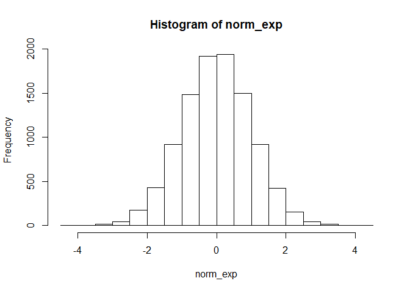

Chapter 19: Functions
================
Bryan Shalloway
Last updated: 2018-04-24

-   [ch. 19: Functions](#ch.-19-functions)
    -   [19.2: When should you write a function?](#when-should-you-write-a-function)
        -   [19.2.1](#section)
    -   [19.3: Functions are for humans and computers](#functions-are-for-humans-and-computers)
        -   [19.3.1](#section-1)
    -   [19.4: Conditional execution](#conditional-execution)
        -   [19.4.4](#section-2)
    -   [19.5: Function arguments](#function-arguments)
        -   [19.5.5](#section-3)
    -   [19.6: Return values](#return-values)
-   [Appendix](#appendix)
    -   [19.2.1.4](#section-4)
    -   [Changing values with indexes](#changing-values-with-indexes)
        -   [Applying indexing to dfs](#applying-indexing-to-dfs)
    -   [Better than `ifelse()`?](#better-than-ifelse)
    -   [Dplyr and functions](#dplyr-and-functions)
    -   [19.2.3.5](#section-5)

``` r
knitr::opts_chunk$set(echo = TRUE, cache = TRUE, message = FALSE)
```

*Make sure the following packages are installed:*

``` r
library(nycflights13)
library(ggplot2)
library(dplyr)
library(forcats)
library(tidyr)
library(lubridate)
library(stringr)
library(e1071)
```

ch. 19: Functions
=================

-   `function_name <- function(input1, input2) {}`
-   `if () {}`
-   `else if () {}`
-   `else {}`
-   `||` (or) , `&&` (and) -- used to combine multiple logical expressions
-   `|` and `&` are vectorized operations not to be used with `if` statements
-   `any` checks if any values in vector are `TRUE`
-   `all` checks if all values in vector are `TRUE`
-   `identical` strict check for if values are the same
-   `dplyr::near` for more lenient comparison and typically better than `identical` as unaffected by floating point numbers and fine with different types
-   `switch` evaluate selected code based on position or name (good for replacing long chain of `if` statements). e.g.

``` r
Operation_Times2 <- function(x, y, op){
   first_op <- switch(op,
     plus = x + y,
     minus = x - y,
     times = x * y,
     divide = x / y,
     stop("Unknown op!")
   )
   
   first_op * 2
  }

Operation_Times2(5, 7, "plus")
```

    ## [1] 24

-   `stop` stops expression and executes error action, note that `.call` default is `FALSE`
-   `warning` generates a warning that corresponds with arguments, `suppressWarnings` may also be useful to no
-   `stopifnot` test multiple args and will produce error message if any are not true -- compromise that prevents you from tedious work of putting multiple `if(){} else stop()` statements
-   `...` useful catch-all if your function primarily wraps another function (note that misspelled arguments will not raise an error), e.g.

``` r
commas <- function(...) stringr::str_c(..., collapse = ", ")
commas(letters[1:10])
```

    ## [1] "a, b, c, d, e, f, g, h, i, j"

-   `cut` can be used to discretize continuous variables (also saves long `if` statements)
-   `return` allows you to return the function early, typically reserve use for when the function can return early with a simpler function
-   `cat` function to print label in output
-   `invisible` input does not get printed out

19.2: When should you write a function?
---------------------------------------

### 19.2.1

1.  Why is `TRUE` not a parameter to `rescale01()`? What would happen if `x` contained a single missing value, and `na.rm` was `FALSE`?

    -   `TRUE` doesn't change between uses.
    -   The output would be `NA`

2.  In the second variant of `rescale01()`, infinite values are left unchanged. Rewrite `rescale01()` so that `-Inf` is mapped to 0, and `Inf` is mapped to 1.

    ``` r
    rescale01_inf <- function(x){

      rng <- range(x, na.rm = TRUE, finite = TRUE)
      x_scaled <- (x - rng[1]) / (rng[2] - rng[1])
      is_inf <- is.infinite(x)
      is_less0 <- x < 0
      x_scaled[is_inf & is_less0] <- 0
      x_scaled[is_inf & (!is_less0)] <- 1
      x_scaled
    }

    x <-  c(Inf, -Inf, 0, 3, -5)
    rescale01_inf(x)
    ```

        ## [1] 1.000 0.000 0.625 1.000 0.000

3.  Practice turning the following code snippets into functions. Think about what each function does. What would you call it? How many arguments does it need? Can you rewrite it to be more expressive or less duplicative?

    ``` r
    mean(is.na(x))

    x / sum(x, na.rm = TRUE)

    sd(x, na.rm = TRUE) / mean(x, na.rm = TRUE)
    ```

    -   See solutions below:

    ``` r
    x <- c(1, 4, 2, 0, NA, 3, NA)

    #mean(is.na(x))
    perc_na <- function(x) {
      is.na(x) %>% mean()
    }

    perc_na(x)
    ```

        ## [1] 0.2857143

    ``` r
    #x / sum(x, na.rm = TRUE)
    prop_weighted <- function(x) {
      x / sum(x, na.rm = TRUE)
    }
    prop_weighted(x)
    ```

        ## [1] 0.1 0.4 0.2 0.0  NA 0.3  NA

    ``` r
    #sd(x, na.rm = TRUE) / mean(x, na.rm = TRUE)
    CoefficientOfVariation <- function(x) {
      sd(x, na.rm = TRUE) / mean(x, na.rm = TRUE)
    }

    CoefficientOfVariation(x)
    ```

        ## [1] 0.7905694

4.  Follow <http://nicercode.github.io/intro/writing-functions.html> to write your own functions to compute the variance and skew of a numeric vector.

    -   Re-do below to write measures for skew and variance (e.g. kurtosis, etc.)

    ``` r
    var_bry <- function(x){
      sum((x - mean(x)) ^ 2) / (length(x) - 1)
    }

    skewness_bry <- function(x) {
      mean((x - mean(x)) ^ 3) / var_bry(x) ^ (3 / 2)
    }
    ```

    Let's create some samples of distributions -- normal, t (with 7 degrees of freedom), unifrom, poisson (with lambda of 2).

    Note that an example with a cauchy distribution and looking at difference in kurtosis between that and a normal distribution has been moved to the [Appendix](#appendix) section [19.2.1.4](#section-4).

    ``` r
    nd <- rnorm(10000)
    td_df7 <- rt(10000, df = 7)
    ud <- runif(10000)
    pd_l2 <- rpois(10000, 2)
    ```

    Verify that these functions match with established functions

    ``` r
    dplyr::near(skewness_bry(pd_l2), e1071::skewness(pd_l2, type = 3))
    ```

        ## [1] TRUE

    ``` r
    dplyr::near(var_bry(pd_l2), var(pd_l2))
    ```

        ## [1] TRUE

    Let's look at the distributions as well as their variance an skewness

    ``` r
    distributions_df <- tibble(normal_dist = nd,
           t_7df_dist = td_df7,
           uniform_dist = ud,
           poisson_dist = pd_l2)

    distributions_df %>% 
      gather(normal_dist:poisson_dist, value = "sample", key = "dist_type") %>% 
      mutate(dist_type = factor(forcats::fct_inorder(dist_type))) %>% 
      ggplot(aes(x = sample))+
      geom_histogram()+
      facet_wrap(~ dist_type, scales = "free")
    ```

        ## Warning: package 'bindrcpp' was built under R version 3.4.4

    

    ``` r
    tibble(dist_type = names(distributions_df),
    skewness = purrr::map_dbl(distributions_df, skewness_bry), 
    variance = purrr::map_dbl(distributions_df, var_bry))
    ```

        ## # A tibble: 4 x 3
        ##   dist_type    skewness variance
        ##   <chr>           <dbl>    <dbl>
        ## 1 normal_dist  -0.00242   0.993 
        ## 2 t_7df_dist    0.0198    1.40  
        ## 3 uniform_dist -0.0189    0.0839
        ## 4 poisson_dist  0.714     1.98

    -   excellent video explaining intuition behind skewness: <https://www.youtube.com/watch?v=z3XaFUP1rAM>

5.  Write `both_na()`, a function that takes two vectors of the same length and returns the number of positions that have an `NA` in both vectors.

    ``` r
    both_na <- function(x, y) {
      if (length(x) == length(y)) {
      sum(is.na(x) & is.na(y))
      } else
      stop("Vectors are not equal length")
    }

    x <- c(4, NA, 7, NA, 3)
    y <- c(NA, NA, 5, NA, 0)
    z <- c(NA, 4)

    both_na(x, y)
    ```

        ## [1] 2

    ``` r
    both_na(x, z)
    ```

        ## Error in both_na(x, z): Vectors are not equal length

6.  What do the following functions do? Why are they useful even though they are so short?

    ``` r
    is_directory <- function(x) file.info(x)$isdir
    is_readable <- function(x) file.access(x, 4) == 0
    ```

    -   first checks if what is being referred to is actually a directory
    -   second checks if a specific file is readable

7.  Read the [complete lyrics](https://en.wikipedia.org/wiki/Little_Bunny_Foo_Foo) to "Little Bunny Foo Foo". There's a lot of duplication in this song. Extend the initial piping example to recreate the complete song, and use functions to reduce the duplication.

    -   Do later...

19.3: Functions are for humans and computers
--------------------------------------------

-   Recommends snake\_case over camelCase, but just choose one and be consistent
-   When functions have a link, common prefix over suffix (i.e. input\_select, input\_text over, select\_input, text\_input)
-   ctrl + shift + r creates section breaks in R scripts like below
    `# test label --------------------------------------------------------------`
    -   (though these cannot be made in markdown documents)

### 19.3.1

1.  Read the source code for each of the following three functions, puzzle out what they do, and then brainstorm better names.

    ``` r
    f1 <- function(string, prefix) {
      substr(string, 1, nchar(prefix)) == prefix
    }
    f2 <- function(x) {
      if (length(x) <= 1) return(NULL)
      x[-length(x)]
    }
    f3 <- function(x, y) {
      rep(y, length.out = length(x))
    }
    ```

    -   `f1`: `check_prefix`
    -   `f2`: `return_not_last`
    -   `f3`: `repeat_for_length`

2.  Take a function that you've written recently and spend 5 minutes brainstorming a better name for it and its arguments.

    -   Do later, consider doing for the airpline fix time functions, or for the CaseAnalysis data

3.  Compare and contrast `rnorm()` and `MASS::mvrnorm()`. How could you make them more consistent?

    -   uses mu = and Sigma = instead of mean = and sd = , and has extra parameters like tol, empirical, EISPACK
    -   Similar in that both are pulling samples from gaussian distribution
    -   `mvrnorm` is multivariate though, could change name to `rnorm_mv`

4.  Make a case for why `norm_r()`, `norm_d()` etc would be better than `rnorm()`, `dnorm()`. Make a case for the opposite.

    -   `norm_*` would show the commonality of them being from the same distribution. One could argue the important commonality though may be more related to it being either a random sample or a density distribution, in which case the `r*` or `d*` coming first may make more sense. To me, the fact that the help pages has all of the 'normal distribution' functions on the same page suggests the former may make more sense. However, I actually like having it be set-up the way it is, because I am more likely to forget the name of the distribution type I want over the fact that I want a random sample, so it's easier to type `r` and then do ctrl + space and have autocomplete help me find the specific distribution I want, e.g. `rnorm`, `runif`, `rpois`, `rbinom`...

19.4: Conditional execution
---------------------------

-   Function example that uses `if` statement. I though this was a tricky function and added some notes below...

``` r
has_name <- function(x) {
  nms <- names(x) 
  if (is.null(nms)) { 
    rep(FALSE, length(x))
  } else {
    !is.na(nms) & nms != ""
  }
}
```

-   note that if all names are blank, it returns the one-unit vector value NULL, hence the need for the `if` statement here...
-   `is.null` is not vectorized in the way that `is.na` is -- an exmpale of base R not being perfectly consistent. E.g. it's job is to return `TRUE` if given a `NULL` input, if you give it a list of `NULL` inputs it will return `FALSE`, e.g. `is.null(list(NULL, NULL))`

### 19.4.4

1.  What's the difference between `if` and `ifelse()`? Carefully read the help and construct three examples that illustrate the key differences.

    -   `ifelse` is vectorized, `if` is not
        -   Typically use `if` in functions when giving conditional options for how to evaluate
        -   Typically use `ifelse` when changing specific values in a vector
    -   If you supply `if` with a vector of length &gt; 1, it will use the first value

    ``` r
    x <- c(3, 4, 6)
    y <- c("5", "c", "9")

    # Use ifelse simple transformations of values like example below
    ifelse(x < 5, 0, x)
    ```

        ## [1] 0 0 6

    ``` r
    cutoff_make0 <- function(x, cutoff = 0){
      if(is.numeric(x)){
        ifelse(x < cutoff, 0, x)
      } else stop("The input provided is not a numeric vector")
    }

    cutoff_make0(x, cutoff = 4)
    ```

        ## [1] 0 4 6

    ``` r
    cutoff_make0(y, cutoff = 4)
    ```

        ## Error in cutoff_make0(y, cutoff = 4): The input provided is not a numeric vector

2.  Write a greeting function that says "good morning", "good afternoon", or "good evening", depending on the time of day. (Hint: use a time argument that defaults to `lubridate::now()`. That will make it easier to test your function.)

    ``` r
    greeting <- function(when) {

      time <- hour(when)

      if (time < 12 && time > 4) {
        greating <- "good morning"
      } else if (time < 17 && time >= 12) {
        greeting <- "good afternoon"
      } else greeting <- "good evening"

      when_char <- as.character(when)
      mid <- ", it is: "
      cat(greeting, mid, when_char, sep = "")
    }

    greeting(now())
    ```

        ## good afternoon, it is: 2018-04-17 16:17:19

3.  Implement a `fizzbuzz` function. It takes a single number as input. If the number is divisible by three, it returns "fizz". If it's divisible by five it returns "buzz". If it's divisible by three and five, it returns "fizzbuzz". Otherwise, it returns the number. Make sure you first write working code before you create the function.

    ``` r
    fizzbuzz <- function(x){
      if(is.numeric(x) && length(x) == 1){
        y <- ""
        if (x %% 5 == 0) y <- str_c(y, "fizz")
        if (x %% 3 == 0) y <- str_c(y, "buzz")
        if (str_length(y) == 0) {
          print(x)
        } else print(y)
      } else stop("Input is not a numeric vector with length 1")
    }

    fizzbuzz(4)
    ```

        ## [1] 4

    ``` r
    fizzbuzz(10)
    ```

        ## [1] "fizz"

    ``` r
    fizzbuzz(6)
    ```

        ## [1] "buzz"

    ``` r
    fizzbuzz(30)
    ```

        ## [1] "fizzbuzz"

    ``` r
    fizzbuzz(c(34, 21))
    ```

        ## Error in fizzbuzz(c(34, 21)): Input is not a numeric vector with length 1

4.  How could you use `cut()` to simplify this set of nested if-else statements?

    ``` r
    if (temp <= 0) {
      "freezing"
    } else if (temp <= 10) {
      "cold"
    } else if (temp <= 20) {
      "cool"
    } else if (temp <= 30) {
      "warm"
    } else {
      "hot"
    }
    ```

    -   Below is example of fix

    ``` r
    temp <- seq(-10, 50, 5)
    cut(temp, 
        breaks = c(-Inf, 0, 10, 20, 30, Inf),  #need to include negative and positive infiniity
        labels = c("freezing", "cold", "cool", "warm", "hot"),
        right = TRUE,
        oredered_result = TRUE)
    ```

        ##  [1] freezing freezing freezing cold     cold     cool     cool    
        ##  [8] warm     warm     hot      hot      hot      hot     
        ## Levels: freezing cold cool warm hot

    How would you change the call to `cut()` if I'd used `<` instead of `<=`? What is the other chief advantage of `cut()` for this problem? (Hint: what happens if you have many values in `temp`?)

    -   See below change to `right` argument

    ``` r
    cut(temp, 
        breaks = c(-Inf, 0, 10, 20, 30, Inf),  #need to include negative and positive infiniity
        labels = c("freezing", "cold", "cool", "warm", "hot"),
        right = FALSE,
        oredered_result = TRUE)
    ```

        ##  [1] freezing freezing cold     cold     cool     cool     warm    
        ##  [8] warm     hot      hot      hot      hot      hot     
        ## Levels: freezing cold cool warm hot

5.  What happens if you use `switch()` with numeric values?

    -   It will return the index of the argument.
    -   In example below, I input '3' into `switch` value so it does the `times` argument

    ``` r
    math_operation <- function(x, y, op){
       switch(op,
         plus = x + y,
         minus = x - y,
         times = x * y,
         divide = x / y,
         stop("Unknown op!")
       )
      }

    math_operation(5, 4, 3)
    ```

        ## [1] 20

6.  What does this `switch()` call do? What happens if `x` is "e"?

    ``` r
    x <- "e"

    switch(x, 
      a = ,
      b = "ab",
      c = ,
      d = "cd"
    )
    ```

    Experiment, then carefully read the documentation.

    -   If `x` is 'e' nothing will be outputted. If `x` is 'c' or 'd' then 'cd' is outputted. If 'a' or 'b' then 'ab' is outputeed. If blank it will continue down list until reaching an argument to output.

19.5: Function arguments
------------------------

*Common non-descriptive short argument names: *

-   `x`, `y`, `z`: vectors.
-   `w`: a vector of weights.
-   `df`: a data frame.
-   `i`, `j`: numeric indices (typically rows and columns).
-   `n`: length, or number of rows.
-   `p`: number of columns.

### 19.5.5

1.  What does `commas(letters, collapse = "-")` do? Why?

    -   `commas` function is below

    ``` r
    commas <- function(...) stringr::str_c(..., collapse = ", ")

    commas(letters[1:10])
    ```

        ## [1] "a, b, c, d, e, f, g, h, i, j"

    ``` r
    commas(letters[1:10], collapse = "-")
    ```

        ## Error in stringr::str_c(..., collapse = ", "): formal argument "collapse" matched by multiple actual arguments

    -   The above fails because are essentially specifying two different values for the `collapse` argument

    -   Takes in vector of mulitple strings and outputs one-unit character string with items concatenated together and seperated by columns
    -   Is able to do this via use of `...` that turns this into a wrapper on `stringr::str_c` with the `collapse` value specified

2.  It'd be nice if you could supply multiple characters to the `pad` argument, e.g. `rule("Title", pad = "-+")`. Why doesn't this currently work? How could you fix it?

    -   current `rule` function is below

    ``` r
    rule <- function(..., pad = "-") {
      title <- paste0(...)
      width <- getOption("width") - nchar(title) - 5
      cat(title, " ", stringr::str_dup(pad, width), "\n", sep = "")
    }

    # Note that `cat` is used instead of `paste` because paste would output it as a character vector, whereas `cat` is focused on just ouptut, could also have used `print`, though print does more conversion than cat does (apparently)

    rule("Tis the season"," to be jolly")
    ```

        ## Tis the season to be jolly --------------------------------------------

    -   doesn't work because pad ends-up being too many characters in this situation

    ``` r
    rule("Tis the season"," to be jolly", pad="+-")
    ```

        ## Tis the season to be jolly +-+-+-+-+-+-+-+-+-+-+-+-+-+-+-+-+-+-+-+-+-+-+-+-+-+-+-+-+-+-+-+-+-+-+-+-+-+-+-+-+-+-+-+-

    -   instead would need to make the number of times `pad` is duplicated dependent on its length, see below for fix

    ``` r
    rule_pad_fix <- function(..., pad = "-") {
      title <- paste0(...)
      width <- getOption("width") - nchar(title) - 5
      width_fix <- width %/% stringr::str_length(pad)
      cat(title, " ", stringr::str_dup(pad, width_fix), "\n", sep = "")
    }

    rule_pad_fix("Tis the season"," to be jolly", pad="+-")
    ```

        ## Tis the season to be jolly +-+-+-+-+-+-+-+-+-+-+-+-+-+-+-+-+-+-+-+-+-+-

3.  What does the `trim` argument to `mean()` do? When might you use it?

    -   `trim` specifies proportion of data to take off from both ends, good with outliers

    ``` r
    mean(c(-1000, 1:100, 100000), trim = .025) 
    ```

        ## [1] 50.5

4.  The default value for the `method` argument to `cor()` is `c("pearson", "kendall", "spearman")`. What does that mean? What value is used by default?

    -   is showing that you can choose from any of these, will default to use `pearson` (value in first position)

19.6: Return values
-------------------

``` r
show_missings <- function(df) {
  n <- sum(is.na(df))
  cat("Missing values: ", n, "\n", sep = "")
  invisible(df)
}

x <- show_missings(mtcars)
```

    ## Missing values: 0

``` r
str(x)
```

    ## 'data.frame':    32 obs. of  11 variables:
    ##  $ mpg : num  21 21 22.8 21.4 18.7 18.1 14.3 24.4 22.8 19.2 ...
    ##  $ cyl : num  6 6 4 6 8 6 8 4 4 6 ...
    ##  $ disp: num  160 160 108 258 360 ...
    ##  $ hp  : num  110 110 93 110 175 105 245 62 95 123 ...
    ##  $ drat: num  3.9 3.9 3.85 3.08 3.15 2.76 3.21 3.69 3.92 3.92 ...
    ##  $ wt  : num  2.62 2.88 2.32 3.21 3.44 ...
    ##  $ qsec: num  16.5 17 18.6 19.4 17 ...
    ##  $ vs  : num  0 0 1 1 0 1 0 1 1 1 ...
    ##  $ am  : num  1 1 1 0 0 0 0 0 0 0 ...
    ##  $ gear: num  4 4 4 3 3 3 3 4 4 4 ...
    ##  $ carb: num  4 4 1 1 2 1 4 2 2 4 ...

-   can still use in pipes

``` r
mtcars %>% 
  show_missings() %>% 
  mutate(mpg = ifelse(mpg < 20, NA, mpg)) %>% 
  show_missings() 
```

    ## Missing values: 0
    ## Missing values: 18

Appendix
========

19.2.1.4
--------

*Function for Standard Error*

    ```r
    x <- c(5, -2, 8, 6, 9)
    sd(x, na.rm = TRUE) / sqrt(sum(!is.na(x)))
    ```

    ```
    ## [1] 1.933908
    ```

    ```r
    sample_se <- function(x) {
      sd(x, na.rm = TRUE) / sqrt(sum(!is.na(x)) - 1)
    }    #sqrt(var(x)/sum(!is.na(x)))

    sample_se(x)
    ```

    ```
    ## [1] 2.162175
    ```

*Function for kurtosis*

``` r
kurtosis_type3 <- function(x){
  sum((x - mean(x)) ^ 4) / length(x) / sd(x) ^ 4 - 3
}
```

Notice differences between cauchy and normal distribution

``` r
set.seed(1235)
norm_exp <- rnorm(10000)

set.seed(1235)
cauchy_exp <- rcauchy(10000)

hist(norm_exp)
```



``` r
hist(cauchy_exp)
```


``` r
kurtosis_type3(norm_exp)
```

    ## [1] 0.06382172

``` r
kurtosis_type3(cauchy_exp)
```

    ## [1] 1197.052

Changing values with indexes
----------------------------

\*In this section I use the word 'indexes' to refer to any base R method for specifying position [1].

My solution to building the new function in 19.2.1.2 shows another way of replacing values over re-writing a new vector, namely by specifying indexes and then forcing those to be a new value.

For example, say we have a vector `c(1:20)` and we want to make all even values equal to 0. below is how you could do that by simply re-writing this to a new vector

``` r
x <- c(1:20)

x_0_even <- ifelse((x %% 2) == 0, 0, x)

x_0_even
```

    ##  [1]  1  0  3  0  5  0  7  0  9  0 11  0 13  0 15  0 17  0 19  0

Alternatively, you could do this by simply overwriting the values in a specified index with a value (like I did in question 19.2.1.2)

``` r
x <- c(1:20)

x[(x %% 2) == 0] <- 0

x
```

    ##  [1]  1  0  3  0  5  0  7  0  9  0 11  0 13  0 15  0 17  0 19  0

Both the indexing and the ifelse method give the same output. I have a slight preference for the `ifelse` method as I think it is a little easier to read. Also, it doesn't force you to overwrite your data -- to save against this second problem I will often save a copy before applying the indexed approach (though if it's in a function don't need to worry about this as changes will default to occur within function not global environment). e.g.

``` r
x <- c(1:20)
x_0_even <- x

x_0_even[(x %% 2) == 0] <- 0

x_0_even
```

    ##  [1]  1  0  3  0  5  0  7  0  9  0 11  0 13  0 15  0 17  0 19  0

If you're curious about speed of each, you can see the index method tends to be faster on this dataset.

*Build functions (necessary for measuring speed): *

``` r
method_ifelse <- function(vector = c(1:20)){
  x <- vector
  
  x_0_even <- ifelse((x %% 2) == 0, 0, x)
  
  x_0_even
}

method_index <- function(vector = c(1:20)){
  x <- vector
  x[(x %% 2) == 0] <- 0
  
  x
}
```

*Measure time it takes to run: *

``` r
microbenchmark::microbenchmark(ifelse = method_ifelse(1:1000),
                               index = method_index(1:1000),
                               times = 500)
```

    ## Unit: microseconds
    ##    expr    min     lq      mean median      uq      max neval cld
    ##  ifelse 61.169 66.455 144.78194 75.139 108.933 7473.848   500   b
    ##   index 25.299 27.186  49.32632 28.697  41.157 5083.380   500  a

The index methods tends to be faster.

### Applying indexing to dfs

I have a high preference for using tidyverse style approaches when applying transformations to dataframes, though there are instances when it's easier to use indexing methods. A common example of this is say we want to replace all of the `NA` values across multiple columns in a dataframe.

``` r
df <- tibble(x = c(NA, 3, 4),
       y = c(4, NA, NA))
```

The code below uses an indexing method to replace all `NA` values in the df with 0

``` r
df_cleanNA <- df
df_cleanNA[is.na(df)] <- 0

df_cleanNA
```

    ## # A tibble: 3 x 2
    ##       x     y
    ##   <dbl> <dbl>
    ## 1    0.    4.
    ## 2    3.    0.
    ## 3    4.    0.

Below is the dplyr approach (requires knowledge of `mutate_all` and `funs`)

``` r
mutate_all(df, funs(ifelse(is.na(.), 0, .)))
```

    ## # A tibble: 3 x 2
    ##       x     y
    ##   <dbl> <dbl>
    ## 1    0.    4.
    ## 2    3.    0.
    ## 3    4.    0.

With a purrr function you could have done:

``` r
purrr::map_df(df, ~ifelse(is.na(.x), 0, .x))
```

    ## # A tibble: 3 x 2
    ##       x     y
    ##   <dbl> <dbl>
    ## 1    0.    4.
    ## 2    3.    0.
    ## 3    4.    0.

If you're curious of speed of each, below is microbenchmark test

``` r
df_na0_index <- function(df){
  df[is.na(df)] <- 0
  df
}

df_na0_dplyr <- function(df){
  mutate_all(df, funs(ifelse(is.na(.), 0, .)))
}

df_na0_purrr <- function(df){
  purrr::map_df(df, ~ifelse(is.na(.x), 0, .x))
}
```

*Measure time it takes to run: *

First on tiny dataset:

``` r
microbenchmark::microbenchmark(index = df_na0_index(flights),
                               dplyr = df_na0_index(flights),
                               purrr = df_na0_purrr(flights),
                               times = 10)
```

    ## Unit: milliseconds
    ##   expr       min        lq      mean    median        uq       max neval
    ##  index  201.6300  292.6702  301.1744  317.6130  338.5973  343.2306    10
    ##  dplyr  208.1357  217.0323  290.3740  298.8801  326.8440  370.8873    10
    ##  purrr 1155.3076 1470.3446 1697.9750 1725.7246 1747.8065 2770.6136    10
    ##  cld
    ##   a 
    ##   a 
    ##    b

Then on larger dataset:

``` r
microbenchmark::microbenchmark(index = df_na0_index(flights),
                               dplyr = df_na0_index(flights),
                               purrr = df_na0_purrr(flights),
                               times = 10)
```

    ## Unit: milliseconds
    ##   expr       min        lq      mean    median        uq       max neval
    ##  index  189.2212  239.1201  245.3826  249.9569  255.5471  276.8797    10
    ##  dplyr  203.1713  233.7426  243.5285  242.9708  245.5205  297.8110    10
    ##  purrr 1141.0992 1163.2424 1313.5106 1215.4882 1538.2077 1620.1738    10
    ##  cld
    ##   a 
    ##   a 
    ##    b

You should see that the index and dplyr method are pretty consistent on time, whereas the purrr method will be slower. For this example and some problems like this then indexing may be the best option (generally though I lean more towards using dplyr where possible).

I also wonder if there may be a better alternative to `ifelse` in this situation.

Better than `ifelse()`?
-----------------------

I end-up using `ifelse` a lot for basic transformations, I'm curious if there is a more efficient alternative for use with dplyr style...

-   I learned about dplyr's functions `dplyr::recode` which is similar to `forcats::fct_recode` and can be used for replacing multiple character values.
-   `dplyr::case_when` can be used for more complex criteria

Dplyr and functions
-------------------

As was mentioned, dplyr uses non-standard evaluation. This means that when referring to column names form within a function, dplyr will require some slightly different syntax... I typically find ways around this by deploying tricks with the `*_` verbs or taking advantage of the `vars` functions and `*_at` or by messing with the names, though am interested to hear other methods...

Say you want to write a function that takes in a dataframe and a list of column names and you want to return a sum of these into a new column with the name corresponding with the name of the spliced together columns. What would be the most elegant way of doing this with tidyverse style?

19.2.3.5
--------

    ```r
    position_both_na <- function(x, y) {
      if (length(x) == length(y)) {
      (c(1:length(x)))[(is.na(x) & is.na(y))]
      } else
      stop("Vectors are not equal length")
    }

    x <- c(4, NA, 7, NA, 3)
    y <- c(NA, NA, 5, NA, 0)
    z <- c(NA, 4)
    both_na(x, y)
    ```

    ```
    ## [1] 2
    ```

    ```r
    both_na(x, z)
    ```

    ```
    ## Error in both_na(x, z): Vectors are not equal length
    ```

-   specifies position where both are `NA`
-   second example shows returning of 'stop' argument

[1] I am using the word loosely to mean both either the situation when you specify postions by a series of `TRUE` / `FALSE` values or a series of numeric indexes E.g. x\[c(TRUE, TRUE, FALSE, FALSE, TRUE)\] or x\[c(1, 2, 5)\] , 'index' obviously sounds more like the later, but I mean it generally to cover just 'base R method of specifying positoin'.
