Chapter 24 Model building
================
Bryan Shalloway
Last updated: 2018-07-02

-   [ch. 24: Model building](#ch.-24-model-building)
    -   [24.2: Why are low quality diamonds more expensive?](#why-are-low-quality-diamonds-more-expensive)
        -   [24.2.3](#section)
    -   [24.3 What affects the number of daily flights?](#what-affects-the-number-of-daily-flights)
        -   [24.3.5](#section-1)
-   [Appendix](#appendix)
    -   [24.2.3.3](#section-2)
    -   [24.2.3.4](#section-3)
        -   [heteroskedasticity](#heteroskedasticity)
        -   [rsquared on logged values](#rsquared-on-logged-values)
    -   [24.2.3.1](#section-4)
        -   [More notes on logs](#more-notes-on-logs)
        -   [carat more clumped than price](#carat-more-clumped-than-price)
    -   [Logs (simulated examples)](#logs-simulated-examples)
        -   [Exponential relationship](#exponential-relationship)
        -   [Log relationship](#log-relationship)
    -   [Exponential distribution of original values](#exponential-distribution-of-original-values)
        -   [flip x and y](#flip-x-and-y)
        -   [simulation](#simulation)
        -   [Rescale example](#rescale-example)
        -   [Box-cox](#box-cox)
        -   [Other modeling techniques](#other-modeling-techniques)
        -   [distributions of simulated data](#distributions-of-simulated-data)
    -   [Diamonds data review](#diamonds-data-review)
        -   [carat by mean `table` value](#carat-by-mean-table-value)
        -   [Cutoff, Part 1](#cutoff-part-1)
        -   [Cutoff, Part 2](#cutoff-part-2)
    -   [25.3.5.4](#section-5)

``` r
knitr::opts_chunk$set(echo = TRUE, cache = TRUE, message = FALSE)
```

*Make sure the following packages are installed:*

ch. 24: Model building
======================

-   `data_grid`, argument: `.model` :
-   if the model needs variables that haven't been supplied explicitly, will auto-fill them with "typical" values; continuous --&gt; median; categorical --&gt; mode
-   `MASS:rlm` robust linear model that uses "M estimation by default"
    -   warning: MASS::select will clash with dplyr::select, so I usually won't load in MASS explicitly

24.2: Why are low quality diamonds more expensive?
--------------------------------------------------

``` r
# model for only small diamonds
diamonds2 <- diamonds %>% 
  filter(carat <= 2.5) %>% 
  mutate(lprice = log2(price), 
         lcarat = log2(carat))
```

    ## Warning: package 'bindrcpp' was built under R version 3.4.4

``` r
mod_diamond <- lm(lprice ~ lcarat, data = diamonds2)

mod_diamond2 <- lm(lprice ~ lcarat + color + cut + clarity, data = diamonds2)

diamonds2 <- diamonds2 %>% 
  add_residuals(mod_diamond2, "resid_lg")
```

### 24.2.3

1.  In the plot of `lcarat` vs. `lprice`, there are some bright vertical strips. What do they represent?

    ``` r
    plot_lc_lp <- diamonds2 %>% 
      ggplot(aes(lcarat, lprice))+
      geom_hex(show.legend = FALSE)

    plot_lp_lc <- diamonds2 %>% 
      ggplot(aes(lprice, lcarat))+
      geom_hex(show.legend = FALSE)

    plot_lp <- diamonds2 %>%
      ggplot(aes(lprice))+
      geom_histogram(binwidth = .1)

    plot_lc <- diamonds2 %>%
      ggplot(aes(lcarat))+
      geom_histogram(binwidth = 0.1)

    gridExtra::grid.arrange(plot_lc_lp, plot_lc, plot_lp + coord_flip()) 
    ```

        ## Warning: package 'hexbin' was built under R version 3.4.4

    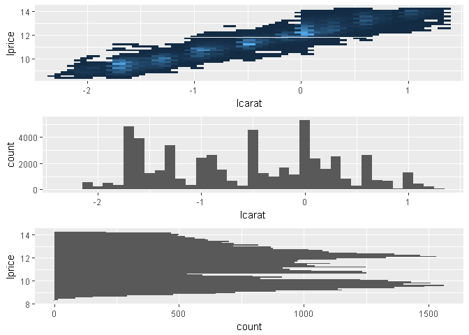

    -   The vertical bands correspond with clumps of `carat_lg` values falling across a range of `price_lg` values

    *Histogram of `carat` values*

    ``` r
    diamonds2 %>% 
      ggplot(aes(carat))+
      geom_histogram(binwidth = 0.01)+
      scale_x_continuous(breaks = seq(0, 2, 0.1))
    ```

    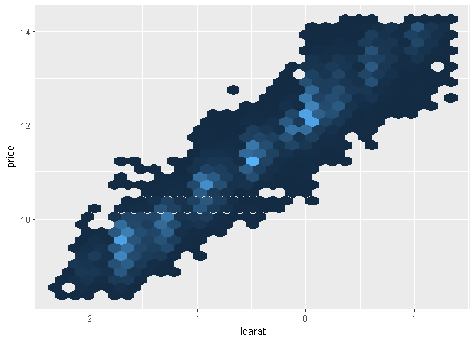

    -   The chart above shows spikes in carat values at 0.3, 0.4, 0.41, 0.5, 0.7, 0.9, 1.0, 1.01, 1.2, 1.5, 1.7 and 2.0, each distribution spikes at that value and then decreases until hitting the next spike
    -   This suggests there is a preference for round numbers ending on tenths
    -   It's curious why you don't see really see spikes at 0.6, 0.8, 0.9, 1.1, 1.3, 1.4, 1.6, 1.8, 1.9, it suggests either there is something special about those paricular values -- perhaps diamonds just tend to develop near those sizes so are more available in sizes of 0.7 than say 0.8
    -   this article also found similar spikes: <https://www.diamdb.com/carat-weight-vs-face-up-size/> as did this: <https://www.pricescope.com/wiki/diamonds/diamond-carat-weight> , which use different data sets (though they do not explain the spike at 0.9 but no spike at 1.4)

2.  If `log(price) = a_0 + a_1 * log(carat)`, what does that say about the relationship between `price` and `carat`?

    -   because we're using a natural log it means that an a\_1 percentage change in carat corresponds with an a\_1 percentage increase in the price
    -   if you had used a log base 2 it has a different interpretation that can be thought of in terms of relationship of doubling

3.  Extract the diamonds that have very high and very low residuals. Is there anything unusual about these diamonds? Are they particularly bad or good, or do you think these are pricing errors?

    ``` r
    extreme_vals <- diamonds2 %>% 
      mutate(extreme_value = (abs(resid_lg) > 1)) %>% 
      filter(extreme_value) %>% 
      add_predictions(mod_diamond2, "pred_lg") %>% 
      mutate(price_pred = 2^(pred_lg))

    #graph extreme points as well as line of pred
    diamonds2 %>% 
      add_predictions(mod_diamond2) %>% 
      # mutate(extreme_value = (abs(resid_lg) > 1)) %>% 
      # filter(!extreme_value) %>% 
      ggplot(aes(carat, price))+
      geom_hex(bins = 50)+
      geom_point(aes(carat, price), data = extreme_vals, color = "orange")
    ```

    

    -   It's possible some of these these were mislabeled or errors, e.g. an error in typing e.g. 200 miswritten as 2000, though given the wide range in pricing this does not seem like that extreme of a variation.

    ``` r
    diamonds2 %>% 
      add_predictions(mod_diamond2) %>% 
      mutate(extreme_value = (abs(resid_lg) > 1),
             price_pred = 2^pred) %>%
      filter(extreme_value) %>% 
      mutate(multiple = price / price_pred) %>% 
      arrange(desc(multiple)) %>% 
      select(price, price_pred, multiple)
    ```

        ## # A tibble: 16 x 3
        ##    price price_pred multiple
        ##    <int>      <dbl>    <dbl>
        ##  1  2160       314.    6.88 
        ##  2  1776       412.    4.31 
        ##  3  1186       284.    4.17 
        ##  4  1186       284.    4.17 
        ##  5  1013       264.    3.83 
        ##  6  2366       774.    3.05 
        ##  7  1715       576.    2.98 
        ##  8  4368      1705.    2.56 
        ##  9 10011      4048.    2.47 
        ## 10  3807      1540.    2.47 
        ## 11  3360      1373.    2.45 
        ## 12  3920      1705.    2.30 
        ## 13  1415       639.    2.21 
        ## 14  1415       639.    2.21 
        ## 15  1262      2644.    0.477
        ## 16 10470     23622.    0.443

    -   If the mislabeling were an issue of e.g. 200 to 2000, you would expect that some of the actual values were ~1/10th or 10x the value of the predicted value. Though none of them appear to have this issue, except for maybe the item that was priced at 2160 but has a price of 314, which is the closest error where the actual value was ~1/10th the value of the prediction

4.  Does the final model, `mod_diamonds2`, do a good job of predicting diamond prices? Would you trust it to tell you how much to spend if you were buying a diamond?

    ``` r
    perc_unexplained <- diamonds2 %>% 
      add_predictions(mod_diamond2, "pred") %>% 
      mutate(pred_2 = 2^pred,
             mean_price = mean(price),
             error_deviation = (price - pred_2)^2,
             reg_deviation = (pred_2 - mean_price)^2,
             tot_deviation = (price - mean_price)^2) %>% 
      summarise(R_squared = sum(error_deviation) / sum(tot_deviation)) %>% 
      flatten_dbl()

    1 - perc_unexplained
    ```

        ## [1] 0.9653255

    -   ~96.5% of variance is explained by model which seems pretty solid, though is relative to each situation
    -   See [24.2.3.3](#section-2) for other considerations, though even this is very incomplete. Would want to check a variety of other metrics to further evaluate trust.

24.3 What affects the number of daily flights?
----------------------------------------------

These were some useful notes copied from this section of the chapter

``` r
daily <- flights %>% 
  mutate(date = make_date(year, month, day)) %>% 
  count(date)

daily <- daily %>% 
  mutate(month = month(date, label = TRUE))

daily <- daily %>% 
  mutate(wday = wday(date, label = TRUE))


term <- function(date) {
  cut(date, 
    breaks = ymd(20130101, 20130605, 20130825, 20140101),
    labels = c("spring", "summer", "fall") 
  )
}

daily <- daily %>% 
  mutate(term = term(date))

daily %>% 
  filter(wday == "Sat") %>% 
  ggplot(aes(date, n, colour = term))+
  geom_point(alpha = .3)+
  geom_line()+
  scale_x_date(NULL, date_breaks = "1 month", date_labels = "%b")
```

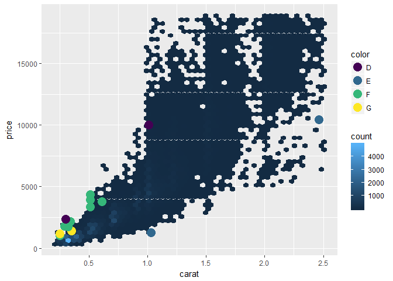

### 24.3.5

1.  Use your Google sleuthing skills to brainstorm why there were fewer than expected flights on Jan 20, May 26, and Sep 1. (Hint: they all have the same explanation.) How would these days generalise to another year?

    -   January 20th was the day for MLK day[1]
    -   May 26th was the day before Memorial Day weekend
    -   September 1st was the day before labor day

    Based on the above, it seems a variable representing "holiday" or "holiday weekend" may be valuable.

2.  What do the three days with high positive residuals represent? How would these days generalise to another year?

    ``` r
    daily <- flights %>% 
      mutate(date = make_date(year, month, day)) %>% 
      count(date)

    daily <- daily %>% 
      mutate(wday = wday(date, label = TRUE))
    ```

    ``` r
    mod <- lm(n ~ wday, data = daily)

    daily <- daily %>% 
      add_residuals(mod)

    daily %>% 
      top_n(3, resid)
    ```

        ## # A tibble: 3 x 4
        ##   date           n wday  resid
        ##   <date>     <int> <ord> <dbl>
        ## 1 2013-11-30   857 Sat   112. 
        ## 2 2013-12-01   987 Sun    95.5
        ## 3 2013-12-28   814 Sat    69.4

    -   these days correspond with the Saturday and Sunday of Thanksgiving, as well as the Saturday after Christmas
    -   these days can fall on different days of the week each year so would vary from year to year depending on which day they fell on
        -   ideally you would include some "holiday" variable to help capture the impact of these / better generalise between years

    *Check the absolute values*

    ``` r
    daily %>% 
      top_n(3, abs(resid))
    ```

        ## # A tibble: 3 x 4
        ##   date           n wday  resid
        ##   <date>     <int> <ord> <dbl>
        ## 1 2013-11-28   634 Thu   -332.
        ## 2 2013-11-29   661 Fri   -306.
        ## 3 2013-12-25   719 Wed   -244.

    -   The days with the greatest magnitude for residuals were on Christmast Day, Thanksgiving Day, and the day after Thanksgiving

3.  Create a new variable that splits the `wday` variable into terms, but only for Saturdays, i.e. it should have `Thurs`, `Fri`, but `Sat-summer`, `Sat-spring`, `Sat-fall`. How does this model compare with the model with every combination of `wday` and `term`?

    ``` r
    term <- function(date) {
      cut(date, 
        breaks = ymd(20130101, 20130605, 20130825, 20140101),
        labels = c("spring", "summer", "fall") 
      )
    }

    daily <- daily %>% 
      mutate(term = term(date))

    # example with wday_mod
    Example_term_with_sat <- daily %>% 
      mutate(wday_mod = ifelse(wday == "Sat", paste(wday, "_", term), wday)) %>%
      lm(n ~ wday_mod, data = .)

    # just wday
    wkday <- daily %>% 
      lm(n ~ wday, data = .)

    # wday and term, no interaction...
    wkday_term <- daily %>% 
      mutate(wday_mod = ifelse(wday == "Sat", paste(wday, "_", term), wday)) %>%
      lm(n ~ wday + term, data = .)

    # wday and term, interaction
    wkday_term_interaction <- daily %>% 
      mutate(wday_mod = ifelse(wday == "Sat", paste(wday, "_", term), wday)) %>%
      lm(n ~ wday*term, data = .)

    daily %>% 
      mutate(wday_mod = ifelse(wday == "Sat", paste(wday, "_", term), wday)) %>%
      gather_predictions(Example_term_with_sat, wkday, wkday_term, wkday_term_interaction) %>% 
      ggplot(aes(date, pred, colour = wday))+
      geom_point()+
      geom_line()+
      facet_wrap(~model, ncol = 1)
    ```

    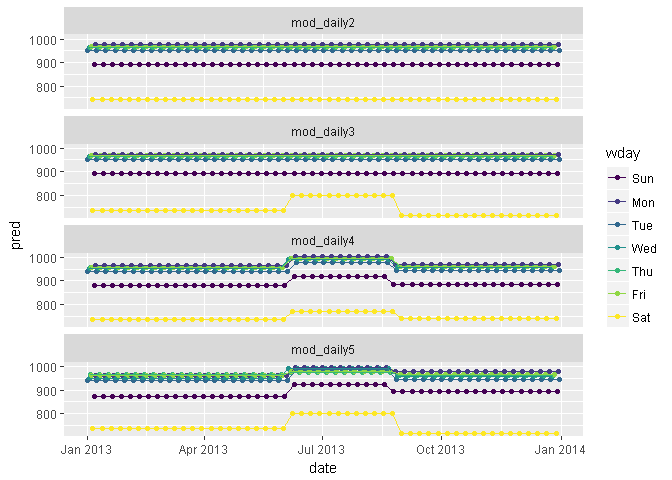

    -   In the example, saturday has different predicted number of flights in the summer
        -   when just including `wkday` you don't see this differentiation
        -   when including `wkday` and `term` you see differentiation in the summer, though this difference is the same across all `wday`s, hence the increased number for Saturday's is less than it shows-up as as compared to either the example (where the term is only interacted with for Saturday) or the `wkday_term_interaction` chart where the interaciton is allowed for each day of the week
        -   you see increases in flights across pretty much all `wday`s in summer, though you see the biggest difference in Saturday[2]

    *Residuals of these models*

    ``` r
    daily %>% 
      mutate(wday_mod = ifelse(wday == "Sat", paste(wday, "_", term), wday)) %>%
      gather_residuals(Example_term_with_sat, wkday, wkday_term, wkday_term_interaction) %>% 
      ggplot(aes(date, resid, colour = wday))+
      geom_point()+
      geom_line()+
      facet_wrap(~model, ncol = 1)
    ```

    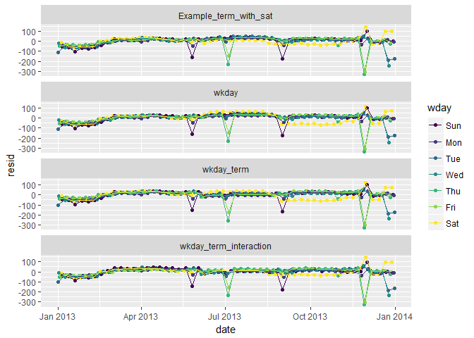

    -   The graphs with saturday term and interaction across terms do not show gross changes in residuals varying by season the way the models that included just weekday or weekday and term without an interaction do.
    -   note that you have a few days with large negative residuals[3]
        -   these likely correspond with holidays

4.  Create a new `wday` variable that combines the day of week, term (for Saturdays), and public holidays. What do the residuals of that model look like?

    *Create dataset of federal holidays*

    ``` r
    # holiday's that could have been added: Easter, black friday
    # consider adding a filter to remove Columbus day and perhaps Veteran's day
    holidays <- tribble(
      ~HolidayName, ~HolidayDate,
      "New Year's", "2013-01-01",
      "MLK", "2013-01-21",
      "President's Day", "2013-02-18", 
      "Memorial Day", "2013-05-27",
      "Independene Day", "2013-07-04",
      "Labor Day", "2013-09-02",
      "Columbus Day", "2013-10-14",
      "Veteran's Day", "2013-11-11",
      "Thanksgiving", "2013-11-28",
      "Christmas Day", "2013-12-25"
    ) %>% 
      mutate(HolidayDate = ymd(HolidayDate))
    ```

    Create model with Holiday variable

    ``` r
    Example_term_with_sat_holiday <- daily %>% 
      mutate(wday_mod = ifelse(wday == "Sat", paste(wday, "_", term), wday)) %>%
      left_join(holidays, by = c("date" = "HolidayDate")) %>% 
      mutate(Holiday = !is.na(HolidayName)) %>% 
      lm(n ~ wday_mod + Holiday, data = .)
    ```

    Look at residuals of model

    ``` r
    daily %>% 
      mutate(wday_mod = ifelse(wday == "Sat", paste(wday, "_", term), wday)) %>%
      left_join(holidays, by = c("date" = "HolidayDate")) %>% 
      mutate(Holiday = !is.na(HolidayName)) %>% 
      gather_residuals(Example_term_with_sat_holiday, Example_term_with_sat) %>% 
      ggplot(aes(date, resid, colour = wday))+
      geom_point()+
      geom_line()+
      facet_wrap(~model, ncol = 1)
    ```

    

    -   Notice the residuals for day's like July 4th and Christas are closer to 0 now, though residuals for smaller holidays like MLK, President's, Columbus, and Veteran's Day are now positive when before they did not have such noticable abberations
    -   Suggests that just "holiday" is not enough to capture the relationship
        -   In \[24.3.5.4\] I show how to create a "near holiday" variable (though I do not add any new analysis after creating this)

5.  What happens if you fit a day of week effect that varies by month (i.e. `n ~ wday * month`)? Why is this not very helpful?

    *Create model*

    ``` r
    week_month <- daily %>% 
      mutate(month = month(date) %>% as.factor()) %>% 
      lm(n ~ wday * month, data = .)
    ```

    *Graph predictions* (with `n ~ wday * term` as the comparison)

    ``` r
    daily %>% 
      mutate(month = month(date) %>% as.factor()) %>% 
      gather_predictions(wkday_term_interaction, week_month) %>% 
      ggplot(aes(date, pred, colour = wday))+
      geom_point()+
      geom_line()+
      facet_wrap(~model, ncol = 1)
    ```

    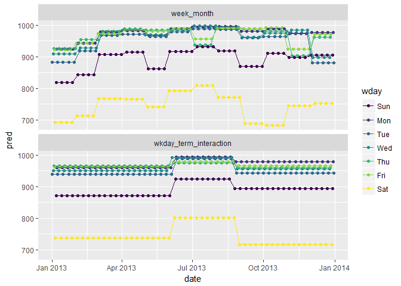

    -   This model has the most flexibility / inputs, though this makes the pattern harder to follow / interpret
    -   Certain decreases in the month to month model are difficult to explain, for example the decrease in the month of May

    *Graph residuals* (with `n ~ wday * term` as the comparison)

    ``` r
    daily %>% 
      mutate(month = month(date) %>% as.factor()) %>% 
      gather_residuals(wkday_term_interaction, week_month) %>% 
      ggplot(aes(date, resid, colour = wday))+
      geom_point()+
      geom_line()+
      facet_wrap(~model, ncol = 1)
    ```

    

    The residuals seem to partially explain some of these inexplicable ups / downs:

    -   For the model that incorporates an interaciton with month, you see the residuals in months with a holiday tend to cause the associated day of the week the holiday fell on to then have high residuals on the non-holiday days, an effect thta is less pronounced on the models interacted with `term`
        -   The reason for this is that for the monthly variables there are only 4-5 week days in each month, so a holiday on one of these can substantially impact the expected number of flights on the weekend in that month (i.e. the prediction is based just on 4-5 observations). For the term interaction you have more like 12 observations to get an expected value, so while there is still an aberration on that day, the other days predictioins are less affected

    Questions such as this fall into the general space of balancing "bias" vs. "variance"

6.  What would you expect the model `n ~ wday + ns(date, 5)` to look like? Knowing what you know about the data, why would you expect it to be not particularly effective?

    I would expect to see a similar overall pattern, but with more smoothed affects. Let's check what these actually look like below.

    ``` r
    wkday_term_ns <- daily %>% 
      mutate(wday_mod = ifelse(wday == "Sat", paste(wday, "_", term), wday)) %>% 
      lm(n ~ wday + splines::ns(date, 5), data = .)

    wkday_term_interaction_ns <- lm(n ~ wday * splines::ns(date, 5), data = daily)
    ```

    Look at predictions (light grey are actuals)

    ``` r
    daily %>% 
      mutate(wday_mod = ifelse(wday == "Sat", paste(wday, "_", term), wday)) %>% 
      gather_predictions(wkday_term_ns, wkday_term_interaction_ns) %>% 
      ggplot(aes(date, pred, colour = wday))+
      geom_point()+
      geom_line(aes(x = date, y = n, group = wday), colour = "grey", alpha = 0.5)+
      geom_line()+
      facet_wrap(~model, ncol = 1)
    ```

    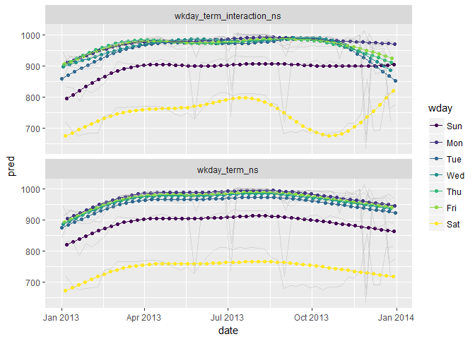

    Look at residuals (in light grey are actuals)

    ``` r
    daily %>% 
      mutate(wday_mod = ifelse(wday == "Sat", paste(wday, "_", term), wday)) %>% 
      gather_residuals(wkday_term_ns, wkday_term_interaction_ns) %>% 
      ggplot(aes(date, resid, colour = wday))+
      geom_point()+
      geom_line(aes(x = date, y = n, group = wday), colour = "grey", alpha = 0.5)+
      geom_line()+
      facet_wrap(~model, ncol = 1)
    ```

    

7.  We hypothesised that people leaving on Sundays are more likely to be business travellers who need to be somewhere on Monday. Explore that hypothesis by seeing how it breaks down based on distance and time: if it's true, you'd expect to see more Sunday evening flights to places that are far away.

    ``` r
    flights %>% 
      mutate(date = lubridate::make_date(year, month, day),
             wday = wday(date, label = TRUE)) %>% 
      select(date, wday, distance) %>%
      filter(distance < 3000) %>% 
      ggplot(aes(wday, distance))+
      geom_boxplot()
    ```

    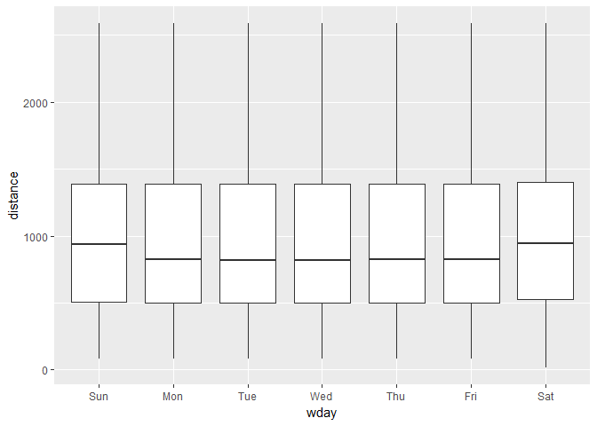

    -   25th and 75th percentiles aren't different, but median is a little higher
    -   the same is the case for Saturday travel which does not seem to fit into this hypothesis as neatly. The effect seems more general to the weekend than just Saturday, and there seem like there may be other potential explanations than "business travel"

8.  It's a little frustrating that Sunday and Saturday are on separate ends of the plot. Write a small function to set the levels of the factor so that the week starts on Monday.

    ``` r
    wday_modified <- function(date){
      date_order <- (wday(date) + 5) %% 7
      date <- wday(date, label = TRUE) %>% fct_reorder(date_order)
      date
    }

    flights %>% 
      mutate(date = lubridate::make_date(year, month, day),
             wday = wday_modified(date)) %>% 
      select(date, wday, distance) %>%
      filter(distance < 3000) %>% 
      ggplot(aes(wday, distance))+
      geom_boxplot()
    ```

    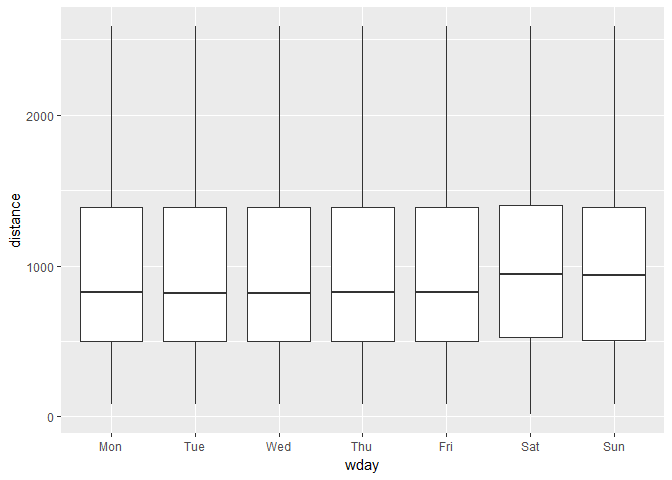

Appendix
========

24.2.3.3
--------

Plots of extreme values against a sample and colored by some of the key attributes

*Plots of extreme values against carat, price, clarity*

``` r
diamonds2 %>% 
  add_predictions(mod_diamond2) %>% 
  sample_n(5000) %>% 
  ggplot(aes(carat, price))+
  geom_point(aes(carat, price, colour = clarity), alpha = 0.5)+
  geom_point(aes(carat, price, colour = clarity), data = extreme_vals, size = 3)
```

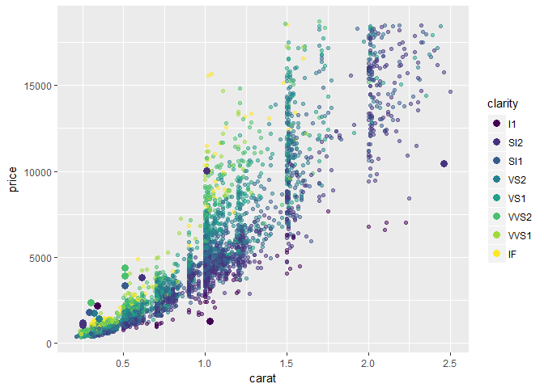

*Plots of extreme values against carat, price, cut*

``` r
diamonds2 %>% 
  add_predictions(mod_diamond2) %>% 
  sample_n(5000) %>% 
  ggplot(aes(carat, price))+
  # geom_hex(bins = 50)+
  geom_point(aes(carat, price, colour = cut), alpha = 0.5)+
  geom_point(aes(carat, price, colour = cut), data = extreme_vals, size = 3)
```

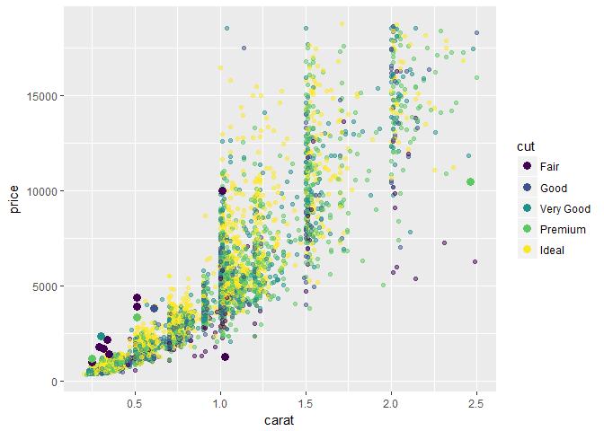

24.2.3.4
--------

### heteroskedasticity

Note that heteroskedasticity is one (of several other) important considerations that would be important when deciding how much you trust the model.

*residual vs lprice*

``` r
diamonds2 %>% 
  add_residuals(mod_diamond2) %>% 
  ggplot(aes(lprice, resid))+
  geom_hex()
```


-   the log transformation helped to ensure our residuals did not have heteroskedasticity against the predictor
-   Note below that if you transform the predictions into predictions on `price` rather than `log2(price)` and then look at the residuals, you see heteroskedasticity.

*residual (transformed) vs price* (`resid_transformed` represents the residual against the residual after transforming it from a prediction for `log2(price)` to a prediction for `price`)

``` r
diamonds2 %>% 
  add_predictions(mod_diamond2) %>% 
  mutate(resid_transformed = price - 2^(pred)) %>% 
  ggplot(aes(price, resid_transformed))+
  geom_hex()
```


*residual (transformed) vs log price* (`resid_transformed` represents the residual against the residual after transforming it from a prediction for `log2(price)` to a prediction for `price`)

``` r
# resid v lprice (% change on x resid)
diamonds2 %>% 
  add_predictions(mod_diamond2) %>% 
  mutate(resid_transformed = price - 2^(pred)) %>% 
  ggplot(aes(lprice, resid_transformed))+
  geom_hex()
```


### rsquared on logged values

**(incorrect)** This is what I did initially. Below I calculate the R^2 on the log values. Within the exercise solution I decided to report the R^2 when calculated on `2^pred`. This has the more useful interpretation of representing the percentage of the variance on the actual price that the model captures, which seems more appropriate in some ways. This question about which is more appropriate to report may be worth revisiting in the future.

``` r
#to see if I'm doing it right let's calculate the R_squared of the model using this technique
ss_res <-  diamonds2 %>% 
  add_predictions(mod_diamond2) %>% 
  mutate(extreme_value = (abs(resid_lg) > 1),
         pred_exp = 2^(pred),
         squ_mod = (log2(price) - pred)^2,
         squ_error = (log2(price) - mean(log2(price)))^2) %>% 
  .$squ_mod %>% sum()

ss_tot <- diamonds2 %>% 
  add_predictions(mod_diamond2) %>% 
  mutate(extreme_value = (abs(resid_lg) > 1),
         pred_exp = 2^(pred),
         squ_mod = (log2(price) - pred)^2,
         squ_error = (log2(price) - mean(log2(price)))^2) %>% 
  .$squ_error %>% sum()

# calculated by hand
1 - ss_res / ss_tot
```

    ## [1] 0.9827876

``` r
# built-in calculation
rsquare(mod_diamond2, diamonds2)
```

    ## [1] 0.9827876

The R-squred is ~ 0.983, which means that the model accounts for 0.983% of the variance in price, which seems pretty solid.

24.2.3.1
--------

Visualization with horizontal stripes and `lprice` as the focus

``` r
# horizontal stripes
gridExtra::grid.arrange(plot_lp_lc, plot_lp, plot_lc + coord_flip()) 
```


-   same thing, just change orientation and highlight `lprice` with a histogram

*A few other graphs from this problem*

``` r
diamonds2 %>%
  ggplot(aes(price))+
  geom_histogram(binwidth = 50)
```

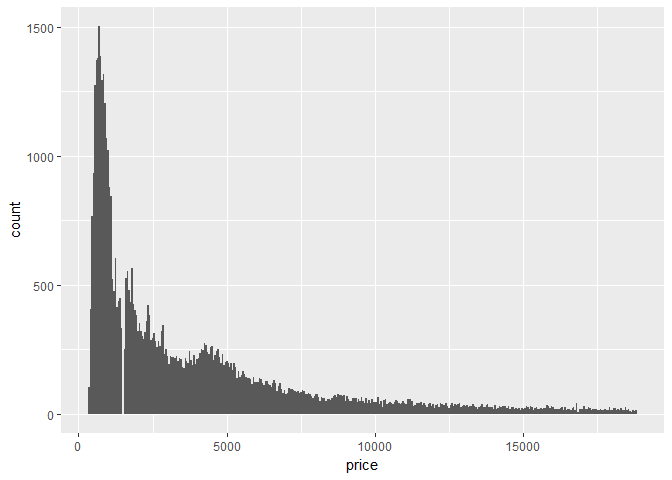

``` r
diamonds2 %>% 
  ggplot(aes(carat))+
  geom_histogram(binwidth = 0.01)
```

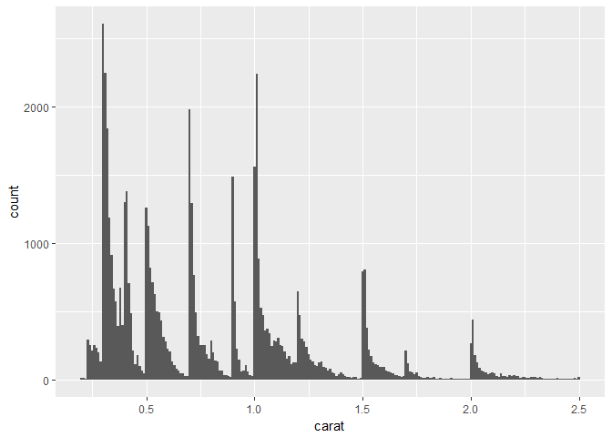

Taking the log of price seems to have a bigger impact on the shape of the geom\_hex graph

``` r
diamonds2 %>% 
  ggplot(aes(carat, lprice))+
  geom_hex(show.legend = FALSE)
```


``` r
diamonds2 %>% 
  ggplot(aes(lcarat, price))+
  geom_hex(show.legend = FALSE)
```


### More notes on logs

While taking the log of both price and carat seems to help improve the 'linearity' of the model, perhaps taking the log of the price makes a bigger difference.

``` r
# a few other plots
plot_c <- diamonds2 %>%
  ggplot(aes(carat))+
  geom_histogram(binwidth = 0.1)

plot_p <- diamonds2 %>%
  ggplot(aes(price))+
  geom_histogram(binwidth = 10)

plot_c_lp <- diamonds2 %>% 
  ggplot(aes(carat, lprice))+
  geom_hex(show.legend = FALSE)

plot_lc_p <- diamonds2 %>% 
  ggplot(aes(lcarat, price))+
  geom_hex(show.legend = FALSE)


gridExtra::grid.arrange(plot_lc_lp, plot_c_lp, plot_lc_p)
```


-   The reason for this may be that the log of the price better resembles a normal distribution than the log of the carat, though taking the log of the carat does also help by, at the least, centering the distribution...

``` r
gridExtra::grid.arrange(plot_lp_lc, plot_lp, plot_p)
```


``` r
gridExtra::grid.arrange(plot_lc_lp, plot_lc, plot_c)
```


### carat more clumped than price

*(Unnecessary)* \* let's see between price and carat, which causes the appearance of "bands" in the data \* to do this let's look at `geom_hex` when making the accompanying value random

``` r
diamonds2 %>% 
  mutate(rand_val = rnorm(n())) %>% 
      ggplot(aes(lcarat, lprice))+
      geom_hex(show.legend = FALSE)
```


``` r
diamonds2 %>% 
  mutate(rand_val = rnorm(n())) %>% 
      ggplot(aes(lcarat, rand_val))+
      geom_hex(show.legend = FALSE)
```

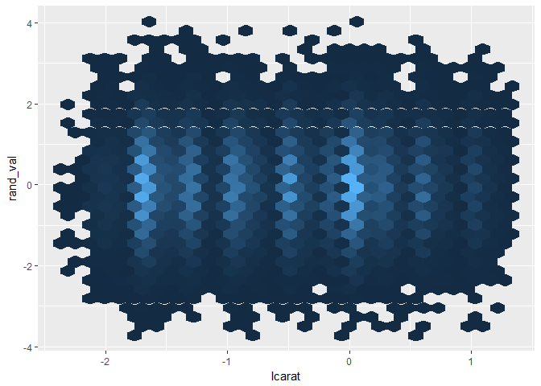

``` r
diamonds2 %>% 
  mutate(rand_val = rnorm(n())) %>% 
      ggplot(aes(lprice, rand_val))+
      geom_hex(show.legend = FALSE)
```

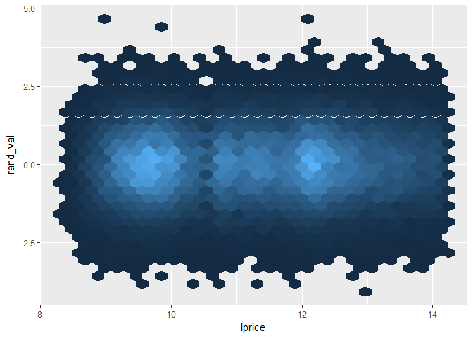

-   clearly carat are much more clumped
-   this check was unnecessary in this case, though the method felt worth saving

Logs (simulated examples)
-------------------------

### Exponential relationship

Taking the log of a value often centers the distribution which is helpful for getting more normal errors, it's actually not about making the relationship linear per se... but about making the errors normal (and linearlizing the relationship has the effect of doing this). Let's generate some data.

*Review logs on simulated dataset*

``` r
set.seed(12)
log_notes_df <- tibble(rand_origin = rnorm(1000, mean = 5),
                       rand_noise = rand_origin + rnorm(1000, mean = 0, sd = 1),
                       rand_exp = 8^rand_noise,
                       rand_exp_log = log2(rand_exp))

# exponential distribution
log_notes_df %>% 
  ggplot(aes(x = rand_exp))+
  geom_histogram()
```

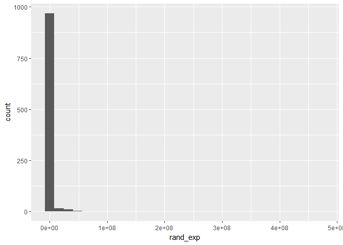

``` r
# Then take log base 2 of
# centered at 15 because 8 = 2^3 and it becomes 3*rnorm(mean = 5)
log_notes_df %>% 
  ggplot(aes(x = rand_exp_log))+
  geom_histogram()
```


``` r
# The log helped us to uncover the relationship that existed between the original values and the values after some noise was added and then exponentiated
log_notes_df %>% 
  ggplot(aes(x = rand_origin, y = rand_exp_log))+
  geom_hex()
```

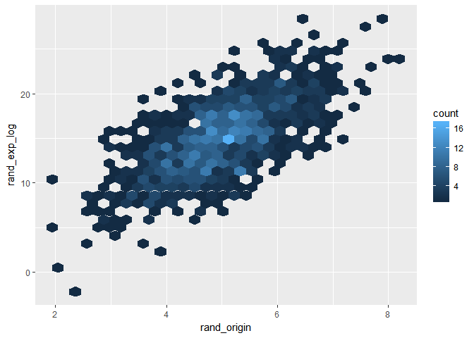

``` r
  # coord_fixed()

# for every one unit increase in 'rand_origin' we get a ~3 fold increase in the log of the output
# this corresponds with the relationship being 2^3*1 , i.e. 3 comes from 2^3, and the 1 is because there is a 1 to ~1 relationship
log_notes_df %>% 
  lm(rand_exp_log ~ rand_origin, data = .)
```

    ## 
    ## Call:
    ## lm(formula = rand_exp_log ~ rand_origin, data = .)
    ## 
    ## Coefficients:
    ## (Intercept)  rand_origin  
    ##       0.246        2.972

-   because of the properties of logs and exponents, taking the log transform is robust to linearlizing any exponential relationship regardles of log

### Log relationship

What happens if you have a log relationship and you take the log of this leading to a log-log relationship? \* You would not need to take the log of a graph in this relationship, but let's look at what happens

``` r
log_notes_df2 <- tibble(rand_origin = rnorm(1000, mean = 256, sd = 20),
                       rand_noise = rand_origin + rnorm(1000, mean = 0, sd = 10),
                       rand_log = log2(rand_noise),
                       rand_log_log = log2(rand_log),
                       rand_exp = 2^rand_log)

# centered at 8 because 256 = 2^8 
log_notes_df2 %>% 
  ggplot(aes(x = rand_log))+
  geom_histogram()
```

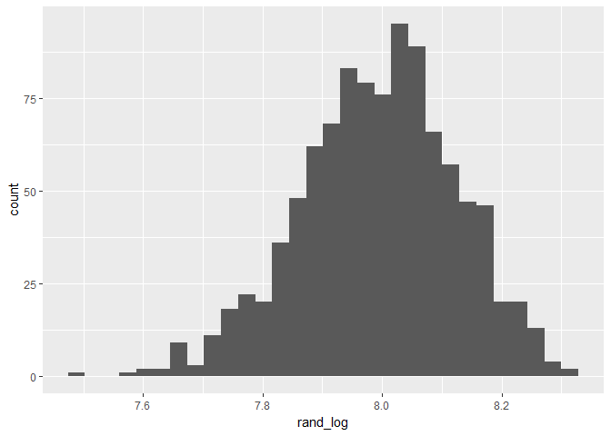

``` r
# centered at 3 because 2^3 = 8
log_notes_df2 %>% 
  ggplot(aes(x = rand_log_log))+
  geom_histogram()
```

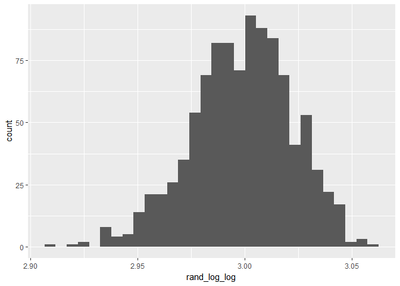

``` r
log_notes_df2 %>% 
  ggplot(aes(x = rand_log_log, y = rand_origin))+
  geom_hex()
```


-   linear relationship is not visibly destroyed by taking additional log transform here

Exponential distribution of original values
-------------------------------------------

While log transforms can help with a lot of problems, they will not fix all issues. For example, below, I generate some simulated data that folows an exponential distribution. I then add some errors in that are normally distributed. A linear model has some challenges with these that log transforms do not automatically fix.

``` r
set.seed(1234)
log_notes_df3 <- tibble(origin = rexp(1000, rate = .5) + 2,
                       rand_noise = origin + rnorm(1000, mean = 0, sd = 1),
                       rand_log = log(rand_noise),
                       rand_log_plus1 = log(rand_noise + 1),
                       origin_log = log(origin))
```

    ## Warning in log(rand_noise): NaNs produced

``` r
# a few NaN's produced due to trying to take the log of a negative value
log_notes_df3 %>% 
  ggplot(aes(x = rand_noise, fill = rand_noise < 0))+
  geom_histogram(binwidth = .1)
```

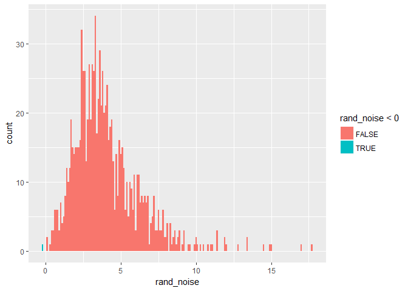

``` r
log_notes_df3 %>% 
  ggplot(aes(x = rand_noise, y = origin))+
  geom_hex()+
  lims(x = c(0, 30), y = c(0, 30))
```

    ## Warning: Removed 1 rows containing non-finite values (stat_binhex).

    ## Warning: Removed 1 rows containing missing values (geom_hex).


`rand_noise` and `origin` should represent a linear relationship with a coeficient of 1 on `rand_noise` - given that this variable is just the `origin` value with some random noise added. Plotting the graph, it seems to follow a linear relationship, but due to the distribution of the data, this is not captured by a linear model.

``` r
# in this case, it's underestimating the strength of the association...
mod_exp_dist <- log_notes_df3 %>% 
  lm(origin ~ rand_noise, data = .)

mod_exp_dist
```

    ## 
    ## Call:
    ## lm(formula = origin ~ rand_noise, data = .)
    ## 
    ## Coefficients:
    ## (Intercept)   rand_noise  
    ##      0.7450       0.8089

``` r
log_notes_df3 %>% 
  add_predictions(mod_exp_dist) %>% 
  ggplot(aes(x = rand_noise, y = origin))+
  geom_hex()+
  geom_abline(aes(intercept = coef(mod_exp_dist)[[1]], slope = coef(mod_exp_dist)[[2]]), colour = "red")+
  lims(x = c(0, 30), y = c(0, 30))
```

    ## Warning: Removed 1 rows containing non-finite values (stat_binhex).

    ## Warning: Removed 1 rows containing missing values (geom_hex).


-   The coefficient on `rand_noise` would be 1 if the relationship were being captured. We see the slope is only ~0.8 (rather than 1) and the predictions seem skewed.

``` r
log_notes_df3 %>% 
  ggplot(aes(x = rand_noise, y = origin))+
  geom_hex()+
  geom_smooth()
```

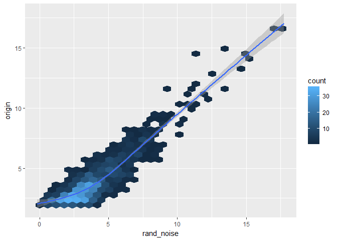

-   `geom_smooth` helps to show how some of the skew in the distribution is affecting the relationship between the `origin` value and the value with `rand_noise` added.

Simply taking log on its own does not fix this issue

``` r
log_notes_df3 %>% 
  ggplot(aes(x = rand_log, y = origin_log))+
  geom_hex()+
  geom_smooth()
```

    ## Warning: Removed 1 rows containing non-finite values (stat_binhex).

    ## Warning: Removed 1 rows containing non-finite values (stat_smooth).

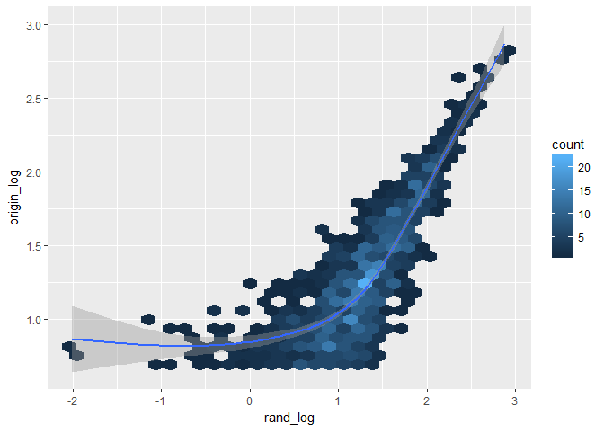

Robust regression also does not fix the issue

``` r
MASS::rlm(origin ~ rand_noise, data = log_notes_df3)
```

    ## Call:
    ## rlm(formula = origin ~ rand_noise, data = log_notes_df3)
    ## Converged in 6 iterations
    ## 
    ## Coefficients:
    ## (Intercept)  rand_noise 
    ##   0.8014983   0.7922031 
    ## 
    ## Degrees of freedom: 1000 total; 998 residual
    ## Scale estimate: 0.854

-   the slope is still only ~ 0.8

To fix challenges you may need to use other types of transformations like box-cox, rescaling, centering, etc.[4] or other modeling techniques.

### flip x and y

``` r
# in this case, it's underestimating the strength of the association...
mod_exp_dist_flipped <- log_notes_df3 %>% 
  lm(rand_noise ~ origin , data = .)

mod_exp_dist_flipped
```

    ## 
    ## Call:
    ## lm(formula = rand_noise ~ origin, data = .)
    ## 
    ## Coefficients:
    ## (Intercept)       origin  
    ##     0.04462      0.99495

``` r
log_notes_df3 %>% 
  add_predictions(mod_exp_dist_flipped) %>% 
  ggplot(aes(x = origin, y = rand_noise))+
  geom_hex()+
  geom_abline(aes(intercept = coef(mod_exp_dist)[[1]], slope = coef(mod_exp_dist)[[2]]), colour = "red")+
  lims(x = c(0, 30), y = c(0, 30))
```

    ## Warning: Removed 1 rows containing non-finite values (stat_binhex).

    ## Warning: Removed 2 rows containing missing values (geom_hex).

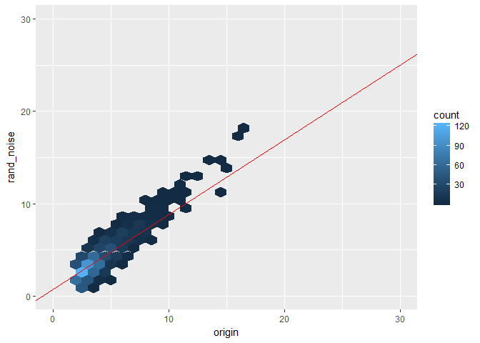

-   when flipping the x and y values, the coefficient is 1 rather than ~ 0.8
-   If you were doing PCA regression instead I wonder if there would be any difference when flipping like this?

### simulation

Check coefficient values when simulating this 100x

``` r
sim_data_models <- function(num_sims = 100, size_sims = 1000){
  
  sim_data <- tibble(x = 1:num_sims) %>% 
    group_by(x) %>% 
    mutate(data = list(tibble(origin = rexp(size_sims, rate = .5) + 2, 
         rand_noise = origin + rnorm(size_sims, mean = 0, sd = 1)))) %>% 
    ungroup()
  
  lm_df <- function(df) lm(origin ~ rand_noise , data = df)
  lm_df_flip <- function(df) lm(rand_noise ~ origin , data = df)
  
  models_data <- sim_data %>% 
    mutate(mod_rand_noise = map(data, lm_df),
           mod_origin = map(data, lm_df_flip),
           coef_rand_noise = map_dbl(mod_rand_noise, ~coef(.x)[[2]]),
           coef_origin = map_dbl(mod_origin, ~coef(.x)[[2]]))
  
  models_data
}

set.seed(1234)
sim_output <- sim_data_models()

sim_output %>% 
  select(coef_rand_noise, coef_origin) %>%
  gather(coef_rand_noise, coef_origin, key = "x_predictor", value = "coefficient") %>%
  ggplot(aes(x = coefficient))+
  geom_histogram(bin_width = 0.01)+
  facet_wrap(~x_predictor, ncol = 1)
```

    ## Warning: Ignoring unknown parameters: bin_width

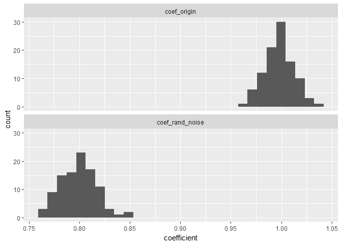

-   Note that when using the origin as the predictor we have the coefficient centered at ~ 1, whereas when the predictor is rand\_noise, coefficients are closer to 0.8
-   Interested to understand this incongruity better...

### Rescale example

Centering and rescaling also do not fix the problem

``` r
range_origin <- range(log_notes_df3$origin)
sd_origin = sd(log_notes_df3$origin)
mean_origin = mean(log_notes_df3$origin)

log_notes_df3_rescaled <- log_notes_df3 %>% 
  mutate(origin_center_normalize = (origin - mean(origin)) / sd(origin),
         rand_center_normalize = (rand_noise - mean(rand_noise)) / sd(rand_noise))

mod_rescaled <- lm(origin_center_normalize ~ rand_center_normalize, data = log_notes_df3_rescaled)

log_notes_df3_rescaled %>%
  add_predictions(mod_rescaled) %>% 
  ggplot(aes(rand_center_normalize, origin_center_normalize))+
  geom_hex() +
  geom_smooth()
```


``` r
# what is the fix for this?
```

### Box-cox

Finish this example later

``` r
MASS::boxcox(origin ~ rand_noise, data = log_notes_df3)
```

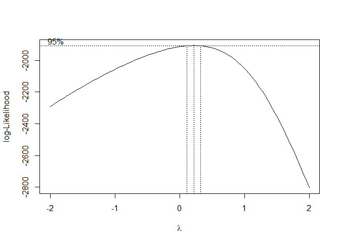

### Other modeling techniques

### distributions of simulated data

Let's look at the distribution of our target (`origin`) and predictor (`rand_noise`) and their various log transforms

``` r
log_notes_df3 %>% 
  ggplot(aes(x = rand_noise))+
  geom_histogram()
```

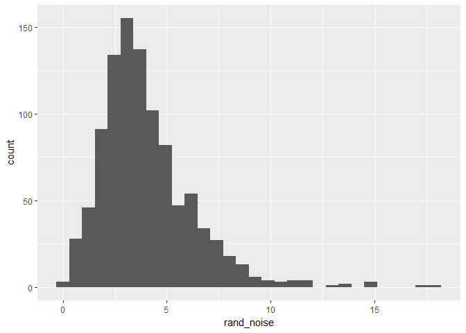

``` r
log_notes_df3 %>% 
  ggplot(aes(x = rand_log))+
  geom_histogram()
```

    ## Warning: Removed 1 rows containing non-finite values (stat_bin).

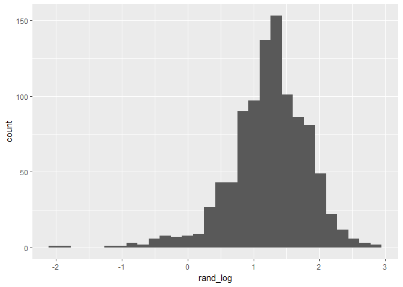

``` r
log_notes_df3 %>% 
  ggplot(aes(x = origin))+
  geom_histogram()
```


``` r
log_notes_df3 %>% 
  ggplot(aes(x = origin_log))+
  geom_histogram()
```


``` r
log_notes_df3 %>% 
  ggplot(aes(x = log(origin_log)))+
  geom_histogram()
```


Diamonds data review
--------------------

*(Section arguably unnecessary)*

### carat by mean `table` value

`table` represents the percentage of the max area that is covered by the flat top part of the diamond

``` r
diamonds2 %>% 
  group_by(carat) %>% 
  summarise(n = n(),
            sd = sd(table),
            mean = mean(table)) %>% 
  filter(n > 100) %>% 
  ggplot(aes(x = carat, y = mean))+
  geom_point(aes(size = n))+
  geom_line()
```

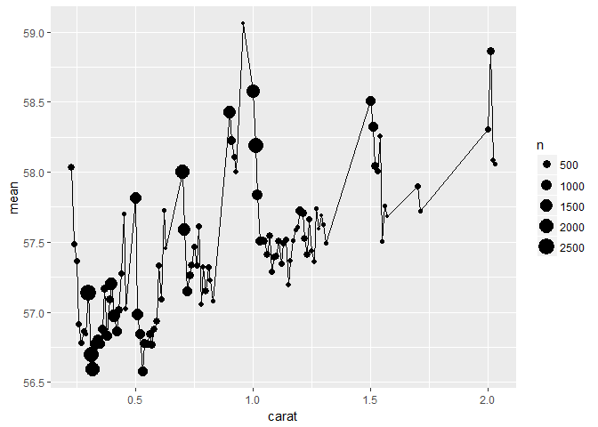

### Cutoff, Part 1

I get nervous that in the opening example that the diamonds dataset was biased because all values with price over 19000 or carat over 2.5 were removed. This seemed to have the affect of causing larger diamonds to have lower prices than expected. I was worried this might in some way impact the pattern described regarding the residuals across the other dimensions -- so looked at the residuals when building the model on just diamonds with carats less than 0.90. None of the prices seemed to approach 19000 for carats this small so this seemed like a good place to validate the discussion on residuals.

The pattern did indeed hold for even just these small diamonds, so the example Hadley discusses seems appropriate.

*diamonds2 alternative... say that we only want to look at diamonds with carat less than 0.9*

``` r
diamonds_test <- diamonds %>% 
  filter(carat <= 0.9) %>%
  mutate_at(vars(price, carat), funs(lg = log2))

mod_diamond <- diamonds_test %>% 
  lm(price_lg ~ carat_lg, data = .)

diamonds2_w_mod <- diamonds_test %>% 
  add_residuals(mod_diamond, "resid_lg")
```

All the patterns Hadley pointed-out seem to hold on this slightly modified dataset

``` r
ggplot(diamonds2_w_mod, aes(cut, resid_lg)) + geom_boxplot()
```


``` r
ggplot(diamonds2_w_mod, aes(color, resid_lg)) + geom_boxplot()
```


``` r
ggplot(diamonds2_w_mod, aes(clarity, resid_lg)) + geom_boxplot()
```


### Cutoff, Part 2

Check if there are differences in coefficients when training on full `diamonds` data set v `diamonds2` dataset

``` r
mod_diamonds <- diamonds %>% 
   mutate(lprice = log2(price), 
         lcarat = log2(carat)) %>% 
lm(lprice ~ lcarat, data = .)

mod_diamonds2 <- lm(lprice ~ lcarat, data = diamonds2)

diamonds %>% 
   mutate(lprice = log2(price), 
         lcarat = log2(carat)) %>% 
   spread_predictions(mod_diamonds, mod_diamonds2) %>% 
  sample_n(1000) %>% 
ggplot(aes(x = lcarat, y = lprice))+
  geom_point()+
  geom_line(aes(y = mod_diamonds), colour = "red")+
  geom_line(aes(y = mod_diamonds2), colour = "blue")
```


essentially no difference between the models that come-out when training on one v the the other

25.3.5.4
--------

In this section I create a marker for days that are "near a holiday"

``` r
near_holidays <- holidays %>% 
  # This creates a series of helper variables to create the variable 'Holiday_IntervalDay' that represents an interval that encloses the period between the holiday and the beginning or end of the most recent weekend
  mutate(HolidayWday = wday(HolidayDate, label = TRUE),
         HolidayWknd = lubridate::round_date(HolidayDate, unit = "week"),
         HolidayFloor = lubridate::floor_date(HolidayDate, unit = "week"),
         HolidayCeiling = lubridate::ceiling_date(HolidayDate, unit = "week"),
         Holiday_IntervalDay = case_when(HolidayWknd == HolidayFloor ~ (HolidayFloor - ddays(2)),
                                         TRUE ~ HolidayCeiling)) %>% 
  mutate(Holiday_Period = interval(pmin(HolidayDate, Holiday_IntervalDay), pmax(HolidayDate, Holiday_IntervalDay)))

# This returns each day and whether it occurred near a holiday
near_holiday <- map(near_holidays$Holiday_Period, ~(seq.Date(ymd("2013-01-01"), ymd("2013-12-31"), by = "day") %within% .x)) %>% 
  transpose() %>% 
  map_lgl(any) %>% 
  as_tibble() %>% 
  rename(NearHoliday = value) %>% 
  mutate(date = seq.Date(ymd("2013-01-01"), ymd("2013-12-31"), by = "day"))

near_holiday
```

    ## # A tibble: 365 x 2
    ##    NearHoliday date      
    ##    <lgl>       <date>    
    ##  1 TRUE        2013-01-01
    ##  2 FALSE       2013-01-02
    ##  3 FALSE       2013-01-03
    ##  4 FALSE       2013-01-04
    ##  5 FALSE       2013-01-05
    ##  6 FALSE       2013-01-06
    ##  7 FALSE       2013-01-07
    ##  8 FALSE       2013-01-08
    ##  9 FALSE       2013-01-09
    ## 10 FALSE       2013-01-10
    ## # ... with 355 more rows

-   I ended-up not adding any additional analysis here, though the methodology for creating the "near holiday" seemed worth saving
-   Could come back to add more in the future

[1] it was also the 2nd inauguration for Obama

[2] Interactions facilitate encoding these types of conditional relationships, i.e. the impact of summer depends on the day of the week (/ vice versa)

[3] Remember this corresponds with days where the predictions are higher than the actuals.

[4] The point being that log-transforms are not a panacea for any fix.
