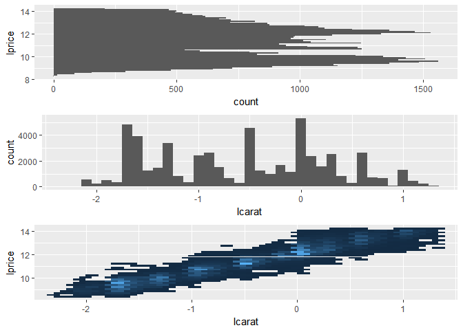
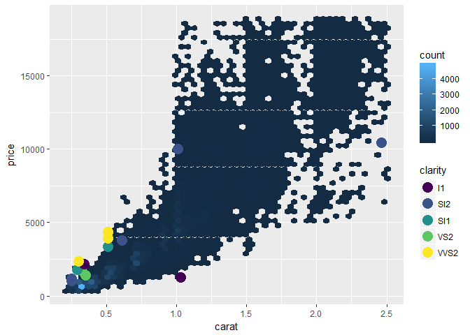
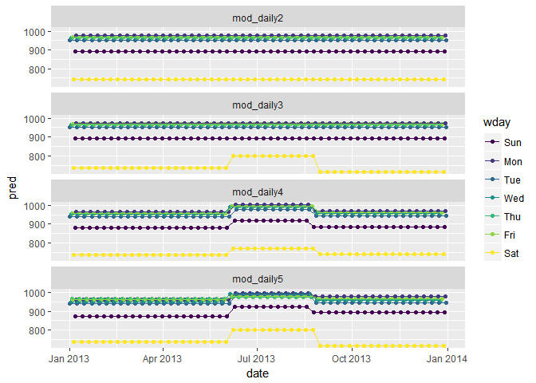

Chapter 24 Model building
================
Bryan Shalloway
Last updated: 2018-05-29

-   [ch. 24: Model building](#ch.-24-model-building)
    -   [24.2: Why are low quality diamonds more expensive?](#why-are-low-quality-diamonds-more-expensive)
        -   [24.2.3](#section)
    -   [24.3 What affects the number of daily flights?](#what-affects-the-number-of-daily-flights)
        -   [24.3.5](#section-1)
-   [Appendix](#appendix)
    -   [24.2.3.3](#section-2)
        -   [heteroskedasticity](#heteroskedasticity)
        -   [rsquared on logged values](#rsquared-on-logged-values)

``` r
knitr::opts_chunk$set(echo = TRUE, cache = TRUE, message = FALSE)
```

*Make sure the following packages are installed:*

ch. 24: Model building
======================

-   `data_grid`
-   `.model` argument

24.2: Why are low quality diamonds more expensive?
--------------------------------------------------

### 24.2.3

1.  In the plot of `lcarat` vs. `lprice`, there are some bright vertical strips. What do they represent?

    ``` r
    diamonds2 <- diamonds %>% 
      filter(carat <= 2.5) %>% 
      mutate(lprice = log2(price), 
             lcarat = log2(carat))
    ```

        ## Warning: package 'bindrcpp' was built under R version 3.4.4

    ``` r
    mod_diamond2 <- lm(lprice ~ lcarat + color + cut + clarity, data = diamonds2)

    diamonds2 <- diamonds2 %>% 
      add_residuals(mod_diamond2, "resid_lg")

    a <- diamonds2 %>%
      ggplot(aes(lprice))+
      geom_histogram()+
      coord_flip()

    b <- diamonds2 %>% 
      ggplot(aes(lcarat))+
      geom_histogram()

    c <- diamonds2 %>% 
      ggplot(aes(lcarat, lprice))+
      geom_hex(show.legend = FALSE)

    gridExtra::grid.arrange(a, b, c)
    ```

        ## Warning: package 'hexbin' was built under R version 3.4.4

    

    -   The vertical bands correspond with clumps of `carat_lg` values falling across a range of `price_lg` values

2.  If `log(price) = a_0 + a_1 * log(carat)`, what does that say about the relationship between `price` and `carat`?

    -   Says that an a\_1 percentage change in carat corresponds with an a\_1 percentage increase in the price.

3.  Extract the diamonds that have very high and very low residuals. Is there anything unusual about these diamonds? Are the particularly bad or good, or do you think these are pricing errors?

    ``` r
    extreme_vals <- diamonds2 %>% 
      mutate(extreme_value = (abs(resid_lg) > 1)) %>% 
      filter(extreme_value) %>% 
      add_predictions(mod_diamond2, "pred_lg") %>% 
      mutate(price_pred = 2^(pred_lg))

    #graph extreme points as well as line of pred
    diamonds2 %>% 
      add_predictions(mod_diamond2) %>% 
      # mutate(extreme_value = (abs(resid_lg) > 1)) %>% 
      # filter(!extreme_value) %>% 
      ggplot(aes(carat, price))+
      geom_hex(bins = 50)+
      geom_point(aes(carat, price), data = extreme_vals, color = "orange")
    ```

    

    -   I somewhat doubt these were mislabeled or errors. The numbers don't look like an error in typing e.g. 200 2000. You see massive variation in pricing, and these don't seem to be too large of abberations...

4.  Does the final model, `mod_diamonds2`, do a good job of predicting diamond prices? Would you trust it to tell you how much to spend if you were buying a diamond?

    ``` r
    perc_unexplained <- diamonds2 %>% 
      add_predictions(mod_diamond2, "pred") %>% 
      mutate(pred_2 = 2^pred,
             mean_price = mean(price),
             error_deviation = (price - pred_2)^2,
             reg_deviation = (pred_2 - mean_price)^2,
             tot_deviation = (price - mean_price)^2) %>% 
      summarise(R_squared = sum(error_deviation) / sum(tot_deviation)) %>% 
      flatten_dbl()

    1 - perc_unexplained
    ```

        ## [1] 0.9653255

    -   ~96.5% of variance is explained by model shich seems pretty solid

    **Add in more model performance and evaluation tests in this chapter**

24.3 What affects the number of daily flights?
----------------------------------------------

### 24.3.5

1.  Use your Google sleuthing skills to brainstorm why there were fewer than expected flights on Jan 20, May 26, and Sep 1. (Hint: they all have the same explanation.) How would these days generalise to another year?

2.  What do the three days with high positive residuals represent? How would these days generalise to another year?

    ``` r
    term <- function(date) {
      cut(date, 
        breaks = ymd(20130101, 20130605, 20130825, 20140101),
        labels = c("spring", "summer", "fall") 
      )
    }

    daily <- flights %>% 
      mutate(date = make_date(year, month, day)) %>% 
      count(date)

    daily <- daily %>% 
      mutate(month = month(date, label = TRUE))

    daily <- daily %>% 
      mutate(term = term(date))

    daily <- daily %>% 
      mutate(wday = wday(date, label = TRUE))

    mod <- lm(n ~ wday, data = daily)

    daily <- daily %>% 
      add_residuals(mod)
    ```

    ``` r
    daily %>% 
      top_n(3, resid)
    ```

        ## # A tibble: 3 x 6
        ##   date           n month term  wday  resid
        ##   <date>     <int> <ord> <fct> <ord> <dbl>
        ## 1 2013-11-30   857 Nov   fall  Sat   112. 
        ## 2 2013-12-01   987 Dec   fall  Sun    95.5
        ## 3 2013-12-28   814 Dec   fall  Sat    69.4

3.  Create a new variable that splits the `wday` variable into terms, but only for Saturdays, i.e. it should have `Thurs`, `Fri`, but `Sat-summer`, `Sat-spring`, `Sat-fall`. How does this model compare with the model with every combination of `wday` and `term`?

4.  Create a new `wday` variable that combines the day of week, term (for Saturdays), and public holidays. What do the residuals of that model look like?

5.  What happens if you fit a day of week effect that varies by month (i.e. `n ~ wday * month`)? Why is this not very helpful?

6.  What would you expect the model `n ~ wday + ns(date, 5)` to look like? Knowing what you know about the data, why would you expect it to be not particularly effective?

7.  We hypothesised that people leaving on Sundays are more likely to be business travellers who need to be somewhere on Monday. Explore that hypothesis by seeing how it breaks down based on distance and time: if it's true, you'd expect to see more Sunday evening flights to places that are far away.

8.  It's a little frustrating that Sunday and Saturday are on separate ends of the plot. Write a small function to set the levels of the factor so that the week starts on Monday.

Appendix
========

I get nervous that in the opening example that the diamonds dataset was biased because all values with price over 19000 or carat over 2.5 were removed. This seemed to have the affect of causing larger diamonds to have lower prices than expected. I was worried this might in some way impact the pattern described regarding the residuals across the other dimensions -- so looked at the residuals when building the model on just diamonds with carats less than 0.90. None of the prices seemed to approach 19000 for carats this small so this seemed like a good place to validate the discussion on residuals.

The pattern did indeed hold for even just these small diamonds, so the example Hadley discusses seems appropriate.

*diamonds2 alternative... say that we only want to look at diamonds with carat less than 0.9*

``` r
diamonds2 <- diamonds %>% 
  filter(carat <= 0.9) %>%
  mutate_at(vars(price, carat), funs(lg = log2))

mod_diamond <- diamonds2 %>% 
  lm(price_lg ~ carat_lg, data = .)

diamonds2_w_mod <- diamonds2 %>% 
  add_residuals(mod_diamond, "resid_lg")

ggplot(diamonds2_w_mod, aes(cut, resid_lg)) + geom_boxplot()
ggplot(diamonds2_w_mod, aes(color, resid_lg)) + geom_boxplot()
ggplot(diamonds2_w_mod, aes(clarity, resid_lg)) + geom_boxplot()
```

24.2.3.3
--------

``` r
diamonds2 %>% 
  add_predictions(mod_diamond2) %>% 
  ggplot(aes(carat, price))+
  geom_hex(bins = 50)+
  geom_point(aes(carat, price, colour = color), data = extreme_vals, size = 5)
```


``` r
diamonds2 %>% 
  add_predictions(mod_diamond2) %>% 
  ggplot(aes(carat, price))+
  geom_hex(bins = 50)+
  geom_point(aes(carat, price, colour = clarity), data = extreme_vals, size = 5)
```

 \#\# 24.2.3.3

### heteroskedasticity

``` r
#actual resid vs price
diamonds2 %>% 
  add_predictions(mod_diamond2) %>% 
  mutate(resid_transformed = price - 2^(pred)) %>% 
  ggplot(aes(price, resid_transformed))+
  geom_hex()
```



``` r
# % change on x resid
diamonds2 %>% 
  add_predictions(mod_diamond2) %>% 
  mutate(resid_transformed = price - 2^(pred)) %>% 
  ggplot(aes(lprice, resid_transformed))+
  geom_hex()
```


-   looks like some heteroskedasticity

### rsquared on logged values

(incorrect) This is what I did previously, though I don't think this is really a great metric because the R^2 is on the log values...

``` r
#to see if I'm doing it right let's calculate the R_squared of the model using this technique
ss_res <-  diamonds2 %>% 
  add_predictions(mod_diamond2) %>% 
  mutate(extreme_value = (abs(resid_lg) > 1),
         pred_exp = 2^(pred),
         squ_mod = (log2(price) - pred)^2,
         squ_error = (log2(price) - mean(log2(price)))^2) %>% 
  .$squ_mod %>% sum()

ss_tot <- diamonds2 %>% 
  add_predictions(mod_diamond2) %>% 
  mutate(extreme_value = (abs(resid_lg) > 1),
         pred_exp = 2^(pred),
         squ_mod = (log2(price) - pred)^2,
         squ_error = (log2(price) - mean(log2(price)))^2) %>% 
  .$squ_error %>% sum()

# calculated by hand
1 - ss_res / ss_tot
```

    ## [1] 0.9827876

``` r
# built-in calculation
rsquare(mod_diamond2, diamonds2)
```

    ## [1] 0.9827876

The R-squred is ~ 0.983, which means that the model accounts for 0.983% of the variance in price, which seems pretty solid.
