# Ch. 7: Data exploration

\BeginKnitrBlock{rmdimportant}<div class="rmdimportant">**Key questions:**  
  
* 7.3.4. #1
* 7.5.1.1 #2
* 7.5.3.1. #2, 4</div>\EndKnitrBlock{rmdimportant}

\BeginKnitrBlock{rmdtip}<div class="rmdtip">**Functions and notes:**</div>\EndKnitrBlock{rmdtip}

* `cut_width`: specify binsize of each cut (often use with `geom_boxplot`)
* `cut_number`:  specify number of groups to make, allowing for variable binsize (often use with `geom_boxplot`)
* `geom_histogram`: key args are `bins`, `binwidth`
* `geom_freqpoly`: for if you want to have overlapping histograms (so outputs lines instead)
    + can set y as `..density..` to equalize scale of each (similar to how `geom_density` does).
* `geom_boxplot`: adjust outliers with `outlier.colour`, `outlier.fill`, ...
* `geom_violin`: Creates double sided histograms for each factor of x
* `geom_bin2d`: scatter plot of x and y values, but use shading to determine count/density in each point
* `geom_hex`: same as `geom_bin2d` but hexagon instead of square shapes are shaded in
* `reorder`: arg1 = variable to reorder, arg2 = variable to reorder it by arg3 = function to reorder by (e.g. median, mean, max...)
* `coord_cartesian`: adjust x,y window w/o filtering out values that are excluded from view
* `xlim`; `ylim`: adjust window and filter out values not within window (same method as `scale_x(/y)_continuous`)
    + these v. `coord_cartesian` is important for geoms like `geom_smooth` that aggregate as they visualize
* `ifelse`: vectorized if else (not to be confused with `if` and `else` functions)
    + `dplyr::if_else` is more strict alternative
* `case_when`: create new variable that relies on complex combination of existing variables
    + often use when you have complex or multiple `ifelse` statements accruing

## 7.3. Variation

### 7.3.4.

*1. Explore the distribution of each of the x, y, and z variables in diamonds. What do you learn? Think about a diamond and how you might decide which dimension is the length, width, and depth.*  

x has some 0s which signifies a data colletion error, y and z have extreme outliers (z more so).


```r
x_hist <- ggplot(diamonds)+
  geom_histogram(aes(x = x), binwidth = 0.1)+
  coord_cartesian(xlim = c(0, 10))

y_hist <- ggplot(diamonds)+
  geom_histogram(aes(x = y), binwidth = 0.1)+
  coord_cartesian(xlim = c(0, 10))

z_hist <- ggplot(diamonds)+
  geom_histogram(aes(x = z), binwidth = 0.1)+
  coord_cartesian(xlim = c(0, 10))

gridExtra::grid.arrange(x_hist, y_hist, z_hist, ncol = 1)
```

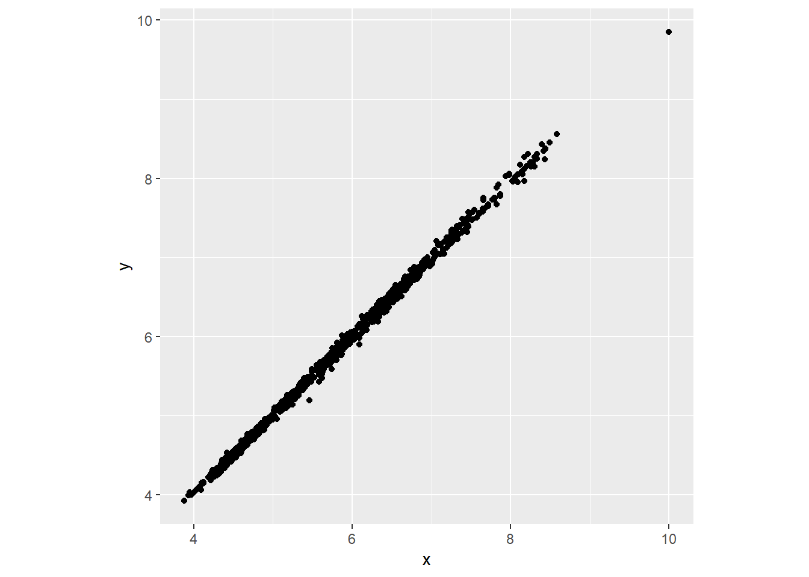

* All three have peaks and troughs on even points. X and y have more similar distributions than z.

I would say that x and y are likely length and width and z depth because diamonds are typically circular on the face so will have the same ratio of length and width and we see this is the case for the x and y dimensions, whereas z tends to be more shallow.

```r
diamonds %>% 
  sample_n(1000) %>% 
  ggplot()+
  geom_point(aes(x, y))+
  coord_fixed()
```

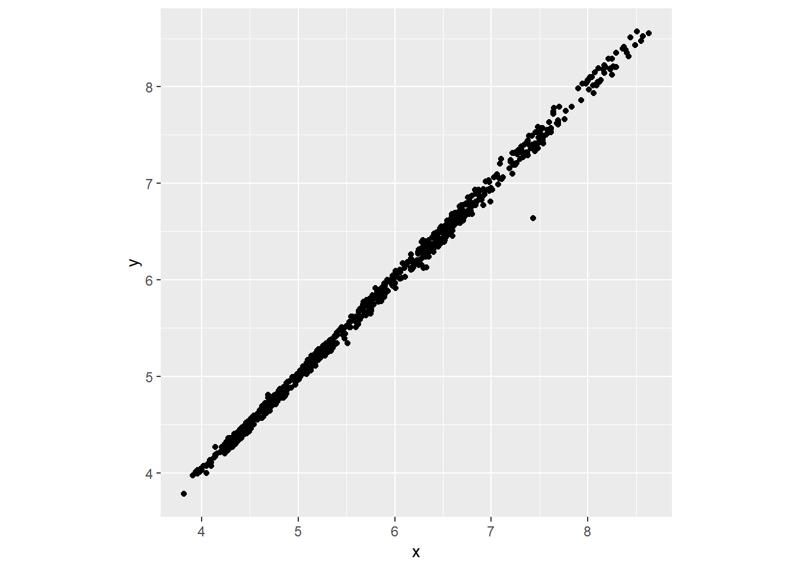

```r
diamonds %>% 
  sample_n(1000) %>% 
  ggplot()+
  geom_point(aes(x, z))+
  coord_fixed()
```

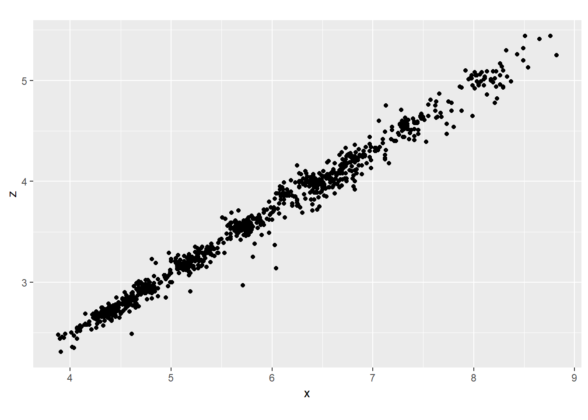

*2. Explore the distribution of price. Do you discover anything unusual or surprising? (Hint: Carefully think about the binwidth and make sure you try a wide range of values.)*  


```r
ggplot(diamonds)+
  geom_histogram(aes(x = price), binwidth=10)
```


Price is right skewed.

Also notice that from ~1450 to ~1550 there are diamonds.


```r
ggplot(diamonds)+
  geom_histogram(aes(x = price), binwidth = 5)+coord_cartesian(xlim = c(1400,1600))
```


*3. How many diamonds are 0.99 carat? How many are 1 carat? What do you think is the cause of the difference?*  


```r
filter(diamonds, carat == 0.99) %>% 
  count()
```

```
## # A tibble: 1 x 1
##       n
##   <int>
## 1    23
```

```r
filter(diamonds, carat == 1) %>% 
  count()
```

```
## # A tibble: 1 x 1
##       n
##   <int>
## 1  1558
```

For visual scale.

```r
ggplot(diamonds)+
  geom_histogram(aes(x=carat), binwidth=.01)+
  coord_cartesian(xlim=c(.99,1))
```


The difference may be caused by jewlers rounding-up because people want to buy '1' carat diamonds not 0.99 carat diamonds. It could also be that some listings are simpoly only in integers^[not necessarily rounding one way or the other.].

*4.Compare and contrast `coord_cartesian()` vs `xlim()` or `ylim()` when zooming in on a histogram. What happens if you leave binwidth unset? What happens if you try and zoom so only half a bar shows?*  

`coord_cartesian` does not change data ust window view where as `xlim` and `ylim` will get rid of data outside of domain^[This is especially important when building things like boxplots whose graphs depend on all points in the graph.].


## 7.4. Missing values

### 7.4.1.

*1. What happens to missing values in a histogram? What happens to missing values in a bar chart? Why is there a difference?*  

With numeric data they both filter out NAs, though for categorical / character variables the `barplot` will create a seperate olumn with the category. This is because `NA` can just be thought of as another category though it is difficulty to place it within a distribution of values.

Treats these the same.

```r
mutate(diamonds, carattest=ifelse(carat<1.5 & carat>.7, NA, carat)) %>% 
  ggplot() +
  geom_histogram(aes(x=carattest))
```

```
## `stat_bin()` using `bins = 30`. Pick better value with `binwidth`.
```

```
## Warning: Removed 20543 rows containing non-finite values (stat_bin).
```


```r
mutate(diamonds, carattest=ifelse(carat<1.5 & carat>.7, NA, color)) %>% 
  ggplot() +
  geom_bar(aes(x=carattest))
```

```
## Warning: Removed 20543 rows containing non-finite values (stat_count).
```


For character than it creates a new bar for `NA`s

```r
mutate(diamonds, carattest=ifelse(carat<1.5 & carat>.7, NA, color)) %>% 
  ggplot() +
  geom_bar(aes(x = as.character(carattest)))
```

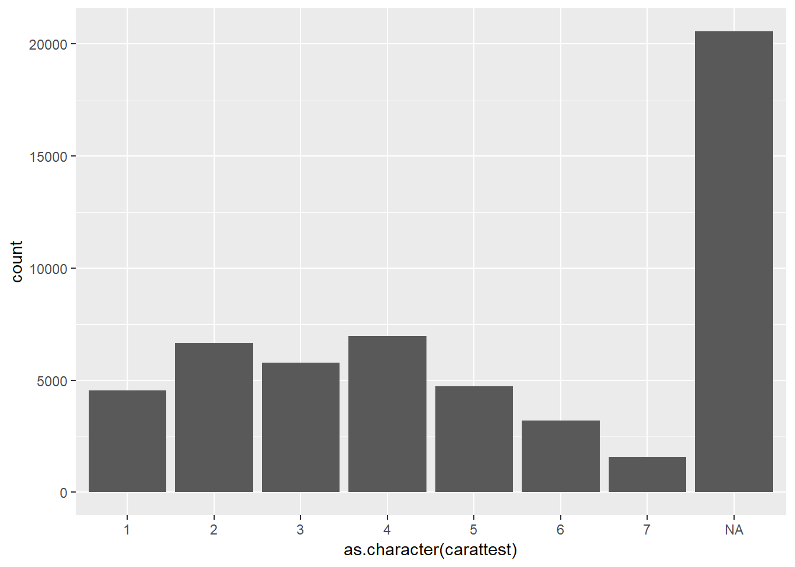


*2. What does na.rm = TRUE do in `mean()` and `sum()`?*  
  
Filters it out of the vector of values.  

## 7.5. Covariation

### 7.5.1.1.

*1. Use what you've learned to improve the visualisation of the departure times of cancelled vs. non-cancelled flights.*  

Looks like while non-cancelled flights happen at similar frequency in mornings and evenings, cancelled flights happen at a greater frequency in the evenings.


```r
nycflights13::flights %>% 
  mutate(
    cancelled = is.na(dep_time),
    sched_hour = sched_dep_time %/% 100,
    sched_min = sched_dep_time %% 100,
    sched_dep_time = sched_hour + sched_min / 60
  ) %>% 
  ggplot(mapping = aes(x=sched_dep_time, y=..density..)) + 
  geom_freqpoly(mapping = aes(colour = cancelled), binwidth = .25)+
  xlim(c(5,25))
```

```
## Warning: Removed 1 rows containing non-finite values (stat_bin).
```

```
## Warning: Removed 4 rows containing missing values (geom_path).
```


Let's look at the same plot but smooth the distributions to make the pattern easier to see.

```r
nycflights13::flights %>% 
  mutate(
    cancelled = is.na(dep_time),
    sched_hour = sched_dep_time %/% 100,
    sched_min = sched_dep_time %% 100,
    sched_dep_time = sched_hour + sched_min / 60
  ) %>% 
  ggplot(mapping = aes(x=sched_dep_time)) + 
  geom_density(mapping = aes(fill = cancelled), alpha = 0.30)+
  xlim(c(5,25))
```

```
## Warning: Removed 1 rows containing non-finite values (stat_density).
```

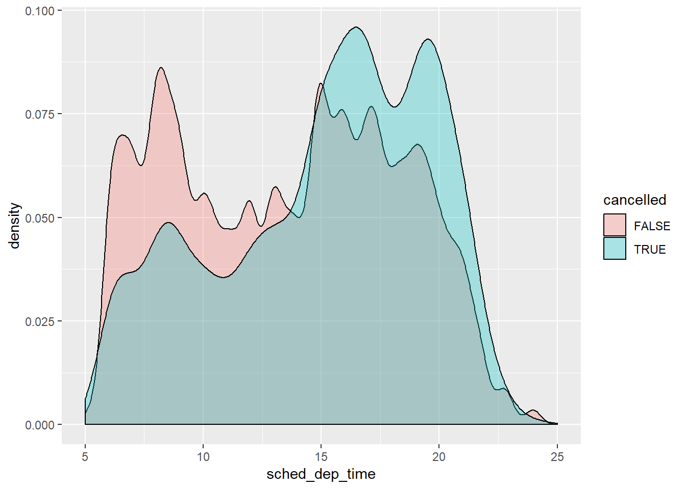


*2.What variable in the diamonds dataset is most important for predicting the price of a diamond? How is that variable correlated with cut? Why does the combination of those two relationships lead to lower quality diamonds being more expensive?*  
  
`carat` is the most important for predicting price.

```r
cor(diamonds$price, select(diamonds, carat, depth, table, x, y, z))
```

```
##          carat      depth     table         x         y         z
## [1,] 0.9215913 -0.0106474 0.1271339 0.8844352 0.8654209 0.8612494
```

fair `cut` seem to associate with a higher `carat` thus while lower quality diamonds may be selling for more that is being driven by the `carat` of the diamond (the most important factor in `price`) and the quality simply cannot offset this.


```r
ggplot(data=diamonds, aes(x=cut, y=carat))+
  geom_boxplot()+
  coord_flip()
```


*3.Install the `ggstance` package, and create a horizontal boxplot. How does this compare to using `coord_flip()`?*  


```r
ggplot(diamonds)+
  ggstance::geom_boxploth(aes(x = carat, y = cut))
```


```r
ggplot(diamonds)+
  geom_boxplot(aes(x = cut, y = carat))+
  coord_flip()
```


* Looks like it does the same thing as flipping `x` and `y` and using `coord_flip()`

*4. One problem with boxplots is that they were developed in an era of much smaller datasets and tend to display a prohibitively large number of "outlying values". One approach to remedy this problem is the letter value plot. Install the lvplot package, and try using `geom_lv()` to display the distribution of `price` vs `cut`. What do you learn? How do you interpret the plots?*  

I found [this](https://stats.stackexchange.com/questions/301159/understanding-and-interpreting-letter-value-boxplots) helpful  

This produces a 'letter-value' boxplot which means that in the first box you have the middle ~1/2 of data, then in the adoining boxes the next ~1/4, so within the middle 3 boxes you have the middle ~3/4 of data, next two boxes is ~7/8ths, then ~15/16th etc.


```r
set.seed(1234)
a <- diamonds %>% 
  ggplot()+
  lvplot::geom_lv(aes(x = cut, y = price))

set.seed(1234)
b <- diamonds %>% 
  ggplot()+
  geom_boxplot(aes(x = cut, y = price))
```

Perhaps a helpful way to understand this is to see what it looks like at different specified 'k' values (which)

You can see the letters when you add `fill = ..LV..` to the aesthetic.


```r
diamonds %>% 
  ggplot()+
  lvplot::geom_lv(aes(x = cut, y = price, alpha = ..LV..), fill = "blue")+
  scale_alpha_discrete(range = c(0.7, 0))
```

```
## Warning: Using alpha for a discrete variable is not advised.
```


```r
diamonds %>% 
  ggplot()+
  lvplot::geom_lv(aes(x = cut, y = price, fill = ..LV..))
```

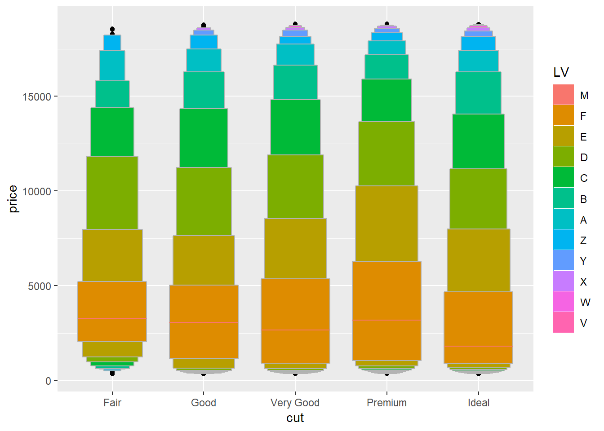

Letters represent 'median', 'fourths', 'eights'...

*5. Compare and contrast `geom_violin()` with a facetted `geom_histogram()`, or a coloured `geom_freqpoly()`. What are the pros and cons of each method?*  


```r
ggplot(diamonds,aes(x = cut, y = carat))+
  geom_violin()
```

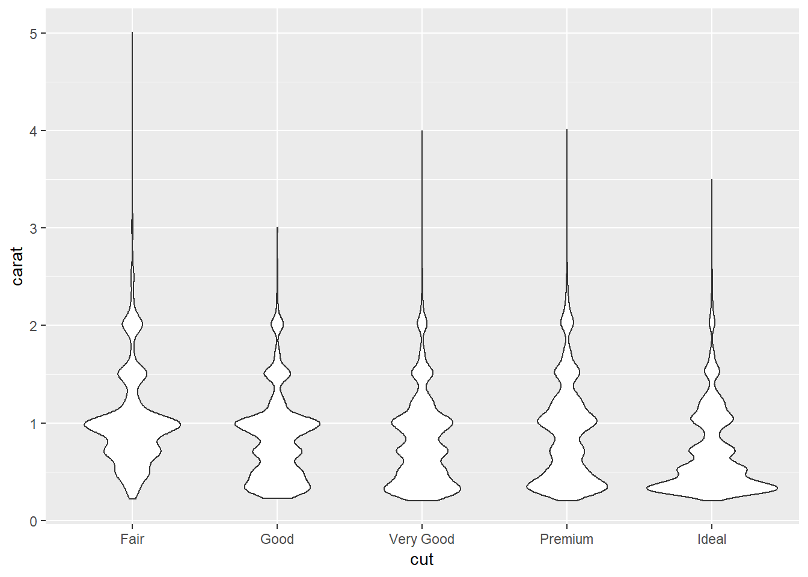

```r
ggplot(diamonds,aes(colour = cut, x = carat, y = ..density..))+
  geom_freqpoly()
```

```
## `stat_bin()` using `bins = 30`. Pick better value with `binwidth`.
```


```r
ggplot(diamonds, aes(x = carat, y = ..density..))+
  geom_histogram()+
  facet_wrap(~cut)
```

```
## `stat_bin()` using `bins = 30`. Pick better value with `binwidth`.
```

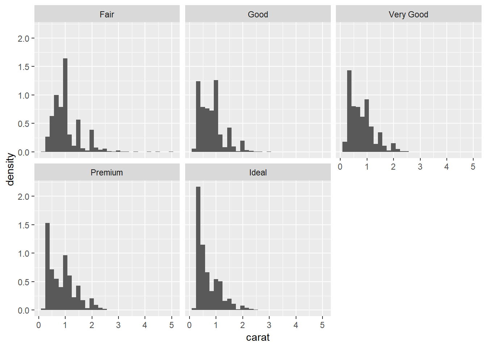

I like how `geom_freqpoly` has points directly overlaying but it can also be tough to read some, and the lines can overlap and be tough to tell apart, you also have to specify `density` for this and `geom_histogram` whereas for `geom_violin` it is the default. The tails in `geom_violin` can be easy to read but they also pull these for each of the of the values whereas by faceting `geomo_histogram` and setting `scales = "free"` you can have independent scales. I think the biggest advantage of the histogram is that it is the most familiar so people will know what you're looking at.

*6. If you have a small dataset, it's sometimes useful to use `geom_jitter()` to see the relationship between a continuous and categorical variable. The ggbeeswarm package provides a number of methods similar to `geom_jitter()`. List them and briefly describe what each one does.*  


```r
ggplot(mpg, aes(x = displ, y = cty, color = drv))+
  geom_point()    
```

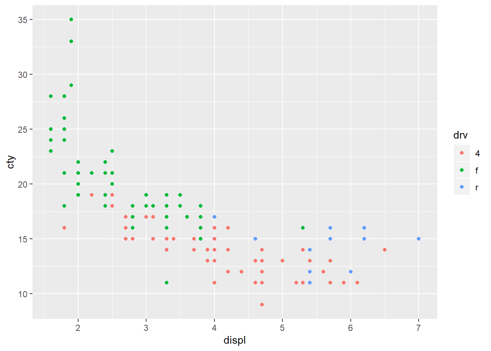

```r
ggplot(mpg, aes(x = displ, y = cty, color = drv))+
  geom_jitter()
```


```r
ggplot(mpg, aes(x = displ, y = cty, color = drv))+
  geom_beeswarm()
```

```
## Warning in f(...): The default behavior of beeswarm has changed in version
## 0.6.0. In versions <0.6.0, this plot would have been dodged on the y-
## axis. In versions >=0.6.0, grouponX=FALSE must be explicitly set to group
## on y-axis. Please set grouponX=TRUE/FALSE to avoid this warning and ensure
## proper axis choice.
```


```r
ggplot(mpg, aes(x = displ, y = cty, color = drv))+
  geom_quasirandom()
```

```
## Warning in f(...): The default behavior of beeswarm has changed in version
## 0.6.0. In versions <0.6.0, this plot would have been dodged on the y-
## axis. In versions >=0.6.0, grouponX=FALSE must be explicitly set to group
## on y-axis. Please set grouponX=TRUE/FALSE to avoid this warning and ensure
## proper axis choice.
```


`geom_jitter` is similar to `geom_point` but it provides random noise to the points. You can control these with the `width` and `height` arguments. This is valuable as it allows you to better see points that may overlap one another. `geom_beeswarm` adds variation in a uniform pattern by default across only the x-axis. `geom-quasirandom` also defaults to distributing the points across the x-axis however it produces quasi-random variation, <span style="color:green">'quasi'</span> because it looks as though points follow some interrelationship^[Would need to read documentation for details.] and if you run the plot multiple times you will get the exact same plot whereas for `geom_jitter` you will get a slightly different plot each time. To see the differences between `geom_beeswarm` and geom_quasirandom` it's helpful to look at the plots above, but holding the y value constant at 1.


```r
plot_orig <- ggplot(mpg, aes(x = displ, y = cty, color = drv))+
  geom_point()

plot_bees <- ggplot(mpg, aes(x = 1, y = cty, color = drv))+
  geom_beeswarm()

plot_quasi <- ggplot(mpg, aes(x = 1, y = cty, color = drv))+
  geom_quasirandom()

gridExtra::grid.arrange(plot_orig, plot_bees, plot_quasi, ncol = 1)
```


### 7.5.2.1.

*1. How could you rescale the count dataset above to more clearly show the distribution of cut within colour, or colour within cut?*  
  
Proportion cut in color:  (change `group_by()` to `group_by(cut, color)` to set-up the converse)

```r
cut_in_color_graph <- diamonds %>% 
  group_by(color, cut) %>% 
  summarise(n = n()) %>% 
  mutate(proportion_cut_in_color = n/sum(n)) %>%
  ggplot(aes(x = color, y = cut))+
  geom_tile(aes(fill = proportion_cut_in_color))+
  labs(fill = "proportion\ncut in color")

cut_in_color_graph
```


This makes it clear that `ideal` cuts dominate the proportions of multiple colors, not ust G ^[I though am only so-so about this visualization with `geom_tile`...]
  
*2. Use `geom_tile()` together with dplyr to explore how average flight delays vary by destination and month of year. What makes the plot difficult to read? How could you improve it?*

I improved the original graph by adding in a filter so that only destinations that received over 10000 flights were included:

```r
flights %>% 
  group_by(dest, month) %>% 
  summarise(delay_mean = mean(dep_delay, na.rm=TRUE), 
            n = n()) %>% 
  mutate(sum_n = sum(n)) %>% 
  select(dest, month, delay_mean, n, sum_n) %>% 
  as.data.frame() %>% 
  filter(dest == "ABQ") %>% 
  #the sum on n will be at the dest level here
  filter(sum_n > 30) %>% 
  ggplot(aes(x = as.factor(month), y = dest, fill = delay_mean))+
  geom_tile()
```


Another way to improve it may be to group the destinations into regions. This also will prevent you from filtering out data. We aren't given region information, but we do have lat and long points in the `airports` dataset. See [Appendix] for notes  
  
*3. Why is it slightly better to use `aes(x = color, y = cut)` rather than `aes(x = cut, y = color)` in the example above?*  

If you're comparing the proportion of cut in color and want to be looking at how the specific cut proportion is changing, it may easier to view this while looking left to right vs. down to up. Compare the two plots below.


```r
cut_in_color_graph
```


```r
cut_in_color_graph+
  coord_flip()
```


### 7.5.3

Two-d histograms

```r
smaller <- diamonds %>% 
  filter(carat < 3)

ggplot(data = smaller) +
  geom_hex(mapping = aes(x = carat, y = price))
```


```r
#can change bin number
ggplot(data = smaller) +
  geom_bin2d(mapping = aes(x = carat, y = price), bins = c(30, 30))
```


```r
# #or binwidth (roughly equivalent chart would be created)
# ggplot(data = smaller) +
#   geom_bin2d(mapping = aes(x = carat, y = price), binwidth = c(.1, 1000))
```

Binned boxplots, violins, and lvs


```r
#split by width
ggplot(smaller, aes(x = carat, y = price))+
  geom_boxplot(aes(group = cut_width(carat, 0.1)))
```


```r
#split to get approximately same number in each box with cut_number()
ggplot(smaller, aes(x = carat, y = price))+
  geom_boxplot(aes(group = cut_number(carat, 20)))
```


These methods don't seem to work quite as well with violin plots or letter value plots:

```r
##violin
ggplot(smaller, aes(x = carat, y = price))+
  geom_violin(aes(group = cut_width(carat, 0.1)))
```

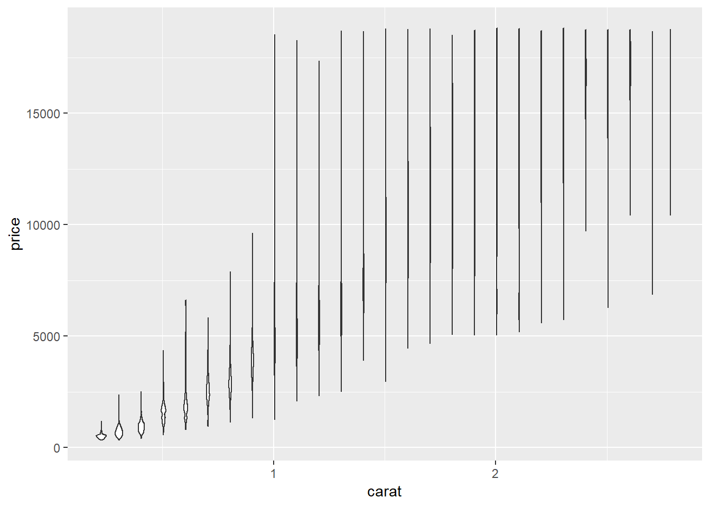

```r
ggplot(smaller, aes(x = carat, y = price))+
  geom_violin(aes(group = cut_number(carat, 20)))
```


```r
##letter value
ggplot(smaller, aes(x = carat, y = price))+
  lvplot::geom_lv(aes(group = cut_width(carat, 0.1)))
```


```r
ggplot(smaller, aes(x = carat, y = price))+
  lvplot::geom_lv(aes(group = cut_number(carat, 20)))
```

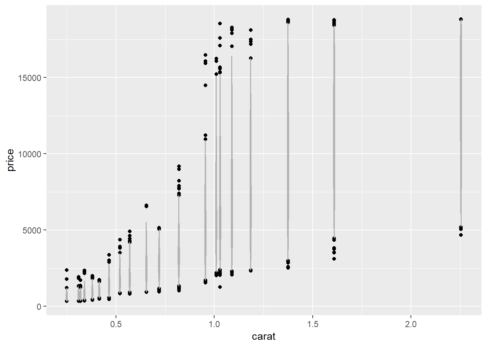

They look a little bit improved if you allow for fewer values per bin compared to the examples with `geom_boxplot()`


```r
ggplot(smaller, aes(x = carat, y = price))+
  geom_violin(aes(group = cut_number(carat, 10)))
```


```r
ggplot(smaller, aes(x = carat, y = price))+
  geom_violin(aes(group = cut_width(carat, 0.25)))
```

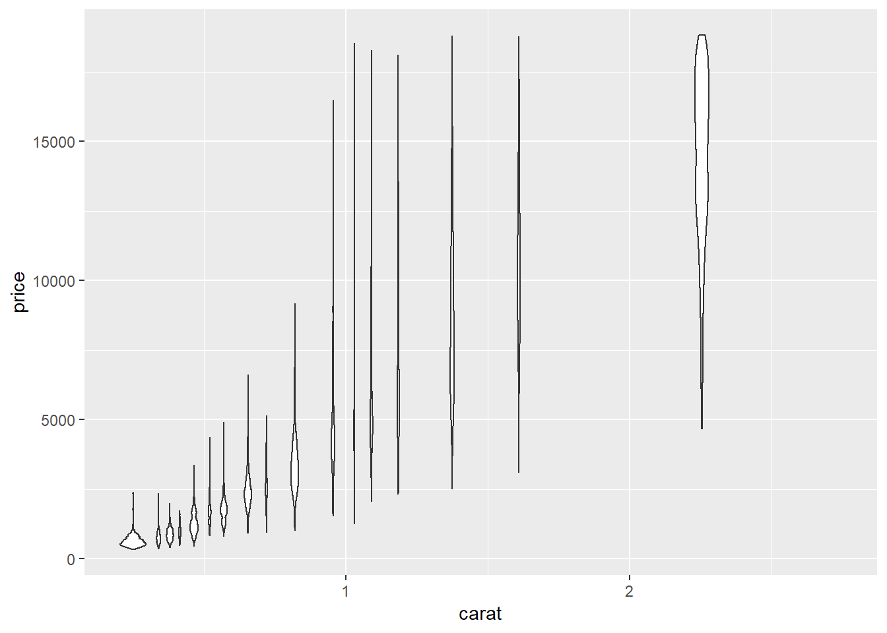

### 7.5.3.1.

*1. Instead of summarising the conditional distribution with a boxplot, you could use a frequency polygon. What do you need to consider when using `cut_width()` vs `cut_number()`? How does that impact a visualisation of the 2d distribution of carat and price?*  
  
You should keep in mind how many lines you are going to create, they may overlap each other and look busy if you're not careful.  
  

```r
ggplot(smaller, aes(x = price)) +
  geom_freqpoly(aes(colour = cut_number(carat, 10)))
```

```
## `stat_bin()` using `bins = 30`. Pick better value with `binwidth`.
```

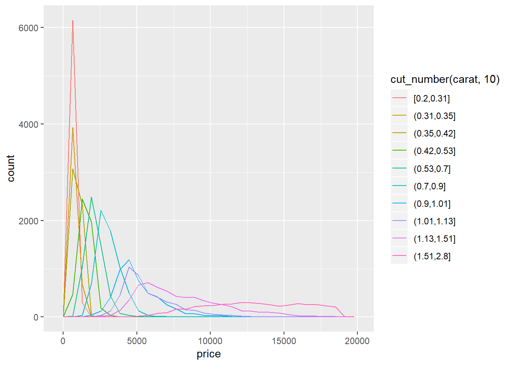

For the visualization below I wrapped it in the funciton `plotly::ggplotly()`. This funciton wraps your ggplot in html so that you can do things like hover over the points.

```r
p <- ggplot(smaller, aes(x=price))+
  geom_freqpoly(aes(colour = cut_width(carat, 0.25)))

plotly::ggplotly(p)
```

```
## `stat_bin()` using `bins = 30`. Pick better value with `binwidth`.
```

<!--html_preserve--><div id="htmlwidget-a092234a00f466fa8377" style="width:672px;height:480px;" class="plotly html-widget"></div>
<script type="application/json" data-for="htmlwidget-a092234a00f466fa8377">{"x":{"data":[{"x":[0,637.827586206897,1275.65517241379,1913.48275862069,2551.31034482759,3189.13793103448,3826.96551724138,4464.79310344828,5102.62068965517,5740.44827586207,6378.27586206897,7016.10344827586,7653.93103448276,8291.75862068965,8929.58620689655,9567.41379310345,10205.2413793103,10843.0689655172,11480.8965517241,12118.724137931,12756.5517241379,13394.3793103448,14032.2068965517,14670.0344827586,15307.8620689655,15945.6896551724,16583.5172413793,17221.3448275862,17859.1724137931,18497,19134.8275862069,19772.6551724138],"y":[0,10836,1175,8,5,0,0,0,0,0,0,0,0,0,0,0,0,0,0,0,0,0,0,0,0,0,0,0,0,0,0,0],"text":["cut_width(carat, 0.25): [0.125,0.375]<br />count:     0<br />price:     0.0000","cut_width(carat, 0.25): [0.125,0.375]<br />count: 10836<br />price:   637.8276","cut_width(carat, 0.25): [0.125,0.375]<br />count:  1175<br />price:  1275.6552","cut_width(carat, 0.25): [0.125,0.375]<br />count:     8<br />price:  1913.4828","cut_width(carat, 0.25): [0.125,0.375]<br />count:     5<br />price:  2551.3103","cut_width(carat, 0.25): [0.125,0.375]<br />count:     0<br />price:  3189.1379","cut_width(carat, 0.25): [0.125,0.375]<br />count:     0<br />price:  3826.9655","cut_width(carat, 0.25): [0.125,0.375]<br />count:     0<br />price:  4464.7931","cut_width(carat, 0.25): [0.125,0.375]<br />count:     0<br />price:  5102.6207","cut_width(carat, 0.25): [0.125,0.375]<br />count:     0<br />price:  5740.4483","cut_width(carat, 0.25): [0.125,0.375]<br />count:     0<br />price:  6378.2759","cut_width(carat, 0.25): [0.125,0.375]<br />count:     0<br />price:  7016.1034","cut_width(carat, 0.25): [0.125,0.375]<br />count:     0<br />price:  7653.9310","cut_width(carat, 0.25): [0.125,0.375]<br />count:     0<br />price:  8291.7586","cut_width(carat, 0.25): [0.125,0.375]<br />count:     0<br />price:  8929.5862","cut_width(carat, 0.25): [0.125,0.375]<br />count:     0<br />price:  9567.4138","cut_width(carat, 0.25): [0.125,0.375]<br />count:     0<br />price: 10205.2414","cut_width(carat, 0.25): [0.125,0.375]<br />count:     0<br />price: 10843.0690","cut_width(carat, 0.25): [0.125,0.375]<br />count:     0<br />price: 11480.8966","cut_width(carat, 0.25): [0.125,0.375]<br />count:     0<br />price: 12118.7241","cut_width(carat, 0.25): [0.125,0.375]<br />count:     0<br />price: 12756.5517","cut_width(carat, 0.25): [0.125,0.375]<br />count:     0<br />price: 13394.3793","cut_width(carat, 0.25): [0.125,0.375]<br />count:     0<br />price: 14032.2069","cut_width(carat, 0.25): [0.125,0.375]<br />count:     0<br />price: 14670.0345","cut_width(carat, 0.25): [0.125,0.375]<br />count:     0<br />price: 15307.8621","cut_width(carat, 0.25): [0.125,0.375]<br />count:     0<br />price: 15945.6897","cut_width(carat, 0.25): [0.125,0.375]<br />count:     0<br />price: 16583.5172","cut_width(carat, 0.25): [0.125,0.375]<br />count:     0<br />price: 17221.3448","cut_width(carat, 0.25): [0.125,0.375]<br />count:     0<br />price: 17859.1724","cut_width(carat, 0.25): [0.125,0.375]<br />count:     0<br />price: 18497.0000","cut_width(carat, 0.25): [0.125,0.375]<br />count:     0<br />price: 19134.8276","cut_width(carat, 0.25): [0.125,0.375]<br />count:     0<br />price: 19772.6552"],"type":"scatter","mode":"lines","line":{"width":1.88976377952756,"color":"rgba(248,118,109,1)","dash":"solid"},"hoveron":"points","name":"[0.125,0.375]","legendgroup":"[0.125,0.375]","showlegend":true,"xaxis":"x","yaxis":"y","hoverinfo":"text","frame":null},{"x":[0,637.827586206897,1275.65517241379,1913.48275862069,2551.31034482759,3189.13793103448,3826.96551724138,4464.79310344828,5102.62068965517,5740.44827586207,6378.27586206897,7016.10344827586,7653.93103448276,8291.75862068965,8929.58620689655,9567.41379310345,10205.2413793103,10843.0689655172,11480.8965517241,12118.724137931,12756.5517241379,13394.3793103448,14032.2068965517,14670.0344827586,15307.8620689655,15945.6896551724,16583.5172413793,17221.3448275862,17859.1724137931,18497,19134.8275862069,19772.6551724138],"y":[0,2789,5520,3758,572,95,17,11,1,0,0,0,0,0,0,0,0,0,0,0,0,0,0,0,0,0,0,0,0,0,0,0],"text":["cut_width(carat, 0.25): (0.375,0.625]<br />count:     0<br />price:     0.0000","cut_width(carat, 0.25): (0.375,0.625]<br />count:  2789<br />price:   637.8276","cut_width(carat, 0.25): (0.375,0.625]<br />count:  5520<br />price:  1275.6552","cut_width(carat, 0.25): (0.375,0.625]<br />count:  3758<br />price:  1913.4828","cut_width(carat, 0.25): (0.375,0.625]<br />count:   572<br />price:  2551.3103","cut_width(carat, 0.25): (0.375,0.625]<br />count:    95<br />price:  3189.1379","cut_width(carat, 0.25): (0.375,0.625]<br />count:    17<br />price:  3826.9655","cut_width(carat, 0.25): (0.375,0.625]<br />count:    11<br />price:  4464.7931","cut_width(carat, 0.25): (0.375,0.625]<br />count:     1<br />price:  5102.6207","cut_width(carat, 0.25): (0.375,0.625]<br />count:     0<br />price:  5740.4483","cut_width(carat, 0.25): (0.375,0.625]<br />count:     0<br />price:  6378.2759","cut_width(carat, 0.25): (0.375,0.625]<br />count:     0<br />price:  7016.1034","cut_width(carat, 0.25): (0.375,0.625]<br />count:     0<br />price:  7653.9310","cut_width(carat, 0.25): (0.375,0.625]<br />count:     0<br />price:  8291.7586","cut_width(carat, 0.25): (0.375,0.625]<br />count:     0<br />price:  8929.5862","cut_width(carat, 0.25): (0.375,0.625]<br />count:     0<br />price:  9567.4138","cut_width(carat, 0.25): (0.375,0.625]<br />count:     0<br />price: 10205.2414","cut_width(carat, 0.25): (0.375,0.625]<br />count:     0<br />price: 10843.0690","cut_width(carat, 0.25): (0.375,0.625]<br />count:     0<br />price: 11480.8966","cut_width(carat, 0.25): (0.375,0.625]<br />count:     0<br />price: 12118.7241","cut_width(carat, 0.25): (0.375,0.625]<br />count:     0<br />price: 12756.5517","cut_width(carat, 0.25): (0.375,0.625]<br />count:     0<br />price: 13394.3793","cut_width(carat, 0.25): (0.375,0.625]<br />count:     0<br />price: 14032.2069","cut_width(carat, 0.25): (0.375,0.625]<br />count:     0<br />price: 14670.0345","cut_width(carat, 0.25): (0.375,0.625]<br />count:     0<br />price: 15307.8621","cut_width(carat, 0.25): (0.375,0.625]<br />count:     0<br />price: 15945.6897","cut_width(carat, 0.25): (0.375,0.625]<br />count:     0<br />price: 16583.5172","cut_width(carat, 0.25): (0.375,0.625]<br />count:     0<br />price: 17221.3448","cut_width(carat, 0.25): (0.375,0.625]<br />count:     0<br />price: 17859.1724","cut_width(carat, 0.25): (0.375,0.625]<br />count:     0<br />price: 18497.0000","cut_width(carat, 0.25): (0.375,0.625]<br />count:     0<br />price: 19134.8276","cut_width(carat, 0.25): (0.375,0.625]<br />count:     0<br />price: 19772.6552"],"type":"scatter","mode":"lines","line":{"width":1.88976377952756,"color":"rgba(219,142,0,1)","dash":"solid"},"hoveron":"points","name":"(0.375,0.625]","legendgroup":"(0.375,0.625]","showlegend":true,"xaxis":"x","yaxis":"y","hoverinfo":"text","frame":null},{"x":[0,637.827586206897,1275.65517241379,1913.48275862069,2551.31034482759,3189.13793103448,3826.96551724138,4464.79310344828,5102.62068965517,5740.44827586207,6378.27586206897,7016.10344827586,7653.93103448276,8291.75862068965,8929.58620689655,9567.41379310345,10205.2413793103,10843.0689655172,11480.8965517241,12118.724137931,12756.5517241379,13394.3793103448,14032.2068965517,14670.0344827586,15307.8620689655,15945.6896551724,16583.5172413793,17221.3448275862,17859.1724137931,18497,19134.8275862069,19772.6551724138],"y":[0,7,110,1400,3236,1781,547,142,45,10,5,2,1,0,0,0,0,0,0,0,0,0,0,0,0,0,0,0,0,0,0,0],"text":["cut_width(carat, 0.25): (0.625,0.875]<br />count:     0<br />price:     0.0000","cut_width(carat, 0.25): (0.625,0.875]<br />count:     7<br />price:   637.8276","cut_width(carat, 0.25): (0.625,0.875]<br />count:   110<br />price:  1275.6552","cut_width(carat, 0.25): (0.625,0.875]<br />count:  1400<br />price:  1913.4828","cut_width(carat, 0.25): (0.625,0.875]<br />count:  3236<br />price:  2551.3103","cut_width(carat, 0.25): (0.625,0.875]<br />count:  1781<br />price:  3189.1379","cut_width(carat, 0.25): (0.625,0.875]<br />count:   547<br />price:  3826.9655","cut_width(carat, 0.25): (0.625,0.875]<br />count:   142<br />price:  4464.7931","cut_width(carat, 0.25): (0.625,0.875]<br />count:    45<br />price:  5102.6207","cut_width(carat, 0.25): (0.625,0.875]<br />count:    10<br />price:  5740.4483","cut_width(carat, 0.25): (0.625,0.875]<br />count:     5<br />price:  6378.2759","cut_width(carat, 0.25): (0.625,0.875]<br />count:     2<br />price:  7016.1034","cut_width(carat, 0.25): (0.625,0.875]<br />count:     1<br />price:  7653.9310","cut_width(carat, 0.25): (0.625,0.875]<br />count:     0<br />price:  8291.7586","cut_width(carat, 0.25): (0.625,0.875]<br />count:     0<br />price:  8929.5862","cut_width(carat, 0.25): (0.625,0.875]<br />count:     0<br />price:  9567.4138","cut_width(carat, 0.25): (0.625,0.875]<br />count:     0<br />price: 10205.2414","cut_width(carat, 0.25): (0.625,0.875]<br />count:     0<br />price: 10843.0690","cut_width(carat, 0.25): (0.625,0.875]<br />count:     0<br />price: 11480.8966","cut_width(carat, 0.25): (0.625,0.875]<br />count:     0<br />price: 12118.7241","cut_width(carat, 0.25): (0.625,0.875]<br />count:     0<br />price: 12756.5517","cut_width(carat, 0.25): (0.625,0.875]<br />count:     0<br />price: 13394.3793","cut_width(carat, 0.25): (0.625,0.875]<br />count:     0<br />price: 14032.2069","cut_width(carat, 0.25): (0.625,0.875]<br />count:     0<br />price: 14670.0345","cut_width(carat, 0.25): (0.625,0.875]<br />count:     0<br />price: 15307.8621","cut_width(carat, 0.25): (0.625,0.875]<br />count:     0<br />price: 15945.6897","cut_width(carat, 0.25): (0.625,0.875]<br />count:     0<br />price: 16583.5172","cut_width(carat, 0.25): (0.625,0.875]<br />count:     0<br />price: 17221.3448","cut_width(carat, 0.25): (0.625,0.875]<br />count:     0<br />price: 17859.1724","cut_width(carat, 0.25): (0.625,0.875]<br />count:     0<br />price: 18497.0000","cut_width(carat, 0.25): (0.625,0.875]<br />count:     0<br />price: 19134.8276","cut_width(carat, 0.25): (0.625,0.875]<br />count:     0<br />price: 19772.6552"],"type":"scatter","mode":"lines","line":{"width":1.88976377952756,"color":"rgba(174,162,0,1)","dash":"solid"},"hoveron":"points","name":"(0.625,0.875]","legendgroup":"(0.625,0.875]","showlegend":true,"xaxis":"x","yaxis":"y","hoverinfo":"text","frame":null},{"x":[0,637.827586206897,1275.65517241379,1913.48275862069,2551.31034482759,3189.13793103448,3826.96551724138,4464.79310344828,5102.62068965517,5740.44827586207,6378.27586206897,7016.10344827586,7653.93103448276,8291.75862068965,8929.58620689655,9567.41379310345,10205.2413793103,10843.0689655172,11480.8965517241,12118.724137931,12756.5517241379,13394.3793103448,14032.2068965517,14670.0344827586,15307.8620689655,15945.6896551724,16583.5172413793,17221.3448275862,17859.1724137931,18497,19134.8275862069,19772.6551724138],"y":[0,0,4,60,218,895,1957,2553,1647,989,832,559,421,222,202,109,85,70,42,19,12,5,2,6,9,6,2,2,3,3,0,0],"text":["cut_width(carat, 0.25): (0.875,1.12]<br />count:     0<br />price:     0.0000","cut_width(carat, 0.25): (0.875,1.12]<br />count:     0<br />price:   637.8276","cut_width(carat, 0.25): (0.875,1.12]<br />count:     4<br />price:  1275.6552","cut_width(carat, 0.25): (0.875,1.12]<br />count:    60<br />price:  1913.4828","cut_width(carat, 0.25): (0.875,1.12]<br />count:   218<br />price:  2551.3103","cut_width(carat, 0.25): (0.875,1.12]<br />count:   895<br />price:  3189.1379","cut_width(carat, 0.25): (0.875,1.12]<br />count:  1957<br />price:  3826.9655","cut_width(carat, 0.25): (0.875,1.12]<br />count:  2553<br />price:  4464.7931","cut_width(carat, 0.25): (0.875,1.12]<br />count:  1647<br />price:  5102.6207","cut_width(carat, 0.25): (0.875,1.12]<br />count:   989<br />price:  5740.4483","cut_width(carat, 0.25): (0.875,1.12]<br />count:   832<br />price:  6378.2759","cut_width(carat, 0.25): (0.875,1.12]<br />count:   559<br />price:  7016.1034","cut_width(carat, 0.25): (0.875,1.12]<br />count:   421<br />price:  7653.9310","cut_width(carat, 0.25): (0.875,1.12]<br />count:   222<br />price:  8291.7586","cut_width(carat, 0.25): (0.875,1.12]<br />count:   202<br />price:  8929.5862","cut_width(carat, 0.25): (0.875,1.12]<br />count:   109<br />price:  9567.4138","cut_width(carat, 0.25): (0.875,1.12]<br />count:    85<br />price: 10205.2414","cut_width(carat, 0.25): (0.875,1.12]<br />count:    70<br />price: 10843.0690","cut_width(carat, 0.25): (0.875,1.12]<br />count:    42<br />price: 11480.8966","cut_width(carat, 0.25): (0.875,1.12]<br />count:    19<br />price: 12118.7241","cut_width(carat, 0.25): (0.875,1.12]<br />count:    12<br />price: 12756.5517","cut_width(carat, 0.25): (0.875,1.12]<br />count:     5<br />price: 13394.3793","cut_width(carat, 0.25): (0.875,1.12]<br />count:     2<br />price: 14032.2069","cut_width(carat, 0.25): (0.875,1.12]<br />count:     6<br />price: 14670.0345","cut_width(carat, 0.25): (0.875,1.12]<br />count:     9<br />price: 15307.8621","cut_width(carat, 0.25): (0.875,1.12]<br />count:     6<br />price: 15945.6897","cut_width(carat, 0.25): (0.875,1.12]<br />count:     2<br />price: 16583.5172","cut_width(carat, 0.25): (0.875,1.12]<br />count:     2<br />price: 17221.3448","cut_width(carat, 0.25): (0.875,1.12]<br />count:     3<br />price: 17859.1724","cut_width(carat, 0.25): (0.875,1.12]<br />count:     3<br />price: 18497.0000","cut_width(carat, 0.25): (0.875,1.12]<br />count:     0<br />price: 19134.8276","cut_width(carat, 0.25): (0.875,1.12]<br />count:     0<br />price: 19772.6552"],"type":"scatter","mode":"lines","line":{"width":1.88976377952756,"color":"rgba(100,178,0,1)","dash":"solid"},"hoveron":"points","name":"(0.875,1.12]","legendgroup":"(0.875,1.12]","showlegend":true,"xaxis":"x","yaxis":"y","hoverinfo":"text","frame":null},{"x":[0,637.827586206897,1275.65517241379,1913.48275862069,2551.31034482759,3189.13793103448,3826.96551724138,4464.79310344828,5102.62068965517,5740.44827586207,6378.27586206897,7016.10344827586,7653.93103448276,8291.75862068965,8929.58620689655,9567.41379310345,10205.2413793103,10843.0689655172,11480.8965517241,12118.724137931,12756.5517241379,13394.3793103448,14032.2068965517,14670.0344827586,15307.8620689655,15945.6896551724,16583.5172413793,17221.3448275862,17859.1724137931,18497,19134.8275862069,19772.6551724138],"y":[0,0,0,0,20,34,146,379,697,694,553,423,271,245,228,186,158,123,75,50,43,30,16,12,10,9,1,4,3,2,0,0],"text":["cut_width(carat, 0.25): (1.12,1.38]<br />count:     0<br />price:     0.0000","cut_width(carat, 0.25): (1.12,1.38]<br />count:     0<br />price:   637.8276","cut_width(carat, 0.25): (1.12,1.38]<br />count:     0<br />price:  1275.6552","cut_width(carat, 0.25): (1.12,1.38]<br />count:     0<br />price:  1913.4828","cut_width(carat, 0.25): (1.12,1.38]<br />count:    20<br />price:  2551.3103","cut_width(carat, 0.25): (1.12,1.38]<br />count:    34<br />price:  3189.1379","cut_width(carat, 0.25): (1.12,1.38]<br />count:   146<br />price:  3826.9655","cut_width(carat, 0.25): (1.12,1.38]<br />count:   379<br />price:  4464.7931","cut_width(carat, 0.25): (1.12,1.38]<br />count:   697<br />price:  5102.6207","cut_width(carat, 0.25): (1.12,1.38]<br />count:   694<br />price:  5740.4483","cut_width(carat, 0.25): (1.12,1.38]<br />count:   553<br />price:  6378.2759","cut_width(carat, 0.25): (1.12,1.38]<br />count:   423<br />price:  7016.1034","cut_width(carat, 0.25): (1.12,1.38]<br />count:   271<br />price:  7653.9310","cut_width(carat, 0.25): (1.12,1.38]<br />count:   245<br />price:  8291.7586","cut_width(carat, 0.25): (1.12,1.38]<br />count:   228<br />price:  8929.5862","cut_width(carat, 0.25): (1.12,1.38]<br />count:   186<br />price:  9567.4138","cut_width(carat, 0.25): (1.12,1.38]<br />count:   158<br />price: 10205.2414","cut_width(carat, 0.25): (1.12,1.38]<br />count:   123<br />price: 10843.0690","cut_width(carat, 0.25): (1.12,1.38]<br />count:    75<br />price: 11480.8966","cut_width(carat, 0.25): (1.12,1.38]<br />count:    50<br />price: 12118.7241","cut_width(carat, 0.25): (1.12,1.38]<br />count:    43<br />price: 12756.5517","cut_width(carat, 0.25): (1.12,1.38]<br />count:    30<br />price: 13394.3793","cut_width(carat, 0.25): (1.12,1.38]<br />count:    16<br />price: 14032.2069","cut_width(carat, 0.25): (1.12,1.38]<br />count:    12<br />price: 14670.0345","cut_width(carat, 0.25): (1.12,1.38]<br />count:    10<br />price: 15307.8621","cut_width(carat, 0.25): (1.12,1.38]<br />count:     9<br />price: 15945.6897","cut_width(carat, 0.25): (1.12,1.38]<br />count:     1<br />price: 16583.5172","cut_width(carat, 0.25): (1.12,1.38]<br />count:     4<br />price: 17221.3448","cut_width(carat, 0.25): (1.12,1.38]<br />count:     3<br />price: 17859.1724","cut_width(carat, 0.25): (1.12,1.38]<br />count:     2<br />price: 18497.0000","cut_width(carat, 0.25): (1.12,1.38]<br />count:     0<br />price: 19134.8276","cut_width(carat, 0.25): (1.12,1.38]<br />count:     0<br />price: 19772.6552"],"type":"scatter","mode":"lines","line":{"width":1.88976377952756,"color":"rgba(0,189,92,1)","dash":"solid"},"hoveron":"points","name":"(1.12,1.38]","legendgroup":"(1.12,1.38]","showlegend":true,"xaxis":"x","yaxis":"y","hoverinfo":"text","frame":null},{"x":[0,637.827586206897,1275.65517241379,1913.48275862069,2551.31034482759,3189.13793103448,3826.96551724138,4464.79310344828,5102.62068965517,5740.44827586207,6378.27586206897,7016.10344827586,7653.93103448276,8291.75862068965,8929.58620689655,9567.41379310345,10205.2413793103,10843.0689655172,11480.8965517241,12118.724137931,12756.5517241379,13394.3793103448,14032.2068965517,14670.0344827586,15307.8620689655,15945.6896551724,16583.5172413793,17221.3448275862,17859.1724137931,18497,19134.8275862069,19772.6551724138],"y":[0,0,0,0,0,8,20,21,34,53,119,178,292,285,327,289,274,261,263,180,166,126,138,111,85,59,46,32,16,15,0,0],"text":["cut_width(carat, 0.25): (1.38,1.62]<br />count:     0<br />price:     0.0000","cut_width(carat, 0.25): (1.38,1.62]<br />count:     0<br />price:   637.8276","cut_width(carat, 0.25): (1.38,1.62]<br />count:     0<br />price:  1275.6552","cut_width(carat, 0.25): (1.38,1.62]<br />count:     0<br />price:  1913.4828","cut_width(carat, 0.25): (1.38,1.62]<br />count:     0<br />price:  2551.3103","cut_width(carat, 0.25): (1.38,1.62]<br />count:     8<br />price:  3189.1379","cut_width(carat, 0.25): (1.38,1.62]<br />count:    20<br />price:  3826.9655","cut_width(carat, 0.25): (1.38,1.62]<br />count:    21<br />price:  4464.7931","cut_width(carat, 0.25): (1.38,1.62]<br />count:    34<br />price:  5102.6207","cut_width(carat, 0.25): (1.38,1.62]<br />count:    53<br />price:  5740.4483","cut_width(carat, 0.25): (1.38,1.62]<br />count:   119<br />price:  6378.2759","cut_width(carat, 0.25): (1.38,1.62]<br />count:   178<br />price:  7016.1034","cut_width(carat, 0.25): (1.38,1.62]<br />count:   292<br />price:  7653.9310","cut_width(carat, 0.25): (1.38,1.62]<br />count:   285<br />price:  8291.7586","cut_width(carat, 0.25): (1.38,1.62]<br />count:   327<br />price:  8929.5862","cut_width(carat, 0.25): (1.38,1.62]<br />count:   289<br />price:  9567.4138","cut_width(carat, 0.25): (1.38,1.62]<br />count:   274<br />price: 10205.2414","cut_width(carat, 0.25): (1.38,1.62]<br />count:   261<br />price: 10843.0690","cut_width(carat, 0.25): (1.38,1.62]<br />count:   263<br />price: 11480.8966","cut_width(carat, 0.25): (1.38,1.62]<br />count:   180<br />price: 12118.7241","cut_width(carat, 0.25): (1.38,1.62]<br />count:   166<br />price: 12756.5517","cut_width(carat, 0.25): (1.38,1.62]<br />count:   126<br />price: 13394.3793","cut_width(carat, 0.25): (1.38,1.62]<br />count:   138<br />price: 14032.2069","cut_width(carat, 0.25): (1.38,1.62]<br />count:   111<br />price: 14670.0345","cut_width(carat, 0.25): (1.38,1.62]<br />count:    85<br />price: 15307.8621","cut_width(carat, 0.25): (1.38,1.62]<br />count:    59<br />price: 15945.6897","cut_width(carat, 0.25): (1.38,1.62]<br />count:    46<br />price: 16583.5172","cut_width(carat, 0.25): (1.38,1.62]<br />count:    32<br />price: 17221.3448","cut_width(carat, 0.25): (1.38,1.62]<br />count:    16<br />price: 17859.1724","cut_width(carat, 0.25): (1.38,1.62]<br />count:    15<br />price: 18497.0000","cut_width(carat, 0.25): (1.38,1.62]<br />count:     0<br />price: 19134.8276","cut_width(carat, 0.25): (1.38,1.62]<br />count:     0<br />price: 19772.6552"],"type":"scatter","mode":"lines","line":{"width":1.88976377952756,"color":"rgba(0,193,167,1)","dash":"solid"},"hoveron":"points","name":"(1.38,1.62]","legendgroup":"(1.38,1.62]","showlegend":true,"xaxis":"x","yaxis":"y","hoverinfo":"text","frame":null},{"x":[0,637.827586206897,1275.65517241379,1913.48275862069,2551.31034482759,3189.13793103448,3826.96551724138,4464.79310344828,5102.62068965517,5740.44827586207,6378.27586206897,7016.10344827586,7653.93103448276,8291.75862068965,8929.58620689655,9567.41379310345,10205.2413793103,10843.0689655172,11480.8965517241,12118.724137931,12756.5517241379,13394.3793103448,14032.2068965517,14670.0344827586,15307.8620689655,15945.6896551724,16583.5172413793,17221.3448275862,17859.1724137931,18497,19134.8275862069,19772.6551724138],"y":[0,0,0,0,0,0,0,1,6,11,9,24,34,31,57,66,68,82,68,75,62,65,46,33,29,35,25,37,26,22,0,0],"text":["cut_width(carat, 0.25): (1.62,1.88]<br />count:     0<br />price:     0.0000","cut_width(carat, 0.25): (1.62,1.88]<br />count:     0<br />price:   637.8276","cut_width(carat, 0.25): (1.62,1.88]<br />count:     0<br />price:  1275.6552","cut_width(carat, 0.25): (1.62,1.88]<br />count:     0<br />price:  1913.4828","cut_width(carat, 0.25): (1.62,1.88]<br />count:     0<br />price:  2551.3103","cut_width(carat, 0.25): (1.62,1.88]<br />count:     0<br />price:  3189.1379","cut_width(carat, 0.25): (1.62,1.88]<br />count:     0<br />price:  3826.9655","cut_width(carat, 0.25): (1.62,1.88]<br />count:     1<br />price:  4464.7931","cut_width(carat, 0.25): (1.62,1.88]<br />count:     6<br />price:  5102.6207","cut_width(carat, 0.25): (1.62,1.88]<br />count:    11<br />price:  5740.4483","cut_width(carat, 0.25): (1.62,1.88]<br />count:     9<br />price:  6378.2759","cut_width(carat, 0.25): (1.62,1.88]<br />count:    24<br />price:  7016.1034","cut_width(carat, 0.25): (1.62,1.88]<br />count:    34<br />price:  7653.9310","cut_width(carat, 0.25): (1.62,1.88]<br />count:    31<br />price:  8291.7586","cut_width(carat, 0.25): (1.62,1.88]<br />count:    57<br />price:  8929.5862","cut_width(carat, 0.25): (1.62,1.88]<br />count:    66<br />price:  9567.4138","cut_width(carat, 0.25): (1.62,1.88]<br />count:    68<br />price: 10205.2414","cut_width(carat, 0.25): (1.62,1.88]<br />count:    82<br />price: 10843.0690","cut_width(carat, 0.25): (1.62,1.88]<br />count:    68<br />price: 11480.8966","cut_width(carat, 0.25): (1.62,1.88]<br />count:    75<br />price: 12118.7241","cut_width(carat, 0.25): (1.62,1.88]<br />count:    62<br />price: 12756.5517","cut_width(carat, 0.25): (1.62,1.88]<br />count:    65<br />price: 13394.3793","cut_width(carat, 0.25): (1.62,1.88]<br />count:    46<br />price: 14032.2069","cut_width(carat, 0.25): (1.62,1.88]<br />count:    33<br />price: 14670.0345","cut_width(carat, 0.25): (1.62,1.88]<br />count:    29<br />price: 15307.8621","cut_width(carat, 0.25): (1.62,1.88]<br />count:    35<br />price: 15945.6897","cut_width(carat, 0.25): (1.62,1.88]<br />count:    25<br />price: 16583.5172","cut_width(carat, 0.25): (1.62,1.88]<br />count:    37<br />price: 17221.3448","cut_width(carat, 0.25): (1.62,1.88]<br />count:    26<br />price: 17859.1724","cut_width(carat, 0.25): (1.62,1.88]<br />count:    22<br />price: 18497.0000","cut_width(carat, 0.25): (1.62,1.88]<br />count:     0<br />price: 19134.8276","cut_width(carat, 0.25): (1.62,1.88]<br />count:     0<br />price: 19772.6552"],"type":"scatter","mode":"lines","line":{"width":1.88976377952756,"color":"rgba(0,186,222,1)","dash":"solid"},"hoveron":"points","name":"(1.62,1.88]","legendgroup":"(1.62,1.88]","showlegend":true,"xaxis":"x","yaxis":"y","hoverinfo":"text","frame":null},{"x":[0,637.827586206897,1275.65517241379,1913.48275862069,2551.31034482759,3189.13793103448,3826.96551724138,4464.79310344828,5102.62068965517,5740.44827586207,6378.27586206897,7016.10344827586,7653.93103448276,8291.75862068965,8929.58620689655,9567.41379310345,10205.2413793103,10843.0689655172,11480.8965517241,12118.724137931,12756.5517241379,13394.3793103448,14032.2068965517,14670.0344827586,15307.8620689655,15945.6896551724,16583.5172413793,17221.3448275862,17859.1724137931,18497,19134.8275862069,19772.6551724138],"y":[0,0,0,0,0,0,0,0,3,7,17,9,5,8,8,27,25,41,61,106,120,117,100,104,125,140,142,120,129,115,1,0],"text":["cut_width(carat, 0.25): (1.88,2.12]<br />count:     0<br />price:     0.0000","cut_width(carat, 0.25): (1.88,2.12]<br />count:     0<br />price:   637.8276","cut_width(carat, 0.25): (1.88,2.12]<br />count:     0<br />price:  1275.6552","cut_width(carat, 0.25): (1.88,2.12]<br />count:     0<br />price:  1913.4828","cut_width(carat, 0.25): (1.88,2.12]<br />count:     0<br />price:  2551.3103","cut_width(carat, 0.25): (1.88,2.12]<br />count:     0<br />price:  3189.1379","cut_width(carat, 0.25): (1.88,2.12]<br />count:     0<br />price:  3826.9655","cut_width(carat, 0.25): (1.88,2.12]<br />count:     0<br />price:  4464.7931","cut_width(carat, 0.25): (1.88,2.12]<br />count:     3<br />price:  5102.6207","cut_width(carat, 0.25): (1.88,2.12]<br />count:     7<br />price:  5740.4483","cut_width(carat, 0.25): (1.88,2.12]<br />count:    17<br />price:  6378.2759","cut_width(carat, 0.25): (1.88,2.12]<br />count:     9<br />price:  7016.1034","cut_width(carat, 0.25): (1.88,2.12]<br />count:     5<br />price:  7653.9310","cut_width(carat, 0.25): (1.88,2.12]<br />count:     8<br />price:  8291.7586","cut_width(carat, 0.25): (1.88,2.12]<br />count:     8<br />price:  8929.5862","cut_width(carat, 0.25): (1.88,2.12]<br />count:    27<br />price:  9567.4138","cut_width(carat, 0.25): (1.88,2.12]<br />count:    25<br />price: 10205.2414","cut_width(carat, 0.25): (1.88,2.12]<br />count:    41<br />price: 10843.0690","cut_width(carat, 0.25): (1.88,2.12]<br />count:    61<br />price: 11480.8966","cut_width(carat, 0.25): (1.88,2.12]<br />count:   106<br />price: 12118.7241","cut_width(carat, 0.25): (1.88,2.12]<br />count:   120<br />price: 12756.5517","cut_width(carat, 0.25): (1.88,2.12]<br />count:   117<br />price: 13394.3793","cut_width(carat, 0.25): (1.88,2.12]<br />count:   100<br />price: 14032.2069","cut_width(carat, 0.25): (1.88,2.12]<br />count:   104<br />price: 14670.0345","cut_width(carat, 0.25): (1.88,2.12]<br />count:   125<br />price: 15307.8621","cut_width(carat, 0.25): (1.88,2.12]<br />count:   140<br />price: 15945.6897","cut_width(carat, 0.25): (1.88,2.12]<br />count:   142<br />price: 16583.5172","cut_width(carat, 0.25): (1.88,2.12]<br />count:   120<br />price: 17221.3448","cut_width(carat, 0.25): (1.88,2.12]<br />count:   129<br />price: 17859.1724","cut_width(carat, 0.25): (1.88,2.12]<br />count:   115<br />price: 18497.0000","cut_width(carat, 0.25): (1.88,2.12]<br />count:     1<br />price: 19134.8276","cut_width(carat, 0.25): (1.88,2.12]<br />count:     0<br />price: 19772.6552"],"type":"scatter","mode":"lines","line":{"width":1.88976377952756,"color":"rgba(0,166,255,1)","dash":"solid"},"hoveron":"points","name":"(1.88,2.12]","legendgroup":"(1.88,2.12]","showlegend":true,"xaxis":"x","yaxis":"y","hoverinfo":"text","frame":null},{"x":[0,637.827586206897,1275.65517241379,1913.48275862069,2551.31034482759,3189.13793103448,3826.96551724138,4464.79310344828,5102.62068965517,5740.44827586207,6378.27586206897,7016.10344827586,7653.93103448276,8291.75862068965,8929.58620689655,9567.41379310345,10205.2413793103,10843.0689655172,11480.8965517241,12118.724137931,12756.5517241379,13394.3793103448,14032.2068965517,14670.0344827586,15307.8620689655,15945.6896551724,16583.5172413793,17221.3448275862,17859.1724137931,18497,19134.8275862069,19772.6551724138],"y":[0,0,0,0,0,0,0,0,1,3,5,7,1,3,5,0,3,9,9,15,27,33,48,39,38,46,35,52,47,38,1,0],"text":["cut_width(carat, 0.25): (2.12,2.38]<br />count:     0<br />price:     0.0000","cut_width(carat, 0.25): (2.12,2.38]<br />count:     0<br />price:   637.8276","cut_width(carat, 0.25): (2.12,2.38]<br />count:     0<br />price:  1275.6552","cut_width(carat, 0.25): (2.12,2.38]<br />count:     0<br />price:  1913.4828","cut_width(carat, 0.25): (2.12,2.38]<br />count:     0<br />price:  2551.3103","cut_width(carat, 0.25): (2.12,2.38]<br />count:     0<br />price:  3189.1379","cut_width(carat, 0.25): (2.12,2.38]<br />count:     0<br />price:  3826.9655","cut_width(carat, 0.25): (2.12,2.38]<br />count:     0<br />price:  4464.7931","cut_width(carat, 0.25): (2.12,2.38]<br />count:     1<br />price:  5102.6207","cut_width(carat, 0.25): (2.12,2.38]<br />count:     3<br />price:  5740.4483","cut_width(carat, 0.25): (2.12,2.38]<br />count:     5<br />price:  6378.2759","cut_width(carat, 0.25): (2.12,2.38]<br />count:     7<br />price:  7016.1034","cut_width(carat, 0.25): (2.12,2.38]<br />count:     1<br />price:  7653.9310","cut_width(carat, 0.25): (2.12,2.38]<br />count:     3<br />price:  8291.7586","cut_width(carat, 0.25): (2.12,2.38]<br />count:     5<br />price:  8929.5862","cut_width(carat, 0.25): (2.12,2.38]<br />count:     0<br />price:  9567.4138","cut_width(carat, 0.25): (2.12,2.38]<br />count:     3<br />price: 10205.2414","cut_width(carat, 0.25): (2.12,2.38]<br />count:     9<br />price: 10843.0690","cut_width(carat, 0.25): (2.12,2.38]<br />count:     9<br />price: 11480.8966","cut_width(carat, 0.25): (2.12,2.38]<br />count:    15<br />price: 12118.7241","cut_width(carat, 0.25): (2.12,2.38]<br />count:    27<br />price: 12756.5517","cut_width(carat, 0.25): (2.12,2.38]<br />count:    33<br />price: 13394.3793","cut_width(carat, 0.25): (2.12,2.38]<br />count:    48<br />price: 14032.2069","cut_width(carat, 0.25): (2.12,2.38]<br />count:    39<br />price: 14670.0345","cut_width(carat, 0.25): (2.12,2.38]<br />count:    38<br />price: 15307.8621","cut_width(carat, 0.25): (2.12,2.38]<br />count:    46<br />price: 15945.6897","cut_width(carat, 0.25): (2.12,2.38]<br />count:    35<br />price: 16583.5172","cut_width(carat, 0.25): (2.12,2.38]<br />count:    52<br />price: 17221.3448","cut_width(carat, 0.25): (2.12,2.38]<br />count:    47<br />price: 17859.1724","cut_width(carat, 0.25): (2.12,2.38]<br />count:    38<br />price: 18497.0000","cut_width(carat, 0.25): (2.12,2.38]<br />count:     1<br />price: 19134.8276","cut_width(carat, 0.25): (2.12,2.38]<br />count:     0<br />price: 19772.6552"],"type":"scatter","mode":"lines","line":{"width":1.88976377952756,"color":"rgba(179,133,255,1)","dash":"solid"},"hoveron":"points","name":"(2.12,2.38]","legendgroup":"(2.12,2.38]","showlegend":true,"xaxis":"x","yaxis":"y","hoverinfo":"text","frame":null},{"x":[0,637.827586206897,1275.65517241379,1913.48275862069,2551.31034482759,3189.13793103448,3826.96551724138,4464.79310344828,5102.62068965517,5740.44827586207,6378.27586206897,7016.10344827586,7653.93103448276,8291.75862068965,8929.58620689655,9567.41379310345,10205.2413793103,10843.0689655172,11480.8965517241,12118.724137931,12756.5517241379,13394.3793103448,14032.2068965517,14670.0344827586,15307.8620689655,15945.6896551724,16583.5172413793,17221.3448275862,17859.1724137931,18497,19134.8275862069,19772.6551724138],"y":[0,0,0,0,0,0,0,0,0,0,1,0,1,1,1,1,2,1,0,6,5,3,6,13,9,15,23,24,19,21,0,0],"text":["cut_width(carat, 0.25): (2.38,2.62]<br />count:     0<br />price:     0.0000","cut_width(carat, 0.25): (2.38,2.62]<br />count:     0<br />price:   637.8276","cut_width(carat, 0.25): (2.38,2.62]<br />count:     0<br />price:  1275.6552","cut_width(carat, 0.25): (2.38,2.62]<br />count:     0<br />price:  1913.4828","cut_width(carat, 0.25): (2.38,2.62]<br />count:     0<br />price:  2551.3103","cut_width(carat, 0.25): (2.38,2.62]<br />count:     0<br />price:  3189.1379","cut_width(carat, 0.25): (2.38,2.62]<br />count:     0<br />price:  3826.9655","cut_width(carat, 0.25): (2.38,2.62]<br />count:     0<br />price:  4464.7931","cut_width(carat, 0.25): (2.38,2.62]<br />count:     0<br />price:  5102.6207","cut_width(carat, 0.25): (2.38,2.62]<br />count:     0<br />price:  5740.4483","cut_width(carat, 0.25): (2.38,2.62]<br />count:     1<br />price:  6378.2759","cut_width(carat, 0.25): (2.38,2.62]<br />count:     0<br />price:  7016.1034","cut_width(carat, 0.25): (2.38,2.62]<br />count:     1<br />price:  7653.9310","cut_width(carat, 0.25): (2.38,2.62]<br />count:     1<br />price:  8291.7586","cut_width(carat, 0.25): (2.38,2.62]<br />count:     1<br />price:  8929.5862","cut_width(carat, 0.25): (2.38,2.62]<br />count:     1<br />price:  9567.4138","cut_width(carat, 0.25): (2.38,2.62]<br />count:     2<br />price: 10205.2414","cut_width(carat, 0.25): (2.38,2.62]<br />count:     1<br />price: 10843.0690","cut_width(carat, 0.25): (2.38,2.62]<br />count:     0<br />price: 11480.8966","cut_width(carat, 0.25): (2.38,2.62]<br />count:     6<br />price: 12118.7241","cut_width(carat, 0.25): (2.38,2.62]<br />count:     5<br />price: 12756.5517","cut_width(carat, 0.25): (2.38,2.62]<br />count:     3<br />price: 13394.3793","cut_width(carat, 0.25): (2.38,2.62]<br />count:     6<br />price: 14032.2069","cut_width(carat, 0.25): (2.38,2.62]<br />count:    13<br />price: 14670.0345","cut_width(carat, 0.25): (2.38,2.62]<br />count:     9<br />price: 15307.8621","cut_width(carat, 0.25): (2.38,2.62]<br />count:    15<br />price: 15945.6897","cut_width(carat, 0.25): (2.38,2.62]<br />count:    23<br />price: 16583.5172","cut_width(carat, 0.25): (2.38,2.62]<br />count:    24<br />price: 17221.3448","cut_width(carat, 0.25): (2.38,2.62]<br />count:    19<br />price: 17859.1724","cut_width(carat, 0.25): (2.38,2.62]<br />count:    21<br />price: 18497.0000","cut_width(carat, 0.25): (2.38,2.62]<br />count:     0<br />price: 19134.8276","cut_width(carat, 0.25): (2.38,2.62]<br />count:     0<br />price: 19772.6552"],"type":"scatter","mode":"lines","line":{"width":1.88976377952756,"color":"rgba(239,103,235,1)","dash":"solid"},"hoveron":"points","name":"(2.38,2.62]","legendgroup":"(2.38,2.62]","showlegend":true,"xaxis":"x","yaxis":"y","hoverinfo":"text","frame":null},{"x":[0,637.827586206897,1275.65517241379,1913.48275862069,2551.31034482759,3189.13793103448,3826.96551724138,4464.79310344828,5102.62068965517,5740.44827586207,6378.27586206897,7016.10344827586,7653.93103448276,8291.75862068965,8929.58620689655,9567.41379310345,10205.2413793103,10843.0689655172,11480.8965517241,12118.724137931,12756.5517241379,13394.3793103448,14032.2068965517,14670.0344827586,15307.8620689655,15945.6896551724,16583.5172413793,17221.3448275862,17859.1724137931,18497,19134.8275862069,19772.6551724138],"y":[0,0,0,0,0,0,0,0,0,0,0,1,0,1,1,1,2,1,1,0,0,1,1,0,2,2,1,5,1,3,0,0],"text":["cut_width(carat, 0.25): (2.62,2.88]<br />count:     0<br />price:     0.0000","cut_width(carat, 0.25): (2.62,2.88]<br />count:     0<br />price:   637.8276","cut_width(carat, 0.25): (2.62,2.88]<br />count:     0<br />price:  1275.6552","cut_width(carat, 0.25): (2.62,2.88]<br />count:     0<br />price:  1913.4828","cut_width(carat, 0.25): (2.62,2.88]<br />count:     0<br />price:  2551.3103","cut_width(carat, 0.25): (2.62,2.88]<br />count:     0<br />price:  3189.1379","cut_width(carat, 0.25): (2.62,2.88]<br />count:     0<br />price:  3826.9655","cut_width(carat, 0.25): (2.62,2.88]<br />count:     0<br />price:  4464.7931","cut_width(carat, 0.25): (2.62,2.88]<br />count:     0<br />price:  5102.6207","cut_width(carat, 0.25): (2.62,2.88]<br />count:     0<br />price:  5740.4483","cut_width(carat, 0.25): (2.62,2.88]<br />count:     0<br />price:  6378.2759","cut_width(carat, 0.25): (2.62,2.88]<br />count:     1<br />price:  7016.1034","cut_width(carat, 0.25): (2.62,2.88]<br />count:     0<br />price:  7653.9310","cut_width(carat, 0.25): (2.62,2.88]<br />count:     1<br />price:  8291.7586","cut_width(carat, 0.25): (2.62,2.88]<br />count:     1<br />price:  8929.5862","cut_width(carat, 0.25): (2.62,2.88]<br />count:     1<br />price:  9567.4138","cut_width(carat, 0.25): (2.62,2.88]<br />count:     2<br />price: 10205.2414","cut_width(carat, 0.25): (2.62,2.88]<br />count:     1<br />price: 10843.0690","cut_width(carat, 0.25): (2.62,2.88]<br />count:     1<br />price: 11480.8966","cut_width(carat, 0.25): (2.62,2.88]<br />count:     0<br />price: 12118.7241","cut_width(carat, 0.25): (2.62,2.88]<br />count:     0<br />price: 12756.5517","cut_width(carat, 0.25): (2.62,2.88]<br />count:     1<br />price: 13394.3793","cut_width(carat, 0.25): (2.62,2.88]<br />count:     1<br />price: 14032.2069","cut_width(carat, 0.25): (2.62,2.88]<br />count:     0<br />price: 14670.0345","cut_width(carat, 0.25): (2.62,2.88]<br />count:     2<br />price: 15307.8621","cut_width(carat, 0.25): (2.62,2.88]<br />count:     2<br />price: 15945.6897","cut_width(carat, 0.25): (2.62,2.88]<br />count:     1<br />price: 16583.5172","cut_width(carat, 0.25): (2.62,2.88]<br />count:     5<br />price: 17221.3448","cut_width(carat, 0.25): (2.62,2.88]<br />count:     1<br />price: 17859.1724","cut_width(carat, 0.25): (2.62,2.88]<br />count:     3<br />price: 18497.0000","cut_width(carat, 0.25): (2.62,2.88]<br />count:     0<br />price: 19134.8276","cut_width(carat, 0.25): (2.62,2.88]<br />count:     0<br />price: 19772.6552"],"type":"scatter","mode":"lines","line":{"width":1.88976377952756,"color":"rgba(255,99,182,1)","dash":"solid"},"hoveron":"points","name":"(2.62,2.88]","legendgroup":"(2.62,2.88]","showlegend":true,"xaxis":"x","yaxis":"y","hoverinfo":"text","frame":null}],"layout":{"margin":{"t":26.2283105022831,"r":7.30593607305936,"b":40.1826484018265,"l":48.9497716894977},"plot_bgcolor":"rgba(235,235,235,1)","paper_bgcolor":"rgba(255,255,255,1)","font":{"color":"rgba(0,0,0,1)","family":"","size":14.6118721461187},"xaxis":{"domain":[0,1],"automargin":true,"type":"linear","autorange":false,"range":[-1339.43793103448,21112.0931034483],"tickmode":"array","ticktext":["0","5000","10000","15000","20000"],"tickvals":[0,5000,10000,15000,20000],"categoryorder":"array","categoryarray":["0","5000","10000","15000","20000"],"nticks":null,"ticks":"outside","tickcolor":"rgba(51,51,51,1)","ticklen":3.65296803652968,"tickwidth":0.66417600664176,"showticklabels":true,"tickfont":{"color":"rgba(77,77,77,1)","family":"","size":11.689497716895},"tickangle":-0,"showline":false,"linecolor":null,"linewidth":0,"showgrid":true,"gridcolor":"rgba(255,255,255,1)","gridwidth":0.66417600664176,"zeroline":false,"anchor":"y","title":"price","titlefont":{"color":"rgba(0,0,0,1)","family":"","size":14.6118721461187},"hoverformat":".2f"},"yaxis":{"domain":[0,1],"automargin":true,"type":"linear","autorange":false,"range":[-541.8,11377.8],"tickmode":"array","ticktext":["0","3000","6000","9000"],"tickvals":[0,3000,6000,9000],"categoryorder":"array","categoryarray":["0","3000","6000","9000"],"nticks":null,"ticks":"outside","tickcolor":"rgba(51,51,51,1)","ticklen":3.65296803652968,"tickwidth":0.66417600664176,"showticklabels":true,"tickfont":{"color":"rgba(77,77,77,1)","family":"","size":11.689497716895},"tickangle":-0,"showline":false,"linecolor":null,"linewidth":0,"showgrid":true,"gridcolor":"rgba(255,255,255,1)","gridwidth":0.66417600664176,"zeroline":false,"anchor":"x","title":"count","titlefont":{"color":"rgba(0,0,0,1)","family":"","size":14.6118721461187},"hoverformat":".2f"},"shapes":[{"type":"rect","fillcolor":null,"line":{"color":null,"width":0,"linetype":[]},"yref":"paper","xref":"paper","x0":0,"x1":1,"y0":0,"y1":1}],"showlegend":true,"legend":{"bgcolor":"rgba(255,255,255,1)","bordercolor":"transparent","borderwidth":1.88976377952756,"font":{"color":"rgba(0,0,0,1)","family":"","size":11.689497716895},"y":0.96751968503937},"annotations":[{"text":"cut_width(carat, 0.25)","x":1.02,"y":1,"showarrow":false,"ax":0,"ay":0,"font":{"color":"rgba(0,0,0,1)","family":"","size":14.6118721461187},"xref":"paper","yref":"paper","textangle":-0,"xanchor":"left","yanchor":"bottom","legendTitle":true}],"hovermode":"closest","barmode":"relative"},"config":{"doubleClick":"reset","modeBarButtonsToAdd":[{"name":"Collaborate","icon":{"width":1000,"ascent":500,"descent":-50,"path":"M487 375c7-10 9-23 5-36l-79-259c-3-12-11-23-22-31-11-8-22-12-35-12l-263 0c-15 0-29 5-43 15-13 10-23 23-28 37-5 13-5 25-1 37 0 0 0 3 1 7 1 5 1 8 1 11 0 2 0 4-1 6 0 3-1 5-1 6 1 2 2 4 3 6 1 2 2 4 4 6 2 3 4 5 5 7 5 7 9 16 13 26 4 10 7 19 9 26 0 2 0 5 0 9-1 4-1 6 0 8 0 2 2 5 4 8 3 3 5 5 5 7 4 6 8 15 12 26 4 11 7 19 7 26 1 1 0 4 0 9-1 4-1 7 0 8 1 2 3 5 6 8 4 4 6 6 6 7 4 5 8 13 13 24 4 11 7 20 7 28 1 1 0 4 0 7-1 3-1 6-1 7 0 2 1 4 3 6 1 1 3 4 5 6 2 3 3 5 5 6 1 2 3 5 4 9 2 3 3 7 5 10 1 3 2 6 4 10 2 4 4 7 6 9 2 3 4 5 7 7 3 2 7 3 11 3 3 0 8 0 13-1l0-1c7 2 12 2 14 2l218 0c14 0 25-5 32-16 8-10 10-23 6-37l-79-259c-7-22-13-37-20-43-7-7-19-10-37-10l-248 0c-5 0-9-2-11-5-2-3-2-7 0-12 4-13 18-20 41-20l264 0c5 0 10 2 16 5 5 3 8 6 10 11l85 282c2 5 2 10 2 17 7-3 13-7 17-13z m-304 0c-1-3-1-5 0-7 1-1 3-2 6-2l174 0c2 0 4 1 7 2 2 2 4 4 5 7l6 18c0 3 0 5-1 7-1 1-3 2-6 2l-173 0c-3 0-5-1-8-2-2-2-4-4-4-7z m-24-73c-1-3-1-5 0-7 2-2 3-2 6-2l174 0c2 0 5 0 7 2 3 2 4 4 5 7l6 18c1 2 0 5-1 6-1 2-3 3-5 3l-174 0c-3 0-5-1-7-3-3-1-4-4-5-6z"},"click":"function(gd) { \n        // is this being viewed in RStudio?\n        if (location.search == '?viewer_pane=1') {\n          alert('To learn about plotly for collaboration, visit:\\n https://cpsievert.github.io/plotly_book/plot-ly-for-collaboration.html');\n        } else {\n          window.open('https://cpsievert.github.io/plotly_book/plot-ly-for-collaboration.html', '_blank');\n        }\n      }"}],"cloud":false},"source":"A","attrs":{"706c3df41ccf":{"colour":{},"x":{},"type":"scatter"}},"cur_data":"706c3df41ccf","visdat":{"706c3df41ccf":["function (y) ","x"]},"highlight":{"on":"plotly_click","persistent":false,"dynamic":false,"selectize":false,"opacityDim":0.2,"selected":{"opacity":1},"debounce":0},"base_url":"https://plot.ly"},"evals":["config.modeBarButtonsToAdd.0.click"],"jsHooks":[]}</script><!--/html_preserve-->
  
*2. Visualise the distribution of `carat`, partitioned by `price.`*  
  

```r
ggplot(diamonds, aes(x = price, y = carat))+
  geom_violin(aes(group = cut_width(price, 2500)))
```


  
*3. How does the `price` distribution of very large diamonds compare to small diamonds. Is it as you expect, or does it surprise you?*  
  

```r
diamonds %>% 
  mutate(percent_rank = percent_rank(carat),
         small = percent_rank < 0.025,
         large = percent_rank > 0.975) %>% 
  filter(small | large) %>% 
  ggplot(aes(large, price)) +
  geom_violin()+
  facet_wrap(~large)
```


  
Small diamonds have a left-skewed `price` distribution, large diamonds have a right skewed `price` distribution.  
  
*4. Combine two of the techniques you've learned to visualise the combined distribution of cut, carat, and price.*  


```r
ggplot(diamonds, aes(x = carat, y = price))+
  geom_jitter(aes(colour = cut), alpha = 0.2)+
  geom_smooth(aes(colour = cut))
```

```
## `geom_smooth()` using method = 'gam' and formula 'y ~ s(x, bs = "cs")'
```

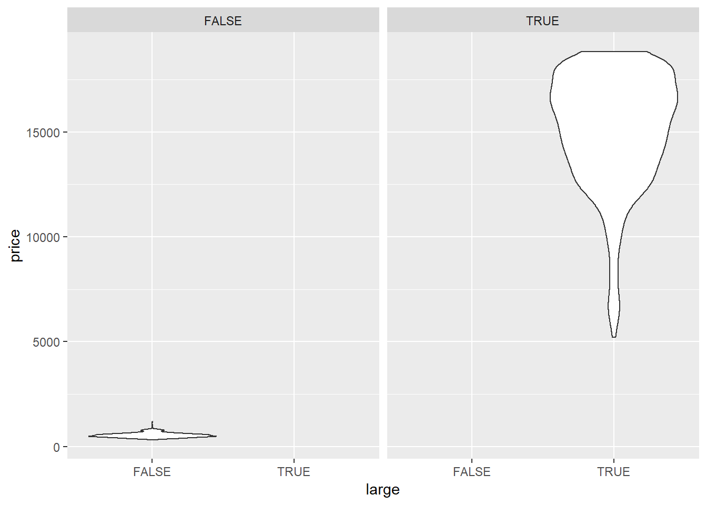

```r
ggplot(diamonds, aes(x = carat, y = price))+
  geom_boxplot(aes(group = cut_width(carat, 0.5), colour = cut))+
  facet_grid(. ~ cut)
```


```r
##I think this gives a better visualization, but is a little more complicated to produce, I also have the github version of ggplot and do not know whether the `preserve` arg is available in current CRAN installation.
diamonds %>% 
  mutate(carat = cut(carat, 5)) %>% 
  ggplot(aes(x = carat, y = price))+
  geom_boxplot(aes(group = interaction(cut_width(carat, 0.5), cut), fill = cut), position = position_dodge(preserve = "single"))
```

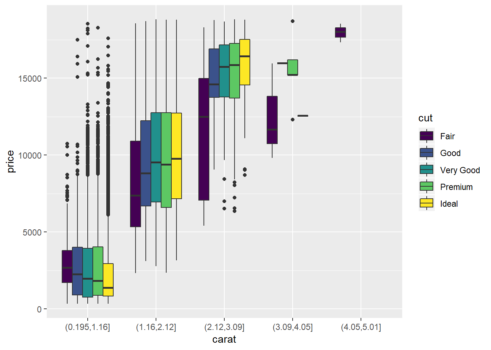
  
  
*5.Two dimensional plots reveal outliers that are not visible in one dimensional plots. For example, some points in the plot below have an unusual combination of x and y values, which makes the points outliers even though their x and y values appear normal when examined separately.*  
  

```r
ggplot(data = diamonds) +
  geom_point(mapping = aes(x = x, y = y)) +
  coord_cartesian(xlim = c(4, 11), ylim = c(4, 11))
```


  
*Why is a scatterplot a better display than a binned plot for this case?* 

Binned plots give less precise value estimates at each point (constrained by the granularity of the binning) so outliers do not show-up as clearly. They also show less precise relationships between the data. The level of variability (at least with boxplots) can also be tougher to intuit. For example, let's look at the plot below as a binned boxplot.


```r
ggplot(data = diamonds) +
  geom_boxplot(mapping = aes(x = cut_width(x, 1), y = y)) +
  coord_cartesian(xlim = c(4, 11), ylim = c(4, 11))
```


## Appendix

### 7.5.2.1.2.

Plot below shows four regions I'll split the country into. Seems like for a few destinations the lat and long points were likely misentered (probably backwards).


```r
all_states <- map_data("state")
p <- geom_polygon(data = all_states, 
                  aes(x = long, y = lat, group = group, label = NULL), 
                  colour = "white", fill = "grey10")

dest_regions <- nycflights13::airports %>% 
  mutate(lat_cut = cut(percent_rank(lat), 2, labels = c("S", "N")),
         lon_cut = cut(percent_rank(lon), 2, labels = c("W", "E")),
         quadrant = paste0(lat_cut, lon_cut)) 

point_plot <- dest_regions %>%
  ggplot(aes(lon, lat, colour = quadrant))+
  p+
  geom_point()

point_plot+
  coord_quickmap()
```

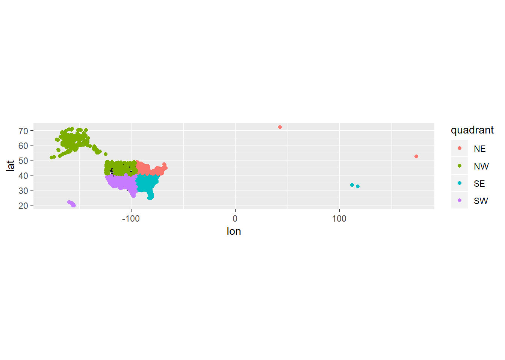

Now let's join our region information with our flight data and do our calculations grouping by `quadrant` rather than `dest`. Note that those `quadrant`s with `NA` (did not join with `flights`) looked to be Pueorto Rico or other non-state locations.

```r
flights %>% 
  left_join(dest_regions, by = c("dest" = "faa")) %>% 
  group_by(quadrant, month) %>% 
  summarise(delay_mean = mean(dep_delay, na.rm=TRUE), 
            n = n()) %>% 
  mutate(sum_n = sum(n)) %>% 
  #the sum on n will be at the dest level here
  # filter(sum_n > 10000) %>% 
  ggplot(aes(x = as.factor(month), y = quadrant, fill = delay_mean))+
  geom_tile()+
  scale_fill_gradient2(low = "blue", high = "red")
```


  
### 7.5.3.1.4.

To get the `fill` value to vary need to iterate through and make each graph seperate, can't ust use facet.

```r
diamonds_nest <- diamonds %>%
  group_by(cut) %>% 
  tidyr::nest()

plot_free <- function(df, name){
ggplot(df)+
  geom_bin2d(aes(carat, price))+
  ggtitle(name)
}

gridExtra::grid.arrange(grobs = mutate(diamonds_nest, out = purrr::map2(data, cut, plot_free))$out)
```


```r
diamonds %>% 
  mutate(cut = forcats::as_factor(as.character(cut), levels = c("Fair", "Good", "Very Good", "Premium", "Ideal"))) %>%
  # with(contrasts(cut))
  lm(log(price) ~ log(carat) + cut, data = .) %>% 
  summary()
```

```
## 
## Call:
## lm(formula = log(price) ~ log(carat) + cut, data = .)
## 
## Residuals:
##      Min       1Q   Median       3Q      Max 
## -1.52247 -0.16484 -0.00587  0.16087  1.38115 
## 
## Coefficients:
##               Estimate Std. Error t value Pr(>|t|)    
## (Intercept)   8.517337   0.001996 4267.70   <2e-16 ***
## log(carat)    1.695771   0.001910  887.68   <2e-16 ***
## cutPremium   -0.078994   0.002810  -28.11   <2e-16 ***
## cutGood      -0.153967   0.004046  -38.06   <2e-16 ***
## cutVery Good -0.076458   0.002904  -26.32   <2e-16 ***
## cutFair      -0.317212   0.006632  -47.83   <2e-16 ***
## ---
## Signif. codes:  0 '***' 0.001 '**' 0.01 '*' 0.05 '.' 0.1 ' ' 1
## 
## Residual standard error: 0.2545 on 53934 degrees of freedom
## Multiple R-squared:  0.9371,	Adjusted R-squared:  0.9371 
## F-statistic: 1.607e+05 on 5 and 53934 DF,  p-value: < 2.2e-16
```

```r
contrasts(diamonds$cut)
```

```
##              .L         .Q            .C         ^4
## [1,] -0.6324555  0.5345225 -3.162278e-01  0.1195229
## [2,] -0.3162278 -0.2672612  6.324555e-01 -0.4780914
## [3,]  0.0000000 -0.5345225 -4.095972e-16  0.7171372
## [4,]  0.3162278 -0.2672612 -6.324555e-01 -0.4780914
## [5,]  0.6324555  0.5345225  3.162278e-01  0.1195229
```

```r
count(diamonds, cut)
```

```
## # A tibble: 5 x 2
##   cut           n
##   <ord>     <int>
## 1 Fair       1610
## 2 Good       4906
## 3 Very Good 12082
## 4 Premium   13791
## 5 Ideal     21551
```
