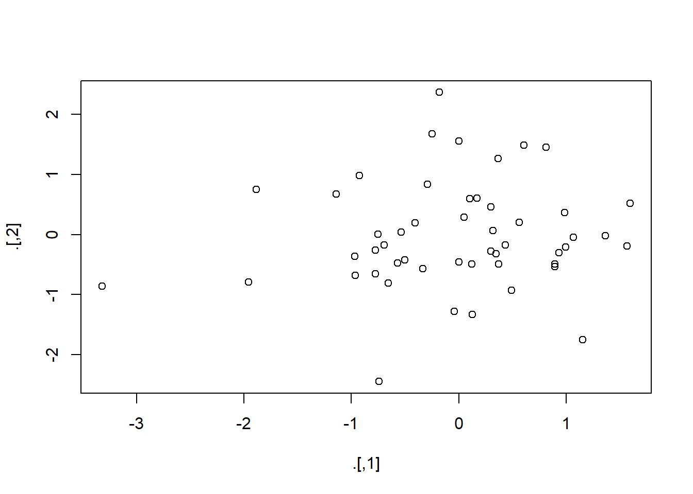

# Ch. 18: Pipes (notes only)

* `pryr::object_size` gives the memory occupied by all of its arguments (note that built-in object.size does not allow measuring multiple objects so can't see shared space). This function is actually shown in chapter 18: Pipes
* Some functions do not work naturally with the pipe.
    + If you want to use `assign` with the pipe, you must be explicit about the environment


```r
env <- environment()
assign("x", 100, envir = env)
```

* `try`, `tryCatch`, `suppressMessages`, and `suppressWarnings` from base R all also do not work well

Other pipes = 'T pipe', `%T>%` that returns left-hand side rather than right.  Will let the plot output, but then continues.  Notice that this doesn't work quite the same way for ggplot as ggplot does output something


```r
rnorm(100) %>%
  matrix(ncol = 2) %T>%
  plot() %>% 
  str()
```



```
##  num [1:50, 1:2] -0.25 -0.924 0.894 0.298 0.347 ...
```

```r
iris %>% 
  select(Sepal.Length, Sepal.Width) %T>%  
  plot() %>% 
  select(Sepal.Length) %>% 
  head(10)
```


```
##    Sepal.Length
## 1           5.1
## 2           4.9
## 3           4.7
## 4           4.6
## 5           5.0
## 6           5.4
## 7           4.6
## 8           5.0
## 9           4.4
## 10          4.9
```

* `%$%` allows you to blow out the names of the arguments, I personally prefer using the `with()` function for this instead as I find it to be a little more readable...
    * The two examples below are equivalent
  

```r
mtcars %$%
  cor(disp, mpg)
```

```
## [1] -0.8475514
```

```r
mtcars %>%
  with(cor(disp, mpg))
```

```
## [1] -0.8475514
```

