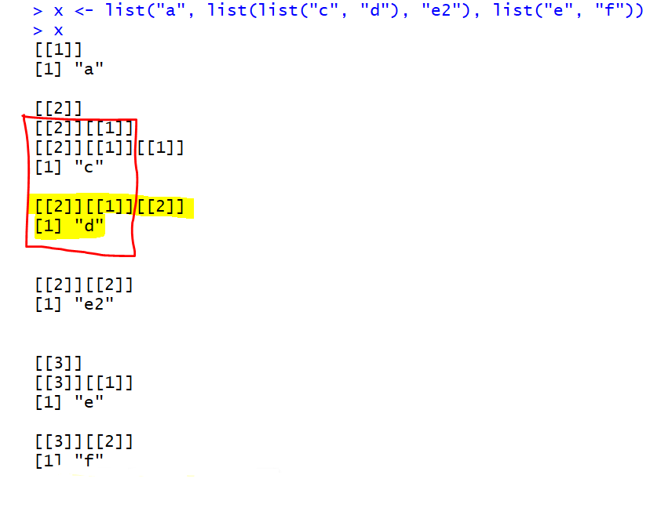

# Ch. 20: Vectors

\BeginKnitrBlock{rmdimportant}<div class="rmdimportant">**Key questions:**  
  
* 20.3.5, #1
* 20.4.6. #1, 4, 5</div>\EndKnitrBlock{rmdimportant}

\BeginKnitrBlock{rmdtip}<div class="rmdtip">**Functions and notes:**</div>\EndKnitrBlock{rmdtip}

*Types of vectors, not including augmented types:*


* Check special value types: `is.finite`, `is.infinite`, `is.na`, `is.nan`  
  
* `typeof` retruns type of vector
* `length` returns length of vector
* `pryr::object_size` view size of object stored
* specific `NA` values can be defined explicitly with `NA_integer_`, `NA_real_`, `NA_character_` (usually don't need to know)
* explicitly differentiate integers from doubles with `10L` v `10`
* explicit coersion functions: `as.logical`, `as.integer`, `as.double`, `as.character`, or use `col_[types]` when reading in so that coersion done at source
* test functions from `purrr` package that are more consistent than base R's

*Purrr versions for testing types:*

<!-- -->

* `set_names` lets you set names after the fact, e.g. `set_names(1:3, c("a", "b", "c"))`
* For more details on subsetting: http://adv-r.had.co.nz/Subsetting.html#applications 
* `str` checks structure (excellent for use with lists)
* `attr` and `attributes` get and set attributes
    * main types of attributes: **Names**, **Dimensions/dims**, **Class**. Class is important for object oriented programming which is covered in more detail here: http://adv-r.had.co.nz/OO-essentials.html#s3 
* Used together to investigate details of code for functions
    * `useMethod` in function syntax indicates it is a generic function
    * `methods` lists all methods within a generic
    * `getS3method` to show specific implementation of a method

```r
as.Date
```

```
## function (x, ...) 
## UseMethod("as.Date")
## <bytecode: 0x000000001d6f1aa0>
## <environment: namespace:base>
```

```r
methods("as.Date")
```

```
## [1] as.Date.character as.Date.default   as.Date.factor    as.Date.numeric  
## [5] as.Date.POSIXct   as.Date.POSIXlt  
## see '?methods' for accessing help and source code
```

```r
getS3method("as.Date", "default")
```

```
## function (x, ...) 
## {
##     if (inherits(x, "Date")) 
##         x
##     else if (is.logical(x) && all(is.na(x))) 
##         .Date(as.numeric(x))
##     else stop(gettextf("do not know how to convert '%s' to class %s", 
##         deparse(substitute(x)), dQuote("Date")), domain = NA)
## }
## <bytecode: 0x0000000019e1f0e8>
## <environment: namespace:base>
```

* Some tidyverse functions are not always easy to unpack with just the above^[For example try typing in `?select`, `methods("select")`, `getS3method("select", "data.frame")`, or `dplyr:::select_impl` into the console and the output may not immediately illuminate for you how `select()` works. If interested in more advanced topics, see [Advanced R Progamming](https://adv-r.hadley.nz/).]
* **Augmented vectors**: vectors with additional attributes, e.g. factors (levels, class = factors), dates and datetimes (tzone, class = (POSIXct, POSIXt)), POSIXlt (names, class = (POSIXLt, POSIXt)), tibbles (names, class = (tbl_df, tbl, data.frame), row.names) -- in the integer, double and double, list, list types.
    * data frames only have class `data.frame`, whereas tibbles have `tbl_df`, and `tbl` as well
* `class` get or set class attribute
* `unclass` returns copy with 'class' attribute removed  

## 20.3: Important types of atomic vector

### 20.3.5

1.  Describe the difference between `is.finite(x)` and  `!is.infinite(x)`.

    * `is.finite` and `is.infinite` return `FALSE` for `NA` or `NaN` values, therefore these values become `TRUE` when negated as in the latter case, e.g.:

    
    ```r
    is.finite(c(6,11,-Inf, NA, NaN))
    ```
    
    ```
    ## [1]  TRUE  TRUE FALSE FALSE FALSE
    ```
    
    ```r
    !is.infinite(c(6,11,-Inf, NA, NaN))
    ```
    
    ```
    ## [1]  TRUE  TRUE FALSE  TRUE  TRUE
    ```


1.  Read the source code for `dplyr::near()` (Hint: to see the source code, drop the `()`). How does it work? 

    * safer way to test equality of floating point numbers (as has some tolerance for differences caused by rounding)
    * it checks if the difference between the value is within `tol` which by default is `.Machine$double.eps^0.5`

1.  A logical vector can take 3 possible values. How many possible values can an integer vector take? How many possible values can a double take? Use google to do some research.

    * Part of the point here is that it's not 'infinite' like someone may be tempted to answer -- it's constrained by memory of the machine
    * For integer it is 2 * 2 * 10^9
    * For double it is 2 * 2 * 10^308

1.  Brainstorm at least four functions that allow you to convert a double to an integer. How do they differ? Be precise.
    
    * `as.integer`, `as.factor` (technically is going to a factor -- but this class is built on top of integers), `round`, `floor`, `ceiling`, these last 3 though do not change the type, which would remain a type double
    
1.  What functions from the `readr` package allow you to turn a string into logical, integer, and double vector?
    
    * The appropriate `parse_*` or `col_*` functions

## 20.4: Using atomic vectors

### 20.4.6

1.  What does `mean(is.na(x))` tell you about a vector `x`? What about `sum(!is.finite(x))`?

    * percentage that are `NA` or `NaN`
    * number that are either `Inf`, `-Inf`, `NA` or `NaN`
    

1.  Carefully read the documentation of `is.vector()`. What does it actually test for? Why does `is.atomic()` not agree with the definition of atomic vectors above?
    
    * `is.vector` tests if it is a specific type of vector with no attributes other than names. This second requirement means that any augmented vectors such as factors, dates, tibbles all would return false.
    * `is.atomic` returns TRUE to `is.atomic(NULL)` despite this representing the empty set.
      
    
1.  Compare and contrast `setNames()` with `purrr::set_names()`.

    * both assign names after fact
    * `purrr::set_names` is stricter and returns an error in situations like the following where as `setNames` does not:
    
    
    ```r
    setNames(1:4, c("a"))
    ```
    
    ```
    ##    a <NA> <NA> <NA> 
    ##    1    2    3    4
    ```
    
    ```r
    set_names(1:4, c("a")) 
    ```
    
    ```
    ## Error: `nm` must be `NULL` or a character vector the same length as `x`
    ```
    

1.  Create functions that take a vector as input and returns:

    
    ```r
    x <- c(-3:14, NA, Inf, NaN)
    ```
    
    1. The last value.  Should you use `[` or `[[`?

    
    ```r
    return_last <- function(x) x[[length(x)]]
    
    return_last(x)
    ```
    
    ```
    ## [1] NaN
    ```

    1. The elements at even numbered positions.
    
    
    ```r
    return_even <- function(x) x[((1:length(x)) %% 2 == 0)]
    
    return_even(x)
    ```
    
    ```
    ##  [1]  -2   0   2   4   6   8  10  12  14 Inf
    ```
    
    
    1. Every element except the last value.
    
    ```r
    return_not_last <- function(x) x[-length(x)]
    
    return_not_last(x)
    ```
    
    ```
    ##  [1]  -3  -2  -1   0   1   2   3   4   5   6   7   8   9  10  11  12  13
    ## [18]  14  NA Inf
    ```

    
    1. Only even numbers (and no missing values).
    
    ```r
    #only even and not na
    return_even_no_na <- function(x) x[((1:length(x)) %% 2 == 0) & !is.na(x)]
    
    return_even_no_na(x)
    ```
    
    ```
    ##  [1]  -2   0   2   4   6   8  10  12  14 Inf
    ```


1.  Why is `x[-which(x > 0)]` not the same as `x[x <= 0]`? 

    
    ```r
    x[-which(x > 0)]  #which only reports the indices of the matches, so specifies all to be removed
    ```
    
    ```
    ## [1]  -3  -2  -1   0  NA NaN
    ```
    
    ```r
    x[x <= 0]  #This method reports T/F'sNaN is converted into NA
    ```
    
    ```
    ## [1] -3 -2 -1  0 NA NA
    ```

    * in the 2nd instance, `NaN`s will get converted to `NA`
    

1.  What happens when you subset with a positive integer that's bigger than the length of the vector? What happens when you subset with a name that doesn't exist?
    
    * In both cases you get back an `NA` (though it seems to take longer in the case when subsetting by a name that doesn't exist).
    
## 20.5: Recursive vectors (lists)

Example of subsetting items from a list:

```r
a <- list(a = 1:3, b = "a string", c = pi, d = list(c(-1,-2), -5))

a[[4]][[1]]
```

```
## [1] -1 -2
```

```r
# equivalent alternatives:
# a$d[[1]]
# a[4][[1]][[1]]
```

* 3 ways of subsetting `[]`, `[[]]`, `$`

### 20.5.4.

```r
a <- list(a = 1:3, b = "a string", c = pi, d = list(-1, -5))
```

1.  Draw the following lists as nested sets:

    1.  `list(a, b, list(c, d), list(e, f))`
    1.  `list(list(list(list(list(list(a))))))`

    * I did not conform with Hadley's square v rounded syntax, but hopefully this gives a sense of what the above are:
    
    
    
1.  What happens if you subset a tibble as if you're subsetting a list? What are the key differences between a list and a tibble?
    
    * Dataframe is just a list of vectors (columns) -- with the restriction that each column has the same number of elements whereas lists do not have this requirement
    * Dataframe structure better connects elements by row structure, making subsetting by the qualities of these values much easier
    
## 20.7: Augmented vectors

### 20.7.4

1.  What does `hms::hms(3600)` return? 

    
    ```r
    x <- hms::hms(3600)
    ```
    
    How does it print? 
    
    ```r
    print(x)
    ```
    
    ```
    ## 01:00:00
    ```
    
    What primitive type is the augmented vector built on top of? 
    
    ```r
    typeof(x)
    ```
    
    ```
    ## [1] "double"
    ```
    
    What attributes does it use?
    
    ```r
    attributes(x)
    ```
    
    ```
    ## $class
    ## [1] "hms"      "difftime"
    ## 
    ## $units
    ## [1] "secs"
    ```

    
1.  Try and make a tibble that has columns with different lengths. What happens?
    
    * if the column is length one it will repeat for the length of the other column(s), otherwise if it is not the same length it will return an error
    
    ```r
    tibble(x = 1:4, y = 5:6)  #error
    ```
    
    ```
    ## Error: Tibble columns must have consistent lengths, only values of length one are recycled:
    ## * Length 2: Column `y`
    ## * Length 4: Column `x`
    ```
    
    ```r
    tibble(x = 1:5, y = 6)  #can have length 1 that repeats
    ```
    
    ```
    ## # A tibble: 5 x 2
    ##       x     y
    ##   <int> <dbl>
    ## 1     1     6
    ## 2     2     6
    ## 3     3     6
    ## 4     4     6
    ## 5     5     6
    ```

1.  Based on the definition above, is it ok to have a list as a
    column of a tibble?
    
    * Yes, as long as the number of elements align with the other length of the other columns -- this will come-up a lot in the modeling chapters.
  
## Appendix 

### Subsetting nested lists    


```r
x <- list("a", list(list("c", "d"), "e2"), list("e", "f"))
x
```

```
## [[1]]
## [1] "a"
## 
## [[2]]
## [[2]][[1]]
## [[2]][[1]][[1]]
## [1] "c"
## 
## [[2]][[1]][[2]]
## [1] "d"
## 
## 
## [[2]][[2]]
## [1] "e2"
## 
## 
## [[3]]
## [[3]][[1]]
## [1] "e"
## 
## [[3]][[2]]
## [1] "f"
```

It can be confusing how to subset items in a nested list, lists output helps tell you the subsetting needed to extract particular items. For example, to output `list("c", "d")` requires `x[[2]][[1]]`, to output just `d` requires `x[[2]][[1]][[2]]`

*Subset nested lists:*


