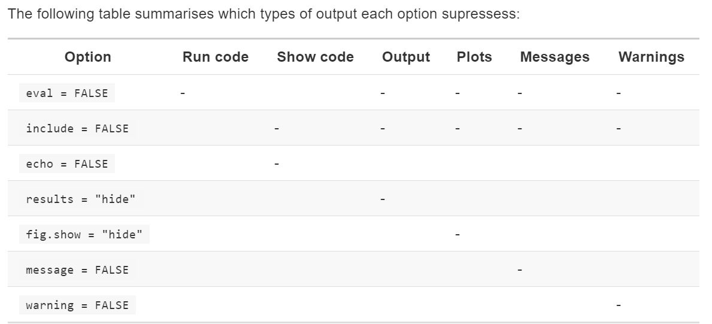

*Make sure the following packages are installed:*  


# ch. 27: R Markdown

* shortcut for inserting code chunk is cmd/ctrl+alt+i
* shortcut for running entire code chunks: cmd/ctrl+shift+enter
* chunk options
    * chunk name is first part after type of code in chunk, e.g. code chunk by name: `"```{r by-name}"`
    * `eval = FALSE` show example output code, but don't evaluate
    * `include = FALSE` evaluate code but don't show code or output
    * `echo = FALSE` is for when you just want the output but not the code itself
    * `message = FALSE` or `warning = False` prevents messages or warnings appearing in the finished line
    * `error = TRUE` causes code to render even if there is an error
    * `results = 'hide'` hides printied output and `fig.show = 'hide'` hides plots
        * allows you to hide particular bits of output


    * `cache = TRUE` save output of chunk to separate folder (speeds-up rendering)
    * `dependson = "chunk_name"` update chunk if dependency changes
    * `cache.extra` if output from function changes, will re-render -- useful for if you only want to update if for example a file changes, e.g.
    

```r
rawdata <- readr::read_csv("a_very_large_file.csv")
```

* good idea to name code chunks after main object created
* `knitr::clean_cache` clear out your caches
* `knitr::opts_chunk` use to change knitting options
    * e.g.
    
    ```r
    # when writing books and tutorials
    knitr::opts_chunk$set(
      comment = "#>",
      collapse = TRUE
    )
    
    # hiding code for report
    knitr::opts_chunk$set(
      echo = FALSE
    )
    # may also set `message = FALSE` and `warning = FALSE`
    ```

* `rmarkdown::render` programmatically knit documents
    * e.g. `rmarkdown::render("27-r-markdown.Rmd", output_format = "all")` to render all formats in YAML header
* `knitr::kable` to make dataframe more visible for printing when knitting
    * also see `xtable`, `stargazer`, `pander`, `tables`, and `ascii` packages
* `format` helpful when inserting numbers into texts, e.g.

```r
comma <- function(x) format(x, digits = 2, big.mark = ",")
comma(3452345)
```

```
## [1] "3,452,345"
```

```r
comma(.12358124331)
```

```
## [1] "0.12"
```
* Use `params:` in YAML header to add in specific values or create parameterized reports, e.g.
```
params:
  start: !r lubridate::ymd("2015-01-01")
  snapshot: !r lubridate::ymd_hms("2015-01-01 12:30:00")
```
* Full chunk options here: https://yihui.name/knitr/options/ 

## 27.2 R Markdown basics

### 27.2.1

1.  Create a new notebook using _File > New File > R Notebook_. Read the 
    instructions. Practice running the chunks. Verify that you can modify
    the code, re-run it, and see modified output.
    
    Done seperately.
    
1.  Create a new R Markdown document with _File > New File > R Markdown..._
    Knit it by clicking the appropriate button. Knit it by using the 
    appropriate keyboard short cut. Verify that you can modify the
    input and see the output update.
    
    Done seperately.
    
1.  Compare and contrast the R notebook and R markdown files you created
    above. How are the outputs similar? How are they different? How are
    the inputs similar? How are they different? What happens if you
    copy the YAML header from one to the other?
    
    * Both by default have code chunks display 'in-line' while working, though with RMD can force to not output in-line.
    * When rendering, default of notebooks will be to render whichever chunks have been rendered during interactive session, whereas RMD document needs directions from code chunk options
        + I generally prefer .Rmd files to notebooks ^[I've found some of my company's security software sometimes acts-up when working interactively if I have my chunk output in-line (just slows down).  Hence, I 'uncheck' `Show output inline for all Rmarkdown documents` from `Tools`-->`Global Options` -->`Appearance`.].

1.  Create one new R Markdown document for each of the three built-in
    formats: HTML, PDF and Word. Knit each of the three documents.
    How does the output differ? How does the input differ? (You may need
    to install LaTeX in order to build the PDF output --- RStudio will
    prompt you if this is necessary.)
    
    Done seperately. HTML does not have page numbers. Plots or other outputs with interactive components will often only be viewable from html (e.g. flexdashboard, plotly, ...). Some input options will work across all formats, e.g. `toc: true`, however other options like code folding may be specific to a format, e.g. code folding will only work with html.
    
## 27.3: Text formatting with Markdown

*Print file from Hadley's github page with commmon formatting:*

```r
cat(readr::read_file("https://raw.githubusercontent.com/hadley/r4ds/master/rmarkdown/markdown.Rmd"))
```

*Other notes*
The following will actually run in the console when knitted (and not in the knitted document):

```
summary(mpg)
```

### 27.3.1

1.  Practice what you've learned by creating a brief CV. The title should be
    your name, and you should include headings for (at least) education or
    employment. Each of the sections should include a bulleted list of
    jobs/degrees. Highlight the year in bold.
    
*this is a weak example (see __ for better examples):*
    
__CV of Bryan Shalloway__
---
_###-###-####_

## Experience
NetApp, Data Scientist | _2017-present_ 
---|---
__Durham__ |

Education Pioneers, Analyst | _2015-2016_ 
-|-
__Denver__ |

Teach for America, High School Math | _2013-2015_ 
-|-
__Durham__ |

## Education
IAA, MS | _2017_  
-|-
    + Advanced Analytics

WashU in STL, AB | _2012_  
-|-
    + Major: Cognitive Neuroscience
    + Minor: Political Science
    + Minor: American Culture Studies
    
2.  Using the R Markdown quick reference, figure out how to:

    1.  Add a footnote.
    
Here is a foonote reference[^1] and another [^2] and a 3rd[^3] and an in-line one^[Superb fourth footnote.]

[^1]: Here is the foonote.

[^2]: 
  here's one with multiple blocks.  
  boo ya this is an awesome foonote.  
  don't you believe it!

[^3]: and the third

    
    2.  Add a horizontal rule.
    
---

A [linked phrase][id].

[id]: http://example.com/ "Title"

---

pagebreaks above and below (AKA horizontal rules)

***

    3.  Add a block quote.

>There is no spoon.  
-Matrix
    
3.  Copy and paste the contents of `diamond-sizes.Rmd` from
    <https://github.com/hadley/r4ds/tree/master/rmarkdown> in to a local
    R markdown document. Check that you can run it, then add text after the 
    frequency polygon that describes its most striking features.

    <!-- -->

* It's interesting that the count of number of diamonds spikes at whole numbers...

## 27.4: Code chunks

### 27.4.7

1.  Add a section that explores how diamond sizes vary by cut, colour,
    and clarity. Assume you're writing a report for someone who doesn't know
    R, and instead of setting `echo = FALSE` on each chunk, set a global 
    option.
    
    * put this into a code chunk:
    ```
    knitr::opts_chunk$set(echo = FALSE)
    ```
1.  Download `diamond-sizes.Rmd` from
    <https://github.com/hadley/r4ds/tree/master/rmarkdown>. Add a section
    that describes the largest 20 diamonds, including a table that displays
    their most important attributes.
    
    
    ```r
    diamonds %>% 
      filter(min_rank(-carat) <= 20) %>% 
      select(starts_with("c")) %>% 
      knitr::kable(caption = "The four C's of the 20 biggest diamonds")
    ```
    
    
    
    Table: (\#tab:unnamed-chunk-5)The four C's of the 20 biggest diamonds
    
     carat  cut         color   clarity 
    ------  ----------  ------  --------
      3.01  Premium     I       I1      
      3.11  Fair        J       I1      
      3.01  Premium     F       I1      
      3.05  Premium     E       I1      
      3.02  Fair        I       I1      
      3.01  Fair        H       I1      
      3.65  Fair        H       I1      
      3.24  Premium     H       I1      
      3.22  Ideal       I       I1      
      3.50  Ideal       H       I1      
      3.01  Premium     G       SI2     
      4.01  Premium     I       I1      
      4.01  Premium     J       I1      
      3.04  Very Good   I       SI2     
      3.40  Fair        D       I1      
      4.00  Very Good   I       I1      
      3.01  Ideal       J       SI2     
      3.67  Premium     I       I1      
      3.01  Ideal       J       I1      
      4.13  Fair        H       I1      
      5.01  Fair        J       I1      
      3.01  Premium     I       SI2     
      3.01  Fair        I       SI2     
      3.01  Fair        I       SI2     
      3.01  Good        I       SI2     
      3.01  Good        I       SI2     
      4.50  Fair        J       I1      
      3.04  Premium     I       SI2     
      3.01  Good        H       SI2     
      3.51  Premium     J       VS2     
      3.01  Premium     J       SI2     
      3.01  Premium     J       SI2     
    
1.  Modify `diamonds-sizes.Rmd` to use `comma()` to produce nicely
    formatted output. Also include the percentage of diamonds that are
    larger than 2.5 carats.
    
    
    ```r
    diamonds %>% 
      summarise(`proportion big` = (sum(carat > 2.5) / n()) %>% 
                  comma()) %>% 
      knitr::kable()
    ```
    
    
    
    |proportion big |
    |:--------------|
    |0.0023         |
    
1.  Set up a network of chunks where `d` depends on `c` and `b`, and
    both `b` and `c` depend on `a`. Have each chunk print `lubridate::now()`,
    set `cache = TRUE`, then verify your understanding of caching.
    

```r
lubridate::now()
```

```
## [1] "2019-05-24 16:12:01 EDT"
```
    

```r
lubridate::now()
```

```
## [1] "2019-05-24 16:12:02 EDT"
```


```r
lubridate::now()
```

```
## [1] "2019-05-24 16:12:02 EDT"
```


```r
lubridate::now()
```

```
## [1] "2019-05-24 16:12:02 EDT"
```

